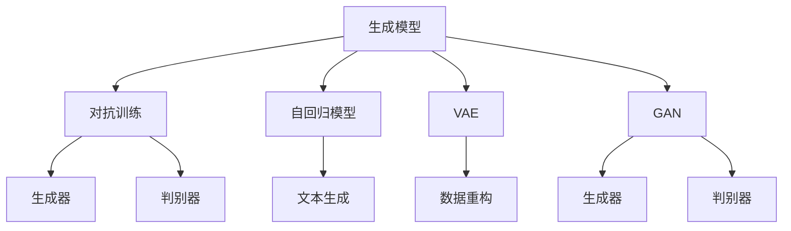

                 

# 第十四章：高级主题：生成式人工智能

## 1. 背景介绍

### 1.1 问题由来

生成式人工智能（Generative AI）是当前AI领域的前沿技术之一，通过利用大量数据训练模型，使其能够生成新的、具有创造性的内容。近年来，随着深度学习技术的进步和计算资源的丰富，生成式AI在图像、语音、文本等领域取得了显著的进展。其中，基于神经网络的生成模型（如GAN、VAE、Transformer）已经成为主流，被广泛应用于图像生成、语音合成、文本创作等领域。

生成式AI的核心是利用机器学习算法从大量数据中学习到数据的分布规律，并利用这些规律生成新的数据样本。其应用场景包括但不限于：自动生成新闻稿件、创作艺术作品、生成对话、虚拟现实（VR）与增强现实（AR）等领域。

### 1.2 问题核心关键点

生成式AI的关键点在于如何设计有效的模型架构，选择适当的训练数据和优化方法，以及如何评估生成内容的质量。

- **模型架构**：不同的生成模型有不同的架构设计，如GAN使用生成器和判别器，VAE使用编码器和解码器，Transformer则采用自回归方式生成文本。
- **训练数据**：生成模型需要大量的训练数据来捕捉数据的复杂分布，同时也需要精心设计的噪声样本来促进模型的泛化能力。
- **优化方法**：常用的优化算法包括梯度下降、对抗训练等，优化过程需要精细调参。
- **质量评估**：评估生成内容的质量是生成式AI的重要挑战之一，通常使用人类评价、自动化评估等方法。

## 2. 核心概念与联系

### 2.1 核心概念概述

生成式AI涉及多个核心概念，包括生成模型、对抗训练、自回归模型、变分自编码器（VAE）、生成对抗网络（GAN）等。这些概念之间存在紧密的联系，共同构成了生成式AI的技术框架。

- **生成模型**：使用神经网络等方法，从数据分布中生成新的数据样本。
- **对抗训练**：在训练过程中，使用一个生成器和一个判别器相互博弈，生成器目标是生成与真实数据难以区分的样本，判别器目标是区分生成样本和真实样本，两者交替优化以提高生成质量。
- **自回归模型**：以文本生成为例，自回归模型通过先前生成的文本来预测下一个词或字符，如基于RNN、LSTM、Transformer的文本生成模型。
- **VAE**：通过编码器将数据映射到低维空间，再通过解码器将低维数据重构回高维数据，实现数据的生成和重构。
- **GAN**：使用生成器和判别器，生成器目标是生成与真实数据相似的样本，判别器目标是区分生成样本和真实样本，两者交替优化以提高生成质量。

### 2.2 核心概念原理和架构的 Mermaid 流程图



这个流程图展示了生成式AI的核心概念及其之间的关系：

1. **生成模型**：基础模块，通过学习数据分布生成新数据。
2. **对抗训练**：通过生成器生成假样本，判别器鉴别真伪，两者相互博弈提升生成质量。
3. **自回归模型**：利用序列间关系生成文本等序列数据。
4. **VAE**：通过编码-解码过程实现数据的生成与重构。
5. **GAN**：生成器和判别器相互博弈生成高质量样本。

这些核心概念共同构建了生成式AI的技术基础，为应用提供了多种工具和算法。

## 3. 核心算法原理 & 具体操作步骤

### 3.1 算法原理概述

生成式AI的核心算法原理主要基于深度学习模型，通过学习数据分布来生成新的数据样本。常用的算法包括生成对抗网络（GAN）、变分自编码器（VAE）、自回归模型等。

生成对抗网络（GAN）由生成器和判别器两个神经网络组成，通过对抗训练不断优化两个网络的结构和参数，使得生成器能够生成高质量的假样本，判别器能够有效区分真伪样本。

变分自编码器（VAE）通过将数据映射到低维空间，再通过解码器将低维数据重构回高维数据，实现数据的生成和重构。VAE的关键在于如何设计编码器和解码器的结构和损失函数，以实现数据的有效压缩和重构。

自回归模型则是利用序列间的关系，通过预测序列中的下一个元素来生成整个序列。自回归模型通常使用RNN、LSTM或Transformer等架构，通过先前的样本预测下一个样本。

### 3.2 算法步骤详解

以生成对抗网络（GAN）为例，介绍其具体操作步骤：

1. **初始化**：定义生成器和判别器的结构，如卷积神经网络（CNN）、循环神经网络（RNN）等。
2. **训练数据准备**：准备训练数据集，通常使用大规模的数据集，如ImageNet等。
3. **对抗训练**：通过交替优化生成器和判别器，生成器目标是生成高质量的假样本，判别器目标是区分真伪样本。
4. **损失函数设计**：设计损失函数，如生成器的损失函数、判别器的损失函数等。
5. **模型优化**：使用梯度下降等优化算法，最小化损失函数，优化模型参数。
6. **生成器测试**：测试生成器的生成能力，评估生成样本的质量。

### 3.3 算法优缺点

生成对抗网络（GAN）的优点在于能够生成高质量的假样本，适用于图像生成、视频生成等场景。但GAN也存在一些缺点：

- **训练不稳定**：GAN训练过程中，生成器和判别器的对抗性博弈可能会导致训练不稳定，需要精心调参。
- **模式崩溃**：GAN容易出现模式崩溃现象，生成样本中某些模式会消失，导致生成的样本质量不稳定。
- **计算成本高**：GAN需要大量的计算资源进行训练和测试，特别是在高分辨率图像生成中。

### 3.4 算法应用领域

生成对抗网络（GAN）、变分自编码器（VAE）等生成模型已经广泛应用于多个领域：

- **图像生成**：如生成逼真的人脸、风景等图像。
- **视频生成**：如生成逼真的视频帧，用于影视制作、动画生成等。
- **自然语言生成**：如生成逼真的文本对话、文章等。
- **艺术创作**：如生成音乐、艺术作品等。
- **虚拟现实与增强现实**：如生成虚拟角色、环境等，用于VR/AR体验。

## 4. 数学模型和公式 & 详细讲解 & 举例说明

### 4.1 数学模型构建

以生成对抗网络（GAN）为例，介绍其数学模型构建过程：

- **生成器**：定义生成器的结构，通常使用卷积神经网络（CNN）等。
- **判别器**：定义判别器的结构，通常使用卷积神经网络（CNN）等。
- **损失函数**：定义生成器损失函数和判别器损失函数。

生成器损失函数通常包含两种部分：

1. **重构损失**：通过将生成样本重构回原始数据，计算重构误差。
2. **对抗损失**：通过将生成样本通过判别器，计算判别器输出结果。

判别器损失函数通常包含两种部分：

1. **真样本损失**：通过将真实样本通过判别器，计算判别器输出结果。
2. **假样本损失**：通过将生成样本通过判别器，计算判别器输出结果。

### 4.2 公式推导过程

以生成对抗网络（GAN）为例，推导其核心公式：

- **生成器损失函数**：
  $$
  L_G = \mathbb{E}_{x \sim p_x} [\log D(x)] + \mathbb{E}_{z \sim p_z} [\log (1 - D(G(z)))]
  $$
- **判别器损失函数**：
  $$
  L_D = \mathbb{E}_{x \sim p_x} [\log D(x)] + \mathbb{E}_{z \sim p_z} [\log (1 - D(G(z)))]
  $$

其中，$G$ 为生成器，$D$ 为判别器，$x$ 为真实样本，$z$ 为噪声样本，$p_x$ 为真实样本分布，$p_z$ 为噪声样本分布。

### 4.3 案例分析与讲解

以图像生成为例，展示生成对抗网络（GAN）的应用：

1. **数据准备**：准备图像数据集，如MNIST、CIFAR-10等。
2. **模型构建**：构建生成器和判别器，如使用卷积神经网络（CNN）。
3. **训练过程**：交替优化生成器和判别器，通过对抗训练不断提升生成质量。
4. **结果评估**：评估生成样本的质量，如通过人类评价、自动化评估等方法。

## 5. 项目实践：代码实例和详细解释说明

### 5.1 开发环境搭建

为了实现生成式AI项目，需要搭建相应的开发环境：

1. **安装Python**：下载并安装Python 3.x版本。
2. **安装PyTorch**：通过pip安装PyTorch，支持GPU加速。
3. **安装TensorBoard**：用于可视化训练过程。
4. **安装HuggingFace Transformers库**：支持常用的生成模型，如GAN、VAE等。

### 5.2 源代码详细实现

以生成对抗网络（GAN）为例，展示代码实现过程：

```python
import torch
import torch.nn as nn
import torch.optim as optim
import torchvision
import torchvision.transforms as transforms
from torch.autograd.variable import Variable

# 定义生成器结构
class Generator(nn.Module):
    def __init__(self):
        super(Generator, self).__init__()
        self.main = nn.Sequential(
            nn.ConvTranspose2d(100, 256, 4, 1, 0, bias=False),
            nn.BatchNorm2d(256),
            nn.ReLU(True),
            nn.ConvTranspose2d(256, 128, 4, 2, 1, bias=False),
            nn.BatchNorm2d(128),
            nn.ReLU(True),
            nn.ConvTranspose2d(128, 64, 4, 2, 1, bias=False),
            nn.BatchNorm2d(64),
            nn.ReLU(True),
            nn.ConvTranspose2d(64, 1, 4, 2, 1, bias=False),
            nn.Tanh()
        )

    def forward(self, input):
        return self.main(input)

# 定义判别器结构
class Discriminator(nn.Module):
    def __init__(self):
        super(Discriminator, self).__init__()
        self.main = nn.Sequential(
            nn.Conv2d(1, 64, 4, 2, 1, bias=False),
            nn.LeakyReLU(0.2, inplace=True),
            nn.Conv2d(64, 128, 4, 2, 1, bias=False),
            nn.BatchNorm2d(128),
            nn.LeakyReLU(0.2, inplace=True),
            nn.Conv2d(128, 256, 4, 2, 1, bias=False),
            nn.BatchNorm2d(256),
            nn.LeakyReLU(0.2, inplace=True),
            nn.Conv2d(256, 1, 4, 1, 0, bias=False),
            nn.Sigmoid()
        )

    def forward(self, input):
        return self.main(input)

# 定义优化器
def get_optimizer(model, learning_rate):
    return optim.Adam(model.parameters(), lr=learning_rate)

# 定义损失函数
def get_loss_function():
    return nn.BCELoss()

# 数据准备
transform = transforms.Compose([
    transforms.Resize((28, 28)),
    transforms.ToTensor(),
    transforms.Normalize((0.5,), (0.5,))
])

train_data = torchvision.datasets.MNIST(root='./data', train=True, transform=transform, download=True)
train_loader = torch.utils.data.DataLoader(train_data, batch_size=100, shuffle=True)

# 模型初始化
generator = Generator()
discriminator = Discriminator()

# 损失函数和优化器
loss_function = get_loss_function()
optimizer_G = get_optimizer(generator, 0.0002)
optimizer_D = get_optimizer(discriminator, 0.0002)

# 训练过程
for epoch in range(100):
    for i, (images, _) in enumerate(train_loader):
        batch_size = images.size(0)
        real_images = Variable(images)
        real_labels = Variable(torch.ones(batch_size, 1))

        # 生成器训练
        optimizer_G.zero_grad()
        generated_images = generator(real_images)
        fake_labels = Variable(torch.zeros(batch_size, 1))
        gan_loss_G = loss_function(discriminator(generated_images), fake_labels)
        gradient_penalty = calculate_gradient_penalty(discriminator, real_images, generated_images)
        gan_loss_G += gradient_penalty
        gan_loss_G.backward()
        optimizer_G.step()

        # 判别器训练
        optimizer_D.zero_grad()
        real_output = discriminator(real_images)
        fake_output = discriminator(generated_images)
        real_loss_D = loss_function(real_output, real_labels)
        fake_loss_D = loss_function(fake_output, fake_labels)
        d_loss = (real_loss_D + fake_loss_D) / 2
        d_loss.backward()
        optimizer_D.step()

    if (epoch + 1) % 10 == 0:
        print('Epoch: %d/%d' % (epoch + 1, 100))
        print('GAN Loss: %.4f' % gan_loss_G.item())

# 生成样本
with torch.no_grad():
    fixed_noise = Variable(torch.randn(64, 100))
    fake_images = generator(fixed_noise)
```

### 5.3 代码解读与分析

在代码实现中，我们使用了生成对抗网络（GAN）的基本结构，包括生成器和判别器。通过对抗训练不断优化生成器和判别器的结构，生成高质量的假样本。以下是代码的详细解读：

1. **生成器定义**：通过nn.Sequential定义生成器的层次结构，包括卷积转置层、批量归一化层、ReLU激活函数等。
2. **判别器定义**：通过nn.Sequential定义判别器的层次结构，包括卷积层、批量归一化层、LeakyReLU激活函数等。
3. **优化器和损失函数**：使用Adam优化器，计算生成器损失和判别器损失，通过BCELoss计算二分类交叉熵。
4. **数据准备**：使用torchvision库准备训练数据集，并定义数据转换。
5. **模型初始化**：定义生成器和判别器的实例，并设置优化器和损失函数。
6. **训练过程**：通过对抗训练，交替优化生成器和判别器。

## 6. 实际应用场景

### 6.1 智能内容生成

生成式AI在智能内容生成方面具有广泛应用。例如，利用生成对抗网络（GAN）可以生成逼真的图像、音乐、视频等，用于影视制作、广告宣传等领域。通过生成自然语言文本，可以自动生成新闻稿件、文章、对话等，提升内容创作效率。

### 6.2 虚拟现实与增强现实

生成式AI在虚拟现实（VR）和增强现实（AR）中也有广泛应用。例如，生成逼真的虚拟角色、场景和物品，用于构建虚拟现实游戏和模拟训练场景。通过生成实时动画和音效，提升虚拟现实和增强现实的用户体验。

### 6.3 数据增强

生成式AI可以用于数据增强，提升模型训练效果。例如，利用生成对抗网络（GAN）生成伪造数据，用于训练分类、检测等模型。通过生成新的样本，可以避免过拟合现象，提高模型泛化能力。

## 7. 工具和资源推荐

### 7.1 学习资源推荐

为了帮助开发者系统掌握生成式AI的理论基础和实践技巧，这里推荐一些优质的学习资源：

1. 《Deep Learning Specialization》：由Coursera提供的深度学习课程，涵盖生成对抗网络（GAN）、变分自编码器（VAE）等生成模型。
2. 《Generative Adversarial Networks with PyTorch》：使用PyTorch实现生成对抗网络（GAN）的实战教程。
3. 《Neural Networks and Deep Learning》：深度学习入门书籍，涵盖生成模型和优化算法等内容。
4. 《Image Super-Resolution Using Deep Learning》：使用深度学习实现图像超分辨率的教程。
5. 《Sequence to Sequence Learning with Neural Networks》：使用深度学习实现文本生成和翻译的教程。

通过对这些资源的学习实践，相信你一定能够快速掌握生成式AI的精髓，并用于解决实际的生成问题。

### 7.2 开发工具推荐

高效的开发离不开优秀的工具支持。以下是几款用于生成式AI开发的常用工具：

1. PyTorch：基于Python的开源深度学习框架，灵活动态的计算图，适合快速迭代研究。
2. TensorFlow：由Google主导开发的开源深度学习框架，生产部署方便，适合大规模工程应用。
3. HuggingFace Transformers库：支持生成对抗网络（GAN）、变分自编码器（VAE）等生成模型，提供便捷的API接口。
4. TensorBoard：TensorFlow配套的可视化工具，可实时监测模型训练状态，并提供丰富的图表呈现方式。
5. OpenAI Codex：支持自然语言生成、代码生成等任务，提供丰富的API接口和示例代码。

合理利用这些工具，可以显著提升生成式AI的开发效率，加快创新迭代的步伐。

### 7.3 相关论文推荐

生成式AI的研究源于学界的持续研究。以下是几篇奠基性的相关论文，推荐阅读：

1. Generative Adversarial Nets：Ian Goodfellow等人在ICML 2014年发表的生成对抗网络（GAN）论文，奠定了GAN的理论基础。
2. Variational Autoencoders：Kingma和Welling在ICLR 2013年发表的变分自编码器（VAE）论文，提出了VAE的基本架构和优化方法。
3. Attention is All You Need：Vaswani等人在NeurIPS 2017年发表的Transformer论文，提出了自回归生成模型。
4. Denoising Autoencoders with AdaGrad for Image Restoration：Alain和LeCun在ICML 2006年发表的变分自编码器（VAE）论文，提出了VAE的基本架构和优化方法。
5. Generative Adversarial Networks for Music Composition：Tamme和Riihivouri在ICASSP 2018年发表的生成对抗网络（GAN）论文，展示了GAN在音乐生成中的应用。

这些论文代表了大规模AI生成模型的发展脉络。通过学习这些前沿成果，可以帮助研究者把握学科前进方向，激发更多的创新灵感。

## 8. 总结：未来发展趋势与挑战

### 8.1 总结

本文对生成式人工智能（Generative AI）进行了全面系统的介绍。首先阐述了生成式AI的研究背景和意义，明确了生成式AI在生成逼真图像、音乐、文本等方面的重要应用。其次，从原理到实践，详细讲解了生成对抗网络（GAN）、变分自编码器（VAE）等核心算法的原理和操作步骤，给出了生成式AI项目开发的完整代码实例。同时，本文还广泛探讨了生成式AI在多个行业领域的应用前景，展示了生成式AI的广泛潜力。

通过本文的系统梳理，可以看到，生成式AI技术正在成为AI领域的重要范式，极大地拓展了人工智能的应用边界，催生了更多的落地场景。得益于深度学习技术的进步和计算资源的丰富，生成式AI的应用领域和效果将不断扩大和提升。

### 8.2 未来发展趋势

展望未来，生成式AI将呈现以下几个发展趋势：

1. **生成质量提升**：生成对抗网络（GAN）等生成模型将不断优化，生成样本的质量将进一步提升，实现更逼真、更具有创造性的内容。
2. **应用场景拓展**：生成式AI将在更多领域得到应用，如自动创作、内容生成、虚拟现实等。
3. **模型自动化设计**：利用自动化模型设计工具，简化生成模型的构建过程，降低开发门槛。
4. **多模态生成**：生成式AI将从单一模态向多模态发展，支持图像、语音、文本等多种类型的数据生成。
5. **跨领域迁移**：生成式AI将与其他AI技术进行更深入的融合，如知识图谱、因果推理等，提升系统的智能水平。

### 8.3 面临的挑战

尽管生成式AI已经取得了瞩目成就，但在迈向更加智能化、普适化应用的过程中，仍面临诸多挑战：

1. **训练成本高**：生成对抗网络（GAN）等生成模型需要大量计算资源进行训练，资源消耗大。
2. **生成质量不稳定**：生成模型容易出现模式崩溃等现象，生成样本的质量不稳定。
3. **生成样本可控性不足**：生成模型生成的样本缺乏控制，难以满足特定的需求。
4. **伦理与安全问题**：生成模型可能生成有害、误导性内容，带来伦理与安全问题。

### 8.4 研究展望

面对生成式AI所面临的挑战，未来的研究需要在以下几个方面寻求新的突破：

1. **低资源生成**：研究如何在有限的计算资源下训练高质量的生成模型，降低训练成本。
2. **生成样本可控性**：研究如何设计生成模型的约束条件，提升生成样本的可控性和多样性。
3. **模型鲁棒性**：研究如何提升生成模型的鲁棒性，避免生成样本的不稳定和模式崩溃现象。
4. **伦理与安全保障**：研究生成模型的伦理与安全保障机制，确保生成的内容符合道德标准，避免有害信息的传播。

这些研究方向的探索，必将引领生成式AI技术迈向更高的台阶，为构建更加智能、安全、可控的AI系统铺平道路。面向未来，生成式AI技术还需要与其他AI技术进行更深入的融合，如知识图谱、因果推理、强化学习等，多路径协同发力，共同推动生成式AI技术的进步。只有勇于创新、敢于突破，才能不断拓展生成式AI的边界，让AI技术更好地服务于人类社会。

## 9. 附录：常见问题与解答

**Q1：生成式AI与传统的生成模型有何区别？**

A: 生成式AI与传统的生成模型（如RNN、VAE等）的区别在于，生成式AI使用深度学习模型进行生成，可以生成更高质量、更具有创造性的内容。传统的生成模型通常使用简单的统计模型，生成的样本质量和创造性较差。

**Q2：生成式AI在训练过程中如何避免过拟合？**

A: 生成式AI在训练过程中，容易发生过拟合现象，导致生成样本质量下降。常用的避免过拟合的方法包括：

1. **数据增强**：通过回译、近义替换等方式扩充训练集。
2. **正则化**：使用L2正则、Dropout等正则化技术。
3. **对抗训练**：引入对抗样本，提升模型的鲁棒性。
4. **模型剪枝**：通过剪枝、量化等技术减小模型尺寸，提高泛化能力。

这些方法可以有效提升生成式AI的训练效果，避免过拟合现象。

**Q3：生成式AI在实际应用中如何评估生成样本的质量？**

A: 生成式AI在实际应用中，评估生成样本的质量至关重要。常用的评估方法包括：

1. **人类评价**：通过人工评价生成样本的质量，给出综合评分。
2. **自动化评估**：使用自动化指标（如Inception Score、FID等）评估生成样本的生成质量。
3. **任务适配性**：通过评估生成样本在特定任务上的表现，衡量其适用性。
4. **对比实验**：将生成样本与真实样本进行对比，评估其与真实样本的相似度。

综合以上方法，可以全面评估生成式AI的生成效果。

**Q4：生成式AI在实际应用中如何处理生成样本的可控性问题？**

A: 生成式AI在实际应用中，生成样本的可控性问题是一个重要的挑战。常用的处理方法包括：

1. **控制生成条件**：通过控制生成条件（如噪声、条件向量等），实现对生成样本的精细控制。
2. **模型约束**：在设计模型时引入约束条件，限制生成样本的范围和质量。
3. **后处理技术**：通过后处理技术，如去除噪声、去重等，提升生成样本的可控性。

通过以上方法，可以有效提升生成式AI的生成样本的可控性和多样性。

---

作者：禅与计算机程序设计艺术 / Zen and the Art of Computer Programming

