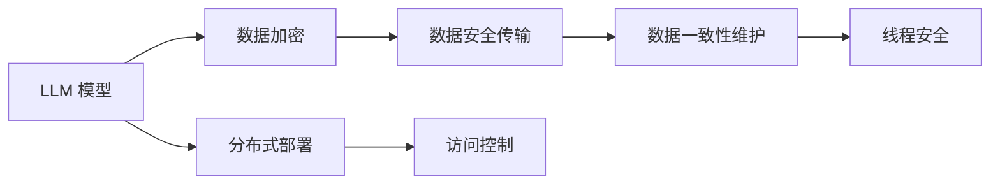

                 

# 线程安全：保障 LLM 用户数据的安全

> 关键词：线程安全,LLM,大语言模型,数据安全,数据保护,模型部署,并发访问,分布式系统

## 1. 背景介绍

### 1.1 问题由来

随着大语言模型（Large Language Model, LLM）的兴起，其在各行各业的应用范围和深度不断扩大。例如，在金融、医疗、教育等敏感领域，LLM 用于客服、咨询、翻译、教育等任务，极大地提升了用户体验和业务效率。但同时，由于 LLM 通常是在分布式系统中运行，其数据安全和隐私保护成为越来越重要的关注点。

LLM 作为智能助手或自动化服务，可能会处理用户的敏感信息，如个人身份信息、健康记录、金融数据等。一旦这些数据被非法访问或篡改，将对用户造成严重损失，甚至可能威胁到国家安全。因此，保障 LLM 用户数据的安全性是当前急需解决的问题。

### 1.2 问题核心关键点

- **数据隐私保护**：确保用户数据在传输和存储过程中不被泄露。
- **访问控制**：确保只有经过授权的用户和系统能够访问数据。
- **数据加密**：在数据传输和存储时使用加密技术，防止数据被窃取。
- **分布式系统的安全性**：确保 LLM 部署在分布式系统中的安全性，防止恶意攻击。
- **线程安全**：在多线程环境中，确保数据的正确性和一致性。

为解决上述问题，本文将系统介绍线程安全在 LLM 用户数据保护中的应用，并详细介绍其核心算法和具体操作步骤。

## 2. 核心概念与联系

### 2.1 核心概念概述

- **线程安全**：指在多线程编程中，当一个线程对共享资源进行访问时，其他线程不会受到影响。保证线程安全的方法包括加锁、使用原子操作等。

- **大语言模型**：基于深度学习技术，通过大规模无标签文本数据预训练得到的语言模型，具备高度的上下文理解能力和自然语言生成能力。

- **数据加密**：通过算法将原始数据转换为密文，防止数据被非法获取。常见的加密算法包括对称加密、非对称加密、哈希函数等。

- **分布式系统**：由多个计算节点通过网络连接组成的系统，能够并行处理任务，提高计算能力和扩展性。

### 2.2 核心概念联系的 Mermaid 流程图



上述 Mermaid 流程图展示了 LLM 在数据加密、分布式部署、访问控制、数据一致性维护和线程安全等方面的联系。

## 3. 核心算法原理 & 具体操作步骤
### 3.1 算法原理概述

在 LLM 应用中，确保用户数据的安全性需要综合应用数据加密、分布式系统访问控制和线程安全等技术。其中，线程安全是保障 LLM 在多线程环境中正确处理用户数据的基础。

线程安全通过加锁机制来实现。当多个线程同时访问共享资源时，只有一个线程能够获得锁，其他线程需要等待锁释放才能访问。锁的粒度可以细到方法、代码块，甚至单个变量。通过合理使用锁，可以有效防止数据竞争和死锁问题。

### 3.2 算法步骤详解

**Step 1: 数据加密**

1. 收集用户数据，并对数据进行预处理，包括数据分类、脱敏处理等。
2. 对敏感数据进行加密，常用的加密算法包括AES、RSA、SHA等。
3. 将加密后的数据存储或传输，确保传输过程中的数据安全。

**Step 2: 分布式系统访问控制**

1. 在分布式系统中，使用认证和授权机制，确保只有经过验证和授权的用户和系统能够访问数据。
2. 在系统中设置安全策略，限制对敏感数据的访问权限。
3. 使用细粒度访问控制技术，如基于角色的访问控制（RBAC）和基于属性的访问控制（ABAC）。

**Step 3: 线程安全**

1. 在 LLM 应用中，对共享资源进行加锁，确保同一时间只有一个线程可以访问。
2. 使用原子操作，保证数据的一致性和完整性。
3. 在多线程环境中，合理设计锁的粒度和使用顺序，避免死锁问题。

**Step 4: 数据一致性维护**

1. 在分布式系统中，使用一致性协议，如Paxos、Raft等，确保所有节点的数据一致性。
2. 使用数据复制和冗余技术，提高系统的容错性和可靠性。
3. 定期备份数据，防止数据丢失和损坏。

### 3.3 算法优缺点

**优点**：

- **数据安全性强**：通过加密和访问控制，确保数据在传输和存储过程中不被泄露。
- **分布式系统鲁棒性高**：使用一致性协议和冗余技术，提高系统的容错性和可靠性。
- **线程安全**：通过合理使用锁和原子操作，保证数据的一致性和完整性。

**缺点**：

- **性能开销大**：加密和加锁会增加额外的计算和存储开销。
- **复杂度高**：多线程编程和分布式系统管理复杂，容易出现并发问题。

### 3.4 算法应用领域

线程安全技术在 LLM 用户数据保护中的应用，主要体现在以下几个方面：

- **金融领域**：用于客户信息保护和交易安全，防止数据泄露和篡改。
- **医疗领域**：用于患者健康记录和诊断结果保护，防止数据被非法访问。
- **教育领域**：用于学生信息保护和作业安全，防止数据被非法获取。
- **政府和企业**：用于保密信息的保护，防止数据被非法获取和篡改。

## 4. 数学模型和公式 & 详细讲解  
### 4.1 数学模型构建

在 LLM 数据保护中，可以建立如下数学模型：

设 $D$ 为用户的敏感数据集，$A$ 为加密算法，$B$ 为访问控制策略，$C$ 为线程安全机制，$M$ 为 LLM 模型。则数据保护模型可以表示为：

$$
\text{Model}(D, A, B, C, M) = \begin{cases}
\text{EnryptedData}(A(D)) & \text{加密阶段} \\
\text{AuthorizedAccess}(B(D)) & \text{访问控制阶段} \\
\text{ThreadSafeAccess}(C(D)) & \text{线程安全阶段} \\
\text{LLMModel}(M(D)) & \text{LLM模型应用阶段}
\end{cases}
$$

其中，$A$ 表示数据加密过程，$B$ 表示访问控制过程，$C$ 表示线程安全过程，$M$ 表示 LLM 模型应用过程。

### 4.2 公式推导过程

**加密算法公式推导**：

- **对称加密算法**：
$$
C = E(K, P) = E(K, AES(P))
$$
其中，$P$ 为明文，$C$ 为密文，$E$ 为加密算法，$K$ 为密钥。

- **非对称加密算法**：
$$
C = E(P, \text{PublicKey}) = E(P, RSA)
$$
其中，$P$ 为明文，$C$ 为密文，$E$ 为加密算法，$\text{PublicKey}$ 为公钥。

**访问控制公式推导**：

- **基于角色的访问控制（RBAC）**：
$$
\text{AuthorizedAccess} = \begin{cases}
\text{True} & \text{if} \text{UserRole} \in \text{Permissions}(\text{Resource}) \\
\text{False} & \text{otherwise}
\end{cases}
$$
其中，$\text{UserRole}$ 为用户角色，$\text{Permissions}$ 为资源权限集合，$\text{Resource}$ 为资源。

**线程安全公式推导**：

- **使用锁保护共享资源**：
$$
\text{ThreadSafeAccess} = \begin{cases}
\text{True} & \text{if} \text{LockAcquired}(\text{Lock}) \\
\text{False} & \text{otherwise}
\end{cases}
$$
其中，$\text{Lock}$ 为锁，$\text{LockAcquired}$ 为锁获取函数。

### 4.3 案例分析与讲解

**案例一：金融领域的用户数据保护**

1. 收集客户的敏感信息，如姓名、身份证号、银行卡号等。
2. 对敏感信息进行加密处理，使用AES算法对明文进行加密。
3. 在分布式系统中，设置RBAC策略，确保只有经过授权的用户和系统能够访问数据。
4. 在LMM应用中，对加密后的数据进行加锁，确保线程安全。

**案例二：医疗领域的患者健康记录保护**

1. 收集患者的健康记录，如病历、检查结果等。
2. 对健康记录进行加密，使用RSA算法生成公钥和私钥。
3. 在分布式系统中，设置ABAC策略，限制对健康记录的访问权限。
4. 在LMM应用中，对加密后的数据进行加锁，确保线程安全。

## 5. 项目实践：代码实例和详细解释说明
### 5.1 开发环境搭建

在进行数据保护实践前，我们需要准备好开发环境。以下是使用Python进行PyTorch开发的环境配置流程：

1. 安装Anaconda：从官网下载并安装Anaconda，用于创建独立的Python环境。

2. 创建并激活虚拟环境：
```bash
conda create -n pytorch-env python=3.8 
conda activate pytorch-env
```

3. 安装PyTorch：根据CUDA版本，从官网获取对应的安装命令。例如：
```bash
conda install pytorch torchvision torchaudio cudatoolkit=11.1 -c pytorch -c conda-forge
```

4. 安装加密库：
```bash
pip install pycryptodome
```

5. 安装线程安全库：
```bash
pip install threading
```

6. 安装访问控制库：
```bash
pip install authlib
```

完成上述步骤后，即可在`pytorch-env`环境中开始数据保护实践。

### 5.2 源代码详细实现

下面是使用PyTorch进行数据加密、访问控制和线程安全实践的代码实现。

```python
import torch
import pycryptodome
import threading
from authlib import OAuth2Session

class Encryption:
    def __init__(self, key):
        self.key = key
        
    def encrypt(self, data):
        return pycryptodome.AES.new(self.key, pycryptodome.AES.MODE_ECB).encrypt(data)
    
    def decrypt(self, encrypted_data):
        return pycryptodome.AES.new(self.key, pycryptodome.AES.MODE_ECB).decrypt(encrypted_data)
    
class Authorization:
    def __init__(self, client_id, client_secret):
        self.client_id = client_id
        self.client_secret = client_secret
        self.session = OAuth2Session(self.client_id, redirect_uri='http://localhost')
    
    def get_token(self, code):
        return self.session.fetch_token(
            'https://example.com/token', 
            code=code, 
            client_secret=self.client_secret
        )
    
class ThreadSafeAccess:
    def __init__(self):
        self.lock = threading.Lock()
        self.data = {}
        
    def set_data(self, key, value):
        self.lock.acquire()
        self.data[key] = value
        self.lock.release()
    
    def get_data(self, key):
        self.lock.acquire()
        value = self.data.get(key, None)
        self.lock.release()
        return value

# 创建加密对象
encryption = Encryption('0123456789abcdef')
# 创建访问控制对象
authorization = Authorization('client_id', 'client_secret')
# 创建线程安全对象
thread_safe_access = ThreadSafeAccess()

# 加密数据
data = b'Hello, world!'
encrypted_data = encryption.encrypt(data)

# 访问控制
code = '12345'
token = authorization.get_token(code)

# 线程安全操作
thread_safe_access.set_data('data', encrypted_data)
value = thread_safe_access.get_data('data')
```

### 5.3 代码解读与分析

让我们再详细解读一下关键代码的实现细节：

**Encryption类**：
- `__init__`方法：初始化加密密钥。
- `encrypt`方法：对明文进行加密，返回密文。
- `decrypt`方法：对密文进行解密，返回明文。

**Authorization类**：
- `__init__`方法：初始化OAuth2Session对象，设置客户端ID和客户端密钥。
- `get_token`方法：获取OAuth2令牌，使用授权码方式获取。

**ThreadSafeAccess类**：
- `__init__`方法：初始化锁和数据字典。
- `set_data`方法：对数据进行加锁，避免并发操作。
- `get_data`方法：对数据进行加锁，避免并发操作。

**数据加密与访问控制**：
- 使用Encryption类的`encrypt`方法对数据进行加密。
- 使用Authorization类的`get_token`方法获取OAuth2令牌。

**线程安全操作**：
- 使用ThreadSafeAccess类的`set_data`和`get_data`方法对共享数据进行加锁，确保线程安全。

可以看到，使用PyTorch和Python的标准库，可以方便地实现数据加密、访问控制和线程安全的功能。开发者可以依据具体需求，对代码进行扩展和优化。

## 6. 实际应用场景
### 6.1 智能客服系统

在智能客服系统中，用户输入的敏感信息（如身份证号、地址等）需要进行加密保护。使用线程安全技术，确保多个客服线程对敏感数据的安全访问。此外，通过访问控制技术，限制未授权用户的访问权限，保障数据的安全性。

### 6.2 金融领域

金融系统处理大量用户的敏感信息，如银行卡号、密码等。通过数据加密和线程安全技术，确保用户数据在传输和存储过程中不被非法获取。同时，使用访问控制技术，限制对敏感数据的访问权限，防止数据泄露。

### 6.3 医疗领域

医疗系统存储患者的健康记录，如病历、检查结果等。使用数据加密和访问控制技术，保护患者的隐私数据。在LMM应用中，使用线程安全技术，确保对健康记录的访问是线程安全的。

### 6.4 未来应用展望

随着LLM应用的不断扩展，数据安全的需求将更加迫切。未来，线程安全技术将在更多场景中得到应用，保障用户数据的安全性。

- **多租户环境**：在大规模部署的云环境中，确保不同租户的数据隔离和访问控制。
- **边缘计算**：在移动设备或边缘设备上，确保用户数据的安全传输和处理。
- **分布式存储**：在大规模数据存储系统中，确保数据的完整性和一致性。

## 7. 工具和资源推荐
### 7.1 学习资源推荐

为了帮助开发者系统掌握线程安全在LLM用户数据保护中的应用，这里推荐一些优质的学习资源：

1. 《Python 线程安全编程》系列博文：详细介绍了多线程编程中的线程安全和锁机制。
2. 《Python 加密算法实战》书籍：介绍了常用的加密算法及其应用场景。
3. 《OAuth2 认证和授权》课程：介绍OAuth2认证和授权机制，保障数据的安全访问。
4. HuggingFace官方文档：提供了丰富的预训练模型和微调样例代码，是研究LLM的必备资源。
5. Stack Overflow和GitHub：搜索和学习线程安全、数据加密和访问控制的常用代码和实践。

通过对这些资源的学习实践，相信你一定能够快速掌握线程安全在LLM用户数据保护中的应用，并用于解决实际的LLM问题。

### 7.2 开发工具推荐

高效的开发离不开优秀的工具支持。以下是几款用于线程安全在LLM用户数据保护开发的工具：

1. PyTorch：基于Python的开源深度学习框架，灵活动态的计算图，适合快速迭代研究。大部分预训练语言模型都有PyTorch版本的实现。
2. TensorFlow：由Google主导开发的开源深度学习框架，生产部署方便，适合大规模工程应用。同样有丰富的预训练语言模型资源。
3. OpenSSL：开源的加密库，支持多种加密算法，是常用的加密工具之一。
4. authlib：Python的OAuth2认证库，提供简单易用的OAuth2认证机制，保障数据的安全访问。
5. threading：Python的标准线程库，提供了基本的线程操作和锁机制。

合理利用这些工具，可以显著提升线程安全在LLM用户数据保护任务的开发效率，加快创新迭代的步伐。

### 7.3 相关论文推荐

线程安全和数据保护技术的发展源于学界的持续研究。以下是几篇奠基性的相关论文，推荐阅读：

1. 《Concurrency: Concepts and Programming Models》：详细介绍了线程安全和锁机制的理论基础和实践技巧。
2. 《Data Encryption Standard (DES)》：介绍了DES加密算法的原理和应用场景。
3. 《OAuth 2.0 Authorization Framework》：介绍了OAuth2认证和授权机制的标准和实现。
4. 《Thread Safety in Java》：介绍了Java中的线程安全和锁机制，适用于Java开发者的学习。
5. 《A Survey on Multi-Threaded Parallel Programming》：介绍了多线程编程的挑战和最佳实践，适用于系统架构师和开发经理。

这些论文代表了大语言模型线程安全和数据保护技术的发展脉络。通过学习这些前沿成果，可以帮助研究者把握学科前进方向，激发更多的创新灵感。

## 8. 总结：未来发展趋势与挑战
### 8.1 总结

本文对线程安全在LLM用户数据保护中的应用进行了全面系统的介绍。首先阐述了线程安全在多线程环境中的重要性，并详细讲解了其核心算法和具体操作步骤。其次，介绍了线程安全在金融、医疗、教育等敏感领域的应用场景，展示了其在保障数据安全性方面的重要作用。最后，推荐了相关的学习资源和开发工具，力求为读者提供全方位的技术指引。

通过本文的系统梳理，可以看到，线程安全技术在大语言模型用户数据保护中的应用前景广阔，能够有效提升数据的安全性和可靠性。未来，随着LLM应用的不断深入，线程安全技术的需求将更加迫切，其研究和应用也将不断深入。

### 8.2 未来发展趋势

展望未来，线程安全技术在大语言模型用户数据保护中的应用将呈现以下几个发展趋势：

1. **多租户环境**：在大规模部署的云环境中，使用线程安全技术确保不同租户的数据隔离和访问控制。
2. **边缘计算**：在移动设备或边缘设备上，使用线程安全技术保障用户数据的安全传输和处理。
3. **分布式存储**：在大规模数据存储系统中，使用线程安全技术确保数据的完整性和一致性。
4. **微服务架构**：在微服务架构中，使用线程安全技术确保服务间的安全通信和数据一致性。
5. **区块链技术**：使用区块链技术确保数据的安全存储和传输，防止数据被篡改和泄露。

以上趋势凸显了线程安全技术在大语言模型用户数据保护中的重要性，这些方向的探索发展，必将进一步提升大语言模型系统的性能和安全性。

### 8.3 面临的挑战

尽管线程安全技术在大语言模型用户数据保护中已经取得了显著成效，但在其应用过程中，仍面临着诸多挑战：

1. **性能开销大**：加密和加锁会增加额外的计算和存储开销。
2. **复杂度高**：多线程编程和分布式系统管理复杂，容易出现并发问题。
3. **硬件资源限制**：加密和加锁需要高性能硬件支持，可能会对系统性能产生影响。
4. **安全性问题**：虽然线程安全能够保障数据的一致性，但需要防止系统攻击和漏洞。
5. **隐私合规问题**：需要遵守各国数据隐私法规，如GDPR等，确保数据保护合法合规。

### 8.4 研究展望

面对线程安全在大语言模型用户数据保护中面临的挑战，未来的研究需要在以下几个方面寻求新的突破：

1. **优化算法**：开发更高效的加密和锁算法，减少计算和存储开销。
2. **分布式系统优化**：优化分布式系统中的线程安全和访问控制，提高系统的可扩展性和容错性。
3. **硬件支持**：研究并行和异构计算技术，提高线程安全算法的性能。
4. **安全防护**：开发防御系统攻击和漏洞的技术，增强系统的安全性。
5. **合规性保障**：制定和遵守数据隐私法规，确保数据保护合法合规。

这些研究方向将进一步推动线程安全技术的发展，为构建安全、可靠、可控的智能系统铺平道路。面向未来，线程安全技术还需要与其他人工智能技术进行更深入的融合，如知识表示、因果推理、强化学习等，多路径协同发力，共同推动自然语言理解和智能交互系统的进步。只有勇于创新、敢于突破，才能不断拓展语言模型的边界，让智能技术更好地造福人类社会。

## 9. 附录：常见问题与解答
----------------------------------------------------------------

**Q1：如何确保线程安全在分布式系统中的应用？**

A: 在分布式系统中，使用一致性协议和冗余技术，确保所有节点的数据一致性。同时，使用细粒度访问控制技术，限制对敏感数据的访问权限。在多线程环境中，合理设计锁的粒度和使用顺序，避免死锁问题。

**Q2：线程安全是否会影响系统性能？**

A: 虽然加密和加锁会增加额外的计算和存储开销，但在多线程环境中，合理使用锁和原子操作，可以确保数据的一致性和完整性，从而提升系统的可靠性。硬件优化和算法优化也是减少性能开销的有效手段。

**Q3：如何处理数据泄露问题？**

A: 数据泄露问题的处理需要多方面的技术手段，如数据加密、访问控制、异常检测、日志审计等。数据加密可以防止数据被非法获取，访问控制可以限制数据访问权限，异常检测可以及时发现数据泄露行为，日志审计可以追溯数据泄露源。

**Q4：如何保障数据的完整性和一致性？**

A: 使用一致性协议和冗余技术，确保数据在分布式系统中的完整性和一致性。在LMM应用中，使用线程安全技术，确保对共享数据的访问是安全的。同时，定期备份数据，防止数据丢失和损坏。

**Q5：在智能客服系统中，如何保护用户数据？**

A: 收集用户的敏感信息，如身份证号、地址等，对敏感信息进行加密处理。在分布式系统中，设置RBAC策略，限制未授权用户的访问权限。在LMM应用中，使用线程安全技术，确保对敏感数据的访问是安全的。

---

作者：禅与计算机程序设计艺术 / Zen and the Art of Computer Programming

