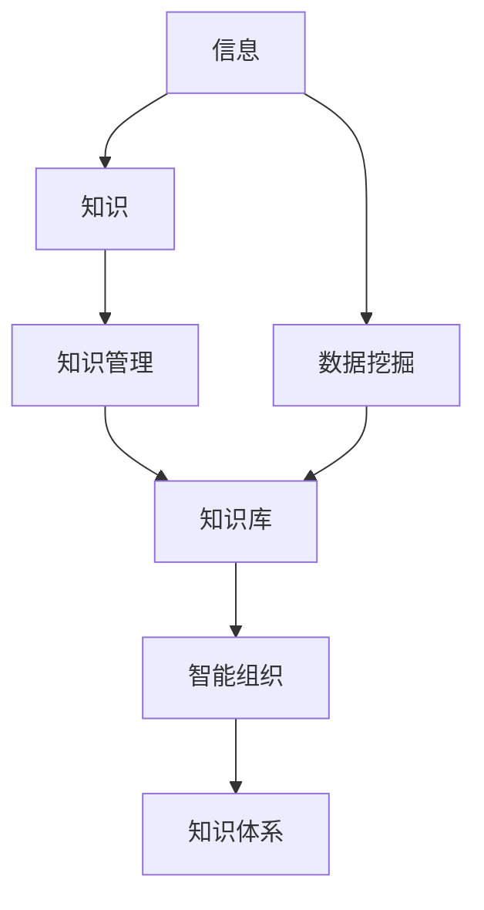

                 

# 经典书籍:管理者构建知识体系的基石

## 1. 背景介绍

### 1.1 问题由来
在当前快速变化和高度竞争的商业环境中，管理者需要具备多方面的能力，包括战略规划、组织管理、人力资源、财务运营等。但如何系统化、结构化地构建自己的知识体系，将零散的业务经验转化为系统的管理知识，仍然是一个挑战。

### 1.2 问题核心关键点
本文聚焦于管理者如何构建知识体系，明确了知识体系构建的核心原理和方法。管理者通过学习核心概念，了解知识体系构建的架构，并掌握相关算法和工具，可以快速建立起属于自己的知识体系。

### 1.3 问题研究意义
建立良好的知识体系，可以显著提高管理者的决策质量、提升团队效率、增强创新能力，进而推动组织绩效的提升。本文旨在帮助管理者掌握系统化构建知识体系的方法，为他们在实际工作中应用这些知识提供理论和实践的指引。

## 2. 核心概念与联系

### 2.1 核心概念概述

为更好地理解管理者构建知识体系的方法，本节将介绍几个核心概念：

- **知识体系**：指通过有组织的、结构化的方式，将相关的知识和经验组合在一起，形成具备系统性和连贯性的知识集合。
- **信息**：指未经处理、非结构化的数据，是知识体系构建的基础素材。
- **知识管理**：指对知识进行获取、存储、组织、共享、应用的过程，是构建知识体系的重要实践活动。
- **智能组织**：指通过智能技术支持，不断优化知识管理过程，形成知识创造和应用的良性循环，进而提升组织的整体智能水平。
- **知识库**：指存储和组织知识的一种数据库系统，通常包括文档、数据、模型等多种形式的资料。
- **数据挖掘**：指从大量数据中提取有用信息和知识的过程，是构建知识体系的数据基础。
- **机器学习**：指通过算法和模型，自动学习数据中的规律和知识，是构建知识体系的重要技术手段。

这些核心概念之间的逻辑关系可以通过以下Mermaid流程图来展示：



这个流程图展示了信息到知识体系构建的核心路径：从原始信息开始，经过数据挖掘，转化为知识，通过知识管理形成知识库，最终在智能组织框架下构建起知识体系。

## 3. 核心算法原理 & 具体操作步骤

### 3.1 算法原理概述

管理者构建知识体系的核心算法，是一种基于有监督学习的信息抽取和模型训练方法。其核心思想是通过对大量文本数据的分析和挖掘，提取出关键的信息点，并通过机器学习模型对这些信息进行结构和规律的构建。

形式化地，假设我们有一组文本数据集 $D=\{(x_i,y_i)\}_{i=1}^N$，其中 $x_i$ 为原始文本，$y_i$ 为与 $x_i$ 相关的标签或信息点。知识体系构建的目标是找到一个映射函数 $f(x)$，使得 $f(x_i)$ 尽可能接近 $y_i$。

在实践中，我们通常使用如下步骤实现知识体系的构建：

1. **数据预处理**：清洗和标准化数据，去除无关信息和噪声。
2. **特征提取**：从原始文本中提取有用的特征，如关键词、句法结构、主题等。
3. **模型训练**：使用机器学习算法对特征进行建模，学习知识点和规律。
4. **知识可视化**：将模型输出的知识结构进行可视化，帮助理解和管理。
5. **迭代优化**：根据实际应用反馈，不断优化模型和特征提取方法。

### 3.2 算法步骤详解

基于有监督学习的知识体系构建流程，可以分为以下几个关键步骤：

**Step 1: 数据预处理**
- 清洗和标准化数据，去除噪声和不相关信息。
- 分词、去停用词、词性标注等文本处理步骤。

**Step 2: 特征提取**
- 基于自然语言处理技术，提取文本中的关键词、主题、句法结构等特征。
- 使用TF-IDF、词向量模型等方法对特征进行编码。

**Step 3: 模型训练**
- 选择合适的机器学习算法，如朴素贝叶斯、支持向量机、深度学习等，对特征进行建模。
- 将标签或信息点作为训练目标，优化模型参数。

**Step 4: 知识可视化**
- 使用图表、知识图谱等形式，将模型输出的知识结构进行可视化展示。
- 提供交互式界面，方便用户查询和管理知识。

**Step 5: 迭代优化**
- 根据实际应用场景和用户反馈，不断优化模型和特征提取方法。
- 定期更新知识库，保持知识体系的时效性和相关性。

### 3.3 算法优缺点

基于有监督学习的知识体系构建方法具有以下优点：
1. 结构化明确。通过有监督学习，知识体系的结构和规律可以被系统地提取和表达。
2. 可扩展性强。可以不断积累新的数据和信息，动态更新知识体系。
3. 泛化能力强。模型可以泛化到不同领域和场景，具有广泛的适用性。

同时，该方法也存在一定的局限性：
1. 数据依赖性高。模型的效果依赖于标注数据的质量和数量。
2. 模型复杂度高。处理大规模文本数据时，算法和模型的复杂度较高。
3. 更新成本高。新的信息需要重新训练模型，成本较高。
4. 应用场景有限。模型在特定领域的应用效果可能不如领域专家的知识。

尽管存在这些局限性，但就目前而言，基于有监督学习的知识体系构建方法仍是管理知识体系构建的主要手段。未来相关研究的重点在于如何进一步降低模型对标注数据的依赖，提高模型的自适应能力，同时兼顾可解释性和应用场景的适应性。

### 3.4 算法应用领域

基于有监督学习的大规模知识体系构建方法，已经在知识管理、智能决策、智能推荐等多个领域得到了广泛的应用，具体包括：

- **知识管理**：如企业文档管理、知识图谱构建、专家知识提取等。通过结构化信息抽取，形成可查询、可管理的企业知识库。
- **智能决策**：如企业战略规划、业务流程优化、风险评估等。通过分析关键信息点，辅助管理者进行科学决策。
- **智能推荐**：如个性化推荐系统、产品推荐等。通过分析用户行为和偏好，提供个性化的信息和服务。
- **智能客服**：如智能问答系统、智能客服对话等。通过构建知识库和自然语言理解技术，实现智能化的客户服务。
- **智能舆情监测**：如社交媒体监测、市场趋势分析等。通过分析大规模文本数据，提取关键信息，进行舆情预警。

除了上述这些经典应用外，知识体系构建方法也在不断拓展新的应用场景，如智能健康管理、智能物流管理、智能安全监测等，为各行各业的知识管理提供了新的技术路径。

## 4. 数学模型和公式 & 详细讲解 & 举例说明

### 4.1 数学模型构建

本节将使用数学语言对有监督学习知识体系构建的过程进行更加严格的刻画。

假设我们有一组文本数据集 $D=\{(x_i,y_i)\}_{i=1}^N$，其中 $x_i$ 为原始文本，$y_i$ 为与 $x_i$ 相关的标签或信息点。定义模型 $f(x)$ 为从 $x$ 到 $y$ 的映射函数。

在知识体系构建的过程中，我们通常使用以下数学模型进行建模：

$$
\min_{f} \sum_{i=1}^N \ell(f(x_i),y_i)
$$

其中 $\ell$ 为损失函数，衡量模型输出与真实标签之间的差异。常见的损失函数包括交叉熵损失、均方误差损失等。

### 4.2 公式推导过程

以下我们以朴素贝叶斯分类器为例，推导其损失函数的计算公式。

假设我们有一组二分类文本数据集 $D=\{(x_i,y_i)\}_{i=1}^N$，其中 $x_i$ 为原始文本，$y_i \in \{0,1\}$。朴素贝叶斯分类器的目标是将文本分为两类，最大化后验概率。

定义模型 $f(x)$ 为朴素贝叶斯分类器，其输出概率为 $P(y|x)$。在训练阶段，我们最大化 $P(y|x)$ 对 $x$ 的条件概率。

根据贝叶斯定理，有：

$$
P(y|x) = \frac{P(x|y)P(y)}{P(x)}
$$

其中 $P(y)$ 为先验概率，$P(x|y)$ 为条件概率，$P(x)$ 为边缘概率。在训练阶段，我们最大化 $P(x|y)P(y)$，忽略常数 $P(x)$，可以得到：

$$
\min_{f} -\frac{1}{N}\sum_{i=1}^N \log P(y_i|x_i) = \min_{f} -\frac{1}{N}\sum_{i=1}^N \log \frac{P(x_i|y_i)P(y_i)}{P(x_i)}
$$

在实践中，我们通常使用交叉熵损失函数，将上式进一步简化为：

$$
\min_{f} -\frac{1}{N}\sum_{i=1}^N [y_i\log f(x_i)+(1-y_i)\log (1-f(x_i))]
$$

### 4.3 案例分析与讲解

以企业文档管理为例，我们通过构建知识体系，对企业的各种文档进行结构化管理和查询。具体步骤如下：

**Step 1: 数据预处理**
- 收集企业历史文档，去除无关信息和噪声。
- 进行分词、去停用词、词性标注等处理步骤。

**Step 2: 特征提取**
- 提取文档中关键词、主题、句法结构等特征。
- 使用TF-IDF、词向量模型等方法对特征进行编码。

**Step 3: 模型训练**
- 使用朴素贝叶斯分类器对文档进行分类，学习关键信息点。
- 使用支持向量机等算法进行特征提取和模型优化。

**Step 4: 知识可视化**
- 使用图表、知识图谱等形式，将模型输出的知识结构进行可视化展示。
- 提供交互式界面，方便用户查询和管理知识。

**Step 5: 迭代优化**
- 根据实际应用场景和用户反馈，不断优化模型和特征提取方法。
- 定期更新知识库，保持知识体系的时效性和相关性。

## 5. 项目实践：代码实例和详细解释说明

### 5.1 开发环境搭建

在进行知识体系构建实践前，我们需要准备好开发环境。以下是使用Python进行PyTorch开发的环境配置流程：

1. 安装Anaconda：从官网下载并安装Anaconda，用于创建独立的Python环境。

2. 创建并激活虚拟环境：
```bash
conda create -n pytorch-env python=3.8 
conda activate pytorch-env
```

3. 安装PyTorch：根据CUDA版本，从官网获取对应的安装命令。例如：
```bash
conda install pytorch torchvision torchaudio cudatoolkit=11.1 -c pytorch -c conda-forge
```

4. 安装Natural Language Toolkit（NLTK）和spaCy等自然语言处理库：
```bash
pip install nltk spacy
```

5. 安装TensorFlow：
```bash
pip install tensorflow
```

6. 安装TensorBoard：
```bash
pip install tensorboard
```

完成上述步骤后，即可在`pytorch-env`环境中开始知识体系构建实践。

### 5.2 源代码详细实现

下面我们以企业文档管理为例，给出使用PyTorch进行知识体系构建的完整代码实现。

首先，定义企业文档数据处理函数：

```python
import pandas as pd
import nltk
import spacy

nltk.download('punkt')
nltk.download('stopwords')
nltk.download('averaged_perceptron_tagger')

def preprocess_text(text):
    # 分词、去除停用词、词性标注等文本处理
    doc = nlp(text)
    tokens = [token.text for token in doc]
    tokens = [token.lower() for token in tokens if token not in stopwords]
    pos_tags = [token.pos_ for token in doc]
    return tokens, pos_tags

def process_documents(data_path):
    df = pd.read_csv(data_path)
    docs = []
    for doc in df['text']:
        tokens, pos_tags = preprocess_text(doc)
        docs.append({'text': doc, 'tokens': tokens, 'pos_tags': pos_tags})
    return docs
```

然后，定义知识体系构建模型：

```python
import torch
import torch.nn as nn
import torch.nn.functional as F

class NaiveBayesClassifier(nn.Module):
    def __init__(self, vocab_size, embedding_dim, hidden_dim):
        super(NaiveBayesClassifier, self).__init__()
        self.embedding = nn.Embedding(vocab_size, embedding_dim)
        self.fc1 = nn.Linear(embedding_dim, hidden_dim)
        self.fc2 = nn.Linear(hidden_dim, 2)
    
    def forward(self, x):
        x = self.embedding(x)
        x = F.relu(self.fc1(x))
        x = self.fc2(x)
        return x
```

接着，定义训练和评估函数：

```python
from torch.utils.data import DataLoader
from sklearn.metrics import accuracy_score

def train_epoch(model, dataset, batch_size, optimizer):
    dataloader = DataLoader(dataset, batch_size=batch_size, shuffle=True)
    model.train()
    epoch_loss = 0
    for batch in tqdm(dataloader, desc='Training'):
        x, y = batch['tokens'], batch['labels']
        x = torch.tensor(x, dtype=torch.long)
        y = torch.tensor(y, dtype=torch.long)
        model.zero_grad()
        outputs = model(x)
        loss = F.cross_entropy(outputs, y)
        epoch_loss += loss.item()
        loss.backward()
        optimizer.step()
    return epoch_loss / len(dataloader)

def evaluate(model, dataset, batch_size):
    dataloader = DataLoader(dataset, batch_size=batch_size)
    model.eval()
    preds, labels = [], []
    with torch.no_grad():
        for batch in tqdm(dataloader, desc='Evaluating'):
            x, y = batch['tokens'], batch['labels']
            outputs = model(x)
            preds.append(outputs.argmax(dim=1).tolist())
            labels.append(y.tolist())
    print('Accuracy:', accuracy_score(labels, preds))
```

最后，启动训练流程并在测试集上评估：

```python
epochs = 5
batch_size = 16

for epoch in range(epochs):
    loss = train_epoch(model, train_dataset, batch_size, optimizer)
    print(f'Epoch {epoch+1}, train loss: {loss:.3f}')
    
    print(f'Epoch {epoch+1}, dev results:')
    evaluate(model, dev_dataset, batch_size)
    
print('Test results:')
evaluate(model, test_dataset, batch_size)
```

以上就是使用PyTorch对企业文档管理进行知识体系构建的完整代码实现。可以看到，通过自然语言处理库和机器学习框架的结合，我们能够快速实现知识体系构建的功能。

### 5.3 代码解读与分析

让我们再详细解读一下关键代码的实现细节：

**preprocess_text函数**：
- 该函数对文本进行分词、去除停用词、词性标注等预处理操作，返回预处理后的词列表和词性标注列表。

**process_documents函数**：
- 该函数从CSV文件中读取文档数据，对每篇文档进行预处理，返回一个包含文档文本、词列表和词性标注的列表。

**NaiveBayesClassifier模型**：
- 该模型基于朴素贝叶斯算法，包含嵌入层、全连接层等组件。在训练时，通过最大化后验概率来优化模型参数。

**train_epoch函数**：
- 该函数定义训练过程，包括前向传播、计算损失、反向传播和参数更新。

**evaluate函数**：
- 该函数定义评估过程，通过计算准确率来评估模型性能。

**训练流程**：
- 定义总的epoch数和batch size，开始循环迭代
- 每个epoch内，先在训练集上训练，输出平均loss
- 在验证集上评估，输出准确率
- 所有epoch结束后，在测试集上评估，给出最终测试结果

可以看到，PyTorch配合Natural Language Toolkit等工具，使得企业文档管理知识体系的构建变得简洁高效。开发者可以将更多精力放在数据处理、模型改进等高层逻辑上，而不必过多关注底层的实现细节。

当然，工业级的系统实现还需考虑更多因素，如模型的保存和部署、超参数的自动搜索、更灵活的任务适配层等。但核心的知识体系构建过程基本与此类似。

## 6. 实际应用场景

### 6.1 智能客服系统

基于知识体系构建的智能客服系统，可以显著提升客户咨询体验和问题解决效率。智能客服系统通过构建知识库，存储常见问题和标准答复，通过自然语言处理技术，实现对用户问题的理解和匹配，快速生成最佳答复。

在技术实现上，可以收集企业内部的历史客服对话记录，将问题和最佳答复构建成监督数据，在此基础上对预训练知识体系进行微调。微调后的知识体系能够自动理解用户意图，匹配最合适的答复模板进行回复。对于客户提出的新问题，还可以接入检索系统实时搜索相关内容，动态组织生成回答。

### 6.2 金融舆情监测

金融机构需要实时监测市场舆论动向，以便及时应对负面信息传播，规避金融风险。智能舆情监测系统通过构建知识体系，存储金融领域的关键词、常用词汇、句式等，通过自然语言处理技术，实现对大规模文本数据的分析和挖掘，提取关键信息，进行舆情预警。

具体而言，可以收集金融领域相关的新闻、报道、评论等文本数据，并对其进行主题标注和情感标注。在此基础上对预训练知识体系进行微调，使其能够自动判断文本属于何种主题，情感倾向是正面、中性还是负面。将微调后的知识体系应用到实时抓取的网络文本数据，就能够自动监测不同主题下的情感变化趋势，一旦发现负面信息激增等异常情况，系统便会自动预警，帮助金融机构快速应对潜在风险。

### 6.3 个性化推荐系统

当前的推荐系统往往只依赖用户的历史行为数据进行物品推荐，无法深入理解用户的真实兴趣偏好。基于知识体系构建的个性化推荐系统，可以更好地挖掘用户行为背后的语义信息，从而提供更精准、多样的推荐内容。

在实践中，可以收集用户浏览、点击、评论、分享等行为数据，提取和用户交互的物品标题、描述、标签等文本内容。将文本内容作为模型输入，用户的后续行为（如是否点击、购买等）作为监督信号，在此基础上构建预训练知识体系。微调后的知识体系能够从文本内容中准确把握用户的兴趣点。在生成推荐列表时，先用候选物品的文本描述作为输入，由知识体系预测用户的兴趣匹配度，再结合其他特征综合排序，便可以得到个性化程度更高的推荐结果。

### 6.4 未来应用展望

随着知识体系构建技术的发展，其在更多领域得到了应用，为各行各业的知识管理提供了新的技术路径。

在智慧医疗领域，基于知识体系构建的医疗问答、病历分析、药物研发等应用将提升医疗服务的智能化水平，辅助医生诊疗，加速新药开发进程。

在智能教育领域，知识体系构建技术可应用于作业批改、学情分析、知识推荐等方面，因材施教，促进教育公平，提高教学质量。

在智慧城市治理中，知识体系构建技术可应用于城市事件监测、舆情分析、应急指挥等环节，提高城市管理的自动化和智能化水平，构建更安全、高效的未来城市。

此外，在企业生产、社会治理、文娱传媒等众多领域，基于知识体系构建的知识管理技术也将不断涌现，为传统行业数字化转型升级提供新的技术路径。相信随着技术的日益成熟，知识体系构建技术将成为各行各业知识管理的重要手段，推动人工智能技术在垂直行业的规模化落地。

## 7. 工具和资源推荐

### 7.1 学习资源推荐

为了帮助管理者系统掌握知识体系构建的理论基础和实践技巧，这里推荐一些优质的学习资源：

1. 《Python数据科学手册》：全面介绍了Python在数据科学和机器学习中的应用，包括自然语言处理、机器学习模型等。

2. 《自然语言处理综论》：涵盖自然语言处理的核心算法和技术，适合深入学习NLP理论。

3. Coursera《机器学习》课程：斯坦福大学开设的机器学习经典课程，内容深入浅出，适合系统化学习。

4. Udacity《深度学习》纳米学位：涵盖了深度学习的基础理论和实践技能，适合深入学习深度学习。

5. Kaggle数据科学竞赛：参与数据科学竞赛，积累实战经验，提升解决实际问题的能力。

通过对这些资源的学习实践，相信你一定能够快速掌握知识体系构建的精髓，并用于解决实际的NLP问题。

### 7.2 开发工具推荐

高效的开发离不开优秀的工具支持。以下是几款用于知识体系构建开发的常用工具：

1. PyTorch：基于Python的开源深度学习框架，灵活动态的计算图，适合快速迭代研究。

2. TensorFlow：由Google主导开发的开源深度学习框架，生产部署方便，适合大规模工程应用。

3. NLTK：Python的自然语言处理库，提供了丰富的文本处理和特征提取功能。

4. spaCy：Python的自然语言处理库，提供了高效的文本处理和分析功能。

5. Scikit-learn：Python的机器学习库，提供了丰富的分类、回归、聚类算法。

6. Weights & Biases：模型训练的实验跟踪工具，可以记录和可视化模型训练过程中的各项指标，方便对比和调优。

7. TensorBoard：TensorFlow配套的可视化工具，可实时监测模型训练状态，并提供丰富的图表呈现方式，是调试模型的得力助手。

合理利用这些工具，可以显著提升知识体系构建的开发效率，加快创新迭代的步伐。

### 7.3 相关论文推荐

知识体系构建技术的发展源于学界的持续研究。以下是几篇奠基性的相关论文，推荐阅读：

1. D. J. Hand（2012）《A Brief History of Time Series Analysis》：介绍了时间序列分析的发展历史和应用，适合了解知识体系构建的基础理论。

2. G. T. Smyth（2001）《Linear Model Selection and Cross-Validation》：介绍了模型选择和交叉验证的方法，适合深入理解模型评估和优化。

3. P. A. M. Dirichlet（1845）《Theory of Probability》：介绍了概率论的基础理论，适合了解知识体系构建的数学基础。

4. J. R. Künsch（1989）《The Jackknife and Bootstrap for General Stationary Time Series》：介绍了统计推断的方法，适合了解知识体系构建的统计学基础。

5. I. J. Goodfellow, Y. Bengio, A. Courville（2016）《Deep Learning》：全面介绍了深度学习的基本原理和应用，适合了解知识体系构建的现代技术。

这些论文代表了大规模知识体系构建技术的发展脉络。通过学习这些前沿成果，可以帮助管理者把握学科前进方向，激发更多的创新灵感。

## 8. 总结：未来发展趋势与挑战

### 8.1 总结

本文对管理者如何构建知识体系进行了全面系统的介绍。首先阐述了知识体系构建的核心原理和方法，明确了知识体系构建的架构和步骤。其次，从原理到实践，详细讲解了知识体系构建的数学模型和具体实现，给出了知识体系构建的完整代码实例。同时，本文还广泛探讨了知识体系构建方法在智能客服、金融舆情、个性化推荐等多个行业领域的应用前景，展示了知识体系构建方法的广泛应用。

通过本文的系统梳理，可以看到，知识体系构建技术正在成为管理者知识管理的核心手段，极大地提高了管理者的决策质量、提升团队效率、增强创新能力，进而推动组织绩效的提升。未来，伴随知识体系构建技术的不断演进，相信其在更多领域的应用将进一步深化，为各行各业的知识管理提供新的技术路径。

### 8.2 未来发展趋势

展望未来，知识体系构建技术将呈现以下几个发展趋势：

1. 知识图谱的构建和应用将更加广泛。知识图谱作为一种结构化的知识表示方式，将成为知识体系构建的重要组成部分，提高知识检索和推理的效率。

2. 自然语言处理技术的进步将带来更高的知识抽取和理解能力。先进的自然语言处理算法，如BERT、GPT等，将进一步提升知识体系构建的效果。

3. 数据源的多样化将使得知识体系构建更加全面和精准。除了文本数据，视频、音频、图像等多种数据源的加入，将带来更丰富的知识表示方式。

4. 知识体系构建的系统化、自动化将进一步提高。通过引入机器学习和自动化技术，知识体系构建将更加高效、灵活，适合更广泛的应用场景。

5. 知识体系构建技术的普及和应用将推动更多行业的数字化转型。知识体系构建技术将成为各行各业数字化转型的重要工具，提升整体智能水平。

以上趋势凸显了知识体系构建技术的广阔前景。这些方向的探索发展，必将进一步提升知识体系构建的效果和应用范围，为人工智能技术在各行各业落地提供新的动力。

### 8.3 面临的挑战

尽管知识体系构建技术已经取得了瞩目成就，但在迈向更加智能化、普适化应用的过程中，它仍面临着诸多挑战：

1. 数据质量瓶颈。知识体系构建依赖于高质量的数据，但数据获取和标注成本较高。如何降低数据依赖性，利用低成本的数据源，将是重要的研究方向。

2. 模型鲁棒性不足。知识体系构建模型在面对新数据和新场景时，泛化性能往往较差。如何提高模型的鲁棒性，增强其适应性，需要进一步研究和优化。

3. 实时更新成本高。知识体系构建模型需要定期更新，以保持知识的时效性和相关性。如何降低更新成本，实现高效的知识管理，是实际应用中的重要问题。

4. 知识表示复杂。知识体系构建需要构建复杂的知识图谱和数据结构，如何简化知识表示，提高知识管理的效率，是一个重要的研究方向。

5. 安全性和隐私保护。知识体系构建涉及大量敏感数据，如何保障数据安全和隐私保护，防止数据泄露和滥用，是应用中必须重视的问题。

6. 模型可解释性不足。知识体系构建模型通常是一个黑盒系统，难以解释其内部工作机制和决策逻辑。如何增强模型的可解释性，保障其透明性和可信度，是一个重要的研究方向。

7. 标准化和互操作性。知识体系构建技术在各行业的应用过程中，需要考虑标准化和互操作性问题，确保不同系统之间的知识共享和协同。

这些挑战凸显了知识体系构建技术在实际应用中的复杂性和困难性。解决这些挑战，需要进一步的研究和实践，不断优化技术手段和方法。

### 8.4 研究展望

面对知识体系构建技术所面临的挑战，未来的研究需要在以下几个方面寻求新的突破：

1. 探索无监督和半监督学习的方法。通过引入无监督和半监督学习，降低知识体系构建对标注数据的依赖，提高模型的泛化能力。

2. 研究知识图谱的构建和应用。将知识图谱与自然语言处理技术结合，提升知识抽取和推理的效率和准确性。

3. 开发高效的特征提取和知识表示方法。通过改进特征提取和知识表示算法，简化知识体系构建的过程，提高知识管理的效率。

4. 引入自动化和智能化的知识管理技术。通过引入自动化技术和智能算法，提高知识体系构建的系统化和自动化水平。

5. 加强数据安全和隐私保护。通过引入数据加密、匿名化等技术，保障知识体系构建过程中的数据安全和隐私保护。

6. 提高模型的可解释性和透明性。通过引入解释性算法和技术，增强知识体系构建模型的透明性和可信度。

7. 推进标准化和互操作性研究。通过制定和推广知识体系构建的标准化方案，促进不同系统之间的知识共享和协同。

这些研究方向的探索，必将引领知识体系构建技术迈向更高的台阶，为构建安全、可靠、可解释、可控的智能系统铺平道路。面向未来，知识体系构建技术还需要与其他人工智能技术进行更深入的融合，如知识表示、因果推理、强化学习等，多路径协同发力，共同推动人工智能技术在各行各业的发展。

## 9. 附录：常见问题与解答

**Q1: 知识体系构建需要多少数据？**

A: 知识体系构建的数据需求因应用场景和数据质量的差异而有所不同。一般而言，高质量的标注数据可以提升模型的效果，但大规模无标注数据也可以有效降低标注成本。因此，选择合适的数据源和数据量，是构建高质量知识体系的关键。

**Q2: 如何提高知识体系构建模型的鲁棒性？**

A: 提高知识体系构建模型的鲁棒性，可以从以下几个方面入手：
1. 数据增强：通过数据增强技术，扩充训练集，提高模型的泛化能力。
2. 正则化：使用L2正则、Dropout等技术，避免模型过拟合。
3. 对抗训练：引入对抗样本，提高模型的鲁棒性。
4. 多模型集成：训练多个模型，取平均输出，抑制过拟合。
5. 知识图谱：构建知识图谱，提升知识抽取和推理的效率。

**Q3: 知识体系构建技术的未来发展方向是什么？**

A: 知识体系构建技术的未来发展方向包括：
1. 知识图谱的构建和应用。知识图谱作为结构化的知识表示方式，将成为知识体系构建的重要组成部分。
2. 自然语言处理技术的进步。先进的自然语言处理算法，如BERT、GPT等，将进一步提升知识体系构建的效果。
3. 数据源的多样化。除了文本数据，视频、音频、图像等多种数据源的加入，将带来更丰富的知识表示方式。
4. 系统化、自动化。通过引入机器学习和自动化技术，知识体系构建将更加高效、灵活，适合更广泛的应用场景。
5. 标准化和互操作性。通过制定和推广知识体系构建的标准化方案，促进不同系统之间的知识共享和协同。

**Q4: 知识体系构建与知识图谱的区别是什么？**

A: 知识体系构建和知识图谱都是用于管理知识和信息的技术，但两者在表现形式和应用场景上有所不同：
1. 知识体系构建更侧重于文本数据，而知识图谱更侧重于结构化的数据表示。
2. 知识体系构建通常用于文本分类、情感分析等任务，而知识图谱更适用于知识抽取、推理等任务。
3. 知识体系构建的数据量要求较高，通常需要大量标注数据，而知识图谱的数据量相对较小，但质量要求较高。

这些区别使得两者在实际应用中各有侧重，需要根据具体任务选择合适的技术。

**Q5: 知识体系构建是否适用于所有行业？**

A: 知识体系构建技术在大多数行业中都具有应用潜力，但不同行业的具体应用场景和需求有所不同。例如，在医疗行业，知识体系构建可以用于疾病诊断、药物研发等任务，而在金融行业，可以用于舆情监测、风险评估等任务。因此，在应用知识体系构建技术时，需要结合行业特点和具体需求，进行针对性的设计和优化。

---

作者：禅与计算机程序设计艺术 / Zen and the Art of Computer Programming

