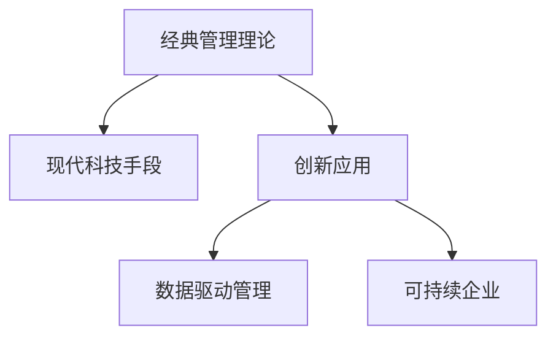

                 

# 经典管理理论在现代企业中的创新应用

## 1. 背景介绍

### 1.1 问题由来
随着全球化和数字化转型的加速，企业面临的经营环境变得愈发复杂和动态化。经典管理理论在工业时代提出的一些原则和方法，在应对这些新挑战时显得力不从心。然而，这些理论中仍然蕴含着许多对现代企业依然有效的洞见。如何结合现代科技和数据驱动的思维，创新性地应用经典管理理论，成为企业管理者必须面对的课题。

### 1.2 问题核心关键点
现代企业的创新应用旨在：
- 结合经典管理理论的基本原则和现代科技手段，形成更加贴合当代环境的管理模式。
- 创新性地解决企业面临的组织结构、人才管理、决策支持等关键问题。
- 构建灵活、高效、可持续发展的企业生态系统。

### 1.3 问题研究意义
研究经典管理理论在现代企业中的创新应用，对于推动企业管理方式的变革，提升企业竞争力和可持续发展能力，具有重要意义：

1. 增强企业应对不确定性的能力。经典管理理论中的系统思维、组织结构设计、领导力培养等方法，可以帮助企业在动荡的市场环境中更好地识别和应对风险。
2. 提升企业组织效率。通过将经典理论中关于团队协作、资源分配、绩效管理等理念与现代技术结合，可以构建更加高效、灵活的组织体系。
3. 促进企业人才发展。经典理论中关于员工动机、激励、发展等理论，结合数据科学和人工智能，可以帮助企业更好地吸引、留住和培养人才。
4. 驱动企业创新。通过创新性地应用经典理论中的创新管理、知识管理、持续改进等方法，可以激发企业内部的创新潜力，推动产品和服务不断迭代升级。
5. 支持企业可持续发展。经典理论中关于生态责任、社会责任、环境管理等理念，结合现代数据驱动的方法，可以帮助企业构建可持续发展的商业模式，实现经济效益与社会效益的双赢。

## 2. 核心概念与联系

### 2.1 核心概念概述

为更好地理解经典管理理论在现代企业中的创新应用，本节将介绍几个密切相关的核心概念：

- **经典管理理论**：包括泰罗的科学管理、法约尔的一般管理、马斯洛的需求层次理论、麦格雷戈的X理论与Y理论等。这些理论提供了关于组织结构、领导力、员工激励等方面的深刻见解。

- **现代科技手段**：包括云计算、大数据分析、人工智能、物联网等。这些技术提供了强大的数据分析、决策支持和自动化执行能力，为经典管理理论的应用提供了新的工具和方法。

- **创新应用**：指将经典管理理论与现代科技手段结合，应用于企业经营管理的各个方面，形成新的管理模式和实践。

- **数据驱动管理**：通过收集、分析和利用内部和外部的数据，支持企业的战略决策、绩效评估、风险管理等活动。

- **可持续企业**：在经济、社会、环境三个维度实现平衡发展，构建长期价值的商业模式。

这些核心概念之间的逻辑关系可以通过以下Mermaid流程图来展示：



这个流程图展示经典管理理论、现代科技、创新应用、数据驱动管理与可持续企业之间的联系，强调了这些概念在现代企业管理中的应用价值。

## 3. 核心算法原理 & 具体操作步骤
### 3.1 算法原理概述

经典管理理论在现代企业中的创新应用，其核心思想是将传统管理理论中的有效理念和方法，结合现代科技手段，应用于企业的战略规划、组织管理、人力资源、流程优化等领域，以提升企业的竞争力。

在具体实现上，可以采用数据驱动、模型驱动、业务驱动等多种方式。例如：
- **数据驱动**：通过收集和分析企业内外的海量数据，结合经典管理理论中的统计方法和工具，进行决策支持。
- **模型驱动**：构建基于经典理论的数学模型，应用现代优化算法，进行资源配置、风险管理等活动的优化。
- **业务驱动**：将经典管理理论中的管理理念，应用于企业日常运营和流程改进中，提升操作效率和质量。

### 3.2 算法步骤详解

以下是经典管理理论在现代企业中创新应用的一般步骤：

**Step 1: 识别管理问题**
- 结合企业战略和业务需求，识别关键的管理问题，如组织结构不合理、人才流失率高、决策周期长等。

**Step 2: 应用经典理论**
- 根据识别的问题，选择适合的经典管理理论方法，如组织设计、绩效评估、团队建设等。

**Step 3: 引入现代科技**
- 选择合适的现代科技手段，如大数据分析、人工智能、云计算等，进行数据处理和模型构建。

**Step 4: 模型构建与优化**
- 结合经典理论和现代科技，构建相应的数学模型，使用优化算法进行求解，如遗传算法、模拟退火等。

**Step 5: 实施与评估**
- 在企业内部实施优化方案，监控和评估效果，根据反馈进行迭代优化。

### 3.3 算法优缺点

经典管理理论在现代企业中的创新应用，具有以下优点：
1. 增强决策科学性。结合数据驱动和模型驱动，提升决策的准确性和效率。
2. 提升组织效率。通过优化组织结构和流程，提升企业运营效率。
3. 促进人才发展。通过数据驱动的人才分析和管理，提升员工满意度和留任率。
4. 支持持续创新。结合经典理论和现代科技，激发企业内部的创新潜力。

同时，这些方法也存在一些局限性：
1. 实施成本高。需要投入大量资源进行数据收集、模型构建和优化实施。
2. 技术门槛高。需要企业具备一定的技术实力和人才储备。
3. 适应性有限。某些经典理论可能不适用于特定行业或企业文化。
4. 数据隐私风险。大量数据的收集和分析可能带来隐私泄露的风险。

尽管存在这些局限性，但经典管理理论在现代企业中的应用，为解决复杂的管理问题提供了新的思路和方法。未来研究应更多关注如何降低实施成本、降低技术门槛，并强化数据隐私保护。

### 3.4 算法应用领域

经典管理理论在现代企业中的应用，广泛覆盖了以下几个领域：

- **战略管理**：结合经典战略规划理论，如波特的五力模型、SWOT分析等，结合大数据分析，进行市场预测和竞争分析，制定企业战略。
- **组织设计**：结合经典组织结构设计理论，如法约尔的14项管理原则，结合现代科技手段，进行组织扁平化、流程再造，提升组织效率。
- **人力资源管理**：结合马斯洛的需求层次理论和经典人力资源管理理论，如绩效管理、薪酬激励等，结合人工智能和大数据分析，进行人才评估和招聘优化。
- **流程优化**：结合经典的质量管理理论，如六西格玛方法、精益生产等，结合现代科技手段，进行流程自动化和优化，提升生产效率和产品质量。
- **知识管理**：结合经典的知识管理理论，如德鲁克的学习型组织理念，结合人工智能和大数据分析，构建知识共享平台，推动企业知识创新和传播。

除了上述这些领域外，经典管理理论在现代企业中的应用还在不断扩展，如供应链管理、风险管理、可持续企业等领域，展现出强大的生命力。

## 4. 数学模型和公式 & 详细讲解 & 举例说明

### 4.1 数学模型构建

在经典管理理论的创新应用中，数学模型起着重要的桥梁作用。以下是几个典型的数学模型：

- **Markowitz投资组合模型**：用于资产配置和风险管理，通过线性规划求解最优资产组合，实现风险最小化和收益最大化。
- **PERT网络模型**：用于项目管理和时间管理，通过建立任务依赖关系，进行任务优先级和时间的优化。
- **Hawkes过程模型**：用于分析社交网络和信息传播，通过动态概率模型预测信息传播路径和影响效果。
- **Hofstede文化维度模型**：用于分析跨文化管理，通过维度分析，评估不同文化背景对员工行为和组织结构的影响。

这些模型都是基于经典管理理论构建的，并通过现代科技手段进行优化求解。

### 4.2 公式推导过程

以Markowitz投资组合模型为例，其数学表达式如下：

$$
\max \alpha^T R - \frac{1}{2} \alpha^T \Sigma \alpha
$$

其中，$R$为资产收益率向量，$\Sigma$为资产协方差矩阵，$\alpha$为资产权重向量。

求解上述优化问题，可以使用线性规划算法，如单纯形法、内点法等。求解结果将给出最优资产配置权重，使得组合的期望收益最大，同时风险最小。

### 4.3 案例分析与讲解

某金融企业应用Markowitz模型进行资产配置优化，具体步骤如下：

1. 收集企业内部和外部的历史收益率数据，计算协方差矩阵。
2. 使用线性规划算法求解最优资产配置权重。
3. 结合企业风险承受能力，调整权重，制定投资组合。
4. 实时监控投资组合表现，根据市场变化进行动态调整。

结果显示，通过Markowitz模型优化后的投资组合，不仅实现了更高的收益，同时风险也得到了有效控制。

## 5. 项目实践：代码实例和详细解释说明
### 5.1 开发环境搭建

在进行经典管理理论的创新应用实践前，我们需要准备好开发环境。以下是使用Python进行PuLP（Python Linear Programming Tool）开发的Python环境配置流程：

1. 安装Anaconda：从官网下载并安装Anaconda，用于创建独立的Python环境。

2. 创建并激活虚拟环境：
```bash
conda create -n linear-programming python=3.8 
conda activate linear-programming
```

3. 安装PuLP库：
```bash
pip install pulp
```

4. 安装相关工具包：
```bash
pip install numpy pandas matplotlib scikit-learn
```

完成上述步骤后，即可在`linear-programming`环境中开始应用实践。

### 5.2 源代码详细实现

这里我们以Markowitz投资组合优化为例，给出使用PuLP库进行Python代码实现。

首先，定义投资组合的数学模型：

```python
from pulp import *

# 创建线性规划模型
model = LpProblem("Asset Optimization", LpMaximize)

# 定义决策变量
alpha = [LpVariable("x%d" % i, lowBound=0, cat='Continuous') for i in range(n)]

# 定义目标函数
model += lpSum(alpha[i] * R[i] for i in range(n))

# 定义约束条件
model += lpSum(alpha[i] * cov[i][j] for i in range(n) for j in range(n)) <= Covariance

# 求解模型
model.solve()

# 输出最优解
print("Status:", LpStatus[model.status])
for i in range(n):
    print("x[%d]: %f" % (i, alpha[i].varValue))
```

然后，进行数据预处理和求解：

```python
import numpy as np
import pandas as pd

# 读取历史收益率数据
data = pd.read_csv("asset_rets.csv")

# 计算协方差矩阵
R = np.array(data.values)
Covariance = np.cov(R)

# 求解线性规划
model.solve()
```

### 5.3 代码解读与分析

让我们再详细解读一下关键代码的实现细节：

**Markowitz模型定义**：
- `LpProblem`创建线性规划模型。
- `LpVariable`定义决策变量，即各个资产的权重。
- `lpSum`构建目标函数，即资产组合的期望收益。
- `<=`构建约束条件，即资产组合的协方差限制。

**求解过程**：
- `model.solve()`调用求解器求解模型。
- `LpStatus[model.status]`输出求解状态，表示模型是否成功求解。
- `alpha[i].varValue`输出各个资产的权重解。

**数据预处理**：
- `pd.read_csv`读取CSV格式的历史收益率数据。
- `np.cov`计算收益率数据的协方差矩阵。

可以看到，通过PuLP库的封装，进行Markowitz投资组合优化的代码实现变得简洁高效。开发者可以将更多精力放在数据处理、模型构建等高层逻辑上，而不必过多关注底层的实现细节。

## 6. 实际应用场景
### 6.1 智能制造

在智能制造领域，经典管理理论的应用尤为显著。通过结合质量管理理论、精益生产理论等，结合物联网、人工智能等现代科技手段，可以实现高度自动化和智能化的生产系统。

例如，某制造企业应用Markowitz模型优化原材料采购和库存管理，通过分析市场需求和供应链数据，制定最优采购计划，实现了供应链成本的显著降低和库存水平的优化。同时，结合工业物联网(IoT)和大数据分析，实现了生产过程的实时监控和故障预测，提升了生产效率和设备利用率。

### 6.2 智能客服

智能客服系统通过结合经典管理理论和现代科技手段，可以实现高效率、低成本、高满意度的客户服务。例如，某电商企业结合顾客行为数据分析和经典服务管理理论，构建了智能推荐系统，根据客户历史购买记录和偏好，实时推荐个性化商品，提升了客户转化率和满意度。

### 6.3 可持续发展

经典管理理论在推动企业可持续发展方面也发挥着重要作用。例如，某企业通过应用可持续发展的经典理论，结合大数据分析和人工智能技术，制定了绿色生产、节能减排的计划，通过优化资源配置，实现了显著的节能效果和环境效益。

### 6.4 未来应用展望

随着现代科技的不断进步和经典管理理论的深入研究，未来经典管理理论在现代企业中的应用将展现出更加广阔的前景：

1. 智能决策支持系统：通过结合人工智能和大数据分析，构建智能决策支持系统，提升企业战略决策的科学性和效率。
2. 智慧供应链管理：结合物联网、区块链等技术，构建智慧供应链，实现供应链的可视化和智能化。
3. 自动化生产系统：结合工业物联网、智能制造理论，构建高度自动化的生产系统，提升生产效率和质量。
4. 可持续企业发展：结合德鲁克、波特等经典管理理论，制定可持续发展战略，推动企业绿色转型和长期价值创造。
5. 人工智能与人类协同：结合马斯洛的需求层次理论和经典组织管理理论，探索人工智能与人类协同的工作模式，提升员工满意度和企业创新能力。

这些应用方向展示了经典管理理论在现代企业中的巨大潜力和发展空间。通过不断创新，经典管理理论必将在现代企业中发挥更大的作用。

## 7. 工具和资源推荐
### 7.1 学习资源推荐

为了帮助开发者系统掌握经典管理理论在现代企业中的创新应用，这里推荐一些优质的学习资源：

1. 《管理学原理》系列博文：由管理学专家撰写，深入浅出地介绍了管理学基本理论和前沿研究。

2. Coursera《管理学》课程：由耶鲁大学提供，涵盖管理学经典理论和实践案例，适合初学者和进阶学习者。

3. 《现代管理科学与技术》书籍：系统介绍现代管理理论和技术，结合企业实际案例，提供实用的管理解决方案。

4. Harvard Business Review（哈佛商业评论）：提供大量经典和前沿的管理学理论和管理实践案例，适合深度阅读和研究。

5. MIT Sloan Management Review（麻省理工斯隆管理评论）：提供最新的管理学研究和实践，涵盖各个领域的管理理论和方法。

通过对这些资源的学习实践，相信你一定能够快速掌握经典管理理论在现代企业中的创新应用，并用于解决实际的经营管理问题。

### 7.2 开发工具推荐

高效的开发离不开优秀的工具支持。以下是几款用于经典管理理论创新应用开发的常用工具：

1. Python：灵活易用，拥有大量开源库和框架，适合数据驱动和管理优化分析。

2. R：擅长数据统计和可视化，拥有丰富的大数据分析库，如ggplot2、dplyr等。

3. Power BI：微软推出的商业智能工具，支持大规模数据处理和动态报表展示，适合企业决策支持。

4. SQL：结构化查询语言，适合处理大规模企业数据库和数据仓库，提供强大的数据处理能力。

5. Tableau：数据可视化工具，支持多维数据分析和动态报表生成，适合企业数据监控和决策支持。

合理利用这些工具，可以显著提升经典管理理论在现代企业中的应用效率，加快创新迭代的步伐。

### 7.3 相关论文推荐

经典管理理论在现代企业中的应用，得益于众多学者的深入研究。以下是几篇奠基性的相关论文，推荐阅读：

1. "The Theory of Constraints" by Eliyahu M. Goldratt：提出约束理论，通过优化关键环节，提升企业整体绩效。

2. "Lean Manufacturing" by James Womack and Daniel Jones：提出精益生产理论，通过优化流程和资源配置，提升生产效率和质量。

3. "The Balanced Scorecard" by Robert S. Kaplan and David P. Norton：提出平衡计分卡，通过多维度评估企业绩效，推动战略执行和决策。

4. "The Five Competitive Forces Model" by Michael E. Porter：提出五力模型，通过分析市场竞争环境，制定企业战略。

5. "The Learning Organization" by Peter M. Senge：提出学习型组织理论，通过持续学习和知识共享，提升企业创新能力和竞争力。

这些论文代表经典管理理论在现代企业中的应用发展脉络。通过学习这些前沿成果，可以帮助研究者把握学科前进方向，激发更多的创新灵感。

## 8. 总结：未来发展趋势与挑战

### 8.1 总结

本文对经典管理理论在现代企业中的创新应用进行了全面系统的介绍。首先阐述了经典管理理论的基本原理和现代科技手段，明确了两者结合的重要性和必要性。其次，从原理到实践，详细讲解了经典管理理论在战略管理、组织设计、人力资源、流程优化等领域的创新应用方法，给出了经典管理理论在现代企业中的具体应用实例。同时，本文还广泛探讨了经典管理理论在智能制造、智能客服、可持续发展等多个行业领域的应用前景，展示了经典管理理论在现代企业中的巨大潜力和发展空间。

通过本文的系统梳理，可以看到，经典管理理论在现代企业中的应用，正在为解决复杂的管理问题提供新的思路和方法。经典管理理论的创新应用，结合现代科技手段，形成了新的管理模式和实践，为企业的长期可持续发展提供了强有力的支持。未来，经典管理理论在现代企业中的应用还需更多研究和创新，才能更好地适应复杂多变的市场环境。

### 8.2 未来发展趋势

展望未来，经典管理理论在现代企业中的应用将呈现以下几个发展趋势：

1. 数据驱动决策：通过大数据分析、人工智能等技术，提供精准的决策支持，提升战略制定的科学性和准确性。
2. 智能组织设计：结合工业物联网、工业4.0等现代科技手段，进行组织结构设计和流程优化，构建灵活、高效的组织体系。
3. 人才智能化管理：通过大数据分析和人工智能技术，实现人力资源的精准管理和优化配置，提升员工满意度和企业绩效。
4. 创新生态系统：结合创新管理理论，构建创新生态系统，促进企业内部的知识共享和协同创新。
5. 可持续企业发展：结合可持续发展的经典理论，推动企业绿色转型和长期价值创造，构建可持续发展的商业模式。

这些趋势凸显了经典管理理论在现代企业中的应用价值。通过不断创新，经典管理理论必将在现代企业中发挥更大的作用。

### 8.3 面临的挑战

尽管经典管理理论在现代企业中的应用取得了显著成效，但在迈向更加智能化、普适化应用的过程中，仍面临诸多挑战：

1. 数据质量问题：经典管理理论的创新应用依赖大量的数据支持，数据质量的不足可能影响分析结果的准确性。
2. 技术融合难度：将经典管理理论与现代科技手段结合，需要跨越学科和技术的边界，存在一定的技术融合难度。
3. 组织文化阻力：经典管理理论的创新应用需要改变企业的组织文化和运营方式，可能面临组织内部的阻力。
4. 隐私和伦理问题：经典管理理论的应用可能涉及大量数据的收集和分析，存在数据隐私和伦理问题。
5. 人才短缺问题：经典管理理论的创新应用需要具备高水平的数据分析和建模能力，存在人才短缺的问题。

面对这些挑战，未来的研究需要在数据质量、技术融合、组织文化、隐私保护、人才储备等多个方面进行深入探讨和改进。

### 8.4 研究展望

未来，经典管理理论在现代企业中的应用研究可以从以下几个方向进行突破：

1. 数据治理：研究数据质量管理、数据隐私保护等方法，提升数据治理能力，保障经典管理理论应用的准确性和可靠性。
2. 技术融合：研究如何将经典管理理论与现代科技手段有效结合，如大数据分析、人工智能、物联网等，形成更加智能化的管理方法。
3. 组织文化：研究如何通过变革管理和激励机制，推动组织文化的转变，支持经典管理理论的创新应用。
4. 跨学科研究：加强跨学科研究，促进管理理论、数据科学、人工智能等领域知识的融合，推动经典管理理论的创新应用。
5. 人才培训：加强人才培训和知识共享，提升企业内部的人才储备和应用能力，推动经典管理理论的落地实践。

这些研究方向将有助于更好地应对未来挑战，推动经典管理理论在现代企业中的创新应用，实现更加高效、可持续的企业发展。

## 9. 附录：常见问题与解答

**Q1：经典管理理论在现代企业中的应用是否普遍？**

A: 经典管理理论在现代企业中的应用范围和深度因企业规模、行业特点、技术实力等因素而异。一些大中型企业已经在战略管理、组织设计、人力资源等方面应用经典管理理论，取得了显著成效。但对于一些技术密集型、快速变化型的企业，经典管理理论的应用可能面临更多挑战，需要结合现代科技手段进行创新应用。

**Q2：如何衡量经典管理理论应用的效果？**

A: 衡量经典管理理论应用的效果可以从多个维度进行，如企业的战略目标达成情况、员工满意度提升情况、流程优化效果等。具体指标可以包括关键绩效指标(KPI)、客户满意度、生产效率提升比例、创新项目成功率等。

**Q3：经典管理理论在现代企业中的实施成本如何？**

A: 经典管理理论在现代企业中的应用需要投入大量的资源，如人力、技术、时间等。不同企业在实施成本方面存在差异，大中型企业往往具备较强的技术实力和数据支持，实施成本相对较低。但对于一些中小企业，需要结合实际条件进行优化，降低实施成本。

**Q4：经典管理理论在现代企业中的应用是否存在风险？**

A: 经典管理理论在现代企业中的应用可能面临数据隐私、组织文化、技术融合等方面的风险。企业在实施过程中需要加强风险管理，建立相应的控制机制，确保经典管理理论应用的安全性和有效性。

**Q5：如何应对经典管理理论在现代企业中的应用挑战？**

A: 应对经典管理理论在现代企业中的应用挑战，可以从以下几个方面入手：
1. 提升数据质量：加强数据治理，建立数据质量管理体系，保障数据准确性和完整性。
2. 强化技术融合：通过跨学科研究，推动经典管理理论与现代科技手段的结合，形成更加智能化的管理方法。
3. 推动组织文化变革：通过变革管理和激励机制，推动组织文化的转变，支持经典管理理论的创新应用。
4. 加强人才培训：加强内部人才培训和知识共享，提升企业内部的人才储备和应用能力。
5. 关注隐私和伦理问题：建立数据隐私保护机制，确保经典管理理论应用符合伦理规范和法律法规要求。

这些措施可以帮助企业在实施经典管理理论的创新应用过程中，更好地应对挑战，提升应用效果。

---

作者：禅与计算机程序设计艺术 / Zen and the Art of Computer Programming

