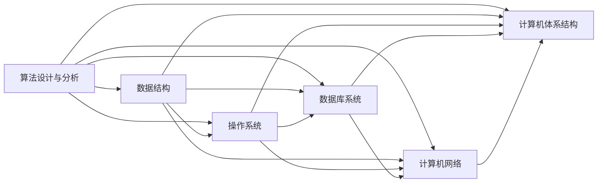

                 

## 1. 背景介绍

### 1.1 问题由来

在数字化、智能化的今天，计算机科学和信息技术已成为推动社会进步的重要力量。计算机科学的核心理论和方法，已经渗透到了生活的方方面面，从互联网、物联网，到金融、医疗、教育等多个领域，都离不开算法的支持和驱动。因此，对于想要深入了解和掌握计算机科学的人来说，构建一个坚实的基础知识体系，显得尤为重要。

### 1.2 问题核心关键点

计算机科学的知识体系庞大而复杂，但其中一些关键理论和算法，能够为理解其他高级概念和实践提供基础支撑。以下是计算机科学中最为经典和核心的概念与算法：

- 算法设计与分析：解决具体问题的算法如何设计，以及如何评估算法的效率和性能。
- 数据结构：存储和组织数据的方式，包括数组、链表、树、图等基本数据结构，以及它们的应用场景和性能分析。
- 操作系统：计算机硬件与软件之间的接口，包括进程管理、内存管理、文件系统、I/O等。
- 数据库系统：数据存储和检索的技术，包括关系型数据库和NoSQL数据库，以及SQL语言和NoSQL API。
- 计算机网络：互联网的底层原理和协议，包括TCP/IP协议、HTTP协议、DNS、路由、负载均衡等。
- 计算机体系结构：计算机硬件的组成和设计原理，包括CPU、内存、存储器、I/O设备等。

理解这些核心概念和算法，能够帮助读者构建起计算机科学的认知根基，从而进一步深入学习和实践高级的计算机技术和算法。

### 1.3 问题研究意义

构建经典阅读清单，旨在为读者提供一个系统的学习路径，帮助他们快速入门并掌握计算机科学的核心知识。通过对这些经典概念和算法的学习，读者不仅能够为后续高级课程和项目实践打下坚实的基础，还能在实际应用中更加得心应手。

## 2. 核心概念与联系

### 2.1 核心概念概述

为了更好地理解这些经典概念之间的联系，我们需要首先了解它们的定义和基本原理。

- **算法设计与分析**：指如何设计和评估算法，以解决特定问题。常见算法设计策略包括贪心算法、动态规划、分治算法等。算法分析则涉及时间复杂度和空间复杂度的计算。
- **数据结构**：用于存储和组织数据的结构，如数组、链表、树、图等。数据结构的选择直接影响算法的效率和性能。
- **操作系统**：管理计算机硬件资源和提供服务给应用程序的软件。关键概念包括进程管理、内存管理、文件系统和I/O。
- **数据库系统**：用于存储、检索和管理数据的软件系统。常见的数据库类型包括关系型数据库和NoSQL数据库。
- **计算机网络**：计算机之间通过网络进行通信的体系结构。主要协议包括TCP/IP、HTTP等。
- **计算机体系结构**：计算机硬件和软件的接口，包括CPU、内存、I/O等组件的设计和交互。

这些概念之间的联系可以通过以下Mermaid流程图来展示：



这个流程图展示了算法设计与分析与数据结构、操作系统、数据库系统、计算机网络和计算机体系结构之间的内在联系。算法和数据结构为操作系统和数据库系统的设计和实现提供了基础；操作系统和计算机网络为计算机体系结构的设计提供了参考；而计算机体系结构则为算法和数据结构提供了硬件支持。

## 3. 核心算法原理 & 具体操作步骤

### 3.1 算法原理概述

经典算法是计算机科学中的重要组成部分，它们解决具体问题的方法和步骤具有一定的普适性和可重复性。

- **贪心算法**：每一步都选择当前看来最优的解，通常用于解决优化问题。
- **动态规划**：将问题分解成子问题，通过求解子问题的最优解，得到原问题的最优解。
- **分治算法**：将问题分解成多个子问题，递归求解子问题，然后将子问题的解合并得到原问题的解。
- **排序算法**：用于将一组数据按照一定规则排序，如快速排序、归并排序、堆排序等。
- **搜索算法**：在数据集合中寻找符合特定条件的元素，如深度优先搜索、广度优先搜索等。

### 3.2 算法步骤详解

下面以排序算法中的快速排序为例，详细介绍其原理和步骤。

**快速排序算法原理**：
快速排序是一种高效的排序算法，通过分治的思想，将一个大问题分解为若干个小问题，然后递归解决这些小问题，最终合并得到原问题的解。

**快速排序算法步骤**：
1. 选择一个基准值（pivot），将数据分成两部分，一部分小于基准值，一部分大于基准值。
2. 对小于基准值的部分递归地应用快速排序算法。
3. 对大于基准值的部分递归地应用快速排序算法。
4. 合并两个有序的部分，得到排序结果。

具体实现代码如下：

```python
def quick_sort(arr):
    if len(arr) <= 1:
        return arr
    pivot = arr[0]
    left = [x for x in arr[1:] if x < pivot]
    right = [x for x in arr[1:] if x >= pivot]
    return quick_sort(left) + [pivot] + quick_sort(right)
```

### 3.3 算法优缺点

**快速排序算法的优点**：
- 排序效率高，平均时间复杂度为O(n log n)。
- 原地排序，不需要额外的存储空间。
- 递归实现简单，易于理解和实现。

**快速排序算法的缺点**：
- 在最坏情况下，时间复杂度为O(n^2)，如基准值选取不当导致每次划分都只得到一个元素的情况。
- 不稳定排序，相等的元素可能会改变位置。
- 对于小规模数据，排序效率可能不如插入排序等其他简单排序算法。

### 3.4 算法应用领域

快速排序算法广泛应用于各种排序场景，如数据库排序、排序算法库等。除此之外，快速排序的思想还被应用于其他算法中，如快速选择算法和快速布隆过滤器等。

## 4. 数学模型和公式 & 详细讲解 & 举例说明

### 4.1 数学模型构建

为了更好地理解算法原理，我们需要使用数学模型来描述算法的计算过程和效率分析。

- **时间复杂度**：用于衡量算法执行时间与问题规模n之间的关系。常见时间复杂度包括O(1)、O(log n)、O(n)、O(n log n)、O(n^2)等。
- **空间复杂度**：用于衡量算法执行过程中所需的额外存储空间与问题规模n之间的关系。
- **渐进分析**：通过分析算法在不同规模下的运行时间，来评估算法的效率和性能。

### 4.2 公式推导过程

以快速排序算法为例，计算其时间复杂度和空间复杂度：

**时间复杂度**：
- 最好情况下，每次划分都能将问题规模减半，时间复杂度为O(n log n)。
- 最坏情况下，每次划分只得到一个元素，时间复杂度为O(n^2)。
- 平均情况下，时间复杂度为O(n log n)。

**空间复杂度**：
- 快速排序是原地排序，不使用额外的存储空间，空间复杂度为O(1)。

**渐进分析**：
- 通过分析快速排序在不同规模下的运行时间，可以得出其平均时间复杂度为O(n log n)。

### 4.3 案例分析与讲解

以归并排序算法为例，分析其时间复杂度和空间复杂度：

**归并排序算法时间复杂度**：
- 归并排序的时间复杂度为O(n log n)。
- 归并排序需要额外的存储空间，空间复杂度为O(n)。

**归并排序算法空间复杂度**：
- 归并排序需要额外的存储空间，用于合并两个有序数组。
- 在空间限制较小的情况下，归并排序可能不适合大规模数据的排序。

**归并排序算法渐进分析**：
- 通过分析归并排序在不同规模下的运行时间，可以得出其时间复杂度为O(n log n)。

## 5. 项目实践：代码实例和详细解释说明

### 5.1 开发环境搭建

在进行算法实践前，我们需要准备好开发环境。以下是使用Python进行算法开发的环境配置流程：

1. 安装Anaconda：从官网下载并安装Anaconda，用于创建独立的Python环境。
2. 创建并激活虚拟环境：
```bash
conda create -n py-env python=3.8 
conda activate py-env
```
3. 安装Python开发工具包：
```bash
pip install numpy scipy pandas matplotlib
```
4. 安装算法开发库：
```bash
pip install scikit-learn
```

完成上述步骤后，即可在`py-env`环境中开始算法实践。

### 5.2 源代码详细实现

以下是使用Python实现快速排序算法的代码：

```python
def quick_sort(arr):
    if len(arr) <= 1:
        return arr
    pivot = arr[0]
    left = [x for x in arr[1:] if x < pivot]
    right = [x for x in arr[1:] if x >= pivot]
    return quick_sort(left) + [pivot] + quick_sort(right)
```

### 5.3 代码解读与分析

让我们再详细解读一下关键代码的实现细节：

**快速排序算法**：
- 首先判断数组长度是否小于等于1，如果是，则直接返回数组。
- 选择第一个元素作为基准值，将数组分为左右两部分。
- 递归地对左右两部分进行快速排序，并合并结果。

**代码实现**：
- 通过列表解析，将小于基准值的元素放在左侧，大于等于基准值的元素放在右侧。
- 递归调用快速排序函数，对左右两部分分别进行排序。
- 将排序后的左部分、基准值和排序后的右部分合并。

**时间复杂度分析**：
- 平均情况下，时间复杂度为O(n log n)。
- 最坏情况下，时间复杂度为O(n^2)。

## 6. 实际应用场景

### 6.1 排序算法在数据库中的应用

数据库系统中的排序算法，主要用于对数据进行排序和查询。常见的排序算法有快速排序、归并排序、堆排序等。

### 6.2 排序算法在算法库中的应用

排序算法在算法库中得到了广泛应用。如Python标准库中的`sorted`函数，就采用了Timsort算法，它结合了归并排序和插入排序的优点，能够在O(n log n)的时间复杂度内完成排序。

### 6.3 排序算法在计算机网络中的应用

计算机网络中的数据包排序，主要用于对网络数据包进行排序和重构。常见的排序算法有快速排序、归并排序等。

### 6.4 排序算法在操作系统中的应用

操作系统中的进程调度，需要使用排序算法对进程进行优先级排序。常见的排序算法有快速排序、堆排序等。

## 7. 工具和资源推荐

### 7.1 学习资源推荐

为了帮助读者系统掌握算法设计与分析、数据结构、操作系统等核心概念，以下是一些推荐的学习资源：

1. 《算法导论》：清华大学出版社出版的经典教材，系统介绍了算法设计与分析的基本概念和算法设计策略。
2. 《数据结构与算法分析》：由Introduction to Algorithms第3版翻译而来，系统介绍了数据结构的基本概念和算法实现。
3. 《操作系统概念》：由操作系统领域经典教材The Design and Analysis of Computer Algorithms翻译而来，系统介绍了操作系统的基本概念和设计原理。
4. 《数据库系统概论》：清华大学出版社出版的经典教材，系统介绍了数据库系统的基本概念和实现原理。
5. 《计算机网络：自顶向下方法》：由计算机网络领域经典教材Computer Networking翻译而来，系统介绍了计算机网络的基本概念和协议实现。

### 7.2 开发工具推荐

高效的开发离不开优秀的工具支持。以下是几款用于算法开发的常用工具：

1. Python：基于Python的算法开发工具，具有强大的数据处理和科学计算能力，适合快速原型开发。
2. C++：面向对象的算法开发工具，性能优越，适合高性能算法实现。
3. Matlab：数学计算和可视化工具，适合科学计算和数据分析。
4. IDEA：集成开发环境，支持多种编程语言和开发工具。
5. Visual Studio：可视化开发工具，支持Windows系统下的算法开发。

### 7.3 相关论文推荐

算法设计与分析、数据结构、操作系统等领域的研究，在学界已经取得了丰富的成果。以下是一些经典论文，推荐阅读：

1. "The Art of Computer Programming, Volume 1: Fundamental Algorithms" by Donald E. Knuth：经典算法设计与分析教材，涵盖大量算法设计和分析的原理和技巧。
2. "Introduction to Algorithms" by Cormen, Leiserson, Rivest, Stein：计算机算法领域的经典教材，介绍了多种算法的实现和分析方法。
3. "Operating System Concepts" by Silberschatz, Galvin, Gagne：操作系统领域的经典教材，系统介绍了操作系统的基本概念和设计原理。
4. "Database Systems: The Complete Book" by C.J. Date：数据库系统领域的经典教材，系统介绍了数据库系统的基本概念和实现原理。
5. "Computer Networking: A Top-Down Approach" by James F. Kurose, Keith W. Ross：计算机网络领域的经典教材，系统介绍了计算机网络的基本概念和协议实现。

## 8. 总结：未来发展趋势与挑战

### 8.1 总结

本文对算法设计与分析、数据结构、操作系统等经典概念进行了详细介绍，并提供了系统性的学习路径。通过对这些经典概念和算法的学习，读者可以构建起计算机科学的认知根基，为后续高级课程和项目实践打下坚实的基础。

### 8.2 未来发展趋势

展望未来，计算机科学在算法设计与分析、数据结构、操作系统等领域将呈现出以下发展趋势：

1. 算法设计与分析将更加注重算法的可解释性和可理解性，提高算法的可扩展性和可重用性。
2. 数据结构将向着更高效、更灵活的方向发展，满足大数据、分布式计算等新兴技术的需求。
3. 操作系统将向着更智能、更自动化的方向发展，支持云计算、大数据、人工智能等新兴技术。
4. 数据库系统将向着更高效、更智能的方向发展，支持海量数据的存储、检索和分析。
5. 计算机网络将向着更安全、更高效的方向发展，支持5G、物联网等新兴技术。

### 8.3 面临的挑战

尽管计算机科学在算法设计与分析、数据结构、操作系统等领域已经取得了显著进展，但在迈向更加智能化、普适化应用的过程中，仍面临诸多挑战：

1. 算法设计与分析的复杂度：在处理大规模、复杂问题时，算法设计与分析的复杂度可能会显著增加。
2. 数据结构的存储和操作效率：在大规模数据存储和处理时，数据结构的存储和操作效率可能会受到影响。
3. 操作系统的资源管理和调度：在分布式计算和高性能计算环境中，操作系统的资源管理和调度可能面临新的挑战。
4. 数据库系统的扩展性和一致性：在大数据和分布式存储环境下，数据库系统的扩展性和一致性问题可能会变得更加复杂。
5. 计算机网络的安全性和可靠性：在5G和物联网等新兴技术背景下，计算机网络的安全性和可靠性需要进一步提升。

### 8.4 研究展望

未来在算法设计与分析、数据结构、操作系统等领域，需要从以下几个方面进行深入研究：

1. 算法设计与分析：探索更加高效、可解释性更强的算法设计和分析方法，提升算法的可扩展性和可重用性。
2. 数据结构：研究更高效、更灵活的数据结构，满足大数据、分布式计算等新兴技术的需求。
3. 操作系统：研究更加智能、自动化的操作系统，支持云计算、大数据、人工智能等新兴技术。
4. 数据库系统：研究更加高效、智能的数据库系统，支持海量数据的存储、检索和分析。
5. 计算机网络：研究更加安全、可靠的网络技术和协议，支持5G、物联网等新兴技术。

这些研究方向的探索，将有助于计算机科学在更多领域的应用，推动人工智能、大数据、云计算等新兴技术的进步。通过不断探索和创新，计算机科学必将迎来更加辉煌的未来。

## 9. 附录：常见问题与解答

**Q1: 什么是算法设计与分析？**

A: 算法设计与分析是指设计能够有效解决特定问题的算法，并分析算法的时间复杂度和空间复杂度，从而评估算法的效率和性能。

**Q2: 数据结构的基本类型有哪些？**

A: 数据结构的基本类型包括数组、链表、树、图等。数组和链表是线性结构，树和图是非线性结构。

**Q3: 什么是操作系统？**

A: 操作系统是管理计算机硬件资源和提供服务给应用程序的软件。操作系统的主要功能包括进程管理、内存管理、文件系统、I/O等。

**Q4: 数据库系统的基本类型有哪些？**

A: 数据库系统的基本类型包括关系型数据库和NoSQL数据库。关系型数据库使用SQL语言进行数据操作，NoSQL数据库使用不同的API进行数据操作。

**Q5: 计算机网络的基本协议有哪些？**

A: 计算机网络的基本协议包括TCP/IP协议、HTTP协议、DNS、路由、负载均衡等。

**Q6: 什么是计算机体系结构？**

A: 计算机体系结构是计算机硬件和软件的接口，包括CPU、内存、I/O等组件的设计和交互。

---

作者：禅与计算机程序设计艺术 / Zen and the Art of Computer Programming

