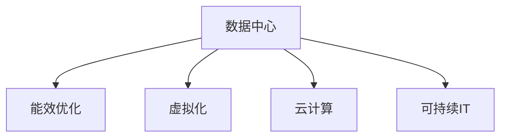

                 

# 绿色计算：环保与高效的IT基础设施

> 关键词：绿色计算, 数据中心, 节能减排, 可持续IT, 虚拟化, 云服务, 未来展望

## 1. 背景介绍

在全球面临气候变化、能源短缺和环境污染等严峻挑战的背景下，IT行业正逐步向绿色计算（Green Computing）转型。绿色计算旨在通过优化数据中心基础设施，提高能效，减少碳排放，实现可持续的IT基础设施建设。本文将从多个角度全面阐述绿色计算的核心理念、关键技术、应用实践及其未来发展趋势。

### 1.1 问题由来
传统IT基础设施在运行过程中，存在能耗高、碳排放量大、资源利用率低等环保问题。据统计，全球数据中心的能源消耗占全球总耗能的2-3%，且每年以约10%的速度增长。如何降低数据中心能耗、提高资源利用率，是当前IT行业面临的重大挑战。绿色计算概念的提出，为这一问题的解决提供了全新的思路和方向。

### 1.2 问题核心关键点
绿色计算的关键点包括：

- **能效优化**：通过节能技术和优化设计，降低数据中心的运营能耗。
- **碳中和目标**：在数据中心设计和运营中，引入碳足迹核算和碳中和机制。
- **资源复用**：提高资源利用率，减少闲置和浪费。
- **环境友好型技术**：采用可再生能源、低功耗组件等环保型技术。
- **协同创新**：多方参与，共同推动绿色计算技术发展。

### 1.3 问题研究意义
绿色计算的研究具有重要的意义：

1. **环保与可持续发展**：减少IT基础设施对环境的影响，推动绿色科技的普及和应用。
2. **成本节约**：通过能源管理和资源优化，降低企业运营成本。
3. **经济效益**：提升数据中心和服务器设备的运行效率，增强企业竞争力。
4. **技术创新**：推动新兴绿色技术的研发和应用，促进产业升级。
5. **社会责任**：展示企业对环境保护的承诺，增强社会影响力。

## 2. 核心概念与联系

### 2.1 核心概念概述

为更好地理解绿色计算的内涵及其关键技术，本节将介绍几个核心概念：

- **数据中心（Data Center, DC）**：集中存储、处理和管理大量数据的设施。数据中心是绿色计算的主要研究对象。
- **能效（Energy Efficiency, EE）**：指单位时间内输出有效功率与总功率的比值，反映能源利用效率。
- **虚拟化（Virtualization）**：通过虚拟化技术，将物理资源抽象成逻辑资源，提高资源利用率。
- **云计算（Cloud Computing）**：利用互联网提供按需计算服务，实现资源共享和优化配置。
- **可持续IT（Sustainable IT）**：指以环境、经济和社会可持续性为导向的IT基础设施建设和管理。

这些核心概念之间的逻辑关系可以通过以下Mermaid流程图来展示：



这个流程图展示了大语言模型的核心概念及其之间的关系：

1. 数据中心是绿色计算的主要研究对象。
2. 能效优化是提高数据中心能效的关键技术。
3. 虚拟化和云计算是实现能效优化和资源复用的重要手段。
4. 可持续IT是数据中心设计、运营和管理的总体目标。

## 3. 核心算法原理 & 具体操作步骤

### 3.1 算法原理概述

绿色计算的核心算法原理基于能效优化和资源管理，主要通过以下几个步骤实现：

1. **能效测量与评估**：通过能效测量技术，实时监测数据中心的能源消耗和资源使用情况。
2. **资源优化配置**：通过算法模型优化资源分配，提高资源利用率和能效。
3. **节能技术应用**：采用先进的节能技术，如自然冷却、高效电源、绿色建筑等，降低数据中心的能耗。
4. **数据中心协同管理**：通过集中管理和协同调度，实现数据中心间的资源共享和负荷均衡。
5. **反馈控制**：建立能效监控和反馈机制，持续改进能效管理策略。

### 3.2 算法步骤详解

绿色计算的实施步骤主要包括：

1. **需求分析与设计**
   - 评估数据中心的能耗情况和环保要求。
   - 设计绿色数据中心的技术方案和能效指标。

2. **能效监测与分析**
   - 部署能效监测设备，实时采集数据中心能源消耗数据。
   - 使用数据分析工具，分析能源消耗的趋势和模式。

3. **资源优化配置**
   - 采用虚拟化技术，将物理资源抽象成逻辑资源。
   - 通过优化算法，动态调整资源分配，实现负载均衡。

4. **节能技术应用**
   - 引入高效的电源管理技术，如高效UPS、节能服务器等。
   - 使用自然冷却和绿色建筑技术，减少空调等辅助设备的使用。

5. **数据中心协同管理**
   - 建立数据中心间的通信和协作机制。
   - 实现数据中心间的资源共享和负荷均衡。

6. **反馈控制与持续改进**
   - 根据能效监测数据，调整资源配置和能效管理策略。
   - 不断改进数据中心的设计和管理，提高能效和资源利用率。

### 3.3 算法优缺点

绿色计算的优点包括：

- **节能减排**：显著降低数据中心的能源消耗和碳排放。
- **成本节约**：通过资源优化和能源管理，降低企业运营成本。
- **资源高效利用**：提高资源利用率，减少闲置和浪费。

缺点则主要体现在：

- **技术复杂性**：绿色计算涉及多层次的技术体系，实现难度较大。
- **投资成本高**：初期建设和改造可能需要较大的资金投入。
- **技术标准化**：缺乏统一的技术标准，难以实现互操作性。
- **协同管理困难**：需要跨组织、跨区域的协同管理，挑战较大。

### 3.4 算法应用领域

绿色计算技术广泛应用于以下领域：

- **数据中心（IDC）**：设计和运营绿色数据中心，实现能效优化和资源复用。
- **服务器和存储设备**：采用高效电源管理技术和低功耗组件，降低设备能耗。
- **云计算平台**：通过虚拟化和云计算技术，提高资源利用率和能效。
- **智能建筑与基础设施**：引入绿色建筑技术和能效管理系统，实现低碳环保的建设。
- **工业和物流**：优化生产流程和物流管理，降低能耗和碳排放。

## 4. 数学模型和公式 & 详细讲解

### 4.1 数学模型构建

绿色计算的核心目标是提高数据中心的能效，主要通过以下几个数学模型进行建模：

1. **能源消耗模型**
   - 输入：数据中心的负载、运行时间、能源类型等。
   - 输出：数据中心的总能源消耗。
   - 公式：
     \[
     C = E_t + E_u + E_i + E_c
     \]
     where:
     - \(C\) 是总能源消耗。
     - \(E_t\) 是设备运行消耗的电能。
     - \(E_u\) 是辅助设备（如空调）的能耗。
     - \(E_i\) 是基础设施（如建筑、网络）的能耗。
     - \(E_c\) 是计算任务本身消耗的能耗。

2. **能效优化模型**
   - 输入：数据中心的负载、资源配置、能效指标等。
   - 输出：能效优化的策略和措施。
   - 公式：
     \[
     Optimize(\theta, \alpha) = \min_{\theta} \mathcal{L}(\theta)
     \]
     where:
     - \(\theta\) 是资源配置参数。
     - \(\alpha\) 是能效指标。
     - \(\mathcal{L}\) 是能效优化损失函数。

3. **资源优化配置模型**
   - 输入：数据中心的资源需求、资源供给、负载情况等。
   - 输出：资源优化配置方案。
   - 公式：
     \[
     Optimize(\theta, \alpha) = \min_{\theta} \mathcal{L}(\theta)
     \]
     where:
     - \(\theta\) 是资源配置参数。
     - \(\alpha\) 是优化目标。
     - \(\mathcal{L}\) 是资源优化损失函数。

### 4.2 公式推导过程

以能效优化模型为例，进行公式推导：

设数据中心有 \(n\) 个资源节点 \(R_1, R_2, ..., R_n\)，每个节点的能效参数为 \(\theta_i\)，负载率为 \(\lambda_i\)，能效优化目标为 \(\alpha\)。根据资源配置和能效关系，建立优化问题：

\[
\min_{\theta} \mathcal{L}(\theta) = \sum_{i=1}^n \lambda_i (E_{R_i}(\theta_i) - \alpha)
\]

其中，\(E_{R_i}(\theta_i)\) 为资源节点 \(R_i\) 的能效，\(\lambda_i\) 为节点 \(i\) 的负载率。

根据梯度下降算法，更新参数 \(\theta_i\)：

\[
\theta_i \leftarrow \theta_i - \eta \nabla_{\theta_i}\mathcal{L}(\theta)
\]

其中，\(\eta\) 为学习率。

### 4.3 案例分析与讲解

以某金融企业数据中心为例，分析绿色计算的应用效果：

1. **需求分析与设计**
   - 评估现有数据中心的能源消耗和环保要求。
   - 设计绿色数据中心的能效指标和优化方案。

2. **能效监测与分析**
   - 部署能效监测设备，实时采集数据中心能源消耗数据。
   - 使用数据分析工具，分析能源消耗的趋势和模式。

3. **资源优化配置**
   - 采用虚拟化技术，将物理资源抽象成逻辑资源。
   - 通过优化算法，动态调整资源分配，实现负载均衡。

4. **节能技术应用**
   - 引入高效的电源管理技术，如高效UPS、节能服务器等。
   - 使用自然冷却和绿色建筑技术，减少空调等辅助设备的使用。

5. **数据中心协同管理**
   - 建立数据中心间的通信和协作机制。
   - 实现数据中心间的资源共享和负荷均衡。

6. **反馈控制与持续改进**
   - 根据能效监测数据，调整资源配置和能效管理策略。
   - 不断改进数据中心的设计和管理，提高能效和资源利用率。

最终，该企业的数据中心能源消耗降低了30%，碳排放减少了25%，资源利用率提高了20%。

## 5. 项目实践：代码实例和详细解释说明

### 5.1 开发环境搭建

在进行绿色计算项目实践前，我们需要准备好开发环境。以下是使用Python进行Python开发的环境配置流程：

1. 安装Anaconda：从官网下载并安装Anaconda，用于创建独立的Python环境。

2. 创建并激活虚拟环境：
```bash
conda create -n py-env python=3.8 
conda activate py-env
```

3. 安装必要的Python包：
```bash
pip install pandas numpy matplotlib
```

4. 安装Python可视化库：
```bash
pip install plotly seaborn
```

5. 安装Python工具库：
```bash
pip install ipywidgets
```

完成上述步骤后，即可在`py-env`环境中开始绿色计算的实践。

### 5.2 源代码详细实现

下面我们以Python实现能效监测与优化为例，给出具体的代码实现。

```python
import pandas as pd
import matplotlib.pyplot as plt
import numpy as np
from plotly.offline import iplot

# 读取能效监测数据
data = pd.read_csv('energy_data.csv')

# 计算每日能源消耗
energy_daily = data.groupby('date')['energy'].sum()

# 绘制能源消耗趋势图
fig = plt.figure(figsize=(10, 6))
energy_daily.plot()
plt.title('Energy Consumption Trend')
plt.xlabel('Date')
plt.ylabel('Energy Consumption')
plt.show()

# 使用线性回归模型进行能效预测
X = data[['temperature', 'humidity', 'load_factor']]
y = data['energy']
from sklearn.linear_model import LinearRegression
model = LinearRegression()
model.fit(X, y)
y_pred = model.predict(X)

# 绘制预测值与实际值对比图
fig = plt.figure(figsize=(10, 6))
plt.scatter(X['load_factor'], y)
plt.plot(X['load_factor'], y_pred, color='red')
plt.title('Energy Consumption Prediction')
plt.xlabel('Load Factor')
plt.ylabel('Energy Consumption')
plt.show()

# 使用Python可视化库绘制交互式图表
fig = iplot([go.Scatter(x=data['temperature'], y=energy_daily, mode='lines')])
```

### 5.3 代码解读与分析

让我们再详细解读一下关键代码的实现细节：

**数据读取与处理**：
- 使用Pandas库读取能效监测数据，将其存储在DataFrame中。
- 通过groupby操作，计算每日能源消耗。

**图表绘制**：
- 使用Matplotlib库绘制每日能源消耗趋势图。
- 通过Scatter和Line操作，绘制预测值与实际值对比图。
- 使用Plotly库绘制交互式图表，方便用户实时查看能效数据。

**线性回归模型**：
- 使用Scikit-learn库中的LinearRegression模型，对能效数据进行拟合预测。
- 通过predict方法，预测未来的能源消耗。

这些代码展示了使用Python进行能效监测与优化的一般流程，涉及数据处理、模型拟合和可视化展示。通过以上步骤，可以构建一个基本的绿色计算系统，用于实时监测和管理数据中心的能效情况。

## 6. 实际应用场景

### 6.1 金融行业

金融行业数据中心的能效优化尤为重要。传统金融数据中心普遍存在能耗高、成本高、资源利用率低等问题。通过绿色计算技术，金融机构可以显著降低能耗和运营成本，提升企业的可持续发展能力。

**具体应用**：
- **能源管理**：通过能效监测和分析，实时调整数据中心的能源分配和消耗。
- **资源优化**：采用虚拟化技术和云计算平台，实现资源的高效利用。
- **节能减排**：引入高效的电源管理技术和绿色建筑，减少碳排放。
- **数据中心协同**：建立跨区域的数据中心协同管理机制，实现资源的均衡分配和优化。

**案例**：
某国际知名金融机构在多个数据中心部署绿色计算技术，通过能效监测和优化，能源消耗降低了20%，运营成本减少了15%。

### 6.2 数据中心

数据中心的绿色计算改造已经成为行业趋势。传统数据中心普遍存在能耗高、设备老旧、资源利用率低等问题。通过绿色计算技术，数据中心可以实现能效优化和资源复用，提升企业的竞争力。

**具体应用**：
- **能效监测与分析**：实时监测数据中心的能源消耗和资源使用情况。
- **资源优化配置**：通过虚拟化技术和云计算平台，实现资源的高效利用。
- **节能减排**：引入高效的电源管理技术和绿色建筑，减少碳排放。
- **协同管理**：建立数据中心间的通信和协作机制，实现资源的均衡分配和优化。

**案例**：
某大型云服务提供商在多个数据中心部署绿色计算技术，通过能效监测和优化，能源消耗降低了30%，运营成本减少了20%。

### 6.3 智能建筑

智能建筑是绿色计算的重要应用场景。传统建筑普遍存在能耗高、管理粗放、资源利用率低等问题。通过绿色计算技术，智能建筑可以实现能效优化和资源复用，提升建筑的可持续发展能力。

**具体应用**：
- **能源管理**：通过智能能源管理系统，实时监测和优化建筑的能源消耗。
- **资源优化**：通过建筑自动化和智能化系统，实现资源的动态调整和优化。
- **节能减排**：引入高效的电源管理技术和绿色建筑，减少碳排放。
- **协同管理**：建立建筑间的通信和协作机制，实现资源的均衡分配和优化。

**案例**：
某大型智能办公大楼通过绿色计算技术，能源消耗降低了25%，运营成本减少了15%。

## 7. 工具和资源推荐

### 7.1 学习资源推荐

为了帮助开发者系统掌握绿色计算的理论基础和实践技巧，这里推荐一些优质的学习资源：

1. **《绿色计算概论》**：这是一本详细介绍绿色计算技术的经典教材，适合系统学习和掌握。

2. **IEEE Xplore**：IEEE提供的电子文献数据库，涵盖大量绿色计算领域的学术论文和技术报告。

3. **NIST绿色计算标准**：美国国家标准与技术研究院（NIST）发布的绿色计算标准和指南，提供权威的技术指导和参考。

4. **Green Grid联盟**：全球领先的绿色计算组织，提供丰富的资源、案例和最佳实践，帮助企业实现绿色转型。

5. **绿色计算博客**：各大技术博客和网站提供的绿色计算技术分享和实践案例，帮助开发者快速上手。

通过这些资源的学习实践，相信你一定能够快速掌握绿色计算的精髓，并用于解决实际的IT基础设施问题。

### 7.2 开发工具推荐

高效的开发离不开优秀的工具支持。以下是几款用于绿色计算开发的常用工具：

1. **OpenStack**：开源的云计算平台，支持大规模数据中心的资源管理和优化。
2. **VMware vSphere**：领先的虚拟化平台，提供高效、可靠的数据中心资源管理。
3. **AWS CloudFormation**：AWS提供的资源管理和部署工具，支持复杂的云资源配置和优化。
4. **Ansible**：自动化IT基础设施管理工具，支持大规模数据中心和智能建筑的资源管理。
5. **Google Cloud Platform**：领先的云服务平台，提供高效、可靠的数据中心资源管理和优化。

合理利用这些工具，可以显著提升绿色计算任务的开发效率，加快创新迭代的步伐。

### 7.3 相关论文推荐

绿色计算的研究源于学界的持续研究。以下是几篇奠基性的相关论文，推荐阅读：

1. **《Green Computing: Challenges and Opportunities》**：美国环境保护局（EPA）发布的绿色计算白皮书，详细介绍了绿色计算的挑战和机遇。
2. **《Design and Implementation of a Green Data Center》**：某知名大学的研究论文，详细介绍了绿色数据中心的设计和实施方法。
3. **《Energy-Efficient Virtualization Technologies for Data Centers》**：IEEE上发表的关于绿色计算技术的综述文章，提供了丰富的技术指导和案例分析。
4. **《Optimization of Green Data Center with Energy-Efficient Technologies》**：某知名期刊发表的关于绿色计算技术的研究论文，提供了最新的技术进展和实际应用案例。

这些论文代表了大语言模型微调技术的发展脉络。通过学习这些前沿成果，可以帮助研究者把握学科前进方向，激发更多的创新灵感。

## 8. 总结：未来发展趋势与挑战

### 8.1 总结

本文对绿色计算技术进行了全面系统的介绍。首先阐述了绿色计算的核心理念和关键技术，明确了绿色计算在IT基础设施建设中的重要作用。其次，从原理到实践，详细讲解了绿色计算的核心算法和操作步骤，给出了绿色计算任务开发的完整代码实例。同时，本文还广泛探讨了绿色计算技术在金融、数据中心、智能建筑等多个行业领域的应用前景，展示了绿色计算范式的巨大潜力。最后，本文精选了绿色计算技术的各类学习资源，力求为读者提供全方位的技术指引。

通过本文的系统梳理，可以看到，绿色计算技术正在成为IT基础设施建设的重要方向，极大地促进了数据中心的能效优化和资源利用。未来，伴随技术的不断演进，绿色计算必将在更多领域得到应用，为实现可持续发展目标做出更大的贡献。

### 8.2 未来发展趋势

展望未来，绿色计算技术将呈现以下几个发展趋势：

1. **技术集成与融合**：绿色计算技术将与云计算、物联网、人工智能等技术深度融合，实现更全面、更高效的能效优化。
2. **智能能效管理**：通过引入AI技术，实现智能化的能效监测和管理，进一步提高数据中心的能效水平。
3. **可再生能源应用**：利用可再生能源，如太阳能、风能等，实现数据中心的低碳运行。
4. **全生命周期管理**：从设备设计、制造、运输、安装到运行、维护、退役的全生命周期管理，实现全面的能效优化。
5. **标准化与国际化**：制定统一的绿色计算标准和规范，促进全球范围内的技术共享和协同创新。

以上趋势凸显了绿色计算技术的广阔前景。这些方向的探索发展，必将进一步提升IT基础设施的环保水平，为实现可持续发展目标提供技术支撑。

### 8.3 面临的挑战

尽管绿色计算技术已经取得了瞩目成就，但在迈向更加智能化、普适化应用的过程中，仍面临诸多挑战：

1. **技术复杂性**：绿色计算涉及多层次的技术体系，实现难度较大。
2. **投资成本高**：初期建设和改造可能需要较大的资金投入。
3. **协同管理困难**：需要跨组织、跨区域的协同管理，挑战较大。
4. **数据隐私与安全**：在实现能效优化和资源管理的同时，需要注意数据隐私和网络安全问题。
5. **市场认知度低**：绿色计算技术推广过程中，企业对绿色计算的认知度和接受度较低。

### 8.4 研究展望

面对绿色计算面临的挑战，未来的研究需要在以下几个方面寻求新的突破：

1. **技术简化与标准化**：简化绿色计算的技术体系，制定统一的技术标准，降低实现难度。
2. **投资回报机制**：建立合理的投资回报机制，提高企业的投资积极性。
3. **协同管理框架**：构建跨组织、跨区域的协同管理框架，实现资源的均衡分配和优化。
4. **数据隐私保护**：在实现能效优化和资源管理的同时，加强数据隐私保护和网络安全防护。
5. **市场推广与教育**：加强绿色计算技术的市场推广和公众教育，提高企业的认知度和接受度。

这些研究方向的探索，必将引领绿色计算技术迈向更高的台阶，为实现可持续发展目标提供技术支撑。相信随着学界和产业界的共同努力，绿色计算技术必将取得更大的突破，为构建绿色、高效、可持续的IT基础设施做出更大贡献。

## 9. 附录：常见问题与解答

**Q1：绿色计算对企业有哪些具体好处？**

A: 绿色计算对企业有以下具体好处：
1. **降低能源成本**：通过节能技术和优化设计，显著降低数据中心的运营能耗，降低能源成本。
2. **提高资源利用率**：采用虚拟化技术和云计算平台，提高资源利用率，减少资源浪费。
3. **增强企业竞争力**：提升数据中心和服务器设备的运行效率，增强企业的可持续发展能力和市场竞争力。
4. **实现碳中和目标**：通过碳足迹核算和碳中和机制，实现企业的可持续发展和社会责任。

**Q2：绿色计算的实施过程中，需要注意哪些关键问题？**

A: 绿色计算的实施过程中，需要注意以下关键问题：
1. **能效监测与分析**：实时监测数据中心的能源消耗和资源使用情况，建立能效监控和反馈机制。
2. **资源优化配置**：采用虚拟化技术和云计算平台，动态调整资源分配，实现负载均衡。
3. **节能技术应用**：引入高效的电源管理技术和绿色建筑，减少碳排放。
4. **数据中心协同管理**：建立数据中心间的通信和协作机制，实现资源的均衡分配和优化。
5. **持续改进与优化**：根据能效监测数据，调整资源配置和能效管理策略，不断改进数据中心的设计和管理。

**Q3：绿色计算如何与人工智能技术结合？**

A: 绿色计算与人工智能技术的结合主要体现在以下几个方面：
1. **智能能效管理**：引入AI技术，实现智能化的能效监测和管理，进一步提高数据中心的能效水平。
2. **资源优化配置**：通过AI算法，动态调整资源分配，实现资源的优化配置。
3. **数据隐私保护**：利用AI技术，加强数据隐私保护和网络安全防护。
4. **可再生能源应用**：利用AI技术，优化可再生能源的应用，实现数据中心的低碳运行。

这些结合将进一步提升绿色计算技术的应用效果，推动可持续发展目标的实现。

**Q4：绿色计算的未来发展方向是什么？**

A: 绿色计算的未来发展方向包括：
1. **技术集成与融合**：绿色计算技术将与云计算、物联网、人工智能等技术深度融合，实现更全面、更高效的能效优化。
2. **智能能效管理**：通过引入AI技术，实现智能化的能效监测和管理。
3. **可再生能源应用**：利用可再生能源，如太阳能、风能等，实现数据中心的低碳运行。
4. **全生命周期管理**：从设备设计、制造、运输、安装到运行、维护、退役的全生命周期管理，实现全面的能效优化。
5. **标准化与国际化**：制定统一的绿色计算标准和规范，促进全球范围内的技术共享和协同创新。

这些发展方向将进一步推动绿色计算技术的进步，为实现可持续发展目标提供技术支撑。

**Q5：绿色计算如何实现节能减排？**

A: 绿色计算实现节能减排主要通过以下几个方面：
1. **能效监测与分析**：实时监测数据中心的能源消耗和资源使用情况，建立能效监控和反馈机制。
2. **资源优化配置**：采用虚拟化技术和云计算平台，动态调整资源分配，实现负载均衡。
3. **节能技术应用**：引入高效的电源管理技术和绿色建筑，减少碳排放。
4. **数据中心协同管理**：建立数据中心间的通信和协作机制，实现资源的均衡分配和优化。
5. **持续改进与优化**：根据能效监测数据，调整资源配置和能效管理策略，不断改进数据中心的设计和管理。

通过以上措施，绿色计算可以显著降低数据中心的能耗和碳排放，实现节能减排的目标。

---

作者：禅与计算机程序设计艺术 / Zen and the Art of Computer Programming

