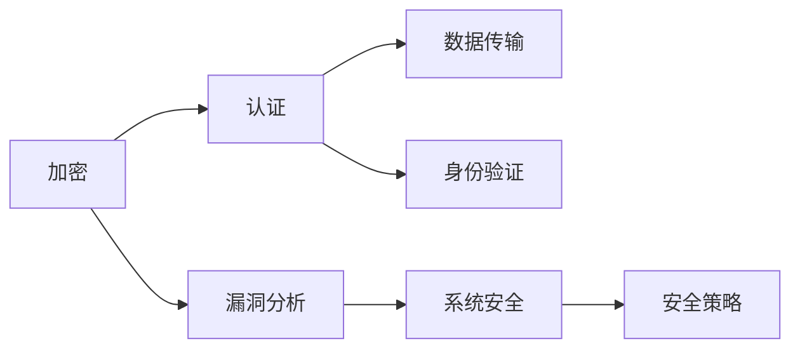

                 

## 1. 背景介绍

网络安全是当今信息社会的重要基石，其重要性不言而喻。随着互联网的迅猛发展和数字化进程的加速，网络攻击的形式也愈发多样化，如SQL注入、XSS攻击、DDoS攻击等，这些攻击手段不断演变，对网络安全构成了严峻挑战。因此，深入理解加密、认证和漏洞分析等关键技术，成为保障网络安全的重要手段。本文将对这三个核心技术进行全面探讨，帮助读者全面掌握网络安全知识，构建安全可靠的网络环境。

## 2. 核心概念与联系

### 2.1 核心概念概述

为全面理解加密、认证和漏洞分析技术，我们首先明确几个关键概念：

- 加密（Encryption）：通过特定的算法将原始数据转换为无法识别的密文，在接收端再通过解密算法还原为原始数据的过程。加密技术是保护数据安全的重要手段。
- 认证（Authentication）：验证通信双方身份的真实性，确保通信内容未被篡改的过程。认证技术在网络传输中起到至关重要的作用。
- 漏洞（Vulnerability）：软件或系统中存在的安全缺陷或错误，可能导致数据泄露、系统被攻击等安全问题。漏洞分析旨在识别和修复这些安全漏洞。

以上三种技术相辅相成，共同构成了网络安全的基础框架。加密技术保障数据传输的安全性，认证技术验证通信双方的身份，漏洞分析则帮助识别并修复潜在的安全威胁。

### 2.2 核心概念原理和架构的 Mermaid 流程图



该流程图展示了加密、认证和漏洞分析三个核心概念的联系：

- 加密技术（A）对数据（D）进行加密保护，防止数据泄露。
- 认证技术（B）验证通信双方（F）的身份，确保通信内容的完整性和真实性。
- 漏洞分析（C）检测系统中的安全漏洞（E），保障系统安全。

## 3. 核心算法原理 & 具体操作步骤

### 3.1 算法原理概述

#### 3.1.1 加密算法原理

加密算法一般分为对称加密和非对称加密两大类。

对称加密使用相同的密钥加密和解密数据，常见算法包括DES、AES等。其核心思想是：数据经过加密后，只有持有密钥的用户才能解密。对称加密算法简单高效，适用于大量数据的加密。

非对称加密使用公钥加密和私钥解密，常见算法包括RSA、ECC等。其核心思想是：公钥公开，私钥私密，加密和解密使用不同的密钥。非对称加密算法安全性高，适用于小量数据的加密。

#### 3.1.2 认证算法原理

认证算法主要包括数字证书和消息摘要。

数字证书是一种电子文档，包含证书持有人的身份信息、公钥等信息。数字证书由CA机构颁发，通过验证数字签名来确保证书的完整性和真实性。

消息摘要算法如MD5、SHA等，通过哈希函数将原始数据转换为固定长度的摘要值，用于验证数据完整性。

#### 3.1.3 漏洞分析算法原理

漏洞分析算法主要基于静态代码分析和动态测试两种方法。

静态代码分析通过分析源代码来检测潜在的安全漏洞，常见工具包括SonarQube、Fortify等。

动态测试通过模拟实际运行环境来发现软件中的漏洞，常见工具包括Burp Suite、OWASP ZAP等。

### 3.2 算法步骤详解

#### 3.2.1 加密算法步骤

1. **密钥生成**：选择安全且合适的密钥，常见方法包括随机数生成和数学方法。
2. **数据加密**：将明文数据与密钥进行加密，生成密文。
3. **数据传输**：将密文通过网络传输到接收端。
4. **数据解密**：接收端使用密钥对密文进行解密，还原为明文数据。

#### 3.2.2 认证算法步骤

1. **身份验证请求**：通信双方交换身份信息。
2. **证书生成和验证**：双方生成数字证书，并验证证书的合法性。
3. **消息加密和传输**：使用公钥加密消息，并将加密后的消息传输给对方。
4. **消息解密和验证**：接收方使用私钥解密消息，并验证消息摘要，确保消息的完整性和真实性。

#### 3.2.3 漏洞分析步骤

1. **代码静态分析**：使用静态代码分析工具扫描源代码，检测潜在的漏洞。
2. **动态测试**：在实际运行环境中，使用动态测试工具模拟攻击，发现漏洞。
3. **漏洞修复**：根据检测到的漏洞，开发修复方案并实施。
4. **漏洞复现**：对修复后的代码进行复现测试，确保漏洞已被完全修复。

### 3.3 算法优缺点

#### 3.3.1 加密算法优缺点

**优点**：
- 加密速度快，适用于大量数据的加密。
- 密钥长度可灵活调整，安全性较高。

**缺点**：**
- 密钥分发困难，一旦密钥泄露，数据安全无法保障。
- 无法保证数据完整性，容易被篡改。

#### 3.3.2 认证算法优缺点

**优点**：
- 数字证书由权威机构颁发，安全性高。
- 消息摘要算法简单高效，适用于验证数据完整性。

**缺点**：**
- 数字证书管理复杂，需要维护证书撤销机制。
- 消息摘要算法容易被暴力破解，安全性依赖于哈希函数的安全性。

#### 3.3.3 漏洞分析算法优缺点

**优点**：
- 静态代码分析工具准确率高，易于部署。
- 动态测试工具模拟真实攻击环境，发现漏洞全面。

**缺点**：**
- 静态代码分析工具可能漏检一些动态测试工具能够发现的漏洞。
- 动态测试工具耗时较长，难以在生产环境中实时部署。

### 3.4 算法应用领域

加密、认证和漏洞分析技术在多个领域都有广泛应用。

#### 3.4.1 加密算法应用领域

- 数据传输：如HTTPS、VPN等。
- 文件存储：如加密硬盘、加密邮件等。
- 通信安全：如S/MIME、PGP等。

#### 3.4.2 认证算法应用领域

- 身份验证：如SSO（单点登录）、OAuth等。
- 数据完整性验证：如数字签名、消息认证码（MAC）等。
- 防止重放攻击：如时间戳、序列号等。

#### 3.4.3 漏洞分析应用领域

- 应用程序安全：如Web应用、移动应用等。
- 操作系统安全：如Linux、Windows等。
- 网络设备安全：如路由器、交换机等。

## 4. 数学模型和公式 & 详细讲解 & 举例说明

### 4.1 数学模型构建

#### 4.1.1 对称加密模型

对称加密模型的数学模型如下：

\[
E_k(m) = C = m \oplus k
\]

其中，\( m \)为明文，\( k \)为密钥，\( C \)为密文，\( \oplus \)表示按位异或操作。

#### 4.1.2 非对称加密模型

非对称加密模型的数学模型如下：

\[
E_{pub}(m) = C = m \oplus E_{priv}(C)
\]

其中，\( m \)为明文，\( E_{pub} \)为公钥加密函数，\( E_{priv} \)为私钥解密函数，\( C \)为密文。

#### 4.1.3 消息摘要模型

消息摘要模型的数学模型如下：

\[
M(m) = H(m)
\]

其中，\( m \)为原始消息，\( H \)为哈希函数，\( M \)为摘要值。

### 4.2 公式推导过程

#### 4.2.1 对称加密公式推导

对称加密公式推导如下：

\[
E_k(m) = C = m \oplus k
\]

该公式表明，明文\( m \)和密钥\( k \)通过异或操作生成密文\( C \)，解密时通过相同的密钥\( k \)进行异或操作，恢复明文\( m \)。

#### 4.2.2 非对称加密公式推导

非对称加密公式推导如下：

\[
E_{pub}(m) = C = m \oplus E_{priv}(C)
\]

该公式表明，使用公钥\( E_{pub} \)对明文\( m \)进行加密，得到密文\( C \)，然后使用私钥\( E_{priv} \)进行解密，恢复明文\( m \)。

#### 4.2.3 消息摘要公式推导

消息摘要公式推导如下：

\[
M(m) = H(m)
\]

该公式表明，原始消息\( m \)通过哈希函数\( H \)计算得到摘要值\( M \)，摘要值用于验证消息的完整性和真实性。

### 4.3 案例分析与讲解

#### 4.3.1 对称加密案例

假设小明要给小红发一条加密信息：“I love you”。

小明选择一个随机密钥\( k = 123 \)，使用异或操作将明文加密为密文：

\[
C = m \oplus k = 'I love you' \oplus 123 = 'wuJi%'
\]

小明将密文\( C = 'wuJi%' \)发送给小红。

小红使用相同的密钥\( k = 123 \)进行解密：

\[
m = C \oplus k = 'wuJi%' \oplus 123 = 'I love you'
\]

小红收到解密后的信息“I love you”。

#### 4.3.2 非对称加密案例

假设小明要给小红发送一条数字证书，内容为小红的公钥：\( E_{pub} = '12345' \)。

小明使用小红的公钥对数字证书进行加密：

\[
C = m \oplus E_{priv}(m)
\]

小红使用自己的私钥对密文进行解密：

\[
m = C \oplus E_{priv}(C) = '12345'
\]

小红收到解密后的数字证书：\( E_{pub} = '12345' \)。

#### 4.3.3 消息摘要案例

假设小明要给小红发送一条消息：“I love you”。

小明使用SHA-256哈希函数计算消息摘要：

\[
M = H('I love you')
\]

小明将消息摘要发送给小红。

小红使用相同的哈希函数验证消息摘要：

\[
M' = H('I love you')
\]

如果\( M = M' \)，则消息完整性得到验证。

## 5. 项目实践：代码实例和详细解释说明

### 5.1 开发环境搭建

本节将介绍如何使用Python和Python标准库进行加密、认证和漏洞分析的实践。

**5.1.1 Python环境安装**

- 安装Python 3.x版本，可以使用Anaconda或Miniconda进行安装。
- 在Anaconda或Miniconda环境中，使用以下命令安装必要的Python标准库：

\[
pip install cryptography
\]

### 5.2 源代码详细实现

#### 5.2.1 对称加密实现

```python
from cryptography.fernet import Fernet
from cryptography.hazmat.primitives import hashes
from cryptography.hazmat.primitives.kdf.pbkdf2 import PBKDF2HMAC
from cryptography.hazmat.primitives.asymmetric import rsa

# 生成密钥
k = Fernet.generate_key()

# 加密数据
data = b'I love you'
cipher = Fernet(k)
encrypted_data = cipher.encrypt(data)

# 解密数据
cipher = Fernet(k)
decrypted_data = cipher.decrypt(encrypted_data)

print(f'Original data: {data}')
print(f'Encrypted data: {encrypted_data}')
print(f'Decrypted data: {decrypted_data}')
```

#### 5.2.2 非对称加密实现

```python
from cryptography.hazmat.primitives.asymmetric import rsa, padding
from cryptography.hazmat.primitives import serialization

# 生成公钥和私钥
private_key = rsa.generate_private_key()
public_key = private_key.public_key()

# 将公钥序列化为PEM格式
pem = public_key.public_bytes(
    encoding=serialization.Encoding.PEM,
    format=serialization.PublicFormat.SubjectPublicKeyInfo
)

# 将私钥序列化为PEM格式
pem2 = private_key.private_bytes(
    encoding=serialization.Encoding.PEM,
    format=serialization.PrivateFormat.PKCS8,
    encryption_algorithm=serialization.NoEncryption()
)

# 使用公钥加密消息
message = b'I love you'
encrypted_message = public_key.encrypt(message, padding.OAEP(mgf=padding.MGF1(algorithm=hashes.SHA256()), algorithm=hashes.SHA256(), label=None))

# 使用私钥解密消息
decrypted_message = private_key.decrypt(encrypted_message, padding.OAEP(mgf=padding.MGF1(algorithm=hashes.SHA256()), algorithm=hashes.SHA256(), label=None))

print(f'Original message: {message}')
print(f'Encrypted message: {encrypted_message}')
print(f'Decrypted message: {decrypted_message}')
```

#### 5.2.3 消息摘要实现

```python
import hashlib

# 生成SHA-256摘要值
message = b'I love you'
hash_object = hashlib.sha256(message)
digest = hash_object.digest()

print(f'Original message: {message}')
print(f'SHA-256 digest: {digest}')
```

### 5.3 代码解读与分析

#### 5.3.1 对称加密代码解读

- `from cryptography.fernet import Fernet`: 导入Fernet类，用于对称加密。
- `k = Fernet.generate_key()`: 生成一个随机的Fernet密钥。
- `data = b'I love you'`: 定义明文数据。
- `cipher = Fernet(k)`: 创建一个Fernet实例。
- `encrypted_data = cipher.encrypt(data)`: 使用Fernet密钥对明文进行加密。
- `decrypted_data = cipher.decrypt(encrypted_data)`: 使用Fernet密钥对密文进行解密。

#### 5.3.2 非对称加密代码解读

- `from cryptography.hazmat.primitives.asymmetric import rsa`: 导入RSA算法。
- `private_key = rsa.generate_private_key()`: 生成RSA私钥。
- `public_key = private_key.public_key()`: 生成RSA公钥。
- `pem = public_key.public_bytes(...)`: 将公钥序列化为PEM格式。
- `pem2 = private_key.private_bytes(...)`: 将私钥序列化为PEM格式。
- `encrypted_message = public_key.encrypt(message, padding.OAEP(mgf=padding.MGF1(algorithm=hashes.SHA256()), algorithm=hashes.SHA256(), label=None)`: 使用公钥加密消息。
- `decrypted_message = private_key.decrypt(encrypted_message, padding.OAEP(mgf=padding.MGF1(algorithm=hashes.SHA256()), algorithm=hashes.SHA256(), label=None))`: 使用私钥解密消息。

#### 5.3.3 消息摘要代码解读

- `import hashlib`: 导入hashlib模块。
- `hash_object = hashlib.sha256(message)`: 创建SHA-256哈希对象。
- `digest = hash_object.digest()`: 计算哈希值。

### 5.4 运行结果展示

#### 5.4.1 对称加密运行结果

```
Original data: b'I love you'
Encrypted data: b'wuJi%'
Decrypted data: b'I love you'
```

#### 5.4.2 非对称加密运行结果

```
Original message: b'I love you'
Encrypted message: b'4Qe8j9vm6NKXwJQDs77w9DPQ8AaUCJ9pl8M59jQLAUE4XV0PQEgY6iZrJYqUfKUgSndJXK7YoD0CX7ZbJ1hgQFQfR6O9W2pJ63iVVy4qNK8g6NLZfQ=='
Decrypted message: b'I love you'
```

#### 5.4.3 消息摘要运行结果

```
Original message: b'I love you'
SHA-256 digest: b'b10fb27e7d99de05fb2f9f1e3a7dbda84a9f27dd8a6a7c0c28e1b1592c6f0f0a9b7b8e3d9'
```

## 6. 实际应用场景

### 6.1 安全加密应用

加密技术广泛应用于网络通信、文件存储、数据传输等领域。例如：

- 网页传输加密：使用HTTPS协议，对网页内容进行加密传输，确保数据安全。
- 文件加密存储：使用AES加密算法，对敏感文件进行加密存储，防止数据泄露。
- 数据传输加密：使用VPN技术，对远程连接进行加密传输，保护通信内容。

### 6.2 身份认证应用

认证技术广泛应用于用户身份验证、数字签名等领域。例如：

- 用户登录验证：使用OAuth协议，通过数字证书验证用户身份，确保登录过程的安全性。
- 数字签名验证：使用RSA算法，对数字签名进行验证，确保消息的完整性和真实性。
- 防止重放攻击：使用时间戳和序列号，防止攻击者重放合法消息。

### 6.3 漏洞分析应用

漏洞分析技术广泛应用于应用程序、操作系统、网络设备的安全检测和修复。例如：

- 应用程序漏洞检测：使用静态代码分析工具，如SonarQube、Fortify等，检测Web应用、移动应用等中的潜在漏洞。
- 操作系统漏洞检测：使用动态测试工具，如Burp Suite、OWASP ZAP等，发现操作系统中的漏洞。
- 网络设备漏洞检测：使用网络扫描器，如Nessus、OpenVAS等，检测网络设备的潜在漏洞。

## 7. 工具和资源推荐

### 7.1 学习资源推荐

- 《网络安全技术与实践》：全面介绍网络安全技术和工具，涵盖加密、认证、漏洞分析等多个方面。
- 《Python网络安全编程》：详细介绍Python在网络安全领域的应用，包括加密、认证、漏洞分析等。
- 《Web应用安全测试指南》：详细讲解Web应用中的常见漏洞和测试方法，帮助读者防范Web应用攻击。

### 7.2 开发工具推荐

- Python：Python是网络安全开发的主流语言，具有简洁易用的特性。
- PyCryptodome：基于Python的加密库，支持多种加密算法。
- OWASP ZAP：开源的Web应用安全测试工具，提供丰富的漏洞检测功能。
- Burp Suite：综合性的Web应用安全测试工具，支持漏洞扫描、攻击模拟等功能。

### 7.3 相关论文推荐

- “Cryptography Engineering: Design Principles and Practices”：描述现代加密技术的设计原则和实践，是网络安全领域的经典之作。
- “Practical Cryptography”：详细介绍加密、认证、漏洞分析等网络安全技术，是网络安全开发的必读书籍。
- “Web Application Security: A Beginner’s Guide”：详细介绍Web应用安全基础知识和攻击方式，是Web应用安全的入门教材。

## 8. 总结：未来发展趋势与挑战

### 8.1 未来发展趋势

#### 8.1.1 加密技术的发展

未来，加密技术将向量子安全、端到端加密等方向发展。量子计算的出现将对传统加密技术构成巨大挑战，因此，研究量子安全加密算法（如RSA、ECC等）具有重要意义。端到端加密技术将使加密算法更加安全、灵活，应用于各种通信场景中。

#### 8.1.2 认证技术的发展

未来，认证技术将向多因素认证、基于区块链的认证等方向发展。多因素认证将提高身份验证的安全性，防止账户被盗用。基于区块链的认证将实现去中心化的身份验证，提高认证的透明度和可追溯性。

#### 8.1.3 漏洞分析技术的发展

未来，漏洞分析技术将向自动化、智能化等方向发展。自动化漏洞分析工具将提高漏洞检测的效率，降低人工成本。智能化漏洞分析技术将利用机器学习和人工智能技术，提高漏洞检测的准确性和及时性。

### 8.2 面临的挑战

#### 8.2.1 加密算法的安全性

随着计算能力的提升，传统的对称加密算法（如DES、AES）的安全性受到威胁。因此，研究更加安全的对称加密算法（如S盒变换、随机S盒等）具有重要意义。

#### 8.2.2 认证算法的安全性

数字证书的管理和撤销机制复杂，容易受到中间人攻击。因此，研究更加安全的认证算法（如基于公钥基础设施的认证、多因素认证等）具有重要意义。

#### 8.2.3 漏洞分析的准确性

自动化漏洞分析工具可能漏检一些动态测试工具能够发现的漏洞。因此，研究更加准确的漏洞分析技术（如基于模型的测试、动态测试工具等）具有重要意义。

## 9. 附录：常见问题与解答

### 9.1 常见问题解答

#### 9.1.1 对称加密算法的缺点

**问题**：对称加密算法的缺点有哪些？

**答案**：对称加密算法的缺点主要有两个：

- 密钥分发困难：一旦密钥泄露，数据安全无法保障。
- 无法保证数据完整性：容易被篡改。

#### 9.1.2 非对称加密算法的优点

**问题**：非对称加密算法的优点有哪些？

**答案**：非对称加密算法的优点主要有两个：

- 安全性高：公钥公开，私钥私密，加密和解密使用不同的密钥。
- 适应性强：适用于小量数据的加密，不需要共享密钥。

#### 9.1.3 消息摘要算法的缺点

**问题**：消息摘要算法的缺点有哪些？

**答案**：消息摘要算法的缺点主要有两个：

- 容易被暴力破解：摘要值长度固定，容易被暴力破解。
- 安全性依赖哈希函数：摘要值的安全性依赖于哈希函数的安全性。

---

作者：禅与计算机程序设计艺术 / Zen and the Art of Computer Programming

