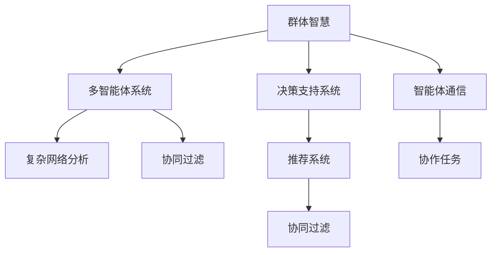

                 

# 群体智慧：决策的新利器

> 关键词：群体智慧,决策支持系统,多智能体系统,复杂网络分析,协同过滤,推荐系统

## 1. 背景介绍

### 1.1 问题由来
在现代社会，数据和计算资源的丰富已经使得从个体智慧走向群体智慧成为可能。从股市预测到医疗诊断，从金融风控到供应链管理，群体智慧在各个领域的决策过程中展现了强大的潜力。如何高效地利用群体智慧，将个体的智慧和知识进行协同整合，成为了计算机科学和人工智能领域亟待解决的问题。

### 1.2 问题核心关键点
群体智慧的概念源自分布式计算和多智能体系统的研究。它指的是多个智能体（如人、机器人、计算机等）通过协同合作，利用各自的知识和智慧，共同完成复杂任务的一种方法。这种方法能够在处理大规模数据和复杂问题时发挥巨大的优势。

群体智慧在决策支持系统中的应用尤为显著，通过智能体的协同合作，群体智慧能够从海量数据中提取更有价值的信息，生成更加精准和有效的决策建议。然而，如何设计高效、稳健的群体智慧系统，使其在实际应用中能够有效运行，仍然是一个亟待解决的问题。

## 2. 核心概念与联系

### 2.1 核心概念概述

为更好地理解群体智慧的决策支持系统，本节将介绍几个密切相关的核心概念：

- **群体智慧(Group Wisdom)**：指多个智能体通过协同合作，利用各自的知识和智慧，共同完成复杂任务的一种方法。
- **决策支持系统(Decision Support System, DSS)**：通过计算机技术辅助决策者进行决策的系统，通常包含数据处理、模型分析和用户界面等功能。
- **多智能体系统(Multi-Agent System,MAS)**：由多个智能体（如人、机器人、计算机等）组成的系统，智能体之间通过通信和协作实现复杂的任务。
- **复杂网络分析(Complex Network Analysis)**：研究网络中节点之间关系和结构对网络行为的影响，在群体智慧中用于分析智能体间的互动模式。
- **协同过滤(Collaborative Filtering)**：一种基于用户行为的推荐方法，通过相似性度量，推荐用户可能感兴趣的商品、内容等。
- **推荐系统(Recommendation System)**：利用协同过滤等技术，为用户推荐感兴趣的个性化内容的系统，广泛应用于电商、娱乐、社交媒体等领域。

这些核心概念之间的逻辑关系可以通过以下Mermaid流程图来展示：



这个流程图展示了个体智慧到群体智慧的转化路径，以及各种概念之间的联系：

1. 群体智慧通过多智能体系统实现。
2. 多智能体系统利用复杂网络分析来优化智能体之间的互动。
3. 协同过滤是群体智慧中推荐系统的重要技术。
4. 决策支持系统与推荐系统紧密相连，共同为用户提供高质量的决策建议。

这些核心概念共同构成了群体智慧决策系统的基础框架，使其能够在各个应用场景中发挥作用。

## 3. 核心算法原理 & 具体操作步骤
### 3.1 算法原理概述

群体智慧的决策支持系统，本质上是一个多智能体协同合作的系统。其核心思想是：将多个智能体（如专家、用户、计算机等）的知识和智慧进行整合，共同完成复杂的决策任务。

形式化地，假设有一个群体智慧系统，由 $N$ 个智能体组成。设第 $i$ 个智能体的知识表示为 $\textit{knowledge}_i$，任务目标为 $\textit{goal}_i$。系统的优化目标是最小化各个智能体任务目标的差异，即：

$$
\min_{\textit{knowledge}_1, \textit{knowledge}_2, \ldots, \textit{knowledge}_N} \sum_{i=1}^N \textit{cost}(\textit{goal}_i, \textit{knowledge}_i)
$$

其中 $\textit{cost}$ 为智能体 $i$ 任务目标与知识表示之间的代价函数，用于衡量智能体任务目标的达成程度。

### 3.2 算法步骤详解

群体智慧决策系统的设计步骤通常包括以下几个关键环节：

**Step 1: 定义智能体任务和知识表示**

- 定义智能体 $i$ 的任务目标 $\textit{goal}_i$，例如分类、推荐、预测等。
- 定义智能体 $i$ 的知识表示 $\textit{knowledge}_i$，例如专家知识库、用户历史记录、经验数据等。

**Step 2: 建立智能体通信机制**

- 设计智能体之间的通信协议，如消息传递、共享数据、协作求解等。
- 选择合适的通信模型，例如集中式通信、分布式通信、事件驱动通信等。

**Step 3: 设计协作算法**

- 确定协作算法的具体形式，如协同过滤、强化学习、优化算法等。
- 设计智能体间的决策策略，例如贝叶斯网络、马尔科夫决策过程等。

**Step 4: 集成多智能体系统**

- 将各个智能体的计算资源进行整合，构建统一的计算平台。
- 对系统进行测试和优化，确保各智能体间的协作顺畅进行。

**Step 5: 部署和维护**

- 将系统部署到实际环境中，进行监控和维护。
- 收集系统运行数据，持续改进智能体协作和任务执行策略。

### 3.3 算法优缺点

群体智慧决策系统具有以下优点：

1. **适应性强**：能够处理大规模、高复杂度的任务，适应不同领域的特定需求。
2. **鲁棒性好**：通过多智能体的协作，能够有效抵御个体智能体的故障或错误。
3. **利用广泛**：可以充分利用不同类型的数据源和知识库，提升决策的准确性和全面性。
4. **灵活性好**：根据任务需求，智能体间的协作方式可以进行灵活调整。

同时，该方法也存在一定的局限性：

1. **通信开销大**：多智能体间的通信需要消耗较多的计算资源，可能影响系统的响应速度。
2. **协作难度高**：不同智能体之间的知识表示和决策策略可能存在差异，导致协作过程复杂。
3. **数据隐私问题**：智能体间的数据交换可能涉及隐私保护，需要设计相应的数据安全机制。
4. **算法复杂性高**：设计高效协作算法需要较强的数学和编程基础，对开发者要求较高。

尽管存在这些局限性，但群体智慧决策系统仍是大数据时代决策支持的重要工具。通过不断改进协作算法和通信机制，相信未来该方法将在更广泛的领域得到应用。

### 3.4 算法应用领域

群体智慧决策系统已经在诸多领域得到应用，例如：

- **金融风控**：通过多智能体协作，综合分析市场数据和专家知识，及时识别风险并提出防范措施。
- **医疗诊断**：整合医生、患者、实验室等多方的知识，提升诊断准确性和治疗效果。
- **供应链管理**：协调不同环节的智能体，优化物流、库存和订单管理，提高供应链效率。
- **城市管理**：通过智能体间的协作，实现交通流量优化、垃圾分类回收等城市服务管理。
- **智能推荐**：利用用户和商品间的协同关系，推荐用户可能感兴趣的商品或内容。

除了上述这些经典应用外，群体智慧决策系统还被创新性地应用于更多场景中，如智能制造、灾害预警、社交网络分析等，为各行各业带来了新的管理思路和技术突破。

## 4. 数学模型和公式 & 详细讲解  
### 4.1 数学模型构建

本节将使用数学语言对群体智慧的决策支持系统进行更加严格的刻画。

记智能体集合为 $I$，每个智能体的知识表示为 $\textit{knowledge}_i$，任务目标为 $\textit{goal}_i$，系统优化目标为 $\textit{cost}(\textit{goal}_i, \textit{knowledge}_i)$。

定义智能体 $i$ 与智能体 $j$ 之间的通信权重为 $w_{ij}$，则系统整体的目标函数为：

$$
\min_{\textit{knowledge}_1, \textit{knowledge}_2, \ldots, \textit{knowledge}_N} \sum_{i=1}^N \sum_{j=1}^N w_{ij} \textit{cost}(\textit{goal}_i, \textit{knowledge}_i)
$$

在实践中，我们通常使用分布式优化算法（如Gossip、Swarm等）来近似求解上述最优化问题。

### 4.2 公式推导过程

以下我们以协同过滤为例，推导群体智慧中的推荐系统公式及其梯度计算。

假设智能体 $i$ 和智能体 $j$ 的协同关系定义为相似度矩阵 $\textit{similarity}_{ij}$，则协同过滤的目标函数为：

$$
\min_{\textit{knowledge}_1, \textit{knowledge}_2, \ldots, \textit{knowledge}_N} \sum_{i=1}^N \sum_{j=1}^N w_{ij} \left\| \textit{goal}_i - \textit{goal}_j \right\|^2
$$

将其代入整体目标函数，得：

$$
\min_{\textit{knowledge}_1, \textit{knowledge}_2, \ldots, \textit{knowledge}_N} \sum_{i=1}^N \sum_{j=1}^N w_{ij} \left\| \textit{goal}_i - \textit{goal}_j \right\|^2 = \min_{\textit{knowledge}_1, \textit{knowledge}_2, \ldots, \textit{knowledge}_N} \sum_{i=1}^N \sum_{j=1}^N w_{ij} \left\| \textit{goal}_i - \textit{goal}_j \right\|^2
$$

根据链式法则，目标函数对智能体 $i$ 的知识表示 $\textit{knowledge}_i$ 的梯度为：

$$
\frac{\partial \mathcal{L}(\textit{knowledge}_1, \textit{knowledge}_2, \ldots, \textit{knowledge}_N)}{\partial \textit{knowledge}_i} = \sum_{j=1}^N w_{ij} \left\| \frac{\partial \textit{goal}_i}{\partial \textit{knowledge}_i} \right\|^2
$$

其中 $\frac{\partial \textit{goal}_i}{\partial \textit{knowledge}_i}$ 为智能体 $i$ 的知识表示与任务目标之间的梯度，可以通过反向传播算法高效计算。

在得到目标函数的梯度后，即可带入分布式优化算法，完成智能体间的协作优化。重复上述过程直至收敛，最终得到适应复杂任务的群体智慧决策系统。

## 5. 项目实践：代码实例和详细解释说明
### 5.1 开发环境搭建

在进行群体智慧决策系统的开发前，我们需要准备好开发环境。以下是使用Python进行PyTorch开发的环境配置流程：

1. 安装Anaconda：从官网下载并安装Anaconda，用于创建独立的Python环境。

2. 创建并激活虚拟环境：
```bash
conda create -n pytorch-env python=3.8 
conda activate pytorch-env
```

3. 安装PyTorch：根据CUDA版本，从官网获取对应的安装命令。例如：
```bash
conda install pytorch torchvision torchaudio cudatoolkit=11.1 -c pytorch -c conda-forge
```

4. 安装PyTorch Lightning：
```bash
pip install torchlightning
```

5. 安装各类工具包：
```bash
pip install numpy pandas scikit-learn matplotlib tqdm jupyter notebook ipython
```

完成上述步骤后，即可在`pytorch-env`环境中开始群体智慧决策系统的开发。

### 5.2 源代码详细实现

下面我们以协同过滤推荐系统为例，给出使用PyTorch进行群体智慧决策的代码实现。

首先，定义协同过滤推荐系统的数据处理函数：

```python
import torch
import torch.nn as nn
import torch.optim as optim

class协同过滤推荐模型(nn.Module):
    def __init__(self, num_users, num_items):
        super(协同过滤推荐模型, self).__init__()
        self.num_users = num_users
        self.num_items = num_items
        
        self.user_bias = nn.Parameter(torch.randn(num_users))
        self.item_bias = nn.Parameter(torch.randn(num_items))
        self.user_matrix = nn.Parameter(torch.randn(num_users, num_items))
        self.item_matrix = nn.Parameter(torch.randn(num_items, num_users))
        
        self.mse = nn.MSELoss()
    
    def forward(self, user_ids, item_ids):
        user_biases = self.user_bias[user_ids]
        item_biases = self.item_bias[item_ids]
        user_item_matrix = self.user_matrix[user_ids, item_ids]
        item_user_matrix = self.item_matrix[item_ids, user_ids]
        
        user_scores = user_biases + user_item_matrix @ item_user_matrix.T
        item_scores = item_biases + item_user_matrix @ user_item_matrix.T
        
        scores = user_scores + item_scores
        
        return scores
    
    def predict(self, user_ids, item_ids):
        with torch.no_grad():
            scores = self.forward(user_ids, item_ids)
            predicted_item_ids = torch.argsort(scores, descending=True)[0]
            return predicted_item_ids
```

然后，定义优化器和训练函数：

```python
num_epochs = 10
batch_size = 64

model = 协同过滤推荐模型(num_users, num_items)
optimizer = optim.Adam(model.parameters(), lr=0.001)
criterion = nn.MSELoss()

for epoch in range(num_epochs):
    for batch in dataloader:
        user_ids, item_ids, true_scores = batch
        pred_scores = model(user_ids, item_ids)
        loss = criterion(pred_scores, true_scores)
        optimizer.zero_grad()
        loss.backward()
        optimizer.step()
```

最后，启动训练流程：

```python
train(model, optimizer, criterion, dataloader, num_epochs)
```

以上就是使用PyTorch进行协同过滤推荐系统的完整代码实现。可以看到，通过群体智慧的协作，多个智能体可以共同完成复杂的推荐任务，提升推荐系统的准确性。

### 5.3 代码解读与分析

让我们再详细解读一下关键代码的实现细节：

**协同过滤推荐模型类**：
- `__init__`方法：初始化模型参数，包括用户和物品的偏置、用户-物品矩阵和物品-用户矩阵。
- `forward`方法：计算用户对物品的评分，将用户和物品的偏置、用户-物品矩阵和物品-用户矩阵进行矩阵乘法计算。
- `predict`方法：对用户和物品进行评分，并返回预测物品列表。

**优化器和训练函数**：
- 使用Adam优化器进行模型参数的更新，设置学习率为0.001。
- 定义均方误差损失函数，用于评估模型的预测误差。
- 通过循环迭代，对数据集进行批处理训练，更新模型参数。

**训练流程**：
- 设置训练轮数和批大小。
- 创建协同过滤推荐模型实例。
- 定义优化器和损失函数。
- 循环迭代训练，对每个批次的数据进行前向传播和反向传播，更新模型参数。

可以看到，通过PyTorch等工具，群体智慧决策系统的开发变得相对简单。然而，实际应用中还需要考虑更多因素，如智能体间的通信协议、协同算法的设计等，才能构建高效、稳定的群体智慧系统。

## 6. 实际应用场景
### 6.1 智能推荐系统

协同过滤推荐系统已经广泛应用于电商平台、视频网站、社交媒体等领域，通过智能体的协作，为用户推荐感兴趣的个性化内容，提升用户体验。

在技术实现上，可以收集用户浏览、点击、评价等行为数据，通过协同过滤算法分析用户和物品间的相似性，生成推荐列表。协同过滤推荐系统能够从海量数据中提取用户偏好，提升推荐系统的准确性和多样性。同时，利用群体智慧的协同优化，智能体间的互动能够进一步优化推荐策略，提升推荐效果。

### 6.2 金融风险管理

在金融领域，群体智慧决策系统能够通过多智能体的协作，综合分析市场数据、专家知识、用户行为等多方信息，识别潜在风险并提出防范措施。

例如，在股票交易市场中，系统可以通过分析历史交易数据、专家分析和用户情绪，生成市场风险预警信号，辅助投资决策。群体智慧决策系统能够从多角度、多维度分析市场趋势，提升风险识别和防范能力。

### 6.3 医疗诊断和治疗

在医疗领域，群体智慧决策系统能够整合医生、患者和实验室等多方的知识，提升诊断准确性和治疗效果。

例如，在肿瘤诊断中，系统可以通过分析患者历史数据、基因组数据、医学文献等多方信息，辅助医生制定治疗方案。群体智慧决策系统能够从海量数据中提取更有价值的信息，提升诊断和治疗的精准度。

### 6.4 城市交通管理

在城市管理中，群体智慧决策系统能够协调多个智能体，优化交通流量、垃圾分类回收等城市服务管理。

例如，在交通流量优化中，系统可以通过分析实时交通数据、历史交通数据、天气信息等多方信息，生成交通流量预测和优化策略。群体智慧决策系统能够从多方面数据中提取信息，提升城市管理的智能化水平。

## 7. 工具和资源推荐
### 7.1 学习资源推荐

为了帮助开发者系统掌握群体智慧决策系统的理论基础和实践技巧，这里推荐一些优质的学习资源：

1. 《群体智慧：分布式人工智能》系列博文：由群体智慧领域的专家撰写，深入浅出地介绍了群体智慧的原理、实现和应用。

2. 《多智能体系统》课程：斯坦福大学开设的AI明星课程，讲解多智能体系统的设计、实现和应用。

3. 《协同过滤推荐系统》书籍：详细介绍了协同过滤推荐系统的算法原理、实现方法及优化策略。

4. 《复杂网络分析》书籍：介绍复杂网络的构建、分析和应用，是群体智慧决策系统的重要工具。

5. 《群体智慧工具箱》：HuggingFace开源项目，提供多种群体智慧决策系统实现，适用于快速开发原型。

通过对这些资源的学习实践，相信你一定能够快速掌握群体智慧决策系统的精髓，并用于解决实际的决策支持问题。

### 7.2 开发工具推荐

高效的开发离不开优秀的工具支持。以下是几款用于群体智慧决策系统开发的常用工具：

1. PyTorch：基于Python的开源深度学习框架，灵活动态的计算图，适合快速迭代研究。

2. TensorFlow：由Google主导开发的开源深度学习框架，生产部署方便，适合大规模工程应用。

3. TensorFlow Lightning：基于TensorFlow的快速实验平台，适用于群体智慧决策系统的开发和测试。

4. Weights & Biases：模型训练的实验跟踪工具，可以记录和可视化模型训练过程中的各项指标，方便对比和调优。

5. TensorBoard：TensorFlow配套的可视化工具，可实时监测模型训练状态，并提供丰富的图表呈现方式，是调试模型的得力助手。

6. Jupyter Notebook：交互式编程环境，适用于编写、调试和共享代码，方便团队协作。

合理利用这些工具，可以显著提升群体智慧决策系统的开发效率，加快创新迭代的步伐。

### 7.3 相关论文推荐

群体智慧决策系统的研究源于学界的持续研究。以下是几篇奠基性的相关论文，推荐阅读：

1. **"Coordination of Distributed Robot Systems" by Emerson, Fussell & Sycara**：提出群体智能的概念，讨论了多智能体系统在分布式机器人系统中的应用。

2. **"Multi-Agent Systems: An Introduction" by Gupta, Klar & Mahboubi**：介绍多智能体系统的基本概念、结构和应用，是群体智慧决策系统的基础读物。

3. **"Recommender Systems" by Resnick, Adomavicius & Huberman**：介绍了协同过滤推荐系统的算法原理和实现方法。

4. **"Complex Network Analysis" by Watts & Strogatz**：介绍复杂网络的基本概念、结构和分析方法，是群体智慧决策系统的重要工具。

5. **"Group Wisdom: The Pros and Cons of Distributed Computation" by Deyle**：讨论了群体智慧的优缺点，以及如何构建高效、稳健的群体智慧系统。

这些论文代表了大智慧决策系统的研究发展脉络。通过学习这些前沿成果，可以帮助研究者把握学科前进方向，激发更多的创新灵感。

## 8. 总结：未来发展趋势与挑战

### 8.1 总结

本文对群体智慧决策系统进行了全面系统的介绍。首先阐述了群体智慧的概念、特点和应用，明确了决策支持系统在群体智慧中的重要作用。其次，从原理到实践，详细讲解了群体智慧决策系统的数学模型和具体实现，给出了协同过滤推荐系统的代码实现和分析。同时，本文还广泛探讨了群体智慧决策系统在智能推荐、金融风控、医疗诊断、城市管理等多个领域的应用前景，展示了群体智慧的巨大潜力。此外，本文精选了群体智慧决策系统的各类学习资源，力求为读者提供全方位的技术指引。

通过本文的系统梳理，可以看到，群体智慧决策系统正在成为人工智能决策支持的重要工具，极大地拓展了决策支持的边界，提升了决策的准确性和智能化水平。未来，伴随技术的发展，群体智慧决策系统必将在更多领域得到应用，为各行各业带来变革性影响。

### 8.2 未来发展趋势

展望未来，群体智慧决策系统将呈现以下几个发展趋势：

1. **智能化程度提升**：随着深度学习等技术的发展，群体智慧决策系统的智能化程度将进一步提升，能够处理更复杂、更精准的任务。

2. **跨领域融合**：群体智慧决策系统将与其他人工智能技术进行深度融合，如知识表示、自然语言处理、计算机视觉等，构建更加全面、高效的系统。

3. **数据驱动决策**：利用大数据和机器学习技术，群体智慧决策系统将从基于规则的决策向基于数据的决策转变，提升决策的实时性和准确性。

4. **实时化部署**：通过分布式计算和实时数据处理技术，群体智慧决策系统将能够实现实时化的决策支持，满足实时性要求高的应用场景。

5. **普适化设计**：群体智慧决策系统将向普适化设计方向发展，能够适应不同应用场景的需求，提供更加灵活、可配置的系统架构。

这些趋势凸显了群体智慧决策系统的广阔前景。这些方向的探索发展，必将进一步提升决策支持的智能化水平，为各行业带来新的管理思路和技术突破。

### 8.3 面临的挑战

尽管群体智慧决策系统已经取得了显著成就，但在迈向更加智能化、普适化应用的过程中，它仍面临诸多挑战：

1. **数据质量和隐私保护**：智能体间的数据交换可能涉及隐私保护，需要设计相应的数据安全机制，确保数据安全和隐私保护。

2. **通信效率**：多智能体间的通信需要消耗较多的计算资源，可能影响系统的响应速度。如何优化通信协议和算法，提高通信效率，是未来需要重点解决的问题。

3. **算法复杂性**：设计高效协作算法需要较强的数学和编程基础，对开发者要求较高。如何简化协作算法，降低开发门槛，是未来需要重点探索的方向。

4. **可解释性不足**：群体智慧决策系统通常缺乏可解释性，难以解释其内部工作机制和决策逻辑。如何增强系统的可解释性，提高系统的透明度，是未来需要重点关注的课题。

5. **系统鲁棒性不足**：群体智慧决策系统在面对异常数据和突发事件时，鲁棒性可能不足。如何提升系统的鲁棒性，确保系统在异常情况下的稳定性，是未来需要重点改进的方向。

6. **协同算法设计**：不同智能体之间的知识表示和决策策略可能存在差异，导致协作过程复杂。如何设计高效、灵活的协同算法，是未来需要重点探索的方向。

正视群体智慧决策系统面临的这些挑战，积极应对并寻求突破，将使系统更加稳健、高效、可解释，真正实现群体智慧的广泛应用。

### 8.4 研究展望

面对群体智慧决策系统所面临的种种挑战，未来的研究需要在以下几个方面寻求新的突破：

1. **优化通信协议**：通过设计高效的通信协议和数据压缩技术，降低多智能体间的通信开销，提高系统的响应速度。

2. **降低算法复杂性**：开发简单易用的协作算法，降低协作算法的复杂度，降低开发门槛。

3. **增强可解释性**：引入可解释性技术，如因果推断、注意力机制等，增强群体智慧决策系统的可解释性和透明度。

4. **提升鲁棒性**：引入鲁棒性技术，如对抗训练、自适应学习等，增强系统对异常数据的处理能力，提升系统的鲁棒性。

5. **融合多模态数据**：利用多模态数据（如文本、图像、语音等），提升群体智慧决策系统的性能和鲁棒性。

6. **结合伦理道德约束**：在决策系统中引入伦理导向的评估指标，过滤和惩罚有偏见、有害的输出倾向，确保输出符合人类价值观和伦理道德。

这些研究方向的探索，必将引领群体智慧决策系统迈向更高的台阶，为构建安全、可靠、可解释、可控的智能系统铺平道路。面向未来，群体智慧决策系统还需要与其他人工智能技术进行更深入的融合，如知识表示、因果推理、强化学习等，多路径协同发力，共同推动群体智慧决策系统的进步。只有勇于创新、敢于突破，才能不断拓展群体智慧的边界，让智能决策系统更好地服务于人类社会。

## 9. 附录：常见问题与解答

**Q1：群体智慧决策系统与传统决策支持系统的区别是什么？**

A: 群体智慧决策系统与传统决策支持系统的最大区别在于其协作性。群体智慧决策系统通过多智能体的协作，能够充分利用各自的知识和智慧，共同完成复杂的决策任务。而传统决策支持系统通常基于单个智能体或集成的知识库进行决策，缺乏智能体的协同合作。

**Q2：如何设计高效的群体智慧系统？**

A: 设计高效的群体智慧系统需要考虑以下几个方面：

1. **选择合适的智能体类型**：根据任务需求，选择合适的智能体类型，如专家、用户、计算机等。

2. **设计通信协议**：选择合适的通信模型和协议，如消息传递、共享数据、协作求解等，确保智能体间的信息流通。

3. **设计协作算法**：选择合适的协作算法，如协同过滤、强化学习、优化算法等，确保智能体间的协作顺畅进行。

4. **优化算法性能**：使用分布式优化算法，如Gossip、Swarm等，加速智能体间的协作和优化。

5. **优化数据处理**：使用数据压缩、分布式存储等技术，优化数据处理效率，提升系统性能。

这些因素共同决定了群体智慧系统的性能和稳定性。通过合理的系统设计，可以使群体智慧系统高效地完成复杂的决策任务。

**Q3：群体智慧决策系统在实际应用中需要注意哪些问题？**

A: 群体智慧决策系统在实际应用中需要注意以下问题：

1. **数据质量和隐私保护**：智能体间的数据交换可能涉及隐私保护，需要设计相应的数据安全机制，确保数据安全和隐私保护。

2. **通信效率**：多智能体间的通信需要消耗较多的计算资源，可能影响系统的响应速度。需要优化通信协议和算法，提高通信效率。

3. **算法复杂性**：设计高效协作算法需要较强的数学和编程基础，对开发者要求较高。需要简化协作算法，降低开发门槛。

4. **可解释性不足**：群体智慧决策系统通常缺乏可解释性，难以解释其内部工作机制和决策逻辑。需要增强系统的可解释性，提高系统的透明度。

5. **系统鲁棒性不足**：群体智慧决策系统在面对异常数据和突发事件时，鲁棒性可能不足。需要提升系统的鲁棒性，确保系统在异常情况下的稳定性。

6. **协同算法设计**：不同智能体之间的知识表示和决策策略可能存在差异，导致协作过程复杂。需要设计高效、灵活的协同算法。

正视群体智慧决策系统面临的这些挑战，积极应对并寻求突破，将使系统更加稳健、高效、可解释，真正实现群体智慧的广泛应用。

---

作者：禅与计算机程序设计艺术 / Zen and the Art of Computer Programming

