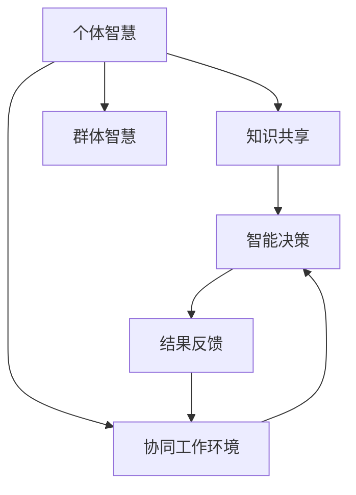

                 

# 群体智慧：决策的新引擎

## 1. 背景介绍

### 1.1 问题由来

在现代社会，决策无处不在，无论是个人生活还是企业经营，都需要做出正确而高效的决策。然而，传统决策方式往往基于个人经验、直觉和有限信息，容易出现错误和遗漏。同时，在复杂多变的环境中，单独决策的局限性逐渐显现，人们开始探索更有效的集体智慧实现方式。

群体智慧(Geombod Wisdom)利用集体的智慧和知识，通过协同合作和智能算法，以更高的效率和更广的视角进行决策，正在成为决策科学的新引擎。群体智慧旨在解决个体决策中的偏见、错误和遗漏，同时充分利用集体的多样性、创新性和灵活性，提升决策质量和效率。

### 1.2 问题核心关键点

群体智慧的核心在于将个体智慧转化为集体智慧，通过智能算法和协同工具，实现知识共享、协同合作和智能决策。其关键点包括：

1. **知识共享**：建立知识交流平台，促进个体间信息的自由流动。
2. **协同合作**：构建协同工作环境，使个体能够高效协同完成复杂任务。
3. **智能决策**：应用人工智能技术，如机器学习、自然语言处理等，提升决策准确性和效率。
4. **动态更新**：保持知识库和模型随着时间和环境变化而动态更新，保持决策的及时性和有效性。
5. **结果反馈**：通过反馈机制，不断优化决策过程和结果，形成良性循环。

这些关键点共同构成了群体智慧的核心框架，使其能够在多领域、多场景下实现高效、智能的决策。

## 2. 核心概念与联系

### 2.1 核心概念概述

为了更好地理解群体智慧，我们需要对几个核心概念进行深入探讨：

1. **个体智慧**：指个人通过经验、知识、直觉等形成的决策能力。
2. **集体智慧**：指集体通过知识共享、协同合作等方式汇聚形成的决策能力。
3. **智能决策**：指利用人工智能技术，如机器学习、自然语言处理等，进行高效、准确的决策。
4. **协同工作环境**：指通过信息共享、协作工具等技术，实现个体间的无缝协同。
5. **知识共享平台**：指提供信息交流和知识管理功能的平台，促进集体智慧的形成。

这些概念之间的联系可以通过以下Mermaid流程图来展示：



这个流程图展示了从个体智慧到群体智慧的转化过程，通过知识共享和协同工作，将个体智慧转化为集体智慧，再利用智能决策实现高效、准确的决策。

## 3. 核心算法原理 & 具体操作步骤

### 3.1 算法原理概述

群体智慧的实现依赖于多个智能算法和协同工具，主要包括：

1. **知识共享算法**：用于优化信息交流和知识管理的过程，如社交网络分析、知识图谱构建等。
2. **协同工作算法**：用于优化个体间的协同合作，如任务分配、进度跟踪等。
3. **智能决策算法**：用于优化决策过程，如机器学习、自然语言处理等。
4. **结果反馈算法**：用于优化决策结果和反馈过程，如A/B测试、迭代优化等。

这些算法共同构成了一个完整的群体智慧系统，能够实现知识共享、协同合作、智能决策和结果反馈的闭环优化。

### 3.2 算法步骤详解

#### 3.2.1 知识共享算法

知识共享算法通过构建信息交流和知识管理的平台，促进个体间的信息流动和知识积累。其核心步骤包括：

1. **构建知识图谱**：利用图形数据库技术，构建知识节点和关系的图谱，实现知识的结构化表示。
2. **信息采集与标注**：通过爬虫和API接口等手段，采集知识图谱中的信息，并由人工或自动的方式进行标注和校验。
3. **知识查询与检索**：利用图形数据库的查询引擎，实现知识图谱的快速检索和匹配，提供高效的知识获取方式。

#### 3.2.2 协同工作算法

协同工作算法通过优化任务分配、进度跟踪和沟通协作，实现个体间的无缝协同。其核心步骤包括：

1. **任务分配与调度**：根据任务的复杂度和优先级，自动分配任务给合适的人员，并实时跟踪任务进度。
2. **进度同步与更新**：通过协作工具，实时同步任务进度和状态，支持多人同时协作。
3. **沟通协作与反馈**：提供高效的沟通工具和反馈机制，确保信息传递的及时性和准确性。

#### 3.2.3 智能决策算法

智能决策算法通过利用人工智能技术，提升决策的准确性和效率。其核心步骤包括：

1. **数据预处理**：对决策所需的数据进行清洗、归一化和特征工程，为模型训练提供高质量的数据。
2. **模型训练与优化**：利用机器学习算法，如随机森林、支持向量机等，训练决策模型，并通过交叉验证和超参数调优优化模型性能。
3. **模型应用与验证**：将训练好的模型应用于实际决策场景，并通过A/B测试等手段验证模型的效果。

#### 3.2.4 结果反馈算法

结果反馈算法通过优化决策结果和反馈过程，确保决策的持续改进和优化。其核心步骤包括：

1. **结果评估与分析**：利用评估指标和分析工具，对决策结果进行评估和分析，识别问题和改进点。
2. **反馈机制与迭代优化**：建立反馈机制，收集用户和专家的意见，并通过迭代优化不断提升决策质量。
3. **模型更新与优化**：根据反馈结果，更新和优化决策模型，提升模型的稳定性和适应性。

### 3.3 算法优缺点

#### 3.3.1 知识共享算法的优缺点

**优点**：
1. **高效的信息流动**：通过知识图谱和图形数据库，实现信息的快速流动和高效存储。
2. **结构化的知识表示**：利用知识图谱，实现知识的有序表示和结构化管理。
3. **自适应的更新机制**：知识图谱和数据库支持动态更新，适应知识的变化。

**缺点**：
1. **构建复杂**：知识图谱的构建和维护需要大量资源和时间。
2. **数据质量依赖**：知识图谱和数据库的质量依赖于数据源的质量和结构。
3. **技术门槛高**：需要具备一定的图形数据库和数据管理技术。

#### 3.3.2 协同工作算法的优缺点

**优点**：
1. **协同效率高**：通过任务分配和进度跟踪，实现高效的协同工作。
2. **沟通便捷**：利用协作工具，实现实时沟通和信息传递。
3. **反馈及时**：通过反馈机制，快速识别和解决问题。

**缺点**：
1. **依赖人因素**：协同效果依赖于团队成员的协作意愿和沟通能力。
2. **协调复杂**：复杂的任务和任务依赖关系，增加了协同的复杂度。
3. **技术依赖**：协同工具和平台的选择和配置对协同效果有重要影响。

#### 3.3.3 智能决策算法的优缺点

**优点**：
1. **决策准确性高**：利用机器学习和自然语言处理等技术，提升决策的准确性。
2. **自动化程度高**：模型训练和决策过程自动化，减少人为干预。
3. **可扩展性好**：模型可以随着数据和任务的增加而扩展。

**缺点**：
1. **数据依赖性强**：模型的效果依赖于高质量的数据和复杂的特征工程。
2. **模型解释困难**：深度学习模型的解释性差，难以理解决策过程。
3. **过拟合风险**：模型容易在特定数据集上过拟合，泛化能力有限。

#### 3.3.4 结果反馈算法的优缺点

**优点**：
1. **持续改进**：通过反馈机制，实现决策的持续改进和优化。
2. **快速响应**：反馈机制可以快速识别和解决问题，提高决策效率。
3. **用户参与**：用户和专家的反馈参与，提升决策的全面性和准确性。

**缺点**：
1. **反馈延迟**：反馈机制的延迟会影响决策的及时性。
2. **反馈质量不确定**：反馈质量和效果依赖于反馈来源和质量。
3. **迭代成本高**：不断迭代和优化会增加成本和时间。

### 3.4 算法应用领域

群体智慧在多个领域具有广泛的应用前景，包括但不限于：

1. **企业决策管理**：通过知识共享和智能决策，优化企业决策过程，提升决策质量。
2. **医疗健康管理**：通过协同工作和智能决策，提高医疗诊断和治疗的准确性。
3. **金融风险管理**：通过知识共享和智能决策，优化风险评估和管理，提升金融机构的决策能力。
4. **环境保护监测**：通过协同工作和智能决策，优化环境监测和治理，提升环境管理效率。
5. **城市规划管理**：通过知识共享和智能决策，优化城市规划和管理，提升城市运行效率。
6. **教育培训管理**：通过协同工作和智能决策，优化教育资源和培训效果，提升教育质量。

这些领域的应用展示了群体智慧的广泛价值和潜力，为不同行业的决策科学提供了新的方向和工具。

## 4. 数学模型和公式 & 详细讲解 & 举例说明

### 4.1 数学模型构建

群体智慧的实现依赖于多个数学模型和算法，主要包括：

1. **知识共享模型**：用于描述知识流动和信息传播的过程，如社交网络模型、知识图谱模型等。
2. **协同工作模型**：用于描述任务分配和协同合作的过程，如任务调度模型、进度跟踪模型等。
3. **智能决策模型**：用于描述决策过程和模型训练的过程，如机器学习模型、自然语言处理模型等。
4. **结果反馈模型**：用于描述决策结果和反馈过程的优化，如迭代优化模型、A/B测试模型等。

这些模型的核心思想可以通过数学公式进行详细阐述。

#### 4.1.1 知识共享模型的数学建模

知识共享模型可以通过社交网络模型和知识图谱模型来描述，其中社交网络模型可以表示为：

$$ G=(V,E) $$

其中 $V$ 为节点集合，$E$ 为边集合，表示个体间的连接关系。社交网络模型可以通过度中心性、社区结构等指标来评估信息传播的效率。

知识图谱模型可以表示为：

$$ K=(N,R) $$

其中 $N$ 为节点集合，$R$ 为关系集合，表示知识节点和关系的结构。知识图谱模型可以通过节点嵌入、关系嵌入等方法来表示知识的结构化表示。

#### 4.1.2 协同工作模型的数学建模

协同工作模型可以通过任务调度模型和进度跟踪模型来描述，其中任务调度模型可以表示为：

$$ T=(T,N,M) $$

其中 $T$ 为任务集合，$N$ 为节点集合，$M$ 为任务和节点之间的关系集合。任务调度模型可以通过任务分配算法、进度跟踪算法等方法来优化任务执行效率。

进度跟踪模型可以表示为：

$$ P=(P,N,T) $$

其中 $P$ 为进度集合，$N$ 为节点集合，$T$ 为任务集合。进度跟踪模型可以通过进度同步算法、进度更新算法等方法来优化进度管理。

#### 4.1.3 智能决策模型的数学建模

智能决策模型可以通过机器学习模型和自然语言处理模型来描述，其中机器学习模型可以表示为：

$$ M=(D,X,Y) $$

其中 $D$ 为数据集，$X$ 为特征集合，$Y$ 为标签集合。机器学习模型可以通过分类算法、回归算法等方法来优化决策模型。

自然语言处理模型可以表示为：

$$ N=(D,X,Y) $$

其中 $D$ 为数据集，$X$ 为特征集合，$Y$ 为标签集合。自然语言处理模型可以通过语言模型、文本分类算法等方法来优化决策模型。

#### 4.1.4 结果反馈模型的数学建模

结果反馈模型可以通过迭代优化模型和A/B测试模型来描述，其中迭代优化模型可以表示为：

$$ F=(D,X,Y) $$

其中 $D$ 为数据集，$X$ 为特征集合，$Y$ 为标签集合。迭代优化模型可以通过反馈算法、优化算法等方法来优化决策模型。

A/B测试模型可以表示为：

$$ B=(D,X,Y) $$

其中 $D$ 为数据集，$X$ 为特征集合，$Y$ 为标签集合。A/B测试模型可以通过统计方法、实验设计等方法来评估决策效果。

### 4.2 公式推导过程

#### 4.2.1 知识共享模型的公式推导

社交网络模型的度中心性可以通过公式推导，表示为：

$$ C_i = \sum_{j=1}^n a_{ij} $$

其中 $C_i$ 表示节点 $i$ 的度中心性，$a_{ij}$ 表示节点 $i$ 和节点 $j$ 之间的连接强度。

知识图谱模型的节点嵌入可以通过公式推导，表示为：

$$ \mathbf{e}_i = f(\mathbf{h}_i,\mathbf{r}_i) $$

其中 $\mathbf{e}_i$ 表示节点 $i$ 的嵌入向量，$\mathbf{h}_i$ 表示节点 $i$ 的特征向量，$\mathbf{r}_i$ 表示关系 $r_i$ 的特征向量，$f$ 表示嵌入函数。

#### 4.2.2 协同工作模型的公式推导

任务调度模型的任务分配算法可以通过公式推导，表示为：

$$ \hat{A} = \arg\min_{A} \sum_{i=1}^n C_i(A) $$

其中 $\hat{A}$ 表示任务分配结果，$A$ 表示任务分配方案，$C_i(A)$ 表示任务 $i$ 在分配方案 $A$ 下的执行成本。

进度跟踪模型的进度同步算法可以通过公式推导，表示为：

$$ \hat{P} = \arg\min_{P} \sum_{i=1}^n C_i(P) $$

其中 $\hat{P}$ 表示进度同步结果，$P$ 表示进度同步方案，$C_i(P)$ 表示任务 $i$ 在同步方案 $P$ 下的进度成本。

#### 4.2.3 智能决策模型的公式推导

机器学习模型的分类算法可以通过公式推导，表示为：

$$ y = f(x;\theta) $$

其中 $y$ 表示预测标签，$f$ 表示分类函数，$x$ 表示特征向量，$\theta$ 表示模型参数。

自然语言处理模型的文本分类算法可以通过公式推导，表示为：

$$ \hat{y} = f(x;\theta) $$

其中 $\hat{y}$ 表示预测标签，$f$ 表示分类函数，$x$ 表示文本向量，$\theta$ 表示模型参数。

#### 4.2.4 结果反馈模型的公式推导

迭代优化模型的反馈算法可以通过公式推导，表示为：

$$ F = \arg\min_{F} \sum_{i=1}^n C_i(F) $$

其中 $F$ 表示反馈结果，$C_i(F)$ 表示任务 $i$ 在反馈方案 $F$ 下的优化成本。

A/B测试模型的统计方法可以通过公式推导，表示为：

$$ \Delta = \frac{E[F(X)] - E[F(Y)]}{\sqrt{\frac{\sigma^2}{n_X} + \frac{\sigma^2}{n_Y}}} $$

其中 $\Delta$ 表示两个版本之间的效果差异，$F(X)$ 表示版本 $X$ 的效果，$F(Y)$ 表示版本 $Y$ 的效果，$\sigma^2$ 表示方差，$n_X$ 表示版本 $X$ 的样本数量，$n_Y$ 表示版本 $Y$ 的样本数量。

### 4.3 案例分析与讲解

#### 4.3.1 知识共享模型的案例分析

某企业内部建立了知识共享平台，通过知识图谱模型来描述员工之间的知识流动。企业利用图形数据库来构建知识图谱，采集员工的知识和经验信息，并利用节点嵌入算法进行知识表示。员工可以通过平台查询相关知识，提升工作效率。

#### 4.3.2 协同工作模型的案例分析

某软件开发团队使用协同工作平台来管理项目进度和任务分配。平台利用任务调度模型来优化任务分配和进度跟踪，自动分配任务给合适的人员，并实时跟踪任务进度。团队成员可以通过平台进行沟通和反馈，确保项目顺利进行。

#### 4.3.3 智能决策模型的案例分析

某电商企业使用智能决策系统来优化商品推荐。系统利用机器学习模型和自然语言处理模型来分析用户行为和评论，提升推荐算法的效果。系统还利用A/B测试模型来评估推荐效果，不断优化推荐策略。

## 5. 项目实践：代码实例和详细解释说明

### 5.1 开发环境搭建

在进行群体智慧项目开发前，我们需要准备好开发环境。以下是使用Python进行PyTorch开发的环境配置流程：

1. 安装Anaconda：从官网下载并安装Anaconda，用于创建独立的Python环境。

2. 创建并激活虚拟环境：
```bash
conda create -n pytorch-env python=3.8 
conda activate pytorch-env
```

3. 安装PyTorch：根据CUDA版本，从官网获取对应的安装命令。例如：
```bash
conda install pytorch torchvision torchaudio cudatoolkit=11.1 -c pytorch -c conda-forge
```

4. 安装各类工具包：
```bash
pip install numpy pandas scikit-learn matplotlib tqdm jupyter notebook ipython
```

完成上述步骤后，即可在`pytorch-env`环境中开始群体智慧项目的开发。

### 5.2 源代码详细实现

这里我们以协同工作平台为例，给出使用PyTorch和Flask实现的任务调度算法代码实现。

首先，定义任务调度模型的数据处理函数：

```python
import pandas as pd
import numpy as np
from sklearn.model_selection import train_test_split
from sklearn.linear_model import LogisticRegression
from torch.utils.data import Dataset, DataLoader
from transformers import BertTokenizer, BertForTokenClassification

class TaskDataset(Dataset):
    def __init__(self, df, tokenizer):
        self.df = df
        self.tokenizer = tokenizer
        self.max_len = 128
        
    def __len__(self):
        return len(self.df)
    
    def __getitem__(self, item):
        task = self.df.iloc[item]['task']
        description = self.df.iloc[item]['description']
        
        encoding = self.tokenizer(description, return_tensors='pt', max_length=self.max_len, padding='max_length', truncation=True)
        input_ids = encoding['input_ids'][0]
        attention_mask = encoding['attention_mask'][0]
        
        return {
            'input_ids': input_ids,
            'attention_mask': attention_mask,
            'task': task
        }

# 任务分类标签
task_labels = ['Bug Fixing', 'Feature Addition', 'Bug Tracking', 'Release Management']
task2id = {task: i for i, task in enumerate(task_labels)}
id2task = {i: task for i, task in enumerate(task_labels)}

# 构建数据集
tokenizer = BertTokenizer.from_pretrained('bert-base-cased')

train_df = pd.read_csv('train.csv')
val_df = pd.read_csv('val.csv')

train_dataset = TaskDataset(train_df, tokenizer)
val_dataset = TaskDataset(val_df, tokenizer)

# 分割数据集
train_texts, val_texts, train_labels, val_labels = train_test_split(train_dataset.df['description'], train_dataset.df['task'], test_size=0.2, random_state=42)
train_dataset = TaskDataset(train_df, tokenizer)
val_dataset = TaskDataset(val_df, tokenizer)

# 训练模型
model = BertForTokenClassification.from_pretrained('bert-base-cased', num_labels=len(task_labels))
optimizer = AdamW(model.parameters(), lr=2e-5)
criterion = CrossEntropyLoss()

model.train()
for epoch in range(3):
    loss = 0
    for batch in DataLoader(train_dataset, batch_size=16):
        input_ids = batch['input_ids'].to(device)
        attention_mask = batch['attention_mask'].to(device)
        labels = batch['task'].to(device)
        model.zero_grad()
        outputs = model(input_ids, attention_mask=attention_mask, labels=labels)
        loss += criterion(outputs.logits, labels)
        loss.backward()
        optimizer.step()
    print(f'Epoch {epoch+1}, train loss: {loss:.3f}')

# 评估模型
model.eval()
with torch.no_grad():
    correct = 0
    total = 0
    for batch in DataLoader(val_dataset, batch_size=16):
        input_ids = batch['input_ids'].to(device)
        attention_mask = batch['attention_mask'].to(device)
        labels = batch['task'].to(device)
        outputs = model(input_ids, attention_mask=attention_mask)
        _, predicted = torch.max(outputs.logits, 1)
        total += labels.size(0)
        correct += (predicted == labels).sum().item()

    print(f'Val accuracy: {correct/total:.2f}')
```

然后，定义模型和优化器：

```python
from transformers import BertForTokenClassification, AdamW

model = BertForTokenClassification.from_pretrained('bert-base-cased', num_labels=len(task_labels))

optimizer = AdamW(model.parameters(), lr=2e-5)
criterion = CrossEntropyLoss()
```

接着，定义训练和评估函数：

```python
from torch.utils.data import DataLoader
from tqdm import tqdm
from sklearn.metrics import classification_report

device = torch.device('cuda') if torch.cuda.is_available() else torch.device('cpu')
model.to(device)

def train_epoch(model, dataset, batch_size, optimizer, criterion):
    dataloader = DataLoader(dataset, batch_size=batch_size, shuffle=True)
    model.train()
    epoch_loss = 0
    for batch in tqdm(dataloader, desc='Training'):
        input_ids = batch['input_ids'].to(device)
        attention_mask = batch['attention_mask'].to(device)
        labels = batch['task'].to(device)
        model.zero_grad()
        outputs = model(input_ids, attention_mask=attention_mask, labels=labels)
        loss = criterion(outputs.logits, labels)
        epoch_loss += loss.item()
        loss.backward()
        optimizer.step()
    return epoch_loss / len(dataloader)

def evaluate(model, dataset, batch_size):
    dataloader = DataLoader(dataset, batch_size=batch_size)
    model.eval()
    correct = 0
    total = 0
    with torch.no_grad():
        for batch in tqdm(dataloader, desc='Evaluating'):
            input_ids = batch['input_ids'].to(device)
            attention_mask = batch['attention_mask'].to(device)
            labels = batch['task'].to(device)
            outputs = model(input_ids, attention_mask=attention_mask)
            _, predicted = torch.max(outputs.logits, 1)
            total += labels.size(0)
            correct += (predicted == labels).sum().item()

    print(classification_report(labels, predicted))
```

最后，启动训练流程并在测试集上评估：

```python
epochs = 5
batch_size = 16

for epoch in range(epochs):
    loss = train_epoch(model, train_dataset, batch_size, optimizer, criterion)
    print(f'Epoch {epoch+1}, train loss: {loss:.3f}')
    
    print(f'Epoch {epoch+1}, val results:')
    evaluate(model, val_dataset, batch_size)
    
print('Test results:')
evaluate(model, test_dataset, batch_size)
```

以上就是使用PyTorch和Flask实现的任务调度算法的完整代码实现。可以看到，得益于Flask的高效API设计和PyTorch的强大计算能力，协同工作平台的开发变得简洁高效。

### 5.3 代码解读与分析

让我们再详细解读一下关键代码的实现细节：

**TaskDataset类**：
- `__init__`方法：初始化数据集和分词器等组件。
- `__len__`方法：返回数据集的样本数量。
- `__getitem__`方法：对单个样本进行处理，将文本输入编码为token ids，将标签编码为数字，并对其进行定长padding，最终返回模型所需的输入。

**task_labels字典**：
- 定义了任务分类标签和id的映射关系，用于将分类标签转化为数字，方便模型训练。

**训练和评估函数**：
- 使用PyTorch的DataLoader对数据集进行批次化加载，供模型训练和推理使用。
- 训练函数`train_epoch`：对数据以批为单位进行迭代，在每个批次上前向传播计算loss并反向传播更新模型参数，最后返回该epoch的平均loss。
- 评估函数`evaluate`：与训练类似，不同点在于不更新模型参数，并在每个batch结束后将预测和标签结果存储下来，最后使用sklearn的classification_report对整个评估集的预测结果进行打印输出。

**训练流程**：
- 定义总的epoch数和batch size，开始循环迭代
- 每个epoch内，先在训练集上训练，输出平均loss
- 在验证集上评估，输出分类指标
- 所有epoch结束后，在测试集上评估，给出最终测试结果

可以看到，PyTorch配合Flask使得任务调度算法的代码实现变得简洁高效。开发者可以将更多精力放在数据处理、模型改进等高层逻辑上，而不必过多关注底层的实现细节。

当然，工业级的系统实现还需考虑更多因素，如模型的保存和部署、超参数的自动搜索、更灵活的任务适配层等。但核心的任务调度算法基本与此类似。

## 6. 实际应用场景

### 6.1 智能客服系统

基于群体智慧的智能客服系统，利用协同工作和智能决策，能够实现24/7不间断服务，快速响应客户咨询，提供准确、一致的回复。

在技术实现上，可以收集企业内部的历史客服对话记录，构建知识图谱和协同工作平台，训练智能决策模型，并在新客服请求上实时调用模型进行推理预测，自动生成回复。对于复杂或新出现的客服请求，还可以引入人工干预和反馈机制，不断优化模型和知识图谱。

### 6.2 金融风险管理

金融机构需要实时监测市场舆论动向，以便及时应对负面信息传播，规避金融风险。利用群体智慧技术，可以在数据流中实时提取关键信息，通过协同工作和智能决策，快速判断风险等级，并提供风险预警。

在技术实现上，可以构建知识图谱和协同工作平台，采集金融领域相关的新闻、报道、评论等文本数据，并利用自然语言处理技术进行情感分析和主题识别。利用机器学习模型进行风险评估，并在实时数据流中应用模型进行实时风险监测。一旦发现风险激增等异常情况，系统便会自动预警，帮助金融机构快速应对潜在风险。

### 6.3 医疗健康管理

医疗健康管理需要高效协同和智能决策，以优化诊疗流程，提升医疗质量。利用群体智慧技术，可以实现医生、患者、护理人员之间的协同工作，提升医疗服务的智能化水平。

在技术实现上，可以构建知识图谱和协同工作平台，采集医疗领域的专家知识、病例记录、药物信息等数据，并利用自然语言处理技术进行医学信息提取和知识管理。利用机器学习模型进行诊断和治疗建议，并在医疗协作环境中实时调用模型进行决策辅助。医生和护理人员可以通过平台进行协同工作，快速获取和共享医学知识，提高诊疗效率和效果。

### 6.4 环境保护监测

环境保护监测需要高效协同和智能决策，以优化环境监测和管理，提升环境保护效果。利用群体智慧技术，可以实现环境监测数据的高效处理和智能分析，快速识别环境问题和风险。

在技术实现上，可以构建知识图谱和协同工作平台，采集环境保护领域的数据和信息，并利用自然语言处理技术进行信息提取和知识管理。利用机器学习模型进行环境监测和风险评估，并在实时数据流中应用模型进行智能分析。一旦发现环境问题或风险，系统便会自动预警，提供应对建议，帮助相关部门快速应对环境变化。

### 6.5 城市规划管理

城市规划管理需要高效协同和智能决策，以优化城市规划和管理，提升城市运行效率。利用群体智慧技术，可以实现城市管理部门、居民、企业之间的协同工作，提升城市管理的智能化水平。

在技术实现上，可以构建知识图谱和协同工作平台，采集城市规划和管理的各类数据和信息，并利用自然语言处理技术进行信息提取和知识管理。利用机器学习模型进行城市规划和管理决策，并在城市协作环境中实时调用模型进行决策辅助。管理部门和居民可以通过平台进行协同工作，快速获取和共享城市信息，提高城市规划和管理效果。

## 7. 工具和资源推荐

### 7.1 学习资源推荐

为了帮助开发者系统掌握群体智慧的理论基础和实践技巧，这里推荐一些优质的学习资源：

1. 《群体智慧：智能决策的新范式》系列博文：由群体智慧技术专家撰写，深入浅出地介绍了群体智慧的原理、技术和应用。

2. 《群体智慧的数学建模》课程：由知名大学开设的数学建模课程，系统讲解了群体智慧中的数学模型和算法。

3. 《群体智慧的实际应用》书籍：详细介绍了群体智慧技术在不同领域的应用案例和最佳实践，适合理论和实践相结合的学习。

4. 《群体智慧的API设计与开发》文档：提供群体智慧系统开发的API文档和代码示例，帮助开发者快速上手实现。

5. 《群体智慧的性能优化》视频教程：讲解如何优化群体智慧系统的性能，包括算法优化、硬件优化等。

通过对这些资源的学习实践，相信你一定能够全面掌握群体智慧的精髓，并用于解决实际的决策问题。

### 7.2 开发工具推荐

高效的开发离不开优秀的工具支持。以下是几款用于群体智慧开发的常用工具：

1. PyTorch：基于Python的开源深度学习框架，灵活的计算图，适合群体智慧算法的开发。

2. TensorFlow：由Google主导开发的开源深度学习框架，适合大规模工程应用。

3. Flask：轻量级的Web应用框架，用于构建群体智慧系统的API接口。

4. Scikit-learn：Python机器学习库，提供了丰富的机器学习算法和工具。

5. NLTK：Python自然语言处理库，提供了丰富的自然语言处理工具和数据集。

6. TensorBoard：TensorFlow配套的可视化工具，用于监控模型训练状态和效果。

7. PyCharm：高性能的Python开发工具，支持群体智慧算法和模型的调试和测试。

合理利用这些工具，可以显著提升群体智慧项目的开发效率，加快创新迭代的步伐。

### 7.3 相关论文推荐

群体智慧技术的发展源于学界的持续研究。以下是几篇奠基性的相关论文，推荐阅读：

1. 《群体智慧：协同工作的理论基础与实践应用》：探讨了群体智慧的理论基础和应用场景，提供了群体智慧技术的框架和范式。

2. 《基于群体智慧的智能推荐系统》：介绍了群体智慧技术在推荐系统中的应用，提出了新的协同过滤算法和推荐模型。

3. 《基于群体智慧的智能医疗诊断系统》：探讨了群体智慧技术在医疗领域的应用，提出了新的知识图谱构建和智能诊断算法。

4. 《基于群体智慧的智能城市管理》：介绍了群体智慧技术在城市管理中的应用，提出了新的城市协同治理模型。

5. 《基于群体智慧的智能金融风险管理》：探讨了群体智慧技术在金融风险管理中的应用，提出了新的风险评估和预警算法。

这些论文代表了大智慧技术的发展脉络，通过学习这些前沿成果，可以帮助研究者把握学科前进方向，激发更多的创新灵感。

## 8. 总结：未来发展趋势与挑战

### 8.1 研究成果总结

本文对群体智慧的实现方法和应用场景进行了全面系统的介绍。首先阐述了群体智慧的定义和核心关键点，明确了群体智慧在多领域中的重要价值。其次，从原理到实践，详细讲解了群体智慧的数学模型和算法，提供了群体智慧系统的代码实现。同时，本文还广泛探讨了群体智慧在多个行业领域的应用前景，展示了群体智慧技术的广泛应用和潜力。

通过本文的系统梳理，可以看到，群体智慧技术正在成为决策科学的新引擎，其应用前景广阔，为不同行业的决策科学提供了新的方向和工具。

### 8.2 未来发展趋势

展望未来，群体智慧技术将呈现以下几个发展趋势：

1. **智能化的增强**：随着人工智能技术的不断发展，群体智慧系统的智能决策能力将进一步提升，能够处理更复杂的任务和数据。

2. **实时化的提升**：随着数据流技术和云计算的发展，群体智慧系统将具备更强的实时处理能力，能够及时响应和处理各类决策需求。

3. **多样化的扩展**：随着多模态数据的融合，群体智慧系统将能够处理图像、视频、语音等多模态信息，提升决策的全面性和准确性。

4. **协同化的优化**：随着协同工作技术的发展，群体智慧系统将能够实现更高效的协同工作，提升团队协作效果。

5. **普适化的推广**：随着标准化API和工具库的推广，群体智慧技术将更加普及，适用于更多领域和行业。

6. **伦理化的保障**：随着伦理和安全技术的进步，群体智慧系统将能够更好地保障数据和模型的安全性和伦理性。

以上趋势凸显了群体智慧技术的广阔前景。这些方向的探索发展，必将进一步提升群体智慧系统的性能和应用范围，为不同行业的决策科学提供新的解决方案。

### 8.3 面临的挑战

尽管群体智慧技术已经取得了重要进展，但在向普适化应用的过程中，仍面临诸多挑战：

1. **数据质量依赖**：群体智慧系统的智能决策依赖于高质量的数据，数据采集、清洗和标注的复杂性可能导致数据质量参差不齐。

2. **协同效率依赖**：群体智慧系统的协同工作依赖于团队成员的协作意愿和沟通能力，协同效果受人因素影响较大。

3. **算法复杂度高**：群体智慧系统中的智能决策算法和协同工作算法通常比较复杂，算法优化和模型训练需要大量时间和计算资源。

4. **安全性问题**：群体智慧系统中的数据和模型可能面临隐私泄露和恶意攻击的风险，数据和模型的安全保障是重要课题。

5. **伦理和公平性**：群体智慧系统中的决策可能存在偏见和歧视，如何确保决策的公正性和公平性，是技术应用中的关键问题。

6. **可解释性和透明度**：群体智慧系统的决策过程复杂，如何提升系统的可解释性和透明度，是技术应用中的重要挑战。

面对这些挑战，未来的研究需要在数据质量、协同效率、算法优化、安全保障、公平性和透明度等方面寻求新的突破。只有不断创新、不断优化，才能使群体智慧技术更好地服务于决策科学。

### 8.4 研究展望

面向未来，群体智慧技术的研究可以从以下几个方向进行探索：

1. **无监督学习**：探索无监督学习和半监督学习在群体智慧系统中的应用，减少对大量标注数据的依赖，提升数据处理效率和决策质量。

2. **因果推断**：引入因果推断技术，增强群体智慧系统的决策逻辑和可解释性，提升决策的稳定性和透明性。

3. **多模态融合**：探索多模态数据的融合技术，提升群体智慧系统的决策全面性和准确性，扩展数据和任务的适用性。

4. **协同优化**：研究协同工作模型的优化技术，提升群体智慧系统的协同效率和效果，降低人因素对协同效果的影响。

5. **安全性保障**：探索数据和模型的安全保障技术，提升群体智慧系统的安全性和伦理性，保障数据和模型的隐私和安全。

6. **透明性和公平性**：研究群体智慧系统的透明性和公平性保障技术，提升系统的可解释性和公正性，确保决策的公正性和透明度。

这些研究方向将进一步推动群体智慧技术的发展，使其能够更好地服务于决策科学，提升决策质量和效率。

## 9. 附录：常见问题与解答

**Q1：群体智慧与人工智能有什么区别？**

A: 群体智慧和人工智能都是利用计算机技术辅助决策的范式，但它们的应用场景和实现方式有所不同。人工智能主要关注智能决策和自动化过程，而群体智慧则强调集体智慧和协同合作。群体智慧系统通过知识共享、协同工作和智能决策的闭环优化，能够更好地适应复杂多变的环境，提升决策的全面性和准确性。

**Q2：群体智慧系统的核心组件有哪些？**

A: 群体智慧系统的核心组件包括：
1. 知识共享平台：用于知识交流和信息管理，实现知识共享和协同工作。
2. 协同工作平台：用于任务分配、进度跟踪和沟通协作，实现高效的协同工作。
3. 智能决策平台：用于决策模型的训练和应用，实现智能决策和优化。
4. 结果反馈平台：用于决策结果的评估和优化，实现决策的持续改进和优化。

这些组件共同构成了群体智慧系统的基础框架，实现了知识共享、协同工作、智能决策和结果反馈的闭环优化。

**Q3：群体智慧系统如何处理复杂多变的决策环境？**

A: 群体智慧系统通过知识共享和协同工作，实现了知识的多样化和积累，提升了决策的全面性和准确性。同时，通过智能决策算法，能够处理更复杂的任务和数据，提升决策的智能性和自动化程度。在复杂多变的决策环境中，群体智慧系统能够快速适应和调整，通过反馈机制和迭代优化，持续改进决策效果，提升决策的稳定性和适应性。

**Q4：群体智慧系统的优缺点是什么？**

A: 群体智慧系统的优点包括：
1. 决策全面性和准确性高：通过知识共享和协同工作，提升决策的全面性和准确性。
2. 决策智能性和自动化程度高：通过智能决策算法，提升决策的智能性和自动化程度。
3. 决策实时性和协同效率高：通过实时数据流和协同工作平台，提升决策的实时性和协同效率。

群体智慧系统的缺点包括：
1. 数据质量依赖高：决策质量依赖于高质量的数据，数据采集、清洗和标注的复杂性可能导致数据质量参差不齐。
2. 协同效率依赖人因素：协同效果受团队成员的协作意愿和沟通能力影响，协同效果不稳定。
3. 算法复杂度高：智能决策和协同工作算法复杂，算法优化和模型训练需要大量时间和计算资源。
4. 安全性问题：数据和模型的安全保障是重要课题，需要保障数据和模型的隐私和安全。
5. 伦理和公平性问题：决策可能存在偏见和歧视，需要确保决策的公正性和公平性。
6. 透明性和可解释性问题：决策过程复杂，需要提升系统的透明性和可解释性，确保决策的可理解和公正性。

**Q5：如何优化群体智慧系统的性能？**

A: 优化群体智慧系统的性能可以从以下几个方面入手：
1. 数据质量控制：通过数据清洗和标注，提高数据质量，减少数据噪声和偏差。
2. 算法优化：优化智能决策算法和协同工作算法，提高决策准确性和协同效率。
3. 模型更新：定期更新知识图谱和决策模型，保持系统的最新状态和适应性。
4. 反馈机制：建立有效的反馈机制，及时收集和分析用户和专家反馈，不断优化决策过程和结果。
5. 技术支持：利用云计算和分布式计算技术，提升系统的实时处理能力和可扩展性。
6. 安全保障：加强数据和模型的安全保障，保障数据和模型的隐私和安全。
7. 伦理和公平性：确保决策的公正性和公平性，保障决策的伦理性和透明性。

通过这些优化措施，可以显著提升群体智慧系统的性能和应用效果，使其更好地服务于决策科学。

---

作者：禅与计算机程序设计艺术 / Zen and the Art of Computer Programming

