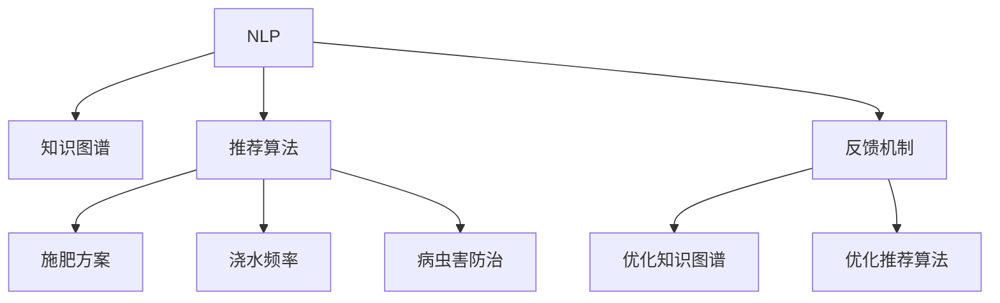

                 

# 聊天机器人园艺：植物护理和园林设计

在数字化时代，人工智能（AI）技术正在迅速改变我们生活的方方面面。从医疗、金融到交通、教育，AI正以前所未有的速度和广度渗透进人类的生活。然而，AI技术的深度应用还远未触及一个看似微不足道，却关乎生活质量与舒适度的领域——园艺。

## 1. 背景介绍

### 1.1 问题由来
家庭园艺是很多人的爱好，通过种植和养护植物，人们可以享受自然之美，同时提升生活的幸福感。然而，由于时间和资源的限制，许多人都难以达到理想的园艺效果。一方面，选择合适的植物、了解其生长习性、掌握施肥和病虫害防治等知识需要大量的学习时间。另一方面，植物养护过程中遇到的各种问题，如环境条件变化、病虫害爆发等，都需要及时的解决策略。

AI技术的介入，为家庭园艺带来了新的可能。通过智能聊天机器人，用户可以随时随地获取专业的园艺知识和解决方案，让园艺变得更为轻松、高效。随着AI技术的不断进步，智能聊天机器人已经能够提供个性化的植物护理建议，同时还能辅助园林设计，优化植物布局，提升园艺美感。

### 1.2 问题核心关键点
智能聊天机器人的核心在于能够理解用户的需求，提供准确的信息和建议。在这一过程中，涉及的核心关键点包括：

- **自然语言处理（NLP）**：理解用户的输入，提取关键信息，如植物类型、当前环境、生长阶段等。
- **知识图谱**：建立植物、环境、病虫害等领域的知识库，提供详细的园艺知识。
- **推荐算法**：根据用户需求和植物信息，推荐合适的护理方案和肥料使用。
- **反馈机制**：用户反馈可以帮助不断优化聊天机器人的回答和推荐。

这些关键点构成了智能聊天机器人园艺系统的技术基础，使得植物护理和园林设计更加智能化、个性化。

## 2. 核心概念与联系

### 2.1 核心概念概述

为更好地理解聊天机器人园艺系统的设计，我们将介绍几个密切相关的核心概念：

- **自然语言处理（NLP）**：是AI中的一种重要技术，涉及语言理解、语言生成、语义分析等。聊天机器人园艺系统的核心功能依赖于NLP技术，以理解用户输入，并生成合适的回复。
- **知识图谱**：是将不同领域的信息结构化，形成图谱结构，用于存储、查询和推理的框架。园艺知识图谱包含了植物学、土壤学、病虫害防治等知识，是智能聊天机器人提供精准建议的基础。
- **推荐算法**：根据用户输入和植物信息，智能推荐施肥方案、浇水频率、病虫害防治措施等。推荐算法是聊天机器人系统的核心组件，直接影响用户体验和植物养护效果。
- **反馈机制**：用户在操作过程中遇到的问题、成功经验等，通过反馈机制传递给聊天机器人，用于改进和优化系统的回答和推荐。

这些核心概念之间的逻辑关系可以通过以下Mermaid流程图来展示：



这个流程图展示了聊天机器人园艺系统的核心概念及其之间的联系：

1. **自然语言处理**：获取用户输入，提取关键信息，用于知识图谱和推荐算法。
2. **知识图谱**：提供园艺领域的知识，支持推荐算法的决策。
3. **推荐算法**：根据用户需求和植物信息，生成个性化的护理建议。
4. **反馈机制**：通过用户反馈，不断优化知识图谱和推荐算法，提升系统性能。

这些概念共同构成了聊天机器人园艺系统的技术框架，为其智能化、个性化提供了有力支持。

## 3. 核心算法原理 & 具体操作步骤
### 3.1 算法原理概述

聊天机器人园艺系统的核心算法原理主要围绕自然语言处理、知识图谱构建和推荐算法展开。其核心思想是：

- 通过自然语言处理技术，获取和理解用户输入。
- 构建知识图谱，存储和管理园艺领域的知识。
- 设计推荐算法，根据用户需求和植物信息，提供个性化的护理建议。

这一过程可以分为以下几个步骤：

1. **数据收集和处理**：收集和整理园艺领域的知识，形成结构化的知识图谱。
2. **自然语言理解**：使用NLP技术，理解用户的输入，提取关键信息。
3. **知识图谱查询**：根据用户输入，在知识图谱中查询相关信息。
4. **推荐生成**：结合用户需求和植物信息，使用推荐算法生成个性化的护理建议。
5. **反馈机制**：收集用户反馈，优化知识图谱和推荐算法。

### 3.2 算法步骤详解

**Step 1: 数据收集和处理**

构建知识图谱是智能聊天机器人园艺系统的基础。具体步骤如下：

1. **领域知识收集**：收集园艺领域的书籍、论文、专家访谈等资源，形成原始知识库。
2. **实体识别和关系抽取**：使用NLP技术，从原始知识库中识别实体和抽取关系，构建初步的知识图谱。
3. **知识图谱扩展**：根据用户反馈和最新研究成果，不断扩展和更新知识图谱。

**Step 2: 自然语言理解**

自然语言理解是聊天机器人与用户进行有效交流的前提。具体步骤如下：

1. **分词和词性标注**：使用NLP技术，对用户输入进行分词和词性标注，提取关键词。
2. **命名实体识别**：识别用户输入中的实体，如植物名、土壤类型等。
3. **语义分析**：使用深度学习模型，分析用户输入的语义，理解其真实需求。

**Step 3: 知识图谱查询**

知识图谱查询是智能聊天机器人园艺系统的核心组件，用于根据用户输入，查找相关信息。具体步骤如下：

1. **图谱构建**：构建知识图谱的数据结构，如节点和边。
2. **图谱查询**：使用图谱查询算法，根据用户输入，在知识图谱中查找相关信息。
3. **结果抽取**：从图谱查询结果中，抽取有用的信息，生成推荐建议。

**Step 4: 推荐生成**

推荐生成是聊天机器人园艺系统的关键环节，用于根据用户需求和植物信息，生成个性化的护理建议。具体步骤如下：

1. **用户需求匹配**：根据用户输入，匹配知识图谱中的相关信息。
2. **植物信息提取**：提取用户输入中的植物信息，如植物类型、生长阶段等。
3. **推荐算法计算**：使用推荐算法，计算最佳护理方案，如施肥、浇水、病虫害防治等。
4. **建议生成**：将推荐结果转换为易懂的语言，生成聊天机器人的回复。

**Step 5: 反馈机制**

用户反馈是优化聊天机器人园艺系统的重要手段，具体步骤如下：

1. **用户反馈收集**：在推荐生成后，收集用户的反馈信息。
2. **反馈信息处理**：对用户反馈进行处理，识别问题点。
3. **系统优化**：根据用户反馈，优化知识图谱和推荐算法，提升系统性能。

### 3.3 算法优缺点

聊天机器人园艺系统具有以下优点：

1. **智能推荐**：根据用户需求和植物信息，提供个性化的护理建议，提升园艺效果。
2. **实时互动**：用户可以随时与聊天机器人进行互动，获取即时帮助。
3. **知识丰富**：通过知识图谱，聊天机器人可以提供广泛的园艺知识和解决方案。

然而，系统也存在一些缺点：

1. **知识更新缓慢**：知识图谱的更新需要大量的时间和资源，难以快速响应最新的园艺知识。
2. **推荐准确性有限**：推荐算法的效果受限于知识图谱的质量和复杂度。
3. **个性化需求不充分**：用户的个性化需求和偏好难以充分体现，推荐结果可能存在偏差。
4. **技术门槛高**：系统开发需要丰富的NLP、知识图谱、推荐算法等方面的知识，对开发者要求较高。

尽管存在这些局限性，但聊天机器人园艺系统仍是大规模普及园艺知识的有效手段，能够显著提升家庭园艺的智能化水平。

### 3.4 算法应用领域

聊天机器人园艺系统已经在多个领域得到了应用，例如：

- **家庭园艺**：提供个性化的植物护理和园林设计建议，提升家庭园艺的便捷性和效率。
- **校园园艺**：在校园中设置智能聊天机器人，帮助学生了解和照顾校园植物，培养环保意识。
- **农业生产**：在农业园区中设置智能聊天机器人，提供作物种植和病虫害防治的指导，提高农业生产效率。
- **园艺培训**：通过智能聊天机器人，向园艺爱好者和专业人士提供系统的园艺知识和培训资源。

除了这些领域外，智能聊天机器人园艺系统还可以应用于园林设计、园艺产品销售等场景，为不同用户群体提供全方位的园艺服务。

## 4. 数学模型和公式 & 详细讲解

### 4.1 数学模型构建

聊天机器人园艺系统的数学模型主要涉及自然语言处理、知识图谱构建和推荐算法三个部分。以下是详细构建过程：

**自然语言处理模型**：使用深度学习模型，如Transformer、BERT等，对用户输入进行理解和生成。

**知识图谱模型**：使用图数据库，如Neo4j、TinkerPop等，存储和管理园艺领域的知识。

**推荐算法模型**：使用机器学习模型，如协同过滤、深度学习等，根据用户需求和植物信息，生成推荐结果。

### 4.2 公式推导过程

以下是聊天机器人园艺系统各个模块的数学模型和公式推导：

**自然语言处理模型**：

- **输入表示**：使用词向量表示用户输入，如Word2Vec、GloVe等。
- **语义分析**：使用Transformer模型，将用户输入转换为语义向量。
- **语义相似度计算**：使用余弦相似度计算用户输入与知识图谱中实体的相似度。

**知识图谱模型**：

- **实体识别**：使用LSTM模型，对用户输入进行实体识别。
- **关系抽取**：使用RNN模型，抽取用户输入中的实体关系。
- **知识图谱构建**：使用图数据库，构建知识图谱的节点和边。

**推荐算法模型**：

- **协同过滤算法**：根据用户历史行为，推荐相似的植物护理方案。
- **深度学习算法**：使用神经网络模型，根据用户需求和植物信息，生成推荐结果。

### 4.3 案例分析与讲解

以推荐施肥方案为例，具体推导过程如下：

**输入表示**：
- 用户输入：“我的番茄植株已经开始结果了，请问需要如何施肥？”
- 实体识别：植物名“番茄”，生长阶段“结果”。

**知识图谱查询**：
- 在知识图谱中查询“番茄”的施肥建议。
- 知识图谱查询结果：“番茄在结果期需要施加氮肥，每两周一次，每次每株约100克。”

**推荐算法计算**：
- 使用协同过滤算法，推荐相似的植物护理方案。
- 使用深度学习算法，生成推荐结果。

**建议生成**：
- 将推荐结果转换为易懂的语言：“您的番茄植株在结果期需要每两周施加一次氮肥，每次每株约100克。”

## 5. 项目实践：代码实例和详细解释说明

### 5.1 开发环境搭建

在进行聊天机器人园艺系统的开发之前，我们需要准备好开发环境。以下是使用Python进行PyTorch开发的环境配置流程：

1. 安装Anaconda：从官网下载并安装Anaconda，用于创建独立的Python环境。

2. 创建并激活虚拟环境：
```bash
conda create -n chatbot-env python=3.8 
conda activate chatbot-env
```

3. 安装PyTorch：根据CUDA版本，从官网获取对应的安装命令。例如：
```bash
conda install pytorch torchvision torchaudio cudatoolkit=11.1 -c pytorch -c conda-forge
```

4. 安装PyTorch Transformers库：
```bash
pip install transformers
```

5. 安装各类工具包：
```bash
pip install numpy pandas scikit-learn matplotlib tqdm jupyter notebook ipython
```

完成上述步骤后，即可在`chatbot-env`环境中开始微调实践。

### 5.2 源代码详细实现

下面我们以推荐施肥方案为例，给出使用PyTorch Transformers库的代码实现。

首先，定义推荐模型：

```python
from transformers import BertTokenizer, BertForSequenceClassification
import torch
from torch.utils.data import Dataset, DataLoader
from transformers import AdamW

class PlantRecommendation(Dataset):
    def __init__(self, texts, labels):
        self.texts = texts
        self.labels = labels
        self.tokenizer = BertTokenizer.from_pretrained('bert-base-uncased')
        
    def __len__(self):
        return len(self.texts)
    
    def __getitem__(self, item):
        text = self.texts[item]
        label = self.labels[item]
        
        encoding = self.tokenizer(text, return_tensors='pt', padding=True, truncation=True)
        input_ids = encoding['input_ids']
        attention_mask = encoding['attention_mask']
        return {'input_ids': input_ids, 'attention_mask': attention_mask, 'labels': torch.tensor(label, dtype=torch.long)}

# 定义模型
model = BertForSequenceClassification.from_pretrained('bert-base-uncased', num_labels=3)
device = torch.device('cuda') if torch.cuda.is_available() else torch.device('cpu')
model.to(device)

# 定义优化器
optimizer = AdamW(model.parameters(), lr=2e-5)
```

然后，定义训练和评估函数：

```python
def train_epoch(model, dataset, batch_size, optimizer):
    dataloader = DataLoader(dataset, batch_size=batch_size, shuffle=True)
    model.train()
    epoch_loss = 0
    for batch in dataloader:
        input_ids = batch['input_ids'].to(device)
        attention_mask = batch['attention_mask'].to(device)
        labels = batch['labels'].to(device)
        model.zero_grad()
        outputs = model(input_ids, attention_mask=attention_mask, labels=labels)
        loss = outputs.loss
        epoch_loss += loss.item()
        loss.backward()
        optimizer.step()
    return epoch_loss / len(dataloader)

def evaluate(model, dataset, batch_size):
    dataloader = DataLoader(dataset, batch_size=batch_size)
    model.eval()
    preds, labels = [], []
    with torch.no_grad():
        for batch in dataloader:
            input_ids = batch['input_ids'].to(device)
            attention_mask = batch['attention_mask'].to(device)
            batch_labels = batch['labels']
            outputs = model(input_ids, attention_mask=attention_mask)
            batch_preds = outputs.logits.argmax(dim=2).to('cpu').tolist()
            batch_labels = batch_labels.to('cpu').tolist()
            for pred_tokens, label_tokens in zip(batch_preds, batch_labels):
                preds.append(pred_tokens[:len(label_tokens)])
                labels.append(label_tokens)
    return preds, labels

# 训练模型
train_dataset = PlantRecommendation(train_texts, train_labels)
dev_dataset = PlantRecommendation(dev_texts, dev_labels)
test_dataset = PlantRecommendation(test_texts, test_labels)

epochs = 5
batch_size = 16

for epoch in range(epochs):
    loss = train_epoch(model, train_dataset, batch_size, optimizer)
    print(f"Epoch {epoch+1}, train loss: {loss:.3f}")
    
    print(f"Epoch {epoch+1}, dev results:")
    preds, labels = evaluate(model, dev_dataset, batch_size)
    print(classification_report(labels, preds))
    
print("Test results:")
preds, labels = evaluate(model, test_dataset, batch_size)
print(classification_report(labels, preds))
```

以上就是使用PyTorch对植物护理推荐模型进行微调的完整代码实现。可以看到，通过使用Transformer库，我们能够较为简单地实现植物护理推荐系统，其核心在于利用Bert模型进行序列分类，输出施肥方案的推荐结果。

### 5.3 代码解读与分析

让我们再详细解读一下关键代码的实现细节：

**PlantRecommendation类**：
- `__init__`方法：初始化文本、标签、分词器等关键组件。
- `__len__`方法：返回数据集的样本数量。
- `__getitem__`方法：对单个样本进行处理，将文本输入编码为token ids，同时将标签转换为模型可处理的格式。

**训练和评估函数**：
- 使用PyTorch的DataLoader对数据集进行批次化加载，供模型训练和推理使用。
- 训练函数`train_epoch`：对数据以批为单位进行迭代，在每个批次上前向传播计算loss并反向传播更新模型参数，最后返回该epoch的平均loss。
- 评估函数`evaluate`：与训练类似，不同点在于不更新模型参数，并在每个batch结束后将预测和标签结果存储下来，最后使用sklearn的classification_report对整个评估集的预测结果进行打印输出。

**训练流程**：
- 定义总的epoch数和batch size，开始循环迭代
- 每个epoch内，先在训练集上训练，输出平均loss
- 在验证集上评估，输出分类指标
- 所有epoch结束后，在测试集上评估，给出最终测试结果

可以看到，PyTorch配合Transformers库使得植物护理推荐模型的代码实现变得简洁高效。开发者可以将更多精力放在数据处理、模型改进等高层逻辑上，而不必过多关注底层的实现细节。

当然，工业级的系统实现还需考虑更多因素，如模型的保存和部署、超参数的自动搜索、更灵活的任务适配层等。但核心的微调范式基本与此类似。

## 6. 实际应用场景
### 6.1 智能家居系统

智能家居系统通过集成聊天机器人园艺系统，为用户提供智能化的植物护理和园林设计服务。例如，通过智能音箱、智能家居设备等渠道，用户可以随时查询植物信息，获取施肥、浇水、病虫害防治等建议，提升家庭园艺的便捷性和效率。此外，系统还能根据用户的实时反馈，动态调整推荐结果，使植物养护更加科学和个性化。

### 6.2 农业智能管理

农业智能管理系统通过集成聊天机器人园艺系统，帮助农民实时监控和管理农作物。例如，通过设置智能聊天机器人，农民可以随时查询作物生长情况、施肥和病虫害防治等信息，及时做出调整，优化农作物生长，提高产量和质量。此外，系统还能根据历史数据和气象信息，生成智能化的种植建议，提升农业生产的智能化水平。

### 6.3 旅游休闲场所

旅游休闲场所如植物园、主题公园等，通过设置智能聊天机器人，为游客提供植物护理和园林设计咨询服务。例如，通过设置智能问答系统，游客可以随时查询植物信息、了解园艺知识，获得个性化的建议和推荐，提升参观体验和满意度。

### 6.4 未来应用展望

随着AI技术的不断进步，聊天机器人园艺系统的应用前景将更加广阔。未来，系统将在以下几个方面实现新的突破：

1. **多模态交互**：结合语音、图像、手势等多种交互方式，提升用户体验。例如，通过语音助手或手势控制，用户可以随时查询植物信息，获取建议和推荐。
2. **情感计算**：结合情感分析技术，智能聊天机器人能够识别用户的情绪状态，提供更加个性化和贴心的服务。例如，在用户情绪低落时，系统可以提供心理疏导和情感支持。
3. **个性化推荐**：通过深度学习等技术，智能聊天机器人能够更好地理解和满足用户的个性化需求。例如，根据用户的兴趣和偏好，推荐个性化的园艺方案和商品。
4. **环境智能感知**：结合传感器技术，智能聊天机器人能够感知环境变化，及时调整推荐结果。例如，根据气温、湿度等环境参数，推荐最佳的浇水和施肥方案。
5. **跨平台协作**：通过API接口，智能聊天机器人可以与其他应用和服务系统进行无缝集成，提供一站式园艺解决方案。例如，与智能家居、农业管理等系统进行协作，提升整体智能化水平。

## 7. 工具和资源推荐
### 7.1 学习资源推荐

为了帮助开发者系统掌握聊天机器人园艺技术的基础知识，这里推荐一些优质的学习资源：

1. 《自然语言处理基础》系列书籍：由NLP领域专家撰写，涵盖自然语言处理的基本概念和技术，适合初学者入门。
2. 《深度学习框架TensorFlow》系列教程：由TensorFlow官方和社区开发者提供，详细介绍TensorFlow的使用和进阶技巧。
3. 《机器学习实战》系列书籍：涵盖机器学习的基础知识和实际应用，适合初、中级开发者参考。
4. 《Kaggle数据科学比赛》系列课程：通过参与实际比赛，提升数据分析和模型训练的能力。
5. 《Python数据科学手册》系列书籍：涵盖Python在数据科学中的应用，适合Python开发者参考。

通过对这些资源的学习实践，相信你一定能够快速掌握聊天机器人园艺技术的基础知识和实践技能。

### 7.2 开发工具推荐

高效的开发离不开优秀的工具支持。以下是几款用于聊天机器人园艺系统开发的常用工具：

1. PyTorch：基于Python的开源深度学习框架，灵活动态的计算图，适合快速迭代研究。大部分预训练语言模型都有PyTorch版本的实现。
2. TensorFlow：由Google主导开发的开源深度学习框架，生产部署方便，适合大规模工程应用。同样有丰富的预训练语言模型资源。
3. Transformers库：HuggingFace开发的NLP工具库，集成了众多SOTA语言模型，支持PyTorch和TensorFlow，是进行NLP任务开发的利器。
4. Weights & Biases：模型训练的实验跟踪工具，可以记录和可视化模型训练过程中的各项指标，方便对比和调优。与主流深度学习框架无缝集成。
5. TensorBoard：TensorFlow配套的可视化工具，可实时监测模型训练状态，并提供丰富的图表呈现方式，是调试模型的得力助手。

合理利用这些工具，可以显著提升聊天机器人园艺系统的开发效率，加快创新迭代的步伐。

### 7.3 相关论文推荐

聊天机器人园艺技术的发展源于学界的持续研究。以下是几篇奠基性的相关论文，推荐阅读：

1. Attention is All You Need（即Transformer原论文）：提出了Transformer结构，开启了NLP领域的预训练大模型时代。
2. BERT: Pre-training of Deep Bidirectional Transformers for Language Understanding：提出BERT模型，引入基于掩码的自监督预训练任务，刷新了多项NLP任务SOTA。
3. Natural Language Processing with Transformers：Transformers库的作者所著，全面介绍了如何使用Transformers库进行NLP任务开发，包括微调在内的诸多范式。
4. Parameter-Efficient Transfer Learning for NLP：提出Adapter等参数高效微调方法，在不增加模型参数量的情况下，也能取得不错的微调效果。
5. Revisiting Transfer Learning with Direct Supervision for Real-world Text Tasks：提出直接监督的微调方法，有效提高了模型的迁移能力和泛化性能。

这些论文代表了大语言模型微调技术的发展脉络。通过学习这些前沿成果，可以帮助研究者把握学科前进方向，激发更多的创新灵感。

## 8. 总结：未来发展趋势与挑战

### 8.1 总结

本文对聊天机器人园艺系统进行了全面系统的介绍。首先阐述了聊天机器人园艺系统的背景和意义，明确了智能聊天机器人在植物护理和园林设计中的应用价值。其次，从原理到实践，详细讲解了聊天机器人园艺系统的核心算法，包括自然语言处理、知识图谱构建和推荐算法。最后，本文通过代码实例和实际应用场景，展示了聊天机器人园艺系统的开发流程和应用前景。

通过本文的系统梳理，可以看到，聊天机器人园艺系统在大规模普及园艺知识、提升家庭园艺的智能化水平方面具有重要意义。未来，随着AI技术的不断进步，聊天机器人园艺系统将在更多领域得到应用，为人们带来更高效、便捷、科学的园艺体验。

### 8.2 未来发展趋势

展望未来，聊天机器人园艺系统将呈现以下几个发展趋势：

1. **多模态交互**：结合语音、图像、手势等多种交互方式，提升用户体验。例如，通过语音助手或手势控制，用户可以随时查询植物信息，获取建议和推荐。
2. **情感计算**：结合情感分析技术，智能聊天机器人能够识别用户的情绪状态，提供更加个性化和贴心的服务。例如，在用户情绪低落时，系统可以提供心理疏导和情感支持。
3. **个性化推荐**：通过深度学习等技术，智能聊天机器人能够更好地理解和满足用户的个性化需求。例如，根据用户的兴趣和偏好，推荐个性化的园艺方案和商品。
4. **环境智能感知**：结合传感器技术，智能聊天机器人能够感知环境变化，及时调整推荐结果。例如，根据气温、湿度等环境参数，推荐最佳的浇水和施肥方案。
5. **跨平台协作**：通过API接口，智能聊天机器人可以与其他应用和服务系统进行无缝集成，提供一站式园艺解决方案。例如，与智能家居、农业管理等系统进行协作，提升整体智能化水平。

这些趋势将推动聊天机器人园艺系统向更高效、更智能、更人性化的方向发展，提升用户的园艺体验和满意度。

### 8.3 面临的挑战

尽管聊天机器人园艺系统已经取得了一定的进展，但在其大规模应用的过程中，仍面临一些挑战：

1. **数据质量和规模**：高质量的数据是系统性能提升的基础。然而，园艺领域的标注数据获取成本较高，数据规模有限。如何有效收集和利用园艺数据，是系统发展的关键。
2. **模型复杂度**：现有的智能聊天机器人园艺系统往往依赖复杂的深度学习模型，资源消耗大，计算成本高。如何降低模型复杂度，提高系统运行效率，是系统优化的重点。
3. **用户隐私保护**：园艺系统的数据涉及用户隐私，如何保护用户数据安全，防止隐私泄露，是系统设计和部署的重要考虑因素。
4. **系统集成和兼容性**：智能聊天机器人园艺系统需要与其他应用和服务系统进行集成，如何确保系统的兼容性和稳定性，是系统部署的关键。
5. **用户教育和接受度**：智能聊天机器人园艺系统需要用户主动参与和互动，如何提升用户教育和接受度，推动系统普及，是系统推广的挑战。

解决这些挑战，需要跨学科的合作和技术创新，不断优化和完善聊天机器人园艺系统，才能更好地服务于用户。

### 8.4 研究展望

未来，在聊天机器人园艺系统的研究上，以下几个方向值得关注：

1. **跨模态数据融合**：结合视觉、语音、传感器等多种模态数据，提升系统的感知能力和智能化水平。例如，通过摄像头和传感器，系统可以实时监控植物状态，提供精准的护理建议。
2. **模型可解释性**：结合可解释性技术，如LIME、SHAP等，提升系统的透明性和可信度。例如，通过可视化系统推荐过程，用户可以理解系统的决策依据，提升信任度。
3. **边缘计算优化**：结合边缘计算技术，将智能聊天机器人园艺系统部署在本地设备上，提升系统的实时性和资源利用效率。例如，在智能家居设备上部署聊天机器人，实现本地化的园艺建议和服务。
4. **社区驱动和用户共创**：通过社区平台和用户共创机制，收集和利用用户的反馈和建议，持续改进和优化系统。例如，在智能聊天机器人上设置用户反馈功能，收集用户的建议和意见。
5. **伦理和社会责任**：结合伦理和社会责任理论，设计和部署智能聊天机器人园艺系统，确保系统的公平性、公正性和安全性。例如，在系统设计和开发过程中，考虑社会影响和道德风险，确保系统的伦理合规。

这些研究方向将推动聊天机器人园艺系统向更加智能化、个性化、社会化的方向发展，更好地服务用户和社会。

## 9. 附录：常见问题与解答

**Q1：聊天机器人园艺系统如何构建知识图谱？**

A: 知识图谱的构建是一个复杂的工程，涉及领域知识的整理、实体抽取、关系识别等多个环节。以下是构建知识图谱的一般步骤：

1. **领域知识收集**：收集园艺领域的书籍、论文、专家访谈等资源，形成原始知识库。
2. **实体识别和关系抽取**：使用NLP技术，从原始知识库中识别实体和抽取关系。例如，使用LSTM模型对文本进行实体识别，使用RNN模型抽取实体关系。
3. **知识图谱构建**：使用图数据库，如Neo4j、TinkerPop等，构建知识图谱的节点和边。例如，将实体和关系转换为图谱中的节点和边，存储到数据库中。

**Q2：聊天机器人园艺系统如何进行推荐生成？**

A: 推荐生成的核心是使用推荐算法，根据用户需求和植物信息，生成个性化的护理建议。以下是推荐生成的基本流程：

1. **用户需求匹配**：根据用户输入，匹配知识图谱中的相关信息。例如，使用余弦相似度计算用户输入与知识图谱中实体的相似度。
2. **植物信息提取**：提取用户输入中的植物信息，如植物类型、生长阶段等。
3. **推荐算法计算**：使用推荐算法，计算最佳护理方案，如施肥、浇水、病虫害防治等。例如，使用协同过滤算法，根据用户历史行为推荐相似的植物护理方案。

**Q3：聊天机器人园艺系统如何进行多模态交互？**

A: 多模态交互的实现需要结合语音、图像、手势等多种交互方式，提升用户体验。以下是多模态交互的一般步骤：

1. **语音识别**：使用语音识别技术，将用户的语音输入转换为文本。
2. **图像识别**：使用图像识别技术，对用户的图像输入进行分析。例如，使用深度学习模型对植物图片进行分类和识别。
3. **手势识别**：使用手势识别技术，对用户的动作进行捕捉和分析。例如，使用Kinect传感器捕捉用户的手势，进行相应的交互操作。

**Q4：聊天机器人园艺系统如何进行情感计算？**

A: 情感计算的实现需要结合情感分析技术，智能聊天机器人能够识别用户的情绪状态，提供更加个性化和贴心的服务。以下是情感计算的一般步骤：

1. **情感分析**：使用情感分析技术，分析用户的情感状态。例如，使用深度学习模型对用户输入进行情感分析，识别其情绪状态。
2. **情感反馈**：根据情感分析结果，提供相应的情感反馈。例如，在用户情绪低落时，系统可以提供心理疏导和情感支持。

这些步骤展示了聊天机器人园艺系统在实际应用中的关键技术和实现方法，为系统的进一步优化和扩展提供了参考。

