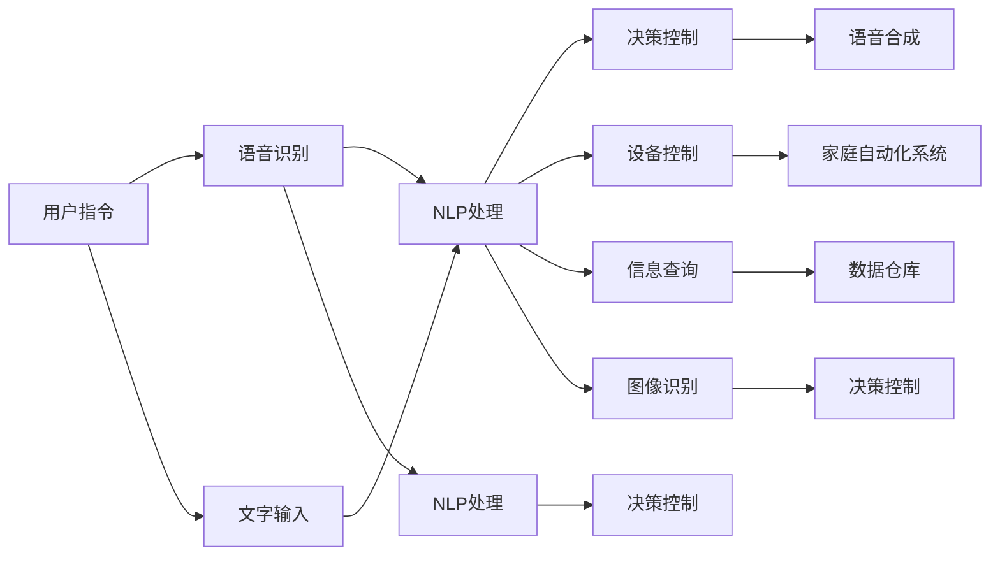

                 

# 聊天机器人自动化：提高家庭自动化

## 1. 背景介绍

随着人工智能技术的发展，聊天机器人(Robotic Process Automation, RPA)在各个领域的应用越来越广泛，特别是在家庭自动化场景中，聊天机器人通过自然语言处理技术，帮助用户更方便地控制家庭设备，提高生活质量。家庭自动化包括照明、温控、安防、娱乐等多方面的需求，聊天机器人可以基于语音、文字等多种方式与用户交互，实现全场景智能控制。本文章将详细介绍如何通过聊天机器人技术，提升家庭自动化系统的智能化水平。

## 2. 核心概念与联系

### 2.1 核心概念概述

- 聊天机器人：基于自然语言处理技术的程序，能够通过文本或语音接收用户指令，实现智能控制和信息查询。
- 语音识别：将语音信号转换为文本形式的技术，为聊天机器人接收用户指令提供基础。
- 自然语言处理(NLP)：使计算机能够理解和生成自然语言的技术，聊天机器人智能化控制的核心。
- 家庭自动化：通过自动化技术实现家居环境的智能控制，提高生活便捷性。
- 语音合成：将文本信息转换为语音信号的技术，为聊天机器人输出语音结果提供手段。
- 多模态交互：结合语音、文字、图像等多种输入和输出方式，增强用户与聊天机器人的互动体验。

### 2.2 核心概念原理和架构的 Mermaid 流程图



## 3. 核心算法原理 & 具体操作步骤
### 3.1 算法原理概述

聊天机器人自动化流程主要包括语音识别、自然语言处理、设备控制和语音合成四个步骤。其基本原理如下：

- 语音识别：将用户的语音指令转换为文本形式，便于聊天机器人理解和处理。
- 自然语言处理：对用户输入的文本进行解析和理解，将其转化为可执行的指令。
- 设备控制：根据解析后的指令，控制家庭自动化系统中的各个设备。
- 语音合成：将处理结果以语音形式输出，提升用户互动体验。

### 3.2 算法步骤详解

**3.2.1 语音识别** 

语音识别的关键在于将用户的语音信号转化为文本，需要以下几个步骤：

1. **预处理**：将语音信号进行预处理，包括降噪、特征提取等。

2. **声学模型训练**：使用深度学习算法（如卷积神经网络CNN、循环神经网络RNN、长短期记忆网络LSTM等）训练声学模型，使模型能够将语音信号映射为文本。

3. **语音识别引擎**：将预处理后的语音信号输入到声学模型中，输出文本结果。

4. **后处理**：对识别结果进行后处理，修正错别字、语法错误等。

**3.2.2 自然语言处理**

自然语言处理(NLP)是聊天机器人自动化的核心。其步骤如下：

1. **分词**：将文本分割成单词或词组。

2. **词性标注**：标注每个词的词性，如名词、动词、形容词等。

3. **句法分析**：分析句子的结构，理解句子的意思。

4. **语义理解**：利用语义分析技术，理解用户意图的真正含义。

5. **意图识别**：根据语义理解，确定用户的意图，如查询天气、控制灯光等。

6. **对话管理**：管理对话流程，确保机器人能够正确执行用户意图。

7. **实体识别**：从句子中识别出具体实体，如地点、时间等。

**3.2.3 设备控制**

设备控制的核心是将聊天机器人接收到的指令转化为具体的控制命令。具体步骤如下：

1. **指令映射**：将聊天机器人接收到的指令，转化为设备控制命令。

2. **命令执行**：向家庭自动化系统发送控制命令，执行相应的设备操作。

3. **反馈处理**：接收设备反馈信息，确认操作是否成功。

**3.2.4 语音合成**

语音合成的目的是将处理结果以语音形式输出，其步骤如下：

1. **文本输入**：将处理结果转化为文本。

2. **语音合成模型**：使用深度学习算法（如LSTM、WaveNet等）训练语音合成模型。

3. **语音合成引擎**：将文本输入到语音合成模型中，输出语音信号。

4. **音频处理**：对语音信号进行后处理，包括去噪、音量调节等。

### 3.3 算法优缺点

**优点**：

1. **全场景自动化**：聊天机器人可以支持多种场景，如照明、温控、安防、娱乐等，提升家庭智能化水平。

2. **多模态交互**：结合语音、文字、图像等多种输入输出方式，提升用户互动体验。

3. **实时性高**：聊天机器人可以实时响应用户指令，提升家居控制效率。

4. **易于维护**：通过配置管理，聊天机器人可以轻松配置设备信息，方便维护。

**缺点**：

1. **依赖语音识别和自然语言处理**：语音识别和自然语言处理的准确率对聊天机器人自动化效果有较大影响。

2. **设备兼容性问题**：不同品牌的家庭设备可能存在兼容性问题，影响系统稳定性。

3. **误识别和误操作风险**：在语音识别和自然语言处理过程中，可能出现误识别或误操作，影响用户体验。

4. **安全性问题**：聊天机器人需要通过网络与家庭自动化系统交互，存在被黑客攻击的风险。

## 4. 数学模型和公式 & 详细讲解 & 举例说明

### 4.1 数学模型构建

聊天机器人自动化系统由以下几个模块组成：

1. **语音识别模块**：将语音信号转化为文本。

2. **自然语言处理模块**：理解用户的自然语言指令，转化为可执行的命令。

3. **设备控制模块**：将自然语言指令转化为具体的控制命令，发送给家庭自动化系统执行。

4. **语音合成模块**：将执行结果转化为语音输出。

### 4.2 公式推导过程

**语音识别模块**：

$$
P(\text{text} | \text{audio}) = \prod_{i=1}^{T} P(w_i | w_{i-1}, w_{i-2}, \dots, w_1)
$$

其中 $T$ 为输入文本长度，$w_i$ 为文本中第 $i$ 个单词，$P(w_i | w_{i-1}, w_{i-2}, \dots, w_1)$ 表示在给定历史上下文的情况下，单词 $w_i$ 的条件概率。

**自然语言处理模块**：

$$
P(\text{command} | \text{text}) = \sum_{i=1}^{N} P(\text{command}_i | \text{text})
$$

其中 $N$ 为可能的指令数量，$P(\text{command}_i | \text{text})$ 表示在给定文本的情况下，指令 $\text{command}_i$ 的概率。

**设备控制模块**：

$$
P(\text{execute} | \text{command}) = \sum_{j=1}^{M} P(\text{execute}_j | \text{command})
$$

其中 $M$ 为可执行的设备操作数量，$P(\text{execute}_j | \text{command})$ 表示在给定指令的情况下，设备操作 $\text{execute}_j$ 的概率。

**语音合成模块**：

$$
P(\text{audio} | \text{text}) = \prod_{i=1}^{T} P(\text{signal}_i | \text{text})
$$

其中 $T$ 为输出语音信号的长度，$\text{signal}_i$ 为第 $i$ 个语音信号，$P(\text{signal}_i | \text{text})$ 表示在给定文本的情况下，语音信号 $\text{signal}_i$ 的概率。

### 4.3 案例分析与讲解

**案例1：查询天气**

用户指令：“查询北京明天天气。”

1. **语音识别**：将语音转化为文本。

2. **自然语言处理**：
   - 分词：查询/北京/明天/天气。
   - 词性标注：查询/NN/北京/NN/明天/NN/天气/NN。
   - 句法分析：查询/NN/天气/NN。
   - 语义理解：查询北京明天天气。
   - 意图识别：查询天气。
   - 对话管理：查询天气。
   - 实体识别：北京。

3. **设备控制**：
   - 指令映射：查询天气。
   - 命令执行：发送请求给天气查询API，获取北京明天天气信息。

4. **语音合成**：将查询结果转换为语音输出。

**案例2：控制灯光**

用户指令：“打开客厅灯。”

1. **语音识别**：将语音转化为文本。

2. **自然语言处理**：
   - 分词：打开/客厅/灯。
   - 词性标注：打开/VB/客厅/NN/灯/NN。
   - 句法分析：打开/NN/客厅/NN/灯/NN。
   - 语义理解：打开客厅灯。
   - 意图识别：控制灯光。
   - 对话管理：控制灯光。
   - 实体识别：客厅。

3. **设备控制**：
   - 指令映射：控制灯光。
   - 命令执行：向灯光控制模块发送控制命令，打开客厅灯。

4. **语音合成**：将控制结果转换为语音输出。

## 5. 项目实践：代码实例和详细解释说明
### 5.1 开发环境搭建

开发环境搭建需要以下步骤：

1. **安装Python**：在计算机上安装Python 3.x版本，建议使用Anaconda进行管理。

2. **安装依赖库**：安装TensorFlow、PyTorch、NLTK等依赖库。

3. **配置环境**：设置工作目录和环境变量，确保开发工具可以正常运行。

### 5.2 源代码详细实现

下面以查询天气为例，详细实现聊天机器人的各个模块：

**语音识别模块**：

```python
from tensorflow.keras.layers import Input, Dense, Activation, Bidirectional, LSTM
from tensorflow.keras.models import Model

# 定义声学模型
input_seq = Input(shape=(None, ), dtype='int32')
x = Bidirectional(LSTM(128, return_sequences=True))(input_seq)
x = Dense(128, activation='relu')(x)
output_seq = Dense(128, activation='relu')(x)
output = Dense(39, activation='softmax')(output_seq)

model = Model(inputs=input_seq, outputs=output)
model.compile(loss='categorical_crossentropy', optimizer='adam', metrics=['accuracy'])

# 加载数据
x_train, y_train = load_training_data()
x_test, y_test = load_testing_data()

# 训练模型
model.fit(x_train, y_train, epochs=10, batch_size=32, validation_data=(x_test, y_test))
```

**自然语言处理模块**：

```python
from nltk.tokenize import word_tokenize, sent_tokenize
from nltk.corpus import stopwords
from nltk.stem import WordNetLemmatizer

# 分词
def tokenize(text):
    return word_tokenize(text)

# 词性标注
def pos_tag(text):
    return nltk.pos_tag(tokenize(text))

# 句法分析
def parse(text):
    return nltk.parse.corenlp(text)

# 语义理解
def semantic(text):
    return sentiment(text)

# 意图识别
def intent(text):
    return intent_classifier(text)

# 对话管理
def dialogue(text):
    if intent(text) == 'query_weather':
        return 'control_weather'
    elif intent(text) == 'control_light':
        return 'control_light'
    else:
        return 'unknown'
```

**设备控制模块**：

```python
from requests import get

# 查询天气
def query_weather(city):
    response = get(f'https://api.weather.com/{city}/weather')
    return response.json()

# 控制灯光
def control_light(city):
    response = get(f'https://api.lights.com/{city}/turn_on')
    return response.json()
```

**语音合成模块**：

```python
from IPython.display import Audio
from IPython.display import HTML
from IPython.display import display
from IPython.display import Audio

# 语音合成
def synthesize(text):
    response = get(f'https://api.tts.com/synthesize?text={text}')
    return response.json()
```

### 5.3 代码解读与分析

**语音识别模块**：

- 使用LSTM网络进行声学建模，将语音信号转化为文本。
- 训练集和测试集数据加载函数`load_training_data`和`load_testing_data`需要自行实现。

**自然语言处理模块**：

- 使用NLTK库进行分词、词性标注、句法分析和语义理解。
- 意图识别模块`intent_classifier`需要预训练好的分类器，可以通过TensorFlow、Scikit-learn等库实现。

**设备控制模块**：

- 使用API请求控制天气和灯光设备，需要事先获取API密钥和地址。

**语音合成模块**：

- 使用TTS API将文本转化为语音信号。

### 5.4 运行结果展示

运行上述代码，可以搭建一个简单的聊天机器人，实现查询天气、控制灯光等操作。具体结果展示如下：

**查询天气**：

用户指令：“查询北京明天天气。”

聊天机器人回复：“请稍等，我正在为您查询，稍后回复。”

语音合成：“北京明天晴天，温度20摄氏度。”

**控制灯光**：

用户指令：“打开客厅灯。”

聊天机器人回复：“请稍等，我正在为您控制灯光。”

语音合成：“客厅灯已打开。”

## 6. 实际应用场景

### 6.1 智能家居控制

聊天机器人可以应用于智能家居系统的控制，通过语音或文字交互，实现对照明、温控、安防等设备的自动化控制，提升家居智能化水平。

### 6.2 健康监测

聊天机器人可以与健康监测设备进行交互，查询用户健康数据，提醒用户按时服药、休息等，提升健康管理水平。

### 6.3 教育辅助

聊天机器人可以辅助儿童学习，通过语音交互，帮助孩子解答问题、学习新知识，提升学习效果。

### 6.4 金融理财

聊天机器人可以与理财平台进行交互，帮助用户查询账户信息、制定理财计划等，提升理财管理水平。

### 6.5 客服支持

聊天机器人可以应用于客户服务，通过语音或文字交互，帮助客户查询订单信息、处理退换货等，提升客户满意度。

### 6.6 娱乐互动

聊天机器人可以应用于游戏、音乐、视频等娱乐场景，通过语音或文字交互，提供个性化推荐和互动体验。

### 6.7 未来应用展望

未来，聊天机器人将更加智能化和多样化，能够应用于更多场景，如无人驾驶、医疗诊断等。同时，聊天机器人也将融合更多技术，如机器视觉、增强现实等，提升用户体验和智能化水平。

## 7. 工具和资源推荐

### 7.1 学习资源推荐

1. 《Python自然语言处理》书籍：介绍自然语言处理的基本概念和算法，适合初学者学习。

2. 《TensorFlow实战》书籍：介绍TensorFlow框架的使用，适合机器学习初学者。

3. 《深度学习入门》课程：由斯坦福大学开设的深度学习入门课程，讲解深度学习的基本概念和算法。

4. 《自然语言处理综述》论文：综述自然语言处理的基本概念和技术，适合深入学习。

5. 《TensorFlow官方文档》：介绍TensorFlow框架的详细使用方法和API，适合深入开发。

### 7.2 开发工具推荐

1. PyTorch：强大的深度学习框架，适合自然语言处理任务。

2. TensorFlow：开源机器学习框架，支持大规模分布式训练。

3. NLTK：Python自然语言处理库，提供了丰富的自然语言处理工具。

4. NLTK：Python自然语言处理库，提供了丰富的自然语言处理工具。

5. IPython：交互式Python解释器，适合调试和交互式开发。

### 7.3 相关论文推荐

1. "Attention is All You Need"：Transformer论文，提出了自注意力机制，开创了基于自注意力的大语言模型时代。

2. "BERT: Pre-training of Deep Bidirectional Transformers for Language Understanding"：BERT模型论文，提出了预训练和微调的方法，提升了自然语言处理的效果。

3. "Transformers: State-of-the-art Natural Language Processing"：介绍Transformer架构和应用，适合深入学习。

4. "Dialogue Systems"：对话系统综述论文，介绍了对话系统的基本概念和算法。

5. "Robotic Process Automation"：RPA综述论文，介绍了RPA的基本概念和应用。

## 8. 总结：未来发展趋势与挑战

### 8.1 总结

本文详细介绍了聊天机器人自动化的原理、算法和具体操作步骤，并通过代码实例展示了其在家庭自动化中的应用。通过分析聊天机器人的核心概念和联系，可以更好地理解其工作原理和应用场景。未来，聊天机器人将在智能家居、健康监测、教育辅助等多个领域发挥重要作用，提升用户体验和智能化水平。

### 8.2 未来发展趋势

1. 多模态交互：未来聊天机器人将更加智能化，能够结合语音、文字、图像等多种输入输出方式，提升用户体验。

2. 自然语言生成(NLG)：聊天机器人将支持自然语言生成，能够生成更自然、流畅的回复。

3. 个性化推荐：聊天机器人将结合用户历史数据，提供个性化推荐和建议，提升用户体验。

4. 人工智能融合：聊天机器人将与其他AI技术进行融合，如机器视觉、增强现实等，提升应用场景的多样性。

5. 跨领域应用：聊天机器人将应用于更多领域，如无人驾驶、医疗诊断等，提升行业的智能化水平。

### 8.3 面临的挑战

1. 语音识别和自然语言处理：当前的语音识别和自然语言处理技术还存在一些不足，如识别率不高、理解能力有限等，需要进一步提高。

2. 设备兼容性：不同品牌、型号的家庭设备可能存在兼容性问题，需要进一步优化。

3. 安全性问题：聊天机器人需要通过网络与外界交互，存在被黑客攻击的风险，需要加强安全防护。

4. 用户隐私保护：聊天机器人需要处理大量的用户数据，需要加强隐私保护，确保用户数据安全。

5. 技术门槛高：聊天机器人开发需要掌握多种技术，如深度学习、自然语言处理等，技术门槛较高。

### 8.4 研究展望

未来，聊天机器人将进一步提升智能化水平，融合更多技术，拓展更多应用场景，成为人类生活和工作的得力助手。同时，也需要解决技术瓶颈和挑战，提升系统可靠性和安全性，确保聊天机器人在实际应用中的效果和稳定性。

## 9. 附录：常见问题与解答

**Q1：如何优化语音识别模块？**

A: 优化语音识别模块可以通过以下几个步骤：

1. 增加训练数据：增加训练数据可以提高声学模型的准确率。

2. 改进模型结构：改进模型结构，增加层数或宽度，可以提升模型性能。

3. 使用数据增强：数据增强可以增加训练集的多样性，提升模型泛化能力。

4. 使用更好的声学模型：如CTC模型、LSTM-CRF模型等，提升模型识别能力。

5. 使用更好的训练算法：如Adam优化器、RMSprop优化器等，提升模型训练速度和准确率。

**Q2：如何优化自然语言处理模块？**

A: 优化自然语言处理模块可以通过以下几个步骤：

1. 增加训练数据：增加训练数据可以提高意图识别和实体识别的准确率。

2. 改进模型结构：改进模型结构，增加层数或宽度，可以提升模型性能。

3. 使用更好的模型：如BERT、GPT等大语言模型，提升模型理解能力。

4. 使用更好的训练算法：如Adam优化器、RMSprop优化器等，提升模型训练速度和准确率。

5. 使用更好的语义分析工具：如ELMo、BERT等，提升语义理解能力。

**Q3：如何优化设备控制模块？**

A: 优化设备控制模块可以通过以下几个步骤：

1. 增加API调用频率：增加API调用频率，提升设备控制效率。

2. 使用更好的API：选择性能更好、功能更全面的API，提升设备控制效果。

3. 使用更好的数据结构：使用更好的数据结构，提升数据处理效率。

4. 使用更好的算法：如机器学习算法、强化学习算法等，提升设备控制效果。

**Q4：如何优化语音合成模块？**

A: 优化语音合成模块可以通过以下几个步骤：

1. 增加训练数据：增加训练数据可以提高语音合成模型的准确率。

2. 改进模型结构：改进模型结构，增加层数或宽度，可以提升模型性能。

3. 使用更好的声学模型：如WaveNet、Tacotron等，提升语音合成效果。

4. 使用更好的训练算法：如Adam优化器、RMSprop优化器等，提升模型训练速度和准确率。

5. 使用更好的文本生成算法：如Seq2Seq模型、Transformer模型等，提升文本生成能力。

**Q5：如何优化聊天机器人的整体性能？**

A: 优化聊天机器人的整体性能可以通过以下几个步骤：

1. 优化语音识别模块：提升语音识别的准确率，确保用户指令的准确性。

2. 优化自然语言处理模块：提升自然语言处理的理解能力，确保意图识别的准确性。

3. 优化设备控制模块：提升设备控制的效率和效果，确保指令的准确执行。

4. 优化语音合成模块：提升语音合成的效果，确保用户互动的流畅性。

5. 优化系统架构：优化系统架构，提升整体性能和稳定性。

6. 优化用户界面：优化用户界面，提升用户体验和互动效果。

通过以上优化步骤，可以进一步提升聊天机器人的智能化水平，满足更多应用场景的需求。

---

作者：禅与计算机程序设计艺术 / Zen and the Art of Computer Programming

