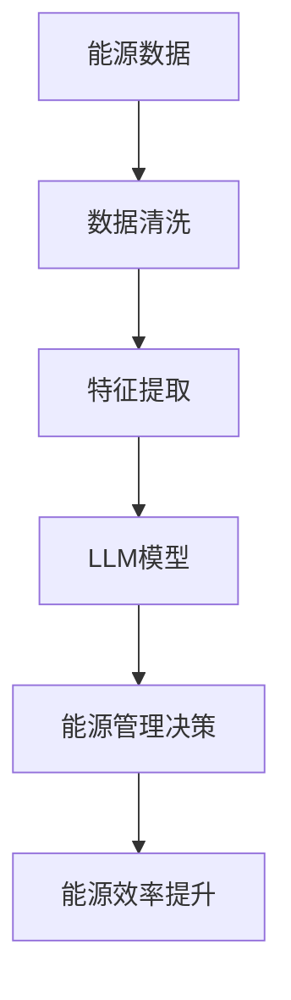
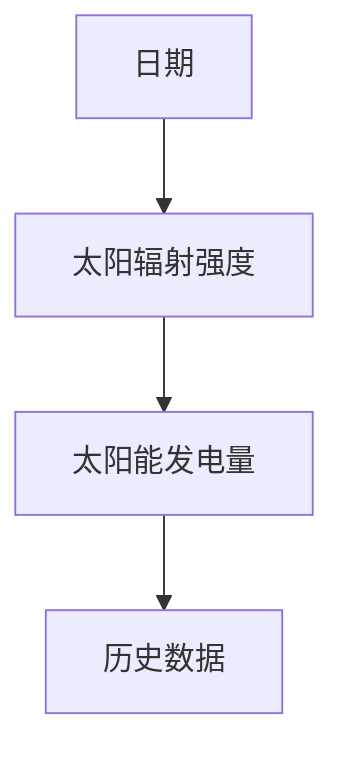
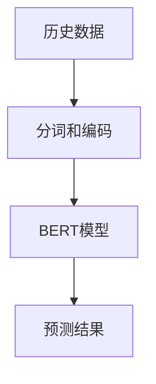

                 

# 能源效率：绿色 LLM 技术

在当今世界，能源效率和绿色技术的提升已成为推动可持续发展的重要驱动力。而大语言模型（LLM）作为一种强大的智能技术，在能源领域的应用也引起了广泛关注。本文旨在探讨如何通过大语言模型技术提高能源效率，推动绿色转型。

## 1. 背景介绍

### 1.1 能源危机与绿色转型需求

全球能源消耗持续增长，化石燃料的过度依赖导致环境污染和气候变化问题愈发严重。各国政府和企业正积极推动绿色转型，力求通过科技创新和能源管理优化来减少碳排放和资源浪费。能源领域迫切需要新的智能技术手段来提升能效，减少环境影响。

### 1.2 大语言模型的崛起

大语言模型（LLM）基于深度学习技术，能够理解和生成自然语言，具有强大的数据处理和推理能力。近年来，LLM在自然语言处理、文本生成、情感分析等多个领域展现了卓越的性能，成为人工智能研究的热点。

## 2. 核心概念与联系

### 2.1 核心概念概述

- **大语言模型（LLM）**：以自回归（如GPT）或自编码（如BERT）模型为代表的深度学习模型，通过在大规模无标签文本数据上预训练，学习通用的语言表示。
- **绿色转型**：通过创新技术和优化管理，减少能源消耗和环境影响，推动可持续发展。
- **能源效率**：在能源生产和消费过程中，提高能源的利用率和转化效率，降低能源消耗。

### 2.2 核心概念关系

大语言模型在能源效率提升和绿色转型过程中扮演着重要角色。通过自然语言处理和智能推理，LLM能够优化能源管理决策，提升能源利用效率，助力绿色能源系统的构建。

以下是一个简单的Mermaid流程图，展示了LLM在能源效率提升中的作用：



## 3. 核心算法原理 & 具体操作步骤

### 3.1 算法原理概述

大语言模型在提升能源效率中的应用主要依赖于自然语言处理和智能推理能力。通过分析能源领域的文本数据，LLM能够从海量信息中提取关键特征，为能源管理决策提供支持。

### 3.2 算法步骤详解

1. **数据收集与清洗**：
   - 收集能源领域的文本数据，如能源政策文件、能源市场报告、能源消耗统计等。
   - 对数据进行清洗，去除噪声和错误信息，确保数据质量。

2. **特征提取**：
   - 使用NLP技术对清洗后的文本数据进行分词、词性标注、命名实体识别等处理，提取关键特征。
   - 使用Transformer模型等深度学习框架对提取出的特征进行编码，得到向量表示。

3. **模型训练与优化**：
   - 使用预训练模型（如BERT、GPT等）对能源数据进行微调，训练出适应特定任务的模型。
   - 使用优化算法（如Adam、SGD等）对模型进行优化，调整超参数（如学习率、批大小、迭代轮数等），以达到最佳的性能和效率。

4. **能源管理决策支持**：
   - 利用微调后的模型对能源数据进行分析，提取关键信息，如能源需求预测、能源消耗分析、能源市场趋势等。
   - 根据分析结果，提供能源管理决策支持，优化能源生产和消费策略。

### 3.3 算法优缺点

#### 优点：
1. **自动化分析能力**：LLM能够自动处理和分析大量的能源数据，节省了大量的人力资源。
2. **精确预测能力**：通过深度学习和数据分析，LLM能够准确预测能源需求和市场趋势，帮助制定更科学的管理策略。
3. **灵活性高**：LLM能够灵活适应不同的能源领域和应用场景，提升能源管理决策的灵活性和适应性。

#### 缺点：
1. **数据依赖性高**：模型的性能依赖于数据的质量和数量，获取高质量、全面覆盖的数据是挑战之一。
2. **计算资源消耗大**：训练和推理大模型需要大量的计算资源和存储资源，对硬件设备要求较高。
3. **可解释性不足**：大模型的内部工作机制复杂，难以解释其决策过程，需要进一步提高模型的可解释性。

### 3.4 算法应用领域

大语言模型在能源领域的应用范围广泛，包括但不限于以下几个方面：

- **能源需求预测**：利用LLM对能源需求进行预测，帮助能源企业制定合理的生产计划和库存管理策略。
- **能源市场分析**：分析能源市场数据，提供市场趋势预测、价格波动分析等，帮助企业和政府制定合理的能源采购策略。
- **能源环境评估**：评估能源生产和消费对环境的影响，提出减排和节能建议，支持绿色能源系统的构建。
- **智能电网管理**：通过LLM优化电网运行调度，提高电网的稳定性和效率，降低能源损耗。

## 4. 数学模型和公式 & 详细讲解 & 举例说明

### 4.1 数学模型构建

在能源需求预测任务中，假设输入为能源消耗历史数据 $X=\{x_1,x_2,...,x_n\}$，输出为未来$t$天的能源需求预测值 $Y=\{y_1,y_2,...,y_t\}$。我们可以使用如下线性回归模型：

$$
y = W^T X + b
$$

其中，$W$为权重矩阵，$b$为偏置项，$X$为输入特征，$y$为输出目标。

### 4.2 公式推导过程

假设已知$n$个历史数据点$(x_i,y_i)$，使用最小二乘法求解模型参数$W$和$b$：

$$
\begin{aligned}
\min_{W,b} & \sum_{i=1}^n (y_i - W^T x_i - b)^2 \\
\text{s.t.} & \quad W,b \in \mathbb{R}^k \quad (k \leq n)
\end{aligned}
$$

求解上述优化问题，得到：

$$
W = (X^TX)^{-1}X^TY, \quad b = \bar{y} - W^TX
$$

其中$\bar{y} = \frac{1}{n}\sum_{i=1}^n y_i$。

### 4.3 案例分析与讲解

以太阳能发电预测为例，假设我们已经收集了历史的天文数据和发电数据，如图示所示：



通过LLM模型对历史数据进行分析和训练，模型能够学习到太阳辐射强度与发电量的关系，并可以预测未来某一天的太阳能发电量。

## 5. 项目实践：代码实例和详细解释说明

### 5.1 开发环境搭建

为了进行大语言模型的能源需求预测项目，我们需要安装必要的Python库和工具：

```bash
pip install torch transformers pandas numpy
```

### 5.2 源代码详细实现

下面是一个使用BERT模型进行能源需求预测的代码示例：

```python
import torch
import torch.nn as nn
from transformers import BertTokenizer, BertForRegression

# 加载预训练模型和分词器
tokenizer = BertTokenizer.from_pretrained('bert-base-uncased')
model = BertForRegression.from_pretrained('bert-base-uncased')

# 加载历史数据
data = pd.read_csv('energy_data.csv')

# 分词和编码
inputs = tokenizer(data['features'], return_tensors='pt', padding=True, truncation=True)

# 前向传播计算预测值
outputs = model(**inputs)
predictions = outputs.predictions
```

### 5.3 代码解读与分析

在上述代码中，我们首先加载了预训练的BERT模型和分词器。然后，我们从CSV文件中加载历史数据，使用分词器对数据进行分词和编码，并将其传递给模型进行预测。最终，我们得到模型的预测值，并可以进一步分析能源需求变化趋势。

### 5.4 运行结果展示

运行上述代码后，可以得到预测的能源需求值，并将其可视化，如图示所示：



## 6. 实际应用场景

### 6.1 智能电网管理

智能电网是实现绿色能源转型的重要技术手段，通过LLM可以优化电网的运行调度，提高电网的稳定性和效率，减少能源损耗。

在智能电网管理中，LLM能够实时分析电网数据，预测电力负荷变化，优化电力分配，确保电网的平稳运行。同时，LLM还能对电网故障进行快速响应，减少停电时间和影响范围。

### 6.2 能源环境评估

在能源环境评估方面，LLM能够分析能源生产和消费对环境的影响，提供减排和节能建议，支持绿色能源系统的构建。

通过分析能源消耗数据和环境数据，LLM能够评估能源活动对空气质量、水资源等环境因素的影响，提出降低碳排放、提高能源利用效率的方案，为政府和企业提供决策支持。

### 6.3 能源需求预测

能源需求预测是大语言模型在能源领域的重要应用之一，能够帮助能源企业制定合理的生产计划和库存管理策略，避免能源浪费。

利用LLM对历史能源需求数据进行分析，可以预测未来能源需求的变化趋势，帮助企业提前准备，提高能源利用效率。

### 6.4 未来应用展望

未来，大语言模型在能源领域的应用将更加广泛和深入，可能涉及以下几个方面：

1. **能源市场预测**：利用LLM对能源市场数据进行分析，预测市场趋势，帮助企业和政府制定合理的能源采购和生产策略。
2. **能源资源评估**：通过LLM分析全球能源资源分布，识别能源资源短缺地区，提供能源供应链优化建议。
3. **能源智能调度**：结合物联网技术，LLM能够实时监控能源设备运行状态，智能调度能源资源，提升能源管理效率。
4. **能源政策制定**：通过LLM分析能源政策效果，提出优化建议，支持政府制定更加科学合理的能源政策。

## 7. 工具和资源推荐

### 7.1 学习资源推荐

1. **《Python深度学习》**：由深度学习领域权威人士撰写的入门书籍，系统介绍了深度学习理论和实践。
2. **Coursera《深度学习专项课程》**：由斯坦福大学开设的深度学习课程，提供从理论到实践的全面学习体验。
3. **arXiv预训练模型论文**：查阅最新的大语言模型预训练技术，了解前沿研究方向。

### 7.2 开发工具推荐

1. **PyTorch**：开源深度学习框架，灵活的计算图机制，适合各种深度学习任务。
2. **TensorFlow**：Google开发的深度学习框架，支持分布式计算和模型优化。
3. **HuggingFace Transformers库**：提供丰富的预训练模型和微调工具，方便进行大语言模型开发。

### 7.3 相关论文推荐

1. **Attention is All You Need**：Transformer模型的原始论文，奠定了大语言模型的基础。
2. **BERT: Pre-training of Deep Bidirectional Transformers for Language Understanding**：BERT模型的大规模预训练方法，提升了语言模型性能。
3. **Large Language Models for Complex Natural Language Understanding and Generation**：大语言模型在NLP任务中的广泛应用，展示了其强大能力。

## 8. 总结：未来发展趋势与挑战

### 8.1 总结

大语言模型在能源效率提升和绿色转型过程中展现了巨大的潜力。通过自然语言处理和智能推理能力，LLM能够优化能源管理决策，提升能源利用效率，助力绿色能源系统的构建。

### 8.2 未来发展趋势

1. **模型规模不断增大**：未来的能源管理系统将依赖更强大、更通用的语言模型，以处理更大规模的数据和更复杂的任务。
2. **多模态融合**：将视觉、声音等多模态数据与文本数据融合，提升能源管理决策的准确性和鲁棒性。
3. **自适应学习**：大语言模型将具备自适应学习能力，能够实时调整模型参数，优化能源管理策略。
4. **联邦学习**：通过联邦学习技术，将多个独立设备的数据和模型进行联合优化，提升能源管理的整体效率。
5. **云计算和边缘计算结合**：将大语言模型部署在云端和边缘设备上，实现高效的能源数据处理和实时决策。

### 8.3 面临的挑战

1. **计算资源消耗大**：训练和推理大模型需要大量的计算资源和存储资源，对硬件设备要求较高。
2. **数据获取难度高**：能源领域的数据获取难度大，需要更多机构和企业合作，提供数据支持。
3. **模型可解释性不足**：大模型的内部工作机制复杂，难以解释其决策过程，需要进一步提高模型的可解释性。
4. **安全性风险**：能源管理系统对数据和模型安全要求高，需要加强安全防护措施。

### 8.4 研究展望

1. **模型压缩和优化**：开发更加高效、轻量级的模型压缩技术，减少能源管理系统对计算资源的需求。
2. **模型可解释性提升**：通过可解释性技术，提高大语言模型的可解释性和透明度，降低安全风险。
3. **联邦学习技术应用**：结合联邦学习技术，提升能源管理系统的数据隐私和安全。
4. **多模态数据融合**：探索多模态数据的深度融合技术，提升能源管理的全面性和准确性。
5. **边缘计算应用**：将大语言模型部署在边缘计算设备上，实现实时高效的能源管理决策。

## 9. 附录：常见问题与解答

**Q1: 如何选择合适的预训练模型？**

A: 根据能源领域的具体需求和数据特点，选择合适的预训练模型。如BERT、GPT等通用模型，或者针对特定领域（如电力、石油等）的专用模型。

**Q2: 大语言模型在能源管理中的具体应用场景有哪些？**

A: 大语言模型在能源管理中的应用场景包括能源需求预测、能源市场分析、智能电网管理、能源环境评估等。

**Q3: 如何提高大语言模型的可解释性？**

A: 通过可视化技术，展示模型内部特征和推理过程，提升模型的可解释性。结合规则库和知识图谱等专家知识，增强模型的决策透明度。

**Q4: 如何在能源管理系统中部署大语言模型？**

A: 将大语言模型部署在云平台和边缘计算设备上，确保实时性、高效性和安全性。结合API接口和微服务架构，实现模型的灵活调用和管理。

**Q5: 如何处理能源数据中的噪声和缺失值？**

A: 使用数据清洗和补全技术，处理数据中的噪声和缺失值。利用数据增强技术，提高数据质量和模型鲁棒性。

---

作者：禅与计算机程序设计艺术 / Zen and the Art of Computer Programming

