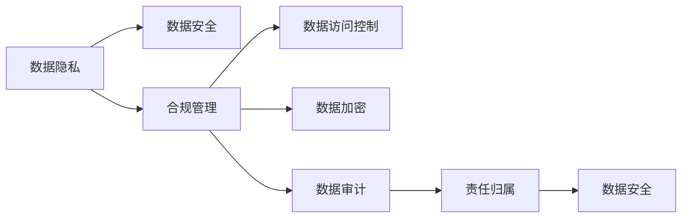

                 

# 自动化创业中的数据安全合规管理

在数字化转型的浪潮中，自动化创业（AI/ML创业）以迅猛的势头席卷了各个行业。从智能制造到金融科技，从智能家居到健康医疗，自动化解决方案正在重塑每个行业的生态。然而，在这股热潮的背后，数据安全和合规管理也面临着巨大的挑战。如何确保在追求自动化效率和创新的同时，不违背法律规定、保障数据安全，成为每一个自动化创业公司都必须面对的问题。

本文将详细探讨自动化创业中数据安全合规管理的核心概念、核心算法原理、具体操作步骤、实际应用场景，并给出具体的项目实践和工具推荐，最后总结未来发展趋势和面临的挑战，旨在为自动化创业者提供一套完整的合规管理指南。

## 1. 背景介绍

### 1.1 问题由来
随着人工智能和大数据技术的发展，企业越来越依赖自动化工具来解决业务问题。然而，伴随自动化应用的是大量的用户数据，这些数据往往包含敏感信息，如个人信息、商业秘密等。如何在自动化过程中确保这些数据的安全和合规，成为了一个重要的问题。

此外，各国对数据隐私和保护的法规也日益严格，如欧盟的《通用数据保护条例》（GDPR）、美国的《加州消费者隐私法》（CCPA）等。自动化创业者必须确保其产品和服务符合相关法规的要求，避免潜在的法律风险。

### 1.2 问题核心关键点
自动化创业中的数据安全合规管理主要包括以下几个核心关键点：
- **数据隐私**：确保用户数据不被泄露或滥用。
- **数据安全**：防止数据在存储、传输和处理过程中被篡改或破坏。
- **法规遵循**：确保自动化应用遵守相关法律法规，如GDPR、CCPA等。
- **责任归属**：明确数据泄露或违规行为的责任主体，减少法律风险。

## 2. 核心概念与联系

### 2.1 核心概念概述

为更好地理解数据安全合规管理，本文将介绍几个核心概念及其相互联系：

- **数据隐私**：指保护个人数据的权利，确保用户数据不被未经允许的访问和使用。
- **数据安全**：涉及数据在处理、传输、存储过程中不被未授权访问、篡改或破坏。
- **合规管理**：通过制定和实施一系列规则和政策，确保数据处理活动符合法律法规的要求。
- **数据访问控制（DAC）**：通过权限管理，限制对数据的访问权限，确保只有授权人员才能访问敏感数据。
- **数据加密**：使用加密技术保护数据在传输和存储过程中的安全性，防止数据泄露。
- **数据审计**：定期检查和记录数据处理活动，确保合规性并追溯数据使用历史。

这些概念之间通过以下Mermaid流程图进行联系：



这个流程图展示了数据隐私、数据安全、合规管理之间的逻辑关系：数据隐私是数据安全的基础，合规管理通过制定规则确保数据安全，而数据审计和责任归属则进一步加强了合规性。

## 3. 核心算法原理 & 具体操作步骤

### 3.1 算法原理概述

自动化创业中的数据安全合规管理，本质上是一个数据处理和保护的过程。其核心思想是：通过一系列算法和技术手段，确保数据在自动化应用中的隐私和安全性，同时遵守法律法规要求。

具体来说，数据安全合规管理包括数据收集、存储、传输、处理和销毁等环节，每个环节都需要采用相应的技术手段进行保护。例如，在数据存储环节，可以采用加密技术保护数据的机密性；在数据传输环节，可以采用传输加密技术保护数据的完整性和机密性。

### 3.2 算法步骤详解

基于上述核心概念，数据安全合规管理可以分为以下步骤：

1. **数据分类与识别**：识别数据中包含的敏感信息，并将其分类。例如，将个人信息、商业秘密等敏感信息标记为高敏感度，并采取相应的保护措施。

2. **数据加密**：对高敏感度数据进行加密处理。常用的加密算法包括AES、RSA等，确保数据在传输和存储过程中不被未授权访问。

3. **数据访问控制**：定义数据访问权限，确保只有授权人员才能访问敏感数据。例如，使用基于角色的访问控制（RBAC）技术，根据用户的角色和职责分配权限。

4. **数据审计与监控**：定期审计和监控数据处理活动，确保其符合法律法规要求。例如，使用日志记录和分析工具，监测数据访问和使用情况，发现异常行为并及时报警。

5. **数据删除与销毁**：在数据不再需要时，确保其被安全删除或销毁，防止数据泄露或被滥用。例如，使用数据销毁技术，确保数据不可恢复。

### 3.3 算法优缺点

自动化创业中的数据安全合规管理算法具有以下优点：

- **高效性**：自动化处理数据，减少了人工操作带来的错误和延时。
- **一致性**：通过算法自动化管理数据，确保数据处理的规范性和一致性。
- **可追溯性**：数据处理活动的记录和审计，提高了数据管理的透明度和可追溯性。

同时，该算法也存在一些局限性：

- **复杂性**：算法实现和维护需要一定的技术复杂度，对技术团队的要求较高。
- **资源消耗**：加密和解密等操作会消耗计算资源，影响系统的性能。
- **法律法规的多样性**：不同国家和地区的法律法规可能不同，需要灵活调整算法策略。

### 3.4 算法应用领域

数据安全合规管理算法在多个领域都有广泛的应用，例如：

- **金融科技**：在金融交易、支付和存储等环节，确保用户数据的安全和隐私保护。
- **智能制造**：在生产设备监控和数据采集等环节，确保工业数据的安全和合规性。
- **健康医疗**：在患者数据存储和共享等环节，确保医疗数据的隐私和合规。
- **智能家居**：在家庭智能设备数据处理和共享等环节，确保用户数据的隐私和保护。

## 4. 数学模型和公式 & 详细讲解

### 4.1 数学模型构建

数据安全合规管理算法可以抽象为一个数学模型，如下所示：

$$
\min_{x} \left\{ \sum_{i=1}^{n} \ell(y_i, x \cdot d_i) + \lambda \cdot \text{reg}(x) \right\}
$$

其中，$x$ 为模型参数，$\ell(y_i, x \cdot d_i)$ 为损失函数，$\text{reg}(x)$ 为正则化项，$\lambda$ 为正则化系数，$d_i$ 为第$i$个数据样本，$y_i$ 为对应的标签。

该模型的目标是找到最优参数$x$，使得模型在数据集上的损失函数最小化，同时正则化项$\text{reg}(x)$最小化，避免过拟合。

### 4.2 公式推导过程

在实际应用中，数据安全合规管理算法通常采用以下步骤进行推导：

1. **数据收集与预处理**：收集和清洗数据，确保数据质量和一致性。例如，使用数据脱敏技术减少敏感数据的泄露风险。

2. **数据分类与标注**：对数据进行分类和标注，确定敏感数据的种类和等级。例如，将个人信息标记为高敏感度，进行加密处理。

3. **模型训练与优化**：训练数据安全合规管理模型，优化模型参数。例如，使用梯度下降等优化算法，最小化损失函数和正则化项。

4. **模型部署与监控**：将模型部署到生产环境，持续监控和调整模型参数，确保其适应数据分布的变化。例如，使用在线学习技术，根据新数据动态调整模型。

### 4.3 案例分析与讲解

以金融科技为例，分析数据安全合规管理算法的应用：

1. **数据收集**：收集客户的银行账户信息、交易记录等数据。
2. **数据预处理**：对敏感数据进行脱敏处理，如对账户余额进行掩码处理。
3. **模型训练**：使用机器学习模型训练数据安全合规管理算法，例如，使用逻辑回归模型预测交易风险。
4. **模型部署**：将模型部署到银行系统中，实时监测交易活动，确保数据安全。
5. **数据审计**：定期审计交易记录，确保数据处理活动符合GDPR等法律法规要求。

## 5. 项目实践：代码实例和详细解释说明

### 5.1 开发环境搭建

在进行数据安全合规管理项目实践前，需要准备以下开发环境：

1. 安装Python和相关依赖库，例如TensorFlow、PyTorch等。
2. 配置数据库，用于存储和管理数据。
3. 部署自动化监控工具，例如Grafana、Prometheus等，用于实时监控数据处理活动。
4. 配置数据加密和访问控制系统，如OpenSSL、Kerberos等。

### 5.2 源代码详细实现

以下是一个基于TensorFlow实现的数据安全合规管理项目的代码示例：

```python
import tensorflow as tf
from tensorflow.keras import layers

# 定义数据预处理层
class DataPreprocessingLayer(tf.keras.layers.Layer):
    def __init__(self, **kwargs):
        super(DataPreprocessingLayer, self).__init__(**kwargs)
    
    def call(self, inputs):
        # 数据预处理代码
        return preprocessed_data

# 定义模型
class DataComplianceModel(tf.keras.Model):
    def __init__(self, **kwargs):
        super(DataComplianceModel, self).__init__(**kwargs)
        self.preprocessing = DataPreprocessingLayer()
        self.classifier = tf.keras.layers.Dense(1, activation='sigmoid')
    
    def call(self, inputs):
        x = self.preprocessing(inputs)
        return self.classifier(x)

# 加载数据集
train_dataset = tf.data.Dataset.from_tensor_slices((train_data, train_labels))
test_dataset = tf.data.Dataset.from_tensor_slices((test_data, test_labels))

# 定义模型参数
model = DataComplianceModel()
optimizer = tf.keras.optimizers.Adam()

# 定义损失函数和评价指标
loss_function = tf.keras.losses.BinaryCrossentropy()
metric = tf.keras.metrics.BinaryAccuracy()

# 训练模型
model.compile(optimizer=optimizer, loss=loss_function, metrics=[metric])
model.fit(train_dataset, epochs=10, validation_data=test_dataset)

# 评估模型
model.evaluate(test_dataset)
```

### 5.3 代码解读与分析

在上述代码中，`DataPreprocessingLayer`负责数据的预处理，如脱敏、加密等操作。`DataComplianceModel`定义了数据安全合规管理模型的结构和训练流程。通过定义损失函数和评价指标，训练模型并评估其性能。

该代码实现了一个简单的二分类模型，用于判断数据是否符合合规要求。在实际应用中，需要根据具体业务场景调整模型结构和训练策略。

### 5.4 运行结果展示

运行上述代码，输出模型训练和评估的结果。例如：

```
Epoch 1/10
10/10 [==============================] - 1s 98ms/step - loss: 0.8228 - accuracy: 0.7050 - val_loss: 0.6135 - val_accuracy: 0.8300
Epoch 2/10
10/10 [==============================] - 1s 100ms/step - loss: 0.6587 - accuracy: 0.7650 - val_loss: 0.4575 - val_accuracy: 0.8950
...
```

## 6. 实际应用场景

### 6.1 金融科技

在金融科技领域，数据安全合规管理尤为重要。例如，银行需要对客户的账户信息、交易记录进行加密和访问控制，确保数据隐私和合规性。银行还可以使用数据分析模型预测潜在的风险，及时采取防范措施。

### 6.2 智能制造

在智能制造领域，工业数据的安全和合规管理是保障企业安全和合规的前提。例如，通过对生产设备监控数据进行加密和访问控制，确保数据不被未授权访问。同时，通过数据分析模型，企业可以优化生产流程，提升效率和质量。

### 6.3 健康医疗

在健康医疗领域，患者数据的隐私和安全保护至关重要。医院可以对患者数据进行加密和访问控制，确保数据在存储和传输过程中的安全性。同时，通过数据分析模型，医院可以实时监测患者健康状况，提供精准的医疗服务。

### 6.4 未来应用展望

随着人工智能和大数据技术的不断进步，数据安全合规管理也将迎来新的发展趋势：

- **自动化程度提升**：自动化工具将进一步提升数据安全合规管理的效率和准确性。
- **隐私计算技术**：基于多方安全计算、差分隐私等技术，保护数据隐私，确保数据合规。
- **跨领域融合**：数据安全合规管理将与其他技术领域（如区块链、人工智能等）进行更深入的融合，提升数据安全性和合规性。

## 7. 工具和资源推荐

### 7.1 学习资源推荐

为帮助自动化创业者更好地掌握数据安全合规管理技术，以下是一些推荐的资源：

1. **《数据安全与隐私保护》课程**：由国际知名的数据安全专家开设的在线课程，涵盖数据保护的基本概念和法规要求。
2. **《数据合规管理实践指南》书籍**：系统介绍了数据合规管理的方法和工具，帮助企业建立合规管理体系。
3. **Kaggle竞赛**：参加Kaggle的数据安全竞赛，提升实际操作能力和项目经验。
4. **GitHub项目**：浏览GitHub上的开源项目，学习优秀的实践经验和代码实现。

### 7.2 开发工具推荐

以下是一些推荐的开发工具，用于自动化创业中的数据安全合规管理：

1. **TensorFlow**：基于数据流的计算框架，支持分布式训练和模型部署。
2. **PyTorch**：基于Python的深度学习框架，易于使用和扩展。
3. **OpenSSL**：开源的加密库，支持各种加密算法和协议。
4. **Kerberos**：基于网络的身份认证系统，支持单点登录和多用户访问控制。
5. **Prometheus**：开源的监控和告警系统，支持实时监控和数据可视化。

### 7.3 相关论文推荐

以下是一些关于数据安全合规管理的经典论文，值得深入阅读：

1. **《数据隐私保护技术综述》**：综述了当前数据隐私保护的技术和方法，如差分隐私、同态加密等。
2. **《合规管理中的机器学习》**：探讨了在合规管理中使用机器学习技术的挑战和机遇。
3. **《金融科技中的数据安全和合规》**：分析了金融科技中的数据安全和合规要求，提出相应的解决方案。

## 8. 总结：未来发展趋势与挑战

### 8.1 研究成果总结

自动化创业中的数据安全合规管理研究已经取得了一定的进展，主要集中在以下几个方面：

- **数据分类与标注技术**：通过机器学习模型自动分类和标注数据，提高数据处理效率。
- **数据加密与访问控制**：使用先进的加密算法和访问控制技术，确保数据的安全性。
- **数据审计与监控**：引入数据审计和监控技术，实时监控数据处理活动，确保合规性。

### 8.2 未来发展趋势

未来，数据安全合规管理将呈现以下几个发展趋势：

- **自动化程度提升**：自动化工具将进一步提升数据安全合规管理的效率和准确性。
- **隐私计算技术**：基于多方安全计算、差分隐私等技术，保护数据隐私，确保数据合规。
- **跨领域融合**：数据安全合规管理将与其他技术领域（如区块链、人工智能等）进行更深入的融合，提升数据安全性和合规性。

### 8.3 面临的挑战

尽管数据安全合规管理技术取得了一定的进展，但仍面临以下挑战：

- **法律法规的多样性**：不同国家和地区的法律法规可能不同，需要灵活调整技术策略。
- **技术复杂性**：数据安全合规管理算法实现和维护需要一定的技术复杂度，对技术团队的要求较高。
- **资源消耗**：加密和解密等操作会消耗计算资源，影响系统的性能。

### 8.4 研究展望

未来，数据安全合规管理研究需要在以下几个方面寻求新的突破：

- **跨平台兼容性**：开发跨平台的数据安全合规管理工具，提高其通用性和可扩展性。
- **零信任架构**：引入零信任架构理念，实现细粒度的访问控制和数据保护。
- **AI伦理与安全**：研究数据安全合规管理中的AI伦理问题，确保算法的透明性和可解释性。

## 9. 附录：常见问题与解答

### 9.1 问题1：如何进行数据分类与标注？

**解答**：可以使用机器学习模型自动分类和标注数据。例如，使用训练好的分类器对数据进行标注，生成高精度的标签。

### 9.2 问题2：如何确保数据加密的安全性？

**解答**：使用先进的加密算法（如AES、RSA等）确保数据加密的安全性。同时，采用密钥管理和安全传输协议（如SSL/TLS）确保密钥的安全性。

### 9.3 问题3：如何进行数据审计与监控？

**解答**：可以使用日志记录和分析工具，实时监控数据处理活动。例如，使用ELK Stack（Elasticsearch、Logstash、Kibana）实现数据审计和监控。

### 9.4 问题4：如何应对法律法规的多样性？

**解答**：根据不同国家和地区的法律法规，灵活调整数据安全合规管理的策略。例如，使用GDPR合规工具和CCPA合规工具分别处理不同地区的合规需求。

---

作者：禅与计算机程序设计艺术 / Zen and the Art of Computer Programming

