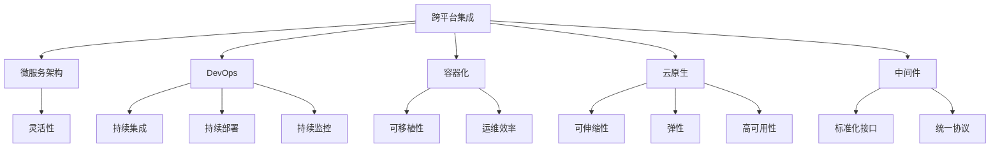

                 

# 自动化创业中的跨平台整合

> 关键词：自动化创业, 跨平台, 集成, 微服务架构, DevOps, 容器化, 云原生, 中间件

## 1. 背景介绍

### 1.1 问题由来
在当下快速变化和竞争激烈的市场环境中，自动化创业公司面临着如何高效整合内部和外部资源、快速响应市场需求、确保系统稳定性和安全性等诸多挑战。跨平台整合作为自动化创业中的一个重要环节，能够有效提升资源利用效率，降低开发和运维成本，增强系统灵活性和扩展性。因此，本文将探讨在自动化创业中如何进行跨平台整合，并详细介绍具体的技术和实施方案。

### 1.2 问题核心关键点
跨平台整合的核心在于如何确保不同平台之间的数据、服务和系统能够无缝集成，从而实现资源共享、功能协同。具体来说，包括以下几个关键点：
1. 数据集成：实现不同平台间的数据同步、共享和交换。
2. 服务集成：实现不同平台间的服务调用、协同和互操作。
3. 系统集成：实现不同平台间的系统接口、协议和规范的统一。
4. 安全集成：确保跨平台集成过程中数据和系统的安全性和合规性。
5. 持续集成：通过DevOps工具链，实现自动化部署和运维，提升集成效率和质量。

### 1.3 问题研究意义
跨平台整合技术在自动化创业中具有重要的战略意义：
1. 提升资源利用效率：整合不同平台的数据、服务和系统，实现资源共享，避免资源浪费。
2. 降低开发和运维成本：通过标准化和自动化，减少重复开发和运维工作，提升工作效率。
3. 增强系统灵活性和扩展性：跨平台整合能够快速响应市场需求变化，增强系统适应性。
4. 确保系统稳定性和安全性：通过标准化接口和协议，确保不同平台之间的互操作性和安全性。
5. 促进业务流程自动化：通过数据和服务的整合，推动业务流程自动化，提升业务效率和客户满意度。

## 2. 核心概念与联系

### 2.1 核心概念概述

为了更好地理解跨平台整合的原理和架构，本节将介绍几个关键概念及其之间的关系：

- 跨平台集成(Cross-Platform Integration)：指将不同平台间的系统、数据和服务进行有效整合，实现资源共享和协同。
- 微服务架构(Microservices Architecture)：通过将系统分解为多个独立的微服务，提升系统的灵活性和可扩展性。
- DevOps：一种将软件开发与运维紧密结合的文化和实践，实现持续集成(CI)、持续部署(CD)和持续监控。
- 容器化(Containerization)：使用容器技术实现应用的封装和隔离，提升系统的可移植性和运维效率。
- 云原生(Cloud Native)：基于云平台架构，实现服务的可伸缩性、弹性和高可用性。
- 中间件(Middleware)：用于连接不同平台之间的数据和服务，提供统一接口和协议的标准化。

这些概念之间的关系可以通过以下Mermaid流程图来展示：



这个流程图展示了跨平台整合的各个核心概念及其之间的关系：

1. 跨平台集成是整个架构的基础，通过微服务架构、DevOps、容器化、云原生和中间件等技术实现。
2. 微服务架构提升了系统的灵活性和可扩展性。
3. DevOps确保了持续集成、持续部署和持续监控，提升了开发和运维效率。
4. 容器化和云原生技术提升了系统的可移植性和高可用性。
5. 中间件提供了标准化接口和统一协议，确保不同平台之间的互操作性。

这些概念共同构成了跨平台整合的技术框架，为自动化创业提供坚实的技术支撑。

## 3. 核心算法原理 & 具体操作步骤
### 3.1 算法原理概述

跨平台整合的本质是通过标准化和自动化技术，将不同平台间的系统、数据和服务进行无缝集成。其核心原理可以概括为以下几点：

1. 统一数据模型：确保不同平台使用统一的数据模型和格式，避免数据格式不兼容问题。
2. 标准化接口和协议：定义标准化的API和通信协议，确保不同平台之间的服务调用和数据交换能够顺利进行。
3. 自动化集成工具：使用自动化工具和框架，实现集成过程的自动化和高效化。
4. 安全与合规性：在集成过程中，确保数据和系统的安全性和合规性，遵循相关法律法规和行业标准。

### 3.2 算法步骤详解

以下是跨平台整合的详细步骤：

**Step 1: 需求分析与规划**
- 明确跨平台整合的目标和需求，包括数据集成、服务集成、系统集成、安全集成和持续集成等方面。
- 制定详细的整合计划，包括时间表、资源分配和风险管理等。

**Step 2: 数据集成**
- 定义统一的数据模型和格式，确保不同平台的数据能够互操作。
- 使用中间件技术，实现数据的同步、共享和交换。
- 引入数据清洗和转换工具，处理数据格式不兼容和数据质量问题。

**Step 3: 服务集成**
- 定义标准化的API和通信协议，确保不同平台之间的服务调用和数据交换。
- 使用API网关和消息队列技术，实现服务的集成和协同。
- 引入服务注册和发现机制，自动发现和调用服务。

**Step 4: 系统集成**
- 定义统一的系统接口和协议，确保不同平台之间的系统互操作性。
- 使用中间件技术，实现系统的接口标准化和协议统一。
- 引入微服务架构，提升系统的灵活性和可扩展性。

**Step 5: 安全集成**
- 采用加密技术、认证和授权机制，确保数据和系统的安全性和隐私保护。
- 遵循相关法律法规和行业标准，确保数据和系统的合规性。
- 引入自动化安全检测工具，及时发现和修复安全漏洞。

**Step 6: 持续集成**
- 使用DevOps工具链，实现自动化部署和运维。
- 引入容器化和云原生技术，提升系统的可移植性和高可用性。
- 引入持续监控和自动化报警机制，及时发现和解决问题。

### 3.3 算法优缺点

跨平台整合的优势在于：
1. 提升资源利用效率：整合不同平台的数据、服务和系统，实现资源共享，避免资源浪费。
2. 降低开发和运维成本：通过标准化和自动化，减少重复开发和运维工作，提升工作效率。
3. 增强系统灵活性和扩展性：跨平台整合能够快速响应市场需求变化，增强系统适应性。
4. 确保系统稳定性和安全性：通过标准化接口和协议，确保不同平台之间的互操作性和安全性。

然而，跨平台整合也存在一些缺点：
1. 技术复杂度高：跨平台整合涉及多种技术和工具，技术栈复杂。
2. 实施成本高：跨平台整合需要大量的时间和资金投入。
3. 风险和挑战：跨平台集成过程中可能会面临数据格式不兼容、服务调用失败、安全漏洞等问题。

### 3.4 算法应用领域

跨平台整合技术广泛应用于自动化创业中的各个领域，具体包括：

1. 企业内部系统的整合：实现企业内部不同部门、不同系统的数据共享和协同，提升企业的运营效率。
2. 第三方API集成：通过标准化API和通信协议，与第三方服务进行集成，实现功能的扩展和增强。
3. 云服务集成：与云服务提供商进行集成，实现数据的存储、计算和分析。
4. 数据平台集成：将大数据平台与企业内部系统进行集成，实现数据的统一管理和分析。
5. 应用平台集成：将不同应用平台进行集成，实现功能的互补和扩展。

## 4. 数学模型和公式 & 详细讲解 & 举例说明

### 4.1 数学模型构建

为了更好地理解跨平台整合的原理，本节将使用数学语言对跨平台整合模型进行更加严格的刻画。

假设跨平台整合的目标是整合两个平台A和B的数据、服务和系统，定义数据集成函数为 $F_{\text{data}}$，服务集成函数为 $F_{\text{service}}$，系统集成函数为 $F_{\text{system}}$，安全集成函数为 $F_{\text{security}}$，持续集成函数为 $F_{\text{continuous}}$。

跨平台整合的数学模型可以表示为：

$$
F_{\text{integrated}} = F_{\text{data}} \circ F_{\text{service}} \circ F_{\text{system}} \circ F_{\text{security}} \circ F_{\text{continuous}}
$$

其中 $\circ$ 表示函数之间的复合操作。

### 4.2 公式推导过程

以下我们以数据集成为例，推导数据集成函数 $F_{\text{data}}$ 的数学表达式。

假设平台A和B的数据源为 $D_A$ 和 $D_B$，数据集成函数 $F_{\text{data}}$ 的输入为 $D_A$ 和 $D_B$，输出为 $D_{\text{integrated}}$，则数据集成的数学表达式可以表示为：

$$
D_{\text{integrated}} = F_{\text{data}}(D_A, D_B)
$$

其中 $D_{\text{integrated}}$ 表示整合后的数据集，$D_A$ 和 $D_B$ 分别表示平台A和B的数据源。

在实际应用中，数据集成函数 $F_{\text{data}}$ 可以通过以下步骤实现：

1. 定义统一的数据模型和格式，确保不同平台的数据能够互操作。
2. 使用中间件技术，实现数据的同步、共享和交换。
3. 引入数据清洗和转换工具，处理数据格式不兼容和数据质量问题。

### 4.3 案例分析与讲解

假设一个自动化创业公司需要整合其内部IT系统和第三方金融服务系统的数据，以便进行实时分析和决策支持。以下是数据集成的具体实现步骤：

**Step 1: 定义统一的数据模型和格式**
- 定义统一的数据模型，确保IT系统和金融服务系统的数据能够互操作。
- 定义统一的数据格式，确保不同平台的数据格式一致。

**Step 2: 使用中间件技术**
- 引入中间件技术，实现IT系统和金融服务系统数据的同步和共享。
- 使用消息队列技术，实现数据的消息传递和交换。

**Step 3: 引入数据清洗和转换工具**
- 引入数据清洗和转换工具，处理数据格式不兼容和数据质量问题。
- 清洗和转换数据，确保数据的完整性和一致性。

通过上述步骤，实现IT系统和金融服务系统的数据集成，为实时分析和决策支持提供数据支持。

## 5. 项目实践：代码实例和详细解释说明

### 5.1 开发环境搭建

在进行跨平台整合实践前，我们需要准备好开发环境。以下是使用Python进行Flask开发的环境配置流程：

1. 安装Anaconda：从官网下载并安装Anaconda，用于创建独立的Python环境。

2. 创建并激活虚拟环境：
```bash
conda create -n flask-env python=3.8 
conda activate flask-env
```

3. 安装Flask：
```bash
pip install flask
```

4. 安装Flask-RESTful：
```bash
pip install flask-restful
```

5. 安装Flask-SQLAlchemy：
```bash
pip install flask-sqlalchemy
```

完成上述步骤后，即可在`flask-env`环境中开始跨平台整合实践。

### 5.2 源代码详细实现

这里我们以跨平台数据集成为例，给出使用Flask框架实现数据集成的PyTorch代码实现。

首先，定义数据集成函数：

```python
from flask import Flask, request
from flask_sqlalchemy import SQLAlchemy
from sqlalchemy import create_engine
from sqlalchemy.orm import sessionmaker

app = Flask(__name__)
app.config['SQLALCHEMY_DATABASE_URI'] = 'sqlite:///integrated.db'
db = SQLAlchemy(app)
engine = create_engine(app.config['SQLALCHEMY_DATABASE_URI'])
Session = sessionmaker(bind=engine)
session = Session()

class DataIntegration(db.Model):
    id = db.Column(db.Integer, primary_key=True)
    platform = db.Column(db.String(255))
    data = db.Column(db.String(255))

    def __init__(self, platform, data):
        self.platform = platform
        self.data = data

@app.route('/integrate', methods=['POST'])
def integrate():
    data = request.json
    platform = data['platform']
    data = data['data']
    
    # 创建数据集成记录
    integration = DataIntegration(platform, data)
    session.add(integration)
    session.commit()
    
    return {'message': 'Data integrated successfully'}, 200
```

然后，定义数据源和集成逻辑：

```python
# 定义数据源
it_system_data = {
    'platform': 'IT System',
    'data': 'Sample IT system data'
}

financial_service_data = {
    'platform': 'Financial Service',
    'data': 'Sample financial service data'
}

# 将数据源集成到数据库
data_integration = DataIntegration('IT System', it_system_data)
session.add(data_integration)
session.commit()

data_integration = DataIntegration('Financial Service', financial_service_data)
session.add(data_integration)
session.commit()

# 查询数据库中的数据集成记录
all_data = session.query(DataIntegration).all()

for integration in all_data:
    print(f'Platform: {integration.platform}, Data: {integration.data}')
```

最后，启动Flask应用并集成数据：

```python
if __name__ == '__main__':
    app.run(debug=True)
```

以上就是使用Flask框架实现跨平台数据集成的完整代码实现。可以看到，通过定义数据源和集成函数，Flask能够实现数据的统一管理和跨平台集成。

### 5.3 代码解读与分析

让我们再详细解读一下关键代码的实现细节：

**Flask应用配置**
- 使用SQLite作为数据库，定义数据库连接URI。
- 使用Flask-SQLAlchemy扩展，简化数据库操作。

**数据集成函数**
- 定义数据集成函数 `integrate`，接收POST请求的数据源。
- 创建数据集成记录，保存到数据库。
- 返回集成成功的消息。

**数据源和集成逻辑**
- 定义IT系统和金融服务系统的数据源。
- 通过Flask应用集成数据到数据库。
- 查询数据库中的数据集成记录，输出集成结果。

通过Flask框架，开发者能够快速实现跨平台数据集成的功能，并灵活地扩展和优化。

## 6. 实际应用场景

### 6.1 企业内部系统的整合

在自动化创业公司中，企业内部系统的整合是一个重要的应用场景。通过跨平台整合，实现不同部门、不同系统之间的数据共享和协同，可以提升企业的运营效率和决策支持能力。

例如，一个自动化创业公司可以使用跨平台整合技术，将企业内部的人力资源系统、财务系统、销售系统和客户关系管理系统进行整合，实现数据的统一管理和分析。通过统一的数据模型和格式，使用中间件技术进行数据同步和共享，引入数据清洗和转换工具处理数据格式不兼容和数据质量问题，最终实现企业内部系统的无缝集成。

### 6.2 第三方API集成

第三方API集成是跨平台整合的另一个重要应用场景。通过标准化API和通信协议，与第三方服务进行集成，可以扩展和增强企业的功能和能力。

例如，一个自动化创业公司可以使用跨平台整合技术，将企业内部系统与第三方金融服务系统、支付系统、物流系统进行集成，实现数据的统一管理和分析。通过定义标准化的API和通信协议，使用API网关和消息队列技术进行服务的集成和协同，引入服务注册和发现机制自动发现和调用服务，最终实现第三方API的无缝集成。

### 6.3 云服务集成

云服务集成是跨平台整合的重要应用场景之一。通过与云服务提供商进行集成，可以实现数据的存储、计算和分析，提升企业的云服务能力。

例如，一个自动化创业公司可以使用跨平台整合技术，将企业内部系统与AWS、Google Cloud、Microsoft Azure等云服务提供商进行集成，实现数据的存储和分析。通过定义标准化的API和通信协议，使用云服务集成工具进行服务的集成和协同，引入云服务管理和监控工具，提升云服务的自动化和安全性，最终实现云服务的无缝集成。

### 6.4 数据平台集成

数据平台集成是跨平台整合的重要应用场景之一。通过将大数据平台与企业内部系统进行集成，可以实现数据的统一管理和分析，提升企业的数据驱动能力。

例如，一个自动化创业公司可以使用跨平台整合技术，将企业内部系统与Hadoop、Spark、Flink等大数据平台进行集成，实现数据的存储和分析。通过定义标准化的API和通信协议，使用中间件技术进行系统的集成和协同，引入数据清洗和转换工具处理数据格式不兼容和数据质量问题，最终实现数据平台的无缝集成。

## 7. 工具和资源推荐

### 7.1 学习资源推荐

为了帮助开发者系统掌握跨平台整合的理论基础和实践技巧，这里推荐一些优质的学习资源：

1. 《跨平台整合技术实战指南》系列博文：由技术专家撰写，深入浅出地介绍了跨平台整合的原理、技术和应用场景。

2. 《微服务架构设计与实现》课程：由知名IT培训机构开设，系统讲解微服务架构的设计和实现方法，涵盖跨平台整合技术。

3. 《DevOps实践指南》书籍：DevOps领域的经典书籍，全面介绍了DevOps文化的核心思想和实践方法，包括跨平台整合技术。

4. 《云原生微服务架构》书籍：讲解云原生微服务架构的设计和实现，涵盖跨平台整合技术。

5. 《中间件技术与应用》课程：介绍中间件技术的基本概念和应用，帮助开发者掌握跨平台整合的核心技术。

通过对这些资源的学习实践，相信你一定能够快速掌握跨平台整合的精髓，并用于解决实际的自动化创业问题。

### 7.2 开发工具推荐

高效的开发离不开优秀的工具支持。以下是几款用于跨平台整合开发的常用工具：

1. Flask：基于Python的开源Web框架，轻量级、易于上手，适合快速开发API接口和微服务。

2. Flask-RESTful：基于Flask的RESTful风格API开发扩展，提供强大的路由和资源管理功能。

3. Flask-SQLAlchemy：基于SQLAlchemy的ORM框架，简化数据库操作，提供对象关系映射功能。

4. Apache Kafka：高吞吐量的分布式消息队列，适合跨平台数据集成和微服务调用。

5. Docker：基于容器技术的轻量级应用打包和部署工具，提升系统的可移植性和运维效率。

6. Kubernetes：基于容器技术的容器编排工具，提供服务自动发现、负载均衡和故障恢复等功能。

合理利用这些工具，可以显著提升跨平台整合任务的开发效率，加快创新迭代的步伐。

### 7.3 相关论文推荐

跨平台整合技术的发展源于学界的持续研究。以下是几篇奠基性的相关论文，推荐阅读：

1. Web Services Architecture: A Compendium（W3C推荐标准）：介绍了Web服务架构的基本概念和设计原则，涵盖跨平台整合技术。

2. Microservices Patterns: Architecture Variants for Microservices（O'Reilly Books）：讲解微服务架构的设计和实现方法，涵盖跨平台整合技术。

3. Eureka: A Resilient Microservices Coordination Service for Cloud Environments（PUBS）：介绍Eureka服务发现和注册机制，帮助开发者实现微服务的跨平台集成。

4. Kubernetes: Deploying Distributed Systems Reliably（Kubernetes文档）：讲解Kubernetes容器编排工具的实现原理和应用场景，涵盖跨平台整合技术。

5. Kafka: The Real-time Data Streaming Platform（Kafka文档）：介绍Kafka消息队列技术的实现原理和应用场景，涵盖跨平台数据集成和微服务调用。

这些论文代表了大规模分布式系统中的跨平台整合技术的最新进展，通过学习这些前沿成果，可以帮助研究者把握学科前进方向，激发更多的创新灵感。

## 8. 总结：未来发展趋势与挑战

### 8.1 总结

本文对跨平台整合技术进行了全面系统的介绍。首先阐述了跨平台整合的背景和意义，明确了跨平台整合在自动化创业中的重要价值。其次，从原理到实践，详细讲解了跨平台整合的数学原理和关键步骤，给出了跨平台整合任务开发的完整代码实例。同时，本文还广泛探讨了跨平台整合技术在企业内部系统、第三方API、云服务、数据平台等领域的实际应用场景，展示了跨平台整合范式的广阔前景。此外，本文精选了跨平台整合技术的各类学习资源，力求为读者提供全方位的技术指引。

通过本文的系统梳理，可以看到，跨平台整合技术在自动化创业中具有重要的战略意义，能够有效提升资源利用效率，降低开发和运维成本，增强系统灵活性和扩展性，确保系统稳定性和安全性。未来，随着跨平台整合技术的不断发展，相信其在自动化创业中的应用前景将更加广阔，为企业的数字化转型升级提供新的技术路径。

### 8.2 未来发展趋势

展望未来，跨平台整合技术将呈现以下几个发展趋势：

1. 微服务架构的广泛应用：微服务架构将得到更广泛的应用，实现系统的模块化和微服务化，提升系统的灵活性和可扩展性。

2. DevOps实践的深入推进：DevOps文化将得到更深入的推进，实现持续集成、持续部署和持续监控，提升开发和运维效率。

3. 容器化和云原生技术的普及：容器化和云原生技术将得到更广泛的应用，提升系统的可移植性和高可用性。

4. 中间件技术的持续发展：中间件技术将得到更持续的发展，提供标准化接口和统一协议，实现不同平台之间的互操作性。

5. 数据驱动的跨平台整合：通过数据驱动的方式，实现跨平台整合的智能化和自动化，提升系统决策支持能力。

6. 人工智能与跨平台整合的结合：人工智能技术将与跨平台整合进行深度结合，提升系统的智能化和自动化水平。

以上趋势凸显了跨平台整合技术的广阔前景。这些方向的探索发展，必将进一步提升自动化创业系统的性能和应用范围，为企业的数字化转型升级提供新的技术路径。

### 8.3 面临的挑战

尽管跨平台整合技术已经取得了显著进展，但在迈向更加智能化、普适化应用的过程中，仍面临诸多挑战：

1. 技术复杂度高：跨平台整合涉及多种技术和工具，技术栈复杂，实施难度大。

2. 实施成本高：跨平台整合需要大量的时间和资金投入，对企业的资源配置和预算管理提出挑战。

3. 数据质量问题：数据格式不兼容、数据质量问题、数据孤岛等，是跨平台整合面临的主要挑战。

4. 系统兼容性问题：不同平台之间的系统接口和协议不一致，导致系统兼容性问题。

5. 安全与合规性问题：跨平台整合过程中，需要确保数据和系统的安全性和合规性，遵循相关法律法规和行业标准。

6. 持续集成与运维问题：跨平台整合需要持续集成和运维，提升开发和运维效率，确保系统稳定性和安全性。

7. 技术演进速度：跨平台整合技术需要不断更新和演进，跟上技术发展的步伐。

正视跨平台整合面临的这些挑战，积极应对并寻求突破，将是大规模分布式系统走向成熟的必由之路。相信随着学界和产业界的共同努力，这些挑战终将一一被克服，跨平台整合技术必将在自动化创业中发挥更大的作用。

### 8.4 研究展望

面对跨平台整合技术面临的挑战，未来的研究需要在以下几个方面寻求新的突破：

1. 探索标准化数据模型和格式：通过标准化数据模型和格式，确保不同平台的数据能够互操作。

2. 引入数据清洗和转换工具：引入数据清洗和转换工具，处理数据格式不兼容和数据质量问题，提升数据质量。

3. 引入数据驱动的跨平台整合：通过数据驱动的方式，实现跨平台整合的智能化和自动化，提升系统决策支持能力。

4. 引入人工智能技术：将人工智能技术与跨平台整合进行深度结合，提升系统的智能化和自动化水平。

5. 引入云计算和容器技术：引入云计算和容器技术，提升系统的可移植性和高可用性。

6. 引入安全与合规性技术：引入安全与合规性技术，确保数据和系统的安全性和合规性。

7. 引入持续集成和运维工具：引入持续集成和运维工具，提升开发和运维效率，确保系统稳定性和安全性。

这些研究方向的探索，必将引领跨平台整合技术迈向更高的台阶，为企业的数字化转型升级提供新的技术路径。面向未来，跨平台整合技术还需要与其他人工智能技术进行更深入的融合，如知识表示、因果推理、强化学习等，多路径协同发力，共同推动自动化创业系统的进步。

## 9. 附录：常见问题与解答

**Q1：跨平台整合如何确保数据和系统的安全性和合规性？**

A: 跨平台整合过程中，需要引入安全与合规性技术，确保数据和系统的安全性和合规性。具体措施包括：

1. 加密技术：使用加密技术对数据进行加密传输和存储，确保数据的安全性。
2. 认证和授权机制：引入认证和授权机制，对数据和系统进行身份验证和权限控制，确保系统的安全性。
3. 遵循法律法规和行业标准：遵循相关的法律法规和行业标准，确保数据和系统的合规性。
4. 自动化安全检测：引入自动化安全检测工具，及时发现和修复安全漏洞，确保系统的安全性。
5. 安全审计和监控：引入安全审计和监控工具，对数据和系统的安全性和合规性进行持续监控，及时发现和解决问题。

通过这些措施，可以确保跨平台整合过程中的数据和系统的安全性和合规性。

**Q2：跨平台整合过程中如何处理数据格式不兼容和数据质量问题？**

A: 跨平台整合过程中，数据格式不兼容和数据质量问题是常见问题。处理这些问题的方法包括：

1. 引入数据清洗和转换工具：使用数据清洗和转换工具，处理数据格式不兼容和数据质量问题。
2. 定义统一的数据模型和格式：定义统一的数据模型和格式，确保不同平台的数据能够互操作。
3. 引入数据集成中间件：使用数据集成中间件，实现数据的同步、共享和交换，处理数据格式不兼容问题。
4. 引入数据质量管理工具：引入数据质量管理工具，对数据进行检测和校验，提升数据质量。
5. 引入数据治理工具：引入数据治理工具，对数据进行管理和维护，确保数据质量和一致性。

通过这些方法，可以处理跨平台整合过程中数据格式不兼容和数据质量问题，提升数据集成效率和质量。

**Q3：跨平台整合过程中如何实现系统的模块化和微服务化？**

A: 跨平台整合过程中，实现系统的模块化和微服务化可以提升系统的灵活性和可扩展性。具体方法包括：

1. 引入微服务架构：引入微服务架构，将系统分解为多个独立的微服务，提升系统的灵活性和可扩展性。
2. 定义标准化的API和通信协议：定义标准化的API和通信协议，实现微服务的集成和协同。
3. 使用中间件技术：使用中间件技术，实现微服务的接口标准化和协议统一，确保微服务的互操作性。
4. 引入容器化和云原生技术：引入容器化和云原生技术，提升微服务的可移植性和高可用性。
5. 引入微服务治理工具：引入微服务治理工具，对微服务进行管理和维护，确保微服务的稳定性和安全性。

通过这些方法，可以实现系统的模块化和微服务化，提升系统的灵活性和可扩展性。

**Q4：跨平台整合过程中如何实现持续集成和持续部署？**

A: 跨平台整合过程中，实现持续集成和持续部署可以提升开发和运维效率，确保系统稳定性和安全性。具体方法包括：

1. 引入DevOps工具链：引入DevOps工具链，实现持续集成和持续部署。
2. 使用容器化和云原生技术：使用容器化和云原生技术，提升系统的可移植性和高可用性。
3. 引入持续监控和自动化报警机制：引入持续监控和自动化报警机制，及时发现和解决问题。
4. 引入自动化测试工具：引入自动化测试工具，提升测试效率和质量。
5. 引入自动化部署工具：引入自动化部署工具，提升部署效率和质量。

通过这些方法，可以实现持续集成和持续部署，提升开发和运维效率，确保系统稳定性和安全性。

**Q5：跨平台整合过程中如何处理系统兼容性问题？**

A: 跨平台整合过程中，系统兼容性问题是常见问题。处理这些问题的方法包括：

1. 引入标准化的API和通信协议：定义标准化的API和通信协议，确保不同平台之间的系统互操作性。
2. 引入微服务架构：引入微服务架构，将系统分解为多个独立的微服务，提升系统的灵活性和可扩展性。
3. 使用中间件技术：使用中间件技术，实现不同平台之间的系统接口标准化和协议统一。
4. 引入容器化和云原生技术：引入容器化和云原生技术，提升系统的可移植性和高可用性。
5. 引入系统治理工具：引入系统治理工具，对系统进行管理和维护，确保系统的稳定性和安全性。

通过这些方法，可以处理跨平台整合过程中系统兼容性问题，确保系统的互操作性和稳定性。

---

作者：禅与计算机程序设计艺术 / Zen and the Art of Computer Programming

