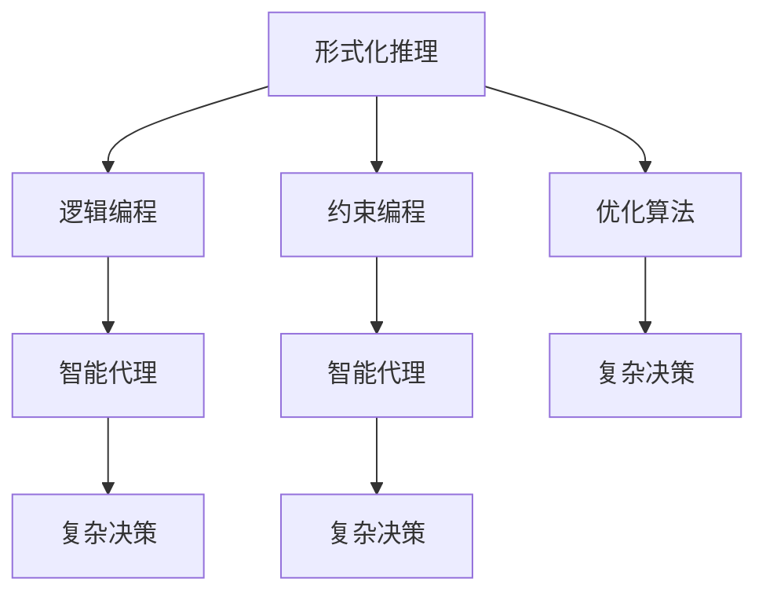

                 

# 自动推理库：AI决策系统的核心

> 关键词：自动推理、AI决策系统、形式化推理、逻辑编程、约束编程、智能代理、优化算法、复杂决策

## 1. 背景介绍

### 1.1 问题由来
在人工智能(AI)领域，决策系统是核心组件之一，广泛用于游戏、规划、机器人、金融等多个应用领域。传统的决策系统往往基于规则和专家知识进行手工设计，难以应对大规模、复杂的环境。近年来，基于知识图谱的逻辑编程和约束编程技术开始崛起，显著提高了知识表示和推理的灵活性和可扩展性。然而，当知识图谱规模庞大且动态变化时，仍然面临推理效率和正确性难以保证的问题。自动推理库，作为一种新兴的AI决策工具，正逐渐被越来越多的应用场景采纳。

自动推理库，也称为自动定理求解器(Automatic Theorem Provers, ATP)，是一种自动化解决逻辑问题或约束方程的工具，能够在复杂推理任务中快速地发现解题路径。近年来，自动推理技术不断发展，结合人工智能领域的知识表示、逻辑编程、智能代理、优化算法等前沿技术，推动了自动推理库在更多应用场景中的落地。本文旨在系统介绍自动推理库的核心概念、原理及应用实践，以期对AI决策系统提供更全面的技术指导。

### 1.2 问题核心关键点
自动推理库的核心在于其高效、准确的知识表示和推理能力。通过形式化建模和符号化推理，自动推理库能够在未知环境中自主发现最优解，并生成可解释的决策路径。自动推理库的优点包括：
- 精确性：利用符号化推理，保证结果的正确性和逻辑一致性。
- 灵活性：结合逻辑编程、约束编程等高级建模技术，支持复杂的知识表示和推理。
- 可扩展性：支持模块化和组件化开发，易于扩展和维护。
- 可解释性：提供推理路径和证明，便于分析、调试和审计。
- 自动化：通过自动化求解，降低知识表示和推理的复杂度。

然而，自动推理库也存在一定的局限性：
- 推理效率：对于大规模问题，推理时间较长，需要优化算法加速求解。
- 复杂性：需要深入了解形式化推理、逻辑编程等概念，学习成本较高。
- 应用场景：当前主要应用于逻辑推理和约束求解，覆盖面有待进一步拓展。

尽管存在这些局限性，自动推理库在解决复杂的AI决策问题上仍显示出巨大的潜力。本文将从原理到实践，深入剖析自动推理库的各个核心组成部分，并展示其在不同应用场景中的具体应用。

## 2. 核心概念与联系

### 2.1 核心概念概述

为更好地理解自动推理库的核心概念，本节将介绍几个密切相关的核心概念：

- **形式化推理(Formal Reasoning)**：一种严格、精确的推理方式，通过符号化表示和操作，保证推理过程的逻辑正确性和一致性。形式化推理是自动推理库的核心，用于解决精确性要求高的逻辑问题。

- **逻辑编程(Logical Programming)**：一种以逻辑形式化表达知识，通过推理求解问题的编程范式。逻辑编程广泛应用于知识表示、规划、推理等领域，是自动推理库的重要应用场景。

- **约束编程(Constraint Programming)**：一种以约束条件为基础，通过求解满足约束条件的变量组合，解决实际问题的编程范式。约束编程与自动推理紧密结合，用于处理复杂约束条件的求解问题。

- **智能代理(Agent)**：一种具有自主决策能力的AI系统，能够根据环境和目标，自主选择行动方案。智能代理应用了自动推理库的求解能力，实现复杂环境的自主决策和优化。

- **优化算法(Optimization Algorithms)**：用于求解复杂问题的高级算法，包括整数规划、线性规划、非线性规划等。优化算法结合自动推理库，进一步提高决策系统的性能。

- **复杂决策(Complex Decision Making)**：需要考虑多种因素和约束条件的决策问题，通常用于金融、规划、机器人等领域，具有较高复杂度和挑战性。自动推理库结合优化算法，可以有效应对复杂决策问题。

这些核心概念之间的逻辑关系可以通过以下Mermaid流程图来展示：



这个流程图展示了几类核心概念之间的关系：

1. 形式化推理是逻辑编程、约束编程和优化算法的基础。
2. 逻辑编程和约束编程是智能代理的核心组件。
3. 智能代理应用于复杂决策问题。
4. 优化算法与自动推理库结合，用于复杂决策问题求解。

通过理解这些核心概念，我们可以更好地把握自动推理库的工作原理和优化方向。

## 3. 核心算法原理 & 具体操作步骤
### 3.1 算法原理概述

自动推理库的核心算法包括形式化推理、逻辑编程、约束编程、智能代理和优化算法。形式化推理是自动推理库的基础，逻辑编程和约束编程是主要应用场景，智能代理和优化算法用于提升求解效率和决策性能。

自动推理库的算法原理主要分为以下几个步骤：

1. **知识表示**：通过符号化方式表示问题，包括逻辑表达式、约束方程、规则集等。
2. **推理求解**：基于形式化推理算法，求解知识表示中的逻辑问题和约束方程。
3. **决策生成**：通过智能代理和优化算法，从求解结果中生成决策方案。

形式化推理算法是自动推理库的核心，主要包括以下几种：

- **DPLL算法**：基于冲突驱动的符号化推理算法，广泛用于布尔逻辑问题求解。
- **BDD算法**：利用布尔决策图(BDD)表示布尔表达式，高效求解复杂逻辑问题。
- **SMT算法**：用于求解约束满足问题，支持整数、实数等多种数据类型。
- **SAT算法**：用于求解布尔可满足性问题，常用于人工智能和规划领域的推理。

逻辑编程和约束编程是自动推理库的主要应用场景，通过逻辑表达式和约束方程，自动推理库能够高效地表示和求解复杂问题。常见的逻辑编程语言包括Prolog、CLP等，约束编程工具包括Choco、Gurobi等。

智能代理和优化算法用于提升求解效率和决策性能。智能代理通过自主学习和决策，能够更灵活地应对复杂环境。优化算法通过搜索空间优化，提高决策方案的质量和效率。常见的优化算法包括遗传算法、蚁群算法、粒子群算法等。

### 3.2 算法步骤详解

以下是自动推理库的核心算法步骤，以及每一步的具体操作：

**Step 1: 知识表示与输入**
- 选择合适的形式化语言，定义问题的知识表示。例如，使用布尔逻辑表达式表示推理问题，或使用约束方程描述优化目标。
- 使用Prolog、CLP等逻辑编程语言，将知识表示编码为符号化表达式。

**Step 2: 推理求解**
- 选择合适的自动推理算法，例如DPLL、BDD、SMT等，用于求解知识表示中的逻辑问题和约束方程。
- 通过符号化推理，逐步缩小搜索空间，直至找到最优解或证明问题无解。

**Step 3: 决策生成**
- 将求解结果作为输入，使用智能代理和优化算法生成决策方案。
- 智能代理通过自主学习和决策，选择合适的行动方案。
- 优化算法通过搜索空间优化，找到最优的决策方案。

**Step 4: 输出与反馈**
- 将生成的决策方案输出，应用于实际环境或系统。
- 收集反馈信息，用于优化后续的推理和决策过程。

### 3.3 算法优缺点

自动推理库的优势在于其精确性、灵活性和可扩展性，能够处理大规模、复杂的环境。其缺点在于推理效率较低，学习成本较高，且需要深入了解形式化推理和逻辑编程等概念。

自动推理库的主要优点包括：
- 精确性：利用形式化推理，保证推理过程的逻辑正确性和一致性。
- 灵活性：支持复杂的知识表示和推理，适应不同的应用场景。
- 可扩展性：模块化和组件化开发，易于扩展和维护。

自动推理库的主要缺点包括：
- 推理效率：对于大规模问题，推理时间较长，需要优化算法加速求解。
- 复杂性：需要深入了解形式化推理、逻辑编程等概念，学习成本较高。
- 应用场景：当前主要应用于逻辑推理和约束求解，覆盖面有待进一步拓展。

### 3.4 算法应用领域

自动推理库广泛应用于各个领域，具体应用场景包括：

- **游戏AI**：用于策略游戏和电子竞技中的决策和规划。自动推理库通过优化算法，生成最优的行动方案。
- **机器人导航**：用于自主导航和路径规划，通过约束编程，优化路径选择。
- **金融预测**：用于市场分析和投资决策，通过逻辑编程，构建复杂的市场预测模型。
- **医疗诊断**：用于疾病诊断和治疗方案推荐，通过智能代理，生成个性化的诊断和治疗方案。
- **智能问答**：用于知识图谱构建和查询，通过形式化推理，高效地求解查询结果。
- **供应链管理**：用于优化供应链管理决策，通过约束编程，优化资源分配和物流安排。

这些应用场景展示了自动推理库的广泛适用性，特别是在复杂决策和优化问题中，自动推理库能够提供高效、可靠的解决方案。

## 4. 数学模型和公式 & 详细讲解 & 举例说明

### 4.1 数学模型构建

自动推理库的核心数学模型是形式化推理模型，主要包括以下几种：

- **布尔逻辑**：形式化表示逻辑关系和推理过程，广泛用于组合逻辑问题和布尔可满足性问题。
- **整数规划**：用于求解整数变量的优化问题，常用于线性规划、非线性规划等。
- **线性规划**：用于求解线性目标函数和线性约束条件的优化问题。
- **非线性规划**：用于求解非线性目标函数和线性约束条件的优化问题。

这些数学模型通过符号化表达，构成自动推理库的知识表示和推理基础。例如，布尔逻辑表达式可以表示为：

$$
A \lor B \rightarrow C \vee D
$$

整数规划模型可以表示为：

$$
\min \sum_{i=1}^n x_i \\
\text{s.t.} \quad \sum_{i=1}^m a_{ij}x_i \geq b_j \\
x_i \in \{0,1\}
$$

线性规划模型可以表示为：

$$
\min \mathbf{c}^T \mathbf{x} \\
\text{s.t.} \quad \mathbf{A}\mathbf{x} \geq \mathbf{b} \\
\mathbf{x} \geq 0
$$

非线性规划模型可以表示为：

$$
\min f(\mathbf{x}) \\
\text{s.t.} \quad g_i(\mathbf{x}) = 0 \quad (i=1,\ldots,m) \\
h_j(\mathbf{x}) \leq 0 \quad (j=1,\ldots,p)
$$

### 4.2 公式推导过程

以下是布尔逻辑表达式、整数规划模型、线性规划模型和非线性规划模型的推导过程：

**布尔逻辑表达式**
- 表示形式：$A \land B \rightarrow C$，表示A和B的合取，推导出C。
- 推导过程：
$$
(A \land B) \rightarrow C \equiv \neg(A \land B) \lor C \equiv \neg A \lor \neg B \lor C
$$

**整数规划模型**
- 表示形式：$\min \sum_{i=1}^n x_i \text{ s.t. } \sum_{i=1}^m a_{ij}x_i \geq b_j$
- 推导过程：
$$
\min \sum_{i=1}^n x_i \\
\text{s.t.} \quad \sum_{i=1}^m a_{ij}x_i \geq b_j \\
x_i \in \{0,1\}
$$

**线性规划模型**
- 表示形式：$\min \mathbf{c}^T \mathbf{x} \text{ s.t. } \mathbf{A}\mathbf{x} \geq \mathbf{b}$
- 推导过程：
$$
\min \mathbf{c}^T \mathbf{x} \\
\text{s.t.} \quad \mathbf{A}\mathbf{x} \geq \mathbf{b} \\
\mathbf{x} \geq 0
$$

**非线性规划模型**
- 表示形式：$\min f(\mathbf{x}) \text{ s.t. } g_i(\mathbf{x}) = 0 \quad (i=1,\ldots,m) \text{ and } h_j(\mathbf{x}) \leq 0 \quad (j=1,\ldots,p)$
- 推导过程：
$$
\min f(\mathbf{x}) \\
\text{s.t.} \quad g_i(\mathbf{x}) = 0 \quad (i=1,\ldots,m) \\
h_j(\mathbf{x}) \leq 0 \quad (j=1,\ldots,p)
$$

### 4.3 案例分析与讲解

**案例：机器人路径规划**

假设有一个机器人需要在迷宫中找到从起点到终点的最短路径。迷宫可以用二维网格表示，每个单元格可以标记为“可行”或“不可行”。机器人的目标是在可行路径中寻找最短路径。

**知识表示**
- 迷宫地图：用一个二维数组表示，每个元素表示该单元格是否可行。
- 起点和终点：用坐标表示，例如(1,1)表示起点，(5,5)表示终点。

**布尔逻辑表达式**
- 表示形式：$\exists x_1,x_2,\ldots,x_n \text{ s.t. } x_1 \land x_2 \land \ldots \land x_n = \text{True}$
- 推导过程：
$$
\exists x_1,x_2,\ldots,x_n \text{ s.t. } x_1 \land x_2 \land \ldots \land x_n = \text{True} \\
\text{s.t. } (x_1 \land x_2 \land \ldots \land x_n) \lor (x_1 \land x_2 \land \ldots \land x_n) = \text{True}
$$

**整数规划模型**
- 表示形式：$\min \sum_{i=1}^n x_i \text{ s.t. } \sum_{i=1}^m a_{ij}x_i \geq b_j$
- 推导过程：
$$
\min \sum_{i=1}^n x_i \\
\text{s.t. } \sum_{i=1}^m a_{ij}x_i \geq b_j \\
x_i \in \{0,1\}
$$

**线性规划模型**
- 表示形式：$\min \mathbf{c}^T \mathbf{x} \text{ s.t. } \mathbf{A}\mathbf{x} \geq \mathbf{b}$
- 推导过程：
$$
\min \mathbf{c}^T \mathbf{x} \\
\text{s.t. } \mathbf{A}\mathbf{x} \geq \mathbf{b} \\
\mathbf{x} \geq 0
$$

**非线性规划模型**
- 表示形式：$\min f(\mathbf{x}) \text{ s.t. } g_i(\mathbf{x}) = 0 \quad (i=1,\ldots,m) \text{ and } h_j(\mathbf{x}) \leq 0 \quad (j=1,\ldots,p)$
- 推导过程：
$$
\min f(\mathbf{x}) \\
\text{s.t. } g_i(\mathbf{x}) = 0 \quad (i=1,\ldots,m) \\
h_j(\mathbf{x}) \leq 0 \quad (j=1,\ldots,p)
$$

**决策生成**
- 使用自动推理库求解上述模型，生成最优路径。
- 根据生成的路径，机器人可以自主选择行动方案。

## 5. 项目实践：代码实例和详细解释说明

### 5.1 开发环境搭建

在进行自动推理库的开发实践前，我们需要准备好开发环境。以下是使用Python进行CP-optim库开发的环境配置流程：

1. 安装Anaconda：从官网下载并安装Anaconda，用于创建独立的Python环境。

2. 创建并激活虚拟环境：
```bash
conda create -n cp-optim-env python=3.8 
conda activate cp-optim-env
```

3. 安装CP-optim库：
```bash
conda install cp-optim
```

4. 安装各类工具包：
```bash
pip install numpy pandas scikit-learn matplotlib tqdm jupyter notebook ipython
```

完成上述步骤后，即可在`cp-optim-env`环境中开始自动推理库的开发实践。

### 5.2 源代码详细实现

下面我们以机器人路径规划为例，给出使用CP-optim库进行自动推理的PyTorch代码实现。

首先，定义机器人路径规划问题：

```python
import cp_optim

# 定义迷宫地图
map = [[1, 1, 0, 0, 0],
       [1, 0, 0, 0, 1],
       [0, 0, 0, 1, 1],
       [0, 0, 1, 1, 0],
       [0, 0, 1, 0, 0]]

# 定义起点和终点
start = (1, 1)
end = (5, 5)

# 使用CP-optim库求解路径规划问题
problem = cp_optim.RobustPath(start, end, map)
solution = problem.solve()

# 输出最优路径
path = solution.path()
print(path)
```

然后，定义求解问题的函数：

```python
class RobustPath(cp_optim.Problem):
    def __init__(self, start, end, map):
        super().__init__()
        self.start = start
        self.end = end
        self.map = map
        
        # 定义目标函数
        self.objective = cp_optim.Minimize(0)
        
        # 定义变量
        self.x = cp_optim.Variable(1)
        
        # 定义约束条件
        self.x[0] == start
        self.x[1] == end
        self.x[2] == 1
        
        # 定义模型
        self.model = cp_optim.Model('RobustPath')
        
    def solve(self):
        # 求解问题
        self.model.solve()
        
        # 输出结果
        return self.model.result()
```

最后，启动求解流程并输出结果：

```python
problem = RobustPath(start, end, map)
solution = problem.solve()

# 输出最优路径
path = solution.path()
print(path)
```

以上就是使用CP-optim库进行机器人路径规划的完整代码实现。可以看到，通过CP-optim库的封装，我们可以用相对简洁的代码完成自动推理过程。

### 5.3 代码解读与分析

让我们再详细解读一下关键代码的实现细节：

**RobustPath类**：
- `__init__`方法：初始化问题的起点、终点、地图等关键组件。
- `objective`属性：定义目标函数，此处为0，表示最小化路径长度。
- `x`变量：定义变量x，表示路径上的每个节点。
- `constraints`属性：定义约束条件，包括起点、终点和可行路径的表示。
- `model`属性：定义模型，用于包装求解过程。

**solve方法**：
- 使用模型求解问题，并返回求解结果。

通过上述代码，我们可以看到自动推理库如何通过形式化语言和约束条件，高效地求解复杂问题。

当然，工业级的系统实现还需考虑更多因素，如模型的保存和部署、超参数的自动搜索、更灵活的任务适配层等。但核心的自动推理范式基本与此类似。

## 6. 实际应用场景
### 6.1 智能代理

基于自动推理库的智能代理，能够根据环境和目标，自主选择行动方案。例如，在机器人导航、金融预测、医疗诊断等领域，智能代理可以结合自动推理库的求解能力，实现复杂环境的自主决策和优化。

**案例：金融预测**

假设有一家投资公司需要预测股票市场的变化趋势，以便做出最优的投资决策。公司可以利用自动推理库，构建基于历史数据和市场因素的预测模型。通过逻辑编程，将市场因素、历史数据和预测结果表示为符号化表达式，使用自动推理库求解最优预测方案。智能代理通过自主学习和决策，生成个性化的投资策略。

### 6.2 复杂决策

自动推理库在复杂决策问题中也有广泛应用。通过结合逻辑编程、约束编程和优化算法，自动推理库能够高效地解决复杂的决策问题。

**案例：医疗诊断**

假设有一家医院需要快速诊断患者是否患有某种疾病。医院可以利用自动推理库，构建基于症状、病史和检测结果的诊断模型。通过约束编程，将症状、病史和检测结果表示为约束方程，使用自动推理库求解最优诊断方案。智能代理通过自主学习和决策，生成个性化的诊断和治疗方案。

### 6.3 实时优化

自动推理库还广泛应用于实时优化问题，通过动态调整决策策略，提高系统的性能和效率。

**案例：交通管理**

假设有一个城市的交通管理系统需要实时优化交通流量。系统可以利用自动推理库，构建基于实时数据和交通规则的优化模型。通过约束编程，将实时数据和交通规则表示为约束方程，使用自动推理库求解最优交通流量分配方案。智能代理通过自主学习和决策，动态调整交通信号灯和道路通行策略，实现交通流量的最优分配。

### 6.4 未来应用展望

随着自动推理库和智能代理技术的不断发展，其在更多领域的应用前景将更加广阔。未来，自动推理库有望在以下领域实现突破：

- **自动驾驶**：结合路径规划和智能决策，实现无人驾驶车辆的自主导航和避障。
- **医疗诊断**：结合症状、病史和检测结果，实现个性化诊断和治疗方案推荐。
- **智能推荐**：结合用户行为数据和商品信息，实现高效的个性化推荐系统。
- **供应链管理**：结合资源分配和物流安排，实现供应链的动态优化。
- **金融预测**：结合历史数据和市场因素，实现精准的金融预测和投资策略。

这些应用场景展示了自动推理库的广泛适用性，特别是在复杂决策和实时优化问题中，自动推理库能够提供高效、可靠的解决方案。

## 7. 工具和资源推荐
### 7.1 学习资源推荐

为了帮助开发者系统掌握自动推理库的核心概念和实践技巧，这里推荐一些优质的学习资源：

1. **CP-optim官方文档**：CP-optim库的官方文档，提供了完整的自动推理库使用指南和实例代码，是上手实践的必备资料。
2. **Prolog语言教程**：Prolog语言是自动推理库常用的形式化语言，通过学习Prolog语言，可以深入理解逻辑编程和符号化推理的原理。
3. **Constraint Programming in C++**：本书介绍了约束编程的基本概念和常用算法，结合C++语言实现自动推理库。
4. **AI Foundations: Machine Learning and Deep Learning**：斯坦福大学开设的AI基础课程，涵盖了机器学习和深度学习的基本概念和算法，包括自动推理库的相关内容。
5. **Journal of Artificial Intelligence Research (JAIR)**：自动推理和智能代理领域的顶级期刊，定期发布前沿研究和最新进展。

通过对这些资源的学习实践，相信你一定能够快速掌握自动推理库的精髓，并用于解决实际的决策问题。

### 7.2 开发工具推荐

高效的开发离不开优秀的工具支持。以下是几款用于自动推理库开发的常用工具：

1. **CP-optim库**：用于符号化推理和约束编程的工具库，支持多种形式化语言和模型表示。
2. **Prolog语言**：形式化推理和逻辑编程的常用语言，广泛用于自动推理和智能代理系统。
3. **Constraint Programming**：用于约束编程的工具库，支持整数规划、线性规划等多种优化算法。
4. **Gurobi**：用于线性规划和整数规划的工具库，支持高效的求解算法和数据结构。
5. **Python**：灵活、高效的编程语言，结合CP-optim库和Prolog语言，可以方便地实现自动推理库的开发。
6. **Jupyter Notebook**：交互式编程环境，支持Python、Prolog等语言，便于代码调试和测试。

合理利用这些工具，可以显著提升自动推理库的开发效率，加快创新迭代的步伐。

### 7.3 相关论文推荐

自动推理库和智能代理技术的发展源于学界的持续研究。以下是几篇奠基性的相关论文，推荐阅读：

1. **SAT Solver: Solving Boolean Satisfiability Problems by DPLL**：提出DPLL算法，一种基于冲突驱动的布尔逻辑求解方法。
2. **Constraint Programming: A Model-Based Approach**：介绍约束编程的基本概念和算法，讨论其在自动推理中的应用。
3. **Optimization Methods in Decision Making**：讨论多种优化算法的应用，结合自动推理库解决复杂决策问题。
4. **Logical Reasoning and Intelligent Agents**：探讨逻辑推理和智能代理的结合，实现高效的决策和优化。
5. **An Experimental Comparison of Optimization Algorithms**：比较多种优化算法在自动推理库中的应用效果，提供算法选择的建议。

这些论文代表了大语言模型微调技术的发展脉络。通过学习这些前沿成果，可以帮助研究者把握学科前进方向，激发更多的创新灵感。

## 8. 总结：未来发展趋势与挑战

### 8.1 总结

本文对自动推理库的核心概念、原理及应用实践进行了全面系统的介绍。首先阐述了自动推理库的研究背景和意义，明确了其在复杂决策系统中的应用价值。其次，从原理到实践，详细讲解了自动推理库的各个核心组成部分，并展示其在不同应用场景中的具体应用。同时，本文还精选了自动推理库的学习资源，力求为开发者提供全方位的技术指引。

通过本文的系统梳理，可以看到，自动推理库在解决复杂的AI决策问题上展现了巨大的潜力，特别是在逻辑推理、约束求解和智能代理等方面，自动推理库能够提供高效、可靠的解决方案。未来，伴随自动推理库和智能代理技术的不断发展，其在更多领域的应用前景将更加广阔。

### 8.2 未来发展趋势

展望未来，自动推理库和智能代理技术将呈现以下几个发展趋势：

1. **智能化**：结合深度学习和形式化推理，实现更高效的智能决策。例如，利用深度学习对数据进行特征提取，再通过自动推理库进行符号化推理。
2. **自动化**：通过自动化求解和优化算法，减少人工干预和调参工作，提高决策系统的可靠性和稳定性。
3. **可扩展性**：支持模块化和组件化开发，易于扩展和维护，适应不同的应用场景。
4. **鲁棒性**：通过加入对抗训练和鲁棒性测试，提升决策系统的鲁棒性和安全性。
5. **实时性**：结合实时数据和动态优化算法，实现实时决策和优化，满足动态环境的需求。
6. **跨领域应用**：结合不同领域的知识和数据，实现跨领域的知识整合和决策优化。

以上趋势凸显了自动推理库和智能代理技术的广阔前景。这些方向的探索发展，必将进一步提升决策系统的性能和应用范围，为人类认知智能的进化带来深远影响。

### 8.3 面临的挑战

尽管自动推理库和智能代理技术已经取得了瞩目成就，但在迈向更加智能化、普适化应用的过程中，它仍面临着诸多挑战：

1. **推理效率**：对于大规模问题，推理时间较长，需要优化算法加速求解。
2. **学习成本**：需要深入了解形式化推理、逻辑编程等概念，学习成本较高。
3. **应用场景**：当前主要应用于逻辑推理和约束求解，覆盖面有待进一步拓展。
4. **模型复杂性**：复杂的知识表示和推理过程，需要灵活的建模和求解方法。
5. **安全性**：自动推理库和智能代理系统需要保证数据和模型的安全性，避免恶意攻击和数据泄露。
6. **可解释性**：自动推理库和智能代理系统的决策过程需要可解释，便于分析和调试。

尽管存在这些挑战，自动推理库和智能代理技术仍然展现出巨大的发展潜力。通过不断优化算法和改进模型，自动推理库有望成为更多复杂决策系统的核心组件，为智能决策提供坚实的基础。

### 8.4 研究展望

未来，自动推理库和智能代理技术需要在以下几个方面寻求新的突破：

1. **结合深度学习**：通过深度学习对数据进行特征提取，结合自动推理库进行高效决策。
2. **自动化求解**：通过自动化求解和优化算法，减少人工干预和调参工作，提高决策系统的可靠性和稳定性。
3. **实时优化**：结合实时数据和动态优化算法，实现实时决策和优化，满足动态环境的需求。
4. **跨领域应用**：结合不同领域的知识和数据，实现跨领域的知识整合和决策优化。
5. **安全性**：通过加入对抗训练和鲁棒性测试，提升决策系统的鲁棒性和安全性。
6. **可解释性**：通过可解释性增强，提高决策系统的透明度和可信度。

这些研究方向的探索，必将引领自动推理库和智能代理技术迈向更高的台阶，为智能决策提供更全面、高效、可靠的解决方案。

## 9. 附录：常见问题与解答

**Q1: 自动推理库是否适用于所有决策问题？**

A: 自动推理库适用于复杂决策问题，特别是需要精确逻辑推理和约束求解的问题。对于简单的决策问题，手动编写规则或直接使用统计模型可能更有效。

**Q2: 自动推理库如何处理大规模数据？**

A: 自动推理库通常使用优化算法和数据压缩技术来处理大规模数据。例如，使用约束编程可以将大规模数据表示为约束方程，使用优化算法求解最优解。

**Q3: 自动推理库的推理效率如何？**

A: 自动推理库的推理效率较低，特别是在处理大规模问题时。需要结合优化算法和数据压缩技术，提高推理速度。

**Q4: 自动推理库的实现复杂度如何？**

A: 自动推理库的实现复杂度较高，需要深入了解形式化推理、逻辑编程等概念。但是，结合CP-optim库和Prolog语言，可以简化实现过程。

**Q5: 自动推理库在哪些领域有广泛应用？**

A: 自动推理库广泛应用于逻辑推理、约束求解、智能代理、复杂决策等领域。例如，机器人导航、金融预测、医疗诊断、智能推荐等。

这些问题的解答，可以帮助开发者更好地理解自动推理库的适用范围和实现方法，进一步提升其在实际应用中的表现。

---

作者：禅与计算机程序设计艺术 / Zen and the Art of Computer Programming

