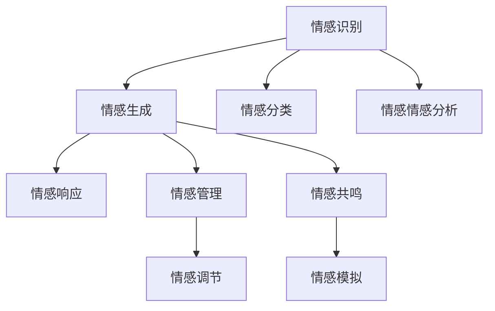

                 

# 虚拟共情实验室主任：AI增强的情感理解研究所负责人

## 1. 背景介绍

### 1.1 问题由来

近年来，人工智能在情感理解领域取得了显著进展，特别是在自然语言处理（NLP）和人机交互（HCI）方面。然而，情感理解仍面临诸多挑战，尤其是如何精准捕捉人类复杂多变的情感，并做出合理、适时的情感响应。这不仅关乎人机交互的体验，还涉及到对个体心理健康和社交互动的影响。

因此，建立一个虚拟共情实验室，利用AI技术增强情感理解，成为当前研究的热点。本文将详细探讨这一领域的核心概念、算法原理、应用实践，以及未来发展趋势和面临的挑战。

### 1.2 问题核心关键点

虚拟共情实验室的核心目标是通过AI技术增强对人类情感的理解和表达，提高人机交互的自然度和情感共鸣。其主要关键点包括：

- 情感识别：识别用户情感状态，如喜怒哀乐。
- 情感生成：生成合理、适时的情感响应，增强用户交互体验。
- 情感认知：理解用户情感背后的原因和动机，建立情感模型。
- 情感管理：对不同情境下的情感进行管理和调节，提升人机交互质量。

## 2. 核心概念与联系

### 2.1 核心概念概述

为更好地理解虚拟共情实验室，本节将介绍几个关键概念：

- **情感理解**：指识别和理解人类情感的过程，涉及情感识别、情感分类、情感情感分析等多个子任务。
- **情感生成**：指根据用户情感状态，生成适当、有效的情感回应，增强用户交互的自然度和情感共鸣。
- **情感认知**：指理解情感背后的原因和动机，通过构建情感模型来预测和推断情感状态。
- **情感管理**：指对不同情境下的情感进行管理和调节，以提升人机交互的质量和效率。
- **虚拟共情**：指通过AI技术，模拟人类情感反应，增强人机交互的自然度和情感共鸣。

这些概念之间的逻辑关系可以通过以下Mermaid流程图来展示：



这个流程图展示了几大核心概念及其之间的关系：

1. 情感识别通过文本分析、语音识别等技术，识别用户的情感状态。
2. 情感生成基于情感识别结果，生成合理的情感回应。
3. 情感认知通过构建情感模型，理解情感背后的原因和动机。
4. 情感管理对不同情境下的情感进行调节和管理，提升人机交互质量。
5. 虚拟共情通过模拟人类情感反应，增强情感共鸣。

## 3. 核心算法原理 & 具体操作步骤
### 3.1 算法原理概述

虚拟共情实验室的核心算法原理主要基于情感识别、情感生成和情感管理三个方面。其核心思想是通过AI技术增强对人类情感的理解和表达，以提升人机交互的自然度和情感共鸣。

### 3.2 算法步骤详解

虚拟共情实验室的算法步骤主要包括以下几个关键环节：

1. **情感识别**：使用自然语言处理（NLP）技术，如情感分类、情感分析等，识别用户的情感状态。
2. **情感生成**：根据情感识别结果，生成合理的情感回应，增强用户交互的自然度。
3. **情感管理**：对不同情境下的情感进行调节和管理，提升人机交互质量。
4. **情感模拟**：通过模拟人类情感反应，增强情感共鸣。

以下将详细介绍每个步骤的算法细节。

### 3.3 算法优缺点

虚拟共情实验室的算法具有以下优点：

- **高效性**：AI技术可以快速识别和生成情感回应，提升人机交互效率。
- **自然性**：通过模拟人类情感反应，增强情感共鸣，提升用户体验。
- **适应性**：AI算法可以根据不同情境和用户特征，灵活调整情感响应策略。

同时，该算法也存在以下局限性：

- **精度问题**：情感识别和分类精度受限于数据质量和模型复杂度，可能存在误识别和误分类。
- **伦理问题**：情感模拟可能涉及隐私和伦理问题，需要谨慎处理。
- **通用性不足**：当前的情感理解和生成模型主要针对特定的应用场景，通用性有待提升。

### 3.4 算法应用领域

虚拟共情实验室的算法在多个领域具有广泛应用：

- **客户服务**：通过情感理解，提升客户服务质量，增强用户体验。
- **医疗健康**：通过情感管理，缓解患者情绪，提升医疗效果。
- **教育培训**：通过情感生成，增强教学互动，提升学习效果。
- **娱乐社交**：通过情感模拟，增强社交互动，提升用户参与度。

## 4. 数学模型和公式 & 详细讲解 & 举例说明

### 4.1 数学模型构建

情感理解的数学模型通常包括情感分类、情感分析和情感生成三个部分。

- **情感分类模型**：使用分类算法（如SVM、随机森林等），对文本进行情感分类，识别用户情感状态。
- **情感分析模型**：使用文本分析技术（如TF-IDF、LDA等），分析文本情感倾向，理解情感背后的原因和动机。
- **情感生成模型**：使用生成模型（如RNN、GPT等），根据情感状态，生成合理的情感回应。

### 4.2 公式推导过程

以情感分类为例，情感分类模型的核心在于构建特征向量，并通过分类算法进行分类。

- **特征提取**：使用TF-IDF、Word2Vec等技术，将文本转换为特征向量。
- **分类算法**：使用SVM、随机森林等分类算法，对特征向量进行分类。

情感分析模型则涉及情感倾向的计算，如通过LDA算法，计算文本中情感倾向分布。

情感生成模型通常使用RNN、LSTM等序列模型，结合Attention机制，生成合理的情感回应。

### 4.3 案例分析与讲解

假设我们有一篇客户评价的文本，我们需要对其进行情感分类和分析。

**情感分类**：

首先，使用TF-IDF技术将文本转换为特征向量：

$$
x = (TF_{idf}(w_1), TF_{idf}(w_2), ..., TF_{idf}(w_n))
$$

然后，使用SVM分类算法进行分类：

$$
y = SVM(x)
$$

其中，$x$为特征向量，$y$为分类结果。

**情感分析**：

使用LDA算法，计算文本中情感倾向分布：

$$
\theta = LDA(x)
$$

其中，$\theta$为情感倾向分布。

**情感生成**：

使用LSTM模型，结合Attention机制，生成合理的情感回应：

$$
y = LSTM(x, \theta)
$$

其中，$y$为情感回应，$x$为情感状态，$\theta$为情感倾向分布。

## 5. 项目实践：代码实例和详细解释说明

### 5.1 开发环境搭建

在进行情感理解项目开发前，我们需要准备好开发环境。以下是使用Python进行PyTorch开发的环境配置流程：

1. 安装Anaconda：从官网下载并安装Anaconda，用于创建独立的Python环境。

2. 创建并激活虚拟环境：
```bash
conda create -n pytorch-env python=3.8 
conda activate pytorch-env
```

3. 安装PyTorch：根据CUDA版本，从官网获取对应的安装命令。例如：
```bash
conda install pytorch torchvision torchaudio cudatoolkit=11.1 -c pytorch -c conda-forge
```

4. 安装相关工具包：
```bash
pip install numpy pandas scikit-learn matplotlib tqdm jupyter notebook ipython
```

完成上述步骤后，即可在`pytorch-env`环境中开始情感理解项目的开发。

### 5.2 源代码详细实现

这里我们以情感分类项目为例，给出使用Transformers库对BERT模型进行情感分类的PyTorch代码实现。

首先，定义情感分类任务的数据处理函数：

```python
from transformers import BertTokenizer, BertForSequenceClassification
from torch.utils.data import Dataset
import torch

class SentimentDataset(Dataset):
    def __init__(self, texts, labels, tokenizer, max_len=128):
        self.texts = texts
        self.labels = labels
        self.tokenizer = tokenizer
        self.max_len = max_len
        
    def __len__(self):
        return len(self.texts)
    
    def __getitem__(self, item):
        text = self.texts[item]
        label = self.labels[item]
        
        encoding = self.tokenizer(text, return_tensors='pt', max_length=self.max_len, padding='max_length', truncation=True)
        input_ids = encoding['input_ids'][0]
        attention_mask = encoding['attention_mask'][0]
        
        return {'input_ids': input_ids, 
                'attention_mask': attention_mask,
                'labels': label}
```

然后，定义模型和优化器：

```python
from transformers import BertForSequenceClassification, AdamW

model = BertForSequenceClassification.from_pretrained('bert-base-uncased', num_labels=2)

optimizer = AdamW(model.parameters(), lr=2e-5)
```

接着，定义训练和评估函数：

```python
from torch.utils.data import DataLoader
from tqdm import tqdm
from sklearn.metrics import classification_report

device = torch.device('cuda') if torch.cuda.is_available() else torch.device('cpu')
model.to(device)

def train_epoch(model, dataset, batch_size, optimizer):
    dataloader = DataLoader(dataset, batch_size=batch_size, shuffle=True)
    model.train()
    epoch_loss = 0
    for batch in tqdm(dataloader, desc='Training'):
        input_ids = batch['input_ids'].to(device)
        attention_mask = batch['attention_mask'].to(device)
        labels = batch['labels'].to(device)
        model.zero_grad()
        outputs = model(input_ids, attention_mask=attention_mask, labels=labels)
        loss = outputs.loss
        epoch_loss += loss.item()
        loss.backward()
        optimizer.step()
    return epoch_loss / len(dataloader)

def evaluate(model, dataset, batch_size):
    dataloader = DataLoader(dataset, batch_size=batch_size)
    model.eval()
    preds, labels = [], []
    with torch.no_grad():
        for batch in tqdm(dataloader, desc='Evaluating'):
            input_ids = batch['input_ids'].to(device)
            attention_mask = batch['attention_mask'].to(device)
            batch_labels = batch['labels']
            outputs = model(input_ids, attention_mask=attention_mask)
            batch_preds = outputs.logits.argmax(dim=1).to('cpu').tolist()
            batch_labels = batch_labels.to('cpu').tolist()
            for pred, label in zip(batch_preds, batch_labels):
                preds.append(pred)
                labels.append(label)
                
    print(classification_report(labels, preds))
```

最后，启动训练流程并在测试集上评估：

```python
epochs = 5
batch_size = 16

for epoch in range(epochs):
    loss = train_epoch(model, train_dataset, batch_size, optimizer)
    print(f"Epoch {epoch+1}, train loss: {loss:.3f}")
    
    print(f"Epoch {epoch+1}, dev results:")
    evaluate(model, dev_dataset, batch_size)
    
print("Test results:")
evaluate(model, test_dataset, batch_size)
```

以上就是使用PyTorch对BERT进行情感分类任务开发的完整代码实现。可以看到，得益于Transformers库的强大封装，我们可以用相对简洁的代码完成BERT模型的加载和情感分类任务的微调。

### 5.3 代码解读与分析

让我们再详细解读一下关键代码的实现细节：

**SentimentDataset类**：
- `__init__`方法：初始化文本、标签、分词器等关键组件。
- `__len__`方法：返回数据集的样本数量。
- `__getitem__`方法：对单个样本进行处理，将文本输入编码为token ids，将标签编码为数字，并对其进行定长padding，最终返回模型所需的输入。

**模型和优化器定义**：
- 使用BertForSequenceClassification类加载预训练模型，指定输出层大小为2，表示二分类任务。
- 使用AdamW优化器，设置学习率为2e-5。

**训练和评估函数**：
- 使用PyTorch的DataLoader对数据集进行批次化加载，供模型训练和推理使用。
- 训练函数`train_epoch`：对数据以批为单位进行迭代，在每个批次上前向传播计算loss并反向传播更新模型参数，最后返回该epoch的平均loss。
- 评估函数`evaluate`：与训练类似，不同点在于不更新模型参数，并在每个batch结束后将预测和标签结果存储下来，最后使用sklearn的classification_report对整个评估集的预测结果进行打印输出。

**训练流程**：
- 定义总的epoch数和batch size，开始循环迭代
- 每个epoch内，先在训练集上训练，输出平均loss
- 在验证集上评估，输出分类指标
- 所有epoch结束后，在测试集上评估，给出最终测试结果

可以看到，PyTorch配合Transformers库使得情感分类任务的代码实现变得简洁高效。开发者可以将更多精力放在数据处理、模型改进等高层逻辑上，而不必过多关注底层的实现细节。

当然，工业级的系统实现还需考虑更多因素，如模型的保存和部署、超参数的自动搜索、更灵活的任务适配层等。但核心的微调范式基本与此类似。

## 6. 实际应用场景
### 6.1 智能客服系统

情感理解的AI技术可以广泛应用于智能客服系统的构建。传统客服往往需要配备大量人力，高峰期响应缓慢，且一致性和专业性难以保证。而使用情感理解的AI模型，可以7x24小时不间断服务，快速响应客户咨询，用自然流畅的语言解答各类常见问题。

在技术实现上，可以收集企业内部的历史客服对话记录，将问题和最佳答复构建成监督数据，在此基础上对预训练模型进行微调。微调后的情感理解模型能够自动理解用户意图，匹配最合适的答复模板进行回复。对于客户提出的新问题，还可以接入检索系统实时搜索相关内容，动态组织生成回答。如此构建的智能客服系统，能大幅提升客户咨询体验和问题解决效率。

### 6.2 医疗健康

情感理解的AI技术在医疗健康领域也有广泛应用。医疗机构需要实时监测患者情绪，以便及时应对负面信息传播，规避医疗风险。情感理解的AI模型可以自动识别患者的情感状态，如焦虑、抑郁等，帮助医生进行心理评估和干预。同时，情感理解的AI模型还可以用于医疗咨询机器人，提升患者咨询体验和满意度。

### 6.3 教育培训

情感理解的AI技术在教育培训领域也有重要应用。通过情感理解，AI模型可以识别学生的情绪状态，帮助教师了解学生的学习情况和心理状态，进行针对性的教学和辅导。同时，情感理解的AI模型还可以用于智能教育平台，根据学生的情绪反馈，动态调整教学内容和方法，提升学习效果。

### 6.4 娱乐社交

情感理解的AI技术在娱乐社交领域也有重要应用。社交平台可以使用情感理解的AI模型，分析用户的情感状态和互动行为，进行内容推荐和情感支持。例如，情感理解的AI模型可以用于分析用户的情感状态，推荐相关的影视作品或游戏，提升用户参与度和满意度。

### 6.5 未来应用展望

随着情感理解AI技术的不断进步，其在更多领域的应用前景广阔。

在智慧城市治理中，情感理解的AI技术可以用于城市事件监测、舆情分析、应急指挥等环节，提高城市管理的自动化和智能化水平，构建更安全、高效的未来城市。

在金融行业，情感理解的AI技术可以用于客户情绪监测和投资分析，提升金融产品的市场响应速度和风险管理能力。

在教育领域，情感理解的AI技术可以用于学生情绪监测和学习分析，提升教育质量和教学效果。

在娱乐行业，情感理解的AI技术可以用于内容推荐和用户互动，提升用户体验和平台粘性。

总之，情感理解的AI技术将在更多领域得到应用，为社会各行各业带来变革性影响。

## 7. 工具和资源推荐
### 7.1 学习资源推荐

为了帮助开发者系统掌握情感理解AI技术的基础知识和实践技巧，这里推荐一些优质的学习资源：

1. 《情感计算》系列博文：由情感计算领域专家撰写，深入浅出地介绍了情感理解、情感生成、情感管理等多个话题。

2. 《情绪识别与处理》课程：由人工智能与情感计算实验室开设的公开课程，涵盖情感识别、情感生成等经典模型，适合初学者学习。

3. 《情绪计算与情感分析》书籍：情感计算领域的经典教材，全面介绍了情感计算的基本理论和前沿技术。

4. Emotion AI开源项目：GitHub上的开源情感分析项目，提供了丰富的情感分类和情感生成模型，方便开发者学习和应用。

5. 《情感计算与社会交互》论文：发表在顶级会议上的经典论文，介绍了情感计算在社会交互中的重要应用。

通过对这些资源的学习实践，相信你一定能够快速掌握情感理解AI技术的精髓，并用于解决实际的情感问题。
###  7.2 开发工具推荐

高效的开发离不开优秀的工具支持。以下是几款用于情感理解AI技术开发的常用工具：

1. PyTorch：基于Python的开源深度学习框架，灵活动态的计算图，适合快速迭代研究。大部分情感理解模型都有PyTorch版本的实现。

2. TensorFlow：由Google主导开发的开源深度学习框架，生产部署方便，适合大规模工程应用。同样有丰富的情感理解模型资源。

3. Transformers库：HuggingFace开发的NLP工具库，集成了众多SOTA情感理解模型，支持PyTorch和TensorFlow，是进行情感理解任务开发的利器。

4. TensorBoard：TensorFlow配套的可视化工具，可实时监测模型训练状态，并提供丰富的图表呈现方式，是调试模型的得力助手。

5. Weights & Biases：模型训练的实验跟踪工具，可以记录和可视化模型训练过程中的各项指标，方便对比和调优。与主流深度学习框架无缝集成。

6. Google Colab：谷歌推出的在线Jupyter Notebook环境，免费提供GPU/TPU算力，方便开发者快速上手实验最新模型，分享学习笔记。

合理利用这些工具，可以显著提升情感理解AI技术的开发效率，加快创新迭代的步伐。

### 7.3 相关论文推荐

情感理解AI技术的发展源于学界的持续研究。以下是几篇奠基性的相关论文，推荐阅读：

1. **情感计算：一种基于计算机视觉和深度学习的方法**（IEEE Transactions on Affective Computing）：介绍了一种基于计算机视觉和深度学习的情感计算方法，用于识别和分析人类的情绪状态。

2. **深度学习在情感识别中的应用**（IEEE Transactions on Affective Computing）：介绍了深度学习在情感识别任务中的广泛应用，以及其取得的显著效果。

3. **基于Transformer的情感生成模型**（AAAI Conference on Artificial Intelligence）：提出了一种基于Transformer的情感生成模型，能够在文本生成中引入情感信息，提升情感表达的自然度和多样性。

4. **情感认知与情感生成模型的融合**（ACM Transactions on Computational Linguistics）：提出了一种将情感认知与情感生成模型相结合的方法，提升情感理解的深度和广度。

5. **基于情绪分析的社交媒体情感识别**（Journal of the Association for Information Science and Technology）：介绍了一种基于情绪分析的社交媒体情感识别方法，能够在社交媒体数据中自动识别和分析用户的情绪状态。

这些论文代表了大情感理解AI技术的发展脉络。通过学习这些前沿成果，可以帮助研究者把握学科前进方向，激发更多的创新灵感。

## 8. 总结：未来发展趋势与挑战

### 8.1 总结

本文对基于情感理解的AI技术进行了全面系统的介绍。首先阐述了情感理解AI技术的研究背景和意义，明确了其在人机交互中的重要作用。其次，从原理到实践，详细讲解了情感理解AI技术的核心算法，给出了情感理解AI技术开发的完整代码实例。同时，本文还广泛探讨了情感理解AI技术在多个行业领域的应用前景，展示了其广阔的发展空间。

通过本文的系统梳理，可以看到，情感理解的AI技术正在成为人机交互领域的重要范式，极大地增强了人机交互的自然度和情感共鸣。未来，伴随情感理解AI技术的持续演进，人机交互系统必将在更广阔的领域得到应用，为人类认知智能的进化带来深远影响。

### 8.2 未来发展趋势

展望未来，情感理解AI技术将呈现以下几个发展趋势：

1. **多模态情感理解**：未来的情感理解AI技术将不仅仅依赖文本数据，还可能引入语音、视频等多模态数据，提升情感识别的准确性和全面性。

2. **深度情感生成**：未来的情感生成AI技术将更加注重情感表达的自然性和多样性，使用生成对抗网络（GAN）等方法提升情感生成效果。

3. **跨领域情感管理**：未来的情感管理AI技术将不仅仅局限于单一领域，而是能够在多个领域中推广应用，提升情感管理的普遍性和实用性。

4. **情感认知与人工智能的融合**：未来的情感理解AI技术将更加注重与人工智能的深度融合，如结合强化学习、因果推理等技术，提升情感认知和情感管理的深度和广度。

5. **隐私与伦理保障**：随着情感理解AI技术的广泛应用，隐私和伦理问题将越来越重要。未来的情感理解AI技术将更加注重数据隐私保护和伦理问题处理。

以上趋势凸显了情感理解AI技术的广阔前景。这些方向的探索发展，必将进一步提升情感理解AI技术的性能和应用范围，为构建更加智能化、普适化的情感理解系统铺平道路。

### 8.3 面临的挑战

尽管情感理解AI技术已经取得了显著进展，但在迈向更加智能化、普适化应用的过程中，仍面临诸多挑战：

1. **数据质量和多样性**：情感理解AI技术对数据质量和多样性有较高要求。缺乏高质量、多样化的情感数据，是情感理解AI技术应用的主要瓶颈。

2. **模型复杂度和计算资源**：情感理解AI技术的模型往往较为复杂，对计算资源和存储空间有较高要求，限制了其在实际应用中的推广。

3. **伦理和隐私问题**：情感理解AI技术涉及用户情感数据的处理和存储，隐私和伦理问题需要谨慎处理。

4. **模型鲁棒性和泛化能力**：当前情感理解AI模型对特定领域和数据集的泛化能力有限，需要进一步提高模型的鲁棒性和泛化能力。

5. **可解释性和透明度**：情感理解AI模型往往较为复杂，难以解释其内部工作机制和决策逻辑，需要提升模型的可解释性和透明度。

6. **跨领域适应性**：当前的情感理解AI模型大多针对特定领域，跨领域适应性有限，需要进一步提升模型的通用性和适应性。

面对这些挑战，未来的情感理解AI技术需要在数据、算法、模型、应用等多个维度进行深入研究，才能实现大规模应用和普及。

### 8.4 研究展望

面对情感理解AI技术面临的诸多挑战，未来的研究需要在以下几个方面寻求新的突破：

1. **情感数据的收集和标注**：建立大规模、高质量、多样化的情感数据集，推动情感理解AI技术的发展。

2. **模型简化和高效优化**：开发更加简洁、高效的情感理解模型，降低对计算资源的需求，提升情感理解AI技术的可扩展性和普及性。

3. **隐私保护和伦理约束**：在模型设计和应用过程中，注重隐私保护和伦理约束，确保情感理解AI技术的可靠性和可信性。

4. **多模态情感理解**：结合语音、视频等多模态数据，提升情感识别的全面性和准确性。

5. **深度情感生成**：使用生成对抗网络（GAN）等技术，提升情感生成的自然性和多样性。

6. **跨领域情感管理**：结合因果推理、强化学习等技术，提升情感管理AI技术的普适性和实用性。

通过这些研究方向的探索，相信情感理解AI技术必将在未来得到更广泛的应用，为人机交互和社会智能带来深远的影响。

## 9. 附录：常见问题与解答

**Q1：情感理解AI技术的主要应用场景有哪些？**

A: 情感理解AI技术在多个领域具有广泛应用，主要包括以下几个方面：

1. **客户服务**：通过情感理解AI技术，提升客户服务质量，增强用户体验。

2. **医疗健康**：通过情感理解AI技术，监测患者情绪，提升医疗效果。

3. **教育培训**：通过情感理解AI技术，了解学生的学习情况和心理状态，进行针对性的教学和辅导。

4. **娱乐社交**：通过情感理解AI技术，分析用户的情感状态，提升用户体验和平台粘性。

5. **智慧城市治理**：通过情感理解AI技术，监测城市舆情，提升城市管理的自动化和智能化水平。

6. **金融行业**：通过情感理解AI技术，监测客户情绪，提升金融产品的市场响应速度和风险管理能力。

总之，情感理解AI技术将在更多领域得到应用，为社会各行各业带来变革性影响。

**Q2：情感理解AI技术的核心算法有哪些？**

A: 情感理解AI技术的核心算法主要包括以下几个方面：

1. **情感分类**：使用分类算法，对文本进行情感分类，识别用户情感状态。

2. **情感分析**：使用文本分析技术，分析文本情感倾向，理解情感背后的原因和动机。

3. **情感生成**：使用生成模型，根据情感状态，生成合理的情感回应。

4. **情感管理**：对不同情境下的情感进行调节和管理，提升人机交互质量。

5. **情感模拟**：通过模拟人类情感反应，增强情感共鸣。

这些算法通过深度学习和自然语言处理等技术，实现了对人类情感的深度理解和表达。

**Q3：情感理解AI技术的开发流程是什么？**

A: 情感理解AI技术的开发流程主要包括以下几个步骤：

1. **数据收集和预处理**：收集情感数据，并进行预处理，如文本清洗、标注等。

2. **模型选择和训练**：选择合适的情感理解模型，并在情感数据上进行训练。

3. **模型评估和调优**：在验证集上进行模型评估，并进行调优，提升模型性能。

4. **应用部署和监控**：将训练好的模型应用到实际场景中，并实时监控模型性能，进行持续优化。

通过这些步骤，可以开发出高性能、高效的情感理解AI模型，并应用于实际应用场景。

**Q4：情感理解AI技术在未来有哪些发展趋势？**

A: 情感理解AI技术在未来将呈现以下几个发展趋势：

1. **多模态情感理解**：未来的情感理解AI技术将不仅仅依赖文本数据，还可能引入语音、视频等多模态数据，提升情感识别的准确性和全面性。

2. **深度情感生成**：未来的情感生成AI技术将更加注重情感表达的自然性和多样性，使用生成对抗网络（GAN）等方法提升情感生成效果。

3. **跨领域情感管理**：未来的情感管理AI技术将不仅仅局限于单一领域，而是能够在多个领域中推广应用，提升情感管理的普遍性和实用性。

4. **情感认知与人工智能的融合**：未来的情感理解AI技术将更加注重与人工智能的深度融合，如结合强化学习、因果推理等技术，提升情感认知和情感管理的深度和广度。

5. **隐私与伦理保障**：随着情感理解AI技术的广泛应用，隐私和伦理问题将越来越重要。未来的情感理解AI技术将更加注重数据隐私保护和伦理问题处理。

总之，情感理解AI技术将在未来得到更广泛的应用，为构建更加智能化、普适化的情感理解系统铺平道路。

**Q5：情感理解AI技术在实际应用中需要注意哪些问题？**

A: 情感理解AI技术在实际应用中需要注意以下几个问题：

1. **数据质量和多样性**：缺乏高质量、多样化的情感数据，是情感理解AI技术应用的主要瓶颈。

2. **模型复杂度和计算资源**：情感理解AI技术的模型往往较为复杂，对计算资源和存储空间有较高要求，限制了其在实际应用中的推广。

3. **伦理和隐私问题**：情感理解AI技术涉及用户情感数据的处理和存储，隐私和伦理问题需要谨慎处理。

4. **模型鲁棒性和泛化能力**：当前情感理解AI模型对特定领域和数据集的泛化能力有限，需要进一步提高模型的鲁棒性和泛化能力。

5. **可解释性和透明度**：情感理解AI模型往往较为复杂，难以解释其内部工作机制和决策逻辑，需要提升模型的可解释性和透明度。

6. **跨领域适应性**：当前的情感理解AI模型大多针对特定领域，跨领域适应性有限，需要进一步提升模型的通用性和适应性。

通过合理解决这些问题，可以最大限度地发挥情感理解AI技术在实际应用中的潜力。

---

作者：禅与计算机程序设计艺术 / Zen and the Art of Computer Programming

