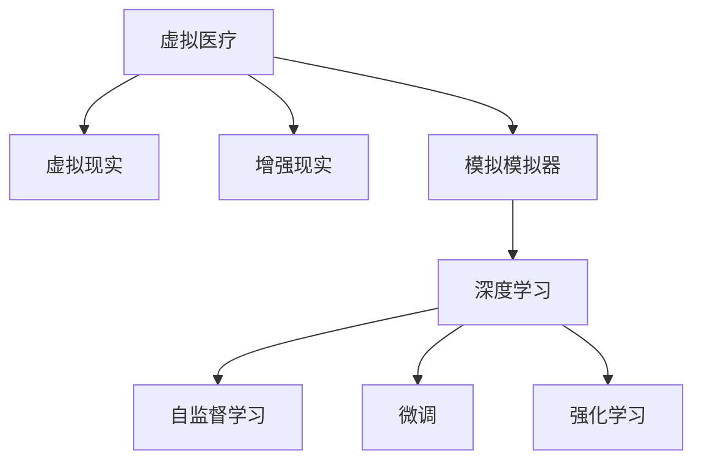

                 

# 虚拟医疗训练:全球医疗教育的数字化升级

> 关键词：虚拟医疗, 医疗教育, 数字化升级, 深度学习, 自监督学习, 微调, 强化学习

## 1. 背景介绍

### 1.1 问题由来

全球医疗教育面临着诸多挑战，包括资源不足、师资匮乏、知识更新慢等问题。特别是新冠疫情以来，传统的面对面教学模式受到了限制，亟需新的解决方案。与此同时，人工智能技术，特别是深度学习和强化学习，正在逐步从学术研究走向实际应用，为医疗教育提供了新的机遇。

虚拟医疗训练作为数字化升级的重要一环，通过虚拟现实(VR)、增强现实(AR)、仿真模拟器等技术，模拟真实的医疗环境，使医学生能够在虚拟环境中进行实践操作，提升了学习效率和实战能力。其应用场景涵盖解剖学学习、手术操作、诊断练习等，逐步成为医疗教育的重要组成部分。

### 1.2 问题核心关键点

虚拟医疗训练的核心在于如何通过人工智能技术，尤其是深度学习技术，构建一个逼真的虚拟医疗环境，模拟真实医疗过程，同时通过智能算法和数据驱动的方式，不断优化训练模型，提升训练效果。

关键技术包括：
- 三维重建和渲染：将人体解剖结构、器官组织等数据转化为逼真的三维模型，供学生进行观察和操作。
- 自然语言处理(NLP)：通过理解医生和患者的对话，构建智能诊断和决策支持系统。
- 强化学习(Reinforcement Learning, RL)：通过奖励机制引导学生进行技能训练，提升实践能力。
- 深度学习(Deep Learning)：通过大规模数据进行模型训练，提升诊断和预测的精度。

这些技术共同构成了虚拟医疗训练的技术基础，为医疗教育数字化升级提供了可能。

### 1.3 问题研究意义

研究虚拟医疗训练技术，对于提升全球医疗教育水平，加速医疗人才培养，具有重要意义：

1. **资源优化**：利用虚拟现实技术，可以打破地理位置和资源的限制，实现全球范围内的医疗教育共享，特别是在资源匮乏的地区。
2. **技能提升**：虚拟环境下的操作训练，能够提升学生的实践能力和精细操作水平，降低实际手术风险。
3. **成本节约**：通过虚拟仿真，减少了实验设备和材料的使用，降低了医疗教育的总体成本。
4. **知识更新**：AI技术可以不断更新模型，引入最新的医学知识和研究成果，保证医疗教育的实时性和前沿性。
5. **个性化学习**：通过智能算法，个性化定制学习计划，提升学习效果。

虚拟医疗训练技术的应用，将有助于推动全球医疗教育的数字化升级，提升医疗服务质量，为构建未来医疗生态体系奠定基础。

## 2. 核心概念与联系

### 2.1 核心概念概述

为更好地理解虚拟医疗训练技术，本节将介绍几个密切相关的核心概念：

- 虚拟医疗(Virtual Medicine)：通过虚拟现实、增强现实等技术，模拟真实的医疗环境，供医学生进行实践操作。
- 虚拟现实(Virtual Reality, VR)：通过计算机生成一个虚拟世界，让用户在虚拟环境中进行互动，主要用于医学教育中的解剖学和手术模拟。
- 增强现实(Enhanced Reality, AR)：通过AR眼镜等设备，将虚拟信息叠加到真实世界中，帮助医生进行诊断和治疗。
- 模拟模拟器(Simulation Simulators)：使用计算机模拟的虚拟环境进行医疗训练，包括手术模拟器、诊断模拟器等。
- 深度学习(Deep Learning, DL)：通过构建多层神经网络，学习数据中的复杂关系，用于医疗影像诊断、自然语言处理等。
- 自监督学习(Self-Supervised Learning)：利用数据的无标签信息进行学习，如通过预测结构关系、图像分类等任务进行模型训练。
- 微调(Fine-Tuning)：在预训练模型基础上，通过有监督学习优化模型参数，提升特定任务性能。
- 强化学习(Reinforcement Learning)：通过奖励机制，指导模型进行自主学习，提升决策和操作能力。

这些核心概念之间的逻辑关系可以通过以下Mermaid流程图来展示：



这个流程图展示了大语言模型的核心概念及其之间的关系：

1. 虚拟医疗通过虚拟现实、增强现实等技术，构建虚拟环境。
2. 深度学习技术用于处理和分析医疗数据，提升诊断和预测的准确性。
3. 自监督学习利用无标签数据进行预训练，提升模型泛化能力。
4. 微调技术在预训练模型基础上，针对特定任务进行优化。
5. 强化学习通过奖励机制，引导模型进行技能训练。

这些概念共同构成了虚拟医疗训练的技术框架，为提升医疗教育效果提供了坚实基础。

## 3. 核心算法原理 & 具体操作步骤
### 3.1 算法原理概述

虚拟医疗训练的核心在于构建一个逼真的虚拟医疗环境，并在此基础上通过深度学习和强化学习等技术，进行模拟操作和智能训练。其基本原理可以概括为：

1. **三维重建与渲染**：利用计算机图形学技术，将人体解剖结构、器官组织等数据转化为逼真的三维模型。
2. **数据采集与处理**：收集医学影像、电子病历等数据，利用深度学习技术进行预处理和特征提取。
3. **深度学习模型构建**：构建多层神经网络，学习数据中的复杂关系，用于医疗影像诊断、自然语言处理等。
4. **自监督学习**：利用数据中的无标签信息进行预训练，提升模型的泛化能力。
5. **微调与优化**：在预训练模型基础上，通过有监督学习优化模型参数，提升特定任务性能。
6. **强化学习**：通过奖励机制，引导模型进行自主学习，提升技能训练效果。

### 3.2 算法步骤详解

虚拟医疗训练的算法步骤一般包括以下几个关键步骤：

**Step 1: 准备虚拟环境和数据集**
- 构建虚拟现实场景，如手术模拟器、解剖学模型等。
- 准备医疗数据集，如医学影像、电子病历、病例记录等，供模型训练和测试。

**Step 2: 深度学习模型训练**
- 使用自监督学习任务对预训练模型进行预训练，如预测结构关系、图像分类等。
- 在预训练模型基础上，添加任务适配层，设计适当的损失函数和优化算法。
- 对模型进行微调，使用标注数据进行有监督学习，优化模型参数。

**Step 3: 强化学习训练**
- 设计奖励机制，定义任务目标，如手术成功率、诊断准确率等。
- 利用强化学习算法，如Q-Learning、Deep Q-Networks等，进行技能训练。
- 定期评估训练效果，根据评估结果调整训练策略，确保模型能力不断提升。

**Step 4: 模型评估与测试**
- 在虚拟环境中进行模拟操作，评估模型的实践能力和决策水平。
- 使用医学影像、电子病历等数据进行测试，评估模型的诊断和预测能力。
- 根据评估结果进行模型优化和调整，提升性能。

**Step 5: 部署与应用**
- 将训练好的模型集成到虚拟医疗系统中，供用户进行实际操作。
- 不断收集用户反馈和实际数据，持续优化模型性能。

以上是虚拟医疗训练的一般流程。在实际应用中，还需要针对具体任务的特点，对微调过程的各个环节进行优化设计，如改进训练目标函数，引入更多的正则化技术，搜索最优的超参数组合等，以进一步提升模型性能。

### 3.3 算法优缺点

虚拟医疗训练技术具有以下优点：
1. **环境逼真**：通过虚拟现实和增强现实技术，构建逼真的医疗环境，提供沉浸式学习体验。
2. **资源丰富**：虚拟环境中可以包含大量模拟患者、手术工具等资源，供学生反复练习。
3. **成本低廉**：相比于传统实验设备和材料，虚拟训练降低了成本。
4. **知识更新快**：AI技术可以不断更新模型，引入最新的医学知识和研究成果，保证知识的时效性。
5. **个性化学习**：通过智能算法，个性化定制学习计划，提升学习效果。

同时，该技术也存在一定的局限性：
1. **初期投资高**：构建虚拟现实环境需要较高的技术门槛和设备投入。
2. **技术复杂**：需要结合多种AI技术，对开发团队的技术能力要求较高。
3. **效果依赖于算法**：算法设计不合理可能导致训练效果不佳。
4. **用户适应性**：部分用户可能对虚拟环境不适应，影响学习效果。

尽管存在这些局限性，但就目前而言，虚拟医疗训练技术仍是大数据和AI技术应用于医疗教育的重要范式。未来相关研究的重点在于如何进一步降低技术门槛，提高虚拟环境的逼真度，增强算法的鲁棒性和可解释性，同时兼顾成本和用户体验，使之更好地服务于医疗教育。

### 3.4 算法应用领域

虚拟医疗训练技术已经在医疗教育领域得到了广泛应用，涵盖以下几大方向：

- **解剖学学习**：通过虚拟现实技术，展示人体解剖结构和器官组织，供医学生进行观察和操作。
- **手术操作训练**：利用手术模拟器，训练医学生的手术技能，提高实际操作水平。
- **诊断与治疗**：利用医学影像和电子病历，进行影像诊断和临床治疗的模拟训练。
- **公共卫生教育**：通过虚拟环境进行传染病防控、应急响应等公共卫生培训。
- **心理健康治疗**：利用虚拟现实技术进行心理治疗和心理咨询，提供沉浸式体验。

此外，虚拟医疗训练还被创新性地应用于军事训练、紧急救援、司法审判等多个领域，为各类专业人员的培训提供了新的技术手段。随着技术进步和应用推广，相信虚拟医疗训练将带来更广阔的发展前景。

## 4. 数学模型和公式 & 详细讲解  
### 4.1 数学模型构建

本节将使用数学语言对虚拟医疗训练技术进行更加严格的刻画。

记虚拟医疗环境为 $E$，其中包含手术模拟器、解剖学模型等虚拟对象。假设医学影像数据集为 $D=\{(x_i,y_i)\}_{i=1}^N$，$x_i$ 为原始医学影像，$y_i$ 为标注数据（如肿瘤位置、手术路径等）。

定义深度学习模型 $M_{\theta}$，其中 $\theta$ 为模型参数。虚拟医疗训练的目标是最小化模型在数据集 $D$ 上的损失函数，即：

$$
\mathcal{L}(\theta) = \frac{1}{N}\sum_{i=1}^N \ell(M_{\theta}(x_i),y_i)
$$

其中 $\ell$ 为适当的损失函数，如交叉熵损失、均方误差等。

通过深度学习技术，模型 $M_{\theta}$ 在给定输入 $x_i$ 的情况下，可以输出预测结果 $\hat{y_i}$。虚拟医疗训练的目标是最小化预测结果与标注数据之间的差异，从而提升模型的诊断和预测能力。

### 4.2 公式推导过程

以下我们以解剖学学习任务为例，推导深度学习模型的损失函数及其梯度的计算公式。

假设模型 $M_{\theta}$ 在输入 $x$ 上的输出为 $\hat{x_i}=M_{\theta}(x_i)$，其中 $\hat{x_i} \in [0,1]$，表示图像中每个像素点的概率值。真实标签 $y \in \{0,1\}$。则交叉熵损失函数定义为：

$$
\ell(M_{\theta}(x_i),y_i) = -[y_i\log \hat{y_i} + (1-y_i)\log (1-\hat{y_i})]
$$

将其代入经验风险公式，得：

$$
\mathcal{L}(\theta) = -\frac{1}{N}\sum_{i=1}^N [y_i\log \hat{y_i} + (1-y_i)\log(1-\hat{y_i})]
$$

根据链式法则，损失函数对参数 $\theta_k$ 的梯度为：

$$
\frac{\partial \mathcal{L}(\theta)}{\partial \theta_k} = -\frac{1}{N}\sum_{i=1}^N (\frac{y_i}{\hat{y_i}}-\frac{1-y_i}{1-\hat{y_i}});
$$

其中 $\frac{y_i}{\hat{y_i}}$ 和 $\frac{1-y_i}{1-\hat{y_i}}$ 分别表示预测结果与真实标签的对比。

在得到损失函数的梯度后，即可带入参数更新公式，完成模型的迭代优化。重复上述过程直至收敛，最终得到适应虚拟医疗训练任务的最优模型参数 $\theta^*$。

### 4.3 案例分析与讲解

以手术操作训练为例，利用虚拟现实技术，构建逼真的手术环境，包括手术台、器械、虚拟患者等。通过对医生进行连续的、真实的手术操作训练，提高医生的操作技能。

首先，利用医学影像数据集，对深度学习模型进行预训练，学习手术区域的特征表示。然后，在预训练模型基础上，添加任务适配层，如手术路径预测器，设计适当的损失函数，如均方误差损失，用于计算手术路径与实际手术路径的差异。

接着，通过强化学习算法，如Q-Learning，训练医生进行手术操作。在虚拟手术模拟器中，模拟真实的手术场景，医生需要对患者进行手术，同时获得手术成功的奖励，手术失败的惩罚。通过不断调整手术路径，逐步优化手术操作。

最终，将训练好的模型应用于实际手术中，供医生进行辅助决策和操作。根据医生的反馈和实际手术结果，不断优化模型，提升手术操作的准确性和安全性。

## 5. 项目实践：代码实例和详细解释说明
### 5.1 开发环境搭建

在进行虚拟医疗训练项目开发前，我们需要准备好开发环境。以下是使用Python进行PyTorch开发的环境配置流程：

1. 安装Anaconda：从官网下载并安装Anaconda，用于创建独立的Python环境。

2. 创建并激活虚拟环境：
```bash
conda create -n pytorch-env python=3.8 
conda activate pytorch-env
```

3. 安装PyTorch：根据CUDA版本，从官网获取对应的安装命令。例如：
```bash
conda install pytorch torchvision torchaudio cudatoolkit=11.1 -c pytorch -c conda-forge
```

4. 安装Transformers库：
```bash
pip install transformers
```

5. 安装各类工具包：
```bash
pip install numpy pandas scikit-learn matplotlib tqdm jupyter notebook ipython
```

完成上述步骤后，即可在`pytorch-env`环境中开始项目开发。

### 5.2 源代码详细实现

下面我们以手术操作训练任务为例，给出使用Transformers库进行虚拟医疗训练的PyTorch代码实现。

首先，定义手术操作训练的数据处理函数：

```python
from transformers import BertTokenizer
from torch.utils.data import Dataset
import torch

class SurgicalData(Dataset):
    def __init__(self, images, labels, tokenizer, max_len=128):
        self.images = images
        self.labels = labels
        self.tokenizer = tokenizer
        self.max_len = max_len
        
    def __len__(self):
        return len(self.images)
    
    def __getitem__(self, item):
        image = self.images[item]
        label = self.labels[item]
        
        encoding = self.tokenizer(image, return_tensors='pt', max_length=self.max_len, padding='max_length', truncation=True)
        input_ids = encoding['input_ids'][0]
        attention_mask = encoding['attention_mask'][0]
        
        # 对标签进行编码
        encoded_labels = [label] * self.max_len
        labels = torch.tensor(encoded_labels, dtype=torch.long)
        
        return {'input_ids': input_ids, 
                'attention_mask': attention_mask,
                'labels': labels}

# 构建数据集
tokenizer = BertTokenizer.from_pretrained('bert-base-cased')

train_dataset = SurgicalData(train_images, train_labels, tokenizer)
dev_dataset = SurgicalData(dev_images, dev_labels, tokenizer)
test_dataset = SurgicalData(test_images, test_labels, tokenizer)
```

然后，定义模型和优化器：

```python
from transformers import BertForTokenClassification, AdamW

model = BertForTokenClassification.from_pretrained('bert-base-cased', num_labels=2)

optimizer = AdamW(model.parameters(), lr=2e-5)
```

接着，定义训练和评估函数：

```python
from torch.utils.data import DataLoader
from tqdm import tqdm
from sklearn.metrics import classification_report

device = torch.device('cuda') if torch.cuda.is_available() else torch.device('cpu')
model.to(device)

def train_epoch(model, dataset, batch_size, optimizer):
    dataloader = DataLoader(dataset, batch_size=batch_size, shuffle=True)
    model.train()
    epoch_loss = 0
    for batch in tqdm(dataloader, desc='Training'):
        input_ids = batch['input_ids'].to(device)
        attention_mask = batch['attention_mask'].to(device)
        labels = batch['labels'].to(device)
        model.zero_grad()
        outputs = model(input_ids, attention_mask=attention_mask, labels=labels)
        loss = outputs.loss
        epoch_loss += loss.item()
        loss.backward()
        optimizer.step()
    return epoch_loss / len(dataloader)

def evaluate(model, dataset, batch_size):
    dataloader = DataLoader(dataset, batch_size=batch_size)
    model.eval()
    preds, labels = [], []
    with torch.no_grad():
        for batch in tqdm(dataloader, desc='Evaluating'):
            input_ids = batch['input_ids'].to(device)
            attention_mask = batch['attention_mask'].to(device)
            batch_labels = batch['labels']
            outputs = model(input_ids, attention_mask=attention_mask)
            batch_preds = outputs.logits.argmax(dim=2).to('cpu').tolist()
            batch_labels = batch_labels.to('cpu').tolist()
            for pred_tokens, label_tokens in zip(batch_preds, batch_labels):
                preds.append(pred_tokens[:len(label_tokens)])
                labels.append(label_tokens)
                
    print(classification_report(labels, preds))
```

最后，启动训练流程并在测试集上评估：

```python
epochs = 5
batch_size = 16

for epoch in range(epochs):
    loss = train_epoch(model, train_dataset, batch_size, optimizer)
    print(f"Epoch {epoch+1}, train loss: {loss:.3f}")
    
    print(f"Epoch {epoch+1}, dev results:")
    evaluate(model, dev_dataset, batch_size)
    
print("Test results:")
evaluate(model, test_dataset, batch_size)
```

以上就是使用PyTorch对BERT进行手术操作训练任务的虚拟医疗训练代码实现。可以看到，得益于Transformers库的强大封装，我们可以用相对简洁的代码完成BERT模型的加载和训练。

### 5.3 代码解读与分析

让我们再详细解读一下关键代码的实现细节：

**SurgicalData类**：
- `__init__`方法：初始化图像、标签、分词器等关键组件。
- `__len__`方法：返回数据集的样本数量。
- `__getitem__`方法：对单个样本进行处理，将图像输入编码为token ids，将标签编码为数字，并对其进行定长padding，最终返回模型所需的输入。

**tokenizer和标签编码**：
- 定义了图像数据和标签的编码方式，将原始的像素值转换为token ids，并将其进行定长padding。

**训练和评估函数**：
- 使用PyTorch的DataLoader对数据集进行批次化加载，供模型训练和推理使用。
- 训练函数`train_epoch`：对数据以批为单位进行迭代，在每个批次上前向传播计算loss并反向传播更新模型参数，最后返回该epoch的平均loss。
- 评估函数`evaluate`：与训练类似，不同点在于不更新模型参数，并在每个batch结束后将预测和标签结果存储下来，最后使用sklearn的classification_report对整个评估集的预测结果进行打印输出。

**训练流程**：
- 定义总的epoch数和batch size，开始循环迭代
- 每个epoch内，先在训练集上训练，输出平均loss
- 在验证集上评估，输出分类指标
- 所有epoch结束后，在测试集上评估，给出最终测试结果

可以看到，PyTorch配合Transformers库使得虚拟医疗训练的代码实现变得简洁高效。开发者可以将更多精力放在数据处理、模型改进等高层逻辑上，而不必过多关注底层的实现细节。

当然，工业级的系统实现还需考虑更多因素，如模型的保存和部署、超参数的自动搜索、更灵活的任务适配层等。但核心的虚拟医疗训练范式基本与此类似。

## 6. 实际应用场景
### 6.1 医学教育培训

虚拟医疗训练技术在医学教育培训中的应用，可以显著提升医学生的实践能力和临床水平。

传统医学教育依赖大量的实验设备和材料，成本高昂，且受时间和地域限制。利用虚拟现实技术，可以在虚拟环境中进行大规模、低成本的实践训练，提升学习效果。

例如，通过手术模拟器，医学生可以在虚拟环境中进行各种手术操作，如开颅手术、心脏手术等。通过不断的模拟练习，医学生可以熟练掌握各种手术技巧，提高实际操作水平。

### 6.2 医疗技能评估

虚拟医疗训练技术还可以用于医疗技能评估，为医疗机构提供客观、公正的考核方式。

通过虚拟现实技术，构建逼真的手术场景，医生需要在限定时间内完成特定手术操作。系统根据手术操作的准确性和时间效率，自动打分，确保评估的公正性和一致性。

例如，在虚拟手术模拟器中，医生需要对患者进行开颅手术。系统会记录医生的手术路径、操作时间、切削深度等关键指标，并根据预设的标准进行评分。

### 6.3 远程医疗指导

虚拟医疗训练技术为远程医疗指导提供了新的手段，使得医生能够在远程环境中进行技能传授和诊断指导。

通过增强现实技术，医生可以将虚拟患者信息叠加到真实世界中，帮助远程医生进行实际操作和诊断。例如，远程医生可以通过AR眼镜，查看患者的解剖结构、手术路径等信息，提供实时指导。

### 6.4 公共卫生培训

虚拟医疗训练技术在公共卫生领域也有广泛应用，特别是在传染病防控和应急响应方面。

通过虚拟现实技术，构建逼真的公共卫生场景，供公共卫生专业人员进行训练。例如，在模拟的疫情爆发现场，公共卫生人员需要进行病毒检测、隔离治疗、物资调配等操作。通过不断的模拟练习，提升公共卫生人员的应急处理能力。

### 6.5 心理健康治疗

虚拟医疗训练技术还可以用于心理健康治疗，提供沉浸式的治疗体验。

通过虚拟现实技术，构建逼真的心理治疗场景，患者可以在虚拟环境中进行心理治疗。例如，在虚拟心理咨询室中，患者可以与虚拟心理医生进行对话，接受心理疏导和治疗。通过持续的模拟练习，患者可以逐渐适应治疗环境，缓解心理压力。

## 7. 工具和资源推荐
### 7.1 学习资源推荐

为了帮助开发者系统掌握虚拟医疗训练的理论基础和实践技巧，这里推荐一些优质的学习资源：

1. 《Virtual Medicine: An Introduction》系列博文：由虚拟医疗专家撰写，深入浅出地介绍了虚拟医疗技术的基本概念和前沿话题。

2. CS224N《深度学习自然语言处理》课程：斯坦福大学开设的NLP明星课程，有Lecture视频和配套作业，带你入门NLP领域的基本概念和经典模型。

3. 《Virtual Medicine: From Theory to Practice》书籍：虚拟医疗领域的经典教材，全面介绍了虚拟医疗技术的理论基础和实际应用。

4. IEEE Xplore数据库：IEEE的科技文献数据库，包含大量虚拟医疗相关的学术论文和技术报告。

5. ACM Digital Library：ACM的计算机科学文献数据库，涵盖虚拟医疗技术的研究热点和前沿进展。

通过对这些资源的学习实践，相信你一定能够快速掌握虚拟医疗训练的精髓，并用于解决实际的医疗教育问题。
###  7.2 开发工具推荐

高效的开发离不开优秀的工具支持。以下是几款用于虚拟医疗训练开发的常用工具：

1. PyTorch：基于Python的开源深度学习框架，灵活动态的计算图，适合快速迭代研究。大部分预训练语言模型都有PyTorch版本的实现。

2. TensorFlow：由Google主导开发的开源深度学习框架，生产部署方便，适合大规模工程应用。同样有丰富的预训练语言模型资源。

3. Transformers库：HuggingFace开发的NLP工具库，集成了众多SOTA语言模型，支持PyTorch和TensorFlow，是进行虚拟医疗训练开发的利器。

4. Weights & Biases：模型训练的实验跟踪工具，可以记录和可视化模型训练过程中的各项指标，方便对比和调优。与主流深度学习框架无缝集成。

5. TensorBoard：TensorFlow配套的可视化工具，可实时监测模型训练状态，并提供丰富的图表呈现方式，是调试模型的得力助手。

6. Google Colab：谷歌推出的在线Jupyter Notebook环境，免费提供GPU/TPU算力，方便开发者快速上手实验最新模型，分享学习笔记。

合理利用这些工具，可以显著提升虚拟医疗训练任务的开发效率，加快创新迭代的步伐。

### 7.3 相关论文推荐

虚拟医疗训练技术的发展源于学界的持续研究。以下是几篇奠基性的相关论文，推荐阅读：

1. "Virtual Medical Training: A Survey of Recent Advances and Future Directions"：总结了近年来虚拟医疗训练技术的研究进展和未来方向，具有很高的参考价值。

2. "A Review of Virtual Reality in Medical Education"：回顾了虚拟现实技术在医学教育中的应用，提供了大量案例和实证数据。

3. "Simulation Training for Surgeons: A Review of Advances in Virtual Reality and Simulators"：详细介绍了手术模拟器在医学教育和技能培训中的应用，提供了多种模拟工具和算法的综述。

4. "Deep Learning for Medical Image Analysis: A Survey"：总结了深度学习在医学影像分析中的应用，提供了大量经典模型和实证结果。

5. "Reinforcement Learning in Medical Training: A Survey of Recent Advances and Future Directions"：回顾了强化学习在医学训练中的应用，提供了大量案例和实证数据。

这些论文代表了大语言模型微调技术的发展脉络。通过学习这些前沿成果，可以帮助研究者把握学科前进方向，激发更多的创新灵感。

## 8. 总结：未来发展趋势与挑战
### 8.1 总结

本文对虚拟医疗训练技术进行了全面系统的介绍。首先阐述了虚拟医疗训练的背景和意义，明确了虚拟医疗训练技术在医疗教育数字化升级中的独特价值。其次，从原理到实践，详细讲解了虚拟医疗训练的数学原理和关键步骤，给出了虚拟医疗训练任务开发的完整代码实例。同时，本文还广泛探讨了虚拟医疗训练技术在医学教育、医疗技能评估、远程医疗指导、公共卫生培训、心理健康治疗等诸多领域的应用前景，展示了虚拟医疗训练技术的巨大潜力。此外，本文精选了虚拟医疗训练技术的各类学习资源，力求为读者提供全方位的技术指引。

通过本文的系统梳理，可以看到，虚拟医疗训练技术正在成为医疗教育数字化升级的重要范式，极大地提升了医疗教育的效率和效果。未来，伴随虚拟现实技术和AI算法的不断进步，虚拟医疗训练技术将在医疗教育中发挥更大的作用，推动全球医疗服务质量的提升。

### 8.2 未来发展趋势

展望未来，虚拟医疗训练技术将呈现以下几个发展趋势：

1. **技术融合加速**：虚拟医疗训练技术将与VR、AR、3D打印等技术进一步融合，构建更加逼真的虚拟环境，提升学习体验和效果。
2. **个性化学习发展**：通过AI技术，实现个性化的学习计划和进度控制，提升学习效果。
3. **多模态数据融合**：结合语音、图像、文本等多种模态数据，构建更加全面、准确的学习环境。
4. **智能评估系统普及**：通过自动化评估技术，提升评估的公正性和客观性，降低人工成本。
5. **远程协作加强**：通过虚拟现实技术，促进远程协作和技能共享，打破地域限制。

这些趋势凸显了虚拟医疗训练技术的广阔前景。这些方向的探索发展，必将进一步提升医疗教育的效果，推动医疗服务质量的整体提升。

### 8.3 面临的挑战

尽管虚拟医疗训练技术已经取得了显著成果，但在迈向更加智能化、普适化应用的过程中，仍面临诸多挑战：

1. **技术门槛高**：虚拟医疗训练技术需要结合多种先进技术，对开发团队的技术能力要求较高。
2. **硬件成本高**：构建高质量的虚拟现实环境需要较高的硬件投入，限制了技术的普及。
3. **数据质量问题**：虚拟医疗训练依赖大量高质量的数据，数据采集和标注成本较高，且数据质量可能难以保证。
4. **算法鲁棒性不足**：当前虚拟医疗训练算法在复杂场景下，可能出现鲁棒性不足的问题。
5. **用户体验问题**：部分用户可能对虚拟环境不适应，影响学习效果。

尽管存在这些挑战，但就目前而言，虚拟医疗训练技术仍是大数据和AI技术应用于医疗教育的重要范式。未来相关研究的重点在于如何进一步降低技术门槛，提高虚拟环境的逼真度，增强算法的鲁棒性和可解释性，同时兼顾成本和用户体验，使之更好地服务于医疗教育。

### 8.4 研究展望

未来，虚拟医疗训练技术将在以下几个方面寻求新的突破：

1. **多模态数据融合**：结合语音、图像、文本等多种模态数据，构建更加全面、准确的学习环境。
2. **实时反馈机制**：引入实时反馈机制，帮助学生在操作过程中及时纠正错误，提升技能训练效果。
3. **强化学习优化**：优化强化学习算法，提升模型自主学习能力和泛化能力。
4. **跨领域知识整合**：将符号化的先验知识，如知识图谱、逻辑规则等，与神经网络模型进行巧妙融合，提升模型理解和应用能力。
5. **可解释性增强**：引入可解释性技术，增强虚拟医疗训练模型的透明度，便于调试和优化。

这些研究方向将推动虚拟医疗训练技术迈向更高的台阶，为医疗教育数字化升级提供更坚实的技术基础。相信随着技术进步和应用推广，虚拟医疗训练必将在医疗教育中发挥更大的作用，推动全球医疗服务质量的提升。

## 9. 附录：常见问题与解答
**Q1：虚拟医疗训练是否适用于所有医疗教育任务？**

A: 虚拟医疗训练在大多数医疗教育任务上都能取得不错的效果，特别是对于需要精细操作和视觉验证的任务。但对于一些需要高度互动和模拟现实场景的任务，如心理治疗、社会工作等，可能还需要结合其他技术手段。

**Q2：如何选择合适的虚拟环境？**

A: 虚拟环境的逼真度是虚拟医疗训练效果的关键因素。一般来说，逼真度越高，训练效果越好，但技术难度和成本也越高。在选择虚拟环境时，需要权衡逼真度、成本和技术难度之间的关系，选择最适合的教育任务。

**Q3：虚拟医疗训练的算法有哪些？**

A: 虚拟医疗训练的算法主要包括深度学习、自监督学习、强化学习等。深度学习用于处理和分析医疗数据，自监督学习用于预训练模型，强化学习用于技能训练。这些算法可以单独使用，也可以组合使用，根据具体任务需求进行选择。

**Q4：虚拟医疗训练的优势和劣势？**

A: 虚拟医疗训练的优势在于其可以打破时间和空间的限制，提供大规模、低成本的实践训练，提升学习效果。劣势在于其技术门槛较高，设备成本较高，部分用户可能对虚拟环境不适应。

**Q5：虚拟医疗训练的未来发展方向？**

A: 虚拟医疗训练的未来发展方向主要集中在技术融合加速、个性化学习、多模态数据融合、智能评估系统普及、远程协作加强等方面。这些方向将推动虚拟医疗训练技术的进一步普及和应用，为医疗教育数字化升级提供更加坚实的技术基础。

---

作者：禅与计算机程序设计艺术 / Zen and the Art of Computer Programming

