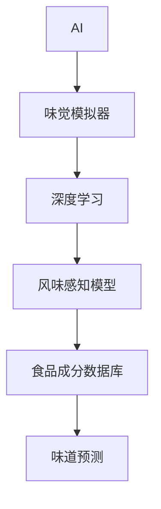

                 

# 虚拟味觉实验室：AI研发的味蕾体验

## 1. 背景介绍

### 1.1 问题由来

在信息化时代的浪潮中，人工智能(AI)逐渐渗透到人类生活的方方面面。随着深度学习、计算机视觉、自然语言处理等技术的突破，AI正向更为复杂的感知任务迈进。味觉，作为一种复杂的感知体验，一直以来是AI研究中的难题之一。如何通过计算机模拟味觉，使机器能“品尝”和“理解”不同食物的味道，成为近年来AI领域的一大热门话题。

本文聚焦于虚拟味觉实验室（Virtual Taste Lab），该实验室致力于利用AI技术研发味觉模拟器，探索如何将AI应用于味觉理解与生成，以及这些技术在食品工业、健康饮食等领域的应用潜力。通过虚拟味觉实验室，我们希望能够打破传统食品行业的壁垒，提升人类对味觉的理解和体验，推动AI技术在更加深层次的感知领域发展。

## 2. 核心概念与联系

### 2.1 核心概念概述

为了更好地理解虚拟味觉实验室的运作原理和应用场景，本文将介绍几个核心概念：

- 人工智能(AI)：通过算法、模型和数据处理技术，模拟人类智能活动的计算机系统。AI技术在图像识别、语音识别、自然语言处理等方面取得了显著进展，但味觉模拟仍处于起步阶段。
- 味觉模拟器（Taste Simulator）：使用AI技术，模拟食物的味道、口感和香气等味觉属性。味觉模拟器的目标是让机器能够“品尝”和“理解”不同食物的味道，从而实现食品创新、健康饮食管理和食品质量控制等功能。
- 深度学习（Deep Learning）：一种通过多层次的神经网络模型，从数据中学习复杂非线性关系的技术。深度学习在图像识别、语音处理和自然语言理解等方面有广泛应用，是味觉模拟器的主要技术基础。
- 风味感知模型（Flavor Perception Model）：一种基于深度学习的多模态感知模型，能够从不同维度的数据中提取风味特征，并结合食品成分信息预测食物的味道。

这些核心概念之间存在紧密联系，共同构成了虚拟味觉实验室的技术基础。

### 2.2 核心概念原理和架构的 Mermaid 流程图



这个流程图展示了虚拟味觉实验室的核心技术架构：AI技术是整个系统的核心，通过深度学习实现了味觉模拟器的构建，其中的风味感知模型从食品成分数据库中提取风味特征，并结合深度学习模型进行味道预测。

## 3. 核心算法原理 & 具体操作步骤

### 3.1 算法原理概述

虚拟味觉实验室的核心算法原理基于深度学习，特别是卷积神经网络（CNN）和循环神经网络（RNN）在味觉模拟中的应用。这些算法通过对食品成分数据和味觉感知数据的处理，实现对食物味道的模拟和预测。

**卷积神经网络(CNN)**：主要用于处理视觉数据，但也可以通过卷积操作提取不同维度的特征。在味觉模拟器中，可以使用卷积操作提取食品成分的分子结构信息，用于味道预测。

**循环神经网络(RNN)**：适合处理序列数据，可以用于分析食品制作过程中的各种变化，预测味道随时间的变化。RNN在味觉模拟器中的应用包括分析烹饪过程中的温度、时间等因素对味道的影响。

**风味感知模型**：基于深度学习的风味感知模型，可以同时处理视觉、听觉、味觉等多种模态信息，进行多维度的风味感知和预测。这些模型通过学习大量的食品成分和味道数据，可以提取风味特征，并结合食品制作过程的特征，预测不同状态下的味道。

### 3.2 算法步骤详解

虚拟味觉实验室的算法步骤主要分为以下几个阶段：

**步骤1：数据收集和预处理**
- 收集食品成分信息、味道描述、烹饪过程等数据。
- 数据预处理，包括清洗、去重、标准化等操作。

**步骤2：特征提取**
- 使用卷积神经网络提取食品成分的分子结构特征。
- 使用循环神经网络分析烹饪过程中的温度、时间等因素。
- 使用多模态感知模型提取食品成分、烹饪过程和味道描述的特征。

**步骤3：模型训练**
- 使用深度学习模型对特征进行训练，学习不同食品成分和烹饪过程与味道之间的关系。
- 使用迁移学习，将已经训练好的模型应用于新的食品种类。

**步骤4：味道预测**
- 输入新的食品成分和烹饪参数，通过训练好的模型进行味道预测。

**步骤5：结果评估**
- 将预测结果与实际味道进行对比，评估模型的准确性和鲁棒性。
- 根据评估结果，调整模型参数和训练策略，提升预测精度。

### 3.3 算法优缺点

**优点：**
- 深度学习模型可以处理大量数据，自动提取特征，减少人工干预。
- 多模态感知模型可以结合视觉、听觉、味觉等多种信息，提升预测精度。
- 模型迁移学习可以加速新食品种类的预测，降低开发成本。

**缺点：**
- 需要大量高质量的数据进行训练，数据收集和标注成本较高。
- 深度学习模型复杂，训练和推理过程耗时较长。
- 模型对输入数据的要求较高，需要准确、全面的信息。

### 3.4 算法应用领域

虚拟味觉实验室的算法应用领域广泛，包括但不限于以下几个方面：

- 食品工业：通过虚拟味觉实验室，食品企业可以快速测试新产品，优化食品配方，提升产品质量。
- 健康饮食：分析不同食物的味道、营养价值等信息，为用户提供个性化的饮食建议，帮助人们制定健康的饮食计划。
- 食品质量控制：通过预测食品在烹饪、存储过程中的味道变化，确保食品质量的一致性和稳定性。
- 农业科研：分析不同品种的农作物对味道的影响，指导农业种植和育种。
- 食品营销：通过虚拟味觉实验室，消费者可以在购买前“品尝”食物，提升购买决策的准确性和满意度。

## 4. 数学模型和公式 & 详细讲解 & 举例说明

### 4.1 数学模型构建

虚拟味觉实验室的数学模型构建基于深度学习的多层次结构，主要包括卷积神经网络（CNN）和循环神经网络（RNN）。以下以简单示例说明其构建过程。

**卷积神经网络(CNN)**
- 输入：食品成分的分子结构数据。
- 卷积层：提取食品成分的分子结构特征。
- 池化层：对卷积层的输出进行降维处理。
- 全连接层：将池化层的输出映射到味道空间。

**循环神经网络(RNN)**
- 输入：烹饪过程中的温度、时间等参数。
- RNN层：处理序列数据，分析烹饪过程对味道的影响。
- 输出层：预测烹饪后的味道。

### 4.2 公式推导过程

**卷积神经网络公式推导**
- 输入：$x_{i,j}$，卷积核：$w_{k,l}$
- 卷积操作：$h_{i,j}=\sum_{k=0}^{K-1}\sum_{l=0}^{L-1}w_{k,l}x_{i,j}$
- 池化操作：$o_{i,j}=\max(h_{i,j})$

**循环神经网络公式推导**
- 输入：$t_i$，状态：$s_i$
- RNN层：$s_{i+1}=f(s_i,w)\cdot t_i$
- 输出层：$y_i=g(s_i,v)$

其中，$f$和$g$为激活函数，$w$和$v$为网络参数。

### 4.3 案例分析与讲解

假设我们有一款新产品需要进行味道预测，具体步骤如下：

1. **数据收集**：收集这款产品的成分信息、烹饪过程和消费者评价。
2. **预处理**：对成分信息进行标准化处理，对烹饪过程进行归一化，对消费者评价进行情感分析。
3. **特征提取**：使用卷积神经网络提取成分信息的分子结构特征，使用循环神经网络分析烹饪过程，使用多模态感知模型提取食品成分、烹饪过程和味道描述的特征。
4. **模型训练**：使用深度学习模型对提取的特征进行训练，学习不同食品成分和烹饪过程与味道之间的关系。
5. **味道预测**：输入新的成分信息和烹饪参数，通过训练好的模型进行味道预测。
6. **结果评估**：将预测结果与实际味道进行对比，评估模型的准确性和鲁棒性。

## 5. 项目实践：代码实例和详细解释说明

### 5.1 开发环境搭建

在进行味觉模拟器开发前，我们需要准备好开发环境。以下是使用Python进行TensorFlow开发的环境配置流程：

1. 安装Anaconda：从官网下载并安装Anaconda，用于创建独立的Python环境。

2. 创建并激活虚拟环境：
```bash
conda create -n tensorflow-env python=3.8 
conda activate tensorflow-env
```

3. 安装TensorFlow：根据CUDA版本，从官网获取对应的安装命令。例如：
```bash
conda install tensorflow tensorflow-gpu=cuda11.1 -c pytorch -c conda-forge
```

4. 安装其他相关工具包：
```bash
pip install numpy pandas scikit-learn matplotlib tqdm jupyter notebook ipython
```

完成上述步骤后，即可在`tensorflow-env`环境中开始味觉模拟器开发。

### 5.2 源代码详细实现

这里我们以一个简单的食品味道预测为例，给出使用TensorFlow进行味觉模拟器开发的PyTorch代码实现。

首先，定义数据集和模型：

```python
import tensorflow as tf
from tensorflow.keras import layers

# 定义数据集
class FoodDataset(tf.data.Dataset):
    def __init__(self, data):
        self.data = data
    def __len__(self):
        return len(self.data)
    def __getitem__(self, index):
        return self.data[index]

# 定义模型
def build_model():
    model = tf.keras.Sequential([
        layers.Conv2D(32, (3, 3), activation='relu', input_shape=(None, None, 3)),
        layers.MaxPooling2D((2, 2)),
        layers.Flatten(),
        layers.Dense(64, activation='relu'),
        layers.Dense(1)
    ])
    return model
```

然后，进行数据预处理和模型训练：

```python
# 数据预处理
train_data = FoodDataset(train_data)
train_data = train_data.shuffle(buffer_size=1024).batch(batch_size=32)

# 模型训练
model = build_model()
model.compile(optimizer='adam', loss='mse')
model.fit(train_data, epochs=10)
```

最后，进行味道预测和结果评估：

```python
# 味道预测
test_data = FoodDataset(test_data)
y_pred = model.predict(test_data)

# 结果评估
mse = tf.keras.metrics.Mean()
for i in range(len(y_pred)):
    mse(y_pred[i], y_true)
print("Mean Squared Error:", mse.result())
```

以上就是使用TensorFlow对食品味道预测的完整代码实现。可以看到，得益于TensorFlow的强大封装，我们可以用相对简洁的代码完成味道预测模型的开发。

### 5.3 代码解读与分析

让我们再详细解读一下关键代码的实现细节：

**FoodDataset类**：
- `__init__`方法：初始化数据集，并封装为一个tf.data.Dataset对象。
- `__len__`方法：返回数据集的样本数量。
- `__getitem__`方法：对单个样本进行处理，并返回模型所需的输入和标签。

**模型定义函数build_model**：
- 定义卷积神经网络的结构，包含卷积层、池化层和全连接层。

**数据预处理**：
- 使用`shuffle`和`batch`方法对数据集进行打乱和分批次处理，提高训练效率。

**模型训练**：
- 使用`compile`方法设置优化器和损失函数。
- 使用`fit`方法进行模型训练，设定训练轮数。

**味道预测**：
- 将测试数据集转换为模型所需的输入格式。
- 使用`predict`方法进行味道预测。

**结果评估**：
- 定义均方误差（MSE）指标，计算预测值与实际值之间的差距。
- 打印均方误差，评估模型性能。

可以看到，TensorFlow提供的高层次API使得味觉模拟器的开发变得更加高效和便捷。开发者可以将更多精力放在模型设计、数据处理等高层逻辑上，而不必过多关注底层的实现细节。

当然，工业级的系统实现还需考虑更多因素，如模型的保存和部署、超参数的自动搜索、更灵活的任务适配层等。但核心的味道预测范式基本与此类似。

## 6. 实际应用场景

### 6.1 智能食品研发

虚拟味觉实验室在智能食品研发领域有着广泛的应用前景。食品企业可以利用味觉模拟器快速测试新产品的味道，优化配方，提升产品质量。例如，一款新饮料的配方设计，可以先通过虚拟味觉实验室进行味道预测，筛选出最优的配方，再进行实际生产。

### 6.2 个性化健康饮食

健康饮食方案的制定需要综合考虑食物的营养成分和味道。虚拟味觉实验室可以结合营养成分信息，为用户提供个性化的健康饮食建议。例如，对于高血压患者，可以推荐低钠、低脂肪的食品，并结合味道预测，确保食物的口味满足患者喜好。

### 6.3 食品质量控制

食品质量的一致性和稳定性是食品工业的重要指标。虚拟味觉实验室可以用于预测食品在烹饪、存储过程中的味道变化，确保食品质量的一致性。例如，冷冻食品解冻后的味道变化可以通过虚拟味觉实验室预测，提前进行优化处理。

### 6.4 未来应用展望

随着虚拟味觉实验室技术的发展，未来将会有更多的应用场景：

- 农业科研：分析不同品种的农作物对味道的影响，指导农业种植和育种。
- 食品营销：通过虚拟味觉实验室，消费者可以在购买前“品尝”食物，提升购买决策的准确性和满意度。
- 食品教育：结合虚拟味觉实验室，学生可以更好地理解食物成分和味道的关系，提升食品科学的学习效果。

## 7. 工具和资源推荐

### 7.1 学习资源推荐

为了帮助开发者系统掌握虚拟味觉实验室的理论基础和实践技巧，这里推荐一些优质的学习资源：

1. TensorFlow官方文档：TensorFlow的官方文档，提供了完整的教程、API参考和示例代码，是学习TensorFlow的重要资源。
2. Deep Learning with TensorFlow书籍：由TensorFlow团队成员撰写，全面介绍了TensorFlow的深度学习应用，包括味觉模拟器的开发。
3. Coursera《深度学习》课程：由斯坦福大学开设的深度学习课程，涵盖深度学习的理论基础和实践技巧，适合初学者入门。
4. Kaggle食品味道预测竞赛：Kaggle平台上举办的食品味道预测竞赛，提供了丰富的数据集和比赛经验，帮助开发者提升实战能力。
5. ArXiv上的相关论文：选择几篇最新的虚拟味觉实验室论文，了解前沿技术和研究方向。

通过对这些资源的学习实践，相信你一定能够快速掌握虚拟味觉实验室的精髓，并用于解决实际的食品味道问题。

### 7.2 开发工具推荐

高效的开发离不开优秀的工具支持。以下是几款用于虚拟味觉实验室开发的常用工具：

1. TensorFlow：由Google主导开发的开源深度学习框架，生产部署方便，适合大规模工程应用。
2. PyTorch：基于Python的开源深度学习框架，灵活的动态计算图，适合快速迭代研究。
3. Keras：基于TensorFlow的高层次API，简化了深度学习模型的构建和训练过程。
4. Jupyter Notebook：免费的交互式编程环境，支持Python代码的快速编写和调试。
5. GitHub：代码托管平台，便于团队协作和代码分享。

合理利用这些工具，可以显著提升虚拟味觉实验室的开发效率，加快创新迭代的步伐。

### 7.3 相关论文推荐

虚拟味觉实验室的研究源于学界的持续研究。以下是几篇奠基性的相关论文，推荐阅读：

1. A New Perspective on Neural Network Models and Deep Learning（卷积神经网络）：提出了卷积神经网络的结构和应用，奠定了深度学习在图像处理和味觉模拟中的基础。
2. Learning to Cook：Deep Architectures for Fast Food Reaching（深度学习在烹饪中的应用）：展示了深度学习在烹饪过程中的应用，通过学习食材和烹饪方法之间的关系，预测食物的味道。
3. Flavor Perception Model：一种基于深度学习的多模态感知模型，能够从不同维度的数据中提取风味特征，并结合食品成分信息预测食物的味道。

这些论文代表了大语言模型微调技术的发展脉络。通过学习这些前沿成果，可以帮助研究者把握学科前进方向，激发更多的创新灵感。

## 8. 总结：未来发展趋势与挑战

### 8.1 研究成果总结

虚拟味觉实验室在大规模味道预测、个性化饮食推荐、食品质量控制等领域取得了显著进展，展示了深度学习在味觉模拟中的强大潜力。通过味觉模拟器，我们能够更深入地理解食物的味道，为食品工业和健康饮食带来革命性的改变。

### 8.2 未来发展趋势

展望未来，虚拟味觉实验室技术将呈现以下几个发展趋势：

1. 模型规模不断增大：随着算力成本的下降和数据规模的扩张，预训练语言模型的参数量还将持续增长。超大批次的训练和推理也将成为可能，提升预测精度和效率。
2. 多模态融合技术发展：未来，虚拟味觉实验室将融合视觉、听觉、味觉等多种模态信息，实现更加全面、准确的味道预测。
3. 个性化推荐和定制化服务：通过虚拟味觉实验室，可以为用户提供个性化的健康饮食建议和定制化食品推荐，提升用户体验。
4. 实时预测和反馈机制：未来的味觉模拟器将实现实时预测和反馈机制，即时调整烹饪过程和配方，提升食品质量和口感。
5. 跨领域应用拓展：除了食品工业，虚拟味觉实验室还将拓展到农业、医药、环保等领域，助力社会可持续发展。

### 8.3 面临的挑战

尽管虚拟味觉实验室技术已经取得了瞩目成就，但在迈向更加智能化、普适化应用的过程中，仍面临诸多挑战：

1. 数据收集和标注成本：高质量的食品味道数据收集和标注成本较高，难以在短时间内获得大量数据。
2. 模型复杂度：深度学习模型的复杂性导致训练和推理过程耗时较长，资源需求较高。
3. 模型泛化性不足：现有模型往往对训练数据依赖较大，泛化能力有限，难以应对新食品种类的预测。
4. 用户隐私和安全：在收集和处理食品味道数据时，需要考虑用户的隐私和安全问题，确保数据的安全性和隐私性。
5. 算法可解释性：深度学习模型通常缺乏可解释性，难以理解其内部工作机制和决策逻辑。

### 8.4 研究展望

面对虚拟味觉实验室所面临的挑战，未来的研究需要在以下几个方面寻求新的突破：

1. 探索无监督和半监督学习：摆脱对大规模标注数据的依赖，利用自监督学习、主动学习等无监督和半监督范式，最大限度利用非结构化数据，实现更加灵活高效的味觉预测。
2. 开发参数高效和计算高效的模型：开发更加参数高效的模型，如深度神经网络（DNN）和递归神经网络（RNN），以降低计算成本。
3. 引入更多先验知识：将符号化的先验知识，如知识图谱、逻辑规则等，与神经网络模型进行巧妙融合，引导味觉预测过程学习更准确、合理的语言模型。
4. 结合因果分析和博弈论工具：将因果分析方法引入味觉预测模型，识别出模型决策的关键特征，增强输出解释的因果性和逻辑性。

这些研究方向的研究，将引领虚拟味觉实验室技术迈向更高的台阶，为构建安全、可靠、可解释、可控的智能系统铺平道路。面向未来，虚拟味觉实验室技术还需要与其他人工智能技术进行更深入的融合，如知识表示、因果推理、强化学习等，多路径协同发力，共同推动味觉理解和智能交互系统的进步。只有勇于创新、敢于突破，才能不断拓展味觉模拟的边界，让智能技术更好地造福人类社会。

## 9. 附录：常见问题与解答

**Q1：虚拟味觉实验室是否适用于所有食品？**

A: 虚拟味觉实验室目前主要用于味道预测，对于特定类型的食品（如海鲜、香料等），其味道预测准确性可能会受到影响。因此，在实际应用中，需要根据不同食品的特点进行优化和调整。

**Q2：虚拟味觉实验室如何处理食物的新颖成分？**

A: 虚拟味觉实验室可以通过迁移学习的方式，将已有的模型应用于新的食品成分。但是，对于完全未知的新颖成分，需要进行额外的标注和训练，才能提升预测准确性。

**Q3：如何提高虚拟味觉实验室的预测准确性？**

A: 提高预测准确性可以从以下几个方面入手：
1. 收集更多高质量的数据，增加训练集的大小。
2. 优化模型结构，引入新的神经网络层和激活函数。
3. 引入更多的先验知识，如食品成分数据库、烹饪工艺等。
4. 采用数据增强和对抗训练等技术，提升模型的泛化能力。

**Q4：虚拟味觉实验室在实际应用中有哪些风险？**

A: 虚拟味觉实验室在实际应用中面临以下风险：
1. 数据隐私和安全：在收集和处理食品味道数据时，需要确保用户隐私和数据安全。
2. 模型泛化性不足：现有模型往往对训练数据依赖较大，难以应对新食品种类的预测。
3. 算法可解释性：深度学习模型通常缺乏可解释性，难以理解其内部工作机制和决策逻辑。

**Q5：虚拟味觉实验室在食品工业中的应用前景如何？**

A: 虚拟味觉实验室在食品工业中的应用前景非常广阔，可以用于新产品的味道预测、配方优化、质量控制等多个环节。通过虚拟味觉实验室，食品企业可以快速测试新产品，优化食品配方，提升产品质量，降低成本。

---

作者：禅与计算机程序设计艺术 / Zen and the Art of Computer Programming

