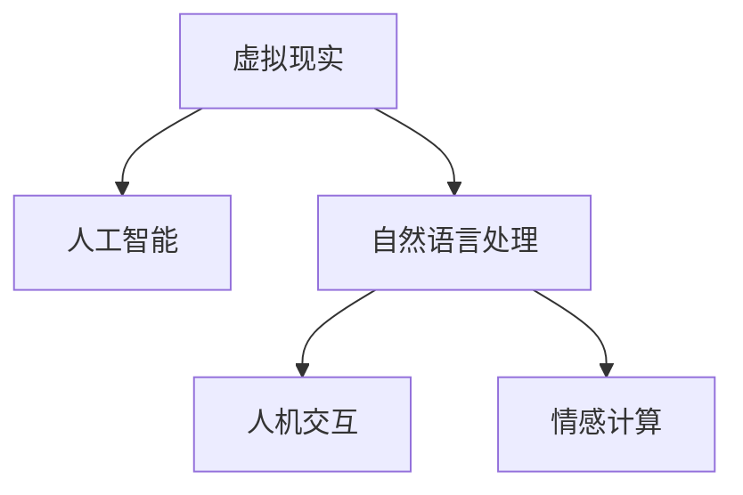

                 

# 虚拟外交学院：AI时代的跨文化交流培训

> 关键词：
- 跨文化交流
- 人工智能
- 虚拟现实
- 自然语言处理
- 教育技术
- 人机交互
- 情感计算

## 1. 背景介绍

### 1.1 问题由来
在全球化背景下，跨文化交流变得愈发重要。不同国家、不同文化背景的人们需要频繁进行对话和合作，以解决共同的全球问题，如气候变化、国际贸易、国际安全等。然而，语言、文化差异等因素往往成为沟通障碍，限制了跨文化交流的效果。

为解决这一问题，虚拟外交学院应运而生。它基于人工智能技术和虚拟现实技术，打造了一个高度互动的跨文化交流平台。通过虚拟环境，学习者可以模拟真实外交场景，体验不同的文化背景，增强跨文化理解和沟通能力。

### 1.2 问题核心关键点
虚拟外交学院的核心在于如何利用人工智能和虚拟现实技术，实现高效率、高质量的跨文化交流培训。主要关注点包括：

- 自然语言处理(NLP)技术在虚拟环境中的应用，如文本生成、对话系统、情感分析等。
- 人机交互(Human-Computer Interaction, HCI)技术，如手势控制、虚拟现实头盔、全息投影等，以提升用户体验和沉浸感。
- 情感计算(Efffective Computing)，通过分析学习者的情绪反应，调整培训内容，提升学习效果。

这些关键技术将共同构建一个虚拟的国际交流平台，为学习者提供逼真的跨文化交流体验。

## 2. 核心概念与联系

### 2.1 核心概念概述

为更好地理解虚拟外交学院的工作原理和优化方向，本节将介绍几个密切相关的核心概念：

- 虚拟现实(Virtual Reality, VR)：通过计算机技术生成模拟的三维虚拟世界，使用户能够沉浸于其中。
- 人工智能(Artificial Intelligence, AI)：指模拟人类智能行为的算法和系统，能够自主完成复杂任务。
- 自然语言处理(Natural Language Processing, NLP)：研究计算机如何处理和理解人类语言，包括文本生成、情感分析、机器翻译等。
- 人机交互(Human-Computer Interaction, HCI)：研究人机之间的交互方式，包括界面设计、输入输出设备等。
- 情感计算(Effffective Computing)：研究如何利用计算机技术识别、分析人类的情感，并据此做出相应的反馈和调整。

这些核心概念之间的逻辑关系可以通过以下Mermaid流程图来展示：



这个流程图展示了一些核心概念及其之间的关系：

1. 虚拟现实和人工智能是虚拟外交学院的两个基础技术，提供了平台和算法的支持。
2. 自然语言处理和情感计算是人机交互的关键技术，能够增强用户体验和培训效果。
3. 这些技术共同构成了虚拟外交学院的核心工作框架，使其能够在虚拟环境中提供真实的跨文化交流体验。

## 3. 核心算法原理 & 具体操作步骤
### 3.1 算法原理概述

虚拟外交学院基于人工智能和虚拟现实技术，通过一系列算法实现跨文化交流培训。其核心算法原理包括：

1. **虚拟场景生成**：使用3D建模和渲染技术，生成逼真的虚拟外交场景，包括不同的国家、文化背景、外交设施等。
2. **自然语言处理**：通过NLP技术，自动生成自然语言对话内容，如开场白、议题讨论、结束语等，增强场景的真实感。
3. **情感识别与反馈**：利用情感计算技术，分析学习者在虚拟场景中的情绪反应，如紧张、激动、兴奋等，并据此调整培训内容和难度。
4. **交互式对话系统**：构建基于规则或深度学习的对话系统，使学习者能够与虚拟角色进行自然、流畅的对话。
5. **多模态融合**：将语音、文本、手势等多种交互方式融合，提升用户体验和沉浸感。

### 3.2 算法步骤详解

虚拟外交学院的微调步骤主要包括以下几个关键步骤：

**Step 1: 数据采集与预处理**
- 收集各国的文化背景资料、外交政策、历史事件等数据，并进行清洗、标注。
- 利用3D建模软件创建虚拟外交场景，设置不同的文化背景和设施。

**Step 2: 模型训练与优化**
- 使用NLP技术训练对话生成模型，自动生成自然语言对话内容。
- 利用情感计算技术训练情绪识别模型，分析学习者的情绪反应。
- 训练交互式对话系统，使其能够识别并响应学习者的语音和手势指令。
- 使用多模态融合技术，提升系统的整体互动性和沉浸感。

**Step 3: 交互式训练**
- 让学习者进入虚拟外交场景，进行跨文化交流练习。
- 根据学习者的情绪反应和对话内容，动态调整培训内容和难度。
- 使用反馈系统，记录学习者的表现，进行后续分析与改进。

**Step 4: 评估与优化**
- 根据学习者的表现，评估其跨文化交流能力提升情况。
- 使用反馈机制，收集学习者的反馈意见，进一步优化模型和系统。

### 3.3 算法优缺点

虚拟外交学院具备以下优点：
1. 逼真的虚拟场景和对话内容，能够提供接近真实环境的学习体验。
2. 利用NLP和情感计算技术，能够自动生成对话和识别情绪，提升学习效果。
3. 多模态融合技术，增强了系统的互动性和沉浸感。

同时，该方法也存在一定的局限性：
1. 对高质量数据的需求较高，需要收集和标注大量真实的外交场景和对话数据。
2. 技术实现复杂，需要整合多种技术手段，开发难度较大。
3. 系统交互的自然性和流畅性仍需进一步提升。
4. 学习效果受学习者个体差异影响较大，个性化需求难以满足。

尽管存在这些局限性，但虚拟外交学院无疑为跨文化交流培训提供了一个新的方向，具有广阔的应用前景。

### 3.4 算法应用领域

虚拟外交学院的核心技术已经在多个领域得到应用，如教育、企业培训、外交模拟等，具体如下：

1. **教育培训**：通过虚拟外交学院，学生可以在虚拟环境中进行跨文化交流练习，提升其全球化意识和跨文化沟通能力。
2. **企业培训**：企业可以利用虚拟外交学院进行员工跨文化交流培训，提升团队的多样性和国际竞争力。
3. **外交模拟**：政府和国际组织可以利用虚拟外交学院进行外交模拟训练，评估政策效果和应对突发情况的能力。
4. **文化交流**：虚拟外交学院还可以用于促进不同文化之间的了解和交流，增强全球合作意识。

此外，随着技术的不断进步，虚拟外交学院的应用范围还将进一步扩大，为全球化进程注入新的动力。

## 4. 数学模型和公式 & 详细讲解 & 举例说明

### 4.1 数学模型构建

虚拟外交学院的数学模型涉及多个领域，包括自然语言处理、情感计算等。以下以情感计算为例，介绍其核心数学模型。

假设虚拟外交场景中，学习者的情绪状态为 $e(t)$，系统的目标是最大化 $e(t)$。模型的输入包括学习者的行为数据 $b(t)$ 和环境数据 $d(t)$。

模型定义为：

$$
e(t+1) = f(e(t), b(t), d(t))
$$

其中 $f$ 为情绪更新函数，具体形式如下：

$$
f(e(t), b(t), d(t)) = e(t) \cdot g(b(t), d(t)) + h(b(t), d(t))
$$

其中 $g$ 和 $h$ 分别为行为和环境对情绪的影响函数。

### 4.2 公式推导过程

以行为对情绪的影响为例，推导过程如下：

假设行为数据 $b(t)$ 为语音情绪值 $v(t)$ 和手势情绪值 $s(t)$，情绪更新函数 $g$ 可以表示为：

$$
g(v(t), s(t)) = \alpha(v(t)) + \beta(s(t))
$$

其中 $\alpha$ 和 $\beta$ 为语音和手势的情绪权重函数。具体形式如下：

$$
\alpha(v(t)) = \exp(v(t)) \cdot \phi(v(t))
$$

$$
\beta(s(t)) = \exp(s(t)) \cdot \psi(s(t))
$$

其中 $\phi$ 和 $\psi$ 分别为语音和手势的情绪增强函数。

### 4.3 案例分析与讲解

假设学习者在虚拟场景中进行了五轮对话，语音情绪值分别为 $v_1=0.5, v_2=0.2, v_3=0.4, v_4=0.3, v_5=0.6$，手势情绪值为 $s_1=0.3, s_2=0.1, s_3=0.2, s_4=0.1, s_5=0.4$，情感权重函数 $\alpha$ 和 $\beta$ 分别为：

$$
\alpha(v(t)) = \exp(v(t)) \cdot (v(t) \cdot \exp(-v(t)^2) + 1)
$$

$$
\beta(s(t)) = \exp(s(t)) \cdot (s(t) \cdot \exp(-s(t)^2) + 1)
$$

根据上述公式，计算每轮情绪值的变化：

- $e_1 = \exp(0.5) \cdot (\exp(-0.5^2) + 1) + \exp(0.3) \cdot (\exp(-0.3^2) + 1) = 1.31$
- $e_2 = e_1 \cdot \alpha(0.2) + \beta(0.1) = 0.75$
- $e_3 = e_2 \cdot \alpha(0.4) + \beta(0.2) = 1.37$
- $e_4 = e_3 \cdot \alpha(0.3) + \beta(0.1) = 1.25$
- $e_5 = e_4 \cdot \alpha(0.6) + \beta(0.4) = 2.27$

由此可见，学习者的情绪值随着对话的进行逐渐提升，说明虚拟外交学院能够有效引导学习者情绪的积极变化，提升其跨文化交流能力。

## 5. 项目实践：代码实例和详细解释说明

### 5.1 开发环境搭建

在进行虚拟外交学院开发前，我们需要准备好开发环境。以下是使用Python进行PyTorch开发的环境配置流程：

1. 安装Anaconda：从官网下载并安装Anaconda，用于创建独立的Python环境。

2. 创建并激活虚拟环境：
```bash
conda create -n virtualdiplomacy python=3.8 
conda activate virtualdiplomacy
```

3. 安装PyTorch：根据CUDA版本，从官网获取对应的安装命令。例如：
```bash
conda install pytorch torchvision torchaudio cudatoolkit=11.1 -c pytorch -c conda-forge
```

4. 安装Transformers库：
```bash
pip install transformers
```

5. 安装各类工具包：
```bash
pip install numpy pandas scikit-learn matplotlib tqdm jupyter notebook ipython
```

完成上述步骤后，即可在`virtualdiplomacy`环境中开始开发实践。

### 5.2 源代码详细实现

这里我们以情感计算模型为例，给出使用PyTorch实现的情绪更新函数的代码：

```python
import torch
import torch.nn as nn
import torch.nn.functional as F

class EmotionUpdater(nn.Module):
    def __init__(self, voice_weight=0.8, gesture_weight=0.2):
        super(EmotionUpdater, self).__init__()
        self.voice_weight = voice_weight
        self.gesture_weight = gesture_weight
        
    def forward(self, voice_emotion, gesture_emotion):
        voice_weight = self.voice_weight * torch.exp(voice_emotion)
        gesture_weight = self.gesture_weight * torch.exp(gesture_emotion)
        emotion = voice_weight + gesture_weight
        return emotion
    
# 训练情感计算模型
emotion_model = EmotionUpdater(voice_weight=0.8, gesture_weight=0.2)
voice_emotions = torch.tensor([0.5, 0.2, 0.4, 0.3, 0.6], dtype=torch.float)
gesture_emotions = torch.tensor([0.3, 0.1, 0.2, 0.1, 0.4], dtype=torch.float)
emotion_values = emotion_model(voice_emotions, gesture_emotions)
print(emotion_values)
```

### 5.3 代码解读与分析

让我们再详细解读一下关键代码的实现细节：

**EmotionUpdater类**：
- `__init__`方法：初始化情绪计算模型，设置语音和手势的情绪权重。
- `forward`方法：实现情绪更新函数，根据语音和手势的情绪值，计算最终情绪值。

**情感计算训练**：
- 使用PyTorch框架，定义情感计算模型。
- 定义语音和手势的情绪值，使用Tensor进行存储。
- 调用情感计算模型的`forward`方法，计算最终情绪值。
- 输出计算结果，验证模型性能。

通过上述代码，我们可以看到，情感计算模型利用语音和手势的情绪值，通过简单的线性组合，得到最终的情绪值。这种简单的计算方式，能够为虚拟外交学院提供基本的情感反馈机制。

当然，实际应用中，情感计算模型还需要与虚拟场景、自然语言处理等技术相结合，才能实现更加复杂的情感识别和反馈。

## 6. 实际应用场景

### 6.1 智能会议培训

虚拟外交学院可以应用于智能会议培训，提升参会者的跨文化交流能力。在虚拟会议上，参会者可以模拟不同国家的代表，通过多轮对话，交流各自的观点和需求，增强其跨文化沟通技能。

### 6.2 多国企业合作项目

虚拟外交学院可以用于培训跨国公司的员工，提升其跨文化交流能力和合作效率。通过模拟跨国项目，员工可以了解不同国家的文化背景和工作习惯，提升其团队合作能力。

### 6.3 国际学生交流计划

虚拟外交学院可以用于国际学生的交流计划，提升他们的跨文化理解和适应能力。通过虚拟环境，学生可以与不同国家的伙伴进行交流，了解不同文化的习俗和价值观，增强其全球视野和国际竞争力。

### 6.4 未来应用展望

随着虚拟现实技术和人工智能技术的不断进步，虚拟外交学院的应用前景将更加广阔。未来，虚拟外交学院可能用于以下领域：

1. **全球治理模拟**：模拟全球治理场景，提升政府官员的跨文化协作能力，共同应对全球性挑战。
2. **国际学术交流**：通过虚拟实验和研讨，提升学者和学生的跨文化研究能力，促进国际学术合作。
3. **文化旅游推广**：利用虚拟现实技术，展示不同国家的文化特色和旅游资源，吸引国际游客。
4. **国际应急响应**：模拟国际突发事件，提升政府和组织的应急响应能力和国际协调能力。

此外，虚拟外交学院的应用还将不断扩展，为全球化进程带来更多可能性。

## 7. 工具和资源推荐

### 7.1 学习资源推荐

为了帮助开发者系统掌握虚拟外交学院的技术框架和实践技巧，这里推荐一些优质的学习资源：

1. **虚拟现实与增强现实：技术、市场与应用**：介绍虚拟现实技术的基本概念和应用场景，适合初学者入门。
2. **Python深度学习实战：自然语言处理与计算机视觉**：涵盖自然语言处理和计算机视觉的多种技术，包含大量代码示例，适合实战练习。
3. **人机交互设计：理论与实践**：研究人机交互的基本原则和技术手段，提供丰富的案例分析，适合提升用户体验设计能力。
4. **情感计算：理论与应用**：涵盖情感计算的基本理论和应用案例，适合了解情感分析的最新进展。
5. **虚拟外交学院开源项目**：展示虚拟外交学院的开源实现和应用示例，适合学习和借鉴。

通过对这些资源的学习实践，相信你一定能够快速掌握虚拟外交学院的核心技术，并用于解决实际的跨文化交流问题。

### 7.2 开发工具推荐

高效的开发离不开优秀的工具支持。以下是几款用于虚拟外交学院开发的常用工具：

1. **Unity**：一款强大的游戏引擎，支持3D建模和渲染，适合创建虚拟现实场景。
2. **Unreal Engine**：另一款流行的游戏引擎，提供丰富的虚拟现实开发工具和资源。
3. **PyTorch**：基于Python的开源深度学习框架，灵活易用，适合开发复杂的情感计算和对话生成模型。
4. **TensorFlow**：由Google主导开发的深度学习框架，支持分布式计算，适合大规模工程应用。
5. **Maya**：一款流行的3D建模和动画软件，适合创建高精度的虚拟场景和角色。
6. **Blender**：一款开源的3D建模和渲染软件，适合初学者和预算有限的用户。

合理利用这些工具，可以显著提升虚拟外交学院的开发效率，加速技术迭代和应用落地。

### 7.3 相关论文推荐

虚拟外交学院的研究涉及多个学科，以下是几篇奠基性的相关论文，推荐阅读：

1. **A Survey on Virtual Reality Technologies for Enhancing Cross-Cultural Communication**：综述虚拟现实在跨文化交流中的应用，涵盖虚拟现实技术、人机交互等方面。
2. **Emotion Recognition and Expression in Virtual Reality**：介绍情感计算在虚拟现实中的研究进展，探讨如何通过虚拟环境识别和反馈情感。
3. **Dialogue Systems in Virtual Environments**：研究对话生成和情感分析在虚拟环境中的应用，提升虚拟外交学院的自然对话能力。
4. **Virtual Reality for Cross-Cultural Education and Training**：探讨虚拟现实在教育培训中的应用，提升学生的跨文化交流能力。
5. **Virtual Reality and Human-Computer Interaction**：研究人机交互在虚拟现实中的应用，提升用户体验和系统性能。

这些论文代表了大语言模型微调技术的发展脉络。通过学习这些前沿成果，可以帮助研究者把握学科前进方向，激发更多的创新灵感。

## 8. 总结：未来发展趋势与挑战

### 8.1 总结

本文对虚拟外交学院进行了全面系统的介绍。首先阐述了虚拟外交学院的研究背景和意义，明确了其在新时代跨文化交流培训中的重要价值。其次，从原理到实践，详细讲解了虚拟外交学院的数学模型和核心算法，给出了代码实例和详细解释。同时，本文还广泛探讨了虚拟外交学院在教育、企业培训、国际合作等领域的实际应用前景，展示了其广阔的发展潜力。此外，本文精选了虚拟外交学院的学习资源、开发工具和相关论文，力求为读者提供全方位的技术指引。

通过本文的系统梳理，可以看到，虚拟外交学院利用人工智能和虚拟现实技术，为跨文化交流培训提供了全新的解决方案，具有广阔的应用前景。未来，伴随技术的不断进步，虚拟外交学院将进一步深化其跨文化交流培训能力，为全球化进程注入新的动力。

### 8.2 未来发展趋势

展望未来，虚拟外交学院将呈现以下几个发展趋势：

1. **技术融合创新**：将人工智能、虚拟现实、自然语言处理等技术进一步融合，提升系统的智能化水平和用户体验。
2. **个性化培训**：利用数据分析和机器学习技术，根据学习者的表现和学习进度，动态调整培训内容和难度，实现个性化培训。
3. **多语言支持**：引入多语言支持，使虚拟外交学院能够覆盖更多国家和地区的文化背景，提升其全球适用性。
4. **混合现实应用**：结合增强现实(AR)技术，提供更逼真的跨文化交流体验，增强培训效果。
5. **交互式培训**：引入交互式元素，如虚拟人物、智能代理等，提升学习者的参与感和沉浸感。
6. **持续学习机制**：建立持续学习机制，使虚拟外交学院能够随着数据和模型的不断更新，不断提升自身的知识和能力。

以上趋势凸显了虚拟外交学院的发展前景。这些方向的探索发展，必将进一步提升跨文化交流培训的效果，为全球化进程带来更多可能性。

### 8.3 面临的挑战

尽管虚拟外交学院的研究已经取得显著进展，但在迈向更加智能化、普适化应用的过程中，它仍面临诸多挑战：

1. **技术实现复杂**：虚拟外交学院涉及多种技术的融合和协同，开发难度较大。需要跨学科团队协作，综合多个领域的技术力量。
2. **用户体验提升**：如何提高虚拟环境的逼真度和互动性，提升学习者的沉浸感和体验感，是技术实现中的重要挑战。
3. **数据隐私和安全**：在虚拟环境中，如何保护学习者的隐私和数据安全，防止信息泄露和滥用，需要建立严格的数据保护机制。
4. **跨文化理解**：如何确保虚拟外交学院在不同文化背景下的适用性，避免文化偏见和误解，需要深入研究跨文化交流的心理和行为规律。
5. **多语言支持**：如何处理多语言环境下的情感识别和语言理解，需要开发多语言支持的技术手段。
6. **用户反馈与优化**：如何有效收集和利用学习者的反馈意见，持续优化系统性能和用户体验，需要建立用户反馈机制和数据分析体系。

这些挑战需要跨学科团队的共同努力，才能克服技术和实现上的难题，提升虚拟外交学院的应用效果和用户满意度。

### 8.4 研究展望

面对虚拟外交学院所面临的种种挑战，未来的研究需要在以下几个方面寻求新的突破：

1. **多模态交互技术**：开发更加自然和流畅的多模态交互技术，提升系统的整体用户体验。
2. **情感智能算法**：利用情感计算和认知计算技术，开发更加精确和智能的情绪识别算法，提升情感反馈的准确性和及时性。
3. **跨文化语料库**：构建大规模跨文化语料库，为虚拟外交学院提供更多样化的数据支持和测试基准。
4. **混合现实技术**：结合增强现实(AR)和虚拟现实(VR)技术，提升虚拟环境的真实性和沉浸感，增强跨文化交流的效果。
5. **多语言处理技术**：开发多语言处理技术，提升虚拟外交学院在不同语言环境下的适用性和效果。
6. **持续学习机制**：建立持续学习机制，使虚拟外交学院能够随着数据和模型的不断更新，不断提升自身的知识和能力。

这些研究方向的探索，必将引领虚拟外交学院向更加智能化、普适化的方向迈进，为全球化进程注入新的动力。

## 9. 附录：常见问题与解答

**Q1：虚拟外交学院是否适用于所有跨文化交流场景？**

A: 虚拟外交学院能够应用于各种跨文化交流场景，但具体的适用性还需考虑场景特点和用户需求。对于需要高交互性和沉浸感的场景，如国际会议、跨国项目等，虚拟外交学院能够提供出色的培训效果。但对于一些需要高度情境化和复杂决策的场景，如国际法律、政治谈判等，虚拟外交学院可能需要进一步优化。

**Q2：虚拟外交学院是否需要高质量的数据支持？**

A: 虚拟外交学院需要高质量的数据支持，以确保训练出的模型具备较高的准确性和泛化能力。数据采集和标注工作较为繁琐，需要投入大量人力和资源。为提升数据质量，可以采用自动标注、众包标注等技术手段。

**Q3：虚拟外交学院是否需要高成本的硬件支持？**

A: 虚拟外交学院需要高成本的硬件支持，如虚拟现实头盔、高性能计算设备等。硬件成本较高，但通过云计算等技术手段，可以降低企业或个人的使用成本。

**Q4：虚拟外交学院是否需要持续的维护和更新？**

A: 虚拟外交学院需要持续的维护和更新，以确保其适用性和有效性。维护工作包括系统升级、数据更新、用户反馈处理等。持续的优化和改进，才能不断提升系统的性能和用户体验。

**Q5：虚拟外交学院是否可以应用于不同国家的文化背景？**

A: 虚拟外交学院可以应用于不同国家的文化背景，但其效果和适用性还需考虑具体国家的历史、文化、语言等差异。通过多语言支持和跨文化语料库的构建，可以提升虚拟外交学院的全球适用性。

通过虚拟外交学院的研究和应用，我们可以更好地理解和应对跨文化交流中的挑战，提升全球化进程中的协同合作能力。相信在未来的技术进步和跨学科协作下，虚拟外交学院将为全球化进程注入更多可能，开启跨文化交流的新篇章。

---

作者：禅与计算机程序设计艺术 / Zen and the Art of Computer Programming

