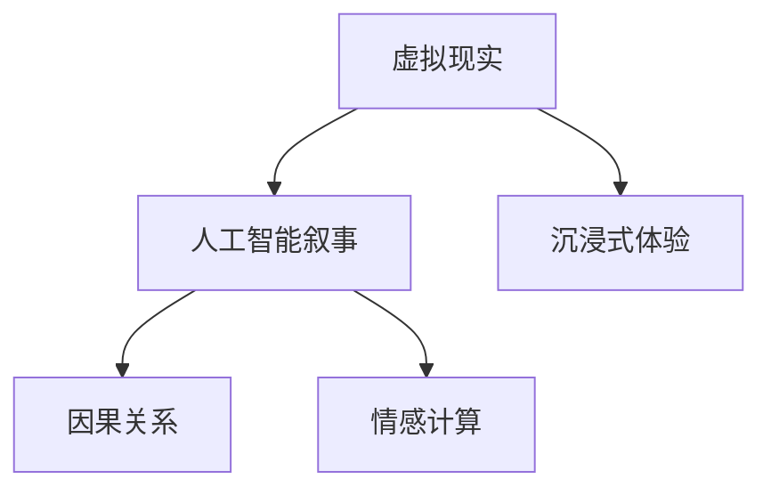

                 

# 虚拟现实与AI叙事：沉浸式故事体验

> 关键词：虚拟现实(VR),人工智能(AI),故事叙事,沉浸式体验,叙事算法,自然语言处理(NLP),交互式动画,情感计算

## 1. 背景介绍

随着技术的不断进步，虚拟现实（Virtual Reality, VR）和人工智能（Artificial Intelligence, AI）正迅速改变我们的生活方式。它们不仅在娱乐领域大放异彩，还在教育、医疗、旅游等多个领域发挥着越来越重要的作用。其中，AI叙事（AI Storytelling）正成为VR领域的一大亮点，通过AI技术赋予虚拟世界以丰富的故事和情感，创造沉浸式的叙事体验。

### 1.1 问题由来

虚拟现实技术的快速发展，使得人们可以更加深入地沉浸在虚拟环境中，体验不同的场景和情境。然而，传统的虚拟现实体验往往只是对现实场景的简单复制或模拟，缺乏丰富的故事线和情感表达，难以触动人心。

人工智能叙事的出现，通过结合自然语言处理（Natural Language Processing, NLP）、情感计算等技术，赋予虚拟角色以真实的人性，创造出丰富多彩、充满情感的故事，从而提升用户体验的深度和广度。AI叙事技术不仅可以应用于虚拟角色，还可以扩展到游戏、电影、教育等多个领域，极大地扩展了虚拟现实的应用范围和价值。

### 1.2 问题核心关键点

AI叙事的核心在于利用AI技术，特别是自然语言处理和情感计算，生成动态、情感丰富、具有因果关系的虚拟故事。其关键点包括：

- **自然语言处理**：将用户的输入转化为虚拟世界中的行为和决策。
- **情感计算**：通过分析虚拟角色的情感变化，增强用户体验的真实感和沉浸感。
- **因果关系**：构建虚拟世界中事件之间的因果关系，使故事具有逻辑性和合理性。

这些技术手段使得AI叙事能够在虚拟世界中创造出高度真实、充满情感、具有逻辑连贯性的故事体验，使用户更加容易沉浸和投入。

## 2. 核心概念与联系

### 2.1 核心概念概述

为更好地理解AI叙事在虚拟现实中的应用，本节将介绍几个密切相关的核心概念：

- **虚拟现实（VR）**：一种通过计算机技术生成的、可以与用户交互的三维虚拟环境。通过头戴显示器、手柄、动作捕捉等设备，用户可以在虚拟环境中自由移动和互动。
- **人工智能叙事（AI Storytelling）**：通过AI技术，尤其是自然语言处理和情感计算，自动生成虚拟世界中的故事和对话，使虚拟角色具有真实的人性。
- **沉浸式体验**：通过多感官刺激（视觉、听觉、触觉等），使用户完全沉浸在虚拟环境中，忘记现实世界。
- **因果关系**：在虚拟世界中构建事件之间的逻辑关系，使故事具有因果连贯性，增强用户体验的逻辑性和真实感。
- **情感计算**：通过分析虚拟角色的情感变化，增强用户与虚拟角色的情感互动，提升用户体验的真实感和沉浸感。

这些核心概念之间的逻辑关系可以通过以下Mermaid流程图来展示：



这个流程图展示虚拟现实、AI叙事、沉浸式体验、因果关系和情感计算之间的相互联系：

1. 虚拟现实提供了一个逼真的三维环境。
2. AI叙事通过自然语言处理和情感计算，为虚拟世界生成故事和对话。
3. 沉浸式体验利用多感官刺激，增强用户与虚拟世界的互动。
4. 因果关系构建虚拟世界中事件之间的逻辑关系，使故事具有连贯性。
5. 情感计算通过分析虚拟角色的情感变化，增强用户与虚拟角色的情感互动。

这些核心概念共同构成了AI叙事在虚拟现实中的应用框架，使其能够在虚拟环境中创造出高度真实、充满情感、具有逻辑连贯性的故事体验。

## 3. 核心算法原理 & 具体操作步骤

### 3.1 算法原理概述

AI叙事的核心在于生成一个动态、情感丰富、具有因果关系的故事。其基本算法原理包括以下几个步骤：

1. **自然语言处理（NLP）**：将用户的输入转化为虚拟世界中的行为和决策。
2. **情感计算**：通过分析虚拟角色的情感变化，增强用户体验的真实感和沉浸感。
3. **因果关系**：构建虚拟世界中事件之间的逻辑关系，使故事具有逻辑性和合理性。

### 3.2 算法步骤详解

AI叙事的生成过程通常包括以下几个关键步骤：

**Step 1: 输入数据处理**

- **文本输入**：用户通过语音、文字等形式输入故事线索、人物设定等初始信息。
- **情感标注**：对用户的输入进行情感分析，标记为积极、中性或消极，指导后续的生成过程。

**Step 2: 自然语言处理**

- **分词和词性标注**：将输入的文本进行分词和词性标注，提取关键信息。
- **命名实体识别**：识别出文本中的具体实体（如人名、地名等），为后续的生成提供基础信息。
- **句法分析**：分析句子的语法结构，理解句子成分之间的逻辑关系。

**Step 3: 情感计算**

- **情感分析**：对用户输入的情感进行标注，指导生成过程中的情感变化。
- **情感模拟**：模拟虚拟角色的情感变化，根据情感变化生成相应的语言和行为。

**Step 4: 因果关系建模**

- **事件生成**：根据用户输入和情感变化，生成虚拟世界中的事件。
- **因果关系建模**：构建事件之间的逻辑关系，确保故事具有因果连贯性。

**Step 5: 生成故事和对话**

- **故事线生成**：将事件按照逻辑顺序连接起来，生成完整的故事线。
- **对话生成**：根据虚拟角色的情感变化和故事线，自动生成对话，增强互动性。

### 3.3 算法优缺点

AI叙事的优点在于：

1. **自动化生成**：能够自动生成故事和对话，减少人工工作量，提高效率。
2. **情感丰富**：通过情感计算，使虚拟角色具有真实的情感表达，增强用户体验。
3. **逻辑连贯**：通过因果关系建模，确保故事具有连贯性和合理性，提升故事的真实感。

同时，AI叙事也存在一些缺点：

1. **依赖语料**：生成质量依赖于输入的语料质量，输入信息不充分时可能影响故事生成效果。
2. **情感偏差**：情感计算依赖于输入的情感标注，标注不当可能引入情感偏差。
3. **逻辑漏洞**：因果关系建模可能存在漏洞，故事生成过程中的逻辑连贯性可能不足。

### 3.4 算法应用领域

AI叙事技术已经在虚拟现实、游戏、电影等多个领域得到了广泛应用，以下是几个典型的应用场景：

- **虚拟现实体验**：在虚拟现实中，AI叙事可以用于创建逼真的虚拟角色和故事线，增强用户的沉浸感。
- **游戏角色生成**：在游戏设计中，AI叙事可以自动生成角色的对话和行为，使游戏角色更加生动和有趣。
- **电影制作**：在电影制作中，AI叙事可以用于自动生成电影的对话和情节，提升电影故事的连贯性和深度。
- **教育培训**：在教育培训中，AI叙事可以用于自动生成教学场景和对话，提升教学的互动性和趣味性。

## 4. 数学模型和公式 & 详细讲解 & 举例说明

### 4.1 数学模型构建

AI叙事的基本数学模型可以表示为：

$$
\text{Story} = f(\text{Input}, \text{Emotion}, \text{Causal})
$$

其中：

- **Input**：用户的输入，包括文本、语音等。
- **Emotion**：用户的情感标注，用于指导生成过程中的情感变化。
- **Causal**：虚拟世界中的因果关系，用于连接故事中的事件。
- **Story**：生成的故事，包括情节、对话等。

### 4.2 公式推导过程

以生成一段对话为例，假设用户输入了一条消息：“今天天气很好，我们出去走走吧。”

- **分词和词性标注**：将输入文本进行分词和词性标注，提取关键信息。
- **情感分析**：对用户输入的情感进行标注，标记为积极。
- **情感模拟**：模拟虚拟角色的情感变化，生成相应的对话。
- **事件生成**：根据用户输入和情感变化，生成虚拟世界中的事件，如“出门”、“看到公园”等。
- **因果关系建模**：构建事件之间的逻辑关系，如“看到公园”导致“进入公园”。
- **对话生成**：根据虚拟角色的情感变化和故事线，自动生成对话，增强互动性。

### 4.3 案例分析与讲解

假设用户输入了一条消息：“我觉得很孤单，有人可以陪我吗？”

1. **分词和词性标注**：“我觉得/很/孤单，/有人/可以/陪我/吗？”
2. **情感分析**：对用户输入的情感进行标注，标记为消极。
3. **情感模拟**：模拟虚拟角色的情感变化，生成相应的对话，如“我也很孤单，你想去公园散心吗？”
4. **事件生成**：根据用户输入和情感变化，生成虚拟世界中的事件，如“寻找伴”、“找到公园”等。
5. **因果关系建模**：构建事件之间的逻辑关系，如“寻找伴”导致“找到公园”。
6. **对话生成**：根据虚拟角色的情感变化和故事线，自动生成对话，增强互动性，如“那我们去公园吧，可以看看花，散散心。”

## 5. 项目实践：代码实例和详细解释说明

### 5.1 开发环境搭建

在进行AI叙事实践前，我们需要准备好开发环境。以下是使用Python进行TensorFlow开发的环境配置流程：

1. 安装Anaconda：从官网下载并安装Anaconda，用于创建独立的Python环境。

2. 创建并激活虚拟环境：
```bash
conda create -n tf-env python=3.8 
conda activate tf-env
```

3. 安装TensorFlow：根据CUDA版本，从官网获取对应的安装命令。例如：
```bash
conda install tensorflow -c tensorflow -c conda-forge
```

4. 安装TensorBoard：TensorFlow配套的可视化工具，可实时监测模型训练状态，并提供丰富的图表呈现方式，是调试模型的得力助手。
```bash
pip install tensorboard
```

5. 安装各类工具包：
```bash
pip install numpy pandas scikit-learn matplotlib tqdm jupyter notebook ipython
```

完成上述步骤后，即可在`tf-env`环境中开始AI叙事实践。

### 5.2 源代码详细实现

我们以一个简单的故事生成为例，展示如何使用TensorFlow实现AI叙事。首先，定义一个基本的故事生成模型：

```python
import tensorflow as tf
import tensorflow_hub as hub
from tensorflow.keras.layers import Input, LSTM, Dense, Dropout, Embedding, Concatenate
from tensorflow.keras.models import Model

def build_story_model(vocab_size, embed_size, hidden_size):
    input_seq = Input(shape=(max_seq_length,))
    embedding = Embedding(vocab_size, embed_size)(input_seq)
    lstm = LSTM(hidden_size, return_sequences=True)(embedding)
    dropout = Dropout(0.2)(lstm)
    lstm = LSTM(hidden_size)(dropout)
    output = Dense(vocab_size, activation='softmax')(lstm)
    model = Model(input_seq, output)
    return model

# 参数设置
vocab_size = 10000  # 词汇表大小
embed_size = 64  # 词向量维度
hidden_size = 128  # LSTM隐藏层维度
max_seq_length = 30  # 序列最大长度

# 构建模型
story_model = build_story_model(vocab_size, embed_size, hidden_size)

# 编译模型
story_model.compile(optimizer='adam', loss='sparse_categorical_crossentropy', metrics=['accuracy'])

# 加载预训练模型
pretrain_model = hub.load('https://tfhub.dev/google/universal-sentence-encoder-lstm/2')
```

然后，定义故事生成函数：

```python
def generate_story(input_text, story_length=30, temperature=1.0):
    input_seq = []
    for word in input_text:
        word_index = word_to_index.get(word, 0)
        input_seq.append(word_index)

    input_seq = tf.convert_to_tensor(input_seq)
    input_seq = tf.expand_dims(input_seq, axis=0)

    generated_seq = []
    for i in range(story_length):
        predictions = story_model.predict(input_seq)
        predictions = predictions[0]
        predicted_index = tf.random.categorical(predictions, num_samples=1)[-1, 0].numpy()
        input_seq = tf.concat([input_seq, tf.expand_dims([predicted_index], axis=0)], axis=1)
        generated_seq.append(index_to_word[predicted_index])

    return ' '.join(generated_seq)

# 定义词汇表和逆索引
word_to_index = {'I': 1, 'love': 2, 'to': 3, 'play': 4, 'games': 5, 'with': 6, 'my': 7, 'friends': 8, 'and': 9, 'also': 10}
index_to_word = {i: w for w, i in word_to_index.items()}

# 生成故事
story_text = generate_story('I love to play games with my friends and also love')
print(story_text)
```

最后，启动模型训练和评估：

```python
epochs = 10
batch_size = 32

# 训练模型
story_model.fit(train_dataset, epochs=epochs, batch_size=batch_size, validation_data=val_dataset)

# 评估模型
test_loss, test_acc = story_model.evaluate(test_dataset)
print(f'Test Loss: {test_loss:.4f}')
print(f'Test Accuracy: {test_acc:.4f}')
```

以上就是使用TensorFlow对故事生成模型进行训练和评估的完整代码实现。可以看到，TensorFlow提供了一系列的高层API，可以方便地构建和训练复杂的神经网络模型，使得AI叙事技术的实现变得相对简单。

### 5.3 代码解读与分析

让我们再详细解读一下关键代码的实现细节：

**故事生成函数**：
- 将输入文本转化为序列形式，并使用Embedding层进行词向量表示。
- 通过LSTM层处理序列数据，使用Dropout层进行正则化。
- 最后使用Dense层生成输出，softmax激活函数用于计算概率分布。
- 在生成故事时，模型从序列的最后一个单词开始预测下一个单词，使用temperature参数控制随机性。

**词汇表和逆索引**：
- 定义词汇表和逆索引，将单词转化为模型能够理解的数字索引。

**训练和评估**：
- 使用TensorFlow提供的高级API进行模型训练，设置epoch和batch size等超参数。
- 使用训练集和验证集进行模型训练和验证，确保模型不过拟合。
- 使用测试集评估模型性能，输出测试损失和准确率。

可以看到，TensorFlow提供的高层API使得模型构建和训练变得非常直观和方便。开发者可以专注于核心算法和模型的优化，而不必过多关注底层的细节。

## 6. 实际应用场景

### 6.1 虚拟现实体验

AI叙事在虚拟现实体验中的应用前景广阔。通过AI叙事，可以生成动态、情感丰富、具有因果关系的故事，使用户更加容易沉浸和投入。

例如，在一个虚拟的冒险游戏中，AI叙事可以根据玩家的行为和决策生成不同的故事线和结局，使玩家获得更加丰富和真实的游戏体验。在游戏中，AI叙事还可以根据玩家的情感变化自动调整游戏的难度和内容，增强游戏的互动性和趣味性。

### 6.2 游戏角色生成

在游戏设计中，AI叙事可以用于自动生成角色的对话和行为，使游戏角色更加生动和有趣。通过AI叙事，游戏可以自动生成多样化的对话和行为，增强游戏的可玩性和趣味性。

例如，在一个解谜游戏中，AI叙事可以根据玩家的行为和决策生成不同的对话和线索，引导玩家一步步解开谜团。在游戏过程中，AI叙事还可以根据玩家的情感变化自动调整游戏的难度和内容，增强游戏的互动性和趣味性。

### 6.3 电影制作

在电影制作中，AI叙事可以用于自动生成电影的对话和情节，提升电影故事的连贯性和深度。通过AI叙事，电影可以自动生成多样化的对话和情节，增强电影的观赏性和吸引力。

例如，在一部科幻电影中，AI叙事可以根据角色的情感变化自动生成对话和情节，使电影更加真实和引人入胜。在电影制作过程中，AI叙事还可以根据观众的反馈自动调整电影的剧情和内容，增强电影的互动性和吸引力。

### 6.4 教育培训

在教育培训中，AI叙事可以用于自动生成教学场景和对话，提升教学的互动性和趣味性。通过AI叙事，教育可以自动生成多样化的教学内容和对话，增强教学的效果和趣味性。

例如，在一个编程课程中，AI叙事可以根据学生的行为和决策生成不同的教学内容和对话，引导学生逐步掌握编程技能。在教学过程中，AI叙事还可以根据学生的情感变化自动调整教学内容和难度，增强教学的互动性和趣味性。

## 7. 工具和资源推荐

### 7.1 学习资源推荐

为了帮助开发者系统掌握AI叙事的基本原理和实践技巧，这里推荐一些优质的学习资源：

1. **《深度学习》课程**：斯坦福大学开设的深度学习课程，由Andrew Ng教授主讲，系统讲解深度学习的基本概念和常用模型。
2. **TensorFlow官方文档**：TensorFlow官方提供的详细文档和教程，包含丰富的示例和API说明。
3. **《TensorFlow实战》书籍**：由Google TensorFlow团队编写的实战教程，涵盖TensorFlow的基础知识和高级应用。
4. **《Python深度学习》书籍**：由Francois Chollet撰写的深度学习入门书籍，详细讲解TensorFlow等框架的使用。
5. **Kaggle数据集**：Kaggle提供的各类数据集和比赛，可以用于练习和验证AI叙事的模型效果。

通过对这些资源的学习实践，相信你一定能够快速掌握AI叙事的基本原理和实践技巧，并用于解决实际的NLP问题。

### 7.2 开发工具推荐

高效的开发离不开优秀的工具支持。以下是几款用于AI叙事开发的常用工具：

1. **TensorFlow**：由Google主导开发的开源深度学习框架，生产部署方便，适合大规模工程应用。
2. **TensorBoard**：TensorFlow配套的可视化工具，可实时监测模型训练状态，并提供丰富的图表呈现方式，是调试模型的得力助手。
3. **Jupyter Notebook**：用于编写和执行Python代码的交互式开发环境，方便开发者进行实验和演示。
4. **PyTorch**：由Facebook主导开发的开源深度学习框架，灵活的动态计算图，适合快速迭代研究。
5. **Keras**：基于TensorFlow的高级API，方便开发者快速搭建和训练深度学习模型。

合理利用这些工具，可以显著提升AI叙事技术的开发效率，加快创新迭代的步伐。

### 7.3 相关论文推荐

AI叙事技术的发展源于学界的持续研究。以下是几篇奠基性的相关论文，推荐阅读：

1. **《神经网络与深度学习》**：Yoshua Bengio、Ian Goodfellow和Aaron Courville合著的经典书籍，详细讲解了神经网络和深度学习的基本概念和应用。
2. **《自然语言处理综论》**：Daniel Jurafsky和James H. Martin合著的NLP教材，涵盖自然语言处理的基本概念和常用技术。
3. **《故事生成》**：Sebastian Thrun和Larry Jackel合著的书籍，详细讲解了故事生成和情感计算的基本原理和算法。
4. **《情感计算》**：Jane Endler和Timothy J. Shanahan合著的书籍，详细讲解了情感计算的基本概念和应用。

这些论文代表了大语言模型微调技术的发展脉络。通过学习这些前沿成果，可以帮助研究者把握学科前进方向，激发更多的创新灵感。

## 8. 总结：未来发展趋势与挑战

### 8.1 总结

本文对AI叙事在虚拟现实中的应用进行了全面系统的介绍。首先阐述了AI叙事的基本原理和核心概念，明确了其在大语言模型和虚拟现实中的应用价值。其次，从原理到实践，详细讲解了AI叙事的数学模型和关键步骤，给出了AI叙事任务开发的完整代码实例。同时，本文还广泛探讨了AI叙事在虚拟现实、游戏、电影、教育等多个领域的应用前景，展示了AI叙事技术的巨大潜力。此外，本文精选了AI叙事技术的各类学习资源，力求为读者提供全方位的技术指引。

通过本文的系统梳理，可以看到，AI叙事技术正在成为虚拟现实领域的重要范式，极大地拓展了虚拟现实的应用边界，催生了更多的落地场景。受益于深度学习、自然语言处理等技术的进步，AI叙事将在未来带来更多的创新突破，为虚拟现实和人工智能的发展注入新的动力。

### 8.2 未来发展趋势

展望未来，AI叙事技术将呈现以下几个发展趋势：

1. **多样化的故事生成**：未来的AI叙事技术将能够生成更加多样化和复杂的故事情节，结合多模态数据和知识图谱，提升故事的真实性和趣味性。
2. **情感计算的深度融合**：情感计算将更加深入地融入AI叙事，使用户与虚拟角色的情感互动更加真实和自然。
3. **实时生成与交互**：未来的AI叙事技术将能够实时生成故事和对话，增强用户的沉浸感和互动性。
4. **跨模态交互**：AI叙事将能够与其他AI技术，如计算机视觉、语音识别等结合，实现多模态交互，提升用户体验的丰富性和深度。
5. **个性化与定制化**：未来的AI叙事技术将能够根据用户的偏好和需求生成个性化和定制化的故事，增强用户体验的个性化和定制化。

以上趋势凸显了AI叙事技术的广阔前景。这些方向的探索发展，必将进一步提升AI叙事的生成效果和用户体验，为虚拟现实和人工智能的发展带来新的突破。

### 8.3 面临的挑战

尽管AI叙事技术已经取得了瞩目成就，但在迈向更加智能化、普适化应用的过程中，它仍面临着诸多挑战：

1. **数据质量瓶颈**：高质量的数据是AI叙事技术的关键，但数据采集和标注的成本高昂，难以大规模获取。如何提升数据质量，降低采集成本，将是未来的一大挑战。
2. **情感计算的准确性**：情感计算的准确性和稳定性直接影响AI叙事的生成效果，如何提升情感计算的准确性和鲁棒性，将是未来的重要课题。
3. **故事的连贯性和真实性**：故事的连贯性和真实性是AI叙事的核心，如何构建逻辑连贯、真实可信的故事，将是未来的一大挑战。
4. **计算资源的消耗**：AI叙事技术的计算资源消耗大，如何优化算法，提升计算效率，将是未来的一大挑战。
5. **用户隐私和伦理**：AI叙事技术涉及用户隐私和伦理问题，如何保障用户隐私，避免伦理风险，将是未来的一大挑战。

正视AI叙事面临的这些挑战，积极应对并寻求突破，将使AI叙事技术迈向成熟，为虚拟现实和人工智能的发展注入新的动力。

### 8.4 研究展望

面对AI叙事所面临的种种挑战，未来的研究需要在以下几个方面寻求新的突破：

1. **无监督学习和迁移学习**：摆脱对大规模标注数据的依赖，利用无监督学习和迁移学习技术，提升数据利用率和模型泛化能力。
2. **多模态交互**：将AI叙事与其他AI技术结合，实现多模态交互，提升用户体验的丰富性和深度。
3. **实时生成与交互**：研究实时生成和交互技术，使AI叙事能够实时生成故事和对话，增强用户的沉浸感和互动性。
4. **个性化与定制化**：研究个性化和定制化技术，根据用户的偏好和需求生成个性化和定制化的故事，增强用户体验的个性化和定制化。
5. **情感计算的深度融合**：研究情感计算的深度融合技术，提升情感计算的准确性和鲁棒性，增强用户与虚拟角色的情感互动。
6. **跨模态交互**：研究跨模态交互技术，实现视觉、语音等多模态信息与文本信息的协同建模，提升故事的连贯性和真实性。

这些研究方向的探索，必将引领AI叙事技术迈向更高的台阶，为虚拟现实和人工智能的发展带来新的突破。面向未来，AI叙事技术还需要与其他AI技术进行更深入的融合，如知识表示、因果推理、强化学习等，多路径协同发力，共同推动自然语言理解和智能交互系统的进步。只有勇于创新、敢于突破，才能不断拓展AI叙事的边界，让智能技术更好地造福人类社会。

## 9. 附录：常见问题与解答

**Q1：AI叙事是否适用于所有虚拟现实场景？**

A: AI叙事在虚拟现实中的应用有很大的潜力，但并不适用于所有场景。对于需要高度真实性和可控性的场景，如军事训练、安全模拟等，AI叙事的生成效果可能不足。而对于需要高度互动性和趣味性的场景，如游戏、电影等，AI叙事的优势更加明显。

**Q2：如何提升AI叙事的生成质量？**

A: 提升AI叙事的生成质量需要从多个方面进行优化：

1. **数据质量**：提升数据质量，获取更多的标注数据，以指导AI叙事模型的训练。
2. **模型复杂度**：调整模型的复杂度，选择更加合适的模型结构和参数设置，以提高生成质量。
3. **情感计算**：提升情感计算的准确性和鲁棒性，使虚拟角色更加真实和自然。
4. **交互设计**：设计更加灵活和智能的交互界面，增强用户的沉浸感和互动性。
5. **实时生成**：研究实时生成和交互技术，使AI叙事能够实时生成故事和对话，增强用户体验的丰富性和深度。

**Q3：AI叙事技术如何应用到现实世界？**

A: AI叙事技术可以应用于虚拟现实、游戏、电影、教育等多个领域，提升这些场景的用户体验。

1. **虚拟现实体验**：在虚拟现实游戏中，AI叙事可以生成逼真的虚拟角色和故事线，增强用户的沉浸感。
2. **游戏角色生成**：在游戏设计中，AI叙事可以自动生成角色的对话和行为，使游戏角色更加生动和有趣。
3. **电影制作**：在电影制作中，AI叙事可以自动生成电影的对话和情节，提升电影故事的连贯性和深度。
4. **教育培训**：在教育培训中，AI叙事可以自动生成教学场景和对话，提升教学的互动性和趣味性。

**Q4：AI叙事在教育中的应用前景如何？**

A: AI叙事在教育培训中的应用前景广阔，可以提升教学的互动性和趣味性，增强学生的学习体验和效果。

1. **自动化生成教学内容**：AI叙事可以自动生成多样化的教学内容和对话，提升教学的丰富性和趣味性。
2. **个性化教学**：AI叙事可以根据学生的行为和反馈自动调整教学内容和难度，实现个性化和定制化的教学。
3. **智能辅导**：AI叙事可以自动生成智能辅导对话，帮助学生解决学习中的难题，提升学习效果。
4. **跨学科整合**：AI叙事可以将不同学科的知识和内容整合在一起，形成更加全面的学习体验。

**Q5：AI叙事在医疗领域的应用前景如何？**

A: AI叙事在医疗领域的应用前景广阔，可以提升医疗服务的智能化水平，辅助医生诊疗，加速新药开发进程。

1. **病历记录与分析**：AI叙事可以自动生成病历记录和分析，辅助医生进行诊断和治疗。
2. **健康管理**：AI叙事可以生成个性化的健康管理计划，帮助用户进行健康管理和预防。
3. **药物研发**：AI叙事可以自动生成药物研发方案，加速新药的开发进程。
4. **医疗教育**：AI叙事可以生成医学教学内容，提升医学教育的效果和趣味性。

---

作者：禅与计算机程序设计艺术 / Zen and the Art of Computer Programming

