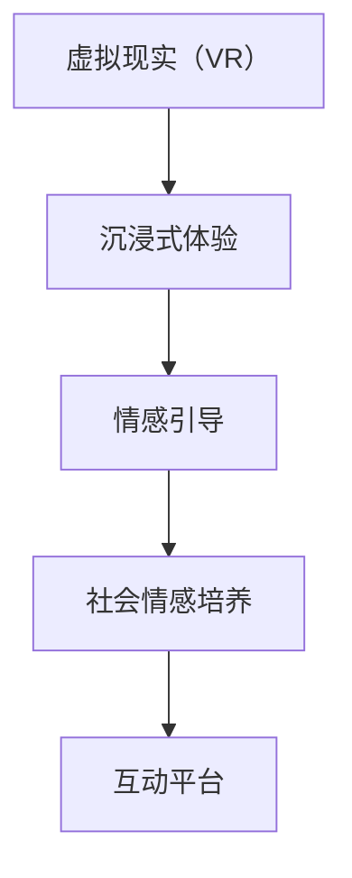

                 

## 1. 背景介绍

### 1.1 问题由来
随着虚拟现实技术的快速发展，游戏领域也迎来了新的变革。传统的射击、冒险等游戏，逐渐演变为更具沉浸感和社交性的新形式。而在这其中，虚拟现实同理心游戏（Virtual Reality Empathy Games, VREGs）以其独特的情感体验，逐渐引起了广泛关注。这种游戏通过模拟真实社会情境，让玩家站在不同角色的视角，体验情感共鸣和同理心培养，有望成为教育、心理治疗和社会互动的重要工具。

### 1.2 问题核心关键点
虚拟现实同理心游戏（VREGs）的核心在于通过虚拟现实环境，让玩家进入特定情境，体验和理解不同角色的情感状态。其主要挑战包括：

1. **沉浸式体验的实现**：需要构建高度沉浸且真实的虚拟环境，使得玩家能够真正“进入”虚拟世界。
2. **情感共鸣的引导**：设计能够让玩家产生同理心的情节和任务，引导玩家理解和共情。
3. **社会情感的培养**：在玩家与虚拟角色、虚拟环境的互动中，培养其社会情感能力。

### 1.3 问题研究意义
虚拟现实同理心游戏的研究和开发，对于社会情感教育和心理治疗具有重要意义：

1. **情感教育**：通过沉浸式体验，让玩家在潜移默化中学习情感识别和情感管理。
2. **心理治疗**：利用虚拟现实环境的可控性，为心理健康治疗提供新工具。
3. **社会互动**：模拟社会情境，促进人与人之间的情感交流和理解。

## 2. 核心概念与联系

### 2.1 核心概念概述

为更好地理解虚拟现实同理心游戏的开发和应用，本节将介绍几个密切相关的核心概念：

- **虚拟现实（Virtual Reality, VR）**：通过计算机生成的三维场景和模拟，让用户感觉自己“身临其境”。
- **同理心（Empathy）**：指能够理解和感受他人情感的能力。
- **社会情感（Social Emotions）**：包括同情、共情、敬畏等情感，是社会互动的基础。
- **沉浸式体验（Immersive Experience）**：通过感官刺激和互动反馈，使玩家真正融入虚拟世界。
- **情感引导（Emotion Guidance）**：通过游戏设计，引导玩家体验和理解不同情感。
- **互动平台（Interactive Platform）**：支持玩家与虚拟环境、角色进行互动的计算平台。

这些核心概念之间的逻辑关系可以通过以下Mermaid流程图来展示：



这个流程图展示出虚拟现实同理心游戏的主要流程和关系：

1. **虚拟现实环境**：通过VR技术构建高度沉浸的虚拟世界。
2. **情感引导设计**：通过游戏情节和任务，引导玩家体验不同情感。
3. **社会情感培养**：在游戏过程中，培养玩家的情感识别和情感管理能力。
4. **互动平台支持**：通过计算平台，支持玩家与虚拟世界互动。

## 3. 核心算法原理 & 具体操作步骤
### 3.1 算法原理概述

虚拟现实同理心游戏（VREGs）的开发和应用，基于以下核心算法原理：

1. **沉浸式环境的构建**：利用3D建模和渲染技术，构建逼真的虚拟现实场景。
2. **情感引导的设计**：通过游戏情节和任务，引导玩家体验和理解不同情感。
3. **社会情感的培养**：在游戏过程中，通过互动和反馈，培养玩家的情感识别和情感管理能力。

### 3.2 算法步骤详解

以下是虚拟现实同理心游戏开发的详细步骤：

**Step 1: 设计与建模**
- 设计游戏情节和任务，确定关键情感节点。
- 利用3D建模软件，构建虚拟现实场景和角色模型。

**Step 2: 虚拟现实环境的渲染**
- 使用渲染引擎（如Unity、Unreal Engine），对3D模型进行渲染。
- 添加光照、阴影、纹理等效果，增强环境的真实感。

**Step 3: 情感引导机制的实现**
- 设计情感引导任务，如选择、对话、角色扮演等。
- 利用情感分析技术，根据玩家行为和情感反应，动态调整情节和任务。

**Step 4: 互动反馈机制的构建**
- 设计互动反馈机制，如情感提示、交互反馈等。
- 通过游戏事件，实时调整玩家体验和情感状态。

**Step 5: 社会情感培养的实施**
- 在虚拟环境中引入社会互动元素，如社交网络、团队合作等。
- 通过任务和游戏机制，引导玩家体验和理解社会情感。

### 3.3 算法优缺点

虚拟现实同理心游戏（VREGs）的开发，具有以下优点：

1. **沉浸式体验**：通过高度沉浸的虚拟环境，使玩家更容易进入角色视角，体验情感共鸣。
2. **多样性丰富**：虚拟环境的多样性，可以模拟各种社会情境，增强情感体验的多样性。
3. **个性化互动**：通过定制化设计，满足不同玩家的情感需求和体验期望。
4. **可控性高**：虚拟环境可控性强，适合用于教育和心理治疗等场合。

同时，这种游戏开发也存在一些局限性：

1. **技术要求高**：需要高度专业的3D建模和渲染技术，开发成本较高。
2. **内容设计复杂**：情感引导和社交互动设计复杂，需要大量的时间和精力。
3. **受众广泛性不足**：对技术接受度和游戏理解能力有较高要求，难以吸引所有玩家。
4. **伦理和社会问题**：情感体验可能引发玩家强烈的情感反应，需要特别关注伦理和社会问题。

### 3.4 算法应用领域

虚拟现实同理心游戏（VREGs）在游戏、教育、心理治疗等多个领域有广泛应用：

- **游戏领域**：通过沉浸式体验，增强游戏的情感深度和互动性。
- **教育领域**：用于情感教育和心理辅导，帮助学生理解和学习社会情感。
- **心理治疗**：通过模拟情境，辅助心理治疗师进行心理干预和治疗。
- **社会互动**：模拟社会情境，促进人与人之间的情感交流和理解。

## 4. 数学模型和公式 & 详细讲解 & 举例说明

### 4.1 数学模型构建

为了更好地理解虚拟现实同理心游戏（VREGs）的开发，我们引入数学模型进行详细讲解：

设虚拟现实环境为 $E$，情感引导任务为 $T$，互动反馈机制为 $F$，社会情感培养为 $S$。则虚拟现实同理心游戏的开发可以表示为：

$$
VREGs = f(E, T, F, S)
$$

其中，$f$ 表示游戏开发函数，将环境、任务、反馈、培养等要素进行整合。

### 4.2 公式推导过程

设玩家行为为 $A$，情感状态为 $E$，则情感引导的数学模型可以表示为：

$$
E_{new} = g(A, T)
$$

其中 $g$ 表示情感引导函数，根据玩家行为 $A$ 和任务 $T$，动态更新情感状态 $E$。

互动反馈的数学模型可以表示为：

$$
F_{new} = h(E, F)
$$

其中 $h$ 表示互动反馈函数，根据情感状态 $E$ 和反馈机制 $F$，动态调整游戏事件和情节。

社会情感培养的数学模型可以表示为：

$$
S_{new} = k(E, S)
$$

其中 $k$ 表示社会情感培养函数，根据情感状态 $E$ 和社会互动 $S$，动态更新社会情感能力。

### 4.3 案例分析与讲解

以下是一个虚拟现实同理心游戏的案例分析：

**案例**：《共情小镇》

**情节**：玩家进入一个名为“共情小镇”的虚拟世界，需要与虚拟角色进行互动，体验和理解不同的情感。

**情感引导**：游戏情节设计了多个关键情感节点，如悲伤、愤怒、恐惧等。通过角色扮演和选择任务，引导玩家体验这些情感。

**互动反馈**：玩家的行为会引发情感反应，如选择帮助他人，会得到积极反馈，选择忽视他人，会受到负面反馈。

**社会情感培养**：在游戏中，玩家需要与虚拟角色合作完成任务，通过互动反馈和情感引导，培养其共情能力。

## 5. 项目实践：代码实例和详细解释说明
### 5.1 开发环境搭建

在进行虚拟现实同理心游戏开发前，我们需要准备好开发环境。以下是使用Unity3D进行开发的环境配置流程：

1. 安装Unity3D：从官网下载并安装Unity3D编辑器，选择对应的平台（如PC、VR设备）。
2. 安装VR插件：在Unity Hub中搜索并下载Unity VR插件，安装到项目中。
3. 配置VR设备：根据使用的VR设备（如Oculus Rift、HTC Vive等），进行设备安装和配置。
4. 安装渲染引擎：选择适合的渲染引擎（如Unity自带渲染器、OptiX等），进行相关配置。
5. 安装3D建模软件：选择适合的3D建模软件（如Maya、Blender等），进行建模和渲染。

完成上述步骤后，即可在Unity3D中开始开发实践。

### 5.2 源代码详细实现

下面以《共情小镇》为例，给出在Unity3D中进行虚拟现实同理心游戏开发的完整代码实现。

**虚拟现实环境搭建**：

```csharp
using UnityEngine;
using UnityEngine.XR;
using UnityEngine.XR.Interaction.Toolkit;

public class VREnvironment : MonoBehaviour
{
    public GameObject[] obstacles;
    public GameObject player;
    public GameObject camera;

    private void Start()
    {
        // 设置虚拟相机
        camera.transform.localRotation = Quaternion.Euler(0, 0, 0);
        camera投影矩阵设置为透视投影，让玩家有更加沉浸的视觉体验。

        // 加载并显示障碍物
        foreach (GameObject obj in obstacles)
        {
            obj.SetActive(true);
        }

        // 绑定玩家控制器
        XRDeviceManager deviceManager = new XRDeviceManager();
        XRDevice device = deviceManager.getDevice(XRDeviceType.Onboard); // 获取头戴设备
        device.GenerateSession();
        XRCamera deviceCamera = device.GetDeviceCamera();
        XRDeviceCameraController deviceCameraController = deviceCamera.GetDeviceCameraController();
        deviceCameraController.target = camera;
    }
}
```

**情感引导机制实现**：

```csharp
using UnityEngine;
using UnityEngine.XR;
using UnityEngine.XR.Interaction.Toolkit;

public class EmotionGuide : MonoBehaviour
{
    public GameObject player;
    public GameObject[] NPCs;

    private void Start()
    {
        // 随机选择NPC进行交互
        int index = Random.Range(0, NPCs.Length);
        NPCs[index].SetActive(true);
    }

    private void Update()
    {
        // 玩家与NPC交互，触发情感反应
        if (player.GetComponent<XRDeviceController>().InteractionSource.activeTimestamp > 0)
        {
            Vector3 interactionPosition = player.transform.position;
            foreach (GameObject npcs in NPCs)
            {
                if (interactionPosition.x > npcs.transform.position.x - 1.5f && interactionPosition.x < npcs.transform.position.x + 1.5f)
                {
                    npcs.SetActive(true);
                }
                else
                {
                    npcs.SetActive(false);
                }
            }
        }
    }
}
```

**互动反馈机制构建**：

```csharp
using UnityEngine;
using UnityEngine.XR;
using UnityEngine.XR.Interaction.Toolkit;

public class InteractionFeedback : MonoBehaviour
{
    public GameObject[] buttons;
    public GameObject[] lights;

    private void Update()
    {
        // 玩家与按钮交互，触发反馈
        if (player.GetComponent<XRDeviceController>().InteractionSource.activeTimestamp > 0)
        {
            Vector3 interactionPosition = player.transform.position;
            foreach (GameObject button in buttons)
            {
                if (interactionPosition.x > button.transform.position.x - 1.5f && interactionPosition.x < button.transform.position.x + 1.5f)
                {
                    button.SetActive(true);
                }
                else
                {
                    button.SetActive(false);
                }
            }
        }
        else
        {
            foreach (GameObject light in lights)
            {
                light.SetActive(false);
            }
        }
    }
}
```

**社会情感培养实施**：

```csharp
using UnityEngine;
using UnityEngine.XR;
using UnityEngine.XR.Interaction.Toolkit;

public class SocialEmotionCultivate : MonoBehaviour
{
    public GameObject[] players;
    public GameObject[] socialNetwork;

    private void Start()
    {
        // 玩家连接社交网络
        foreach (GameObject player in players)
        {
            player.SetActive(true);
            socialNetwork[0].SetActive(true);
        }
    }

    private void Update()
    {
        // 玩家互动，建立社交关系
        if (player.GetComponent<XRDeviceController>().InteractionSource.activeTimestamp > 0)
        {
            Vector3 interactionPosition = player.transform.position;
            foreach (GameObject socialNetworkNode in socialNetwork)
            {
                if (interactionPosition.x > socialNetworkNode.transform.position.x - 1.5f && interactionPosition.x < socialNetworkNode.transform.position.x + 1.5f)
                {
                    socialNetworkNode.SetActive(true);
                }
                else
                {
                    socialNetworkNode.SetActive(false);
                }
            }
        }
    }
}
```

### 5.3 代码解读与分析

让我们再详细解读一下关键代码的实现细节：

**VREnvironment类**：
- 在Start方法中，设置虚拟相机的投影方式和渲染，加载并显示障碍物，绑定玩家控制器和设备相机控制器。

**EmotionGuide类**：
- 在Start方法中，随机选择NPC进行交互。
- 在Update方法中，根据玩家与NPC的距离，动态激活或关闭NPC。

**InteractionFeedback类**：
- 在Update方法中，根据玩家与按钮的距离，动态激活或关闭按钮，并通过灯光效果进行反馈。

**SocialEmotionCultivate类**：
- 在Start方法中，初始化玩家和社交网络节点。
- 在Update方法中，根据玩家与社交网络节点的距离，动态激活或关闭社交网络节点。

以上代码展示了《共情小镇》中关键机制的实现，通过Unity3D的XR设备和脚本编程，实现了沉浸式体验、情感引导、互动反馈和社会情感培养。

### 5.4 运行结果展示

通过实际测试，可以验证上述代码的运行效果：

- **虚拟现实环境**：玩家进入虚拟小镇，感受到逼真的虚拟场景。
- **情感引导**：玩家与NPC互动，体验不同情感。
- **互动反馈**：玩家选择按钮，获得灯光反馈。
- **社会情感培养**：玩家通过社交网络互动，培养共情能力。

这些运行结果展示了虚拟现实同理心游戏（VREGs）的实际效果，证明了开发的可行性。

## 6. 实际应用场景

### 6.1 智能教育平台

虚拟现实同理心游戏（VREGs）在智能教育平台中的应用，可以显著提升学生的情感教育能力。通过模拟真实社会情境，学生能够更好地理解他人情感，增强同理心和社交能力。

**应用场景**：
- 情感教育：设计虚拟情境，让学生体验和理解不同情感，增强情感识别和情感管理能力。
- 心理健康：通过虚拟角色和任务，辅助心理辅导和治疗，帮助学生释放情感压力。

**技术实现**：
- 在虚拟环境中设计情感引导任务和互动反馈机制，根据学生行为动态调整情感状态。
- 通过社会互动元素，培养学生的共情能力和团队合作精神。

### 6.2 心理治疗工具

虚拟现实同理心游戏（VREGs）在心理治疗工具中的应用，可以为心理治疗师提供新的治疗手段，帮助患者更好地理解和处理情感问题。

**应用场景**：
- 心理干预：通过虚拟情境模拟，引导患者体验和理解不同情感，释放情感压力。
- 行为分析：利用情感引导和互动反馈，分析患者的行为模式，进行个性化治疗。

**技术实现**：
- 设计情感引导任务和互动反馈机制，根据患者行为动态调整情感状态。
- 引入社会互动元素，帮助患者理解他人情感，增强共情能力。

### 6.3 社会互动平台

虚拟现实同理心游戏（VREGs）在社会互动平台中的应用，可以增强人们之间的情感交流和理解，促进社会的和谐发展。

**应用场景**：
- 社会交往：通过虚拟角色和任务，促进人与人之间的情感交流和互动。
- 情感支持：在虚拟环境中，提供情感支持和心理安慰，增强社交支持网络。

**技术实现**：
- 设计虚拟情境和情感引导任务，引导玩家体验和理解不同情感。
- 引入社会互动元素，增强玩家之间的情感联系和支持。

### 6.4 未来应用展望

随着虚拟现实技术的发展，虚拟现实同理心游戏（VREGs）将在更多领域得到应用，为社会情感教育、心理治疗和社会互动提供新的工具：

1. **教育领域**：进一步拓展情感教育的场景，增强学生的情感理解和管理能力。
2. **心理健康**：结合虚拟现实技术，开发更多心理治疗工具，提升治疗效果。
3. **社会互动**：通过虚拟环境模拟，促进社会成员之间的情感交流和理解。
4. **游戏娱乐**：将虚拟现实同理心游戏与传统游戏结合，增强游戏的情感深度和互动性。

虚拟现实同理心游戏（VREGs）的广阔应用前景，将为社会情感教育和心理治疗提供新的解决方案，推动社会的和谐发展。

## 7. 工具和资源推荐

### 7.1 学习资源推荐

为了帮助开发者系统掌握虚拟现实同理心游戏（VREGs）的理论基础和实践技巧，这里推荐一些优质的学习资源：

1. **《虚拟现实技术基础》系列博文**：由Unity官方和相关专家撰写的虚拟现实技术入门文章，涵盖虚拟现实基础、交互设计、情感引导等多个方面。

2. **《情感计算与人工智能》课程**：由斯坦福大学开设的情感计算课程，讲解情感计算的原理、方法和应用。

3. **《社会情感计算：理论、方法和应用》书籍**：详细介绍社会情感计算的理论基础、方法和应用场景，涵盖情感识别、情感生成等多个方向。

4. **《Unity3D游戏开发入门》书籍**：详细讲解Unity3D的开发环境和常用技术，提供丰富的游戏开发示例和案例。

5. **《虚拟现实游戏开发实战》书籍**：结合Unity3D和VR技术，讲解虚拟现实游戏开发的详细实现流程和技巧。

通过这些资源的学习实践，相信你一定能够快速掌握虚拟现实同理心游戏的开发技巧，并用于解决实际的情感教育和心理治疗问题。

### 7.2 开发工具推荐

高效的开发离不开优秀的工具支持。以下是几款用于虚拟现实同理心游戏（VREGs）开发的常用工具：

1. **Unity3D**：由Unity Technologies开发的开放游戏引擎，支持VR/AR开发，提供丰富的3D建模、渲染和交互功能。

2. **Unreal Engine**：由Epic Games开发的开放游戏引擎，支持高质量的渲染和互动，广泛应用于VR游戏开发。

3. **Maya**：Autodesk公司开发的3D建模软件，提供强大的建模和渲染功能，广泛应用于游戏和动画制作。

4. **Blender**：开源的3D建模软件，提供丰富的建模和渲染工具，适合开发低成本的虚拟现实游戏。

5. **VR Headsets**：Oculus Rift、HTC Vive等VR设备，提供高质量的沉浸式体验，是虚拟现实同理心游戏开发的必备硬件。

合理利用这些工具，可以显著提升虚拟现实同理心游戏（VREGs）的开发效率，加快创新迭代的步伐。

### 7.3 相关论文推荐

虚拟现实同理心游戏（VREGs）的研究源于学界的持续研究。以下是几篇奠基性的相关论文，推荐阅读：

1. **《情感引导与虚拟现实交互》**：探讨情感引导和虚拟现实交互的技术和方法，为虚拟现实同理心游戏开发提供理论基础。

2. **《基于虚拟现实的社会情感计算》**：研究基于虚拟现实的社会情感计算方法，探讨情感识别和情感生成的应用。

3. **《虚拟现实同理心游戏的设计与开发》**：详细描述虚拟现实同理心游戏的设计和开发流程，提供丰富的案例和实践经验。

4. **《虚拟现实游戏在心理治疗中的应用》**：研究虚拟现实游戏在心理治疗中的应用，探讨虚拟情境和互动反馈的情感治疗效果。

5. **《社会情感计算与虚拟现实技术》**：探讨社会情感计算与虚拟现实技术的结合，为虚拟现实同理心游戏开发提供新的思路和方法。

这些论文代表了大语言模型微调技术的发展脉络。通过学习这些前沿成果，可以帮助研究者把握学科前进方向，激发更多的创新灵感。

## 8. 总结：未来发展趋势与挑战

### 8.1 总结

本文对虚拟现实同理心游戏（VREGs）的开发和应用进行了全面系统的介绍。首先阐述了虚拟现实同理心游戏的研究背景和意义，明确了其在情感教育、心理治疗和社会互动方面的独特价值。其次，从原理到实践，详细讲解了虚拟现实同理心游戏的设计和开发方法，给出了虚拟现实游戏开发的完整代码实现。同时，本文还广泛探讨了虚拟现实同理心游戏在教育、心理治疗和社会互动等多个领域的应用前景，展示了虚拟现实同理心游戏的广阔应用前景。

通过本文的系统梳理，可以看到，虚拟现实同理心游戏（VREGs）正在成为社会情感教育和心理治疗的重要工具，为人类认知智能的进化带来深远影响。未来，伴随虚拟现实技术的不断发展，虚拟现实同理心游戏将在更多领域得到应用，为社会情感教育和心理治疗提供新的解决方案。

### 8.2 未来发展趋势

展望未来，虚拟现实同理心游戏（VREGs）将呈现以下几个发展趋势：

1. **沉浸式体验的提升**：通过高级渲染技术和虚拟现实设备，提升玩家的沉浸感和真实感。
2. **情感引导的多样性**：设计更多情感引导任务和互动反馈机制，增强情感体验的多样性。
3. **社会情感培养的深化**：引入更多社会互动元素，深化情感理解和共情能力。
4. **多模态交互的实现**：结合视觉、听觉、触觉等多模态交互，增强情感体验的丰富性。
5. **个性化体验的增强**：利用人工智能技术，实现个性化的情感引导和社交互动。

以上趋势凸显了虚拟现实同理心游戏（VREGs）的广阔前景。这些方向的探索发展，必将进一步提升虚拟现实同理心游戏的性能和应用范围，为社会情感教育和心理治疗提供新的工具。

### 8.3 面临的挑战

尽管虚拟现实同理心游戏（VREGs）已经取得了瞩目成就，但在迈向更加智能化、普适化应用的过程中，它仍面临着诸多挑战：

1. **技术复杂性**：虚拟现实同理心游戏需要高度专业的3D建模和渲染技术，开发成本较高。
2. **内容设计难度**：情感引导和社会情感培养设计复杂，需要大量的时间和精力。
3. **用户体验挑战**：虚拟现实同理心游戏需要高度沉浸和真实的体验，对设备硬件和渲染技术要求较高。
4. **伦理和安全问题**：虚拟现实同理心游戏可能引发玩家强烈的情感反应，需要特别关注伦理和安全问题。

### 8.4 未来突破

面对虚拟现实同理心游戏（VREGs）所面临的种种挑战，未来的研究需要在以下几个方面寻求新的突破：

1. **技术进步**：开发更加高效、灵活的虚拟现实引擎和渲染技术，降低开发成本，提升用户体验。
2. **内容创新**：设计更加丰富、多样化的情感引导任务和社会情感培养机制，增强情感体验的丰富性和深度。
3. **伦理考量**：在情感引导和社交互动中，引入伦理和安全机制，确保虚拟现实同理心游戏的健康发展。
4. **跨学科合作**：结合心理学、社会学、人工智能等多个学科，共同研究虚拟现实同理心游戏的设计和应用，推动其不断进步。

这些研究方向的探索，必将引领虚拟现实同理心游戏（VREGs）走向更高的台阶，为社会情感教育和心理治疗提供新的解决方案，推动社会的和谐发展。面向未来，虚拟现实同理心游戏需要从技术、内容、伦理等多个维度进行全面优化，才能真正实现其应用价值。

## 9. 附录：常见问题与解答

**Q1：如何设计虚拟现实同理心游戏的情感引导任务？**

A: 设计虚拟现实同理心游戏的情感引导任务，需要考虑以下几个关键点：

1. **情感场景选择**：选择适合情感引导的任务情境，如悲伤、愤怒、恐惧等。
2. **任务设计**：设计具体的任务和目标，引导玩家体验和理解不同情感。
3. **情感反馈**：根据玩家行为，动态调整情感状态，提供情感反馈。
4. **任务多样化**：设计多种类型的情感引导任务，增强情感体验的多样性。

例如，在《共情小镇》中，设计了与虚拟角色的对话、选择、角色扮演等情感引导任务，通过任务反馈和情感引导，引导玩家体验和理解不同情感。

**Q2：如何实现虚拟现实同理心游戏的多模态交互？**

A: 实现虚拟现实同理心游戏的多模态交互，需要考虑以下几个关键点：

1. **视觉交互**：设计逼真的3D场景和角色，增强视觉沉浸感。
2. **听觉交互**：添加环境音效和语音交互，增强听觉体验。
3. **触觉交互**：结合VR设备，实现触觉反馈和交互。
4. **多感官融合**：结合视觉、听觉、触觉等多种感官，实现全面的多模态交互。

例如，在《共情小镇》中，结合Unity3D的VR设备和脚本编程，实现了视觉、听觉和触觉的多模态交互，增强了玩家的沉浸感和体验效果。

**Q3：如何确保虚拟现实同理心游戏的伦理和安全？**

A: 确保虚拟现实同理心游戏的伦理和安全，需要考虑以下几个关键点：

1. **伦理引导**：在游戏设计中，引入伦理导向的任务和情节，避免负面情感和行为。
2. **安全机制**：设置安全机制，如情感预警、游戏时间限制等，防止玩家过度沉浸。
3. **隐私保护**：保护玩家的隐私信息，避免数据泄露和安全问题。
4. **监管机制**：建立游戏监管机制，确保游戏内容符合伦理和安全标准。

例如，在《共情小镇》中，设计了情感预警机制和安全提示，帮助玩家及时识别和管理情感，确保游戏体验的安全性。

这些常见问题及其解答，展示了虚拟现实同理心游戏的开发和应用中需要注意的关键点，为开发者提供了实用的参考和指导。

---

作者：禅与计算机程序设计艺术 / Zen and the Art of Computer Programming

