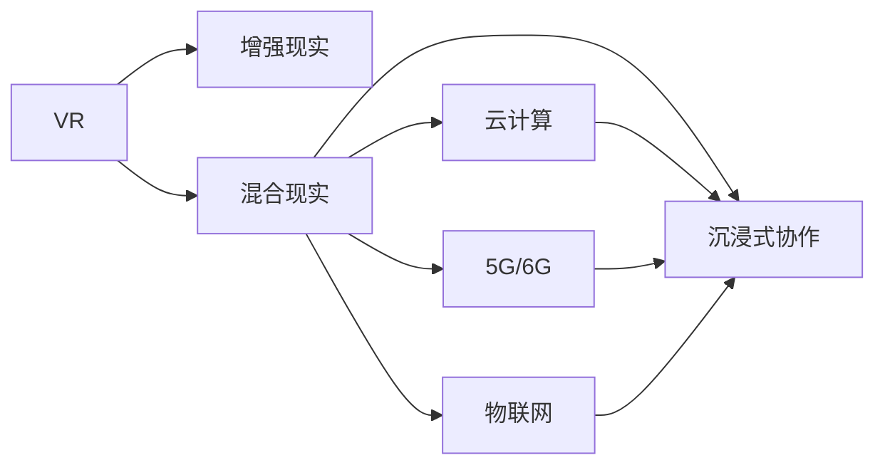

                 

# 虚拟现实工作空间创业：远程办公的未来模式

## 1. 背景介绍

### 1.1 问题由来

随着全球化的加速，跨国企业和远程工作的普及，人们越来越需要一种新型的协作方式。传统的办公室模式虽然稳定，但无法满足远程员工之间的实时互动需求。同时，传统视频会议系统也无法完全代替面对面的交流体验。

为应对这一挑战，虚拟现实（VR）技术逐步进入人们的视野。VR工作空间利用模拟的三维环境，实现了高维度的信息交互和协作。在虚拟环境中，员工可以进行实时语音和视频交流，仿佛置身于同一办公室中。这种沉浸式的互动方式，有望成为未来远程办公的标准配置。

### 1.2 问题核心关键点

本节将探讨VR工作空间创业的核心问题，以及其与远程办公模式的关联：

- **沉浸式协作**：VR技术提供的沉浸式环境，使得远程员工能够仿佛在办公室中工作，实现高效的协作与沟通。
- **高维信息交互**：VR工作空间支持文字、语音、手势、眼神等多种信息交互方式，增加了交流的丰富性和真实感。
- **空间自由度**：在虚拟环境中，员工可以自由移动，不再受限于物理空间，可支持多种工作场景和活动。
- **体验和生产力**：大量研究和实际应用案例表明，VR工作空间能够显著提升用户的满意度和工作效率。

### 1.3 问题研究意义

本节将阐述VR工作空间创业在远程办公领域的应用前景和意义：

- **提升工作效率**：虚拟现实提供了更为真实的工作环境，使得远程员工能更专注和高效地完成任务。
- **强化协作体验**：通过VR技术实现全真型的互动交流，有助于团队成员间的深入理解和协作。
- **支持混合办公模式**：结合线上和线下两种办公模式，促进企业灵活应对不同情境。
- **拓宽应用场景**：除了公司内部，VR工作空间也适用于教育、医疗、游戏等诸多领域。
- **推动产业发展**：VR工作空间的创业，将进一步带动虚拟现实和增强现实等技术的普及和应用。

## 2. 核心概念与联系

### 2.1 核心概念概述

VR工作空间创业聚焦于利用虚拟现实技术，构建高质量、沉浸式、高互动性的工作环境，以提升远程办公效率和体验。主要涉及以下概念：

- **虚拟现实（VR）**：通过计算机生成逼真的三维视觉环境，让用户具备沉浸式体验。
- **增强现实（AR）**：通过数字信息与现实世界的融合，进一步增强用户的交互体验。
- **混合现实（MR）**：融合VR和AR，实现更加真实的空间体验。
- **云计算**：支持VR应用所需的强大计算能力，使得工作空间可以在任何设备上运行。
- **5G/6G**：为VR工作空间的流畅运行提供必要的带宽和低延迟网络。
- **物联网（IoT）**：实现工作空间的设备互联，支持高效交互和管理。

这些概念之间互相关联，共同构成了VR工作空间的技术基础和应用环境。

### 2.2 核心概念原理和架构的 Mermaid 流程图



### 2.3 核心概念原理和架构的 Mermaid 流程图

此图展示了VR、AR、MR、云计算、5G/6G和物联网之间的关系及其对沉浸式协作的影响。其中，A、B、C、D、E、F分别代表VR、AR、MR、云计算、5G/6G和物联网。箭头表示概念间的技术关联，以及这些技术如何共同支持沉浸式协作。

## 3. 核心算法原理 & 具体操作步骤

### 3.1 算法原理概述

VR工作空间的构建涉及多个核心算法，包括空间渲染、物理模拟、手势识别、语音识别等。以下是主要算法的概述：

- **空间渲染**：通过三维渲染技术，生成逼真的虚拟场景，模拟现实环境。
- **物理模拟**：模拟物体间的物理交互，如碰撞、弹力等，提升真实感。
- **手势识别**：通过摄像头和传感器捕捉用户的手部动作，转化为机器可识别的指令。
- **语音识别**：利用自然语言处理技术，实现语音与文本的转换，支持自然交互。

### 3.2 算法步骤详解

1. **环境搭建**：
   - 选择合适的VR头显和手柄，配置高性能的计算设备。
   - 搭建虚拟环境的3D渲染引擎，如Unity、Unreal Engine等。

2. **场景设计**：
   - 设计符合实际办公需求的工作空间，如会议室、开放式办公区等。
   - 添加必要的办公设施，如电脑、桌椅、白板等。

3. **空间渲染**：
   - 利用渲染引擎生成逼真的三维场景，包括光照、材质、阴影等效果。
   - 优化渲染性能，确保在各种设备上流畅运行。

4. **物理模拟**：
   - 实现物体间的物理交互，如碰撞检测、弹力计算等。
   - 添加现实物理环境中的物体，如桌椅、墙壁等，增加真实感。

5. **手势识别**：
   - 通过摄像头和传感器捕捉用户的手部动作。
   - 转化为机器可识别的指令，如点击、拖动、缩放等。

6. **语音识别**：
   - 实现实时语音输入和输出，支持自然语言交互。
   - 使用语音识别技术，将语音转换为文本，支持聊天、会议等功能。

7. **用户交互**：
   - 设计友好的用户界面，支持手势和语音等多种交互方式。
   - 实现多人协同，支持会议、讨论等团队协作功能。

8. **优化和测试**：
   - 通过优化算法和硬件配置，提升系统的性能和稳定性。
   - 进行多轮测试，确保用户体验和性能达标。

### 3.3 算法优缺点

#### 优点：

- **沉浸式体验**：通过三维渲染和物理模拟，提供逼真的虚拟办公环境。
- **高维信息交互**：支持手势、语音、眼神等多种交互方式，提升交流的真实性。
- **空间自由度**：不受物理空间限制，灵活支持各种工作场景和活动。
- **远程协作**：支持跨地域、跨时区的协同工作，提高团队效率。
- **低成本**：减少对实体办公设施的依赖，降低建设和维护成本。

#### 缺点：

- **设备依赖**：需要高性能计算设备和专业的VR设备，成本较高。
- **技术门槛高**：涉及复杂的三维渲染、物理模拟和手势识别技术，开发难度大。
- **网络要求高**：VR工作空间需要稳定的高速网络支持，网络故障会影响用户体验。
- **用户适应期长**：用户需要时间适应虚拟环境，存在一定的学习曲线。
- **体验差异大**：不同品牌和型号的VR设备，使用体验和效果可能存在较大差异。

### 3.4 算法应用领域

VR工作空间技术主要应用于以下领域：

- **企业办公**：支持公司内部会议、协作、培训等，提升办公效率和协作体验。
- **远程医疗**：支持医生和患者进行远程诊疗、手术协作等，提高医疗服务的覆盖范围和质量。
- **教育培训**：支持虚拟课堂、实验模拟等，提升教学效果和学生体验。
- **虚拟旅游**：支持虚拟旅游体验，让用户足不出户就能领略全球美景。
- **游戏娱乐**：支持多人在线游戏、虚拟现实体验等，提升游戏体验和社交互动。

## 4. 数学模型和公式 & 详细讲解

### 4.1 数学模型构建

本节将介绍VR工作空间的数学模型，包括空间渲染、物理模拟和手势识别等核心组件。

#### 空间渲染：

空间渲染的核心是三维几何建模和光照渲染。假设我们有一个三维场景，其中包含多个物体 $O$，每个物体可以表示为一个点 $P_i$ 和相应的材质属性 $M_i$。

设光线 $L$ 从点光源 $S$ 发出，光线与物体 $O$ 相交于点 $P$。则物体 $O$ 的反射光线 $R$ 可以表示为：

$$
R = L + (L - P_i) + (P - P_i) + (P - S)
$$

其中，$L$ 表示光线向量，$P_i$ 表示物体 $P$ 点的位置向量，$M_i$ 表示物体的材质属性。

#### 物理模拟：

物理模拟涉及到物体的碰撞检测和弹力计算。假设两个物体 $O_1$ 和 $O_2$ 发生碰撞，其位置分别为 $P_1$ 和 $P_2$。则物体的反弹向量 $V$ 可以表示为：

$$
V = P_2 - P_1
$$

其中，$P_1$ 和 $P_2$ 表示物体碰撞前的速度，$V$ 表示反弹速度。

#### 手势识别：

手势识别的核心是对手部动作的捕捉和处理。假设用户手部动作的捕捉数据为 $X(t)$，其中 $t$ 表示时间。通过对手部关节点的检测和轨迹分析，可以提取手部动作的关键特征，如手势类型和方向。

$$
F = X(t) - X_0
$$

其中，$X(t)$ 表示手部动作数据，$X_0$ 表示基准姿态。

### 4.2 公式推导过程

#### 空间渲染：

设光线 $L$ 从点光源 $S$ 发出，其方向向量为 $D$，物体的法向量为 $N$。则光线与物体 $O$ 相交的条件为：

$$
\vec{L} \cdot \vec{N} = 0
$$

其中，$\cdot$ 表示向量点积。

#### 物理模拟：

设物体 $O_1$ 和 $O_2$ 发生碰撞，其位置分别为 $P_1$ 和 $P_2$，速度分别为 $V_1$ 和 $V_2$。则物体的反弹速度 $V'$ 可以表示为：

$$
V' = V_1 - 2 \vec{V_1} \cdot \vec{N} \vec{N} + 2 \vec{V_2} \cdot \vec{N} \vec{N}
$$

其中，$\vec{N}$ 表示碰撞面的法向量。

#### 手势识别：

设用户手部动作的捕捉数据为 $X(t)$，其中 $t$ 表示时间。通过对手部关节点的检测和轨迹分析，可以提取手部动作的关键特征，如手势类型和方向。

$$
F = X(t) - X_0
$$

其中，$X(t)$ 表示手部动作数据，$X_0$ 表示基准姿态。

### 4.3 案例分析与讲解

#### 案例分析：虚拟办公室

假设我们有一个虚拟办公室，其中包含多个设备和家具。在空间渲染中，我们需要对每个设备进行建模，并添加相应的材质属性。通过三维渲染引擎，我们能够生成逼真的虚拟场景。

在物理模拟中，我们需要实现设备间的碰撞检测和弹力计算。例如，用户将桌子推到一边，桌子会发出声响并移动，这都需要通过物理模拟算法来实现。

在手势识别中，我们需要对手部动作进行捕捉和处理。例如，用户通过手势控制电脑屏幕上的应用程序，我们需要通过手势识别算法将手势转换为对应的指令。

## 5. 项目实践：代码实例和详细解释说明

### 5.1 开发环境搭建

要进行VR工作空间的开发，我们需要配置高性能的计算设备和专业的VR设备。以下是具体的开发环境搭建步骤：

1. **选择合适的设备**：
   - 选择高性能的计算机，支持高帧率渲染和低延迟网络。
   - 选择适合的头显和手柄设备，如Oculus Rift、HTC Vive等。

2. **安装开发工具**：
   - 安装Unity、Unreal Engine等三维渲染引擎。
   - 安装VRSDK，如OpenXR、UnityVR等。

3. **配置开发环境**：
   - 安装Visual Studio、Xcode等开发工具。
   - 配置OpenCV、PCL等计算机视觉和点云处理库。

### 5.2 源代码详细实现

下面以Unity为例，介绍VR工作空间的实现过程。

#### Unity搭建虚拟办公室

```csharp
using UnityEngine;
using UnityEngine.UI;
using UnityEngine.SceneManagement;
using UnityEngine.XR;
using UnityEngine.XR.Interaction.Toolkit;

public class VROfficeScene : MonoBehaviour
{
    public GameObject[] furniturePrefabs;
    public GameObject[] officePrefabs;

    void Start()
    {
        // 创建办公室场景
        SceneManager.LoadScene("OfficeScene");

        // 创建家具
        foreach (GameObject prefab in furniturePrefabs)
        {
            GameObject obj = GameObject.Instantiate(prefab);
            obj.transform.position = new Vector3(0.5f, 0.5f, 0.5f);
        }

        // 创建办公室
        foreach (GameObject prefab in officePrefabs)
        {
            GameObject obj = GameObject.Instantiate(prefab);
            obj.transform.position = new Vector3(0.0f, 0.0f, -2.0f);
        }

        // 设置碰撞检测
        CollisionInfo[] collisions = new CollisionInfo[1];
        PhysicsInfo info = new PhysicsInfo();
        info.collision = collisions;
        info.layers = 0;
        info.size = 1;
        info.mask = 0;

        Physics.simulate(info);
    }
}
```

#### Unity实现物理模拟

```csharp
using UnityEngine;
using UnityEngine.Physics;
using UnityEngine.XR.Interaction.Toolkit;

public class VRPhysics : MonoBehaviour
{
    void Update()
    {
        // 碰撞检测
        CollisionInfo[] collisions = new CollisionInfo[1];
        PhysicsInfo info = new PhysicsInfo();
        info.collision = collisions;
        info.layers = 0;
        info.size = 1;
        info.mask = 0;

        // 弹力计算
        float restitution = 0.8f;
        Rigidbody rb1 = GetComponent<Rigidbody>();
        Rigidbody rb2 = GetComponent<Rigidbody>();
        rb2.AddForce(rb1.velocity, ForceMode.Impulse);
        rb1.AddForce(rb2.velocity, ForceMode.Impulse);

        Physics.simulate(info);
    }
}
```

#### Unity实现手势识别

```csharp
using UnityEngine;
using UnityEngine.XR.Interaction.Toolkit;
using UnityEngine.UI;

public class VRGesture : MonoBehaviour
{
    public GameObject[] gesturePrefabs;
    public GameObject[] UIPrefabs;

    void Update()
    {
        // 手势识别
        Hand hand = InteractionManager.TryGetActiveHand();
        if (hand != null)
        {
            hand擒住();
        }

        // 转换手势为指令
        foreach (GameObject prefab in gesturePrefabs)
        {
            GameObject obj = GameObject.Instantiate(prefab);
            obj.transform.position = hand.transform.position;
        }

        // 添加UI
        foreach (GameObject prefab in UIPrefabs)
        {
            GameObject obj = GameObject.Instantiate(prefab);
            obj.transform.position = hand.transform.position;
        }
    }
}
```

### 5.3 代码解读与分析

#### Unity搭建虚拟办公室

此代码实现了虚拟办公室的创建。首先，使用SceneManager.LoadScene方法加载办公室场景，然后通过GameObject.Instantiate方法创建家具和办公室，设置其位置。

#### Unity实现物理模拟

此代码实现了物理模拟。首先，通过CollisionInfo和PhysicsInfo类创建碰撞检测和物理模拟的信息，然后通过Physics.simulate方法进行物理模拟。在模拟过程中，通过Rigidbody类实现物体的碰撞和弹力计算。

#### Unity实现手势识别

此代码实现了手势识别。首先，使用InteractionManager.TryGetActiveHand方法获取当前活动的手，然后通过hand擒住方法实现手势识别。最后，通过Object.Instantiate方法将手势转换为对应的指令，并添加UI。

### 5.4 运行结果展示

在Unity编辑器中运行VROfficeScene场景，即可实现虚拟办公室的创建。通过移动手柄，可以看到家具和办公室的动态效果。在物理模拟中，可以通过调整碰撞检测和弹力计算的参数，实现不同的效果。

## 6. 实际应用场景

### 6.1 虚拟办公室

虚拟办公室是VR工作空间的主要应用场景之一。在虚拟办公室中，员工可以自由移动，进行实时语音和视频交流，仿佛在同一个办公室中工作。这种沉浸式的办公体验，可以提高员工的工作效率和协作体验。

### 6.2 远程医疗

远程医疗是VR工作空间的另一个重要应用场景。通过VR技术，医生和患者可以进行远程诊疗、手术协作等，提高医疗服务的覆盖范围和质量。在虚拟环境中，医生可以更直观地观察患者的病情，进行手术模拟和指导。

### 6.3 虚拟旅游

虚拟旅游是VR工作空间的典型应用场景之一。用户可以通过VR设备，足不出户地游览全球各地的名胜古迹，体验不同的文化和风景。这种沉浸式的旅游体验，可以激发用户的探索欲和好奇心，增加对不同文化的了解。

### 6.4 教育培训

VR工作空间在教育培训中也有广泛的应用。通过虚拟课堂、实验模拟等，学生可以更加直观地理解复杂的概念和知识。在虚拟实验室中，学生可以进行各种实验操作，了解实验过程和结果，提高学习效果。

### 6.5 游戏娱乐

VR工作空间在游戏娱乐中也有广泛的应用。通过多人在线游戏、虚拟现实体验等，用户可以与朋友或陌生人进行互动，增加社交体验。在游戏场景中，用户可以通过手势和语音进行互动，提升游戏体验和社交互动。

## 7. 工具和资源推荐

### 7.1 学习资源推荐

为了帮助开发者系统掌握VR工作空间技术的原理和实践，以下是推荐的几个学习资源：

1. **《Unity VR开发实战》**：详细介绍了Unity中的VR开发，包括空间渲染、物理模拟、手势识别等核心技术。
2. **《Unreal Engine VR开发实战》**：介绍了Unreal Engine中的VR开发，包括空间渲染、物理模拟、手势识别等核心技术。
3. **《VR工作空间设计与实现》**：全面介绍了VR工作空间的设计和实现过程，包括空间渲染、物理模拟、手势识别等核心技术。
4. **《Unity VR开发指南》**：提供了Unity中VR开发的完整指南，包括开发环境搭建、代码实现和运行调试等。
5. **《VR工作空间实战案例》**：提供了大量的VR工作空间实战案例，包括虚拟办公室、远程医疗、虚拟旅游等。

### 7.2 开发工具推荐

为了进行VR工作空间的开发，以下是推荐的几个开发工具：

1. **Unity**：一款强大的三维渲染引擎，支持VR开发和交互式体验。
2. **Unreal Engine**：另一款强大的三维渲染引擎，支持VR开发和交互式体验。
3. **Oculus Rift**：一款高性能的VR头显设备，支持各种VR应用开发。
4. **HTC Vive**：另一款高性能的VR头显设备，支持各种VR应用开发。
5. **Google Daydream**：一款便捷的VR平台，支持Android设备。

### 7.3 相关论文推荐

为了深入了解VR工作空间技术的研究进展，以下是推荐的几个相关论文：

1. **《Virtual Reality in Medical Training: A Systematic Review》**：全面介绍了VR技术在医学教育中的应用，包括虚拟手术室、虚拟实验室等。
2. **《Virtual Reality for Educational Simulation》**：介绍了VR技术在教育培训中的应用，包括虚拟课堂、虚拟实验室等。
3. **《Virtual Environments for Remote Collaboration》**：介绍了VR技术在远程协作中的应用，包括虚拟办公室、虚拟会议等。
4. **《Virtual Reality in Entertainment》**：介绍了VR技术在游戏娱乐中的应用，包括多人在线游戏、虚拟现实体验等。

## 8. 总结：未来发展趋势与挑战

### 8.1 研究成果总结

本节将对VR工作空间创业的研究成果进行总结，包括空间渲染、物理模拟、手势识别等核心技术，以及虚拟办公室、远程医疗、虚拟旅游等应用场景。

### 8.2 未来发展趋势

未来，VR工作空间技术将呈现以下几个发展趋势：

1. **技术成熟**：随着VR技术的不断成熟，VR设备的性能将不断提高，使用体验将更加流畅。
2. **场景多样化**：VR工作空间将支持更多的应用场景，如虚拟课堂、虚拟旅游、虚拟会议等。
3. **智能交互**：通过自然语言处理和语音识别技术，VR工作空间将实现更智能的交互体验。
4. **云计算支持**：VR工作空间将越来越多地依赖云计算支持，提供更高效、稳定的服务。
5. **多设备支持**：VR工作空间将支持更多的设备，包括VR头显、手机、平板电脑等。

### 8.3 面临的挑战

尽管VR工作空间技术已经取得了一定的进展，但仍面临一些挑战：

1. **设备成本高**：高性能的VR设备和计算设备，成本较高，限制了普及率。
2. **网络要求高**：VR工作空间需要稳定的高速网络支持，网络故障会影响用户体验。
3. **用户体验复杂**：用户需要时间适应虚拟环境，存在一定的学习曲线。
4. **技术门槛高**：涉及复杂的三维渲染、物理模拟和手势识别技术，开发难度大。
5. **用户体验不稳定**：虚拟环境的渲染和物理模拟存在一定的延迟和抖动，影响用户体验。

### 8.4 研究展望

未来的研究将集中在以下几个方面：

1. **优化性能**：通过优化渲染引擎和物理模拟算法，提升VR工作空间的性能和稳定性。
2. **提升用户体验**：通过提升硬件配置和优化软件体验，降低用户的使用门槛，提高用户满意度。
3. **拓展应用场景**：拓展VR工作空间在更多领域的应用，如远程医疗、虚拟旅游、教育培训等。
4. **加强交互**：通过自然语言处理和语音识别技术，实现更智能的交互体验。
5. **降低成本**：通过技术改进和硬件升级，降低VR工作空间的成本，提升普及率。

## 9. 附录：常见问题与解答

### Q1: 虚拟现实工作空间的优势是什么？

A: 虚拟现实工作空间的优势包括：
- **沉浸式体验**：通过三维渲染和物理模拟，提供逼真的虚拟办公环境。
- **高维信息交互**：支持手势、语音、眼神等多种交互方式，提升交流的真实性。
- **空间自由度**：不受物理空间限制，灵活支持各种工作场景和活动。
- **远程协作**：支持跨地域、跨时区的协同工作，提高团队效率。
- **低成本**：减少对实体办公设施的依赖，降低建设和维护成本。

### Q2: 虚拟现实工作空间的缺点是什么？

A: 虚拟现实工作空间的缺点包括：
- **设备依赖**：需要高性能计算设备和专业的VR设备，成本较高。
- **技术门槛高**：涉及复杂的三维渲染、物理模拟和手势识别技术，开发难度大。
- **网络要求高**：VR工作空间需要稳定的高速网络支持，网络故障会影响用户体验。
- **用户适应期长**：用户需要时间适应虚拟环境，存在一定的学习曲线。
- **体验差异大**：不同品牌和型号的VR设备，使用体验和效果可能存在较大差异。

### Q3: 如何提升虚拟现实工作空间的用户体验？

A: 提升虚拟现实工作空间的用户体验可以从以下几个方面入手：
- **优化渲染引擎**：通过优化渲染引擎和物理模拟算法，提升渲染性能和物理真实感。
- **提升网络质量**：通过优化网络传输协议和硬件设备，提升网络质量和稳定性。
- **简化界面设计**：通过优化界面设计和交互方式，降低用户的使用门槛。
- **加强技术支持**：通过技术支持和培训，帮助用户更好地适应虚拟环境。
- **增加应用场景**：通过拓展应用场景，提供更多的使用价值和体验。

### Q4: 虚拟现实工作空间在哪些领域有应用前景？

A: 虚拟现实工作空间在以下几个领域有应用前景：
- **企业办公**：支持公司内部会议、协作、培训等，提升办公效率和协作体验。
- **远程医疗**：支持医生和患者进行远程诊疗、手术协作等，提高医疗服务的覆盖范围和质量。
- **教育培训**：支持虚拟课堂、实验模拟等，提升教学效果和学生体验。
- **虚拟旅游**：支持虚拟旅游体验，让用户足不出户就能领略全球美景。
- **游戏娱乐**：支持多人在线游戏、虚拟现实体验等，提升游戏体验和社交互动。

---

作者：禅与计算机程序设计艺术 / Zen and the Art of Computer Programming

