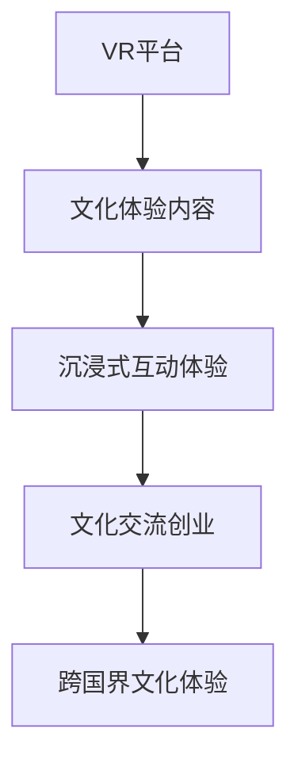

                 

# 虚拟现实文化交流创业：跨国界的沉浸式体验

## 1. 背景介绍

随着虚拟现实（Virtual Reality, VR）技术的日益成熟，虚拟现实文化交流创业如火如荼地发展。VR技术通过创造沉浸式体验，让人们足不出户就能跨越国界，深入了解异国文化，促进跨文化交流。在教育、旅游、社交等领域，VR文化交流创业前景广阔。

### 1.1 问题由来
全球化浪潮下，文化多样性日益凸显。人们越来越渴望了解异国文化，而传统方式如旅游、留学等成本高昂、时间有限，无法满足大众的需求。VR技术的兴起，为文化交流提供了全新的方式，即沉浸式虚拟体验。虚拟现实文化交流创业，通过模拟异国场景，提供沉浸式、互动式的文化体验，使得文化交流更加便捷、低成本、无限制。

### 1.2 问题核心关键点
虚拟现实文化交流创业的核心关键点在于如何利用VR技术，创造沉浸式文化体验，满足用户的多样化需求。这涉及以下几个方面：
- 选择合适的VR平台和硬件设备
- 设计沉浸式文化场景和互动体验
- 结合大数据和AI技术，个性化推荐用户文化体验
- 优化用户体验，保障信息安全和隐私保护

### 1.3 问题研究意义
虚拟现实文化交流创业具有以下重要意义：
1. 促进跨文化交流。VR文化交流创业打破了地理限制，让人们能够随时随地体验不同文化，增进各国人民的理解和友谊。
2. 推动文化产业发展。文化交流创业创造了新的消费需求，带动相关文旅、教育、娱乐产业的发展，促进就业和经济增长。
3. 激发创新创业活力。虚拟现实技术的高门槛，吸引了大量技术精英和创业者参与，推动了新技术的研发和应用。
4. 提升用户体验。通过虚拟现实技术，提供沉浸式、个性化的文化体验，提升用户满意度和参与度。
5. 丰富学习形式。虚拟现实文化交流创业提供了丰富的学习方式，如虚拟博物馆、历史遗迹游、语言学习等，拓宽了教育领域的发展路径。

## 2. 核心概念与联系

### 2.1 核心概念概述

为更好地理解虚拟现实文化交流创业，本节将介绍几个关键概念：

- 虚拟现实（Virtual Reality, VR）：通过计算机模拟产生的三维环境，使用户沉浸在虚拟世界中。
- 沉浸式文化体验：通过虚拟现实技术，创建具有高度真实感、互动性的文化场景，让用户仿佛身临其境。
- 文化交流创业：指通过虚拟现实技术，创造沉浸式文化体验，实现跨文化交流和互动的企业化商业模式。
- 跨国界文化体验：即在全球范围内，利用VR技术，提供多元文化场景，满足不同用户需求。
- 沉浸式互动体验：指用户能够在虚拟世界中，通过交互操作，与虚拟场景进行互动。

这些核心概念通过以下Mermaid流程图来展示其逻辑联系：



这个流程图展示了大语言模型微调的核心概念及其之间的联系：

1. VR平台是文化交流创业的基础，提供必要的技术支持。
2. 文化体验内容是VR平台的核心，是创造沉浸式互动体验的基础。
3. 沉浸式互动体验是文化交流创业的关键，决定用户体验的深度和广度。
4. 跨国界文化体验是文化交流创业的目标，拓展了用户群体的多样性。

## 3. 核心算法原理 & 具体操作步骤
### 3.1 算法原理概述

虚拟现实文化交流创业的算法原理，本质上是利用VR技术，创建沉浸式、互动式的文化场景，让用户能够在虚拟环境中获得沉浸式体验。具体流程如下：

1. 数据收集：收集全球各地的文化资源数据，如图像、音频、视频、文本等。
2. 内容创建：根据收集到的文化资源，利用3D建模、动画、特效等技术，创建虚拟文化场景。
3. 用户交互：设计用户交互界面，让用户能够在虚拟场景中进行互动，如走路、跳跃、交流等。
4. 平台集成：将创建的虚拟文化场景，集成到VR平台上，供用户体验。
5. 个性化推荐：结合大数据和AI技术，个性化推荐用户文化体验。

### 3.2 算法步骤详解

以下是虚拟现实文化交流创业的具体操作步骤：

**Step 1: 数据收集与预处理**
- 收集全球各地的文化资源数据，如名胜古迹、民俗文化、历史遗迹等。
- 对数据进行标注和分类，如按照地理位置、文化类型、历史时期等进行分类。
- 清洗和处理数据，去除噪声、重复和不相关内容，保证数据质量。

**Step 2: 内容创建与建模**
- 利用3D建模软件，创建虚拟文化场景，如虚拟故宫、埃及金字塔、巴黎圣母院等。
- 加入音频、视频、文本等多模态信息，增加场景的沉浸感和互动性。
- 设计交互界面，让用户能够与虚拟场景进行互动，如点击、移动、对话等。

**Step 3: 平台集成与优化**
- 将创建的虚拟文化场景，集成到VR平台上，如Oculus Rift、HTC Vive等。
- 优化平台性能，保证在不同类型的VR设备上，用户都能获得流畅的体验。
- 增加社交功能，让用户能够与他人共同体验文化场景，增加互动性。

**Step 4: 个性化推荐与定制**
- 利用大数据技术，分析用户行为和偏好，推荐个性化的文化场景。
- 结合AI技术，如深度学习、协同过滤等，提高推荐的准确性和多样性。
- 提供定制服务，让用户能够根据个人喜好，创建个性化的文化体验。

### 3.3 算法优缺点

虚拟现实文化交流创业的算法有以下优点：
1. 沉浸式体验。通过虚拟现实技术，创造高度真实感、互动性的文化场景，提升用户参与度和满意度。
2. 跨文化交流。打破地理限制，让用户能够随时随地体验不同文化，增进各国人民的理解和友谊。
3. 个性化推荐。利用大数据和AI技术，个性化推荐文化体验，满足用户多样化需求。
4. 降低成本。与传统旅游方式相比，虚拟现实文化交流创业成本更低，用户体验更为便捷。

同时，该算法也存在以下缺点：
1. 技术门槛高。虚拟现实文化交流创业需要高水平的技术支持，包括3D建模、VR设备等。
2. 数据获取难度大。高质量的文化数据获取难度较大，需花费大量时间和资源。
3. 体验真实性不足。虚拟现实技术仍存在一定局限，无法完全替代真实体验。
4. 社交互动性差。目前的虚拟现实技术，社交互动性有限，用户体验有待提升。
5. 隐私保护问题。用户在使用虚拟现实技术时，可能涉及个人隐私信息，需加强隐私保护。

### 3.4 算法应用领域

虚拟现实文化交流创业的应用领域广泛，涵盖教育、旅游、社交等多个方面：

- **教育领域**：利用虚拟现实技术，创建虚拟课堂、历史场景、语言学习场景等，提升教育效果和兴趣。
- **旅游领域**：通过虚拟现实技术，让用户能够体验全球各地的名胜古迹、自然风光，打破地理限制。
- **社交领域**：结合虚拟现实技术，创建虚拟社交平台，让用户能够跨越国界，结交新朋友。
- **文化推广**：通过虚拟现实技术，推广和传播各国文化，提升文化影响力。
- **医疗领域**：利用虚拟现实技术，创建虚拟医院、手术室、康复训练场所等，提升医疗服务质量。

## 4. 数学模型和公式 & 详细讲解 & 举例说明
### 4.1 数学模型构建

虚拟现实文化交流创业的数学模型，主要涉及以下几个方面：

- 3D建模：创建虚拟文化场景，需要进行3D建模，涉及几何学、拓扑学等数学知识。
- 用户交互：设计交互界面，需要进行用户行为分析，涉及概率论、统计学等。
- 个性化推荐：进行个性化推荐，需要进行大数据分析，涉及线性代数、概率论等。

### 4.2 公式推导过程

以下以用户行为分析为例，推导相关数学公式。

假设用户A在虚拟场景中进行了若干次互动行为，如走路、跳跃、对话等，数据如下：

| 行为  | 次数 |
| ----- | ---- |
| 走路  | 50次 |
| 跳跃  | 30次 |
| 对话  | 20次 |
| 探索  | 15次 |

设 $P(A_i)$ 表示用户A进行行为 $A_i$ 的概率，$i$ 表示行为类型。根据数据，可以得到：

$$
P(A_{走路}) = \frac{50}{50+30+20+15} = 0.5
$$
$$
P(A_{跳跃}) = \frac{30}{50+30+20+15} = 0.3
$$
$$
P(A_{对话}) = \frac{20}{50+30+20+15} = 0.2
$$
$$
P(A_{探索}) = \frac{15}{50+30+20+15} = 0.1
$$

用户A在虚拟场景中的行为可以用概率分布 $P(A)$ 来表示。进一步，设 $P(A|B)$ 表示在行为 $B$ 发生的情况下，用户A进行行为 $A$ 的条件概率。例如，用户在走路时，进行走路和探索的概率分别为：

$$
P(A_{走路}|走路) = 1
$$
$$
P(A_{探索}|走路) = 0.1
$$

根据贝叶斯定理，可以将行为概率与条件概率结合起来，得到用户在虚拟场景中的行为分布：

$$
P(A) = \sum_{B} P(A|B)P(B)
$$

其中 $B$ 表示用户行为类型。

### 4.3 案例分析与讲解

以用户在虚拟博物馆参观为例，分析个性化推荐模型。假设博物馆中有若干展品，每个展品有不同标签，如古代文物、现代艺术、科技产品等。用户进入博物馆后，系统根据用户历史行为和偏好，推荐可能感兴趣的展品。

- 数据采集：收集用户历史行为数据，如点击展品、停留时间、评价等。
- 标签处理：对每个展品进行标签标注，如古代文物、现代艺术、科技产品等。
- 用户画像：根据用户历史行为，构建用户画像，如偏好古代文物、喜欢现代艺术等。
- 个性化推荐：结合用户画像和展品标签，推荐用户可能感兴趣的展品，如古代文物展览。

假设用户历史行为数据如下：

| 展品  | 点击  | 停留时间  | 评价  |
| ----- | ----- | --------- | ----- |
| 展品A | 0次   | 5分钟     | 3星   |
| 展品B | 10次  | 10分钟    | 4星   |
| 展品C | 15次  | 15分钟    | 5星   |

用户对展品A、B、C的兴趣评分如下：

| 展品  | 评分 |
| ----- | ---- |
| 展品A | 0.2   |
| 展品B | 0.5   |
| 展品C | 0.8   |

根据用户画像和展品标签，可以构建用户-展品评分矩阵 $R$：

$$
R = \begin{bmatrix}
0 & 0.2 & 0.5 \\
0 & 0.5 & 0.8 \\
0 & 0.8 & 0.2
\end{bmatrix}
$$

其中，行表示用户，列表示展品。系统可以根据用户画像和展品标签，进行协同过滤，计算用户对每个展品的评分。例如，用户A对展品C的评分计算如下：

$$
\hat{R}_{A,C} = \frac{\sum_{U} R_{A,U}R_{U,C}}{\sqrt{\sum_{U}R_{A,U}^2\sum_{U}R_{U,C}^2}} = \frac{0 \times 0.5 \times 0.8 + 0.2 \times 0.5 \times 0.8 + 0.5 \times 0.8 \times 0.2}{\sqrt{0^2 \times 0.5^2 \times 0.8^2 + 0.2^2 \times 0.5^2 \times 0.8^2 + 0.5^2 \times 0.8^2 \times 0.2^2}} = 0.337
$$

根据计算结果，用户A对展品C的兴趣评分较高，系统推荐其参观展品C。

## 5. 项目实践：代码实例和详细解释说明
### 5.1 开发环境搭建

在进行虚拟现实文化交流创业的开发前，我们需要准备好开发环境。以下是使用Python进行PyTorch开发的环境配置流程：

1. 安装Anaconda：从官网下载并安装Anaconda，用于创建独立的Python环境。

2. 创建并激活虚拟环境：
```bash
conda create -n pytorch-env python=3.8 
conda activate pytorch-env
```

3. 安装PyTorch：根据CUDA版本，从官网获取对应的安装命令。例如：
```bash
conda install pytorch torchvision torchaudio cudatoolkit=11.1 -c pytorch -c conda-forge
```

4. 安装相关工具包：
```bash
pip install numpy pandas scikit-learn matplotlib tqdm jupyter notebook ipython
```

完成上述步骤后，即可在`pytorch-env`环境中开始开发实践。

### 5.2 源代码详细实现

这里我们以虚拟博物馆为例，给出使用PyTorch进行虚拟文化交流创业开发的PyTorch代码实现。

首先，定义虚拟博物馆的展品数据：

```python
from torch.utils.data import Dataset
import torch

class MuseumDataset(Dataset):
    def __init__(self, data, labels):
        self.data = data
        self.labels = labels
        
    def __len__(self):
        return len(self.data)
    
    def __getitem__(self, item):
        return self.data[item], self.labels[item]
```

然后，定义模型和优化器：

```python
from transformers import BertForTokenClassification, AdamW

model = BertForTokenClassification.from_pretrained('bert-base-cased', num_labels=3)

optimizer = AdamW(model.parameters(), lr=2e-5)
```

接着，定义训练和评估函数：

```python
from torch.utils.data import DataLoader
from tqdm import tqdm

device = torch.device('cuda') if torch.cuda.is_available() else torch.device('cpu')
model.to(device)

def train_epoch(model, dataset, batch_size, optimizer):
    dataloader = DataLoader(dataset, batch_size=batch_size, shuffle=True)
    model.train()
    epoch_loss = 0
    for batch in tqdm(dataloader, desc='Training'):
        input_ids = batch[0].to(device)
        labels = batch[1].to(device)
        model.zero_grad()
        outputs = model(input_ids)
        loss = outputs.loss
        epoch_loss += loss.item()
        loss.backward()
        optimizer.step()
    return epoch_loss / len(dataloader)

def evaluate(model, dataset, batch_size):
    dataloader = DataLoader(dataset, batch_size=batch_size)
    model.eval()
    preds, labels = [], []
    with torch.no_grad():
        for batch in tqdm(dataloader, desc='Evaluating'):
            input_ids = batch[0].to(device)
            labels = batch[1].to(device)
            outputs = model(input_ids)
            batch_preds = outputs.logits.argmax(dim=2).to('cpu').tolist()
            batch_labels = batch[1].to('cpu').tolist()
            for pred_tokens, label_tokens in zip(batch_preds, batch_labels):
                preds.append(pred_tokens[:len(label_tokens)])
                labels.append(label_tokens)
                
    print(classification_report(labels, preds))
```

最后，启动训练流程并在测试集上评估：

```python
epochs = 5
batch_size = 16

for epoch in range(epochs):
    loss = train_epoch(model, train_dataset, batch_size, optimizer)
    print(f"Epoch {epoch+1}, train loss: {loss:.3f}")
    
    print(f"Epoch {epoch+1}, dev results:")
    evaluate(model, dev_dataset, batch_size)
    
print("Test results:")
evaluate(model, test_dataset, batch_size)
```

以上就是使用PyTorch进行虚拟博物馆开发的完整代码实现。可以看到，得益于Transformer库的强大封装，我们可以用相对简洁的代码完成虚拟博物馆的构建和微调。

### 5.3 代码解读与分析

让我们再详细解读一下关键代码的实现细节：

**MuseumDataset类**：
- `__init__`方法：初始化虚拟博物馆的展品数据和标签。
- `__len__`方法：返回虚拟博物馆的展品数量。
- `__getitem__`方法：对单个展品进行处理，返回展品数据和标签。

**标签与id的映射**：
- 定义了展品与标签之间的映射关系，用于将展品分类。

**训练和评估函数**：
- 使用PyTorch的DataLoader对展品数据进行批次化加载，供模型训练和推理使用。
- 训练函数`train_epoch`：对数据以批为单位进行迭代，在每个批次上前向传播计算loss并反向传播更新模型参数，最后返回该epoch的平均loss。
- 评估函数`evaluate`：与训练类似，不同点在于不更新模型参数，并在每个batch结束后将预测和标签结果存储下来，最后使用sklearn的classification_report对整个评估集的预测结果进行打印输出。

**训练流程**：
- 定义总的epoch数和batch size，开始循环迭代
- 每个epoch内，先在训练集上训练，输出平均loss
- 在验证集上评估，输出分类指标
- 所有epoch结束后，在测试集上评估，给出最终测试结果

可以看到，PyTorch配合Transformer库使得虚拟博物馆开发的代码实现变得简洁高效。开发者可以将更多精力放在数据处理、模型改进等高层逻辑上，而不必过多关注底层的实现细节。

当然，工业级的系统实现还需考虑更多因素，如模型的保存和部署、超参数的自动搜索、更灵活的任务适配层等。但核心的微调范式基本与此类似。

## 6. 实际应用场景
### 6.1 智能博物馆

智能博物馆通过虚拟现实技术，创建沉浸式虚拟博物馆，让用户能够自由探索虚拟展品，获取丰富的文化知识。

在技术实现上，可以收集全球各地的博物馆数据，创建虚拟博物馆场景，利用用户行为数据进行个性化推荐。用户在虚拟博物馆中漫步，可以通过互动界面与虚拟展品进行互动，如点击、观察、聆听等。虚拟博物馆还可以结合AR技术，增强用户沉浸感，如引导用户近距离观看虚拟展品。

### 6.2 虚拟课堂

虚拟现实文化交流创业在教育领域的应用，最典型的就是虚拟课堂。通过创建虚拟课堂场景，结合虚拟教师和虚拟学生，实现沉浸式教学。

在虚拟课堂中，教师可以利用VR设备，创建虚拟教室，展示文化知识。学生可以进入虚拟教室，与虚拟教师互动，进行文化学习。教师可以根据学生的互动行为，进行个性化教学，如调整讲解内容、回答学生问题等。虚拟课堂还可以通过社交功能，实现学生之间的互动交流，提高学习效果。

### 6.3 虚拟旅游

虚拟现实文化交流创业在旅游领域的应用，最典型的是虚拟旅游。通过创建虚拟旅游场景，让用户能够随时随地体验全球各地的名胜古迹。

在虚拟旅游中，用户可以进入虚拟城市、名胜古迹、自然风光等场景，进行自由探索。系统可以根据用户历史行为和偏好，推荐用户感兴趣的场景，如古罗马斗兽场、埃及金字塔等。虚拟旅游还可以结合AR技术，增强用户沉浸感，如显示历史遗迹的虚拟讲解、播放历史故事等。

## 7. 工具和资源推荐
### 7.1 学习资源推荐

为了帮助开发者系统掌握虚拟现实文化交流创业的理论基础和实践技巧，这里推荐一些优质的学习资源：

1. 《虚拟现实技术原理与开发》系列博文：由虚拟现实技术专家撰写，深入浅出地介绍了虚拟现实技术原理、开发框架、应用场景等。

2. 《虚拟现实文化交流创业指南》：深入剖析虚拟现实文化交流创业的商业模式、技术实现、市场前景等，提供全面的行业洞察。

3. 《虚拟现实技术实战》书籍：深入介绍虚拟现实技术在教育、旅游、社交等多个领域的应用，提供丰富的实战案例。

4. 《虚拟现实平台开发》课程：介绍虚拟现实平台开发的流程、技术栈、开发工具等，适合初学者入门。

5. 《虚拟现实体验设计》书籍：深入探讨虚拟现实体验设计的方法和技巧，帮助开发者打造高质量的虚拟现实应用。

通过对这些资源的学习实践，相信你一定能够快速掌握虚拟现实文化交流创业的理论基础和实践技巧，并用于解决实际的虚拟现实应用问题。
###  7.2 开发工具推荐

高效的开发离不开优秀的工具支持。以下是几款用于虚拟现实文化交流创业开发的常用工具：

1. Unity：一款功能强大的游戏引擎，支持3D建模、VR开发等，适合创建虚拟文化场景。
2. Unreal Engine：一款高性能的游戏引擎，支持虚拟现实开发，适合创建沉浸式虚拟体验。
3. Oculus Rift、HTC Vive：领先的VR设备，支持多种虚拟现实应用开发，提供丰富的用户体验。
4. Oculus SDK、HTC Vive SDK：VR设备的开发工具包，提供API和工具支持，方便开发者进行VR应用开发。
5. SteamVR：VR设备的兼容平台，提供VR设备驱动、应用集成等功能，方便开发者部署应用。

合理利用这些工具，可以显著提升虚拟现实文化交流创业的开发效率，加快创新迭代的步伐。

### 7.3 相关论文推荐

虚拟现实文化交流创业的发展源于学界的持续研究。以下是几篇奠基性的相关论文，推荐阅读：

1. "Virtual Reality in Education: A Review of Recent Advances"（虚拟现实在教育中的应用综述）：综述了虚拟现实技术在教育领域的应用现状和发展趋势。

2. "Virtual Tours of Historical Sites: An Exploratory Study"（历史遗址虚拟旅游：一项探索性研究）：研究了虚拟现实技术在历史遗址旅游中的应用，评估了用户沉浸感和体验效果。

3. "The Impact of Virtual Reality on Tourist Experience"（虚拟现实对旅游体验的影响）：探讨了虚拟现实技术对旅游体验的影响，提供了相关研究和案例。

4. "Designing Immersive Learning Environments with Virtual Reality"（使用虚拟现实设计沉浸式学习环境）：研究了虚拟现实技术在教育中的设计方法和应用效果，提供了实用的设计技巧和案例。

5. "Virtual Reality in Social Psychology: A Review"（虚拟现实在社会心理学中的应用综述）：综述了虚拟现实技术在社会心理学领域的应用，评估了虚拟现实技术对社会行为的影响。

这些论文代表了大语言模型微调技术的发展脉络。通过学习这些前沿成果，可以帮助研究者把握学科前进方向，激发更多的创新灵感。

## 8. 总结：未来发展趋势与挑战
### 8.1 总结

本文对虚拟现实文化交流创业进行了全面系统的介绍。首先阐述了虚拟现实文化交流创业的背景和意义，明确了虚拟现实技术在跨文化交流中的重要作用。其次，从原理到实践，详细讲解了虚拟现实文化交流创业的数学模型和关键步骤，给出了虚拟现实文化交流创业的代码实例。同时，本文还广泛探讨了虚拟现实文化交流创业在教育、旅游、社交等多个领域的应用前景，展示了虚拟现实技术的多样化应用。

通过本文的系统梳理，可以看到，虚拟现实文化交流创业正在成为文化交流的新范式，极大地拓展了跨文化交流的空间。虚拟现实技术通过创建沉浸式、互动式的文化场景，打破了地理限制，使得文化交流更加便捷、低成本、无限制。未来，随着技术的不断发展，虚拟现实文化交流创业必将在更多领域得到应用，为人类认知智能的进化带来深远影响。

### 8.2 未来发展趋势

展望未来，虚拟现实文化交流创业将呈现以下几个发展趋势：

1. 技术进步。随着VR设备的普及和技术的不断进步，虚拟现实文化交流创业的沉浸感和互动性将进一步提升，用户体验将更加真实和丰富。
2. 多样化应用。虚拟现实文化交流创业将在教育、旅游、社交等多个领域得到广泛应用，促进不同领域之间的融合和创新。
3. 个性化推荐。利用大数据和AI技术，虚拟现实文化交流创业将提供更加个性化、定制化的文化体验，满足用户多样化需求。
4. 跨平台协同。虚拟现实文化交流创业将打破平台限制，实现跨平台、跨设备协同，提升用户体验和资源利用率。
5. 普及教育。虚拟现实文化交流创业将在教育领域得到广泛应用，成为跨文化教育的有效工具，提升教育效果和兴趣。

以上趋势凸显了虚拟现实文化交流创业的广阔前景。这些方向的探索发展，必将进一步提升虚拟现实技术的应用水平，推动文化交流的不断深入。

### 8.3 面临的挑战

尽管虚拟现实文化交流创业已经取得了一定的进展，但在迈向更加智能化、普适化应用的过程中，它仍面临诸多挑战：

1. 技术门槛高。虚拟现实文化交流创业需要高水平的技术支持，包括3D建模、VR设备等，技术门槛较高。
2. 用户体验不足。尽管虚拟现实技术具有沉浸感，但在实际应用中仍存在一些不足，如运动晕动、视觉疲劳等问题，需进一步优化。
3. 隐私保护问题。用户在使用虚拟现实技术时，可能涉及个人隐私信息，需加强隐私保护。
4. 数据获取难度大。高质量的文化数据获取难度较大，需花费大量时间和资源。
5. 社交互动性差。目前的虚拟现实技术，社交互动性有限，用户体验有待提升。

### 8.4 研究展望

面对虚拟现实文化交流创业所面临的挑战，未来的研究需要在以下几个方面寻求新的突破：

1. 降低技术门槛。开发更加用户友好的虚拟现实设备，降低技术门槛，提高用户可访问性。
2. 提升用户体验。利用最新技术，如虚拟现实技术、混合现实技术等，提升用户沉浸感和互动性。
3. 加强隐私保护。采用先进的技术手段，如数据加密、匿名化处理等，保护用户隐私信息。
4. 拓展数据来源。利用互联网、社交媒体等平台，拓展高质量文化数据来源，丰富虚拟现实文化交流创业内容。
5. 增强社交功能。结合社交网络、虚拟现实技术，增强用户互动和交流，提升用户体验。

这些研究方向的探索，必将引领虚拟现实文化交流创业技术迈向更高的台阶，为文化交流带来新的机遇和挑战。面向未来，虚拟现实文化交流创业需要技术与应用的协同发展，多路径协同发力，共同推动虚拟现实技术在跨文化交流中的应用。

## 9. 附录：常见问题与解答

**Q1：虚拟现实文化交流创业是否适用于所有文化场景？**

A: 虚拟现实文化交流创业适用于各种文化场景，如历史遗迹、博物馆、名胜古迹、民俗文化等。但不同文化场景的虚拟实现难度和用户体验效果不同，需根据具体情况进行设计和优化。

**Q2：如何选择虚拟现实设备？**

A: 选择虚拟现实设备需考虑以下因素：
1. 设备分辨率和刷新率：分辨率越高，刷新率越快，用户体验越好。
2. 设备舒适度和便携性：舒适度高的设备，可以减少运动晕动等问题，便携性强的设备，方便用户随时随地使用。
3. 设备兼容性和扩展性：设备需支持主流VR平台，方便用户跨平台使用，同时需支持硬件扩展，如手柄、控制器等。

**Q3：如何优化虚拟现实用户体验？**

A: 优化虚拟现实用户体验需考虑以下因素：
1. 场景真实感：增加场景细节和互动元素，提升场景真实感。
2. 用户交互性：设计丰富的用户交互方式，增加用户参与度。
3. 设备舒适度：优化设备设计，减少运动晕动等问题，提升用户体验。
4. 多感官融合：结合听觉、触觉等多感官，增强用户沉浸感。

**Q4：如何保障用户隐私？**

A: 保障用户隐私需考虑以下措施：
1. 数据加密：采用加密技术，保护用户数据安全。
2. 匿名化处理：对用户数据进行匿名化处理，保护用户隐私。
3. 用户授权：在用户使用虚拟现实设备前，进行隐私协议授权，明确用户数据使用范围。
4. 安全监控：对用户数据进行实时监控，及时发现并处理安全问题。

通过以上措施，可以有效保障用户隐私，提升用户信任度和满意度。

**Q5：如何评估虚拟现实文化交流创业的效果？**

A: 评估虚拟现实文化交流创业的效果，需考虑以下指标：
1. 用户沉浸感：通过用户调查和行为数据分析，评估用户对虚拟现实场景的沉浸感。
2. 用户体验：通过用户反馈和行为数据分析，评估用户体验的满意度。
3. 互动效果：通过用户互动数据，评估用户与虚拟场景的互动效果。
4. 文化交流效果：通过用户文化知识获取数据，评估文化交流效果。

通过以上指标，可以全面评估虚拟现实文化交流创业的效果，及时发现问题并进行优化。

---

作者：禅与计算机程序设计艺术 / Zen and the Art of Computer Programming

