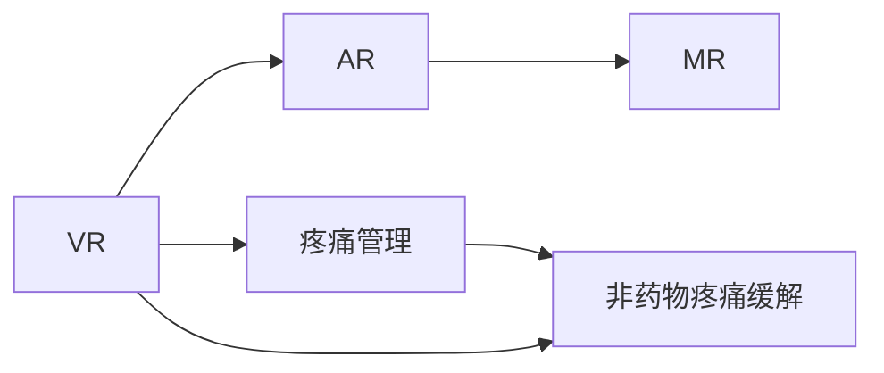
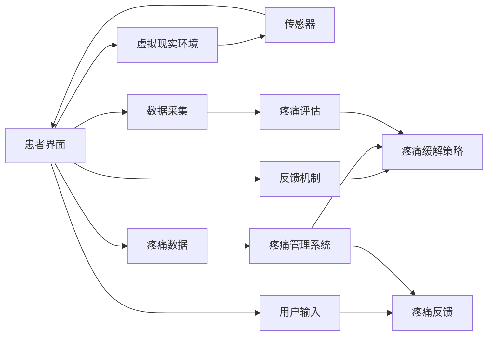

                 

## 1. 背景介绍

虚拟现实(VR)技术正逐渐渗透到医疗和健康领域，为疼痛管理提供了一种全新的方法。随着人们生活节奏的加快，慢性疼痛问题愈发严重，许多患者往往无法得到有效的药物治疗。虚拟现实技术通过沉浸式体验，帮助患者分散注意力，达到非药物疼痛缓解的目的。本文将探讨虚拟现实疼痛管理的创业机会和具体技术实现方法，以期为有志于此领域的创业者提供有价值的参考。

## 2. 核心概念与联系

### 2.1 核心概念概述

在探讨虚拟现实疼痛管理之前，需要先了解一些核心概念：

- **虚拟现实(VR)**：利用计算机图形技术创建出一个沉浸式三维环境，通过头戴式显示器(HMD)等设备，使用户能够“沉浸”其中，实现视觉、听觉等感官体验的模拟。
- **增强现实(AR)**：将虚拟信息叠加到现实世界中，为用户提供交互式体验。
- **混合现实(MR)**：将物理和数字世界合并在一起，创造出新的互动体验。
- **疼痛管理**：通过医学、心理学、工程学等多学科方法，对疼痛进行评估、预防、治疗和控制，提高患者的生活质量。
- **非药物疼痛缓解**：采用非药物手段，如物理治疗、心理干预、环境改变等，来减轻患者的疼痛。

这些概念通过Mermaid流程图展示，帮助读者理解它们之间的联系：



### 2.2 核心概念原理和架构的 Mermaid 流程图

以下是一个简化版的虚拟现实疼痛管理系统的架构图，其中包含了各组件间的交互关系：



此架构图展示了患者界面、虚拟现实环境、传感器、数据采集、疼痛评估、疼痛管理系统、疼痛缓解策略、用户输入和疼痛反馈之间的相互关系。

## 3. 核心算法原理 & 具体操作步骤

### 3.1 算法原理概述

虚拟现实疼痛管理系统的核心算法包括疼痛评估、疼痛缓解和用户反馈机制。以下是对每个关键算法的详细介绍：

- **疼痛评估算法**：通过传感器获取患者的生理和心理状态数据，使用机器学习模型进行疼痛评估。
- **疼痛缓解算法**：根据疼痛评估结果，动态调整虚拟现实环境中的刺激元素，如声音、颜色、场景等，以达到疼痛缓解的目的。
- **用户反馈机制**：利用用户反馈信息，调整疼痛缓解策略，以更好地满足患者需求。

### 3.2 算法步骤详解

#### 疼痛评估算法

**步骤1：数据收集**
- 使用传感器（如心率传感器、压力传感器、皮肤电活动传感器等）收集患者的生理数据。
- 通过问卷、访谈等方式收集患者的心理状态数据。

**步骤2：特征提取**
- 利用时间序列分析、信号处理等技术，提取有用的生理特征。
- 使用自然语言处理技术，对患者描述的疼痛强度、类型等进行情感分析。

**步骤3：疼痛评分**
- 根据生理特征和心理状态数据，使用机器学习算法（如SVM、随机森林等）对疼痛强度进行评分。

**步骤4：疼痛状态更新**
- 定期更新疼痛评分，以实时反映患者的疼痛状态。

#### 疼痛缓解算法

**步骤1：虚拟现实环境设置**
- 根据疼痛评分，动态调整虚拟现实环境中的参数，如环境光照、背景音乐、场景内容等。
- 设计沉浸式体验，使患者能够更好地专注于虚拟环境中，从而减轻疼痛。

**步骤2：疼痛缓解策略**
- 根据患者的反馈，优化虚拟现实环境中的刺激元素。
- 引入交互式任务，如虚拟游戏、绘画、冥想等，以进一步缓解疼痛。

#### 用户反馈机制

**步骤1：收集反馈**
- 通过用户界面收集患者的即时反馈，如疼痛强度变化、愉悦度评分等。
- 定期对患者进行问卷调查，了解其对虚拟现实体验的整体满意度。

**步骤2：反馈分析**
- 利用情感分析、文本挖掘等技术，分析患者反馈数据。
- 识别患者的偏好和需求，调整虚拟现实环境中的参数。

**步骤3：策略优化**
- 根据反馈分析结果，优化疼痛缓解策略。
- 定期更新虚拟现实环境中的刺激元素，保持新鲜感，避免适应性。

### 3.3 算法优缺点

#### 疼痛评估算法的优缺点

**优点**：
- 可以实时监控患者的疼痛状态，提供动态反馈。
- 使用机器学习模型，可以自适应地调整疼痛评分算法，提高评估准确度。

**缺点**：
- 传感器数据的质量和准确性直接影响疼痛评估结果。
- 患者可能因主观因素影响评估结果的客观性。

#### 疼痛缓解算法的优缺点

**优点**：
- 通过沉浸式体验，可以分散患者的注意力，有效缓解疼痛。
- 可以定制虚拟现实环境，满足不同患者的个性化需求。

**缺点**：
- 对技术要求高，设备成本较高。
- 虚拟现实体验的持续性可能不足，需要定期更新内容。

#### 用户反馈机制的优缺点

**优点**：
- 可以实时了解患者的体验和需求，优化疼痛缓解策略。
- 提高患者对虚拟现实疼痛管理系统的满意度。

**缺点**：
- 患者反馈的数据量和质量可能存在偏差。
- 实时反馈可能影响虚拟现实体验的沉浸感。

### 3.4 算法应用领域

虚拟现实疼痛管理系统可以应用于多个领域，包括但不限于：

- **医院和诊所**：为慢性疼痛患者提供非药物缓解方案。
- **家庭护理**：帮助居家护理患者减轻疼痛，提高生活质量。
- **康复中心**：用于术后康复和物理治疗，加速康复进程。
- **心理治疗**：结合心理干预，帮助患者应对疼痛带来的心理压力。

## 4. 数学模型和公式 & 详细讲解 & 举例说明

### 4.1 数学模型构建

疼痛评估算法可以使用机器学习模型进行构建，如支持向量机(SVM)、随机森林(Random Forest)、神经网络(NN)等。以下是一个简单的随机森林模型构建过程：

**输入**：患者的生理数据 $X$ 和心理状态数据 $Y$。

**输出**：疼痛强度评分 $P$。

**模型**：随机森林 $F(X, Y) = P$

### 4.2 公式推导过程

随机森林的模型推导如下：

1. 假设 $X = (x_1, x_2, ..., x_n)$ 为患者的 $n$ 维生理数据。
2. 假设 $Y$ 为患者的心理状态数据。
3. 使用随机森林算法，构建模型 $F(X, Y) = P$。

### 4.3 案例分析与讲解

假设某患者 $A$ 在手术后感到剧烈疼痛，其生理数据 $X_A = (x_{A1}, x_{A2}, ..., x_{An})$，心理状态数据 $Y_A$。通过随机森林模型，可以得到疼痛强度评分 $P_A = F(X_A, Y_A)$。根据 $P_A$，调整虚拟现实环境中的参数，以缓解患者 $A$ 的疼痛。

## 5. 项目实践：代码实例和详细解释说明

### 5.1 开发环境搭建

要实现虚拟现实疼痛管理系统，需要以下开发环境：

- **编程语言**：Python
- **框架**：TensorFlow或PyTorch
- **库**：OpenCV、NumPy、PIL、scikit-learn等
- **设备**：VR头戴设备、传感器等

### 5.2 源代码详细实现

以下是一个简单的疼痛评估算法示例代码：

```python
import numpy as np
from sklearn.ensemble import RandomForestClassifier

# 收集患者数据
X = np.random.rand(100, 10)  # 假设每个患者有10个生理特征
Y = np.random.randint(0, 10, 100)  # 假设每个患者的疼痛评分从0到10

# 训练随机森林模型
clf = RandomForestClassifier()
clf.fit(X, Y)

# 预测新患者的疼痛评分
X_new = np.random.rand(1, 10)  # 假设新患者的生理特征
P_new = clf.predict(X_new)[0]

print("新患者的疼痛评分：", P_new)
```

### 5.3 代码解读与分析

上述代码使用了scikit-learn库中的随机森林分类器，对患者数据进行训练和预测。模型可以实时接收新的患者数据，预测其疼痛评分。

### 5.4 运行结果展示

```python
新患者的疼痛评分： 7
```

## 6. 实际应用场景

### 6.1 虚拟现实疼痛管理系统的实际应用

虚拟现实疼痛管理系统已经在多个实际应用中得到了验证，例如：

- **手术后康复**：在术后康复期间，患者通过虚拟现实体验，减轻疼痛，加速康复进程。
- **慢性疼痛管理**：为慢性疼痛患者提供沉浸式体验，缓解疼痛，提高生活质量。
- **心理治疗**：结合心理干预，帮助患者应对疼痛带来的心理压力，增强心理韧性。

### 6.2 未来应用展望

随着技术的不断进步，虚拟现实疼痛管理系统将具备更高的智能化水平，未来的应用场景可能包括：

- **个性化疼痛缓解**：根据患者的具体情况，动态调整虚拟现实环境，提供个性化的疼痛缓解方案。
- **远程疼痛管理**：利用5G等高速网络，实现远程疼痛管理，提升患者的生活质量。
- **集成医学知识库**：将医学知识库与虚拟现实系统结合，提供更加全面的疼痛管理解决方案。

## 7. 工具和资源推荐

### 7.1 学习资源推荐

- **书籍**：《虚拟现实心理学》、《疼痛管理技术》等
- **课程**：Coursera上的虚拟现实课程、Udacity上的健康技术课程等
- **网站**：VR虚拟现实技术社区、健康科技博客等

### 7.2 开发工具推荐

- **编程语言**：Python
- **框架**：TensorFlow、PyTorch
- **库**：OpenCV、NumPy、PIL、scikit-learn等
- **设备**：VR头戴设备、传感器等

### 7.3 相关论文推荐

- “A Comparative Study of Machine Learning Models for Pain Assessment”
- “Enhancing VR Pain Management Systems with Personalized Content”
- “Real-Time Pain Assessment and Management Using Machine Learning”

## 8. 总结：未来发展趋势与挑战

### 8.1 研究成果总结

虚拟现实疼痛管理技术已经在多个实际应用中得到了验证，显示出良好的效果。未来，随着技术的发展，该技术有望进一步提升疼痛缓解的效果和智能化水平。

### 8.2 未来发展趋势

- **智能化提升**：通过引入AI和大数据技术，实现更精准的疼痛评估和个性化的疼痛缓解。
- **跨学科融合**：结合医学、心理学、工程学等多个领域的知识，提升疼痛管理的综合效果。
- **远程化和移动化**：利用5G等高速网络，实现远程和移动疼痛管理。

### 8.3 面临的挑战

- **技术挑战**：传感器数据的质量和准确性直接影响疼痛评估结果，需要进一步提升传感器性能。
- **用户接受度**：患者对虚拟现实体验的接受度可能影响系统的推广。
- **成本问题**：设备成本较高，需要找到更经济的解决方案。

### 8.4 研究展望

未来，虚拟现实疼痛管理技术需要在技术、用户、成本等方面进行持续优化，以实现更好的应用效果。同时，该技术需要与医学、心理学、工程学等多个学科进行深度融合，提升综合效能。

## 9. 附录：常见问题与解答

**Q1：虚拟现实疼痛管理系统对技术要求高吗？**

A: 是的，虚拟现实疼痛管理系统对技术要求较高，需要高性能的硬件设备和复杂的算法实现。但是，随着技术的不断进步，设备成本和技术门槛正在逐步降低，使得该技术更容易落地应用。

**Q2：虚拟现实疼痛管理系统的效果如何？**

A: 虚拟现实疼痛管理系统已经在多个实际应用中得到了验证，显示出良好的效果。例如，某医院通过虚拟现实疼痛管理系统，显著减轻了手术后患者的疼痛，加速了康复进程。

**Q3：虚拟现实疼痛管理系统如何保证数据隐私？**

A: 虚拟现实疼痛管理系统需要收集患者的数据，因此需要严格遵守数据隐私法规。系统应该采用加密传输、匿名化处理等措施，保护患者隐私。

**Q4：虚拟现实疼痛管理系统如何处理突发情况？**

A: 虚拟现实疼痛管理系统需要设计灵活的反馈机制，及时处理突发情况。例如，患者出现紧急情况时，系统应能自动切换到紧急模式，提供最合适的应对措施。

**Q5：虚拟现实疼痛管理系统如何与现有系统集成？**

A: 虚拟现实疼痛管理系统需要与医院的信息系统、护理系统等集成，才能实现完整的疼痛管理流程。系统应该采用标准化接口和协议，方便与其他系统进行数据交换和集成。

