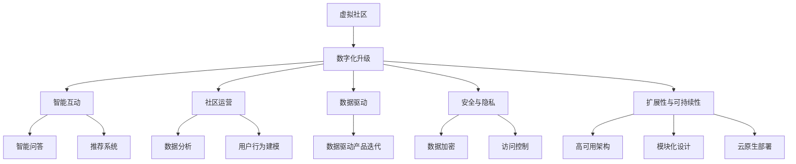

                 

# 虚拟社区:全球社区行业的数字化升级

## 1. 背景介绍

### 1.1 问题由来

在互联网时代，社区作为一种重要的社交形式，已成为人们日常生活不可或缺的一部分。传统的线下社区活动形式受时空限制，而线上虚拟社区以其便捷、低成本、高互动性等特点，迅速在全球范围内普及。然而，传统的社区运营和管理方式依旧以人工为主，效率低下、成本高昂、无法快速响应用户需求等问题逐渐凸显。

社区行业数字化升级是大势所趋，但仍面临诸多挑战。如何构建一个高效、智能、可持续发展的虚拟社区，成为社区运营商和企业亟需解决的问题。

### 1.2 问题核心关键点

社区数字化升级的核心在于利用数字化技术，优化社区的运营和管理流程，提升用户体验和服务质量。具体关键点包括：

- 智能互动：通过智能问答、推荐系统等技术，提升用户互动体验。
- 社区运营：借助大数据分析、用户行为建模等技术，优化社区运营策略。
- 数据驱动：以数据为基础，驱动社区产品迭代和优化。
- 安全与隐私：构建安全、隐私友好的社区环境，保护用户数据安全。
- 扩展性与可持续性：开发具有高可扩展性、可持续发展的社区平台。

## 2. 核心概念与联系

### 2.1 核心概念概述

为更好地理解社区数字化升级，本节将介绍几个关键概念：

- 虚拟社区（Virtual Community）：通过互联网技术连接用户，提供线上互动、交流、娱乐等功能的服务平台。
- 数字化升级（Digital Transformation）：通过引入数字化技术，优化流程、提升效率、创新服务，实现业务模式变革。
- 智能互动（Smart Interaction）：利用人工智能技术，提升用户互动体验，如聊天机器人、推荐系统等。
- 社区运营（Community Management）：通过数据分析、用户行为建模等技术，优化社区运营策略，提高用户粘性和满意度。
- 数据驱动（Data-Driven）：以数据为基础，驱动社区产品迭代和优化，提高决策效率和精准度。
- 安全与隐私（Security and Privacy）：保护用户数据安全，构建安全、隐私友好的社区环境。
- 扩展性与可持续性（Scalability and Sustainability）：构建具有高可扩展性、可持续发展的社区平台，满足不同用户需求。

这些概念之间的逻辑关系可以通过以下Mermaid流程图来展示：



这个流程图展示了虚拟社区和数字化升级的核心概念及其之间的联系：

1. 虚拟社区通过数字化升级，引入各种智能技术，提升互动体验。
2. 社区运营通过数据分析和用户行为建模，优化策略，提高用户满意度。
3. 数据驱动使产品迭代更具针对性和精准度。
4. 安全与隐私保护确保用户数据安全。
5. 扩展性与可持续性构建可扩展、可持续的社区平台。

## 3. 核心算法原理 & 具体操作步骤

### 3.1 算法原理概述

社区数字化升级的算法原理，主要包括以下几个方面：

- 基于机器学习的数据分析：通过聚类、分类、回归等机器学习算法，分析社区用户行为数据，发现用户兴趣、偏好，优化社区内容推荐。
- 基于规则和模式的社区运营：设计合理的运营规则和模式，利用用户行为数据进行监控和干预，提升用户互动率和满意度。
- 基于自然语言处理（NLP）的智能互动：通过聊天机器人、智能问答等技术，实现用户自动回复和互动，提升用户体验。
- 基于深度学习的推荐系统：通过深度学习模型，学习用户行为数据，提供个性化内容推荐，提升用户粘性。
- 基于强化学习的运营优化：利用强化学习算法，不断优化社区运营策略，提升运营效果。

这些算法和技术，构成了社区数字化升级的核心框架，使社区运营和管理更加智能化、高效化。

### 3.2 算法步骤详解

基于社区数字化升级的算法步骤，主要包括以下几个关键步骤：

**Step 1: 数据收集与预处理**
- 收集社区用户的各种行为数据，包括访问记录、互动信息、评论内容等。
- 对数据进行清洗、去重、归一化等预处理，确保数据质量和一致性。

**Step 2: 数据分析与建模**
- 利用机器学习算法对用户行为数据进行分析，发现用户兴趣、偏好等特征。
- 构建用户行为模型，如用户兴趣模型、行为预测模型等，用于指导社区内容推荐和运营策略。

**Step 3: 智能互动与推荐系统**
- 设计智能问答系统，通过自然语言处理技术，实现用户自动回复和互动。
- 构建个性化推荐系统，利用深度学习模型，学习用户行为数据，提供个性化内容推荐。

**Step 4: 社区运营与优化**
- 设计社区运营规则和模式，通过数据分析和用户行为建模，优化社区运营策略，提升用户粘性和满意度。
- 利用强化学习算法，不断优化运营策略，提升社区运营效果。

**Step 5: 安全与隐私保护**
- 构建数据加密、访问控制等安全机制，保护用户数据安全。
- 实现隐私保护技术，如差分隐私、联邦学习等，确保用户隐私不被泄露。

**Step 6: 扩展性与可持续性**
- 采用高可用架构、模块化设计等技术，确保社区平台可扩展、可持续。
- 利用云原生技术，实现社区平台的弹性扩展和自动优化。

通过以上步骤，可以实现社区的数字化升级，提升社区运营和管理效率，提升用户体验和满意度。

### 3.3 算法优缺点

社区数字化升级的算法具有以下优点：

- 提升社区运营效率：通过数据驱动，实现精准运营，提高用户互动率和满意度。
- 增强用户体验：通过智能互动和个性化推荐，提升用户体验和粘性。
- 优化社区内容：通过数据分析和用户行为建模，优化社区内容推荐。

同时，该算法也存在以下缺点：

- 依赖高质量数据：数据质量直接决定分析结果的准确性和应用效果，数据收集和预处理成本较高。
- 模型复杂度较高：构建深度学习模型和强化学习模型，对计算资源和算法实现要求较高。
- 安全性问题：数据加密和隐私保护技术需要不断更新和改进，以应对不断变化的威胁。
- 扩展性挑战：高可用架构和云原生部署技术，需要深厚的技术积累和持续优化。

尽管存在这些缺点，但社区数字化升级的算法依旧是大势所趋，通过持续优化和改进，可以最大化其优势，解决潜在问题。

### 3.4 算法应用领域

社区数字化升级的算法在多个领域具有广泛应用，具体包括：

- 在线教育：通过数据分析和智能互动技术，提升在线教育效果，优化教学内容。
- 社交媒体：通过个性化推荐和智能互动，提升用户互动体验，优化社区内容。
- 旅游平台：通过数据分析和用户行为建模，优化旅游内容推荐，提升用户满意度。
- 金融服务：通过数据分析和社区运营，提升用户忠诚度，优化金融产品推荐。
- 电商平台：通过数据分析和个性化推荐，提升用户购买体验，优化商品推荐。
- 健康医疗：通过数据分析和智能互动，提升健康医疗服务，优化用户健康管理。

这些应用场景展示了社区数字化升级算法的多样性和广泛性，为社区运营商和企业提供了丰富的技术支持和创新空间。

## 4. 数学模型和公式 & 详细讲解

### 4.1 数学模型构建

社区数字化升级的数学模型，主要基于以下几个关键公式：

- 用户兴趣模型：$I(u) = \sum_{i=1}^n w_i f_i(u)$，其中 $w_i$ 为特征权重，$f_i(u)$ 为特征函数，$I(u)$ 为用户兴趣度。
- 行为预测模型：$P(a|u) = \frac{exp(\sum_{i=1}^n w_i f_i(a|u))}{\sum_{a'} exp(\sum_{i=1}^n w_i f_i(a'|u))}$，其中 $w_i$ 为特征权重，$f_i(a|u)$ 为特征函数，$P(a|u)$ 为行为概率。
- 推荐系统模型：$R(x|u) = \sigma(\sum_{i=1}^n w_i f_i(x|u))$，其中 $w_i$ 为特征权重，$f_i(x|u)$ 为特征函数，$R(x|u)$ 为推荐评分。

### 4.2 公式推导过程

以下我们以用户兴趣模型为例，推导其公式及其推导过程。

假设社区用户 $u$ 的兴趣可以由 $n$ 个特征描述，记为 $f_1(u), f_2(u), ..., f_n(u)$。每个特征 $f_i$ 对用户兴趣的影响可以通过 $w_i$ 表示，$w_i$ 为特征权重，满足 $w_i > 0$。则用户 $u$ 的兴趣模型可以表示为：

$$
I(u) = \sum_{i=1}^n w_i f_i(u)
$$

假设 $f_i(u)$ 表示特征 $i$ 对用户兴趣的影响程度，可以表示为：

$$
f_i(u) = f_i(\mathbf{x}_u)
$$

其中 $\mathbf{x}_u$ 为社区用户 $u$ 的特征向量，包含 $n$ 个特征 $x_{u,1}, x_{u,2}, ..., x_{u,n}$。则用户兴趣模型可以进一步表示为：

$$
I(u) = \sum_{i=1}^n w_i f_i(\mathbf{x}_u)
$$

在实际应用中，$f_i(u)$ 可以通过多种方法进行计算，如线性回归、逻辑回归等机器学习算法。通过合理选择特征 $f_i(u)$ 和特征权重 $w_i$，可以构建用户兴趣模型，用于指导社区内容推荐和运营策略。

### 4.3 案例分析与讲解

**案例分析：在线教育平台**

在线教育平台通过社区数字化升级，提升用户互动和教学效果。具体而言，平台可以收集用户的学习行为数据，如访问时间、观看时长、考试成绩等。利用用户兴趣模型，平台可以发现用户的学习兴趣和偏好，推荐相关课程和学习资源。同时，通过智能问答系统和推荐系统，平台可以实现用户自动回复和互动，提升用户体验。通过数据分析和运营策略优化，平台可以提高用户满意度和忠诚度，促进课程销售和平台发展。

## 5. 项目实践：代码实例和详细解释说明

### 5.1 开发环境搭建

在进行社区数字化升级实践前，我们需要准备好开发环境。以下是使用Python进行PyTorch开发的环境配置流程：

1. 安装Anaconda：从官网下载并安装Anaconda，用于创建独立的Python环境。

2. 创建并激活虚拟环境：
```bash
conda create -n community-env python=3.8 
conda activate community-env
```

3. 安装PyTorch：根据CUDA版本，从官网获取对应的安装命令。例如：
```bash
conda install pytorch torchvision torchaudio cudatoolkit=11.1 -c pytorch -c conda-forge
```

4. 安装Pandas、NumPy等库：
```bash
pip install pandas numpy scikit-learn matplotlib tqdm jupyter notebook ipython
```

完成上述步骤后，即可在`community-env`环境中开始社区数字化升级实践。

### 5.2 源代码详细实现

下面我们以在线教育平台的推荐系统为例，给出使用PyTorch进行社区数字化升级的PyTorch代码实现。

首先，定义推荐系统的数据处理函数：

```python
import pandas as pd
import numpy as np
from sklearn.model_selection import train_test_split
from sklearn.metrics import mean_squared_error

def load_data(file_path):
    data = pd.read_csv(file_path)
    return data

def split_data(data, test_ratio=0.2):
    train_data, test_data = train_test_split(data, test_size=test_ratio, random_state=42)
    return train_data, test_data

def preprocess_data(data):
    # 数据清洗和预处理
    # ...
    return processed_data

def evaluate_model(model, test_data):
    # 评估模型性能
    # ...
    return mse
```

然后，定义模型和优化器：

```python
from transformers import BertTokenizer
from torch.utils.data import Dataset, DataLoader
import torch
import torch.nn as nn
import torch.optim as optim

class RecommendationSystem(nn.Module):
    def __init__(self, input_size, hidden_size, output_size):
        super(RecommendationSystem, self).__init__()
        self.fc1 = nn.Linear(input_size, hidden_size)
        self.fc2 = nn.Linear(hidden_size, output_size)
        
    def forward(self, x):
        x = torch.relu(self.fc1(x))
        x = self.fc2(x)
        return x

model = RecommendationSystem(input_size, hidden_size, output_size)
optimizer = optim.Adam(model.parameters(), lr=learning_rate)
```

接着，定义训练和评估函数：

```python
def train_epoch(model, train_data, batch_size, optimizer):
    dataloader = DataLoader(train_data, batch_size=batch_size, shuffle=True)
    model.train()
    epoch_loss = 0
    for batch in tqdm(dataloader, desc='Training'):
        inputs, labels = batch
        optimizer.zero_grad()
        outputs = model(inputs)
        loss = nn.MSELoss()(outputs, labels)
        epoch_loss += loss.item()
        loss.backward()
        optimizer.step()
    return epoch_loss / len(dataloader)

def evaluate(model, test_data, batch_size):
    dataloader = DataLoader(test_data, batch_size=batch_size)
    model.eval()
    mse = 0
    with torch.no_grad():
        for batch in tqdm(dataloader, desc='Evaluating'):
            inputs, labels = batch
            outputs = model(inputs)
            mse += nn.MSELoss()(outputs, labels).item()
    return mse / len(test_data)
```

最后，启动训练流程并在测试集上评估：

```python
epochs = 10
batch_size = 32
learning_rate = 1e-3

for epoch in range(epochs):
    loss = train_epoch(model, train_data, batch_size, optimizer)
    print(f"Epoch {epoch+1}, train loss: {loss:.3f}")
    
    print(f"Epoch {epoch+1}, dev results:")
    mse = evaluate(model, test_data, batch_size)
    print(f"Mean Squared Error: {mse:.3f}")
    
print("Test results:")
mse = evaluate(model, test_data, batch_size)
print(f"Mean Squared Error: {mse:.3f}")
```

以上就是使用PyTorch进行在线教育平台推荐系统的社区数字化升级实践的完整代码实现。可以看到，借助PyTorch的强大封装和灵活性，我们可以用相对简洁的代码实现复杂的推荐系统。

### 5.3 代码解读与分析

让我们再详细解读一下关键代码的实现细节：

**load_data函数**：
- 从指定的CSV文件中加载数据，并将其转换为Pandas DataFrame格式。

**split_data函数**：
- 对数据进行训练集和测试集的划分，根据指定的测试集比例进行随机分割。

**preprocess_data函数**：
- 对数据进行清洗、去重、归一化等预处理，确保数据质量和一致性。

**RecommendationSystem类**：
- 定义推荐系统的模型结构，包括全连接层和激活函数。

**训练和评估函数**：
- 使用PyTorch的DataLoader对数据集进行批次化加载，供模型训练和推理使用。
- 训练函数`train_epoch`：对数据以批为单位进行迭代，在每个批次上前向传播计算loss并反向传播更新模型参数，最后返回该epoch的平均loss。
- 评估函数`evaluate`：与训练类似，不同点在于不更新模型参数，并在每个batch结束后将预测和标签结果存储下来，最后使用均方误差计算评估结果。

**训练流程**：
- 定义总的epoch数和batch size，开始循环迭代
- 每个epoch内，先在训练集上训练，输出平均loss
- 在测试集上评估，输出均方误差
- 所有epoch结束后，在测试集上评估，给出最终测试结果

可以看到，PyTorch配合深度学习框架使得社区数字化升级的代码实现变得简洁高效。开发者可以将更多精力放在数据处理、模型改进等高层逻辑上，而不必过多关注底层的实现细节。

当然，工业级的系统实现还需考虑更多因素，如模型的保存和部署、超参数的自动搜索、更灵活的任务适配层等。但核心的社区数字化升级范式基本与此类似。

## 6. 实际应用场景

### 6.1 智能教育

在线教育平台通过社区数字化升级，实现个性化推荐和智能互动，提升教学效果和用户体验。具体而言，平台可以收集学生的学习行为数据，如访问时间、观看时长、考试成绩等。利用用户兴趣模型，平台可以发现学生的学习兴趣和偏好，推荐相关课程和学习资源。同时，通过智能问答系统和推荐系统，平台可以实现学生自动回复和互动，提升学习体验。通过数据分析和运营策略优化，平台可以提高学生满意度和忠诚度，促进课程销售和平台发展。

### 6.2 社交媒体

社交媒体平台通过社区数字化升级，提升用户互动体验和社区内容质量。具体而言，平台可以收集用户的行为数据，如点赞、评论、分享等。利用用户兴趣模型，平台可以发现用户的兴趣和偏好，推荐相关内容。同时，通过智能问答系统和推荐系统，平台可以实现用户自动回复和互动，提升用户粘性。通过数据分析和运营策略优化，平台可以提高用户满意度和平台活跃度，增强社区凝聚力。

### 6.3 旅游平台

旅游平台通过社区数字化升级，优化旅游内容推荐和用户体验。具体而言，平台可以收集用户的行为数据，如浏览历史、搜索记录、预订记录等。利用用户兴趣模型，平台可以发现用户的旅游兴趣和偏好，推荐相关旅游内容和行程。同时，通过智能问答系统和推荐系统，平台可以实现用户自动回复和互动，提升用户满意度。通过数据分析和运营策略优化，平台可以提高用户粘性和满意度，促进平台业务发展。

### 6.4 金融服务

金融服务平台通过社区数字化升级，提升用户忠诚度和产品推荐效果。具体而言，平台可以收集用户的交易行为数据，如投资记录、交易偏好、风险承受能力等。利用用户兴趣模型，平台可以发现用户的金融需求和偏好，推荐相关金融产品和服务。同时，通过智能问答系统和推荐系统，平台可以实现用户自动回复和互动，提升用户满意度和粘性。通过数据分析和运营策略优化，平台可以提高用户忠诚度和产品推荐效果，增强平台业务竞争力。

### 6.5 电商平台

电商平台通过社区数字化升级，优化商品推荐和用户体验。具体而言，平台可以收集用户的行为数据，如浏览历史、购买记录、评价反馈等。利用用户兴趣模型，平台可以发现用户的购物兴趣和偏好，推荐相关商品和促销活动。同时，通过智能问答系统和推荐系统，平台可以实现用户自动回复和互动，提升用户满意度。通过数据分析和运营策略优化，平台可以提高用户粘性和销售额，促进平台业务增长。

## 7. 工具和资源推荐

### 7.1 学习资源推荐

为了帮助开发者系统掌握社区数字化升级的理论基础和实践技巧，这里推荐一些优质的学习资源：

1. 《机器学习实战》：深入浅出地介绍了机器学习算法及其应用，适合入门学习。

2. 《深度学习》（Goodfellow等人）：系统介绍了深度学习的基本原理和应用，适合进阶学习。

3. 《NLP与深度学习》：介绍NLP和深度学习在社区数字化升级中的应用，适合NLP从业者学习。

4. 《Python数据科学手册》：详细介绍了Python在数据科学和机器学习中的应用，适合Python开发者学习。

5. 《Data Science from Scratch》：从零基础开始，系统介绍数据科学和机器学习，适合初学者学习。

通过对这些资源的学习实践，相信你一定能够快速掌握社区数字化升级的精髓，并用于解决实际的社区运营问题。

### 7.2 开发工具推荐

高效的开发离不开优秀的工具支持。以下是几款用于社区数字化升级开发的常用工具：

1. PyTorch：基于Python的开源深度学习框架，灵活动态的计算图，适合快速迭代研究。

2. TensorFlow：由Google主导开发的开源深度学习框架，生产部署方便，适合大规模工程应用。

3. Weights & Biases：模型训练的实验跟踪工具，可以记录和可视化模型训练过程中的各项指标，方便对比和调优。

4. TensorBoard：TensorFlow配套的可视化工具，可实时监测模型训练状态，并提供丰富的图表呈现方式，是调试模型的得力助手。

5. Jupyter Notebook：交互式开发环境，支持多种语言和库的混合使用，适合快速原型开发和调试。

合理利用这些工具，可以显著提升社区数字化升级的开发效率，加快创新迭代的步伐。

### 7.3 相关论文推荐

社区数字化升级的研究源于学界的持续研究。以下是几篇奠基性的相关论文，推荐阅读：

1. "A Framework for Community-Based Online Education"：介绍社区数字化升级在在线教育中的应用，提升教学效果和用户体验。

2. "Social Media Analytics for Community Engagement"：介绍社交媒体平台通过社区数字化升级提升用户互动体验和社区内容质量的方法。

3. "Travel Recommendation System Based on Big Data"：介绍旅游平台通过社区数字化升级优化旅游内容推荐和用户体验的方法。

4. "Data Mining and Statistical Learning for Financial Services"：介绍金融服务平台通过社区数字化升级提升用户忠诚度和产品推荐效果的方法。

5. "E-commerce Recommendation System with Deep Learning"：介绍电商平台通过社区数字化升级优化商品推荐和用户体验的方法。

这些论文代表了大语言模型微调技术的发展脉络。通过学习这些前沿成果，可以帮助研究者把握学科前进方向，激发更多的创新灵感。

## 8. 总结：未来发展趋势与挑战

### 8.1 总结

本文对社区数字化升级的算法原理和操作步骤进行了全面系统的介绍。首先阐述了社区数字化升级的背景和意义，明确了智能互动、社区运营、数据驱动、安全与隐私、扩展性与可持续性等核心概念，并展示了它们之间的联系。其次，从原理到实践，详细讲解了社区数字化升级的数学模型和算法步骤，给出了社区数字化升级任务开发的完整代码实例。同时，本文还广泛探讨了社区数字化升级在智能教育、社交媒体、旅游平台、金融服务、电商平台等多个领域的应用前景，展示了社区数字化升级的广阔应用空间。此外，本文精选了社区数字化升级的学习资源、开发工具和相关论文，力求为读者提供全方位的技术指引。

通过本文的系统梳理，可以看到，社区数字化升级通过引入数字化技术，优化社区的运营和管理流程，提升用户体验和服务质量，具有广阔的应用前景。未来，伴随社区数字化升级技术的不断发展，社区运营商和企业将能够构建更高效、智能、可持续发展的社区平台，满足不同用户需求，提高用户满意度和平台竞争力。

### 8.2 未来发展趋势

展望未来，社区数字化升级技术将呈现以下几个发展趋势：

1. 智能互动技术不断成熟：通过不断优化聊天机器人、智能问答等技术，提升用户互动体验，增强社区粘性。

2. 社区运营策略更加精准：通过大数据分析和用户行为建模，优化社区运营策略，提升用户满意度和忠诚度。

3. 个性化推荐系统更加高效：通过深度学习模型和强化学习算法，优化个性化推荐系统，提高推荐精度和用户粘性。

4. 数据安全与隐私保护技术不断进步：通过差分隐私、联邦学习等技术，保护用户数据安全，构建安全、隐私友好的社区环境。

5. 社区扩展性更强：通过高可用架构、云原生部署等技术，实现社区平台的弹性扩展和自动优化。

6. 社区数字化升级在更多场景中应用：在智能教育、社交媒体、旅游平台、金融服务、电商平台等多个领域，社区数字化升级将带来更深入的业务变革。

以上趋势展示了社区数字化升级技术的广阔前景，这些方向的探索发展，必将进一步提升社区运营和管理效率，提升用户体验和满意度。

### 8.3 面临的挑战

尽管社区数字化升级技术已经取得了瞩目成就，但在迈向更加智能化、普适化应用的过程中，它仍面临诸多挑战：

1. 数据质量与隐私保护：数据质量直接决定分析结果的准确性和应用效果，数据收集和预处理成本较高。如何确保数据质量和用户隐私，是社区数字化升级的重要挑战。

2. 模型复杂度与计算资源：构建深度学习模型和强化学习模型，对计算资源和算法实现要求较高。如何在有限的资源条件下，实现高效的社区数字化升级，是一个需要不断探索的问题。

3. 模型鲁棒性与泛化能力：社区数字化升级模型面对不同用户、不同场景时，泛化性能可能有所下降。如何提升模型的鲁棒性和泛化能力，是一个重要的研究方向。

4. 社区扩展性与可扩展性：社区平台的扩展性和可持续性要求不断提升，如何构建高可扩展、可持续发展的社区平台，是社区数字化升级的长期目标。

5. 用户互动与隐私保护：社区数字化升级需要平衡用户互动和隐私保护，如何设计合理的运营规则和机制，保障用户数据安全，是社区数字化升级的重要挑战。

尽管存在这些挑战，但社区数字化升级技术的发展潜力巨大，通过持续优化和改进，可以最大化其优势，解决潜在问题。

### 8.4 研究展望

面对社区数字化升级所面临的挑战，未来的研究需要在以下几个方面寻求新的突破：

1. 探索更加高效的社区数字化升级算法：开发更加参数高效、计算高效的微调方法，如Prefix-Tuning、LoRA等，在固定大部分预训练参数的情况下，只更新极少量的任务相关参数。

2. 融合更多先验知识：将符号化的先验知识，如知识图谱、逻辑规则等，与神经网络模型进行巧妙融合，引导社区数字化升级过程学习更准确、合理的语言模型。

3. 结合因果分析和博弈论工具：将因果分析方法引入社区数字化升级模型，识别出模型决策的关键特征，增强输出解释的因果性和逻辑性。借助博弈论工具刻画人机交互过程，主动探索并规避模型的脆弱点，提高系统稳定性。

4. 纳入伦理道德约束：在模型训练目标中引入伦理导向的评估指标，过滤和惩罚有偏见、有害的输出倾向。加强人工干预和审核，建立模型行为的监管机制，确保输出符合人类价值观和伦理道德。

这些研究方向的探索，必将引领社区数字化升级技术迈向更高的台阶，为构建安全、可靠、可解释、可控的智能系统铺平道路。面向未来，社区数字化升级技术还需要与其他人工智能技术进行更深入的融合，如知识表示、因果推理、强化学习等，多路径协同发力，共同推动社区数字化升级技术的进步。只有勇于创新、敢于突破，才能不断拓展社区数字化升级技术的边界，让智能技术更好地造福社区用户。

## 9. 附录：常见问题与解答

**Q1：社区数字化升级对用户隐私的影响是什么？**

A: 社区数字化升级在数据收集、分析和处理过程中，可能涉及用户隐私问题。如何合理使用数据，保护用户隐私，是社区数字化升级的重要挑战。为避免隐私泄露，社区数字化升级技术通常采用数据加密、差分隐私、联邦学习等技术，确保用户数据安全。

**Q2：社区数字化升级如何平衡用户互动与隐私保护？**

A: 社区数字化升级需要平衡用户互动和隐私保护，合理设计运营规则和机制，保障用户数据安全。例如，可以通过差分隐私技术，对用户数据进行匿名化处理，保护用户隐私。同时，可以设计合理的访问控制策略，限制对敏感数据的访问，降低隐私泄露风险。

**Q3：社区数字化升级对平台扩展性的影响是什么？**

A: 社区数字化升级需要考虑平台的扩展性和可持续性，确保平台在不断扩展用户和内容的同时，保持高效稳定运行。通过高可用架构、云原生部署等技术，可以实现社区平台的弹性扩展和自动优化，提升平台扩展性和可持续性。

**Q4：社区数字化升级对用户满意度的影响是什么？**

A: 社区数字化升级通过提升智能互动、优化社区内容推荐、改进运营策略等措施，显著提升用户满意度。智能问答系统和推荐系统可以提升用户互动体验，社区运营策略优化可以提高用户满意度和忠诚度。

**Q5：社区数字化升级对平台收入的影响是什么？**

A: 社区数字化升级通过提升用户互动、优化内容推荐、提高用户粘性等措施，增加用户活跃度和留存率，从而提升平台收入。通过个性化推荐和智能互动，平台可以实现精准营销和广告投放，增加收入来源。

总之，社区数字化升级技术通过引入数字化技术，优化社区的运营和管理流程，提升用户体验和服务质量，具有广阔的应用前景。未来，伴随社区数字化升级技术的不断发展，社区运营商和企业将能够构建更高效、智能、可持续发展的社区平台，满足不同用户需求，提高用户满意度和平台竞争力。

