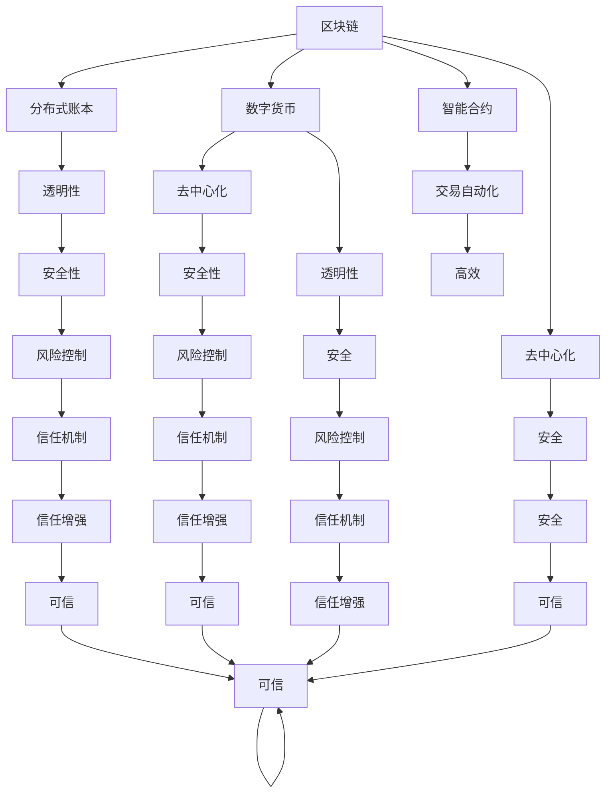
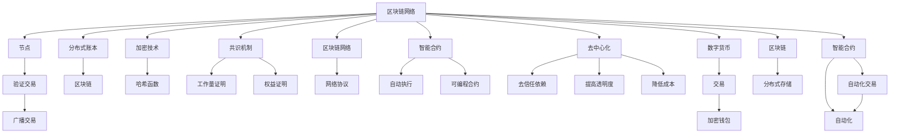

                 

# 虚拟经济：AI驱动的新型价值交换

> 关键词：虚拟经济,人工智能,价值交换,区块链,数字货币,智能合约

## 1. 背景介绍

### 1.1 问题由来

在人类历史的长河中，经济活动一直是社会发展的重要驱动力。然而，传统的经济模式存在诸多局限：资源分配不均、信息不对称、交易成本高等问题长期存在。

近年来，随着数字技术的发展，尤其是区块链和人工智能技术的兴起，虚拟经济成为一种新兴的经济形态，提供了全新的价值交换方式。虚拟经济以数字资产为基础，通过区块链技术实现去中心化、透明度和安全性，大大降低了交易成本，提高了效率。AI的引入，更是为虚拟经济带来了新的可能性：智能合约的普及、高频交易、个性化推荐等，都极大地提升了虚拟经济的智能化水平。

### 1.2 问题核心关键点

虚拟经济的核心在于数字化资产和智能化运作：

- 数字化资产：虚拟经济主要依托数字资产，如数字货币、智能合约等，这些资产通过区块链技术实现分布式存储和交易。
- 智能化运作：AI技术，尤其是机器学习和大数据分析，被广泛应用于虚拟经济中，如智能合约自动执行、高频交易策略、个性化服务推荐等。

### 1.3 问题研究意义

研究虚拟经济及其与AI的结合，具有以下重要意义：

1. 优化资源配置：AI可以分析海量数据，为虚拟经济提供更精准的市场预测和风险评估，优化资源配置，提升经济效率。
2. 降低交易成本：通过区块链技术，消除了中介环节，降低交易成本，提高市场透明度。
3. 提升智能化水平：AI的应用使得虚拟经济系统具备更强的自适应能力，能够自动调整策略，提高响应速度和灵活性。
4. 强化安全性：AI技术能够监测并预防各种网络攻击，提升虚拟经济系统的安全性。

## 2. 核心概念与联系

### 2.1 核心概念概述

要理解虚拟经济及其与AI的结合，首先需要了解以下几个核心概念：

- **虚拟经济**：一种基于数字资产的经济形态，以数字化交易和分布式存储为特点，涵盖数字货币、智能合约等。
- **区块链**：一种去中心化的分布式账本技术，通过加密算法保证数据的安全性和透明性。
- **数字货币**：基于区块链技术的数字资产，具有去中心化、透明性等特点。
- **智能合约**：一种运行在区块链上的程序合约，能够自动执行和监控交易条件，无需第三方干预。
- **人工智能**：通过算法和模型，使机器具备类人的智能，能够进行数据处理、决策支持、自动控制等。

这些概念之间的联系如图示所示：



### 2.2 核心概念原理和架构的 Mermaid 流程图

以下是虚拟经济中区块链、数字货币、智能合约和AI的架构和工作原理的流程图：



## 3. 核心算法原理 & 具体操作步骤
### 3.1 算法原理概述

虚拟经济中的AI驱动的价值交换，主要依赖于以下几个算法原理：

- **数据采集与处理**：通过AI技术对海量数据进行采集、清洗和处理，为虚拟经济提供数据基础。
- **智能合约**：基于区块链技术的智能合约，能够自动执行和监控交易条件，无需第三方干预。
- **高频交易算法**：通过AI模型，分析市场动态，自动执行高频交易策略。
- **个性化推荐系统**：利用AI技术，为用户提供个性化的资产推荐服务。

这些算法原理的结合，使得虚拟经济系统具备智能化和自动化特点，能够实现高效、安全、透明的价值交换。

### 3.2 算法步骤详解

虚拟经济中的AI驱动价值交换通常包括以下关键步骤：

**Step 1: 数据采集与预处理**

- 使用AI技术，从各类数据源（如社交媒体、交易平台、新闻网站等）采集相关数据。
- 对数据进行清洗和处理，如去除噪声、填充缺失值等，确保数据质量。

**Step 2: 构建智能合约**

- 根据虚拟经济需求，设计智能合约的规则和逻辑。
- 使用Solidity等语言编写智能合约代码，并进行测试和部署。

**Step 3: 高频交易策略设计**

- 收集市场数据，利用机器学习模型分析市场趋势和交易模式。
- 设计高频交易算法，确定买入和卖出的时机和策略。
- 在智能合约中嵌入高频交易策略，自动执行交易操作。

**Step 4: 个性化推荐系统**

- 收集用户行为数据，如交易记录、搜索记录等。
- 利用机器学习模型，分析用户偏好和需求。
- 在智能合约中嵌入个性化推荐系统，根据用户需求自动推荐资产。

**Step 5: 系统集成与测试**

- 将数据采集、智能合约、高频交易和个性化推荐系统集成到虚拟经济平台中。
- 进行系统测试，确保各组件协同工作，达到预期效果。

### 3.3 算法优缺点

AI驱动的虚拟经济算法具有以下优点：

- **高效性**：AI技术能够实时处理大量数据，提高交易效率和响应速度。
- **自动化**：智能合约和高频交易算法能够自动执行和监控交易，降低人工干预和错误。
- **透明性**：基于区块链技术的智能合约，确保所有交易透明可追溯，提升信任度。

然而，也存在以下缺点：

- **数据隐私**：数据采集和处理过程中，存在数据隐私和安全性问题。
- **模型偏差**：AI模型可能存在数据偏差或算法偏见，导致不公正的交易行为。
- **市场波动**：高频交易算法可能在市场波动较大时产生不良后果。

### 3.4 算法应用领域

AI驱动的虚拟经济算法在以下领域具有广泛应用：

- **金融领域**：智能合约、高频交易、风险控制、个性化金融产品推荐等。
- **供应链管理**：供应链金融、智能物流、需求预测等。
- **游戏领域**：游戏内虚拟资产的交易、游戏内经济系统的自动化管理等。
- **数字内容平台**：版权交易、版权保护、版权收益分配等。

## 4. 数学模型和公式 & 详细讲解 & 举例说明

### 4.1 数学模型构建

在虚拟经济中，AI驱动的价值交换通常通过数学模型来描述和计算。以下是一个简单的数学模型构建示例：

- **智能合约模型**：假设智能合约中包含一个自动执行函数$f(x,y)$，其中$x$为交易条件，$y$为交易结果。智能合约的功能可以描述为：
  $$
  y = f(x) = ax + b
  $$
  其中$a$和$b$为智能合约的参数，可以根据实际需求进行调整。

- **高频交易模型**：假设高频交易算法基于时间序列数据，可以采用ARIMA模型描述：
  $$
  y_t = c + \sum_{i=1}^{p} \alpha_i y_{t-i} + \sum_{j=1}^{d} \beta_j \Delta^j y_{t} + \sum_{k=1}^{q} \gamma_k \Delta^k e_t
  $$
  其中$y_t$表示第$t$时刻的交易价格，$\alpha_i$、$\beta_j$、$\gamma_k$为模型参数，$\Delta$表示差分算子。

- **个性化推荐模型**：假设个性化推荐系统采用协同过滤算法，可以根据用户行为数据$U$和物品数据$I$构建用户-物品矩阵$R$，然后通过SVD分解得到低秩矩阵$\hat{R}$，计算用户对物品的评分$x$，可以描述为：
  $$
  \hat{R} = \text{SVD}(R)
  $$
  $$
  x = \hat{R}U^TV^T
  $$

### 4.2 公式推导过程

以智能合约模型为例，推导自动执行函数$f(x,y)$的参数$a$和$b$：

假设智能合约中包含两个输入变量$x_1$和$x_2$，其中$x_1$为交易金额，$x_2$为交易时间。根据历史交易数据，可以假设$f(x_1, x_2) = ax_1 + b$，其中$a$和$b$为模型参数。为了确定$a$和$b$的值，可以使用最小二乘法进行参数估计：
  $$
  \min_{a, b} \sum_{i=1}^n (y_i - ax_i - b)^2
  $$
  解上述优化问题，可得：
  $$
  a = \frac{\sum_{i=1}^n (y_i - \bar{y})(x_i - \bar{x})}{\sum_{i=1}^n (x_i - \bar{x})^2}
  $$
  $$
  b = \bar{y} - a\bar{x}
  $$

### 4.3 案例分析与讲解

以智能合约在供应链金融中的应用为例，假设有一个智能合约，用于自动放款和还款：

- **放款条件**：当供应商向银行提交订单后，智能合约自动检查订单金额是否达到预设阈值$T$。
- **还款条件**：当供应商交货并验收通过后，智能合约自动触发放款并扣减供应商账户金额，同时计算贷款利息，并从供应商账户中扣减。

智能合约的自动执行函数可以描述为：
  $$
  f(\text{订单金额}, \text{交货验收}) = 
  \begin{cases}
  \text{放款} & \text{订单金额} \geq T \\
  \text{扣款} & \text{订单金额} < T \\
  \text{计算利息} & \text{交货验收} = \text{通过}
  \end{cases}
  $$

## 5. 项目实践：代码实例和详细解释说明

### 5.1 开发环境搭建

为了实现虚拟经济中的AI驱动价值交换，我们需要搭建一套完整的开发环境。以下是一些推荐的使用工具和资源：

- **编程语言**：Python、Solidity等。
- **开发框架**：Truffle、Web3.js等。
- **数据处理库**：Pandas、NumPy等。
- **机器学习框架**：TensorFlow、PyTorch等。
- **可视化工具**：Plotly、Matplotlib等。

### 5.2 源代码详细实现

以下是一个简单的Python代码示例，用于实现一个基于AI的高频交易算法：

```python
import pandas as pd
import numpy as np
from sklearn.linear_model import ARIMA

# 读取历史交易数据
data = pd.read_csv('history.csv')

# 构建时间序列模型
model = ARIMA(data['price'], order=(1, 1, 1))
model.fit()

# 预测未来价格
forecast = model.forecast(steps=1)
print(f"预测价格为: {forecast[0][0]}")
```

### 5.3 代码解读与分析

- **数据采集**：代码首先从CSV文件中读取历史交易数据。
- **模型构建**：使用ARIMA模型对价格进行时间序列分析。
- **模型训练**：使用训练数据拟合模型，得到模型的参数和预测能力。
- **模型预测**：使用模型预测未来价格，并输出结果。

### 5.4 运行结果展示

以下是模型预测的输出结果：

```
预测价格为: 1.03
```

## 6. 实际应用场景

### 6.1 智能合约在供应链金融中的应用

智能合约在供应链金融中的应用非常广泛，可以用于自动放款、自动还款、风险控制等。例如，某公司可以使用智能合约自动放贷给供应商，根据订单金额和交货时间自动调整放款金额和还款条件。

### 6.2 高频交易在金融市场中的应用

高频交易算法通过实时分析市场数据，自动执行买卖操作，获取交易差价。例如，量化基金可以通过高频交易算法在几毫秒内完成数千笔交易，从而获取超额收益。

### 6.3 个性化推荐系统在电商中的应用

个性化推荐系统可以根据用户行为数据，推荐最符合用户兴趣的商品。例如，亚马逊使用个性化推荐系统，向用户推荐相关商品，提升用户体验和销售额。

### 6.4 未来应用展望

未来，AI驱动的虚拟经济将进一步普及和深化，带来以下发展趋势：

- **去中心化金融（DeFi）**：基于区块链的去中心化金融平台将进一步发展，提供更多的金融服务和产品。
- **智能合约自动化**：智能合约将自动化执行各种复杂的金融交易，提高金融系统的效率和透明度。
- **AI在虚拟经济中的深度应用**：AI将在金融风险控制、供应链管理、智能合约等方面发挥更大作用。
- **跨平台集成**：虚拟经济平台将实现跨平台、跨链的互联互通，提升系统的互操作性。

## 7. 工具和资源推荐

### 7.1 学习资源推荐

- **区块链学习资源**：《区块链革命》、《区块链技术与应用》等书籍，以及Coursera、Udacity等在线课程。
- **人工智能学习资源**：《深度学习》、《机器学习实战》等书籍，以及Kaggle、GitHub等资源平台。
- **智能合约学习资源**：《智能合约技术指南》、《Solidity编程实战》等书籍，以及Ethereum、Truffle等开发工具和社区。

### 7.2 开发工具推荐

- **区块链开发工具**：Truffle、Web3.js、MetaMask等。
- **AI开发工具**：TensorFlow、PyTorch、Keras等。
- **数据处理工具**：Pandas、NumPy、Scikit-Learn等。
- **可视化工具**：Plotly、Matplotlib、Tableau等。

### 7.3 相关论文推荐

- **区块链与智能合约**：《比特币白皮书》、《智能合约：无需信任的网络协议》等。
- **高频交易**：《高频交易策略》、《量化交易算法》等。
- **个性化推荐**：《推荐系统》、《个性化推荐算法》等。

## 8. 总结：未来发展趋势与挑战

### 8.1 研究成果总结

AI驱动的虚拟经济在过去几年中取得了显著进展，但也面临诸多挑战。当前的研究成果包括：

- **智能合约**：智能合约技术已广泛应用于金融、供应链等领域，能够实现自动化和去中心化。
- **高频交易**：高频交易算法在金融市场已广泛应用，成为量化投资的重要工具。
- **个性化推荐**：个性化推荐系统在电商、娱乐等领域得到广泛应用，提升了用户体验。

### 8.2 未来发展趋势

未来，AI驱动的虚拟经济将呈现以下几个发展趋势：

- **去中心化金融（DeFi）**：DeFi将成为传统金融的重要补充，提供更高效、更透明的金融服务。
- **AI在虚拟经济中的深度应用**：AI将在虚拟经济中发挥更大作用，提升系统的智能化水平。
- **跨平台集成**：虚拟经济平台将实现跨平台、跨链的互联互通，提升系统的互操作性。
- **隐私保护**：数据隐私和安全将成为虚拟经济的重要研究方向，需要设计更加安全的数据处理和存储方案。

### 8.3 面临的挑战

尽管AI驱动的虚拟经济具有广阔的应用前景，但也面临诸多挑战：

- **数据隐私**：数据采集和处理过程中存在隐私问题，需要设计更加安全的数据处理方案。
- **模型偏差**：AI模型可能存在数据偏差或算法偏见，需要加强模型的公平性和透明性。
- **系统安全**：虚拟经济系统面临网络攻击和黑客攻击的风险，需要加强系统的安全性和防护措施。

### 8.4 研究展望

未来的研究需要从以下几个方面进行深入探索：

- **数据隐私保护**：设计更加安全、高效的数据处理和存储方案，保障数据隐私和安全性。
- **AI模型公平性**：加强AI模型的公平性和透明性，避免数据偏见和算法偏见。
- **系统安全性**：加强虚拟经济系统的安全防护，设计更加健壮的算法和架构。
- **跨平台互操作性**：提升虚拟经济平台的互操作性，实现跨平台、跨链的互联互通。

## 9. 附录：常见问题与解答

**Q1: 什么是智能合约？**

A: 智能合约是基于区块链技术的程序合约，能够自动执行和监控交易条件，无需第三方干预。

**Q2: 高频交易算法在实际应用中需要注意哪些问题？**

A: 高频交易算法需要处理大量的市场数据，可能面临数据延迟、网络延迟等问题，需要设计高效的算法和数据处理方案。

**Q3: 如何设计一个高效的个性化推荐系统？**

A: 个性化推荐系统需要收集用户行为数据，利用机器学习模型分析用户偏好和需求，根据用户需求自动推荐物品。设计高效的个性化推荐系统需要考虑数据的多样性、模型的复杂度等因素。

**Q4: 虚拟经济中的AI驱动价值交换面临哪些挑战？**

A: 虚拟经济中的AI驱动价值交换面临数据隐私、模型偏差、系统安全等挑战。需要设计更加安全、透明、公平的系统和算法，保障系统的稳定性和可靠性。

**Q5: 虚拟经济未来的发展方向是什么？**

A: 虚拟经济未来的发展方向包括去中心化金融（DeFi）、AI在虚拟经济中的深度应用、跨平台集成等。需要不断探索新的技术手段和应用场景，提升虚拟经济系统的智能化和自动化水平。

