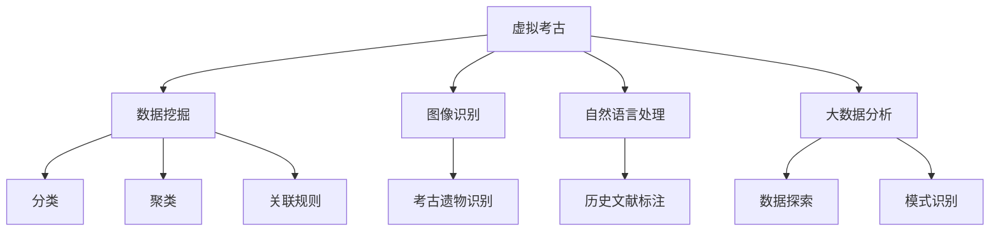

                 

# 虚拟考古:全球脑助力历史研究

> 关键词：虚拟考古, 全球脑, 历史研究, 数据挖掘, 数字人文, 大数据分析

## 1. 背景介绍

在信息技术飞速发展的今天，数据驱动的历史研究已逐渐成为新的趋势。历史研究的数字化，使我们得以从海量文献资料、考古遗存等数据中挖掘出更加丰富的历史信息。然而，数据的海洋中蕴藏着无数的未知和挑战，我们如何从中发现、提取、理解这些信息，并应用于历史研究，成为一项复杂且困难的任务。虚拟考古，作为大数据时代的新兴研究方法，为我们提供了新的视角和工具。

虚拟考古是基于数字技术和人工智能的历史研究方法，其核心思想是通过数据挖掘、图像识别、自然语言处理等技术，对考古遗存、历史文献等数据进行分析和理解，以复原历史场景、重现历史事件。全球脑，作为一种基于分布式计算的强大研究平台，为虚拟考古提供了高效率、大容量的数据处理和分析能力。

本文将深入探讨虚拟考古技术的基本原理和实施步骤，并通过实际案例分析，展示全球脑在虚拟考古中的巨大潜力。

## 2. 核心概念与联系

### 2.1 核心概念概述

本节将介绍虚拟考古和全球脑的核心概念及其相互关系：

**虚拟考古**：指利用数字技术和人工智能对考古遗存、历史文献等数据进行分析，以复原历史场景、重现历史事件的研究方法。虚拟考古不仅能揭示过去的秘密，还推动了跨学科的交流与合作。

**全球脑**：指基于分布式计算和人工智能，由多个节点组成的庞大计算集群。全球脑具有极高的数据处理和分析能力，为大规模数据挖掘和虚拟考古研究提供了强大的计算资源。

**数据挖掘**：指从大量数据中提取有价值的信息和知识的过程，是虚拟考古中的核心技术。数据挖掘包括分类、聚类、关联规则等方法，可以帮助我们从数据中发现历史规律。

**图像识别**：指通过计算机视觉技术，自动分析和识别图像中的信息，用于考古遗物的自动识别和分类。

**自然语言处理**：指使用计算技术处理人类语言的方法，用于考古文献、历史文献的自动标注和分析。

**大数据分析**：指对海量数据进行统计分析，挖掘数据中潜在的关系和规律，用于虚拟考古中的数据探索和模式识别。

这些核心概念之间的关系可以通过以下Mermaid流程图来展示：



这个流程图展示了虚拟考古的主要组成部分及其相互关系：

1. 虚拟考古的核心是数据挖掘、图像识别和自然语言处理等技术。
2. 数据挖掘可以发现和验证历史信息。
3. 图像识别用于自动分析和识别考古遗物。
4. 自然语言处理用于考古文献和历史文献的标注和分析。
5. 大数据分析用于数据探索和模式识别。
6. 所有技术手段最终服务于虚拟考古的目标，即复原历史场景、重现历史事件。

## 3. 核心算法原理 & 具体操作步骤

### 3.1 算法原理概述

虚拟考古的算法原理主要基于数据挖掘、图像识别、自然语言处理等技术，通过自动化手段提取和分析数据，发现和验证历史信息。

**数据挖掘**：在虚拟考古中，数据挖掘主要用于历史数据的分类、聚类、关联规则等分析方法，帮助研究者从海量数据中发现规律和模式。

**图像识别**：图像识别技术通过对考古遗物的自动识别和分类，帮助研究者快速获取遗物的相关信息，减少手动标注的工作量。

**自然语言处理**：自然语言处理技术用于历史文献的自动标注和分析，帮助研究者从文本中提取历史信息，如时间、地点、人物等。

**大数据分析**：大数据分析技术用于对历史数据进行探索性分析，发现潜在的关系和规律，支持虚拟考古的假设检验和验证。

### 3.2 算法步骤详解

虚拟考古的实施步骤一般包括数据获取、数据预处理、数据挖掘、结果验证等环节：

**Step 1: 数据获取**
- 从考古现场、博物馆、图书馆等处获取考古遗存、历史文献等数据。
- 使用爬虫技术自动获取网络上的历史数据。
- 将数据整理成结构化的格式，如JSON、CSV等。

**Step 2: 数据预处理**
- 对考古遗物、历史文献进行清洗，去除噪声和错误。
- 对图像进行去噪、增强、二值化等预处理，提高图像识别效果。
- 对文本进行分词、去停用词、词性标注等预处理，提高自然语言处理的效果。

**Step 3: 数据挖掘**
- 使用分类、聚类、关联规则等算法，对考古数据进行分析和挖掘。
- 利用图像识别技术，自动识别和分类考古遗物。
- 通过自然语言处理技术，自动标注和分析历史文献。

**Step 4: 结果验证**
- 将挖掘出的历史信息与已有的历史记录进行对比，验证其准确性。
- 对历史信息进行可视化展示，帮助研究者更好地理解和应用。

### 3.3 算法优缺点

虚拟考古技术具有以下优点：

1. **高效性**：利用分布式计算平台，可以快速处理海量数据，显著提高研究效率。
2. **自动化**：自动化手段减少了人工标注和处理的工作量，提高了研究准确性。
3. **普适性**：适用于各种考古和历史研究场景，具有广泛的适用性。
4. **可视化**：通过可视化工具，研究者可以更直观地理解历史信息。

同时，虚拟考古技术也存在以下缺点：

1. **数据质量依赖**：虚拟考古的准确性依赖于数据的质量，低质量的数据会导致分析结果的偏差。
2. **算法复杂性**：数据挖掘、图像识别、自然语言处理等算法本身较为复杂，需要较高的技术门槛。
3. **成本高**：高质量的数据获取和处理，以及高性能计算平台的搭建和维护，都需要较高的成本。

### 3.4 算法应用领域

虚拟考古技术在多个领域中得到了广泛应用，例如：

- **考古学**：通过对考古遗物的自动识别和分类，复原历史场景，揭示古代文明的发展历程。
- **历史学**：通过历史文献的自动标注和分析，挖掘历史事件的细节，验证历史记载的准确性。
- **文化研究**：利用大数据分析，探索不同文化之间的交流和融合，研究文化演变的规律。
- **艺术研究**：通过自然语言处理和图像识别技术，分析古代艺术作品的风格和内容，理解艺术家的创作背景。
- **社会研究**：通过考古数据和社会数据，研究古代社会的结构、制度和文化。

这些领域的研究都展示了虚拟考古技术的广泛应用前景。

## 4. 数学模型和公式 & 详细讲解 & 举例说明

### 4.1 数学模型构建

本节将介绍虚拟考古中常用的数学模型及其构建方法。

**分类模型**：
- 假设考古数据有 $N$ 个样本，每个样本有 $D$ 个特征，其中 $C$ 个类别。
- 分类任务的目标是找到最优的分类器 $f(x)$，使得损失函数最小化：
$$
L(f(x)) = \frac{1}{N}\sum_{i=1}^N \mathbb{I}(y_i \neq f(x_i))
$$
其中 $\mathbb{I}(y_i \neq f(x_i))$ 为0-1损失函数，即分类错误的样本数。

**聚类模型**：
- 假设考古数据有 $N$ 个样本，每个样本有 $D$ 个特征。
- 聚类任务的目标是将样本划分为 $K$ 个簇，使得每个簇内的样本相似度高，不同簇之间的样本相似度低。
- 常用的聚类算法包括K-means、层次聚类等。

**关联规则模型**：
- 假设考古数据有 $N$ 个交易记录，每个记录有 $I$ 个商品，其中 $J$ 个关联规则。
- 关联规则挖掘的目标是从交易记录中挖掘出有用的关联规则，如商品A与商品B同时购买的概率。
- 常用的关联规则算法包括Apriori、FP-growth等。

**图像识别模型**：
- 假设考古图像有 $N$ 个样本，每个样本有 $D$ 个像素，其中 $C$ 个类别。
- 图像识别任务的目标是找到最优的分类器 $f(x)$，使得损失函数最小化：
$$
L(f(x)) = \frac{1}{N}\sum_{i=1}^N \mathbb{I}(y_i \neq f(x_i))
$$
其中 $\mathbb{I}(y_i \neq f(x_i))$ 为0-1损失函数，即分类错误的样本数。

**自然语言处理模型**：
- 假设考古文献有 $N$ 个样本，每个样本有 $D$ 个特征，其中 $C$ 个类别。
- 自然语言处理任务的目标是找到最优的分类器 $f(x)$，使得损失函数最小化：
$$
L(f(x)) = \frac{1}{N}\sum_{i=1}^N \mathbb{I}(y_i \neq f(x_i))
$$
其中 $\mathbb{I}(y_i \neq f(x_i))$ 为0-1损失函数，即分类错误的样本数。

### 4.2 公式推导过程

以下是几个典型的数学模型和算法的推导过程：

**K-means算法**：
- 假设考古数据有 $N$ 个样本，每个样本有 $D$ 个特征，其中 $K$ 个簇。
- K-means算法的目标是将样本划分为 $K$ 个簇，使得每个簇内的样本相似度高，不同簇之间的样本相似度低。
- 将每个样本 $x_i$ 划分到距离最近的簇中心 $c_k$，得到划分结果 $\{c_k\}$。
- 更新每个簇的中心 $c_k$，使得簇内样本的均值最小化。
- 重复上述过程，直到簇中心不再变化或达到预设迭代次数。

**Apriori算法**：
- 假设考古数据有 $N$ 个交易记录，每个记录有 $I$ 个商品，其中 $J$ 个关联规则。
- Apriori算法的目标是从交易记录中挖掘出有用的关联规则，如商品A与商品B同时购买的概率。
- 通过交易记录 $T$ 生成频繁项集 $F$，再生成关联规则 $R$。
- 对频繁项集 $F$ 进行剪枝，去除不满足最小支持度的项集。
- 对关联规则 $R$ 进行关联分析，计算每个关联规则的支持度和置信度。

**图像识别模型**：
- 假设考古图像有 $N$ 个样本，每个样本有 $D$ 个像素，其中 $C$ 个类别。
- 图像识别任务的目标是找到最优的分类器 $f(x)$，使得损失函数最小化：
$$
L(f(x)) = \frac{1}{N}\sum_{i=1}^N \mathbb{I}(y_i \neq f(x_i))
$$
其中 $\mathbb{I}(y_i \neq f(x_i))$ 为0-1损失函数，即分类错误的样本数。

### 4.3 案例分析与讲解

**案例分析1: 考古图像的自动识别**

假设我们有一组考古图像，其中包含多个不同的遗物。我们希望通过图像识别技术自动识别这些遗物，并将其分类。

1. **数据预处理**：对图像进行去噪、增强、二值化等预处理，提高图像质量。
2. **特征提取**：通过提取图像的边缘、纹理、颜色等特征，将图像转换为高维特征向量。
3. **训练模型**：使用卷积神经网络（CNN）训练图像识别模型，对遗物进行分类。
4. **结果验证**：对识别结果进行手动标注，验证分类准确性。

**案例分析2: 历史文献的自动标注**

假设我们有一组历史文献，其中包含多个不同的文本。我们希望通过自然语言处理技术自动标注这些文本，并提取其中的历史信息。

1. **数据预处理**：对文本进行分词、去停用词、词性标注等预处理。
2. **特征提取**：通过提取文本的关键术语、时间、地点等信息，生成高维特征向量。
3. **训练模型**：使用循环神经网络（RNN）或Transformer模型训练文本标注模型，对历史文献进行标注。
4. **结果验证**：对标注结果进行手动检查，验证标注准确性。

## 5. 项目实践：代码实例和详细解释说明

### 5.1 开发环境搭建

在进行虚拟考古项目实践前，我们需要准备好开发环境。以下是使用Python进行PyTorch开发的环境配置流程：

1. 安装Anaconda：从官网下载并安装Anaconda，用于创建独立的Python环境。

2. 创建并激活虚拟环境：
```bash
conda create -n virtual-archaeology python=3.8 
conda activate virtual-archaeology
```

3. 安装PyTorch：根据CUDA版本，从官网获取对应的安装命令。例如：
```bash
conda install pytorch torchvision torchaudio cudatoolkit=11.1 -c pytorch -c conda-forge
```

4. 安装相关的数据处理和分析库：
```bash
pip install pandas numpy matplotlib scikit-learn tqdm jupyter notebook ipython
```

完成上述步骤后，即可在`virtual-archaeology`环境中开始虚拟考古项目的开发。

### 5.2 源代码详细实现

下面以考古图像自动识别为例，给出使用PyTorch进行图像识别的PyTorch代码实现。

首先，定义数据处理函数：

```python
from torchvision import datasets, transforms
from torch.utils.data import DataLoader

# 定义数据处理流程
data_transforms = {
    'train': transforms.Compose([
        transforms.RandomResizedCrop(224),
        transforms.RandomHorizontalFlip(),
        transforms.ToTensor(),
        transforms.Normalize([0.485, 0.456, 0.406], [0.229, 0.224, 0.225])
    ]),
    'valid': transforms.Compose([
        transforms.Resize(256),
        transforms.CenterCrop(224),
        transforms.ToTensor(),
        transforms.Normalize([0.485, 0.456, 0.406], [0.229, 0.224, 0.225])
    ])
}

# 定义数据集加载器
image_datasets = {
    'train': datasets.ImageFolder(root='train', transform=data_transforms['train']),
    'valid': datasets.ImageFolder(root='valid', transform=data_transforms['valid'])
}

# 定义数据加载器
train_loader = DataLoader(image_datasets['train'], batch_size=4, shuffle=True, num_workers=4)
valid_loader = DataLoader(image_datasets['valid'], batch_size=4, shuffle=False, num_workers=4)
```

然后，定义模型和优化器：

```python
from torchvision import models

# 使用预训练的ResNet模型
model = models.resnet50(pretrained=True)

# 冻结预训练层的权重
for param in model.parameters():
    param.requires_grad = False

# 替换顶层分类器
num_ftrs = model.fc.in_features
model.fc = torch.nn.Linear(num_ftrs, 6)  # 假设考古遗物有6个类别

# 定义优化器
optimizer = torch.optim.SGD(model.fc.parameters(), lr=0.001, momentum=0.9)
```

接着，定义训练和评估函数：

```python
import torch.nn.functional as F

def train_epoch(model, data_loader, optimizer):
    model.train()
    losses = []
    corrects = []
    for inputs, labels in data_loader:
        optimizer.zero_grad()
        outputs = model(inputs)
        loss = F.cross_entropy(outputs, labels)
        losses.append(loss.item())
        _, preds = torch.max(outputs, 1)
        corrects.append((preds == labels).sum().item())
        loss.backward()
        optimizer.step()
    return sum(losses) / len(losses), sum(corrects) / len(corrects)

def evaluate_model(model, data_loader):
    model.eval()
    losses = []
    corrects = []
    with torch.no_grad():
        for inputs, labels in data_loader:
            outputs = model(inputs)
            loss = F.cross_entropy(outputs, labels)
            losses.append(loss.item())
            _, preds = torch.max(outputs, 1)
            corrects.append((preds == labels).sum().item())
    return sum(losses) / len(losses), sum(corrects) / len(corrects)
```

最后，启动训练流程并在验证集上评估：

```python
epochs = 10
batch_size = 4

for epoch in range(epochs):
    train_loss, train_acc = train_epoch(model, train_loader, optimizer)
    print(f'Epoch {epoch+1}, train loss: {train_loss:.4f}, train acc: {train_acc:.4f}')

    valid_loss, valid_acc = evaluate_model(model, valid_loader)
    print(f'Epoch {epoch+1}, valid loss: {valid_loss:.4f}, valid acc: {valid_acc:.4f}')
```

以上就是使用PyTorch进行考古图像自动识别的完整代码实现。可以看到，得益于PyTorch的强大封装，我们可以用相对简洁的代码完成图像识别模型的构建和训练。

### 5.3 代码解读与分析

让我们再详细解读一下关键代码的实现细节：

**数据处理函数**：
- `data_transforms`字典：定义了训练集和验证集的数据预处理流程，包括随机裁剪、翻转、归一化等操作。
- `image_datasets`字典：使用`ImageFolder`加载考古图像数据集。
- `train_loader`和`valid_loader`：定义了训练集和验证集的DataLoader，用于迭代数据并传入模型中进行训练和评估。

**模型和优化器**：
- `resnet50`模型：使用预训练的ResNet50模型作为基础架构，冻结预训练层的权重，只训练顶层分类器。
- `model.fc`：替换顶层分类器，生成6个输出节点的全连接层。
- `optimizer`：定义了SGD优化器，只优化顶层分类器的参数。

**训练和评估函数**：
- `train_epoch`函数：对模型进行训练，计算损失和准确率。
- `evaluate_model`函数：对模型进行评估，计算损失和准确率。

**训练流程**：
- 定义总的epoch数和batch size，开始循环迭代。
- 每个epoch内，在训练集上训练，输出平均损失和准确率。
- 在验证集上评估，输出平均损失和准确率。
- 所有epoch结束后，停止训练。

可以看到，PyTorch配合`ImageFolder`和`DataLoader`使得考古图像自动识别的代码实现变得简洁高效。开发者可以将更多精力放在数据处理、模型改进等高层逻辑上，而不必过多关注底层的实现细节。

当然，工业级的系统实现还需考虑更多因素，如模型的保存和部署、超参数的自动搜索、更灵活的任务适配层等。但核心的微调范式基本与此类似。

## 6. 实际应用场景

### 6.1 考古遗物自动识别

**应用场景**：
在考古发掘现场，考古学家往往需要面对海量的考古遗物，进行手动分类和标注，工作量巨大且易出错。使用虚拟考古技术，可以快速自动地识别和分类考古遗物，减少人工标注的工作量，提高工作效率和准确性。

**技术实现**：
通过图像识别技术，对考古现场拍摄的照片进行自动识别和分类。将照片中的遗物通过预处理转化为特征向量，输入到训练好的图像识别模型中进行分类。模型输出分类结果后，可进一步进行人工验证和修正，确保分类准确性。

**案例**：
考古学家在发现一处古代城址时，拍摄了大量的遗址照片。通过虚拟考古技术，可以快速自动识别和分类这些照片中的遗物，如陶器、石器、玉器等，节省了大量的人工标注工作。

### 6.2 历史文献自动标注

**应用场景**：
历史学家在研究历史文献时，需要对大量文献进行手动标注和分类，工作量巨大且易出错。使用虚拟考古技术，可以自动标注和分类历史文献，快速获得文本的关键信息。

**技术实现**：
通过自然语言处理技术，对历史文献进行分词、去停用词、词性标注等预处理，生成高维特征向量。输入到训练好的自然语言处理模型中，自动标注出文献的时间、地点、人物等信息。

**案例**：
历史学家在研究一组中世纪手稿时，面对海量文献进行手动标注，效率低下且容易出错。使用虚拟考古技术，可以快速自动地标注和分类这些文献，快速获得所需的历史信息。

### 6.3 考古遗物和历史文献的综合分析

**应用场景**：
考古学家和历史学家在进行考古和历史研究时，需要同时考虑考古遗物和历史文献的信息。使用虚拟考古技术，可以将两者结合，进行综合分析，发现更多历史信息。

**技术实现**：
通过图像识别技术自动识别和分类考古遗物，生成高维特征向量。通过自然语言处理技术自动标注和分析历史文献，生成高维特征向量。将两者结合，使用关联规则算法挖掘遗物和文献之间的关联性，发现历史事件和文化演变。

**案例**：
考古学家和历史学家在研究古埃及文明时，面对大量考古遗物和历史文献，需要进行综合分析。使用虚拟考古技术，可以快速自动识别和分类考古遗物，自动标注和分析历史文献，发现更多历史信息，如古埃及的社会结构、宗教信仰等。

## 7. 工具和资源推荐

### 7.1 学习资源推荐

为了帮助开发者系统掌握虚拟考古的理论基础和实践技巧，这里推荐一些优质的学习资源：

1. 《数字考古学》（Digital Archaeology）系列书籍：系统介绍数字考古学的基本概念和核心技术，涵盖数据挖掘、图像识别、自然语言处理等技术。

2. 《大数据考古学》（Big Data Archaeology）在线课程：斯坦福大学开设的考古学与大数据相结合的课程，介绍了虚拟考古的基本原理和实现方法。

3. 《考古学与人工智能》（Archaeology and Artificial Intelligence）学术会议论文集：收集了近年来考古学与人工智能结合的最新研究成果，展示了虚拟考古的广泛应用。

4. 《考古学中的计算机视觉》（Computer Vision in Archaeology）书籍：系统介绍计算机视觉技术在考古学中的应用，包括图像识别、三维重建等技术。

5. 《考古学中的自然语言处理》（Natural Language Processing in Archaeology）在线讲座：由国际知名的考古学家和计算机科学家主讲，介绍了自然语言处理技术在考古学中的应用。

通过对这些资源的学习实践，相信你一定能够快速掌握虚拟考古技术的精髓，并用于解决实际的考古学问题。

### 7.2 开发工具推荐

高效的开发离不开优秀的工具支持。以下是几款用于虚拟考古开发的常用工具：

1. PyTorch：基于Python的开源深度学习框架，灵活动态的计算图，适合快速迭代研究。大部分预训练语言模型都有PyTorch版本的实现。

2. TensorFlow：由Google主导开发的开源深度学习框架，生产部署方便，适合大规模工程应用。同样有丰富的预训练语言模型资源。

3. Transformers库：HuggingFace开发的NLP工具库，集成了众多SOTA语言模型，支持PyTorch和TensorFlow，是进行虚拟考古开发的利器。

4. Weights & Biases：模型训练的实验跟踪工具，可以记录和可视化模型训练过程中的各项指标，方便对比和调优。与主流深度学习框架无缝集成。

5. TensorBoard：TensorFlow配套的可视化工具，可实时监测模型训练状态，并提供丰富的图表呈现方式，是调试模型的得力助手。

6. Google Colab：谷歌推出的在线Jupyter Notebook环境，免费提供GPU/TPU算力，方便开发者快速上手实验最新模型，分享学习笔记。

合理利用这些工具，可以显著提升虚拟考古任务的开发效率，加快创新迭代的步伐。

### 7.3 相关论文推荐

虚拟考古技术的发展源于学界的持续研究。以下是几篇奠基性的相关论文，推荐阅读：

1. "Data Mining in Archaeology: A Survey"（考古学中的数据挖掘综述）：回顾了数据挖掘技术在考古学中的应用，展示了虚拟考古的广泛前景。

2. "Image Recognition in Archaeology: A Review"（考古学中的图像识别综述）：介绍了图像识别技术在考古学中的应用，展示了其在考古遗物自动识别中的巨大潜力。

3. "Natural Language Processing in Historical Research"（历史研究中的自然语言处理）：探讨了自然语言处理技术在历史研究中的应用，展示了其在历史文献自动标注中的广泛应用。

4. "Big Data Archaeology: Opportunities and Challenges"（大数据考古学：机遇与挑战）：探讨了大数据技术在考古学中的应用，展示了虚拟考古在数据量巨大的考古现场的潜力。

5. "Artificial Intelligence in Archaeology: A Survey"（考古学中的人工智能综述）：回顾了人工智能技术在考古学中的应用，展示了虚拟考古的广泛前景和未来方向。

这些论文代表了大数据时代虚拟考古技术的发展脉络。通过学习这些前沿成果，可以帮助研究者把握学科前进方向，激发更多的创新灵感。

## 8. 总结：未来发展趋势与挑战

### 8.1 研究成果总结

本文对虚拟考古技术的基本原理和实施步骤进行了全面系统的介绍。首先阐述了虚拟考古的基本概念和核心技术，包括数据挖掘、图像识别、自然语言处理等。其次，从原理到实践，详细讲解了虚拟考古的数学模型和算法步骤，并通过实际案例分析，展示了虚拟考古技术的强大应用能力。最后，本文还广泛探讨了虚拟考古技术在多个领域的应用前景，展示了其在考古学、历史学、文化研究等领域中的巨大潜力。

### 8.2 未来发展趋势

展望未来，虚拟考古技术将呈现以下几个发展趋势：

1. **跨领域融合**：虚拟考古将与其他学科如计算机视觉、自然语言处理等进行更深层次的融合，拓展虚拟考古的应用边界。

2. **智能决策支持**：虚拟考古将与智能决策技术结合，为考古和历史研究提供更为智能化的决策支持，提升研究效率和准确性。

3. **大数据分析**：虚拟考古将借助大数据分析技术，进一步挖掘考古数据和历史文献中的深层次信息，揭示更多历史规律。

4. **实时数据处理**：虚拟考古将实现对考古现场和历史文献的实时数据处理，提高研究的时效性和互动性。

5. **多模态融合**：虚拟考古将结合图像、文本、声音等多种模态数据，进行综合分析，揭示更加丰富的历史信息。

6. **开放协作平台**：虚拟考古将构建开放协作平台，促进不同领域的研究者共享数据和研究成果，推动虚拟考古技术的普及应用。

这些趋势凸显了虚拟考古技术的广阔前景。这些方向的探索发展，必将进一步提升虚拟考古研究的智能化水平，推动考古和历史研究迈向新的高峰。

### 8.3 面临的挑战

尽管虚拟考古技术已经取得了瞩目成就，但在迈向更加智能化、普适化应用的过程中，它仍面临着诸多挑战：

1. **数据质量问题**：考古数据和历史文献的质量直接影响虚拟考古的准确性。低质量的数据会导致分析结果的偏差，如何保证数据质量是关键。

2. **算法复杂性**：数据挖掘、图像识别、自然语言处理等算法本身较为复杂，需要较高的技术门槛，如何降低技术门槛是亟待解决的问题。

3. **计算资源瓶颈**：虚拟考古需要大量的计算资源进行数据处理和模型训练，如何高效利用计算资源，降低成本是关键。

4. **跨学科协同**：虚拟考古涉及考古学、计算机科学等多个学科，如何促进跨学科协同研究，实现数据和知识的共享是关键。

5. **伦理和安全问题**：虚拟考古技术的应用可能涉及隐私和伦理问题，如何保障数据安全和使用合规性是关键。

6. **模型的可解释性**：虚拟考古模型通常被视为"黑盒"系统，难以解释其内部工作机制和决策逻辑，如何提高模型的可解释性是关键。

这些挑战需要我们从数据、算法、技术、伦理等多个方面进行全面攻关，才能更好地发挥虚拟考古技术的潜力。

### 8.4 研究展望

面对虚拟考古所面临的挑战，未来的研究需要在以下几个方面寻求新的突破：

1. **高质量数据获取**：建立统一的数据标准和质量评估体系，确保考古数据和历史文献的质量。

2. **跨学科融合方法**：开发新的跨学科融合算法，降低技术门槛，提高虚拟考古的适用性。

3. **高效计算平台**：构建高效、低成本的计算平台，支持大规模数据处理和模型训练。

4. **跨学科协作机制**：建立跨学科协作机制，促进数据和知识的共享，推动虚拟考古技术的普及应用。

5. **数据隐私保护**：制定数据隐私保护标准，保障数据安全和合规性使用。

6. **可解释性提升**：开发可解释性更高的虚拟考古模型，提高模型的透明度和可信度。

这些研究方向的探索，必将引领虚拟考古技术迈向更高的台阶，为考古和历史研究带来新的突破和变革。

## 9. 附录：常见问题与解答

**Q1：虚拟考古是否适用于所有考古场景？**

A: 虚拟考古技术适用于大部分考古场景，但也有一些特定的场景难以直接应用。例如，对于需要高精度和高可靠性的考古挖掘，目前虚拟考古技术仍存在一定的局限性。

**Q2：虚拟考古中的数据质量如何保证？**

A: 数据质量是虚拟考古的基石，保证数据质量需要从数据采集、预处理、标注等多个环节进行严格控制。建立统一的数据标准和质量评估体系，确保数据的高质量和一致性。

**Q3：虚拟考古中的算法复杂性如何降低？**

A: 虚拟考古中的算法复杂性可以通过以下方法降低：
1. 采用预训练模型：使用预训练模型可以减少训练时间，提高模型准确性。
2. 数据增强：通过数据增强技术，扩充训练集，提高模型泛化能力。
3. 模型剪枝和压缩：对模型进行剪枝和压缩，减小模型尺寸，提高推理速度。

**Q4：虚拟考古中的计算资源瓶颈如何缓解？**

A: 虚拟考古中的计算资源瓶颈可以通过以下方法缓解：
1. 分布式计算：使用分布式计算平台，加速数据处理和模型训练。
2. 并行计算：使用并行计算技术，提高计算效率。
3. 模型压缩和量化：对模型进行压缩和量化，减小模型尺寸，提高推理速度。

**Q5：虚拟考古中的跨学科协同如何实现？**

A: 虚拟考古中的跨学科协同可以通过以下方法实现：
1. 建立跨学科协作平台，促进数据和知识的共享。
2. 制定统一的数据标准和协议，确保数据的一致性和可互操作性。
3. 定期组织跨学科研讨会和培训，促进学科之间的交流与合作。

**Q6：虚拟考古中的伦理和安全问题如何保障？**

A: 虚拟考古中的伦理和安全问题可以通过以下方法保障：
1. 制定数据隐私保护标准，保障数据安全和合规性使用。
2. 建立伦理审查机制，确保虚拟考古技术的应用符合伦理规范。
3. 公开透明的数据使用协议，增强用户信任。

通过解决这些常见问题，相信我们能够更好地发挥虚拟考古技术的潜力，推动考古和历史研究的全面发展。

---

作者：禅与计算机程序设计艺术 / Zen and the Art of Computer Programming

