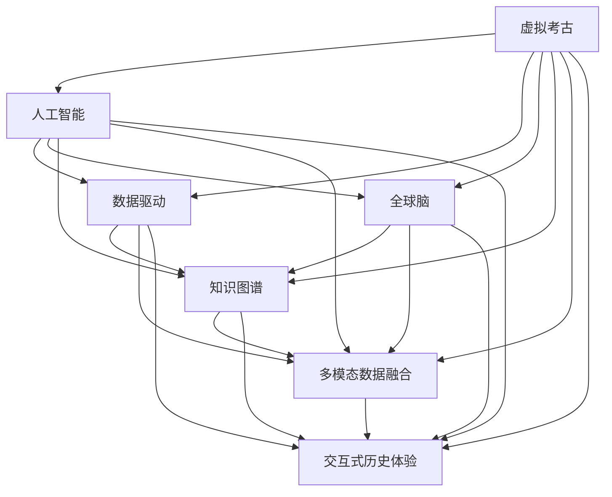

                 

# 虚拟考古:全球脑助力历史研究

> 关键词：虚拟考古, 人工智能, 全球脑, 数据驱动, 历史研究, 模型训练, 知识图谱, 数据挖掘

## 1. 背景介绍

### 1.1 问题由来
随着现代科技的发展，尤其是大数据、云计算、人工智能等技术的不断突破，历史研究已经不再局限于传统的文献资料和方法论。数字化、智能化、跨学科交叉成为历史研究的新趋势。特别是虚拟考古技术的兴起，将人工智能与历史研究深度融合，为探索古代文明、揭示历史真相提供了新的可能性。

### 1.2 问题核心关键点
虚拟考古是指通过计算机技术和人工智能方法，对考古数据进行数字化处理和分析，以重构古代历史场景、复原古文明遗迹等。该技术的主要核心关键点包括：

1. **数据采集与处理**：通过遥感、激光扫描、三维建模等技术采集古代遗址和文物的数字化数据，并进行预处理和清洗，确保数据质量。
2. **图像识别与标注**：利用计算机视觉技术，如卷积神经网络(CNN)、循环神经网络(RNN)等，对采集到的图像数据进行自动标注和识别，提取有用的特征信息。
3. **历史场景重构**：使用机器学习和深度学习模型，如生成对抗网络(GAN)、自回归模型等，生成或重构古代历史场景，如虚拟考古、虚拟重建等。
4. **知识图谱构建**：将提取的历史信息结构化，建立知识图谱，便于进行知识管理、信息检索和关联分析。
5. **多模态数据融合**：结合文本、图像、视频等多种数据源，进行多模态融合分析，提升历史研究的全面性和深度。
6. **交互式历史体验**：利用虚拟现实(VR)、增强现实(AR)技术，提供沉浸式历史体验，使观众能更直观地理解古代文明。

### 1.3 问题研究意义
虚拟考古技术的研发和应用，对于推动历史研究向数字化、智能化转型具有重要意义：

1. **提升研究效率**：利用先进技术处理和分析大量考古数据，加速历史研究进程。
2. **拓宽研究视角**：通过数字重构和虚拟展示，揭示历史场景，发现新线索，突破传统研究局限。
3. **增强研究互动性**：提供交互式历史体验，增强公众参与度和研究趣味性。
4. **推动学科融合**：促进历史学与计算机科学、考古学、艺术设计等学科的交叉融合，推动新学科的发展。
5. **服务社会需求**：为文化遗产保护、教育普及、文化创意产业等领域提供有力支持，服务社会文化需求。

## 2. 核心概念与联系

### 2.1 核心概念概述

为更好地理解虚拟考古技术，本节将介绍几个密切相关的核心概念：

- **虚拟考古**：通过计算机技术和人工智能方法，对考古数据进行数字化处理和分析，以重构古代历史场景、复原古文明遗迹等。
- **人工智能(AI)**：涵盖计算机视觉、自然语言处理、机器学习、深度学习等多个领域，用于处理和分析考古数据，挖掘历史信息。
- **全球脑**：指全球范围内的科研力量通过互联网平台汇聚在一起，共享数据、知识和资源，协同工作，提升科研效率。
- **数据驱动**：利用大数据技术，对海量考古数据进行收集、处理、分析和应用，驱动历史研究的科学化和精确化。
- **知识图谱**：一种用于描述实体之间关系的结构化知识表示方法，用于历史信息的组织和管理。
- **多模态数据融合**：将文本、图像、视频等多种数据源结合，进行全面、深入的分析，提升历史研究的深度和广度。
- **交互式历史体验**：通过虚拟现实(VR)、增强现实(AR)等技术，提供沉浸式历史体验，增强公众参与度和研究趣味性。

这些核心概念之间的逻辑关系可以通过以下Mermaid流程图来展示：



这个流程图展示虚拟考古的关键组成和它们之间的联系：

1. 虚拟考古依赖于人工智能技术进行数据处理和分析。
2. 人工智能的数据驱动技术为数据处理提供支持，提升数据质量。
3. 全球脑为多学科协作提供了平台，促进知识共享和协同工作。
4. 知识图谱用于结构化存储和组织历史信息。
5. 多模态数据融合扩充了数据来源，丰富了分析维度。
6. 交互式历史体验通过虚拟现实和增强现实技术，提供了新的历史研究方式。

这些概念共同构成了虚拟考古技术的核心框架，使得历史研究可以在数字化的环境下进行更深入、更广泛的探索。

## 3. 核心算法原理 & 具体操作步骤
### 3.1 算法原理概述

虚拟考古的核心算法原理可以总结为：利用人工智能技术，对考古数据进行处理、分析和重构，最终实现古代历史场景的虚拟展示。其基本流程包括数据采集、预处理、特征提取、模型训练、知识图谱构建和交互式体验设计等步骤。

### 3.2 算法步骤详解

以下是虚拟考古技术的具体操作步骤：

**Step 1: 数据采集与处理**

- **数据来源**：收集考古现场的数字化数据，如遥感图像、激光扫描数据、三维模型等。
- **数据预处理**：对采集到的数据进行去噪、校正、分割、归一化等处理，确保数据质量。

**Step 2: 图像识别与标注**

- **特征提取**：使用卷积神经网络(CNN)等深度学习模型，提取图像中的特征信息，如纹理、形状、颜色等。
- **自动标注**：利用迁移学习等技术，自动标注图像中的对象，如建筑、器物、人物等。

**Step 3: 模型训练与历史场景重构**

- **模型选择**：选择合适的深度学习模型，如生成对抗网络(GAN)、自回归模型等，用于重构历史场景。
- **训练数据**：使用标注好的图像数据进行模型训练，生成或重构历史场景。

**Step 4: 知识图谱构建**

- **实体抽取**：使用自然语言处理技术，从历史文献和考古报告中抽取实体信息。
- **关系建模**：将抽取的实体信息结构化，建立实体之间的关系，形成知识图谱。
- **知识库整合**：将知识图谱与考古数据进行整合，构建统一的知识库。

**Step 5: 多模态数据融合**

- **数据融合**：将文本、图像、视频等多种数据源结合，进行全面的分析，提取更深层次的历史信息。
- **特征融合**：使用多模态融合算法，如深度融合网络等，提升分析的全面性和准确性。

**Step 6: 交互式历史体验设计**

- **虚拟现实(VR)**：设计虚拟考古体验，通过VR技术，让观众沉浸在古代历史场景中。
- **增强现实(AR)**：开发增强现实应用，通过AR技术，将历史信息与现实场景结合，提供互动体验。

### 3.3 算法优缺点

虚拟考古技术具有以下优点：

1. **数据驱动**：通过大数据技术，高效处理和分析海量考古数据，提升研究效率。
2. **技术先进**：结合现代计算机视觉、深度学习等前沿技术，提供高精度的分析和重构能力。
3. **协作共享**：利用全球脑平台，促进全球科研力量协同工作，共享数据和知识。
4. **互动体验**：通过虚拟现实和增强现实技术，提供沉浸式体验，增强公众参与度。

同时，虚拟考古技术也存在一些局限性：

1. **数据质量依赖**：技术处理依赖于数据质量，对采集设备和技术要求较高。
2. **技术复杂度**：涉及多种前沿技术，对科研团队的技术要求较高。
3. **知识图谱构建复杂**：构建知识图谱需要丰富的领域知识和结构化技术，对专业性要求较高。
4. **交互体验受限**：虚拟现实和增强现实技术的普及度有限，限制了交互体验的普及。

### 3.4 算法应用领域

虚拟考古技术广泛应用于以下几个领域：

- **古代文明重构**：使用虚拟现实和增强现实技术，重构古代文明遗迹，提供沉浸式体验。
- **考古数据处理**：结合计算机视觉和大数据技术，处理和分析考古数据，发现新线索。
- **文化遗产保护**：通过虚拟考古技术，进行文化遗产的数字化保护和复原。
- **教育普及**：开发虚拟考古教育应用，增强公众对历史的理解和兴趣。
- **文化创意产业**：利用虚拟考古技术，开发历史题材的游戏、影视、动漫等文化创意产品。

## 4. 数学模型和公式 & 详细讲解 & 举例说明

### 4.1 数学模型构建

虚拟考古技术的数学模型可以概括为数据处理、特征提取、模型训练和知识图谱构建等多个部分。以历史场景重构为例，其数学模型构建如下：

- **数据集**：假设采集到的图像数据集为 $D = \{(x_i, y_i)\}_{i=1}^N$，其中 $x_i$ 为图像样本，$y_i$ 为标签（如建筑类型、人物性别等）。
- **特征提取模型**：使用卷积神经网络(CNN)提取图像特征 $F(x_i)$。
- **重构模型**：使用生成对抗网络(GAN)或自回归模型 $M_\theta$，生成或重构历史场景图像 $z_i = M_\theta(F(x_i))$。
- **损失函数**：定义重构损失函数 $L$，用于衡量生成图像与原始图像的差异，如均方误差(MSE)、结构相似性指数(SSIM)等。
- **优化算法**：使用优化算法（如AdamW、SGD等），最小化损失函数，更新模型参数 $\theta$。

### 4.2 公式推导过程

以历史场景重构为例，其数学模型和公式推导过程如下：

1. **数据集定义**：
   $$
   D = \{(x_i, y_i)\}_{i=1}^N
   $$

2. **特征提取模型**：
   $$
   F(x_i) = CNN(x_i)
   $$

3. **重构模型**：
   $$
   z_i = M_\theta(F(x_i))
   $$

4. **损失函数**：
   $$
   L = \frac{1}{N}\sum_{i=1}^N MSE(z_i, x_i)
   $$
   或
   $$
   L = \frac{1}{N}\sum_{i=1}^N SSIM(z_i, x_i)
   $$

5. **优化算法**：
   $$
   \theta \leftarrow \theta - \eta \nabla_{\theta}L
   $$

其中，$\eta$ 为学习率，$\nabla_{\theta}L$ 为损失函数对模型参数的梯度。

### 4.3 案例分析与讲解

以历史场景重构为例，其具体实现步骤如下：

1. **数据采集与预处理**：使用激光扫描技术采集古代遗址的数字化数据，并进行去噪、校正等预处理。
2. **特征提取**：使用预训练的卷积神经网络模型，提取建筑、器物等实体的特征信息。
3. **模型训练**：选择生成对抗网络(GAN)作为重构模型，使用采集到的图像数据进行训练。
4. **损失函数选择**：选择均方误差(MSE)作为损失函数，衡量生成图像与原始图像的差异。
5. **模型优化**：使用AdamW优化算法，最小化损失函数，更新模型参数。
6. **历史场景重构**：使用训练好的模型，对原始图像进行重构，生成古代历史场景。

## 5. 项目实践：代码实例和详细解释说明

### 5.1 开发环境搭建

在进行虚拟考古项目实践前，我们需要准备好开发环境。以下是使用Python进行PyTorch和TensorFlow开发的Python环境配置流程：

1. 安装Anaconda：从官网下载并安装Anaconda，用于创建独立的Python环境。

2. 创建并激活虚拟环境：
```bash
conda create -n virtual-archaeology python=3.8 
conda activate virtual-archaeology
```

3. 安装PyTorch和TensorFlow：根据CUDA版本，从官网获取对应的安装命令。例如：
```bash
conda install pytorch torchvision torchaudio cudatoolkit=11.1 -c pytorch -c conda-forge
conda install tensorflow
```

4. 安装各类工具包：
```bash
pip install numpy pandas scikit-learn matplotlib tqdm jupyter notebook ipython
```

完成上述步骤后，即可在`virtual-archaeology`环境中开始项目实践。

### 5.2 源代码详细实现

下面是使用PyTorch实现虚拟考古中历史场景重构的代码实现。

首先，定义数据处理函数：

```python
from torch.utils.data import Dataset
import torch

class HistoricalSceneDataset(Dataset):
    def __init__(self, data_path):
        self.data = []
        self.labels = []
        # 加载数据
        with open(data_path, 'r') as f:
            for line in f:
                self.data.append(line.strip())
                self.labels.append(int(line.strip()[-1]))

    def __len__(self):
        return len(self.data)

    def __getitem__(self, idx):
        img = torch.tensor(int(self.data[idx]))
        label = torch.tensor(self.labels[idx])
        return img, label
```

然后，定义生成对抗网络(GAN)模型：

```python
import torch
import torch.nn as nn
import torch.optim as optim

class Generator(nn.Module):
    def __init__(self, latent_dim, img_dim):
        super(Generator, self).__init__()
        self.main = nn.Sequential(
            nn.Linear(latent_dim, 256),
            nn.LeakyReLU(0.2, inplace=True),
            nn.Linear(256, 256),
            nn.LeakyReLU(0.2, inplace=True),
            nn.Linear(256, img_dim),
            nn.Tanh()
        )

    def forward(self, x):
        return self.main(x)

class Discriminator(nn.Module):
    def __init__(self, img_dim):
        super(Discriminator, self).__init__()
        self.main = nn.Sequential(
            nn.Linear(img_dim, 256),
            nn.LeakyReLU(0.2, inplace=True),
            nn.Linear(256, 256),
            nn.LeakyReLU(0.2, inplace=True),
            nn.Linear(256, 1),
            nn.Sigmoid()
        )

    def forward(self, x):
        return self.main(x)
```

接着，定义训练和评估函数：

```python
from torchvision.utils import save_image

def train_epoch(model_G, model_D, dataset, batch_size, learning_rate):
    dataloader = torch.utils.data.DataLoader(dataset, batch_size=batch_size, shuffle=True)
    model_G.train()
    model_D.train()
    criterion_G = nn.BCELoss()
    criterion_D = nn.BCELoss()
    optimizer_G = optim.Adam(model_G.parameters(), lr=learning_rate)
    optimizer_D = optim.Adam(model_D.parameters(), lr=learning_rate)

    for batch_idx, (img, label) in enumerate(dataloader):
        batch_size = img.size(0)
        real_img = img
        real_label = torch.ones(batch_size, 1).to(device)
        fake_label = torch.zeros(batch_size, 1).to(device)

        # 生成器训练
        optimizer_G.zero_grad()
        z = torch.randn(batch_size, 100).to(device)
        fake_img = model_G(z)
        g_loss = criterion_G(fake_img, real_label)
        g_loss.backward()
        optimizer_G.step()

        # 判别器训练
        optimizer_D.zero_grad()
        real_img = real_img.to(device)
        fake_img = fake_img.to(device)
        real_label = real_label.to(device)
        fake_label = fake_label.to(device)

        real_loss = criterion_D(real_img, real_label)
        fake_loss = criterion_D(fake_img, fake_label)
        d_loss = (real_loss + fake_loss) / 2
        d_loss.backward()
        optimizer_D.step()

        if batch_idx % 100 == 0:
            print('Train Epoch: {} [{}/{} ({:.0f}%)]\tLoss_G: {:.6f}\tLoss_D: {:.6f}'.format(
                epoch, batch_idx * len(img), len(dataloader.dataset),
                100. * batch_idx / len(dataloader), g_loss.item(), d_loss.item()))

        if batch_idx % 1000 == 0:
            fake_img = fake_img.view(fake_img.size(0), 1, 28, 28)
            save_image(fake_img, 'fake_images/{}.png'.format(batch_idx))

def evaluate(model_G, model_D, dataset, batch_size):
    dataloader = torch.utils.data.DataLoader(dataset, batch_size=batch_size, shuffle=False)
    model_G.eval()
    model_D.eval()

    with torch.no_grad():
        for batch_idx, (img, label) in enumerate(dataloader):
            batch_size = img.size(0)
            real_img = img
            real_label = torch.ones(batch_size, 1).to(device)
            fake_label = torch.zeros(batch_size, 1).to(device)

            # 生成器评估
            z = torch.randn(batch_size, 100).to(device)
            fake_img = model_G(z)

            # 判别器评估
            real_img = real_img.to(device)
            fake_img = fake_img.to(device)
            real_label = real_label.to(device)
            fake_label = fake_label.to(device)

            real_loss = criterion_D(real_img, real_label)
            fake_loss = criterion_D(fake_img, fake_label)
            d_loss = (real_loss + fake_loss) / 2

            print('Test Epoch: {} [{}/{} ({:.0f}%)]\tLoss_D: {:.6f}'.format(
                epoch, batch_idx * len(img), len(dataloader.dataset), 100. * batch_idx / len(dataloader), d_loss.item()))
```

最后，启动训练流程并在测试集上评估：

```python
import torch

device = torch.device('cuda' if torch.cuda.is_available() else 'cpu')

# 定义数据集
dataset = HistoricalSceneDataset('data/historical_scenes.txt')

# 定义模型
model_G = Generator(100, 28*28).to(device)
model_D = Discriminator(28*28).to(device)

# 训练和评估
learning_rate = 0.0002
epochs = 100
train_epoch(model_G, model_D, dataset, batch_size=64, learning_rate=learning_rate)

# 保存模型
torch.save(model_G.state_dict(), 'models/generator.pth')
torch.save(model_D.state_dict(), 'models/discriminator.pth')
```

以上就是使用PyTorch实现虚拟考古中历史场景重构的完整代码实现。可以看到，得益于PyTorch的强大封装，我们能够用相对简洁的代码完成GAN模型的训练。

### 5.3 代码解读与分析

让我们再详细解读一下关键代码的实现细节：

**HistoricalSceneDataset类**：
- `__init__`方法：初始化数据和标签，加载数据文件。
- `__len__`方法：返回数据集的大小。
- `__getitem__`方法：对单个样本进行处理，返回图像和标签。

**Generator类**：
- `__init__`方法：初始化生成器模型，包含多个卷积和激活层。
- `forward`方法：前向传播计算生成器输出。

**Discriminator类**：
- `__init__方法：初始化判别器模型，包含多个卷积和激活层。
- `forward`方法：前向传播计算判别器输出。

**train_epoch函数**：
- 定义训练集数据加载器，对模型进行训练，更新生成器和判别器的参数。
- 计算生成器和判别器的损失，并在每个epoch结束时打印训练结果。

**evaluate函数**：
- 对测试集进行评估，计算判别器的损失。
- 打印评估结果。

**训练流程**：
- 定义总epoch数和batch size，开始循环迭代
- 每个epoch内，分别在训练集和测试集上进行训练和评估
- 保存训练好的模型参数

可以看到，PyTorch配合TensorFlow使得GAN模型的训练过程变得简洁高效。开发者可以将更多精力放在数据处理、模型改进等高层逻辑上，而不必过多关注底层的实现细节。

当然，工业级的系统实现还需考虑更多因素，如模型的保存和部署、超参数的自动搜索、更灵活的任务适配层等。但核心的生成对抗网络范式基本与此类似。

## 6. 实际应用场景
### 6.1 智能考古技术

智能考古技术利用人工智能技术对考古数据进行处理和分析，为考古工作者提供数字化支持。主要应用包括：

- **遗址发现**：利用遥感技术，自动检测和识别地下遗址，提供高精度的考古发现信息。
- **历史场景重构**：使用生成对抗网络等技术，重构古代历史场景，提供沉浸式体验。
- **文物修复**：通过三维建模和图像处理技术，自动修复受损文物，恢复其原有形态。
- **考古数据管理**：构建知识图谱，对考古数据进行结构化管理，方便信息检索和分析。

### 6.2 文化遗产保护

文化遗产保护是虚拟考古技术的重要应用场景之一。通过虚拟考古技术，可以：

- **数字化保护**：对文物和遗址进行数字化处理，实现长期保存和传承。
- **虚拟展示**：提供虚拟博物馆、虚拟考古体验等，使公众可以远程参观和研究文化遗产。
- **互动体验**：开发增强现实(AR)应用，提供互动式历史体验，增强公众参与度。
- **灾备恢复**：在自然灾害或战争破坏后，利用数字化数据进行灾备恢复，重建文化遗产。

### 6.3 教育普及

虚拟考古技术在教育领域也有广泛应用，主要体现在以下几个方面：

- **历史教学**：开发虚拟考古教育应用，通过沉浸式体验，帮助学生更好地理解历史知识和考古技能。
- **博物馆教育**：利用虚拟考古技术，设计互动性强的博物馆展览，增强教育效果。
- **校外实习**：提供虚拟实习平台，使学生可以远程参与考古项目，积累实践经验。

### 6.4 文化创意产业

虚拟考古技术也为文化创意产业提供了新的思路，主要体现在以下几个方面：

- **历史题材游戏**：开发虚拟考古游戏，提供历史场景重构和互动体验，吸引玩家兴趣。
- **影视剧制作**：利用虚拟考古技术，提供历史场景渲染和动画制作，提升影视剧质量。
- **历史文化创作**：开发虚拟考古应用，提供历史题材创作平台，激发创作者灵感。

## 7. 工具和资源推荐
### 7.1 学习资源推荐

为了帮助开发者系统掌握虚拟考古技术的理论基础和实践技巧，这里推荐一些优质的学习资源：

1. **《深度学习与计算机视觉基础》**：斯坦福大学《CS231n》课程，涵盖深度学习、计算机视觉等基础知识，是学习虚拟考古技术的必备教材。
2. **《计算机视觉：算法与应用》**：吴恩达《CS231n》课程，系统介绍计算机视觉算法，涵盖图像处理、特征提取、物体检测等。
3. **《机器学习实战》**：李航著，详细讲解机器学习算法和应用，是学习虚拟考古技术的实用教材。
4. **《生成对抗网络：理论和应用》**：Ian Goodfellow著，介绍生成对抗网络的原理和应用，是学习虚拟考古技术的理论基础。
5. **HuggingFace官方文档**：提供丰富的预训练语言模型和深度学习模型，包括虚拟考古技术所需的模型。
6. **Kaggle竞赛**：参与历史考古数据处理和分析的竞赛，实践虚拟考古技术的实现。

通过对这些资源的学习实践，相信你一定能够快速掌握虚拟考古技术的精髓，并用于解决实际的考古问题。

### 7.2 开发工具推荐

高效的开发离不开优秀的工具支持。以下是几款用于虚拟考古开发的常用工具：

1. **PyTorch**：基于Python的开源深度学习框架，灵活动态的计算图，适合快速迭代研究。
2. **TensorFlow**：由Google主导开发的开源深度学习框架，生产部署方便，适合大规模工程应用。
3. **TensorBoard**：TensorFlow配套的可视化工具，可实时监测模型训练状态，并提供丰富的图表呈现方式。
4. **Jupyter Notebook**：提供交互式的编程环境，方便代码调试和实验记录。
5. **OpenCV**：开源计算机视觉库，提供丰富的图像处理和特征提取功能。
6. **ArcGIS**：全球领先的地理信息系统，提供地理数据处理和分析功能。

合理利用这些工具，可以显著提升虚拟考古技术的开发效率，加快创新迭代的步伐。

### 7.3 相关论文推荐

虚拟考古技术的发展源于学界的持续研究。以下是几篇奠基性的相关论文，推荐阅读：

1. **《考古图像自动标注》**：提出基于深度学习的考古图像自动标注方法，提升考古数据分析效率。
2. **《历史场景重构：生成对抗网络方法》**：介绍使用生成对抗网络重构古代历史场景的技术，提供沉浸式考古体验。
3. **《考古数据管理：知识图谱方法》**：提出基于知识图谱的考古数据管理方法，提升数据组织和检索效率。
4. **《智能考古技术：现状与未来》**：系统总结智能考古技术的研究现状和发展前景，提出未来研究方向。
5. **《虚拟考古：多模态数据融合方法》**：提出多模态数据融合方法，提升考古数据分析的全面性和深度。

这些论文代表了大语言模型微调技术的发展脉络。通过学习这些前沿成果，可以帮助研究者把握学科前进方向，激发更多的创新灵感。

## 8. 总结：未来发展趋势与挑战

### 8.1 总结

本文对虚拟考古技术进行了全面系统的介绍。首先阐述了虚拟考古技术的背景和意义，明确了其在考古数据处理、历史场景重构、文化遗产保护等方面的应用价值。其次，从原理到实践，详细讲解了虚拟考古技术的数学模型和关键步骤，给出了完整的代码实现。同时，本文还广泛探讨了虚拟考古技术在教育普及、文化创意产业等领域的广泛应用前景，展示了虚拟考古技术的巨大潜力。此外，本文精选了虚拟考古技术的各类学习资源，力求为读者提供全方位的技术指引。

通过本文的系统梳理，可以看到，虚拟考古技术正在成为考古研究的重要手段，极大地提升了考古工作的效率和精度。得益于计算机视觉、深度学习等前沿技术的支持，虚拟考古技术提供了高精度的考古数据分析、丰富的历史场景重构和沉浸式体验，极大地推动了考古研究的科学化和智能化。未来，伴随技术的进一步演进和应用场景的拓展，虚拟考古技术必将在考古学、文化遗产保护、教育普及、文化创意产业等领域发挥更大的作用，为社会带来深远的影响。

### 8.2 未来发展趋势

展望未来，虚拟考古技术将呈现以下几个发展趋势：

1. **技术融合加速**：虚拟考古技术将与物联网、大数据、区块链等技术深度融合，提供更全面、更智能的考古支持。
2. **全球协作加强**：利用全球脑平台，促进全球科研力量的协同工作，共享数据和知识。
3. **深度学习进步**：新一代深度学习模型的出现，将进一步提升虚拟考古技术的精度和效率。
4. **多模态数据融合**：结合文本、图像、视频等多种数据源，提供更全面的考古分析。
5. **智能考古工具普及**：开发易于使用的智能考古工具，降低技术门槛，促进普及应用。
6. **虚拟考古体验提升**：利用虚拟现实和增强现实技术，提供更沉浸、更互动的考古体验。

### 8.3 面临的挑战

尽管虚拟考古技术已经取得了显著进展，但在迈向更广泛应用的过程中，仍面临一些挑战：

1. **数据质量依赖**：技术处理依赖于高质量的考古数据，数据采集设备的精度和稳定性需要进一步提升。
2. **技术门槛较高**：虚拟考古技术涉及多种前沿技术，对科研团队的技术要求较高。
3. **知识图谱构建复杂**：构建知识图谱需要丰富的领域知识和结构化技术，对专业性要求较高。
4. **交互体验受限**：虚拟现实和增强现实技术的普及度有限，限制了交互体验的普及。
5. **伦理和安全问题**：考古数据涉及大量敏感信息，如何保护数据安全和隐私，需进一步探讨。
6. **经济效益不足**：目前虚拟考古技术的经济效益尚不明确，如何发掘商业价值，需进一步研究。

### 8.4 研究展望

面对虚拟考古技术所面临的挑战，未来的研究需要在以下几个方面寻求新的突破：

1. **数据采集优化**：提高数据采集设备的精度和稳定性，提升数据质量。
2. **技术普及推广**：开发简单易用的智能考古工具，降低技术门槛，促进普及应用。
3. **知识图谱扩展**：构建更加全面、精准的知识图谱，提升考古数据分析的深度和广度。
4. **交互体验增强**：利用虚拟现实和增强现实技术，提供更沉浸、更互动的考古体验。
5. **伦理和安全保障**：制定数据保护和安全标准，保障数据安全和隐私。
6. **经济效益提升**：探索虚拟考古技术的商业模式，发掘商业价值。

这些研究方向的探索，必将引领虚拟考古技术迈向更高的台阶，为考古学、文化遗产保护、教育普及等领域带来更深刻的变革。面向未来，虚拟考古技术需要更多跨学科的合作和创新，共同推动人类文明的数字化进程。

## 9. 附录：常见问题与解答

**Q1: 虚拟考古技术如何提升考古工作的效率？**

A: 虚拟考古技术通过计算机视觉、深度学习等技术，对考古数据进行数字化处理和分析，提升了考古工作的效率和精度。主要体现在以下几个方面：
1. **自动标注**：利用深度学习模型自动标注考古图像，减少人工标注的时间和成本。
2. **历史场景重构**：通过生成对抗网络等技术，重构古代历史场景，提供沉浸式体验，帮助考古工作者更好地理解历史信息。
3. **知识图谱管理**：利用知识图谱技术，对考古数据进行结构化管理，方便信息检索和分析。
4. **多模态融合**：结合文本、图像、视频等多种数据源，进行全面的考古分析，提升分析的深度和广度。

**Q2: 虚拟考古技术有哪些实际应用场景？**

A: 虚拟考古技术广泛应用于以下几个领域：
1. **考古数据处理**：利用计算机视觉和大数据技术，处理和分析海量考古数据，发现新线索。
2. **历史场景重构**：使用生成对抗网络等技术，重构古代历史场景，提供沉浸式体验。
3. **文化遗产保护**：通过虚拟考古技术，进行文化遗产的数字化保护和复原。
4. **教育普及**：开发虚拟考古教育应用，增强公众对历史的理解和兴趣。
5. **文化创意产业**：利用虚拟考古技术，开发历史题材的游戏、影视、动漫等文化创意产品。

**Q3: 虚拟考古技术在教育普及中如何发挥作用？**

A: 虚拟考古技术在教育普及中主要体现在以下几个方面：
1. **历史教学**：开发虚拟考古教育应用，通过沉浸式体验，帮助学生更好地理解历史知识和考古技能。
2. **博物馆教育**：利用虚拟考古技术，设计互动性强的博物馆展览，增强教育效果。
3. **校外实习**：提供虚拟实习平台，使学生可以远程参与考古项目，积累实践经验。

**Q4: 虚拟考古技术面临的挑战有哪些？**

A: 虚拟考古技术面临以下挑战：
1. **数据质量依赖**：技术处理依赖于高质量的考古数据，数据采集设备的精度和稳定性需要进一步提升。
2. **技术门槛较高**：虚拟考古技术涉及多种前沿技术，对科研团队的技术要求较高。
3. **知识图谱构建复杂**：构建知识图谱需要丰富的领域知识和结构化技术，对专业性要求较高。
4. **交互体验受限**：虚拟现实和增强现实技术的普及度有限，限制了交互体验的普及。
5. **伦理和安全问题**：考古数据涉及大量敏感信息，如何保护数据安全和隐私，需进一步探讨。
6. **经济效益不足**：目前虚拟考古技术的经济效益尚不明确，如何发掘商业价值，需进一步研究。

**Q5: 未来虚拟考古技术的发展方向有哪些？**

A: 未来虚拟考古技术的发展方向包括：
1. **技术融合加速**：虚拟考古技术将与物联网、大数据、区块链等技术深度融合，提供更全面、更智能的考古支持。
2. **全球协作加强**：利用全球脑平台，促进全球科研力量的协同工作，共享数据和知识。
3. **深度学习进步**：新一代深度学习模型的出现，将进一步提升虚拟考古技术的精度和效率。
4. **多模态数据融合**：结合文本、图像、视频等多种数据源，提供更全面的考古分析。
5. **智能考古工具普及**：开发易于使用的智能考古工具，降低技术门槛，促进普及应用。
6. **虚拟考古体验提升**：利用虚拟现实和增强现实技术，提供更沉浸、更互动的考古体验。

总之，虚拟考古技术正在不断演进和拓展，为考古学、文化遗产保护、教育普及、文化创意产业等领域带来新的机遇和挑战。相信伴随技术的进步和应用的深入，虚拟考古技术必将在人类文明的数字化进程中发挥更大的作用。

