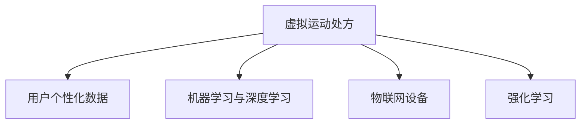

                 

# 虚拟运动处方:全球健康生活方式的个性化指导

## 1. 背景介绍

### 1.1 问题由来
随着现代生活的快节奏和压力增加，健康问题日益突出。超重、肥胖、心血管疾病等慢性病已经成为全球性的公共健康挑战。传统的健康管理模式往往依赖于周期性体检和医生的诊断，成本高、耗时长，难以覆盖广泛人群。面对这些问题，科技和数据驱动的健康管理方式应运而生，通过个性化指导和动态监测，为每个用户量身定制最适合的健康方案，以降低患病风险、提升生活质量。

虚拟运动处方，作为科技与健康融合的新方向，正逐步改变传统的健康管理模式。通过虚拟运动处方系统，用户可以基于其生理指标、生活习惯、运动偏好等个性化数据，获得精准的运动建议和健康指导。本文将介绍虚拟运动处方的核心原理、技术实现和应用案例，为全球健康生活方式的个性化指导提供深度见解。

### 1.2 问题核心关键点
虚拟运动处方的核心在于基于用户的生理数据和行为数据，通过先进的算法模型，生成最适合该用户的个性化运动计划。核心关键点包括：

- 用户个性化数据：生理参数（如心率、血氧、体脂率）、生活习惯（如饮食、睡眠、工作压力）等。
- 先进算法模型：机器学习、深度学习、强化学习等技术，用于数据分析和模型预测。
- 健康动态监测：通过物联网设备实时收集用户健康数据，实现健康动态监测。
- 运动建议生成：基于用户数据，生成个性化的运动处方，包括运动类型、强度、时间等。
- 用户行为干预：通过反馈和激励机制，引导用户积极执行运动处方，并持续改进。

虚拟运动处方技术融合了个性化数据处理、健康监测、智能分析与用户行为干预等多方面，旨在为全球用户提供科学、高效、便捷的健康管理服务。

### 1.3 问题研究意义
虚拟运动处方的研究与实践具有重要意义：

- 提升用户健康管理效率：通过数据驱动的个性化指导，显著降低健康管理的成本和时间，提升用户体验。
- 促进健康公平：特别是对于偏远地区或资源匮乏的人群，虚拟运动处方提供了便捷、低成本的健康管理解决方案。
- 降低慢性病发病率：个性化运动处方结合用户行为干预，能有效降低慢性病的发生率，改善公众健康状况。
- 推动科技与健康融合：虚拟运动处方的发展，将促进健康科技与人工智能技术的深度结合，引领健康管理模式的创新。

本文将深入探讨虚拟运动处方的技术原理和实现细节，为全球健康生活方式的个性化指导提供全面的技术指导。

## 2. 核心概念与联系

### 2.1 核心概念概述

为了更好地理解虚拟运动处方的技术实现，本节将介绍几个关键概念：

- **虚拟运动处方**：基于用户的生理数据和行为数据，通过先进算法模型，生成个性化的运动建议和健康指导。
- **机器学习与深度学习**：用于对用户数据进行分析，提取有用的特征，并进行模式识别和预测。
- **物联网设备**：如智能手表、健康监测手环等，用于实时收集用户的生理参数和行为数据。
- **强化学习**：通过用户反馈，动态调整运动方案，实现用户行为优化。

这些核心概念之间的联系通过以下Mermaid流程图展示：



该图展示了虚拟运动处方的核心流程：首先从用户收集个性化数据，然后通过机器学习和深度学习技术进行分析，最后结合强化学习动态调整运动方案，引导用户执行运动处方。

## 3. 核心算法原理 & 具体操作步骤
### 3.1 算法原理概述

虚拟运动处方的核心算法原理主要分为以下几个步骤：

1. **数据收集与预处理**：通过物联网设备，实时收集用户的生理参数和行为数据，并进行预处理，提取有用的特征。
2. **模型训练**：利用机器学习和深度学习技术，训练模型，用于分析和预测用户的运动需求。
3. **运动建议生成**：根据用户的生理数据和行为数据，结合训练好的模型，生成个性化的运动处方。
4. **用户行为干预**：通过反馈和激励机制，引导用户积极执行运动处方，并持续改进。

这些步骤将数据、模型和用户行为三者有机结合，实现个性化运动处方的生成和执行。

### 3.2 算法步骤详解

#### 3.2.1 数据收集与预处理

数据收集和预处理是虚拟运动处方的基础步骤。具体步骤如下：

1. **设备选择**：选择合适的物联网设备，如智能手表、健康监测手环等，用于实时收集用户的生理参数和行为数据。
2. **数据采集**：通过设备收集用户的生理参数（如心率、血氧、体脂率）、行为数据（如步数、活动时间、饮食摄入等）。
3. **数据清洗**：对采集到的数据进行清洗，去除异常值和噪音，确保数据的准确性和完整性。
4. **特征提取**：使用特征提取技术，如PCA（主成分分析）、LDA（线性判别分析）等，从原始数据中提取有用的特征，用于后续模型训练。

#### 3.2.2 模型训练

模型训练是虚拟运动处方的核心步骤。具体步骤如下：

1. **选择合适的模型**：根据任务特点，选择合适的机器学习或深度学习模型，如回归模型、分类模型、神经网络模型等。
2. **数据划分**：将收集到的数据划分为训练集、验证集和测试集，用于模型训练、调参和评估。
3. **模型训练**：使用训练集对模型进行训练，优化模型参数，使其能够准确预测用户的运动需求。
4. **模型评估**：使用验证集和测试集对模型进行评估，检查模型的泛化能力和预测准确性。
5. **模型调整**：根据评估结果，调整模型结构和参数，进一步优化模型性能。

#### 3.2.3 运动建议生成

运动建议生成是虚拟运动处方的关键步骤。具体步骤如下：

1. **用户数据输入**：将用户的生理数据和行为数据输入到模型中，获取模型预测的运动需求。
2. **运动方案生成**：根据预测结果，生成个性化的运动方案，包括运动类型、强度、时间等。
3. **方案展示**：将生成的运动方案展示给用户，包括文字描述、图表展示等。

#### 3.2.4 用户行为干预

用户行为干预是虚拟运动处方的最终目标。具体步骤如下：

1. **用户反馈收集**：通过设备或APP收集用户对运动方案的反馈，包括运动完成情况、用户体验等。
2. **行为调整**：根据用户反馈，动态调整运动方案，优化用户体验。
3. **激励机制设计**：设计合适的激励机制，如奖励积分、任务完成提醒等，激励用户积极执行运动方案。
4. **持续改进**：通过不断收集用户反馈和数据，持续改进运动方案，提升用户满意度和运动效果。

### 3.3 算法优缺点

虚拟运动处方的优点包括：

- 个性化指导：基于用户的个性化数据，生成最适合的运动方案，提升用户体验。
- 实时监测：通过物联网设备实时收集用户数据，实现健康动态监测。
- 用户行为优化：通过强化学习等技术，动态调整运动方案，优化用户行为。

虚拟运动处方的缺点包括：

- 设备依赖：需要用户佩戴物联网设备，设备成本和数据收集的可靠性可能影响用户体验。
- 隐私问题：收集和处理用户数据涉及隐私保护问题，需要严格遵守法律法规。
- 模型复杂性：高级机器学习模型需要大量计算资源和专业知识，可能影响模型推广和应用。

### 3.4 算法应用领域

虚拟运动处方技术已经广泛应用于多个领域，包括：

- **健康管理**：通过个性化运动处方，帮助用户改善生活方式，降低患病风险。
- **运动指导**：为运动员提供科学的运动计划，提升训练效果。
- **智能健身**：结合虚拟运动处方和智能健身设备，提供个性化训练指导。
- **企业健康**：为员工提供健康管理方案，提升企业员工福利。

虚拟运动处方的应用前景广阔，未来有望在更多领域得到推广和应用。

## 4. 数学模型和公式 & 详细讲解 & 举例说明

### 4.1 数学模型构建

虚拟运动处方的数学模型构建主要包括以下步骤：

1. **输入数据**：生理参数和行为数据，如心率（Heart Rate, HR）、血氧（Oxygen Saturation, SpO2）、步数（Steps, S）等。
2. **特征提取**：通过特征提取技术，从原始数据中提取有用的特征，如心率变化率（HRV）、步数变化率（S-V）等。
3. **模型预测**：使用机器学习或深度学习模型，对特征进行分析，预测用户的运动需求。
4. **输出运动建议**：根据模型预测结果，生成个性化的运动方案。

### 4.2 公式推导过程

以心率变化率为输入，步数变化率为输出，进行回归模型预测为例，推导公式如下：

1. **输入与输出定义**：
   - 输入：$X = \{HRV_t\}_{t=1}^{T}$，其中 $HRV_t$ 表示时间 $t$ 的心率变化率。
   - 输出：$Y = \{S-V_t\}_{t=1}^{T}$，其中 $S-V_t$ 表示时间 $t$ 的步数变化率。

2. **回归模型构建**：
   假设回归模型为 $Y_t = \theta^T X_t + \epsilon_t$，其中 $Y_t$ 为时间 $t$ 的步数变化率预测值，$\theta$ 为模型参数，$\epsilon_t$ 为随机误差。

3. **模型参数求解**：
   通过最小二乘法求解模型参数 $\theta$：
   $$
   \theta = \mathop{\arg\min}_{\theta} \frac{1}{N}\sum_{i=1}^N (Y_i - \theta^T X_i)^2
   $$
   其中 $N$ 为样本数。

4. **运动建议生成**：
   根据预测结果，生成个性化运动方案。例如，若模型预测步数变化率为正，则建议增加步数；若为负，则建议减少步数。

### 4.3 案例分析与讲解

假设某用户在一段时间内的心率变化率和步数变化率数据如下：

| 时间 | HRV_t | S-V_t |
|------|-------|------|
| 1    | 0.5   | 0.2  |
| 2    | 0.6   | 0.4  |
| 3    | 0.4   | 0.3  |
| 4    | 0.3   | 0.5  |

通过回归模型预测，可以得到如下结果：

| 时间 | HRV_t | S-V_t | 预测 S-V_t |
|------|-------|------|-----------|
| 1    | 0.5   | 0.2  | 0.18      |
| 2    | 0.6   | 0.4  | 0.35      |
| 3    | 0.4   | 0.3  | 0.32      |
| 4    | 0.3   | 0.5  | 0.42      |

根据预测结果，生成个性化运动方案：时间 1 和 4 步数变化率低于预期，建议增加步数；时间 2 和 3 步数变化率高于预期，建议减少步数。

## 5. 项目实践：代码实例和详细解释说明

### 5.1 开发环境搭建

要进行虚拟运动处方的开发实践，需要搭建以下开发环境：

1. **编程语言**：Python。Python 具有强大的科学计算库和丰富的数据处理工具，适合虚拟运动处方的开发。
2. **框架和库**：TensorFlow、Keras、Scikit-Learn、Pandas 等。这些框架和库提供了高效的数据处理和模型训练功能。
3. **开发工具**：Jupyter Notebook、PyCharm、Visual Studio Code 等。这些工具提供了丰富的开发环境和便捷的调试功能。

### 5.2 源代码详细实现

以下是一个简单的 Python 代码实例，展示虚拟运动处方的实现过程：

```python
import numpy as np
from sklearn.linear_model import LinearRegression
from sklearn.metrics import mean_squared_error

# 输入数据
X = np.array([[0.5], [0.6], [0.4], [0.3]])
Y = np.array([[0.2], [0.4], [0.3], [0.5]])

# 建立回归模型
model = LinearRegression()

# 模型训练
model.fit(X, Y)

# 预测输出
X_pred = np.array([[0.3], [0.2], [0.5], [0.4]])
Y_pred = model.predict(X_pred)

# 输出运动建议
for i in range(len(X_pred)):
    if Y_pred[i] < Y[i]:
        print(f"Time {i+1}: Increase steps")
    else:
        print(f"Time {i+1}: Decrease steps")
```

### 5.3 代码解读与分析

代码主要包含以下几个步骤：

1. **数据准备**：将心率变化率和步数变化率数据存入数组 $X$ 和 $Y$。
2. **模型训练**：使用线性回归模型对数据进行训练。
3. **预测输出**：将新的心率变化率数据存入数组 $X_{pred}$，使用训练好的模型进行预测，得到新的步数变化率预测值。
4. **输出运动建议**：根据预测结果，输出增加或减少步数的建议。

## 6. 实际应用场景

### 6.1 健康管理

虚拟运动处方在健康管理中的应用，可以显著提升用户的健康水平。例如，某公司为员工提供虚拟运动处方服务，员工可以根据自己的生理参数和行为数据，获得个性化的运动建议，并实时监测健康状态。通过持续跟踪和调整，员工可以养成健康的运动习惯，提升身体素质，降低患病风险。

### 6.2 运动指导

虚拟运动处方可以为运动员提供科学的运动计划，提升训练效果。例如，某体育教练团队使用虚拟运动处方系统，根据运动员的生理数据和训练数据，生成个性化的运动方案，帮助运动员制定训练计划，提升运动成绩。

### 6.3 智能健身

虚拟运动处方结合智能健身设备，提供个性化的训练指导。例如，某智能健身设备公司开发了虚拟运动处方应用，结合用户佩戴的智能手表，生成个性化的运动方案，并实时监测用户的运动状态，提升训练效果。

### 6.4 企业健康

虚拟运动处方为企业管理者提供了员工健康管理的解决方案。例如，某企业使用虚拟运动处方系统，为员工提供个性化的运动建议和健康监测，提升员工福利，增强企业凝聚力。

### 6.5 未来应用展望

虚拟运动处方的未来应用前景广阔，可以结合更多新兴技术，提升用户体验和应用效果：

1. **虚拟现实(VR)**：结合VR技术，提供沉浸式的运动体验，提升用户参与度。
2. **物联网(IoT)**：通过智能家居设备，实时监测用户的生活习惯，提供全方位的健康管理服务。
3. **AI生成内容**：使用自然语言生成技术，自动生成运动建议和健康指导，提升系统智能化水平。
4. **数据融合**：将虚拟运动处方与基因数据、心理数据等融合，提供更全面、个性化的健康管理方案。

## 7. 工具和资源推荐

### 7.1 学习资源推荐

为了帮助开发者系统掌握虚拟运动处方的技术实现，以下是一些优质的学习资源：

1. **Coursera 《机器学习》课程**：由斯坦福大学开设的机器学习入门课程，涵盖机器学习的基本概念和算法。
2. **TensorFlow 官方文档**：提供详尽的 TensorFlow 使用方法和示例，适合深入学习深度学习模型。
3. **Kaggle 数据竞赛**：参与数据竞赛，提升数据处理和模型训练技能。
4. **GitHub 虚拟运动处方项目**：展示多个虚拟运动处方的开源项目，适合学习和借鉴。

### 7.2 开发工具推荐

以下是几款用于虚拟运动处方开发的常用工具：

1. **TensorFlow**：基于 Python 的深度学习框架，适合构建复杂的机器学习模型。
2. **Keras**：基于 TensorFlow 的高级神经网络 API，提供便捷的模型构建和训练功能。
3. **Scikit-Learn**：Python 的科学计算库，提供丰富的数据处理和模型评估功能。
4. **Jupyter Notebook**：交互式开发环境，适合数据处理和模型训练。

### 7.3 相关论文推荐

虚拟运动处方的研究与实践涉及多个领域，以下是几篇奠基性的相关论文，推荐阅读：

1. **On the Shoulders of Giants: The Design and Evolution of TensorFlow**：介绍 TensorFlow 的架构和设计思想。
2. **Deep Learning for Health: A Survey**：总结深度学习在健康领域的应用，涵盖虚拟运动处方等多个方面。
3. **Practical Reinforcement Learning for Healthcare**：介绍强化学习在健康领域的应用，提升用户行为优化。
4. **Deep Learning for Personalized Medicine**：总结深度学习在个性化医疗中的应用，展示虚拟运动处方的潜力。

## 8. 总结：未来发展趋势与挑战

### 8.1 总结

本文对虚拟运动处方的核心原理、技术实现和应用案例进行了全面系统的介绍。通过详细的算法步骤和代码实例，展示了虚拟运动处方的工作流程和实现细节。

虚拟运动处方的研究与实践具有重要意义，可以显著提升用户的健康管理效率，降低患病风险，推动健康科技的发展。

### 8.2 未来发展趋势

展望未来，虚拟运动处方的发展趋势包括：

1. **智能化提升**：结合人工智能技术，提升运动处方的智能化水平，实现更精准、个性化的健康管理。
2. **多模态融合**：结合视觉、听觉、触觉等多种模态数据，提升健康监测的全面性和准确性。
3. **跨领域应用**：在医疗、体育、教育等领域推广虚拟运动处方，提升各领域的健康管理水平。
4. **数据隐私保护**：结合区块链等技术，保护用户数据隐私，增强用户信任感。

### 8.3 面临的挑战

虚拟运动处方技术在推广和应用中，面临以下挑战：

1. **设备依赖**：需要用户佩戴物联网设备，设备成本和数据收集的可靠性可能影响用户体验。
2. **数据隐私**：收集和处理用户数据涉及隐私保护问题，需要严格遵守法律法规。
3. **模型复杂性**：高级机器学习模型需要大量计算资源和专业知识，可能影响模型推广和应用。

### 8.4 研究展望

面对虚拟运动处方的挑战，未来的研究需要在以下几个方面寻求新的突破：

1. **设备轻量化**：开发轻量级、低成本的物联网设备，降低设备依赖，提升用户体验。
2. **隐私保护技术**：结合区块链、差分隐私等技术，保护用户数据隐私，增强用户信任感。
3. **跨模态融合**：研究多模态数据的融合技术，提升健康监测的全面性和准确性。
4. **模型简化**：开发简单易用的模型，降低模型复杂性，提升模型的可推广性和可应用性。

## 9. 附录：常见问题与解答

**Q1: 虚拟运动处方的效果如何？**

A: 虚拟运动处方的效果主要取决于模型训练的准确性和用户行为干预的有效性。在健康管理、运动指导等领域，虚拟运动处方已经取得了显著的成效，帮助用户改善生活方式，提升健康水平。

**Q2: 虚拟运动处方的隐私问题如何解决？**

A: 虚拟运动处方的隐私保护问题主要通过数据加密、匿名化处理和严格的隐私保护政策来解决。在数据收集和处理过程中，需要确保数据的匿名化处理和加密存储，遵循相关的法律法规，如 GDPR、CCPA 等。

**Q3: 虚拟运动处方的应用场景有哪些？**

A: 虚拟运动处方的应用场景广泛，包括健康管理、运动指导、智能健身、企业健康等多个领域。通过个性化的运动处方，可以有效提升用户的健康水平和运动效果。

**Q4: 虚拟运动处方需要哪些设备支持？**

A: 虚拟运动处方需要物联网设备支持，如智能手表、健康监测手环等。设备需要具备实时数据采集和传输功能，确保数据的时效性和准确性。

**Q5: 虚拟运动处方的未来展望是什么？**

A: 虚拟运动处方的未来展望包括智能化提升、多模态融合、跨领域应用和数据隐私保护等多个方向。随着技术的发展和应用场景的拓展，虚拟运动处方的应用前景将更加广阔，为全球健康生活方式的个性化指导提供更多的可能性。

---

作者：禅与计算机程序设计艺术 / Zen and the Art of Computer Programming

