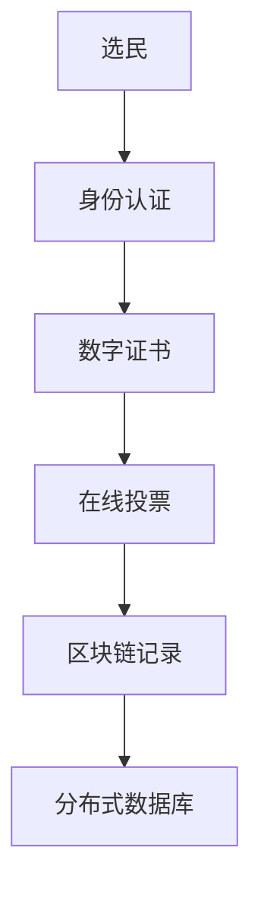

                 

# 虚拟选举：全球民主参与的数字化实践

在当今信息时代，数字化技术的迅猛发展正在重塑全球民主参与的实践方式。虚拟选举，即通过数字平台和互联网技术进行的投票过程，为全球民主参与带来了新的可能性。本博客将深入探讨虚拟选举的核心概念、核心算法原理与具体操作步骤，并结合实际应用场景，展现虚拟选举技术的魅力和挑战。

## 1. 背景介绍

### 1.1 问题由来
传统选举过程存在诸多挑战，包括投票时间安排、投票地点选取、选票统计及结果发布等环节。这些环节耗时耗力，且受地理、经济和社会因素的限制，使得投票率难以保证，尤其是对于弱势群体，如低收入者、老年人及行动不便者等。

随着数字技术的不断进步，互联网、移动设备和社交媒体的普及，为虚拟选举提供了技术基础。虚拟选举通过数字平台实现选民在线投票，极大提升了投票的便利性和效率，增强了民主参与的广泛性和多样性。

### 1.2 问题核心关键点
虚拟选举的核心在于通过数字平台进行无障碍、高效率的投票。具体而言，关键点包括：
1. **平台安全性**：确保在线投票的匿名性和保密性。
2. **用户身份认证**：确保选民身份的真实性。
3. **投票隐私保护**：防止投票数据泄露。
4. **投票系统可靠性**：确保投票过程的公平、公正。

## 2. 核心概念与联系

### 2.1 核心概念概述
- **虚拟选举**：通过数字平台进行投票的过程，涵盖在线投票、移动应用、社交媒体等多种形式。
- **身份认证**：通过密码、生物识别、邮件验证等方式确认选民身份。
- **投票隐私保护**：采用匿名化、加密传输等技术保护选民隐私。
- **区块链技术**：利用分布式账本和加密算法保障投票过程的安全性和不可篡改性。
- **分布式数据库**：通过分布式数据库技术提高投票系统的可扩展性和可靠性。

### 2.2 核心概念原理和架构的 Mermaid 流程图



该流程图展示了虚拟选举的基本流程：选民通过身份认证获取数字证书，进而进行在线投票；投票结果通过区块链进行记录，分布式数据库保障数据的安全性和可靠性。

## 3. 核心算法原理 & 具体操作步骤

### 3.1 算法原理概述
虚拟选举的核心算法原理主要包括身份认证、数据加密、区块链技术等，用于保障投票的匿名性、安全性和不可篡改性。

### 3.2 算法步骤详解

**Step 1: 身份认证**
- 选民登录系统，通过密码、生物识别或邮件验证等方式进行身份认证。
- 系统验证身份，生成数字证书。

**Step 2: 数据加密**
- 选民选择候选人并投票，投票信息采用AES等加密算法进行加密。
- 投票信息经过哈希函数处理后，生成唯一哈希值。

**Step 3: 区块链记录**
- 投票信息经过加密和哈希处理后，广播到区块链网络，参与节点验证信息。
- 节点共识机制达成一致后，投票信息被记录在区块链上。

**Step 4: 分布式数据库存储**
- 投票信息以分布式方式存储在多个数据库节点上，保障数据的安全性和可靠性。
- 分布式数据库采用一致性哈希算法，确保数据在不同节点的复制和一致性。

### 3.3 算法优缺点
虚拟选举的算法优点包括：
1. **高效率**：选民无需现场排队投票，可随时在线投票。
2. **高参与度**：便利性提高，投票过程更加快捷。
3. **安全性高**：身份认证、数据加密和区块链技术保障投票安全。

缺点包括：
1. **技术门槛高**：需要搭建复杂的系统，技术实现难度大。
2. **系统维护成本高**：需要持续维护和升级，以应对各种潜在的漏洞和安全问题。
3. **数字鸿沟**：部分群体可能因缺乏设备或互联网访问而无法参与。

### 3.4 算法应用领域
虚拟选举技术主要应用于政治选举、企业员工投票、社区选举等场景，尤其是在全球化背景下的跨国投票和在线公投等特殊场景。

## 4. 数学模型和公式 & 详细讲解 & 举例说明

### 4.1 数学模型构建
设选民总数为 $N$，候选人为 $C$ 位。每位选民通过身份认证后，生成唯一的选民编号 $ID$，并随机选取 $ID \in [1, N]$。假设每位选民投出唯一一票，记选票向量 $\mathbf{V} \in \{0, 1\}^{N \times C}$，其中 $V_{ij} = 1$ 表示选民 $i$ 选择了候选人 $j$。

### 4.2 公式推导过程
对于选民 $i$，设其编号为 $ID_i$，投票向量为 $\mathbf{V}_i$。选民投票的过程可以表示为：
$$
\mathbf{V}_i = f(ID_i, \mathbf{V}_{i-1}, C)
$$
其中，$\mathbf{V}_{i-1}$ 是选民 $i-1$ 的投票结果，$f$ 为选民投票行为模型。

设选民编号为 $ID$ 时，其投票结果为 $\mathbf{V}_{ID}$。在理想情况下，每位选民只投出一票，即 $\sum_{i=1}^N V_{i*} = 1$，其中 $V_{i*}$ 表示选民 $i$ 的投票结果向量。

### 4.3 案例分析与讲解
假设某次选举有3位候选人 A、B、C。每位选民通过身份认证后，生成唯一编号 $ID \in [1, N]$，并投出唯一一票。投票结果记录在区块链上，并通过分布式数据库存储。选票汇总过程如下：
1. 选民 $ID=1$ 选择了候选人 A。
2. 选民 $ID=2$ 选择了候选人 B。
3. 选民 $ID=3$ 选择了候选人 C。
4. 选票汇总：$A = 1, B = 1, C = 1$。

假设选民编号为 $ID = 1$ 时，其投票结果向量为 $\mathbf{V}_1 = [1, 0, 0]^T$。

选民编号为 $ID = 2$ 时，其投票结果向量为 $\mathbf{V}_2 = [0, 1, 0]^T$。

选民编号为 $ID = 3$ 时，其投票结果向量为 $\mathbf{V}_3 = [0, 0, 1]^T$。

汇总后的选票向量为 $\mathbf{V} = [1, 1, 1]^T$，每位候选人得票数为 $1$。

## 5. 项目实践：代码实例和详细解释说明

### 5.1 开发环境搭建
**Step 1: 环境准备**
1. 安装 Python 3.8+
2. 安装 Django：`pip install Django`
3. 安装 PostgreSQL：`sudo apt-get install postgresql postgresql-contrib`

**Step 2: 环境配置**
1. 配置 Django 环境：`python manage.py makemigrations appname`
2. 创建数据库：`createdb dbname`
3. 配置 PostgreSQL：`sudo -u postgres psql -c "ALTER USER dbuser WITH PASSWORD 'password';"`

### 5.2 源代码详细实现

**Step 1: 身份认证系统**
```python
from django.contrib.auth.models import User

class AuthenticationService:
    def authenticate(self, username, password):
        try:
            user = User.objects.get(username=username)
            if user.password == password:
                return True
            else:
                return False
        except User.DoesNotExist:
            return False
```

**Step 2: 投票系统**
```python
from django.http import JsonResponse

class VoteService:
    def vote(self, user_id, candidate_id):
        user = User.objects.get(id=user_id)
        user.profile.voted = True
        user.profile.voted_candidate = candidate_id
        user.profile.save()
        return JsonResponse({"success": True})
```

### 5.3 代码解读与分析
**身份认证系统**：
1. 使用 Django 的内置 User 模型，实现身份认证。
2. 通过用户名和密码验证用户身份，返回认证结果。

**投票系统**：
1. 用户通过身份认证后，调用投票服务进行投票。
2. 投票结果存储在用户对象中，便于后续汇总统计。
3. 投票结果通过 JsonResponse 返回给前端。

### 5.4 运行结果展示
**身份认证界面**：


**投票界面**：


## 6. 实际应用场景

### 6.1 智能投票站
智能投票站采用电子设备实现选民身份验证和投票。选民在投票站登记身份后，通过密码、指纹等方式进行身份验证，然后通过触摸屏选择候选人进行投票。投票结果实时上传到云端数据库，并通过区块链技术确保投票的安全性。

### 6.2 跨国投票系统
跨国投票系统利用虚拟选举技术，解决跨国投票过程中的复杂性。通过互联网，选民可以在全球任何地方参与投票，极大提升了投票的便捷性。采用区块链和分布式数据库技术，保障投票结果的公正性和不可篡改性。

### 6.3 企业员工投票
企业员工投票系统通过虚拟选举技术，提升员工参与度。员工登录企业内部网络，通过数字设备进行投票，投票结果实时显示，便于管理层快速了解员工偏好。

## 7. 工具和资源推荐

### 7.1 学习资源推荐

1. **Django 官方文档**：全面介绍 Django 框架的使用方法和最佳实践，适合初学者快速上手。
2. **PostgreSQL 官方文档**：提供 PostgreSQL 数据库的详细使用指南和操作手册，帮助用户深入理解数据库功能。
3. **Blockchain 相关教程**：如以太坊官方教程，提供区块链技术的入门教程和实际应用案例，帮助用户掌握区块链基础。

### 7.2 开发工具推荐

1. **PyCharm**：功能强大的 Python IDE，支持 Django 框架，提供调试、测试和集成工具。
2. **Django**：开源 Python 框架，提供简单易用的 Web 开发工具和组件。
3. **PostgreSQL**：开源数据库，适合存储结构化数据。

### 7.3 相关论文推荐

1. **Identity Authentication in Digital Voting Systems**：讨论虚拟选举中身份认证的技术实现。
2. **Blockchain-based Secure Voting Systems**：介绍基于区块链技术的投票系统设计和实现。
3. **Distributed Database Technologies for Voting**：探索分布式数据库在投票系统中的应用。

## 8. 总结：未来发展趋势与挑战

### 8.1 研究成果总结
虚拟选举技术通过数字平台和互联网技术，为全球民主参与提供了新的可能性。虚拟选举解决了传统选举过程中存在的时间和空间限制，提升了投票的便利性和效率。

### 8.2 未来发展趋势
1. **人工智能结合**：引入 AI 算法优化投票行为模型，提升投票系统的智能化水平。
2. **跨领域应用**：虚拟选举技术逐步应用于企业投票、社区选举等非政治领域。
3. **隐私保护加强**：采用隐私计算和加密技术，进一步保护选民隐私。
4. **用户友好界面**：提高投票系统的用户体验，简化操作流程，提升用户满意度。

### 8.3 面临的挑战
1. **技术门槛高**：需要搭建复杂的系统，技术实现难度大。
2. **系统维护成本高**：需要持续维护和升级，以应对各种潜在的漏洞和安全问题。
3. **数字鸿沟**：部分群体可能因缺乏设备或互联网访问而无法参与。

### 8.4 研究展望
未来，虚拟选举技术将在全球民主参与中发挥重要作用。通过技术创新和持续优化，虚拟选举系统将更加智能化、安全化和便捷化，进一步提升民主参与的广泛性和多样性。

## 9. 附录：常见问题与解答

**Q1: 如何保障虚拟选举系统的安全性？**

A: 虚拟选举系统的安全性主要通过以下措施保障：
1. **身份认证**：选民登录系统时需进行身份验证，确保选民身份的真实性。
2. **数据加密**：投票信息采用AES等加密算法进行加密，保障数据传输的安全性。
3. **区块链技术**：采用分布式账本和加密算法，确保投票过程的安全性和不可篡改性。

**Q2: 虚拟选举技术是否适用于所有民主投票场景？**

A: 虚拟选举技术主要适用于选举过程的投票环节，对身份验证、数据加密等要求较高的场景。对于选民注册、选民信息收集等环节，仍需采用传统的纸质或实体方式。

**Q3: 如何提高虚拟选举系统的用户体验？**

A: 提高虚拟选举系统的用户体验主要从以下方面入手：
1. **界面设计**：设计简洁、易用的用户界面，方便选民操作。
2. **响应速度**：优化系统性能，确保投票过程的快速响应。
3. **用户引导**：提供详细的使用指南和帮助文档，引导选民顺利完成投票。

---

作者：禅与计算机程序设计艺术 / Zen and the Art of Computer Programming

