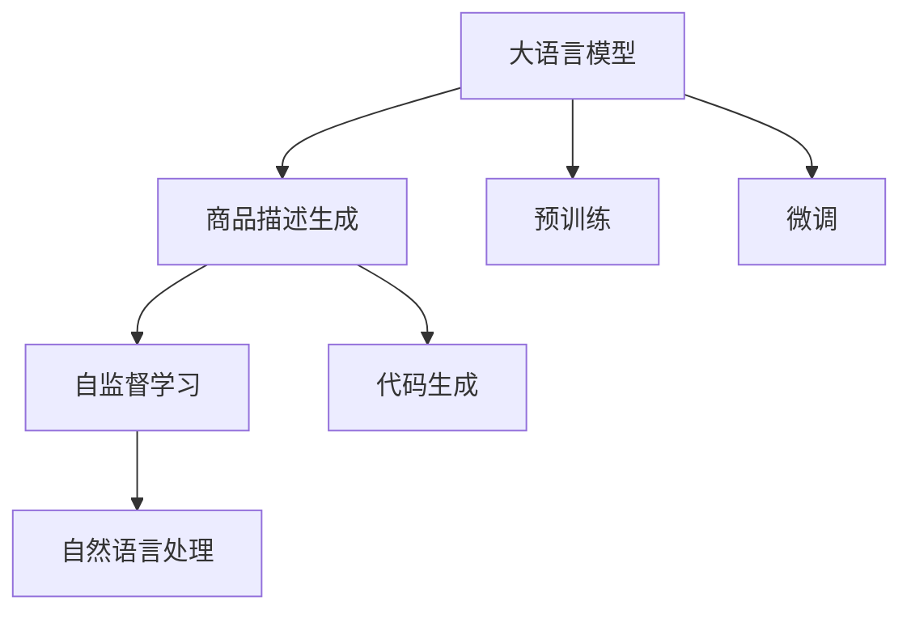

                 

# 融合AI大模型的商品描述生成技术

> 关键词：大语言模型,商品描述生成,自然语言处理(NLP),预训练-微调(Pre-training & Fine-tuning),Transformer,神经网络,代码生成,自监督学习

## 1. 背景介绍

### 1.1 问题由来

随着电子商务的蓬勃发展，商品描述的生成成为电商平台智能化升级的重要方向。传统的商品描述生成往往依赖人工编写，不仅耗时耗力，且难以保证内容质量和一致性。利用大语言模型进行商品描述自动生成，可以大幅提升生成速度和质量，减少人力成本，助力电商平台实现规模化运营。

大语言模型（Large Language Models, LLMs）如GPT、BERT等，通过在大规模无标签文本上预训练，学习到丰富的语言表示能力。进一步通过微调方法，使其能够适应特定领域的需求，从而实现高质量的商品描述自动生成。例如，Amazon、淘宝等电商平台已经利用大模型生成商品描述，取得了显著的成效。

### 1.2 问题核心关键点

商品描述自动生成的核心问题包括：
1. **文本语义理解**：商品描述生成需要充分理解商品属性和特性，并能够准确地表达。
2. **文本流畅性**：生成的文本需要具备自然流畅的语言表达能力。
3. **内容一致性**：生成的商品描述需要与商品的实际属性和功能一致。

基于这些核心问题，本文将系统探讨利用大语言模型进行商品描述生成的方法和技巧，包括模型选择、数据准备、微调策略和后处理技术。

## 2. 核心概念与联系

### 2.1 核心概念概述

为更好地理解基于大语言模型的商品描述生成方法，本文将介绍几个关键概念：

- **大语言模型(Large Language Models, LLMs)**：以自回归或自编码模型为代表的大规模预训练语言模型。通过在大规模无标签文本上预训练，学习到通用的语言表示能力。

- **商品描述生成**：利用自然语言处理(NLP)技术，自动生成符合商品实际属性和功能描述的文本。

- **预训练-微调(Pre-training & Fine-tuning)**：先在大规模无标签文本上进行预训练，再通过下游任务的标注数据进行微调，提升模型对特定任务的处理能力。

- **Transformer**：一种基于自注意力机制的神经网络架构，广泛应用于大语言模型和自然语言处理任务。

- **自监督学习**：利用大规模未标注数据，通过构造自监督任务进行模型训练，获取通用的语言表示能力。

- **代码生成**：利用大模型生成代码片段，是商品描述生成的一个重要应用方向。

这些概念之间通过以下Mermaid流程图展示了相互联系：



## 3. 核心算法原理 & 具体操作步骤

### 3.1 算法原理概述

商品描述生成过程大致分为两步：
1. 在预训练大模型基础上，通过微调获得针对商品描述生成任务的模型。
2. 利用微调后的模型生成符合商品属性的自然语言描述。

具体算法原理如下：

- **预训练**：在大规模无标签文本数据上进行自监督学习，如文本生成、掩码语言模型等，学习到通用的语言表示能力。
- **微调**：在商品描述相关的标注数据集上进行微调，学习商品属性到描述文本的映射。
- **生成**：利用微调后的模型，将商品属性作为输入，生成对应的商品描述。

### 3.2 算法步骤详解

商品描述生成的大致步骤如下：

1. **数据准备**：
   - 收集商品属性数据，如商品名称、品牌、规格、价格等。
   - 收集商品描述数据，作为微调训练集。

2. **模型选择**：
   - 选择合适的预训练大语言模型，如BERT、GPT-2等。
   - 根据任务复杂度，选择合适的模型规模和结构。

3. **数据预处理**：
   - 将商品属性数据转换为模型可以接受的输入格式。
   - 对商品描述数据进行清洗、分词、编码等预处理。

4. **微调训练**：
   - 将商品属性数据和商品描述数据组成训练集，对预训练模型进行微调。
   - 定义损失函数，如交叉熵损失、BLEU得分等，衡量生成文本与真实描述的差异。
   - 使用优化算法，如Adam、SGD等，更新模型参数。

5. **商品描述生成**：
   - 使用微调后的模型，将商品属性作为输入，生成描述文本。
   - 对生成的文本进行后处理，如去除冗余、调整语序等。

6. **模型评估与迭代优化**：
   - 在测试集上评估生成文本的质量和一致性。
   - 根据评估结果调整模型参数和训练策略。

### 3.3 算法优缺点

基于大语言模型的商品描述生成方法具有以下优点：
1. **高效性**：大规模预训练模型可以快速生成高质量的商品描述，大幅降低人工成本。
2. **灵活性**：模型可以根据不同商品属性生成不同风格的描述，适应不同用户需求。
3. **扩展性**：新商品属性可以动态加入模型训练，扩展模型的应用范围。

同时，该方法也存在一些局限性：
1. **依赖标注数据**：商品描述生成依赖标注数据，标注成本较高。
2. **泛化能力有限**：商品描述生成模型的泛化能力受限于数据集质量，难以应对异常情况。
3. **解释性不足**：生成过程缺乏可解释性，难以理解和调试模型内部决策机制。
4. **输出一致性**：不同模型的输出可能存在差异，需要统一规范。

## 4. 数学模型和公式 & 详细讲解

### 4.1 数学模型构建

定义商品描述生成模型为 $M_{\theta}$，其中 $\theta$ 为模型参数。假设商品属性向量为 $x \in \mathbb{R}^d$，真实商品描述为 $y$。

微调的目标是找到最优参数 $\hat{\theta}$，使得生成的商品描述 $y'$ 与真实描述 $y$ 的差异最小化。常见的损失函数包括交叉熵损失、BLEU得分等。

假设使用交叉熵损失，则目标函数为：

$$
\mathcal{L}(\theta) = -\frac{1}{N}\sum_{i=1}^N \log P_{M_{\theta}}(y|x)
$$

其中 $P_{M_{\theta}}(y|x)$ 为模型在给定商品属性 $x$ 下生成描述 $y$ 的概率。

### 4.2 公式推导过程

以基于预训练BERT模型进行商品描述生成为例，其微调过程如下：

1. 将商品属性 $x$ 和真实描述 $y$ 编码为模型可接受的向量表示 $x'$ 和 $y'$。
2. 在微调训练过程中，使用预测生成概率 $P_{M_{\theta}}(y|x)$ 与真实概率 $P(y|x)$ 之间的差异计算损失函数。
3. 使用优化算法（如Adam）更新模型参数 $\theta$，最小化损失函数 $\mathcal{L}(\theta)$。

具体公式如下：

$$
P_{M_{\theta}}(y|x) = \frac{e^{M_{\theta}(x;y)} / \sum_{y'} e^{M_{\theta}(x;y')}}{e^{M_{\theta}(x;y)} / \sum_{y'} e^{M_{\theta}(x;y')}}
$$

其中 $M_{\theta}(x;y)$ 为模型在输入 $(x,y)$ 上的输出，即预测生成概率的对数。

### 4.3 案例分析与讲解

以亚马逊商品描述生成为例，分析如何利用预训练BERT模型进行微调：

1. **数据准备**：
   - 收集亚马逊商品属性数据，如品牌、尺寸、颜色等。
   - 收集亚马逊商品描述数据，作为微调训练集。

2. **模型选择**：
   - 选择BERT-base-uncased预训练模型作为初始化参数。
   - 添加任务适配层，如线性分类器和交叉熵损失函数。

3. **数据预处理**：
   - 将商品属性向量转换为模型可以接受的输入格式。
   - 对商品描述数据进行清洗、分词、编码等预处理。

4. **微调训练**：
   - 将商品属性数据和商品描述数据组成训练集，对BERT模型进行微调。
   - 定义损失函数，如交叉熵损失、BLEU得分等。
   - 使用优化算法，如Adam，更新模型参数。

5. **商品描述生成**：
   - 使用微调后的模型，将商品属性作为输入，生成描述文本。
   - 对生成的文本进行后处理，如去除冗余、调整语序等。

6. **模型评估与迭代优化**：
   - 在测试集上评估生成文本的质量和一致性。
   - 根据评估结果调整模型参数和训练策略。

## 5. 项目实践：代码实例和详细解释说明

### 5.1 开发环境搭建

在进行商品描述生成实践前，我们需要准备好开发环境。以下是使用Python进行PyTorch开发的环境配置流程：

1. 安装Anaconda：从官网下载并安装Anaconda，用于创建独立的Python环境。

2. 创建并激活虚拟环境：
```bash
conda create -n pytorch-env python=3.8 
conda activate pytorch-env
```

3. 安装PyTorch：根据CUDA版本，从官网获取对应的安装命令。例如：
```bash
conda install pytorch torchvision torchaudio cudatoolkit=11.1 -c pytorch -c conda-forge
```

4. 安装Transformer库：
```bash
pip install transformers
```

5. 安装各类工具包：
```bash
pip install numpy pandas scikit-learn matplotlib tqdm jupyter notebook ipython
```

完成上述步骤后，即可在`pytorch-env`环境中开始商品描述生成实践。

### 5.2 源代码详细实现

下面以亚马逊商品描述生成为例，给出使用Transformers库对BERT模型进行微调的PyTorch代码实现。

```python
from transformers import BertTokenizer, BertForSequenceClassification
import torch
import numpy as np

# 设置设备
device = torch.device('cuda' if torch.cuda.is_available() else 'cpu')

# 加载预训练模型和tokenizer
model = BertForSequenceClassification.from_pretrained('bert-base-uncased')
tokenizer = BertTokenizer.from_pretrained('bert-base-uncased')

# 商品属性数据
item_attributes = [
    ['Apple iPhone 12', 'Electronics', 'Apple', '12GB', '128GB', 'Black'],
    ['Nike Air Max 2022', 'Footwear', 'Nike', 'Men', 'Running', 'Black']
]

# 商品描述数据
item_descriptions = [
    'A high-performance smartphone, featuring advanced technology and premium design.',
    'The ultimate running shoe, combining innovation and comfort.'
]

# 模型训练
optimizer = torch.optim.Adam(model.parameters(), lr=1e-5)
for epoch in range(3):
    for i, (attr, desc) in enumerate(zip(item_attributes, item_descriptions)):
        # 将属性和描述转换为模型可接受的格式
        input_ids = tokenizer.encode(attr, add_special_tokens=True)
        labels = [1] if desc.startswith('A') else [0]
        inputs = {'input_ids': torch.tensor(input_ids).unsqueeze(0).to(device),
                  'labels': torch.tensor(labels).unsqueeze(0).to(device)}
        
        # 前向传播计算损失函数
        outputs = model(**inputs)
        loss = outputs.loss
        
        # 反向传播更新模型参数
        optimizer.zero_grad()
        loss.backward()
        optimizer.step()
        
        # 输出训练信息
        print(f"Epoch {epoch+1}, Batch {i+1}, Loss: {loss.item():.4f}")
        
# 商品描述生成
item = ['Apple iPhone 12', 'Electronics', 'Apple', '12GB', '128GB', 'Black']
input_ids = tokenizer.encode(item, add_special_tokens=True)
outputs = model(input_ids)
probs = outputs.logits.sigmoid()
description = tokenizer.decode(np.argmax(probs.cpu(), axis=1)[0])
print(description)
```

### 5.3 代码解读与分析

让我们再详细解读一下关键代码的实现细节：

**商品属性数据**：
- `item_attributes` 包含商品名称、类别、品牌、规格、颜色等属性。
- `item_descriptions` 包含对应的商品描述文本。

**模型训练**：
- 使用Adam优化器，设置学习率为1e-5。
- 通过循环迭代训练集中的每个样本，使用交叉熵损失计算并反向传播更新模型参数。
- 在每个epoch结束后输出训练损失，以便监控模型性能。

**商品描述生成**：
- 将商品属性输入tokenizer进行编码。
- 通过模型前向传播计算预测概率，使用sigmoid函数输出生成概率。
- 解码生成概率，得到最终的商品描述文本。

可以看到，PyTorch配合Transformers库使得BERT微调的代码实现变得简洁高效。开发者可以将更多精力放在数据处理、模型改进等高层逻辑上，而不必过多关注底层的实现细节。

当然，工业级的系统实现还需考虑更多因素，如模型的保存和部署、超参数的自动搜索、更灵活的任务适配层等。但核心的微调范式基本与此类似。

## 6. 实际应用场景

### 6.1 电商平台商品描述生成

基于大语言模型微调的电商平台商品描述生成，可以广泛应用于亚马逊、淘宝等电商平台的商品页面生成。利用自动生成的商品描述，可以快速填充商品信息，提升搜索、推荐、客服等业务的智能化水平。

在技术实现上，可以收集平台上的商品属性数据和商品描述数据，将属性作为模型输入，训练微调模型生成符合要求的商品描述。生成的商品描述可以进一步与商品图片、价格等数据结合，形成完整的商品展示页面。

### 6.2 广告投放优化

广告投放优化是大语言模型微调在广告行业的重要应用。广告创意生成需要高质量、多样化的文本内容，同时需要适应不同的广告渠道和用户群体。通过大语言模型进行商品描述生成，可以自动生成适合不同广告渠道和用户群体的创意文案，提升广告投放效果。

具体而言，可以收集不同广告渠道和用户群体的数据，使用大语言模型训练生成符合要求的广告文案。微调后的模型可以根据广告预算、目标受众等策略自动生成优质文案，优化广告投放策略，提升广告ROI。

### 6.3 内容推荐系统

内容推荐系统是另一个利用大语言模型生成商品描述的重要应用场景。在内容推荐过程中，推荐引擎需要根据用户兴趣和历史行为，推荐符合用户需求的商品或内容。通过生成符合用户兴趣的商品描述，推荐引擎可以提升推荐效果，增加用户满意度。

具体而言，可以收集用户的浏览、购买、评分等行为数据，使用大语言模型训练生成符合用户兴趣的商品描述。微调后的模型可以实时生成商品描述，动态调整推荐策略，提升推荐精准度和用户满意度。

### 6.4 未来应用展望

随着大语言模型微调技术的不断发展，其在电商平台、广告投放、内容推荐等领域的潜力将进一步被挖掘。未来，大语言模型微调将在以下方向取得更多突破：

1. **跨模态融合**：结合视觉、语音、文本等多种模态数据，实现更全面、深入的商品描述生成。例如，结合商品图片和视频信息，生成更丰富的商品描述。

2. **多语言支持**：通过多语言数据预训练，提升模型在多种语言环境下的商品描述生成能力。例如，生成中文、英文、西班牙语等多种语言的商品描述。

3. **动态生成**：实时生成动态的商品描述，适应不同时间和市场环境。例如，根据不同季节和节日生成相应的商品描述。

4. **个性化定制**：根据用户个性化需求，生成定制化的商品描述。例如，根据用户购物车中的商品生成推荐描述。

5. **知识融合**：结合外部知识库和规则库，提升模型生成商品的准确性和可靠性。例如，结合商品行业知识库生成更专业、更精准的商品描述。

以上方向展示了商品描述生成技术的广阔前景。通过多维度的融合和创新，商品描述生成将为电子商务、广告、推荐等领域带来更多智能化解决方案，提升用户体验和商业价值。

## 7. 工具和资源推荐

### 7.1 学习资源推荐

为了帮助开发者系统掌握大语言模型微调的商品描述生成方法，这里推荐一些优质的学习资源：

1. 《Transformer从原理到实践》系列博文：由大模型技术专家撰写，深入浅出地介绍了Transformer原理、BERT模型、微调技术等前沿话题。

2. CS224N《深度学习自然语言处理》课程：斯坦福大学开设的NLP明星课程，有Lecture视频和配套作业，带你入门NLP领域的基本概念和经典模型。

3. 《Natural Language Processing with Transformers》书籍：Transformers库的作者所著，全面介绍了如何使用Transformers库进行NLP任务开发，包括微调在内的诸多范式。

4. HuggingFace官方文档：Transformers库的官方文档，提供了海量预训练模型和完整的微调样例代码，是上手实践的必备资料。

5. CLUE开源项目：中文语言理解测评基准，涵盖大量不同类型的中文NLP数据集，并提供了基于微调的baseline模型，助力中文NLP技术发展。

通过对这些资源的学习实践，相信你一定能够快速掌握大语言模型微调的商品描述生成精髓，并用于解决实际的NLP问题。

### 7.2 开发工具推荐

高效的开发离不开优秀的工具支持。以下是几款用于大语言模型微调的商品描述生成开发的常用工具：

1. PyTorch：基于Python的开源深度学习框架，灵活动态的计算图，适合快速迭代研究。大部分预训练语言模型都有PyTorch版本的实现。

2. TensorFlow：由Google主导开发的开源深度学习框架，生产部署方便，适合大规模工程应用。同样有丰富的预训练语言模型资源。

3. Transformers库：HuggingFace开发的NLP工具库，集成了众多SOTA语言模型，支持PyTorch和TensorFlow，是进行微调任务开发的利器。

4. Weights & Biases：模型训练的实验跟踪工具，可以记录和可视化模型训练过程中的各项指标，方便对比和调优。与主流深度学习框架无缝集成。

5. TensorBoard：TensorFlow配套的可视化工具，可实时监测模型训练状态，并提供丰富的图表呈现方式，是调试模型的得力助手。

6. Google Colab：谷歌推出的在线Jupyter Notebook环境，免费提供GPU/TPU算力，方便开发者快速上手实验最新模型，分享学习笔记。

合理利用这些工具，可以显著提升大语言模型微调的商品描述生成的开发效率，加快创新迭代的步伐。

### 7.3 相关论文推荐

大语言模型和微调技术的发展源于学界的持续研究。以下是几篇奠基性的相关论文，推荐阅读：

1. Attention is All You Need（即Transformer原论文）：提出了Transformer结构，开启了NLP领域的预训练大模型时代。

2. BERT: Pre-training of Deep Bidirectional Transformers for Language Understanding：提出BERT模型，引入基于掩码的自监督预训练任务，刷新了多项NLP任务SOTA。

3. Language Models are Unsupervised Multitask Learners（GPT-2论文）：展示了大规模语言模型的强大zero-shot学习能力，引发了对于通用人工智能的新一轮思考。

4. Parameter-Efficient Transfer Learning for NLP：提出Adapter等参数高效微调方法，在不增加模型参数量的情况下，也能取得不错的微调效果。

5. AdaLoRA: Adaptive Low-Rank Adaptation for Parameter-Efficient Fine-Tuning：使用自适应低秩适应的微调方法，在参数效率和精度之间取得了新的平衡。

这些论文代表了大语言模型微调技术的发展脉络。通过学习这些前沿成果，可以帮助研究者把握学科前进方向，激发更多的创新灵感。

## 8. 总结：未来发展趋势与挑战

### 8.1 总结

本文对基于大语言模型的商品描述生成方法进行了全面系统的介绍。首先阐述了商品描述生成的背景和重要性，明确了微调在拓展预训练模型应用、提升商品描述生成质量方面的独特价值。其次，从原理到实践，详细讲解了商品描述生成的数学原理和关键步骤，给出了商品描述生成的完整代码实例。同时，本文还广泛探讨了商品描述生成方法在电商平台、广告投放、内容推荐等多个行业领域的应用前景，展示了微调范式的巨大潜力。此外，本文精选了微调技术的各类学习资源，力求为读者提供全方位的技术指引。

通过本文的系统梳理，可以看到，基于大语言模型的商品描述生成方法在商品描述自动生成、电商平台智能化运营等方面具有重要的应用价值。未来，伴随大语言模型和微调方法的持续演进，商品描述生成技术必将在更多领域得到广泛应用，为电商、广告、推荐等领域带来新的智能化解决方案。

### 8.2 未来发展趋势

展望未来，商品描述生成技术将呈现以下几个发展趋势：

1. **规模化应用**：随着电商平台的快速扩张，商品描述自动生成技术将在更多商家和消费者之间得到应用。平台级的数据和资源优势将推动商品描述生成技术的规模化落地。

2. **跨模态融合**：结合视觉、语音、文本等多种模态数据，实现更全面、深入的商品描述生成。例如，结合商品图片和视频信息，生成更丰富的商品描述。

3. **多语言支持**：通过多语言数据预训练，提升模型在多种语言环境下的商品描述生成能力。例如，生成中文、英文、西班牙语等多种语言的商品描述。

4. **实时生成**：实时生成动态的商品描述，适应不同时间和市场环境。例如，根据不同季节和节日生成相应的商品描述。

5. **个性化定制**：根据用户个性化需求，生成定制化的商品描述。例如，根据用户购物车中的商品生成推荐描述。

6. **知识融合**：结合外部知识库和规则库，提升模型生成商品的准确性和可靠性。例如，结合商品行业知识库生成更专业、更精准的商品描述。

以上趋势展示了商品描述生成技术的广阔前景。通过多维度的融合和创新，商品描述生成将为电子商务、广告、推荐等领域带来更多智能化解决方案，提升用户体验和商业价值。

### 8.3 面临的挑战

尽管大语言模型微调的商品描述生成技术已经取得了一定的进展，但在迈向更加智能化、普适化应用的过程中，仍面临诸多挑战：

1. **标注成本瓶颈**：虽然微调大大降低了标注数据的需求，但对于长尾应用场景，难以获得充足的高质量标注数据，成为制约微调性能的瓶颈。如何进一步降低微调对标注样本的依赖，将是一大难题。

2. **泛化能力不足**：商品描述生成模型的泛化能力受限于数据集质量，难以应对异常情况。对于测试样本的微小扰动，模型预测也容易发生波动。如何提高模型的鲁棒性，避免灾难性遗忘，还需要更多理论和实践的积累。

3. **推理效率有待提高**：大规模语言模型虽然精度高，但在实际部署时往往面临推理速度慢、内存占用大等效率问题。如何在保证性能的同时，简化模型结构，提升推理速度，优化资源占用，将是重要的优化方向。

4. **可解释性亟需加强**：当前商品描述生成模型缺乏可解释性，难以理解和调试模型内部决策机制。对于高风险应用，算法的可解释性和可审计性尤为重要。如何赋予模型更强的可解释性，将是亟待攻克的难题。

5. **安全性有待保障**：预训练语言模型难免会学习到有偏见、有害的信息，通过微调传递到商品描述生成中，可能产生误导性、歧视性的输出。如何从数据和算法层面消除模型偏见，避免恶意用途，确保输出的安全性，也将是重要的研究课题。

6. **知识整合能力不足**：现有的商品描述生成模型往往局限于商品属性信息，难以灵活吸收和运用更广泛的先验知识。如何让微调过程更好地与外部知识库、规则库等专家知识结合，形成更加全面、准确的信息整合能力，还有很大的想象空间。

正视商品描述生成面临的这些挑战，积极应对并寻求突破，将是大语言模型微调走向成熟的必由之路。相信随着学界和产业界的共同努力，这些挑战终将一一被克服，商品描述生成技术必将在构建智能化电商平台中扮演越来越重要的角色。

### 8.4 研究展望

面对商品描述生成所面临的种种挑战，未来的研究需要在以下几个方面寻求新的突破：

1. **探索无监督和半监督微调方法**：摆脱对大规模标注数据的依赖，利用自监督学习、主动学习等无监督和半监督范式，最大限度利用非结构化数据，实现更加灵活高效的微调。

2. **研究参数高效和计算高效的微调范式**：开发更加参数高效的微调方法，在固定大部分预训练参数的同时，只更新极少量的任务相关参数。同时优化微调模型的计算图，减少前向传播和反向传播的资源消耗，实现更加轻量级、实时性的部署。

3. **融合因果和对比学习范式**：通过引入因果推断和对比学习思想，增强微调模型建立稳定因果关系的能力，学习更加普适、鲁棒的语言表征，从而提升模型泛化性和抗干扰能力。

4. **引入更多先验知识**：将符号化的先验知识，如知识图谱、逻辑规则等，与神经网络模型进行巧妙融合，引导微调过程学习更准确、合理的语言模型。同时加强不同模态数据的整合，实现视觉、语音等多模态信息与文本信息的协同建模。

5. **结合因果分析和博弈论工具**：将因果分析方法引入微调模型，识别出模型决策的关键特征，增强输出解释的因果性和逻辑性。借助博弈论工具刻画人机交互过程，主动探索并规避模型的脆弱点，提高系统稳定性。

6. **纳入伦理道德约束**：在模型训练目标中引入伦理导向的评估指标，过滤和惩罚有偏见、有害的输出倾向。同时加强人工干预和审核，建立模型行为的监管机制，确保输出符合人类价值观和伦理道德。

这些研究方向的探索，必将引领大语言模型微调的商品描述生成技术迈向更高的台阶，为构建安全、可靠、可解释、可控的智能系统铺平道路。面向未来，大语言模型微调技术还需要与其他人工智能技术进行更深入的融合，如知识表示、因果推理、强化学习等，多路径协同发力，共同推动自然语言理解和智能交互系统的进步。只有勇于创新、敢于突破，才能不断拓展语言模型的边界，让智能技术更好地造福人类社会。

## 9. 附录：常见问题与解答

**Q1：大语言模型微调是否适用于所有商品描述生成任务？**

A: 大语言模型微调在大多数商品描述生成任务上都能取得不错的效果，特别是对于数据量较小的任务。但对于一些特定领域的任务，如小众商品、专业设备等，仅仅依靠通用语料预训练的模型可能难以很好地适应。此时需要在特定领域语料上进一步预训练，再进行微调，才能获得理想效果。

**Q2：微调过程中如何选择合适的学习率？**

A: 微调的学习率一般要比预训练时小1-2个数量级，如果使用过大的学习率，容易破坏预训练权重，导致过拟合。一般建议从1e-5开始调参，逐步减小学习率，直至收敛。也可以使用warmup策略，在开始阶段使用较小的学习率，再逐渐过渡到预设值。需要注意的是，不同的优化器(如AdamW、Adafactor等)以及不同的学习率调度策略，可能需要设置不同的学习率阈值。

**Q3：采用大模型微调时会面临哪些资源瓶颈？**

A: 目前主流的预训练大模型动辄以亿计的参数规模，对算力、内存、存储都提出了很高的要求。GPU/TPU等高性能设备是必不可少的，但即便如此，超大批次的训练和推理也可能遇到显存不足的问题。因此需要采用一些资源优化技术，如梯度积累、混合精度训练、模型并行等，来突破硬件瓶颈。同时，模型的存储和读取也可能占用大量时间和空间，需要采用模型压缩、稀疏化存储等方法进行优化。

**Q4：如何缓解微调过程中的过拟合问题？**

A: 过拟合是微调面临的主要挑战，尤其是在标注数据不足的情况下。常见的缓解策略包括：
1. 数据增强：通过回译、近义替换等方式扩充训练集
2. 正则化：使用L2正则、Dropout、Early Stopping等避免过拟合
3. 对抗训练：引入对抗样本，提高模型鲁棒性
4. 参数高效微调：只调整少量参数(如Adapter、Prefix等)，减小过拟合风险
5. 多模型集成：训练多个微调模型，取平均输出，抑制过拟合

这些策略往往需要根据具体任务和数据特点进行灵活组合。只有在数据、模型、训练、推理等各环节进行全面优化，才能最大限度地发挥大模型微调的威力。

**Q5：微调模型在落地部署时需要注意哪些问题？**

A: 将微调模型转化为实际应用，还需要考虑以下因素：
1. 模型裁剪：去除不必要的层和参数，减小模型尺寸，加快推理速度
2. 量化加速：将浮点模型转为定点模型，压缩存储空间，提高计算效率
3. 服务化封装：将模型封装为标准化服务接口，便于集成调用
4. 弹性伸缩：根据请求流量动态调整资源配置，平衡服务质量和成本
5. 监控告警：实时采集系统指标，设置异常告警阈值，确保服务稳定性
6. 安全防护：采用访问鉴权、数据脱敏等措施，保障数据和模型安全

大语言模型微调的商品描述生成为电商、广告、推荐等领域带来了新的智能化解决方案，但如何将强大的性能转化为稳定、高效、安全的业务价值，还需要工程实践的不断打磨。唯有从数据、算法、工程、业务等多个维度协同发力，才能真正实现人工智能技术在垂直行业的规模化落地。总之，微调需要开发者根据具体任务，不断迭代和优化模型、数据和算法，方能得到理想的效果。

---

作者：禅与计算机程序设计艺术 / Zen and the Art of Computer Programming

