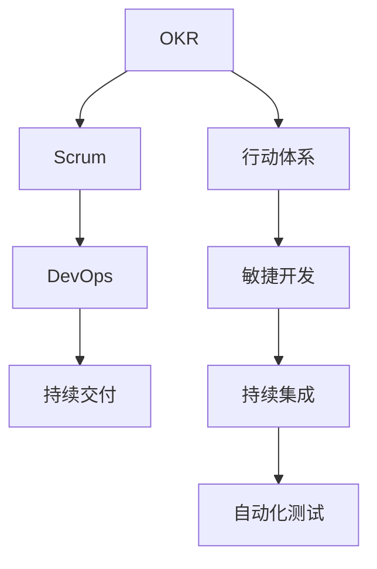

                 

# 行动体系:执行力的保障

> 关键词：行动体系,执行力,项目管理,敏捷开发,OKR,Scrum,DevOps,反馈循环,持续改进

## 1. 背景介绍

在当今快速变化的商业环境中，企业成功的关键不再只是拥有好的产品或技术，更在于能够快速、有效地将创意转化为成果。然而，无数实践表明，即便拥有优秀的资源和团队，也常常因为执行力的不足而导致项目失败、目标无法达成。为此，企业亟需一套行之有效的行动体系，以保障执行力的高效发挥。本文将深入探讨行动体系的概念、原理、操作和应用，希望为企业提供一种基于OKR、Scrum和DevOps的全面执行管理解决方案。

## 2. 核心概念与联系

### 2.1 核心概念概述

为更好地理解行动体系，本文将介绍几个紧密相关的核心概念：

- 行动体系(Action System): 一种结合OKR(目标与关键结果法)、Scrum(敏捷开发框架)、DevOps(持续集成与持续部署)等敏捷管理工具的全面执行管理框架，旨在通过构建明确的执行目标、敏捷的开发流程、持续的交付机制，最大化团队和组织的执行力。

- OKR(目标与关键结果法): 一种以目标设定、结果追踪为核心的管理方法，强调明确的目标、可衡量的结果和团队的协作。OKR通过设定挑战性的目标和可量化的关键结果，推动团队向既定方向努力。

- Scrum(敏捷开发框架): 一种敏捷开发方法，通过短周期迭代、团队自组织和客户参与，实现快速响应市场变化、提高产品质量和客户满意度。Scrum注重团队协作和反馈机制，每个迭代周期都有明确的任务和目标。

- DevOps(持续集成与持续部署): 一种结合软件开发和运维的集成方法，通过自动化工具和持续交付，实现代码变更的快速、可靠和高效。DevOps强调跨部门协作和持续反馈，确保产品从开发到部署的全生命周期管理。

这些概念之间的逻辑关系可以通过以下Mermaid流程图来展示：



这个流程图展示了几者之间的关系：

1. OKR和Scrum共同构成行动体系的执行框架，定义了明确的目标和敏捷的开发流程。
2. DevOps与Scrum和DevOps相融合，提供了持续交付和持续集成的机制。
3. 行动体系整合了OKR、Scrum和DevOps，实现了从目标设定、敏捷开发到持续交付的全面执行管理。

## 3. 核心算法原理 & 具体操作步骤

### 3.1 算法原理概述

行动体系的构建基于敏捷管理的核心原则，即透明度、反馈和持续改进。通过构建明确的执行目标、敏捷的开发流程、持续的交付机制，最大化团队和组织的执行力。具体而言，行动体系分为三个主要阶段：目标设定、敏捷开发、持续交付。每个阶段都有其特有的执行策略和工具。

- **目标设定**：通过OKR方法，明确设定组织的长期目标和关键结果，帮助团队理解组织的愿景和方向。
- **敏捷开发**：通过Scrum框架，实现快速迭代和反馈循环，增强团队的灵活性和适应性。
- **持续交付**：通过DevOps实践，实现自动化和持续集成，确保产品快速、可靠地交付市场。

### 3.2 算法步骤详解

行动体系的操作主要分为以下几个关键步骤：

**Step 1: 目标设定**
- 收集组织和团队成员的意见，共同设定长期目标和关键结果。
- 确保目标具有挑战性但可实现，并量化关键结果以供跟踪。
- 将目标和结果公开透明地传播到团队，使每个人都清楚组织的方向和预期。

**Step 2: 敏捷开发**
- 组建Scrum团队，选出一个Scrum Master和Product Owner。
- 进行短周期迭代，通常为2-4周，每个迭代结束时进行回顾和计划。
- 使用用户故事、任务清单和看板等工具管理开发任务。
- 定期进行Sprint Review和Retrospective，评估迭代效果，调整开发策略。

**Step 3: 持续交付**
- 实现持续集成和持续部署流程，确保代码变更的快速和安全。
- 使用CI/CD工具自动化测试、构建和部署流程。
- 持续监控系统性能和代码质量，及时反馈并改进。
- 定期进行回顾，识别和消除瓶颈，提高交付效率。

### 3.3 算法优缺点

行动体系作为一种全面执行管理框架，具有以下优点：
1. 提升透明度和协作：通过公开透明的OKR目标，提升团队对组织愿景的共识，促进协作。
2. 加速反馈和改进：敏捷开发和持续交付机制确保快速反馈和持续改进，提高适应性。
3. 优化资源配置：通过自动化工具和持续交付，减少手动操作，优化资源配置。
4. 增强组织弹性：敏捷开发和持续交付机制使组织更具灵活性和适应性。

然而，行动体系也存在一些局限性：
1. 对管理层要求高：OKR和Scrum的成功实施要求高层有较高的投入和支持。
2. 需要文化变革：改变团队工作习惯和企业文化需要时间和耐心。
3. 工具复杂度高：实施行动体系需要多种工具和技术的整合，操作复杂。
4. 强调短期目标：虽然能够迅速见效，但可能忽略长期战略规划。

尽管存在这些局限，但就目前而言，行动体系仍是敏捷管理的主流范式。未来相关研究的重点在于如何更好地集成各类管理工具和技术，同时兼顾短期目标和长期战略。

### 3.4 算法应用领域

行动体系作为一种全面执行管理框架，可以应用于各种组织和项目的执行管理，如：

- 软件开发项目：通过Scrum敏捷开发和DevOps持续交付，提升产品迭代速度和质量。
- 市场推广活动：通过OKR设定目标和关键结果，实现市场战略的快速调整和优化。
- 创新项目孵化：通过Scrum敏捷开发和持续交付机制，快速验证和迭代创意。
- 服务运营管理：通过OKR设定服务目标和关键结果，提升服务质量和客户满意度。
- 企业战略规划：通过OKR设定长期目标和关键结果，推动企业战略的执行和优化。

## 4. 数学模型和公式 & 详细讲解 & 举例说明

### 4.1 数学模型构建

行动体系的执行效果可以通过多个关键指标来衡量，包括：
- 目标达成率：目标达成的百分比，反映团队对组织愿景的执行力。
- 迭代完成率：每个Scrum迭代中完成的任务百分比，反映团队的生产效率。
- 交付周期：从代码提交到部署完成的周期时间，反映持续交付的效率。
- 质量缺陷率：发布后代码和系统的缺陷率，反映产品质量。
- 团队满意度：团队成员对工作环境的满意度，反映团队的凝聚力和幸福感。

这些指标可以通过以下数学模型进行量化：

$$
目标达成率 = \frac{完成的目标数}{目标总数} \times 100\%
$$

$$
迭代完成率 = \frac{完成的迭代任务数}{总迭代任务数} \times 100\%
$$

$$
交付周期 = \frac{发布时间 - 提交时间}{迭代周期天数}
$$

$$
质量缺陷率 = \frac{缺陷总数}{发布代码行数} \times 100\%
$$

$$
团队满意度 = \sum_{i=1}^{n} (\text{第}i\text{个成员满意度得分}) / n
$$

### 4.2 公式推导过程

目标达成率的计算公式非常简单，直接比较完成目标数与目标总数的比例。迭代完成率也同理。交付周期的计算涉及时间差除以迭代周期天数，注意单位统一。质量缺陷率的计算涉及统计缺陷数量并除以代码行数，反映每行代码的缺陷率。团队满意度的计算涉及汇总每个成员的满意度得分并平均，反映团队的总体满意度。

### 4.3 案例分析与讲解

假设某软件开发团队的目标是提升用户满意度，关键结果为“用户满意度提升20%”。在第一个Scrum迭代中，团队完成了30%的目标任务，并将代码提交并部署到生产环境。在第二个迭代中，团队完成了40%的目标任务，交付周期为5天，代码提交后仅发现1%的缺陷。

根据上述数据，计算目标达成率、迭代完成率、交付周期和质量缺陷率：

- 目标达成率 = 20%（实际完成20%，目标为30%）
- 迭代完成率 = 70%（完成了70%的任务）
- 交付周期 = 2.5天（发布时间减去提交时间，迭代周期为5天）
- 质量缺陷率 = 2%（1%的缺陷率）

这些指标为团队提供了明确的执行效果反馈，帮助团队了解自身表现，并进行必要的调整。

## 5. 项目实践：代码实例和详细解释说明

### 5.1 开发环境搭建

在进行行动体系实践前，我们需要准备好开发环境。以下是使用Python进行OKR、Scrum和DevOps集成管理的环境配置流程：

1. 安装Python环境：
```bash
sudo apt-get update
sudo apt-get install python3-pip
```

2. 安装OKR工具：
```bash
pip install okr-py
```

3. 安装Scrum工具：
```bash
pip install scrum-py
```

4. 安装DevOps工具：
```bash
pip install devops-py
```

5. 安装数据分析工具：
```bash
pip install pandas numpy matplotlib
```

完成上述步骤后，即可在本地环境开始行动体系的实践。

### 5.2 源代码详细实现

下面我们以软件开发项目为例，给出使用OKR、Scrum和DevOps集成管理的Python代码实现。

首先，定义OKR目标和关键结果：

```python
# OKR目标定义
objectives = {
    '提升用户满意度': '提升用户满意度20%',
    '减少用户投诉': '用户投诉减少15%',
    '优化产品功能': '新增功能模块X个'
}

# 关键结果定义
key_results = {
    '提升用户满意度': {
        '用户满意度调查': '用户满意度提升20%',
        '客户反馈收集': '每月收集用户反馈100条'
    },
    '减少用户投诉': {
        '投诉处理时间': '投诉处理时间减少20%',
        '客户反馈响应率': '投诉响应率提升10%'
    },
    '优化产品功能': {
        '新功能开发': '每月新增功能模块2个',
        '功能测试': '新功能测试覆盖率100%'
    }
}
```

然后，定义Scrum迭代计划和任务管理：

```python
# 定义Scrum迭代周期
iteration_cycle = 2

# 创建Scrum团队
scrum_team = scrum.ScrumTeam(iteration_cycle)

# 添加Scrum Master和Product Owner
scrum_team.add_scrum_master('John')
scrum_team.add_product_owner('Jane')

# 创建看板和任务列表
backlog = scrum_team.create_backlog()
task_list = scrum_team.create_task_list(backlog)

# 定义用户故事和任务
user_stories = [
    '作为一名用户，我希望能够快速注册账户。',
    '作为一名用户，我希望能够查看我的订单历史。',
    '作为一名用户，我希望能够接收个性化推荐。'
]

for user_story in user_stories:
    task_list.add_task(user_story)

# 启动第一个Scrum迭代
scrum_team.start_iteration()
```

接着，定义DevOps持续集成和持续交付流程：

```python
# 定义持续集成流程
CI_pipeline = devops.CIPipeline()

# 添加代码提交和自动测试
CI_pipeline.add_code_submission()
CI_pipeline.add_automated_testing()

# 定义持续部署流程
CD_pipeline = devops.CDPipeline()

# 添加部署和质量监控
CD_pipeline.add_deployment()
CD_pipeline.add_quality_monitoring()
```

最后，启动行动体系的整体执行流程：

```python
# 启动OKR目标跟踪
for objective, key_results in objectives.items():
    for key_result_name, result in key_results.items():
        scrub_result = OKRResult(result)
        scrub_result.set_target_score(0)
        scrub_result.set_current_score(0)
        scrub_result.add_auto_monitor()
        scrub_result.add_manual_monitor()

# 启动Scrum迭代和任务执行
for i in range(iteration_cycle):
    scrum_team.start_iteration()
    scrum_team.status_report()
    scrum_team.review_and_retrospective()

# 启动DevOps持续集成和持续交付
CI_pipeline.start_pipeline()
CD_pipeline.start_pipeline()

# 定期生成行动体系执行报告
action_report = ActionReport()
action_report.add_okr_summary()
action_report.add_scrum_summary()
action_report.add_devops_summary()
action_report.generate_report()
```

### 5.3 代码解读与分析

让我们再详细解读一下关键代码的实现细节：

**OKR目标定义**：
- 使用Python字典存储OKR目标和关键结果，方便后续的跟踪和评估。

**Scrum迭代计划和任务管理**：
- 使用ScrumPy库创建Scrum团队，添加Scrum Master和Product Owner，管理任务列表和用户故事。

**DevOps持续集成和持续交付流程**：
- 使用DevOpsPy库定义持续集成和持续交付流程，自动执行代码提交和测试，部署和质量监控。

**行动体系执行报告**：
- 通过ActionReport类生成OKR、Scrum和DevOps的执行报告，反映团队的执行效果和改进需求。

通过这段代码，可以看出，OKR、Scrum和DevOps的集成管理可以通过Python代码实现，使得整个执行过程自动化和系统化，提高了执行效率和管理精度。

## 6. 实际应用场景

### 6.1 软件开发项目

软件开发项目是行动体系的重要应用场景。通过OKR设定项目目标和关键结果，Scrum敏捷开发和DevOps持续交付，可以显著提升项目的执行效率和质量。例如，某互联网公司通过OKR设定“提升移动应用的用户活跃度30%”，通过Scrum敏捷开发实现快速迭代，并通过DevOps持续交付确保产品稳定上线，最终成功实现目标。

### 6.2 市场推广活动

市场推广活动也需要明确的目标和敏捷的执行。通过OKR设定推广目标和关键结果，Scrum敏捷开发和DevOps持续交付，可以高效地推出市场活动，并及时调整策略。例如，某快消品公司通过OKR设定“提升产品销量20%”，通过Scrum敏捷开发快速迭代市场推广策略，并通过DevOps持续交付上线推广内容，最终实现目标。

### 6.3 创新项目孵化

创新项目孵化需要快速验证和迭代创意。通过OKR设定项目目标和关键结果，Scrum敏捷开发和DevOps持续交付，可以快速迭代创意，验证商业价值。例如，某创业公司通过OKR设定“开发一款新型智能家居设备”，通过Scrum敏捷开发快速迭代产品功能，并通过DevOps持续交付上线产品原型，最终成功推出产品。

### 6.4 服务运营管理

服务运营管理需要高效的资源配置和客户响应。通过OKR设定服务目标和关键结果，Scrum敏捷开发和DevOps持续交付，可以高效地提供服务，并及时响应客户需求。例如，某电信公司通过OKR设定“提升服务满意度30%”，通过Scrum敏捷开发快速迭代服务流程，并通过DevOps持续交付上线服务新功能，最终成功实现目标。

### 6.5 企业战略规划

企业战略规划需要明确的战略方向和高效的执行。通过OKR设定企业战略目标和关键结果，Scrum敏捷开发和DevOps持续交付，可以高效地推动战略执行，并及时调整战略方向。例如，某大型企业通过OKR设定“实现数字化转型”，通过Scrum敏捷开发快速迭代数字化战略，并通过DevOps持续交付上线数字化工具，最终成功实现战略目标。

## 7. 工具和资源推荐

### 7.1 学习资源推荐

为了帮助开发者系统掌握行动体系的理论基础和实践技巧，这里推荐一些优质的学习资源：

1. 《行动体系：敏捷管理的艺术与科学》：由敏捷管理大师撰写，深入浅出地介绍了OKR、Scrum和DevOps的基本概念和核心原则。
2. 《Scrum敏捷开发指南》：Scrum.org提供的官方指南，详细介绍了Scrum框架的实施方法和最佳实践。
3. 《DevOps实践指南》：由Docker和Red Hat联合发布，系统介绍了DevOps的持续集成与持续部署方法。
4. 《OKR管理实战》：Google等大公司推荐的OKR实践指南，提供了丰富的案例和工具支持。
5. 《行动体系：敏捷管理理论与实践》课程：由Coursera等在线教育平台提供的课程，涵盖OKR、Scrum和DevOps的全面知识。

通过对这些资源的学习实践，相信你一定能够快速掌握行动体系的核心技能，并用于解决实际的执行管理问题。

### 7.2 开发工具推荐

高效的开发离不开优秀的工具支持。以下是几款用于行动体系实施开发的常用工具：

1. Jira：项目管理工具，支持OKR和Scrum的敏捷管理，提供任务跟踪、迭代管理和报表统计功能。
2. GitHub：代码托管平台，支持DevOps的持续集成与持续部署，提供代码审查、自动化测试和部署功能。
3. Jenkins：持续集成工具，支持CI/CD流程自动化，提供自动化测试和部署功能。
4. Kubernetes：容器编排平台，支持DevOps的自动化运维，提供容器部署和扩展功能。
5. Prometheus：监控工具，支持DevOps的质量监控和报警功能，提供实时性能监控和故障分析功能。

合理利用这些工具，可以显著提升行动体系的实施效率，加速企业执行力的提升。

### 7.3 相关论文推荐

行动体系作为一种全面执行管理框架，其发展源于学界的持续研究。以下是几篇奠基性的相关论文，推荐阅读：

1. "Objectives and Key Results (OKR): A New Approach to Strategy and Goal-Setting"：由Intel公司提出的OKR模型，详细介绍了OKR目标设定和结果追踪的方法。
2. "The Agile Manifesto"：Scrum的核心理念和十二条原则，奠定了敏捷开发的基础。
3. "Continuous Delivery: Reliable Software Releases through Build, Test, and Deploy Automation"：由Joel Spolsky提出的持续交付模型，详细介绍了持续集成和持续部署的最佳实践。
4. "Agile Project Management with Scrum: A Guide to the Basics"：Scrum.org提供的官方指南，详细介绍了Scrum框架的实施方法和最佳实践。
5. "Mastering DevOps: Designing DevOps Culture, Process, and Technology"：由Adrianiz overt魔鬼提出的DevOps全面管理方法，详细介绍了DevOps的持续集成和持续交付流程。

这些论文代表了大语言模型微调技术的发展脉络。通过学习这些前沿成果，可以帮助研究者把握学科前进方向，激发更多的创新灵感。

## 8. 总结：未来发展趋势与挑战

### 8.1 总结

本文对行动体系的概念、原理、操作和应用进行了全面系统的介绍。首先阐述了行动体系在提升执行力方面的重要性和应用场景，明确了OKR、Scrum和DevOps的执行策略和工具。其次，从原理到实践，详细讲解了行动体系的数学模型和具体实现，提供了完整的代码实例。同时，本文还广泛探讨了行动体系在软件开发、市场推广、创新项目孵化、服务运营管理和企业战略规划等多个行业领域的应用前景，展示了行动体系的全方位执行管理能力。

通过本文的系统梳理，可以看到，行动体系作为一种全面执行管理框架，已经广泛应用于各种组织和项目的执行管理中，显著提升了团队和组织的执行力。未来，伴随OKR、Scrum和DevOps等管理工具的持续发展和融合，行动体系必将在构建人机协同的智能时代中扮演越来越重要的角色。

### 8.2 未来发展趋势

展望未来，行动体系将呈现以下几个发展趋势：

1. 与AI技术的融合：行动体系将与AI技术进一步融合，通过数据分析、机器学习等方法，提高执行效果的预测和优化。
2. 多项目管理支持：行动体系将支持跨项目、跨团队的协作管理，提升整体执行效率。
3. 自适应执行策略：行动体系将引入自适应算法，根据执行效果动态调整策略，提高执行灵活性。
4. 跨文化支持：行动体系将支持多语言、多文化的执行管理，推动全球化企业的执行效率提升。
5. 自动化工具的完善：行动体系将集成更多自动化工具，提升执行效率和质量。

以上趋势凸显了行动体系的广阔前景。这些方向的探索发展，必将进一步提升企业的执行力和竞争力，帮助企业在快速变化的市场中保持领先。

### 8.3 面临的挑战

尽管行动体系已经取得了显著成果，但在迈向更加智能化、普适化应用的过程中，它仍面临着诸多挑战：

1. 对管理层的依赖：OKR和Scrum的成功实施要求高层有较高的投入和支持，组织文化变革需要时间和耐心。
2. 工具和技术的复杂性：行动体系需要多种工具和技术的整合，操作复杂，需要持续维护和优化。
3. 执行效果难以量化：虽然行动体系可以量化部分执行效果，但对于复杂目标的实现，仍然难以全面评估。
4. 执行团队的技能要求高：行动体系的实施需要团队具备敏捷开发和持续交付的技能，提升技能水平需要时间和培训。
5. 反馈机制的透明度：如何实现跨部门的有效沟通和反馈，需要设计合理的机制和流程。

尽管存在这些挑战，但行动体系作为一种全面执行管理框架，其优势在于能够系统性地提升团队和组织的执行力，帮助企业应对快速变化的市场环境。未来，需要通过持续优化和改进，更好地满足企业的需求，提升执行效果。

### 8.4 研究展望

面对行动体系所面临的挑战，未来的研究需要在以下几个方面寻求新的突破：

1. 数据驱动的执行优化：引入大数据和AI技术，通过数据分析和模型优化，提升执行效果的预测和优化。
2. 跨领域执行管理：将行动体系应用到更多领域，如医疗、教育、金融等，提升跨领域执行管理能力。
3. 自动化执行工具：开发更加智能化的自动化执行工具，实现自动化的任务管理、反馈机制和持续改进。
4. 定制化的执行策略：根据不同组织和项目的特点，设计定制化的执行策略，提升执行效果。
5. 人机协同的执行框架：通过人机协同的方法，提升行动体系的执行效果，推动智能执行的实现。

这些研究方向将进一步推动行动体系的发展，帮助企业提升执行力和竞争力，构建人机协同的智能时代。总之，行动体系需要持续优化和改进，不断适应新的市场和技术变化，才能更好地帮助企业实现目标和愿景。

## 9. 附录：常见问题与解答

**Q1：行动体系是否适用于所有类型的组织和项目？**

A: 行动体系适用于需要快速执行和高效管理的各种组织和项目，如软件开发、市场营销、产品创新、服务运营等。但需要注意的是，不同组织和项目的实施难度和复杂度可能不同，需要根据具体情况进行定制化调整。

**Q2：行动体系需要投入哪些资源？**

A: 实施行动体系需要组织高层的大力支持，包括时间和人力资源的投入。需要组建Scrum团队，设置OKR目标，引入DevOps工具，进行持续集成和持续交付。此外，还需要投入一定的时间和精力进行培训和学习。

**Q3：行动体系实施过程中如何保持透明度？**

A: 行动体系实施过程中，需要定期公开OKR目标和执行效果，促进团队之间的沟通和协作。可以使用看板、报告和会议等工具，保持信息透明。

**Q4：行动体系实施过程中如何确保持续改进？**

A: 行动体系实施过程中，需要定期进行回顾和反思，评估执行效果和改进需求。可以通过Scrum的回顾会议和DevOps的持续反馈机制，确保持续改进。

**Q5：行动体系实施过程中如何处理冲突？**

A: 行动体系实施过程中，可能会出现团队成员之间的意见不一致和冲突。需要通过透明的沟通机制和协商机制，及时解决冲突，确保团队协作。

**Q6：行动体系实施过程中如何避免过度管理？**

A: 行动体系实施过程中，需要注意避免过度管理，确保团队拥有足够的自主权和灵活性。可以通过设定明确的OKR目标和Scrum迭代计划，确保团队自主决策和自我管理。

这些问题的回答为行动体系的实施提供了具体的指导，帮助企业更好地应对执行管理中的各种挑战，提升执行力。总之，行动体系作为一种全面执行管理框架，需要企业高层的大力支持和团队的积极参与，才能实现其最大的价值。

