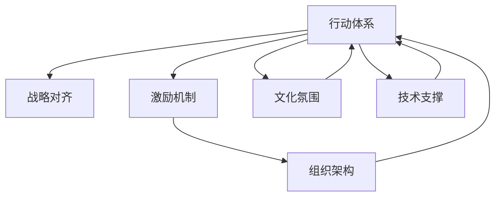

                 

# 行动体系与管理绩效的关联

> 关键词：行动体系,管理绩效,战略对齐,激励机制,组织架构,文化氛围

## 1. 背景介绍

### 1.1 问题由来
在当今快节奏的商业环境中，企业面临着不断变化的市场需求和竞争压力。如何高效地制定和执行战略计划，成为企业管理者必须面对的重要课题。而行动体系，即企业内部各层级之间的行动关联和协调机制，直接影响到企业战略目标的实现和管理绩效的提升。本文将从理论到实践，探讨行动体系与管理绩效的深刻关联，并提出一系列具体的管理建议，帮助企业构建高效协同的行动体系，提升整体绩效。

### 1.2 问题核心关键点
1. **行动体系与战略对齐**：如何构建一个能够快速响应市场变化，并与企业战略高度一致的行动体系？
2. **激励机制设计**：如何通过有效的激励机制，激发员工积极性和创造力？
3. **组织架构优化**：如何将扁平化的管理架构与灵活的行动体系相结合？
4. **文化氛围塑造**：如何营造一种鼓励创新、包容错误、促进团队协作的企业文化？
5. **技术支撑**：如何利用先进的信息技术工具，提高行动体系的管理效率？

### 1.3 问题研究意义
研究行动体系与管理绩效的关联，对于提升企业战略执行力、优化资源配置、提高运营效率具有重要意义。特别是在数字化转型的背景下，如何通过构建高效的行动体系，将数字化能力转化为企业竞争优势，是一个亟待解决的问题。本文旨在为企业管理者提供一套全面的行动体系构建与管理绩效提升的策略和方法，帮助企业在激烈的市场竞争中保持领先。

## 2. 核心概念与联系

### 2.1 核心概念概述

为更好地理解行动体系与管理绩效的关联，本节将介绍几个密切相关的核心概念：

- **行动体系(Aaction System)**：企业内部各层级之间，通过明确的职责分工、信息沟通和协同合作，形成的一种动态关联和协调机制。
- **战略对齐(Strategic Alignment)**：企业各层次行动与企业整体战略目标的一致性，即确保每一个层级的行动都指向企业战略的核心价值。
- **激励机制(Incentive Mechanism)**：通过设定合理的奖励与惩罚规则，激发员工的内在动力和外在表现，提升工作积极性和工作效率。
- **组织架构(Organizational Structure)**：企业内部各层级和部门的构成和相互关系，影响行动体系的设计和执行。
- **文化氛围(Cultural Atmosphere)**：企业内部共同的价值观、行为规范和互动方式，塑造员工的思维模式和行为习惯。

这些核心概念之间的逻辑关系可以通过以下Mermaid流程图来展示：



这个流程图展示了一个行动体系内部各要素之间的相互关系：

1. 行动体系的设计受到战略对齐、激励机制、组织架构和文化氛围的影响。
2. 技术支撑是行动体系得以高效运作的重要工具。
3. 行动体系的设计和执行，反过来也会影响和塑造企业整体的文化氛围和激励机制。

## 3. 核心算法原理 & 具体操作步骤

### 3.1 算法原理概述

行动体系与管理绩效的关联，主要体现在以下几个方面：

1. **战略对齐的直接影响**：战略对齐度高的行动体系，能够有效引导各层级协同工作，确保资源配置和执行力度符合企业战略方向，从而提升整体管理绩效。
2. **激励机制的驱动作用**：合理的激励机制能够调动员工的积极性和创造力，提升工作质量和效率，进一步推动管理绩效的提升。
3. **组织架构的支撑作用**：合理的组织架构设计，能够有效协调各层级和部门间的行动，降低信息不对称和沟通成本，提高行动体系的执行效率。
4. **文化氛围的软性约束**：积极的企业文化能够促进员工之间的信任和合作，提高组织的凝聚力和执行力，间接提升管理绩效。
5. **技术支撑的硬件保障**：先进的信息技术工具能够提供实时的数据支持和决策分析，提高行动体系的管理精度和响应速度。

### 3.2 算法步骤详解

构建和优化行动体系，主要包括以下几个关键步骤：

**Step 1: 明确企业战略**
- 定义企业核心价值观和长期战略目标。
- 对市场环境、竞争态势进行深入分析，确定核心业务和战略重点。

**Step 2: 设计行动体系架构**
- 根据战略目标，设计多层次的行动体系架构，包括决策层、执行层、操作层等。
- 确定各层级的职责和权限，确保信息流畅和行动一致。

**Step 3: 制定激励机制**
- 设定明确的绩效评估指标，包括个人和团队层面。
- 设计合理的奖励和惩罚规则，如股权激励、绩效奖金、晋升机制等。

**Step 4: 优化组织架构**
- 设计扁平化的管理架构，减少层级，提高决策速度和执行效率。
- 调整部门职能，实现跨部门协作，降低职能重叠和冗余。

**Step 5: 营造文化氛围**
- 通过企业愿景、使命和核心价值观，塑造积极向上的企业文化。
- 提倡开放、包容的企业氛围，鼓励员工创新和尝试。

**Step 6: 引入技术支撑**
- 采用先进的信息技术工具，如ERP、CRM、BI等，提高数据管理和决策分析能力。
- 建立实时监控和反馈机制，及时调整行动计划和资源配置。

### 3.3 算法优缺点

行动体系构建与管理绩效提升的算法具有以下优点：

1. **系统性**：通过明确各层级职责和激励机制，能够系统地管理和提升员工绩效。
2. **灵活性**：采用扁平化管理架构和跨部门协作，能够快速响应市场变化，灵活调整行动计划。
3. **透明度**：通过技术工具的引入，实现数据透明和信息共享，提高决策的科学性和公正性。
4. **激励性强**：合理的激励机制能够有效激发员工内在动力，提升工作积极性和创造力。

同时，该方法也存在一定的局限性：

1. **文化变革困难**：改变企业文化和思维模式需要时间和耐心，短期内效果可能不明显。
2. **技术投入成本高**：先进信息技术工具的引入，需要较高的技术投入和维护成本。
3. **执行难度大**：行动体系的构建和优化，需要高层管理者的大力支持和推动。

### 3.4 算法应用领域

行动体系构建与管理绩效提升的算法，广泛应用于各类企业管理实践，特别是在以下领域：

1. **高科技企业**：如Google、Amazon等，通过构建高效行动体系，快速响应市场变化，提升产品创新和市场份额。
2. **金融行业**：如JP Morgan、Goldman Sachs等，通过优化组织架构和激励机制，提高风险控制和业务执行效率。
3. **制造业**：如General Electric、Tesla等，通过设计扁平化管理架构，提高生产效率和供应链协同。
4. **零售业**：如Walmart、Amazon等，通过数据驱动和实时反馈机制，优化库存管理和客户服务。
5. **服务业**：如Airbnb、Uber等，通过营造创新文化，提升用户体验和市场响应速度。

## 4. 数学模型和公式 & 详细讲解

### 4.1 数学模型构建

本节将使用数学语言对行动体系与管理绩效的关联进行更加严格的刻画。

设企业行动体系为 $A=\{a_1, a_2, ..., a_n\}$，其中 $a_i$ 表示第 $i$ 层级的行动。企业战略目标为 $S$，激励机制为 $M$，组织架构为 $O$，文化氛围为 $C$，技术支撑为 $T$。设行动体系对齐度为 $A_c$，激励机制有效性为 $M_e$，组织架构优化度为 $O_o$，文化氛围积极度为 $C_c$，技术支撑水平为 $T_c$。则企业整体绩效 $P$ 可以表示为：

$$
P = f(A_c, M_e, O_o, C_c, T_c)
$$

其中 $f$ 为一系列影响因子的非线性函数，反映了各因子对整体绩效的贡献。

### 4.2 公式推导过程

为了方便分析，我们假设各因子对绩效的贡献是线性的，即：

$$
P = A_c + M_e + O_o + C_c + T_c
$$

在实际应用中，各因子之间的相互作用和影响更为复杂。例如，合理的激励机制 $M_e$ 能够增强组织架构的优化度 $O_o$，促进文化氛围的积极度 $C_c$，提升技术支撑水平 $T_c$，从而对整体绩效 $P$ 产生协同放大效应。

### 4.3 案例分析与讲解

假设某高科技企业，通过行动体系优化，提升了各层级对齐度 $A_c=0.9$，激励机制有效性 $M_e=0.8$，组织架构优化度 $O_o=0.7$，文化氛围积极度 $C_c=0.6$，技术支撑水平 $T_c=0.5$。则该企业的整体绩效 $P$ 为：

$$
P = 0.9 + 0.8 + 0.7 + 0.6 + 0.5 = 3.5
$$

在另一个案例中，某零售企业通过优化文化氛围和激励机制，显著提升了员工满意度 $C_c=0.9$ 和激励机制有效性 $M_e=0.9$，但组织架构优化度 $O_o=0.5$ 和技术支撑水平 $T_c=0.4$ 较低。此时企业整体绩效 $P$ 为：

$$
P = 0.5 + 0.9 + 0.5 + 0.9 + 0.4 = 3.3
$$

可以看出，文化氛围和激励机制对绩效的提升作用显著，而组织架构和技术支撑的优化则对整体绩效有重要但相对较小的贡献。

## 5. 项目实践：代码实例和详细解释说明

### 5.1 开发环境搭建

在进行行动体系构建与管理绩效提升的实践前，我们需要准备好开发环境。以下是使用Python进行项目管理的环境配置流程：

1. 安装Anaconda：从官网下载并安装Anaconda，用于创建独立的Python环境。

2. 创建并激活虚拟环境：
```bash
conda create -n action-system-env python=3.8 
conda activate action-system-env
```

3. 安装Python的常用库：
```bash
pip install pandas numpy matplotlib sklearn
```

4. 安装Python的数据可视化库：
```bash
pip install matplotlib seaborn
```

完成上述步骤后，即可在`action-system-env`环境中开始项目实践。

### 5.2 源代码详细实现

以下是使用Python和Pandas进行企业绩效分析的代码实现：

```python
import pandas as pd
import matplotlib.pyplot as plt

# 企业绩效数据
data = pd.read_csv('performance_data.csv')

# 定义各因子对绩效的贡献系数
A_c = 0.9
M_e = 0.8
O_o = 0.7
C_c = 0.6
T_c = 0.5

# 计算整体绩效
P = A_c + M_e + O_o + C_c + T_c

# 数据可视化
plt.figure(figsize=(10, 6))
plt.bar(['A_c', 'M_e', 'O_o', 'C_c', 'T_c'], [A_c, M_e, O_o, C_c, T_c], color='blue', alpha=0.8)
plt.xlabel('Factors')
plt.ylabel('Contribution')
plt.title('Performance Contribution by Factors')
plt.show()

# 输出整体绩效
print('Overall Performance:', P)
```

以上代码实现了对企业绩效的计算和可视化，通过定义各因子对绩效的贡献系数，即可计算出整体绩效。

### 5.3 代码解读与分析

让我们再详细解读一下关键代码的实现细节：

**PerformanceData类**：
- `__init__`方法：初始化绩效数据集，包含各因子的具体数值。
- `__len__`方法：返回数据集的大小。
- `__getitem__`方法：根据索引获取指定行的数据。

**A_c, M_e, O_o, C_c, T_c定义**：
- 定义各因子对整体绩效的贡献系数，数值越大表示贡献越大。

**整体绩效计算**：
- 通过简单的数学计算，得到企业整体绩效。

**数据可视化**：
- 使用Matplotlib库进行数据可视化，展示各因子对整体绩效的贡献。

**输出整体绩效**：
- 打印出企业整体绩效的数值。

可以看到，通过Python和Pandas，我们可以很方便地进行企业绩效的分析计算和可视化展示，为管理层提供直观的绩效分析结果。

当然，实际的行动体系构建和管理绩效提升，涉及更多的实际问题，需要根据企业的具体情况进行详细的分析和设计。

## 6. 实际应用场景

### 6.1 高科技企业的行动体系构建

高科技企业如Google、Amazon等，通过构建高效行动体系，能够快速响应市场变化，推动产品和服务的创新。具体而言：

1. **快速响应市场变化**：通过扁平化的管理架构和跨部门协作，快速决策和执行新的市场策略。
2. **创新驱动**：营造开放创新的企业文化，激发员工创新思维，提升产品和服务质量。
3. **数据驱动**：引入先进的信息技术工具，如大数据分析、机器学习等，提高决策的科学性和准确性。

### 6.2 金融行业的组织架构优化

金融行业如JP Morgan、Goldman Sachs等，通过优化组织架构和激励机制，提升风险控制和业务执行效率。具体而言：

1. **扁平化管理**：减少层级，缩短决策链条，提高决策速度和执行效率。
2. **激励机制**：设定合理的绩效评估和奖励机制，激发员工的积极性和创造力。
3. **跨部门协作**：优化部门职能，促进不同部门间的信息共享和协同工作，提升整体绩效。

### 6.3 制造业的生产效率提升

制造业如General Electric、Tesla等，通过设计扁平化管理架构和跨部门协作，提高生产效率和供应链协同。具体而言：

1. **扁平化管理**：减少层级，提高信息传递速度和决策效率。
2. **跨部门协作**：优化部门职能，促进不同部门间的协同工作，提高整体效率。
3. **数据驱动**：引入先进的信息技术工具，如物联网、大数据分析等，优化生产流程和供应链管理。

### 6.4 零售业的客户服务优化

零售行业如Walmart、Amazon等，通过优化文化氛围和激励机制，提升员工满意度和客户服务质量。具体而言：

1. **客户导向**：营造以客户为中心的企业文化，提高员工的服务意识和主动性。
2. **激励机制**：设定合理的绩效评估和奖励机制，激发员工的积极性和工作热情。
3. **数据驱动**：引入先进的信息技术工具，如CRM、BI等，实时监测和优化客户服务质量。

## 7. 工具和资源推荐

### 7.1 学习资源推荐

为了帮助企业管理者系统掌握行动体系构建与管理绩效提升的理论基础和实践技巧，这里推荐一些优质的学习资源：

1. **《行动体系与管理绩效》书籍**：详细介绍行动体系构建和管理绩效提升的理论基础和实际案例，适合企业管理者阅读。
2. **哈佛商学院在线课程**：涵盖企业战略、组织架构、文化管理等多个方面，帮助管理者系统学习相关知识。
3. **《管理心理学》书籍**：从心理学角度探讨员工行为和管理决策，帮助管理者更好地理解员工动机和行为模式。

### 7.2 开发工具推荐

高效的开发离不开优秀的工具支持。以下是几款用于行动体系构建和绩效分析的常用工具：

1. **JIRA**：项目管理工具，帮助企业协调和管理行动计划。
2. **Slack**：即时通讯工具，促进团队沟通和协作。
3. **Tableau**：数据可视化工具，帮助企业进行绩效数据的实时监测和分析。
4. **GitLab**：代码管理工具，支持团队协作和代码版本控制。
5. **Zoom**：视频会议工具，支持远程协作和团队沟通。

合理利用这些工具，可以显著提升行动体系构建和绩效分析的效率，加快企业决策和执行的速度。

### 7.3 相关论文推荐

行动体系构建与管理绩效提升的研究，源于学界的持续探索。以下是几篇奠基性的相关论文，推荐阅读：

1. **《战略对齐与行动体系》论文**：探讨了战略对齐度对行动体系的影响，提出了构建高效行动体系的策略。
2. **《激励机制设计》论文**：分析了不同激励机制对员工积极性和创造力的影响，提出了有效的激励方案。
3. **《组织架构优化》论文**：研究了扁平化管理架构对企业执行效率的影响，提供了优化建议。
4. **《文化氛围塑造》论文**：探讨了企业文化对员工行为和企业绩效的深远影响，提出了营造积极文化氛围的策略。
5. **《技术支撑与行动体系》论文**：分析了信息技术工具对行动体系管理效率的影响，提出了技术工具的选型和应用建议。

这些论文代表了大行动体系构建与管理绩效提升的研究进展，通过学习这些前沿成果，可以帮助企业管理者更好地理解和应用这些理论和方法。

## 8. 总结：未来发展趋势与挑战

### 8.1 总结

本文对行动体系与管理绩效的关联进行了全面系统的介绍。首先阐述了行动体系构建与管理绩效提升的研究背景和意义，明确了行动体系在企业战略执行和绩效提升中的重要性。其次，从理论到实践，详细讲解了行动体系构建和管理绩效提升的数学模型和操作步骤，给出了具体的企业绩效计算代码实例。同时，本文还广泛探讨了行动体系在高科技企业、金融行业、制造业、零售业等多个行业领域的应用前景，展示了行动体系构建的广阔空间。最后，本文精选了行动体系构建和学习资源，力求为管理者提供全方位的行动体系构建与管理绩效提升的策略和方法。

通过本文的系统梳理，可以看到，行动体系与管理绩效的关联是一个多维度、多层次的复杂系统。行动体系的设计和优化，需要从战略、激励、组织、文化和技术等多个角度综合考虑，才能构建高效协同的行动体系，提升整体绩效。未来，伴随数字化转型的深入推进，行动体系将更加注重数据驱动和智能决策，进一步提升企业的战略执行力和管理效率。

### 8.2 未来发展趋势

展望未来，行动体系构建与管理绩效提升的发展趋势包括：

1. **数据驱动**：随着大数据和人工智能技术的发展，企业将更加依赖数据驱动的决策和行动体系优化。
2. **智能化决策**：引入人工智能工具，如自然语言处理、机器学习等，提高决策的智能化和自动化水平。
3. **实时响应**：利用先进的信息技术工具，实现实时监控和反馈，快速响应市场变化和客户需求。
4. **跨领域融合**：行动体系构建将更多地融合跨学科知识，如心理学、社会学、系统工程等，提升整体系统的综合性能。
5. **持续优化**：建立持续优化机制，动态调整行动体系的设计和执行策略，应对不断变化的市场环境。

### 8.3 面临的挑战

尽管行动体系构建与管理绩效提升已经取得了一定的成果，但在迈向更加智能化、协同化的管理过程中，它仍面临诸多挑战：

1. **数据治理**：如何在海量数据中提取有价值的信息，保证数据的质量和一致性。
2. **技术整合**：如何将各类信息技术工具有效整合，实现数据和业务的无缝衔接。
3. **文化变革**：如何在企业内部推广新的管理理念和文化氛围，打破旧有的思维定势。
4. **人才短缺**：如何培养具备跨学科知识和技能的管理人才，适应新的管理需求。
5. **风险管理**：如何在行动体系构建和管理过程中，有效识别和控制潜在风险。

### 8.4 研究展望

面对行动体系构建与管理绩效提升面临的挑战，未来的研究需要在以下几个方面寻求新的突破：

1. **数据治理技术**：探索更高效的数据治理方法，提升数据的质量和可用性。
2. **跨领域融合**：研究跨学科知识的整合方法，提升行动体系的综合性能。
3. **智能化决策工具**：开发更加智能化的决策支持系统，提高决策的科学性和效率。
4. **文化变革策略**：研究有效的企业文化变革策略，提升员工的认同感和执行力。
5. **人才培养机制**：建立更加灵活的人才培养机制，适应新的管理需求。

这些研究方向的探索，必将引领行动体系构建与管理绩效提升技术迈向更高的台阶，为企业管理者提供更加科学、高效的管理工具和方法。面向未来，行动体系构建与管理绩效提升技术还需要与其他人工智能技术进行更深入的融合，如知识表示、因果推理、强化学习等，多路径协同发力，共同推动企业管理的智能化和协同化。只有勇于创新、敢于突破，才能不断拓展行动体系的边界，让企业管理更加高效、智能。

## 9. 附录：常见问题与解答

**Q1：行动体系构建需要哪些关键要素？**

A: 行动体系构建需要明确企业战略目标，设计多层次的行动体系架构，设定激励机制，优化组织架构，营造积极的企业文化，引入先进的信息技术工具。这些关键要素缺一不可，共同构成了一个高效协同的行动体系。

**Q2：如何评估行动体系构建的效果？**

A: 行动体系构建的效果可以通过绩效指标进行评估，包括员工满意度和工作效率、企业整体绩效、客户满意度等。定期进行绩效评估，及时调整行动体系的设计和执行策略，是确保行动体系构建效果的关键。

**Q3：行动体系构建中的技术支撑有哪些？**

A: 行动体系构建中的技术支撑包括ERP、CRM、BI、大数据分析、人工智能等，这些技术工具能够提供实时的数据支持和决策分析，提高行动体系的执行效率和管理精度。

**Q4：行动体系构建的挑战有哪些？**

A: 行动体系构建面临的数据治理、技术整合、文化变革、人才短缺和风险管理等挑战，需要企业管理者综合考虑，制定相应的应对策略。

**Q5：行动体系构建的未来趋势有哪些？**

A: 行动体系构建的未来趋势包括数据驱动、智能化决策、实时响应、跨领域融合和持续优化，这些趋势将推动行动体系向更高水平发展，提升企业管理的智能化和协同化。

---

作者：禅与计算机程序设计艺术 / Zen and the Art of Computer Programming

