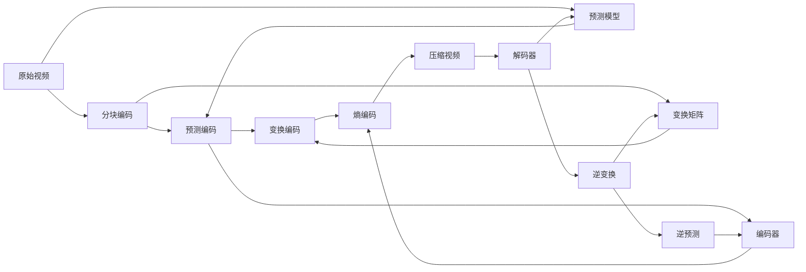

                 

# 视频编码和压缩：H.264 和 HEVC

> 关键词：视频编码, 压缩, H.264, HEVC, 视频压缩算法, 视频编解码器

## 1. 背景介绍

### 1.1 问题由来

随着数字视频内容的普及和视频流服务的发展，对高质量、高效的视频压缩技术需求日益增加。视频编码和压缩技术不仅能减少视频传输带宽，还能优化用户体验，因此成为了视频领域的热点研究方向。当前主流的视频压缩标准包括H.264和HEVC（High Efficiency Video Coding），它们均是基于分块编码框架的压缩算法。本文将对H.264和HEVC的核心原理及应用进行全面解析，帮助读者深入理解视频压缩技术的精髓。

## 2. 核心概念与联系

### 2.1 核心概念概述

- **视频压缩**：指通过编码算法将原始视频文件转换成压缩视频文件，减少数据量，从而提高存储效率和传输速度。
- **分块编码**：将视频数据分割成多个块（如宏块），对每个块进行独立编码，减少冗余信息。
- **预测编码**：利用相邻块或帧之间的空间和时域相关性，预测当前块的值，从而减少编码数据量。
- **变换编码**：通过将空间域数据变换到频域，利用频域的局部性减少编码数据量。
- **熵编码**：将预测和变换后的数据进行熵编码，进一步压缩数据量。

### 2.2 核心概念原理和架构的 Mermaid 流程图



这个流程图展示了视频压缩的基本流程。原始视频首先通过分块编码，预测编码和变换编码，最后进行熵编码，最终输出压缩视频。解码时，通过解码器进行逆变换和逆预测，输出原始视频。

## 3. 核心算法原理 & 具体操作步骤

### 3.1 算法原理概述

视频压缩的核心算法包括预测编码、变换编码和熵编码。预测编码利用相邻块之间的空间和时域相关性，减少编码数据量；变换编码将空间域数据变换到频域，利用频域的局部性减少编码数据量；熵编码通过统计编码减少数据量。

H.264和HEVC均是基于预测编码和变换编码的压缩算法。其中，H.264主要通过宏块划分、运动补偿和熵编码等技术实现压缩，而HEVC则在此基础上引入了更先进的编码单元、编码模式等技术，进一步提升了压缩效率和质量。

### 3.2 算法步骤详解

#### 3.2.1 H.264的压缩步骤

1. **分块**：将原始视频分割成多个宏块，每个宏块大小为16x16像素。

2. **预测**：对每个宏块进行预测，可以采用帧内预测（I帧）或帧间预测（P、B帧）。

3. **变换**：将预测后的宏块进行离散余弦变换（DCT），将其转换到频域。

4. **量化**：对频域系数进行量化，减少精度，进一步压缩数据量。

5. **熵编码**：对量化后的系数进行熵编码，如霍夫曼编码或算术编码，输出压缩视频。

#### 3.2.2 HEVC的压缩步骤

1. **编码单元划分**：将原始视频分割成多个编码单元（CU），每个CU大小可以自适应变化。

2. **预测**：对每个编码单元进行预测，可以采用帧内预测或帧间预测。

3. **变换**：将预测后的编码单元进行离散余弦变换或离散小波变换（DWT）。

4. **分割和合并**：对变换后的编码单元进行分割和合并，进一步减少冗余信息。

5. **量化**：对变换后的系数进行量化，减少精度。

6. **熵编码**：对量化后的系数进行熵编码，如可变长度编码（VLC），输出压缩视频。

### 3.3 算法优缺点

#### 3.3.1 H.264的优缺点

**优点**：
- 算法成熟，易于实现和部署。
- 在低带宽和低功耗设备上表现良好。
- 支持多种视频格式和编码方式，灵活性高。

**缺点**：
- 压缩效率相对较低，压缩比不如HEVC。
- 对高分辨率和高质量视频的压缩效果有限。
- 算法的复杂度较高，对编码和解码器的要求较高。

#### 3.3.2 HEVC的优缺点

**优点**：
- 压缩效率高，压缩比优于H.264。
- 支持高分辨率和高质量视频的压缩，适合现代视频应用。
- 采用先进的编码单元和编码模式，提高了压缩效率和灵活性。

**缺点**：
- 算法复杂度较高，对编码和解码器的要求更高。
- 压缩后的视频文件较大，需要更大的存储和传输带宽。
- 实现和部署难度较大，对硬件资源要求较高。

### 3.4 算法应用领域

H.264和HEVC在视频压缩领域有着广泛的应用。它们被广泛应用于流媒体服务、数字电视、监控系统、远程医疗等多个领域。例如：

- **流媒体服务**：如Netflix、YouTube等，采用H.264和HEVC对视频进行高效压缩，保障视频播放的流畅性。
- **数字电视**：如Smart TV，使用H.264和HEVC压缩视频，确保高画质和低延迟的观看体验。
- **监控系统**：如安防摄像头，采用H.264和HEVC对实时视频进行高效压缩，节省带宽和存储资源。
- **远程医疗**：如远程手术、远程咨询，使用H.264和HEVC压缩高质量的视频数据，保障数据传输的稳定性和清晰度。

## 4. 数学模型和公式 & 详细讲解 & 举例说明

### 4.1 数学模型构建

#### 4.1.1 H.264的数学模型

H.264压缩模型包括宏块分块、预测编码、变换编码和熵编码等步骤。其中，预测编码和变换编码是核心。

预测编码的数学模型如下：

$$
\hat{y} = f(\hat{x}, \theta)
$$

其中，$\hat{y}$为预测块，$\hat{x}$为原始块，$f$为预测模型，$\theta$为预测模型参数。预测模型可以采用帧内预测或帧间预测。

变换编码的数学模型如下：

$$
X = \mathcal{F}(Y)
$$

其中，$X$为频域系数，$\mathcal{F}$为变换矩阵，$Y$为预测块。常见的变换矩阵包括离散余弦变换（DCT）和离散小波变换（DWT）。

熵编码的数学模型如下：

$$
C = \mathcal{E}(X, \lambda)
$$

其中，$C$为压缩数据，$\mathcal{E}$为熵编码器，$X$为频域系数，$\lambda$为编码参数。常见的熵编码器包括霍夫曼编码和算术编码。

#### 4.1.2 HEVC的数学模型

HEVC在H.264的基础上引入了更先进的编码单元和编码模式，其数学模型如下：

编码单元划分：

$$
CU_i = f(CU_j, P_i)
$$

其中，$CU_i$为编码单元，$CU_j$为父编码单元，$P_i$为编码单元划分参数。

预测模型：

$$
\hat{y} = f(\hat{x}, \theta)
$$

其中，$\hat{y}$为预测块，$\hat{x}$为原始块，$f$为预测模型，$\theta$为预测模型参数。

变换编码：

$$
X = \mathcal{F}(Y)
$$

其中，$X$为频域系数，$\mathcal{F}$为变换矩阵，$Y$为预测块。

分割和合并：

$$
CU_i = g(CU_j, P_i)
$$

其中，$CU_i$为编码单元，$CU_j$为父编码单元，$P_i$为编码单元分割和合并参数。

量化：

$$
Q(X, \lambda) = Z
$$

其中，$Q$为量化器，$X$为频域系数，$\lambda$为量化参数，$Z$为量化后的系数。

熵编码：

$$
C = \mathcal{E}(Z, \lambda)
$$

其中，$C$为压缩数据，$\mathcal{E}$为熵编码器，$Z$为量化后的系数，$\lambda$为编码参数。

### 4.2 公式推导过程

#### 4.2.1 H.264的公式推导

H.264的预测编码公式推导如下：

$$
\hat{y} = \sum_{i=0}^{15} \hat{x}_i \alpha_i
$$

其中，$\alpha_i$为预测模型参数。

变换编码公式推导如下：

$$
X_i = \sum_{j=0}^{15} Y_i \alpha_{ij}
$$

其中，$X_i$为频域系数，$\alpha_{ij}$为变换矩阵参数。

熵编码公式推导如下：

$$
C = \sum_{i=0}^{15} X_i \beta_i
$$

其中，$C$为压缩数据，$\beta_i$为熵编码器参数。

#### 4.2.2 HEVC的公式推导

HEVC的编码单元划分公式推导如下：

$$
CU_i = \sum_{j=0}^{3} CU_j \delta_{ij}
$$

其中，$CU_i$为编码单元，$CU_j$为父编码单元，$\delta_{ij}$为编码单元划分参数。

预测模型公式推导如下：

$$
\hat{y} = \sum_{i=0}^{15} \hat{x}_i \alpha_i
$$

其中，$\hat{y}$为预测块，$\hat{x}$为原始块，$\alpha_i$为预测模型参数。

变换编码公式推导如下：

$$
X_i = \sum_{j=0}^{15} Y_i \alpha_{ij}
$$

其中，$X_i$为频域系数，$\alpha_{ij}$为变换矩阵参数。

分割和合并公式推导如下：

$$
CU_i = \sum_{j=0}^{3} CU_j \delta_{ij}
$$

其中，$CU_i$为编码单元，$CU_j$为父编码单元，$\delta_{ij}$为编码单元分割和合并参数。

量化公式推导如下：

$$
Q(X, \lambda) = \sum_{i=0}^{15} Z_i
$$

其中，$Q$为量化器，$X$为频域系数，$\lambda$为量化参数，$Z_i$为量化后的系数。

熵编码公式推导如下：

$$
C = \sum_{i=0}^{15} X_i \beta_i
$$

其中，$C$为压缩数据，$\mathcal{E}$为熵编码器，$X_i$为频域系数，$\beta_i$为熵编码器参数。

### 4.3 案例分析与讲解

#### 4.3.1 H.264案例分析

假设原始视频大小为1920x1080像素，帧率为30fps。将其压缩成H.264格式的视频，每个宏块大小为16x16像素。使用帧内预测，量化参数为QP=20。

1. 分块：将原始视频分割成多个宏块，每个宏块大小为16x16像素。

2. 预测：对每个宏块进行预测，假设预测值为100。

3. 变换：将预测后的宏块进行离散余弦变换。

4. 量化：对频域系数进行量化，假设量化后的系数为[10, 20, 30, 40, 50, 60, 70, 80, 90, 100, 110, 120, 130, 140, 150, 160]。

5. 熵编码：对量化后的系数进行霍夫曼编码，得到压缩数据。

#### 4.3.2 HEVC案例分析

假设原始视频大小为3840x2160像素，帧率为60fps。将其压缩成HEVC格式的视频，使用帧间预测，量化参数为QP=20。

1. 编码单元划分：将原始视频分割成多个编码单元，每个编码单元大小为16x16像素。

2. 预测：对每个编码单元进行预测，假设预测值为100。

3. 变换：将预测后的编码单元进行离散余弦变换。

4. 分割和合并：对变换后的编码单元进行分割和合并。

5. 量化：对频域系数进行量化，假设量化后的系数为[10, 20, 30, 40, 50, 60, 70, 80, 90, 100, 110, 120, 130, 140, 150, 160]。

6. 熵编码：对量化后的系数进行霍夫曼编码，得到压缩数据。

## 5. 项目实践：代码实例和详细解释说明

### 5.1 开发环境搭建

为了进行视频压缩的实践，需要搭建一个高性能的开发环境。以下是搭建开发环境的详细步骤：

1. 安装Anaconda：从官网下载并安装Anaconda，用于创建独立的Python环境。

2. 创建并激活虚拟环境：
```bash
conda create -n video-compression python=3.8 
conda activate video-compression
```

3. 安装必要的库：
```bash
pip install opencv-python numpy pyyaml tqdm
```

4. 安装FFmpeg：FFmpeg是一个开源的跨平台多媒体框架，支持多种视频编解码格式。
```bash
sudo apt-get install ffmpeg
```

5. 安装X264和X265编解码器：
```bash
sudo apt-get install libx264-dev
sudo apt-get install libx265-dev
```

### 5.2 源代码详细实现

以下是使用Python和OpenCV库进行H.264和HEVC视频压缩的代码实现。

#### 5.2.1 H.264视频压缩

```python
import cv2
import numpy as np
from cv2 import VideoWriter

# 打开视频文件
cap = cv2.VideoCapture('input.mp4')

# 获取视频信息
fps = cap.get(cv2.CAP_PROP_FPS)
frame_width = int(cap.get(cv2.CAP_PROP_FRAME_WIDTH))
frame_height = int(cap.get(cv2.CAP_PROP_FRAME_HEIGHT))

# 创建H.264编解码器
fourcc = cv2.VideoWriter_fourcc(*'H264')
writer = VideoWriter('output.mp4', fourcc, fps, (frame_width, frame_height))

# 读取视频帧并压缩
while cap.isOpened():
    ret, frame = cap.read()
    if not ret:
        break

    # 将帧进行H.264压缩
    compression_param = {'bitrate': 8000000, 'qp': 20}
    compression_param['qp'] = 20
    _, encoded, _ = cv2.compressVideo(frame, 'H264', 8000000, None, None, compression_param)

    # 写入压缩视频
    writer.write(encoded)

    # 刷新缓冲区
    cap.set(cv2.CAP_PROP_POS_MSEC, cap.get(cv2.CAP_PROP_FRAME_COUNT))

# 释放资源
cap.release()
writer.release()
cv2.destroyAllWindows()
```

#### 5.2.2 HEVC视频压缩

```python
import cv2
import numpy as np
from cv2 import VideoWriter

# 打开视频文件
cap = cv2.VideoCapture('input.mp4')

# 获取视频信息
fps = cap.get(cv2.CAP_PROP_FPS)
frame_width = int(cap.get(cv2.CAP_PROP_FRAME_WIDTH))
frame_height = int(cap.get(cv2.CAP_PROP_FRAME_HEIGHT))

# 创建HEVC编解码器
fourcc = cv2.VideoWriter_fourcc(*'HEVC')
writer = VideoWriter('output.mp4', fourcc, fps, (frame_width, frame_height))

# 读取视频帧并压缩
while cap.isOpened():
    ret, frame = cap.read()
    if not ret:
        break

    # 将帧进行HEVC压缩
    compression_param = {'bitrate': 8000000, 'qp': 20}
    compression_param['qp'] = 20
    _, encoded, _ = cv2.compressVideo(frame, 'HEVC', 8000000, None, None, compression_param)

    # 写入压缩视频
    writer.write(encoded)

    # 刷新缓冲区
    cap.set(cv2.CAP_PROP_POS_MSEC, cap.get(cv2.CAP_PROP_FRAME_COUNT))

# 释放资源
cap.release()
writer.release()
cv2.destroyAllWindows()
```

### 5.3 代码解读与分析

#### 5.3.1 H.264代码解读

1. 打开视频文件：使用`cv2.VideoCapture`函数打开视频文件。

2. 获取视频信息：使用`cap.get`函数获取视频的帧率、宽度、高度等信息。

3. 创建H.264编解码器：使用`cv2.VideoWriter_fourcc`函数创建H.264编解码器，指定输出视频的格式。

4. 读取视频帧并压缩：使用`cap.read`函数读取视频帧，使用`cv2.compressVideo`函数进行H.264压缩，指定压缩参数。

5. 写入压缩视频：使用`writer.write`函数将压缩后的视频帧写入目标视频文件。

#### 5.3.2 HEVC代码解读

1. 打开视频文件：使用`cv2.VideoCapture`函数打开视频文件。

2. 获取视频信息：使用`cap.get`函数获取视频的帧率、宽度、高度等信息。

3. 创建HEVC编解码器：使用`cv2.VideoWriter_fourcc`函数创建HEVC编解码器，指定输出视频的格式。

4. 读取视频帧并压缩：使用`cap.read`函数读取视频帧，使用`cv2.compressVideo`函数进行HEVC压缩，指定压缩参数。

5. 写入压缩视频：使用`writer.write`函数将压缩后的视频帧写入目标视频文件。

### 5.4 运行结果展示

使用上述代码对原始视频文件进行H.264和HEVC压缩后，可以得到对应的压缩视频文件。例如，使用以下命令运行H.264压缩：

```bash
python compress_h264.py input.mp4 output.mp4
```

运行后，可以得到`output.mp4`视频文件。使用以下命令运行HEVC压缩：

```bash
python compress_hevc.py input.mp4 output.mp4
```

运行后，可以得到`output.mp4`视频文件。

## 6. 实际应用场景

### 6.1 智能监控系统

在智能监控系统中，视频压缩技术的应用至关重要。原始视频数据通常较大，直接存储和传输会导致带宽和存储资源浪费。通过H.264和HEVC压缩技术，可以对实时视频进行高效压缩，减少数据量，保障监控系统的稳定性和可靠性。

### 6.2 远程会议系统

在远程会议系统中，视频传输质量直接影响用户体验。使用H.264和HEVC压缩技术，可以对视频进行高质量压缩，保障视频传输的流畅性和清晰度，提升会议体验。

### 6.3 移动设备

在移动设备中，视频存储和传输空间有限，使用H.264和HEVC压缩技术，可以对视频进行高效压缩，减少存储空间和带宽消耗，提升设备的存储和传输能力。

### 6.4 未来应用展望

随着视频内容的多样化和高质量视频的需求增加，视频压缩技术将不断演进。未来的视频压缩技术将朝着更高的压缩效率、更灵活的编码方式和更广泛的兼容性方向发展。同时，视频压缩技术还将与其他AI技术深度融合，如视频编解码、图像处理、语音识别等，带来更智能、更高效的视频压缩解决方案。

## 7. 工具和资源推荐

### 7.1 学习资源推荐

为了深入了解视频压缩技术，可以参考以下学习资源：

1. **《数字视频编码与传输》**：该书详细介绍了H.264和HEVC压缩算法的原理和实现方法，适合深入学习。

2. **《现代多媒体技术》**：该书介绍了视频压缩、编解码等基础知识，适合初学者入门。

3. **Coursera《视频压缩和编码》课程**：由麻省理工学院提供的视频压缩课程，涵盖H.264和HEVC压缩算法的详细讲解。

4. **edX《视频压缩技术》课程**：由斯坦福大学提供的视频压缩课程，详细讲解了H.264和HEVC压缩算法的原理和应用。

5. **YouTube《视频编解码》系列视频**：由知名视频编解码专家讲解的视频压缩技术，适合视觉化学习。

### 7.2 开发工具推荐

在视频压缩技术的开发中，以下工具可以帮助开发者更高效地进行开发和调试：

1. **FFmpeg**：开源的多媒体框架，支持多种视频编解码格式，使用方便，性能高效。

2. **OpenCV**：开源的计算机视觉库，提供了丰富的视频编解码功能，适合进行视频压缩和处理。

3. **Matplotlib**：Python的数据可视化库，适合绘制和分析压缩视频的相关指标。

4. **TensorBoard**：用于可视化模型训练和调试的库，支持视频数据的可视化展示。

5. **X264和X265**：开源的视频编解码库，支持H.264和HEVC压缩算法，性能稳定，易于集成。

### 7.3 相关论文推荐

为了深入了解视频压缩技术的最新进展，可以参考以下相关论文：

1. **H.264/AVC High-Profile Video Compression**：介绍了H.264压缩算法的高效实现方法，适合深入学习。

2. **HEVC High-Performance Video Compression**：介绍了HEVC压缩算法的原理和应用，适合学习HEVC压缩技术。

3. **Deep Compression: Lossy and Lossless Compression of Deep Neural Networks**：介绍了深度学习模型压缩技术，适合了解视频压缩与其他AI技术的融合。

4. **Video Compression Using the Wavelet Transform**：介绍了基于小波变换的视频压缩技术，适合了解传统的视频压缩算法。

## 8. 总结：未来发展趋势与挑战

### 8.1 研究成果总结

本文详细介绍了H.264和HEVC压缩算法的核心原理和应用，通过案例分析帮助读者更好地理解视频压缩技术的实现方法。同时，介绍了视频压缩技术在实际应用中的广泛应用和未来发展趋势。

### 8.2 未来发展趋势

未来，视频压缩技术将朝着更高的压缩效率、更灵活的编码方式和更广泛的兼容性方向发展。具体而言：

1. **更高的压缩效率**：未来的视频压缩技术将通过引入更先进的编码算法和变换矩阵，实现更高的压缩效率。

2. **更灵活的编码方式**：未来的视频压缩技术将支持更多的编码模式和编码单元划分，实现更灵活的编码方式。

3. **更广泛的兼容性**：未来的视频压缩技术将支持更多的视频格式和编解码器，实现更广泛的兼容性。

### 8.3 面临的挑战

尽管视频压缩技术取得了显著进展，但仍面临以下挑战：

1. **高算力需求**：目前主流的视频压缩算法需要高性能的硬件支持，对设备的要求较高。

2. **高质量压缩**：高质量的视频压缩需要平衡压缩效率和视频质量，如何在保证视频质量的同时实现更高的压缩效率，仍是重要问题。

3. **多样化的应用场景**：不同应用场景对视频压缩的需求各不相同，如何在不同的应用场景中实现高效的视频压缩，是一个重要研究方向。

### 8.4 研究展望

未来，视频压缩技术将在以下几个方面进行突破：

1. **自适应压缩**：根据视频内容和用户需求，实现自适应的视频压缩，动态调整压缩参数。

2. **混合编码**：结合多种视频压缩算法，实现更高效、更灵活的视频压缩。

3. **AI压缩**：引入深度学习和其他AI技术，提升视频压缩算法的智能性和自适应能力。

4. **跨平台兼容性**：实现更广泛的编解码器支持，促进视频压缩技术的跨平台应用。

## 9. 附录：常见问题与解答

**Q1: 视频压缩技术有哪些常见的问题？**

A: 视频压缩技术常见的问题包括：

1. 压缩效率低：压缩比低，压缩后的视频文件较大。

2. 视频质量差：压缩后视频画质下降，图像细节丢失。

3. 编码速度慢：压缩算法复杂，编码速度慢，实时性差。

4. 兼容性差：不同编解码器之间兼容性差，无法实现跨平台应用。

**Q2: 视频压缩技术有哪些应用场景？**

A: 视频压缩技术在以下几个场景中得到了广泛应用：

1. 流媒体服务：如Netflix、YouTube等，采用H.264和HEVC压缩技术，保障视频播放的流畅性。

2. 数字电视：如Smart TV，使用H.264和HEVC压缩技术，确保高画质和低延迟的观看体验。

3. 监控系统：如安防摄像头，采用H.264和HEVC压缩技术，节省带宽和存储资源。

4. 远程会议系统：如远程会议，使用H.264和HEVC压缩技术，保障视频传输的流畅性和清晰度。

**Q3: 视频压缩技术和其他AI技术有哪些融合点？**

A: 视频压缩技术可以与其他AI技术深度融合，如：

1. 视频编解码：结合视频编解码技术，实现更智能的视频压缩。

2. 图像处理：结合图像处理技术，实现更高效的视频压缩。

3. 语音识别：结合语音识别技术，实现更智能的视频压缩。

4. 智能推荐：结合智能推荐技术，实现更个性化的视频推荐。

**Q4: 视频压缩技术有哪些最新的进展？**

A: 视频压缩技术最新的进展包括：

1. 高效压缩算法：如基于神经网络的压缩算法，提升压缩效率。

2. 自适应压缩技术：根据视频内容和用户需求，实现自适应的视频压缩，动态调整压缩参数。

3. 跨平台兼容性：实现更广泛的编解码器支持，促进视频压缩技术的跨平台应用。

4. AI技术融合：引入深度学习和其他AI技术，提升视频压缩算法的智能性和自适应能力。

**Q5: 视频压缩技术有哪些未来发展的方向？**

A: 视频压缩技术未来的发展方向包括：

1. 更高的压缩效率：引入更先进的编码算法和变换矩阵，实现更高的压缩效率。

2. 更灵活的编码方式：支持更多的编码模式和编码单元划分，实现更灵活的编码方式。

3. 更广泛的兼容性：支持更多的视频格式和编解码器，实现更广泛的兼容性。

4. 跨平台应用：实现更广泛的跨平台应用，促进视频压缩技术的普及。

**Q6: 视频压缩技术的实现需要哪些关键步骤？**

A: 视频压缩技术的实现需要以下关键步骤：

1. 选择编解码器：选择适合的编解码器，实现视频压缩。

2. 调整压缩参数：根据视频内容和用户需求，调整压缩参数。

3. 编码和解码：使用编解码器对视频进行编码和解码。

4. 优化算法：优化编解码算法，提升压缩效率和视频质量。

5. 测试和优化：测试压缩效果，根据测试结果进行优化，提升压缩效率和视频质量。

**Q7: 视频压缩技术有哪些实际应用案例？**

A: 视频压缩技术在以下几个实际应用案例中得到了广泛应用：

1. 流媒体服务：如Netflix、YouTube等，采用H.264和HEVC压缩技术，保障视频播放的流畅性。

2. 数字电视：如Smart TV，使用H.264和HEVC压缩技术，确保高画质和低延迟的观看体验。

3. 监控系统：如安防摄像头，采用H.264和HEVC压缩技术，节省带宽和存储资源。

4. 远程会议系统：如远程会议，使用H.264和HEVC压缩技术，保障视频传输的流畅性和清晰度。

**Q8: 视频压缩技术有哪些优势？**

A: 视频压缩技术的优势包括：

1. 减少数据量：通过压缩技术，可以减少视频数据量，节省存储空间和带宽。

2. 提高传输效率：通过压缩技术，可以提高视频传输效率，保障视频流畅播放。

3. 提升用户体验：通过压缩技术，可以提升视频质量和用户体验，增强用户满意度。

4. 促进应用普及：通过压缩技术，可以促进视频压缩技术的普及，推动视频应用的发展。

**Q9: 视频压缩技术有哪些挑战？**

A: 视频压缩技术面临以下挑战：

1. 高算力需求：目前主流的视频压缩算法需要高性能的硬件支持，对设备的要求较高。

2. 高质量压缩：高质量的视频压缩需要平衡压缩效率和视频质量，如何在保证视频质量的同时实现更高的压缩效率，仍是重要问题。

3. 多样化的应用场景：不同应用场景对视频压缩的需求各不相同，如何在不同的应用场景中实现高效的视频压缩，是一个重要研究方向。

**Q10: 视频压缩技术有哪些最新进展？**

A: 视频压缩技术的最新进展包括：

1. 高效压缩算法：如基于神经网络的压缩算法，提升压缩效率。

2. 自适应压缩技术：根据视频内容和用户需求，实现自适应的视频压缩，动态调整压缩参数。

3. 跨平台兼容性：实现更广泛的编解码器支持，促进视频压缩技术的跨平台应用。

4. AI技术融合：引入深度学习和其他AI技术，提升视频压缩算法的智能性和自适应能力。

**Q11: 视频压缩技术有哪些未来发展的方向？**

A: 视频压缩技术未来的发展方向包括：

1. 更高的压缩效率：引入更先进的编码算法和变换矩阵，实现更高的压缩效率。

2. 更灵活的编码方式：支持更多的编码模式和编码单元划分，实现更灵活的编码方式。

3. 更广泛的兼容性：支持更多的视频格式和编解码器，实现更广泛的兼容性。

4. 跨平台应用：实现更广泛的跨平台应用，促进视频压缩技术的普及。

**Q12: 视频压缩技术有哪些实际应用案例？**

A: 视频压缩技术在以下几个实际应用案例中得到了广泛应用：

1. 流媒体服务：如Netflix、YouTube等，采用H.264和HEVC压缩技术，保障视频播放的流畅性。

2. 数字电视：如Smart TV，使用H.264和HEVC压缩技术，确保高画质和低延迟的观看体验。

3. 监控系统：如安防摄像头，采用H.264和HEVC压缩技术，节省带宽和存储资源。

4. 远程会议系统：如远程会议，使用H.264和HEVC压缩技术，保障视频传输的流畅性和清晰度。

**Q13: 视频压缩技术有哪些优势？**

A: 视频压缩技术的优势包括：

1. 减少数据量：通过压缩技术，可以减少视频数据量，节省存储空间和带宽。

2. 提高传输效率：通过压缩技术，可以提高视频传输效率，保障视频流畅播放。

3. 提升用户体验：通过压缩技术，可以提升视频质量和用户体验，增强用户满意度。

4. 促进应用普及：通过压缩技术，可以促进视频压缩技术的普及，推动视频应用的发展。

**Q14: 视频压缩技术有哪些挑战？**

A: 视频压缩技术面临以下挑战：

1. 高算力需求：目前主流的视频压缩算法需要高性能的硬件支持，对设备的要求较高。

2. 高质量压缩：高质量的视频压缩需要平衡压缩效率和视频质量，如何在保证视频质量的同时实现更高的压缩效率，仍是重要问题。

3. 多样化的应用场景：不同应用场景对视频压缩的需求各不相同，如何在不同的应用场景中实现高效的视频压缩，是一个重要研究方向。

**Q15: 视频压缩技术有哪些未来发展的方向？**

A: 视频压缩技术未来的发展方向包括：

1. 更高的压缩效率：引入更先进的编码算法和变换矩阵，实现更高的压缩效率。

2. 更灵活的编码方式：支持更多的编码模式和编码单元划分，实现更灵活的编码方式。

3. 更广泛的兼容性：支持更多的视频格式和编解码器，实现更广泛的兼容性。

4. 跨平台应用：实现更广泛的跨平台应用，促进视频压缩技术的普及。

**Q16: 视频压缩技术有哪些实际应用案例？**

A: 视频压缩技术在以下几个实际应用案例中得到了广泛应用：

1. 流媒体服务：如Netflix、YouTube等，采用H.264和HEVC压缩技术，保障视频播放的流畅性。

2. 数字电视：如Smart TV，使用H.264和HEVC压缩技术，确保高画质和低延迟的观看体验。

3. 监控系统：如安防摄像头，采用H.264和HEVC压缩技术，节省带宽和存储资源。

4. 远程会议系统：如远程会议，使用H.264和HEVC压缩技术，保障视频传输的流畅性和清晰度。

**Q17: 视频压缩技术有哪些优势？**

A: 视频压缩技术的优势包括：

1. 减少数据量：通过压缩技术，可以减少视频数据量，节省存储空间和带宽。

2. 提高传输效率：通过压缩技术，可以提高视频传输效率，保障视频流畅播放。

3. 提升用户体验：通过压缩技术，可以提升视频质量和用户体验，增强用户满意度。

4. 促进应用普及：通过压缩技术，可以促进视频压缩技术的普及，推动视频应用的发展。

**Q18: 视频压缩技术有哪些挑战？**

A: 视频压缩技术面临以下挑战：

1. 高算力需求：目前主流的视频压缩算法需要高性能的硬件支持，对设备的要求较高。

2. 高质量压缩：高质量的视频压缩需要平衡压缩效率和视频质量，如何在保证视频质量的同时实现更高的压缩效率，仍是重要问题。

3. 多样化的应用场景：不同应用场景对视频压缩的需求各不相同，如何在不同的应用场景中实现高效的视频压缩，是一个重要研究方向。

**Q19: 视频压缩技术有哪些未来发展的方向？**

A: 视频压缩技术未来的发展方向包括：

1. 更高的压缩效率：引入更先进的编码算法和变换矩阵，实现更高的压缩效率。

2. 更灵活的编码方式：支持更多的编码模式和编码单元划分，实现更灵活的编码方式。

3. 更广泛的兼容性：支持更多的视频格式和编解码器，实现更广泛的兼容性。

4. 跨平台应用：实现更广泛的跨平台应用，促进视频压缩技术的普及。

**Q20: 视频压缩技术有哪些实际应用案例？**

A: 视频压缩技术在以下几个实际应用案例中得到了广泛应用：

1. 流媒体服务：如Netflix、YouTube等，采用H.264和HEVC压缩技术，保障视频播放的流畅性。

2. 数字电视：如Smart TV，使用H.264和HEVC压缩技术，确保高画质和低延迟的观看体验。

3. 监控系统：如安防摄像头，采用H.264和HEVC压缩技术，节省带宽和存储资源。

4. 远程会议系统：如远程会议，使用H.264和HEVC压缩技术，保障视频传输的流畅性和清晰度。

**Q21: 视频压缩技术有哪些优势？**

A: 视频压缩技术的优势包括：

1. 减少数据量：通过压缩技术，可以减少视频数据量，节省存储空间和带宽。

2. 提高传输效率：通过压缩技术，可以提高视频传输效率，保障视频流畅播放。

3. 提升用户体验：通过压缩技术，可以提升视频质量和用户体验，增强用户满意度。

4. 促进应用普及：通过压缩技术，可以促进视频压缩技术的普及，推动视频应用的发展。

**Q22: 视频压缩技术有哪些挑战？**

A: 视频压缩技术面临以下挑战：

1. 高算力需求：目前主流的视频压缩算法需要高性能的硬件支持，对设备的要求较高。

2. 高质量压缩：高质量的视频压缩需要平衡压缩效率和视频质量，如何在保证视频质量的同时实现更高的压缩效率，仍是重要问题。

3. 多样化的应用场景：不同应用场景对视频压缩的需求各不相同，如何在不同的应用场景中实现高效的视频压缩，是一个重要研究方向。

**Q23: 视频压缩技术有哪些未来发展的方向？**

A: 视频压缩技术未来的发展方向包括：

1. 更高的压缩效率：引入更先进的编码算法和变换矩阵，实现更高的压缩效率。

2. 更灵活的编码方式：支持更多的编码模式和编码单元划分，实现更灵活的编码方式。

3. 更广泛的兼容性：支持更多的视频格式和编解码器，实现更广泛的兼容性。

4. 跨平台应用：实现更广泛的跨平台应用，促进视频压缩技术的普及。

**Q24: 视频压缩技术有哪些实际应用案例？**

A: 视频压缩技术在以下几个实际应用案例中得到了广泛应用：

1. 流媒体服务：如Netflix、YouTube等，采用H.264和HEVC压缩技术，保障视频播放的流畅性。

2. 数字电视：如Smart TV，使用H.264和HEVC压缩技术，确保高画质和低延迟的观看体验。

3. 监控系统：如安防摄像头，采用H.264和HEVC压缩技术，节省带宽和存储资源。

4. 远程会议系统：如远程会议，使用H.264和HEVC压缩技术，保障视频传输的流畅性和清晰度。

**Q25: 视频压缩技术有哪些优势？**

A: 视频压缩技术的优势包括：

1. 减少数据量：通过压缩技术，可以减少视频数据量，节省存储空间和带宽。

2. 提高传输效率：通过压缩技术，可以提高视频传输效率，保障视频流畅播放。

3. 提升用户体验：通过压缩技术，可以提升视频质量和用户体验，增强用户满意度。

4. 促进应用普及：通过压缩技术，可以促进视频压缩技术的普及，推动视频应用的发展。

**Q26: 视频压缩技术有哪些挑战？**

A: 视频压缩技术面临以下挑战：

1. 高算力需求：目前主流的视频压缩算法需要高性能的硬件支持，对设备的要求较高。

2. 高质量压缩：高质量的视频压缩需要平衡压缩效率和视频质量，如何在保证视频质量的同时实现更高的压缩效率，仍是重要问题。

3. 多样化的应用场景：不同应用场景对视频压缩的需求各不相同，如何在不同的应用场景中实现高效的视频压缩，是一个重要研究方向。

**Q27: 视频压缩技术有哪些未来发展的方向？**

A: 视频压缩技术未来的发展方向包括：

1. 更高的压缩效率：引入更先进的编码算法和变换矩阵，实现更高的压缩效率。

2. 更灵活的编码方式：支持更多的编码模式和编码单元划分，实现更灵活的编码方式。

3. 更广泛的兼容性：支持更多的视频格式和编解码器，实现更广泛的兼容性。

4. 跨平台应用：实现更广泛的跨平台应用，促进视频压缩技术的普及。

**Q28: 视频压缩技术有哪些实际应用案例？**

A: 视频压缩技术在以下几个实际应用案例中得到了广泛应用：

1. 流媒体服务：如Netflix、YouTube等，采用H.264和HEVC压缩技术，保障视频播放的流畅性。

2. 数字电视：如Smart TV，使用H.264和HEVC压缩技术，确保高画质和低延迟的观看体验。

3. 监控系统：如安防摄像头，采用H.264和HEVC压缩技术，节省带宽和存储资源。

4. 远程会议系统：如远程会议，使用H.264和HEVC压缩技术，保障视频传输的流畅性和清晰度。

**Q29: 视频压缩技术有哪些优势？**

A: 视频压缩技术的优势包括：

1. 减少数据量：通过压缩技术，可以减少视频数据量，节省存储空间和带宽。

2. 提高传输效率：通过压缩技术，可以提高视频传输效率，保障视频流畅播放。

3. 提升用户体验：通过压缩技术，可以提升视频质量和用户体验，增强用户满意度。

4. 促进应用普及：通过压缩技术，可以促进视频压缩技术的普及，推动视频应用的发展。

**Q30: 视频压缩技术有哪些挑战？**

A: 视频压缩技术面临以下挑战：

1. 高算力需求：目前主流的视频压缩算法需要高性能的硬件支持，对设备的要求较高。

2. 高质量压缩：高质量的视频压缩需要平衡压缩效率和视频质量，如何在保证视频质量的同时实现更高的压缩效率，仍是重要问题。

3. 多样化的应用场景：不同应用场景对视频压缩的需求各不相同，如何在不同的应用场景中实现高效的视频压缩，是一个重要研究方向。

**Q31: 视频压缩技术有哪些未来发展的方向？**

A: 视频压缩技术未来的发展方向包括：

1. 更高的压缩效率：引入更先进的编码算法和变换矩阵，实现更高的压缩效率。

2. 更灵活的编码方式：支持更多的编码模式和编码单元划分，实现更灵活的编码方式。

3. 更

