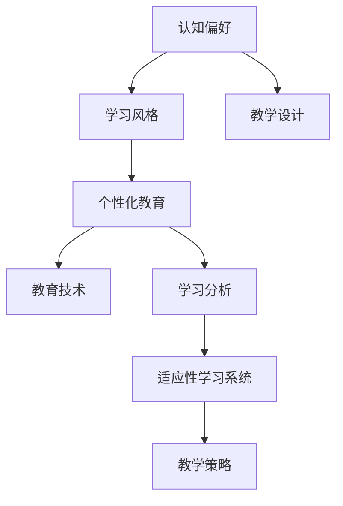

                 

# 认知偏好与学习风格：个性化教育的基础

> 关键词：认知偏好, 学习风格, 个性化教育, 教育技术, 学习分析, 适应性学习系统, 学习差异, 教学设计

## 1. 背景介绍

### 1.1 问题由来
随着信息技术的迅猛发展，教育领域对个性化教育的探索和实践需求愈发迫切。传统的“一刀切”式教育模式难以兼顾学生的个体差异，导致教学效果不理想，学生积极性受挫，甚至出现厌学现象。个性化教育的核心在于根据每个学生的认知偏好和学习风格，量身定制适合其特点的教学方案。

### 1.2 问题核心关键点
个性化教育的核心在于了解学生的认知偏好和学习风格，并据此设计教学策略。认知偏好和学习风格是每个学生固有的学习倾向，如视觉、听觉、动手等；而学习风格则包括了主动学习与被动学习、独立学习与合作学习等。

## 2. 核心概念与联系

### 2.1 核心概念概述

为更好地理解个性化教育，我们先介绍几个关键概念：

- **认知偏好**：指学生在获取和处理信息时的自然倾向，如视觉、听觉、动手等。
- **学习风格**：指学生学习时的行为模式，包括主动学习与被动学习、独立学习与合作学习等。
- **个性化教育**：以学生为学习主体，根据其认知偏好和学习风格，量身定制个性化教学方案的教育模式。
- **教育技术**：运用信息技术支持个性化教育的技术手段，如在线学习平台、自适应学习系统等。
- **学习分析**：通过数据分析，了解学生学习行为和效果，据此调整教学策略的方法。
- **适应性学习系统**：根据学生的学习数据动态调整教学内容和方式的智能学习系统。

这些核心概念之间的关系可以用以下Mermaid流程图来展示：



这个流程图展示了一系列核心概念的逻辑关系：

1. 认知偏好和学习风格是学生的固有倾向。
2. 个性化教育以认知偏好和学习风格为基础，设计符合学生特点的教学方案。
3. 教育技术支持个性化教育的实施。
4. 学习分析通过数据分析改进教学策略。
5. 适应性学习系统根据学生数据动态调整教学内容和方法。
6. 教学设计结合上述各项因素，具体实施个性化教学。

## 3. 核心算法原理 & 具体操作步骤
### 3.1 算法原理概述

个性化教育的算法原理主要基于学生学习数据的收集和分析，结合认知心理学和学习理论，设计出适应用户特点的教学策略。核心流程包括：

1. **学生信息采集**：通过问卷调查、心理测试等方式收集学生的认知偏好和学习风格数据。
2. **个性化模型构建**：建立个性化学习模型，根据学生的认知偏好和学习风格预测适合的教学内容和方法。
3. **适应性教学设计**：根据个性化模型设计个性化教学方案，并在实际教学中动态调整。
4. **学习效果评估**：通过学习分析技术，持续监控学生的学习效果，及时调整教学策略。

### 3.2 算法步骤详解

以下是个性化教育算法的主要步骤：

**Step 1: 数据采集与预处理**

- 设计问卷或心理测试题目，采集学生的认知偏好和学习风格数据。
- 对采集到的数据进行预处理，包括数据清洗、标准化等。

**Step 2: 建立个性化学习模型**

- 选择合适的算法，如决策树、神经网络等，建立预测学生认知偏好和学习风格的模型。
- 通过大量标注数据训练模型，并使用交叉验证等方法评估模型性能。

**Step 3: 设计个性化教学策略**

- 根据个性化模型的输出，设计个性化的教学方案，如选择适合学生的学习资源、制定教学进度等。
- 结合教学设计原则，如分层教学、差异化教学等，实施教学策略。

**Step 4: 适应性教学实施**

- 在实际教学过程中，根据学生反馈和实时数据，动态调整教学内容和方式。
- 通过自适应学习系统，实现自动化的教学调整，提高教学效果。

**Step 5: 学习效果评估与反馈**

- 利用学习分析技术，收集学生的学习行为数据，如学习时间、完成情况等。
- 通过数据分析，评估学生的学习效果，识别存在的问题。
- 根据评估结果，及时调整教学策略，形成良性循环。

### 3.3 算法优缺点

个性化教育的算法具有以下优点：

- **提高学习效果**：通过个性化教学，更好地满足学生需求，提升学习效果。
- **适应性强**：根据学生的特点动态调整教学策略，增强教学的灵活性。
- **数据驱动**：基于数据分析设计教学方案，减少主观因素影响。

但同时也存在以下缺点：

- **数据隐私**：收集和处理学生数据可能涉及隐私问题，需加强数据保护。
- **模型复杂性**：构建个性化模型需大量标注数据和算法支持，实施成本较高。
- **教师培训**：个性化教育需要教师具备一定的技术能力和数据分析能力，培训成本较高。

### 3.4 算法应用领域

个性化教育算法主要应用于以下领域：

- **在线教育平台**：利用个性化算法优化教学资源推荐、作业布置等，提升在线学习效果。
- **智能辅导系统**：根据学生的学习数据，实时调整辅导策略，提高辅导效果。
- **企业培训**：通过个性化学习，提升员工的学习效率和培训效果。
- **游戏化学习**：利用个性化算法设计适应不同玩家的学习游戏，提高学习体验。
- **学术研究**：研究个性化教育的理论和实践，推动教育技术的发展。

## 4. 数学模型和公式 & 详细讲解 & 举例说明

### 4.1 数学模型构建

为了更好地描述个性化教育算法，我们引入一个简单的数学模型：

假设学生有 $n$ 种认知偏好，每种偏好对应的权重为 $w_i$，且 $w_i \in [0,1]$，总和为1。学生学习风格的类型为 $m$，每种风格对应的权重为 $w_j$，且 $w_j \in [0,1]$，总和为1。

个性化教育模型 $M$ 可以表示为：

$$
M = \sum_{i=1}^{n} w_i P_i + \sum_{j=1}^{m} w_j S_j
$$

其中 $P_i$ 为认知偏好对应的教学策略集合，$S_j$ 为学习风格对应的教学策略集合。

### 4.2 公式推导过程

以决策树算法为例，我们推导一下如何根据学生认知偏好和学习风格，选择最佳教学策略：

1. 首先，收集学生 $x_1, x_2, ..., x_n$ 的认知偏好数据，以及 $y_1, y_2, ..., y_m$ 的学习风格数据。
2. 构建决策树模型，根据已知数据划分教学策略，构建模型 $T$：

$$
T = \{(r_1, P_{r_1}), (r_2, P_{r_2}), ..., (r_k, P_{r_k})\}
$$

其中 $r_i$ 为决策节点，$P_{r_i}$ 为对应的教学策略集合。

3. 通过训练数据对模型 $T$ 进行训练，得到最佳决策节点 $r^*$：

$$
r^* = \mathop{\arg\min}_{r} \mathcal{L}(T, x)
$$

其中 $\mathcal{L}$ 为损失函数。

4. 根据最优决策节点 $r^*$，确定最佳教学策略 $P_{r^*}$，并应用于实际教学。

### 4.3 案例分析与讲解

假设一个学生偏好视觉学习，学习风格为主动学习。根据上述模型，设计其个性化教学方案：

1. 认知偏好 $P$ 为视觉学习，对应的教学策略集合为 $\{策略1, 策略2, ..., 策略m\}$。
2. 学习风格 $S$ 为主动学习，对应的教学策略集合为 $\{策略1', 策略2', ..., 策略n'\}$。
3. 利用决策树模型，选择最佳策略节点为 $r_1$，对应的教学策略集合为 $\{策略1, 策略2, ..., 策略n\}$。
4. 最终教学方案为 $P_{r_1} = \{策略1, 策略2, ..., 策略n\} \cup \{策略1', 策略2', ..., 策略n'\}$。

## 5. 项目实践：代码实例和详细解释说明

### 5.1 开发环境搭建

在进行个性化教育算法实践前，我们需要准备好开发环境。以下是使用Python进行Scikit-learn开发的环境配置流程：

1. 安装Anaconda：从官网下载并安装Anaconda，用于创建独立的Python环境。

2. 创建并激活虚拟环境：
```bash
conda create -n personalize-env python=3.8 
conda activate personalize-env
```

3. 安装Scikit-learn：
```bash
conda install scikit-learn
```

4. 安装各类工具包：
```bash
pip install numpy pandas scikit-learn matplotlib tqdm jupyter notebook ipython
```

完成上述步骤后，即可在`personalize-env`环境中开始个性化教育算法的开发。

### 5.2 源代码详细实现

下面是一个基于Scikit-learn的决策树算法，实现学生认知偏好和学习风格的个性化教育模型：

```python
from sklearn.tree import DecisionTreeClassifier
from sklearn.model_selection import train_test_split
from sklearn.metrics import accuracy_score
import pandas as pd

# 读取学生数据
data = pd.read_csv('student_data.csv')

# 分割数据集为训练集和测试集
X_train, X_test, y_train, y_test = train_test_split(data[['cognitive_preference', 'learning_style']], data['teaching_strategy'], test_size=0.2, random_state=42)

# 创建决策树模型
clf = DecisionTreeClassifier()

# 训练模型
clf.fit(X_train, y_train)

# 预测测试集结果
y_pred = clf.predict(X_test)

# 计算准确率
accuracy = accuracy_score(y_test, y_pred)
print('Accuracy:', accuracy)
```

在这个代码实现中，我们使用了Scikit-learn的决策树算法，通过学生认知偏好和学习风格数据，训练个性化教育模型，并评估模型性能。

### 5.3 代码解读与分析

让我们再详细解读一下关键代码的实现细节：

**数据读取与分割**：
- 使用Pandas库读取学生数据，存储为DataFrame对象。
- 使用train_test_split方法，将数据集分为训练集和测试集。

**模型创建与训练**：
- 创建决策树分类器模型。
- 使用训练集数据训练模型，生成决策树。

**预测与评估**：
- 使用测试集数据进行模型预测。
- 计算预测结果的准确率。

可以看到，Scikit-learn提供了丰富的机器学习算法和工具，使得个性化教育算法的开发变得相对简单高效。

## 6. 实际应用场景

### 6.1 在线教育平台

在线教育平台可以利用个性化教育算法优化教学资源推荐、作业布置等，提升在线学习效果。具体实现可以包括以下几个方面：

1. 学生注册时，采集其认知偏好和学习风格数据，并建立个性化模型。
2. 根据学生的个性化模型，推荐适合的学习资源和作业布置。
3. 实时监控学生的学习数据，调整教学策略。
4. 利用学习分析技术，评估学习效果，持续改进教学方案。

### 6.2 智能辅导系统

智能辅导系统可以根据学生的学习数据，实时调整辅导策略，提高辅导效果。具体实现可以包括以下几个方面：

1. 采集学生学习过程中的数据，如学习时间、完成情况等。
2. 利用个性化教育算法，生成适应学生的辅导策略。
3. 实时调整辅导内容和方法，根据学生反馈和表现，优化辅导效果。
4. 通过学习分析技术，评估辅导效果，不断改进辅导策略。

### 6.3 企业培训

企业培训可以利用个性化教育算法提升员工的学习效率和培训效果。具体实现可以包括以下几个方面：

1. 采集员工的学习行为数据，如学习时间、测试成绩等。
2. 利用个性化教育算法，设计适应员工的培训方案。
3. 实时调整培训内容和方式，根据员工反馈和表现，优化培训效果。
4. 通过学习分析技术，评估培训效果，持续改进培训方案。

### 6.4 游戏化学习

游戏化学习可以利用个性化教育算法设计适应不同玩家的学习游戏，提高学习体验。具体实现可以包括以下几个方面：

1. 采集玩家的游戏行为数据，如游戏时间、成绩等。
2. 利用个性化教育算法，生成适应玩家的教学策略。
3. 实时调整游戏内容和方法，根据玩家反馈和表现，优化游戏体验。
4. 通过学习分析技术，评估游戏效果，持续改进游戏设计。

## 7. 工具和资源推荐

### 7.1 学习资源推荐

为了帮助开发者系统掌握个性化教育算法的理论基础和实践技巧，这里推荐一些优质的学习资源：

1. **《个性化教育技术》**：一本深入浅出地介绍了个性化教育算法和实践的书籍，涵盖了从理论到应用的全方位内容。
2. **《机器学习》**：斯坦福大学开设的机器学习课程，介绍了机器学习的基本概念和算法，包括决策树、神经网络等。
3. **Coursera上的《数据科学》课程**：提供了丰富的数据分析和机器学习课程，涵盖个性化教育算法的各个方面。
4. **Kaggle上的个性化教育数据集**：包含大量学生数据，可以用于实践个性化教育算法的开发和测试。
5. **GitHub上的个性化教育项目**：提供了多种实现方式的代码样例，可以供开发者参考学习。

通过对这些资源的学习实践，相信你一定能够快速掌握个性化教育算法的精髓，并用于解决实际的教育问题。

### 7.2 开发工具推荐

高效的开发离不开优秀的工具支持。以下是几款用于个性化教育算法开发的常用工具：

1. **Scikit-learn**：Python中的机器学习库，提供了丰富的算法和工具，支持决策树、神经网络等。
2. **TensorFlow**：谷歌开发的深度学习框架，支持复杂的模型结构和计算图，适合大规模工程应用。
3. **PyTorch**：Facebook开发的深度学习框架，支持动态计算图，适合快速迭代研究。
4. **Jupyter Notebook**：用于编写和运行Python代码的交互式开发环境，适合研究开发和数据可视化。
5. **MATLAB**：强大的数学计算和可视化工具，支持丰富的机器学习和数据分析算法。

合理利用这些工具，可以显著提升个性化教育算法的开发效率，加快创新迭代的步伐。

### 7.3 相关论文推荐

个性化教育算法的发展源于学界的持续研究。以下是几篇奠基性的相关论文，推荐阅读：

1. **《基于数据驱动的个性化学习系统》**：研究了如何利用学生数据设计个性化教学方案，提升学习效果。
2. **《适应性学习系统综述》**：介绍了多种适应性学习系统的实现方法和效果评估，为个性化教育提供了理论基础。
3. **《学习分析技术综述》**：总结了学习分析的各类方法和应用，提供了丰富的数据分析手段。
4. **《基于机器学习的个性化教育算法》**：介绍了机器学习在个性化教育中的应用，包括决策树、神经网络等算法。
5. **《智能辅导系统的设计与实现》**：介绍了智能辅导系统的开发过程和效果评估方法，为个性化教育提供了实践参考。

这些论文代表了个性化教育算法的最新进展，通过学习这些前沿成果，可以帮助研究者把握学科前进方向，激发更多的创新灵感。

## 8. 总结：未来发展趋势与挑战

### 8.1 总结

本文对个性化教育算法进行了全面系统的介绍。首先阐述了个性化教育的核心思想和背景，明确了认知偏好和学习风格在个性化教育中的重要作用。其次，从原理到实践，详细讲解了个性化教育算法的数学模型和操作步骤，给出了具体的代码实现。同时，本文还广泛探讨了个性化教育算法在在线教育、智能辅导、企业培训等多个领域的应用前景，展示了个性化教育算法的广阔前景。此外，本文精选了个性化教育算法的各类学习资源，力求为读者提供全方位的技术指引。

通过本文的系统梳理，可以看到，个性化教育算法正在成为教育技术的重要范式，极大地拓展了教育系统的应用边界，催生了更多的落地场景。受益于个性化教育算法的不断演进，未来教育将变得更加智能化、个性化，为学生提供更优质的学习体验。

### 8.2 未来发展趋势

展望未来，个性化教育算法将呈现以下几个发展趋势：

1. **智能化水平的提升**：随着人工智能技术的不断发展，个性化教育算法将进一步智能化，能够自动分析学生数据，生成更精准的教学方案。
2. **多模态融合的深入**：未来的个性化教育算法将更多地融合多模态数据，如视觉、听觉、触觉等，提高对学生的全面了解。
3. **自适应能力的加强**：适应性学习系统将更加智能，能够根据学生的实时反馈动态调整教学策略，提升学习效果。
4. **跨领域应用的扩展**：个性化教育算法将逐步扩展到更多领域，如医疗、企业培训等，为不同行业提供个性化服务。
5. **数据隐私保护的重视**：随着数据安全意识的提高，个性化教育算法将更加重视学生数据的隐私保护，采用差分隐私等技术手段。
6. **学习效果的评估**：未来的个性化教育算法将更加注重学习效果的评估，通过数据驱动的方式，持续改进教学方案。

以上趋势凸显了个性化教育算法的广阔前景。这些方向的探索发展，必将进一步提升教育系统的智能化水平，为学生提供更加个性化的学习体验。

### 8.3 面临的挑战

尽管个性化教育算法已经取得了不小的进展，但在迈向更加智能化、普适化应用的过程中，仍面临诸多挑战：

1. **数据采集的难度**：个性化教育算法需要大量的学生数据，但数据采集和处理成本较高，且可能涉及隐私问题。
2. **模型复杂性**：构建个性化教育模型需要复杂的算法和大量的标注数据，实施成本较高。
3. **技术门槛高**：个性化教育算法需要教师具备一定的技术能力和数据分析能力，培训成本较高。
4. **教学资源的差异**：不同学校和地区可能存在资源差异，个性化教育算法的推广和应用仍需进一步优化。
5. **伦理和公平性**：个性化教育算法可能存在偏见和歧视，需要重视伦理和公平性的问题。

这些挑战需要各方共同努力，通过技术创新和政策引导，逐步克服。

### 8.4 研究展望

面对个性化教育算法所面临的挑战，未来的研究需要在以下几个方面寻求新的突破：

1. **数据隐私保护**：研究差分隐私等技术手段，保护学生数据的隐私和安全。
2. **数据采集和处理**：开发高效、低成本的数据采集和处理工具，降低数据采集的难度和成本。
3. **模型简化和优化**：简化个性化教育算法的模型结构，优化计算效率，降低技术门槛。
4. **跨领域应用**：研究个性化教育算法在更多领域的适用性，推广其应用范围。
5. **伦理和公平性**：引入伦理导向的评估指标，消除算法中的偏见和歧视，确保公平性和公正性。

这些研究方向的探索，必将引领个性化教育算法迈向更高的台阶，为构建智能化、普适化的教育系统铺平道路。面向未来，个性化教育算法还需要与其他教育技术进行更深入的融合，如智能辅导系统、学习分析等，多路径协同发力，共同推动教育技术的进步。只有勇于创新、敢于突破，才能不断拓展教育技术的边界，让个性化教育算法更好地造福学生和社会。

## 9. 附录：常见问题与解答

**Q1：什么是认知偏好和学习风格？**

A: 认知偏好和学习风格是每个学生固有的学习倾向。认知偏好包括视觉、听觉、动手等，而学习风格则包括了主动学习与被动学习、独立学习与合作学习等。了解学生的认知偏好和学习风格，是设计个性化教育方案的基础。

**Q2：如何设计个性化的教学方案？**

A: 设计个性化的教学方案需要了解学生的认知偏好和学习风格。通过问卷调查或心理测试，采集学生的数据，利用决策树等算法，建立个性化模型。根据模型的输出，选择适合的教学策略，设计个性化的教学方案。

**Q3：如何评估个性化教育算法的性能？**

A: 个性化教育算法的性能可以通过学习效果、学生反馈、教学策略调整等多个指标进行评估。利用学习分析技术，收集学生的学习数据，评估个性化教育的效果。根据评估结果，调整教学策略，形成良性循环。

**Q4：个性化教育算法在实际应用中需要注意哪些问题？**

A: 个性化教育算法在实际应用中需要注意以下问题：数据隐私、模型复杂性、技术门槛、教学资源的差异、伦理和公平性等。这些问题需要各方共同努力，通过技术创新和政策引导，逐步克服。

**Q5：如何利用学习分析技术改进个性化教育算法？**

A: 利用学习分析技术，收集学生的学习数据，如学习时间、完成情况、测试成绩等。通过数据分析，评估个性化教育的效果，识别存在的问题。根据评估结果，调整教学策略，持续改进个性化教育算法。

---

作者：禅与计算机程序设计艺术 / Zen and the Art of Computer Programming

