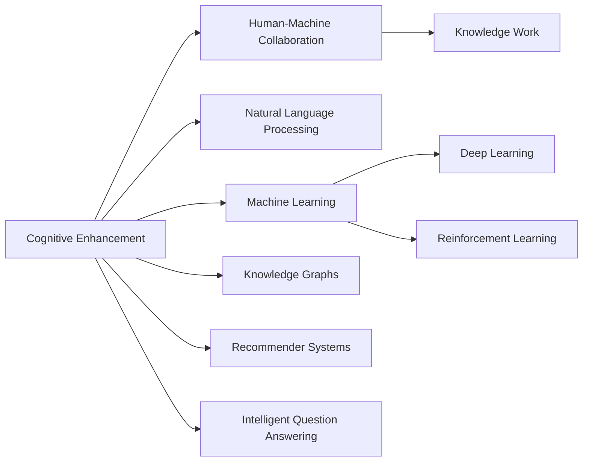

                 

# 认知增强与人机协作：知识工作的未来

> 关键词：认知增强,人机协作,知识工作,自然语言处理(NLP),机器学习,深度学习,强化学习,知识图谱,推荐系统,智能问答

## 1. 背景介绍

### 1.1 问题由来
在信息化快速发展的今天，知识工作者面临着日益复杂的决策压力和信息处理负担。传统的知识管理方法如搜索、目录索引、数据库查询等已不能满足日益增长的信息需求。如何在海量数据中快速准确地找到所需信息，成为众多企业和研究机构面临的共同难题。

为应对这一挑战，人工智能（AI）技术，特别是认知增强与人机协作（Cognitive Augmentation and Human-Machine Collaboration）方法逐渐崭露头角。AI与知识工作者之间的协作，使信息检索、数据分析、决策辅助等知识工作流程得以自动化、智能化，极大地提升了效率和准确性。

认知增强的核心理念是将AI技术与人类认知过程相结合，通过自然语言处理（NLP）、机器学习（ML）、深度学习（DL）、强化学习（RL）、知识图谱（KG）等多种技术手段，实现智能系统和人类在知识工作中的互补。

### 1.2 问题核心关键点
认知增强与人机协作的核心在于如何实现AI与人类在知识处理中的无缝衔接。这涉及到以下几个关键点：

1. **自然语言处理（NLP）**：通过语言模型、语义分析等技术，使AI能够理解人类自然语言，自动处理和生成文本信息。

2. **机器学习（ML）与深度学习（DL）**：通过算法训练，使AI具备从数据中学习的能力，能够根据历史数据和实时数据进行分析和预测。

3. **强化学习（RL）**：通过与环境的交互，使AI能够不断优化策略，适应复杂多变的工作环境。

4. **知识图谱（KG）**：将实体、属性、关系等结构化信息映射到图结构中，使AI能够理解复杂的知识体系，进行知识推理和推理验证。

5. **推荐系统**：利用用户历史行为数据和实时交互数据，推荐用户可能感兴趣的信息和内容。

6. **智能问答**：通过语义理解，回答用户提出的各种问题，提供即时的信息支持。

这些技术相互交织，形成了一个完整的认知增强框架，帮助知识工作者高效地完成信息检索、决策辅助、知识管理和创新研发等工作。

### 1.3 问题研究意义
研究认知增强与人机协作的方法，对于提升知识工作者的信息处理能力，加速信息驱动型行业的发展，具有重要意义：

1. **提升效率**：通过自动化、智能化的方法，将人类从繁琐的信息检索和分析中解放出来，使知识工作者能够集中精力进行决策和创新。

2. **增强准确性**：利用AI的精确计算和推理能力，减少人为错误，提高决策和分析的准确性。

3. **支持决策**：通过智能化的分析和预测，辅助决策者进行科学决策，降低决策风险。

4. **优化工作流程**：将人工智能技术与人类工作流程深度结合，实现信息处理和决策支持的一体化。

5. **促进创新**：为知识工作者提供丰富的信息支持和精准的资源推荐，激发创造力，推动知识创新。

6. **赋能产业发展**：通过AI技术的广泛应用，赋能各个产业，推动产业转型升级，提升整体竞争力。

## 2. 核心概念与联系

### 2.1 核心概念概述

为更好地理解认知增强与人机协作的方法，本节将介绍几个密切相关的核心概念：

- **认知增强（Cognitive Enhancement）**：通过AI技术，增强人类认知能力，提高信息处理和决策的效率和质量。

- **人机协作（Human-Machine Collaboration）**：AI系统与人类工作者共同完成复杂任务，实现1+1>2的效果。

- **知识工作（Knowledge Work）**：依赖于知识和信息处理，需要高度专业化的智力劳动，如研发、咨询、设计等。

- **自然语言处理（NLP）**：使计算机能够理解、处理和生成人类语言，实现信息的自动提取和处理。

- **机器学习（ML）**：通过算法训练，使AI系统能够从数据中学习，提高预测和决策的准确性。

- **深度学习（DL）**：利用多层次神经网络模型，处理复杂数据和任务，提高模型的泛化能力。

- **强化学习（RL）**：通过与环境的交互，使AI系统能够不断优化策略，实现自我学习。

- **知识图谱（KG）**：构建实体、属性和关系构成的知识网络，支持复杂知识的推理和查询。

- **推荐系统**：通过用户行为数据，推荐个性化的内容，提高信息检索的效率和精准度。

- **智能问答**：基于NLP和KG技术，自动回答用户提出的问题，提供即时的信息支持。

这些概念之间的逻辑关系可以通过以下Mermaid流程图来展示：



这个流程图展示了一个从认知增强到人机协作再到知识工作的全链条，突出了各环节之间的紧密联系。

## 3. 核心算法原理 & 具体操作步骤
### 3.1 算法原理概述

认知增强与人机协作的核心在于将AI技术与知识工作者的工作流程深度融合，实现信息处理和决策支持的智能化。其核心算法原理包括但不限于以下几个方面：

1. **自然语言处理（NLP）**：通过语言模型和语义分析，使AI系统能够理解、处理和生成人类语言。常见模型包括BERT、GPT-3、ElasticNet等。

2. **机器学习（ML）与深度学习（DL）**：利用监督学习、无监督学习、半监督学习等方法，训练AI模型，使其能够从数据中学习，预测和推断新数据。常见模型包括线性回归、随机森林、卷积神经网络（CNN）、循环神经网络（RNN）、Transformer等。

3. **强化学习（RL）**：通过与环境的交互，AI系统能够不断优化决策策略，适应复杂多变的工作环境。常见模型包括Q-Learning、策略梯度、Actor-Critic等。

4. **知识图谱（KG）**：将实体、属性、关系等结构化信息映射到图结构中，使AI系统能够理解复杂的知识体系，进行知识推理和推理验证。常见模型包括Neo4j、GraphDB等。

5. **推荐系统**：利用用户历史行为数据和实时交互数据，推荐个性化的内容，提高信息检索的效率和精准度。常见模型包括协同过滤、矩阵分解、深度学习推荐系统等。

6. **智能问答**：基于NLP和KG技术，自动回答用户提出的问题，提供即时的信息支持。常见模型包括ELMo、BERT等。

### 3.2 算法步骤详解

认知增强与人机协作的算法步骤可以分为以下几个环节：

**Step 1: 数据准备**
- 收集与知识工作相关的文本数据，如文档、论文、报告、邮件等。
- 通过NLP技术对文本进行预处理，包括分词、去停用词、词性标注、命名实体识别等。
- 构建知识图谱，将实体、属性和关系进行结构化表示。

**Step 2: 模型训练**
- 根据任务需求，选择合适的AI模型进行训练。
- 利用标注数据对模型进行监督学习或半监督学习，提高模型的准确性和泛化能力。
- 对模型进行调参，如学习率、批大小、优化器等，优化模型的性能。

**Step 3: 模型部署**
- 将训练好的模型部署到生产环境中，如服务器、云平台等。
- 集成模型到知识工作流程中，如信息检索、决策支持、知识管理等。

**Step 4: 持续优化**
- 通过实时数据，持续训练和优化模型，适应环境变化。
- 定期更新知识图谱，保持模型的知识的时效性和准确性。

**Step 5: 用户反馈**
- 收集用户对系统的反馈，如使用体验、问题反馈等。
- 根据用户反馈，不断迭代和优化模型，提升用户体验和系统性能。

### 3.3 算法优缺点

认知增强与人机协作的算法具有以下优点：
1. **提高效率**：通过自动化和智能化的方法，使知识工作者能够快速高效地完成信息检索和数据分析任务。
2. **增强准确性**：利用AI的精确计算和推理能力，减少人为错误，提高决策和分析的准确性。
3. **支持决策**：通过智能化的分析和预测，辅助决策者进行科学决策，降低决策风险。
4. **优化工作流程**：将AI技术与人类工作流程深度结合，实现信息处理和决策支持的一体化。
5. **促进创新**：为知识工作者提供丰富的信息支持和精准的资源推荐，激发创造力，推动知识创新。
6. **赋能产业发展**：通过AI技术的广泛应用，赋能各个产业，推动产业转型升级，提升整体竞争力。

同时，该方法也存在一定的局限性：
1. **数据质量依赖**：模型的性能很大程度上取决于数据的质量和数量，获取高质量数据成本较高。
2. **算法复杂性**：深度学习等技术需要大量的计算资源和专业技能，开发和维护成本较高。
3. **用户体验差异**：不同用户对系统的接受度和适应度不同，需要个性化设计和优化。
4. **隐私与安全**：用户数据隐私和安全问题需要特别注意，避免数据泄露和滥用。
5. **伦理与法律**：AI系统的决策透明度和可解释性需要加强，避免算法的伦理和法律风险。

尽管存在这些局限性，但认知增强与人机协作的算法仍是大数据时代知识工作智能化发展的重要方向。未来相关研究的重点在于如何进一步降低算法复杂性，提高数据质量，增强用户隐私保护，提升决策透明度，同时兼顾可解释性和伦理安全性等因素。

### 3.4 算法应用领域

认知增强与人机协作的算法在多个领域得到了广泛应用，如：

- **金融分析**：通过智能推荐系统，帮助分析师快速定位关键信息，提高分析效率。
- **医疗诊断**：利用智能问答系统，辅助医生快速查询疾病信息和临床指南，提升诊断准确性。
- **市场营销**：通过推荐系统和智能广告投放，提高营销活动的个性化和精准度。
- **教育培训**：通过智能学习系统和知识图谱，提供个性化的学习资源和教学辅助。
- **法律咨询**：通过智能法律问答系统和知识图谱，提供法律查询和案例分析支持。
- **创意设计**：通过智能推荐系统和知识图谱，辅助设计师进行创意灵感激发和知识检索。
- **制造工程**：通过智能生产系统和知识图谱，优化生产流程和设备维护，提高生产效率。

除了上述这些经典应用外，认知增强与人机协作的算法还在智能家居、智慧城市、自动驾驶等多个领域展现出广阔的应用前景。随着AI技术的不断进步和深入研究，认知增强与人机协作必将在更多行业领域带来革命性影响。

## 4. 数学模型和公式 & 详细讲解  
### 4.1 数学模型构建

本节将使用数学语言对认知增强与人机协作的算法过程进行更加严格的刻画。

记知识工作数据为 $D=\{(x_i, y_i)\}_{i=1}^N, x_i \in \mathcal{X}, y_i \in \mathcal{Y}$，其中 $\mathcal{X}$ 为输入空间，$\mathcal{Y}$ 为输出空间。

定义认知增强系统的损失函数为 $\mathcal{L}(f, D)$，表示系统在训练集 $D$ 上的预测错误。在知识工作中，常见的任务包括分类、回归、排序等，因此损失函数的选择也多种多样。例如，对于二分类任务，损失函数可以定义为交叉熵损失函数：

$$
\mathcal{L}(f, D) = -\frac{1}{N}\sum_{i=1}^N [y_i \log f(x_i) + (1-y_i) \log (1-f(x_i))]
$$

其中 $f(x_i)$ 为模型对输入 $x_i$ 的预测概率。

### 4.2 公式推导过程

以下我们以二分类任务为例，推导交叉熵损失函数及其梯度的计算公式。

假设模型 $f(x)$ 在输入 $x$ 上的输出为 $\hat{y}=f(x) \in [0,1]$，表示样本属于正类的概率。真实标签 $y \in \{0,1\}$。则二分类交叉熵损失函数定义为：

$$
\mathcal{L}(f, D) = -\frac{1}{N}\sum_{i=1}^N [y_i \log f(x_i) + (1-y_i) \log (1-f(x_i))]
$$

其梯度为：

$$
\frac{\partial \mathcal{L}(f, D)}{\partial f(x_i)} = -\frac{1}{N} \left( \frac{y_i}{f(x_i)} - \frac{1-y_i}{1-f(x_i)} \right)
$$

在得到损失函数的梯度后，即可带入优化算法（如梯度下降）更新模型参数 $f(x)$，最小化损失函数 $\mathcal{L}(f, D)$。重复上述过程直至收敛，最终得到适应知识工作的最优模型 $f(x)$。

## 5. 项目实践：代码实例和详细解释说明
### 5.1 开发环境搭建

在进行认知增强与人机协作的项目实践前，我们需要准备好开发环境。以下是使用Python进行TensorFlow开发的环境配置流程：

1. 安装Anaconda：从官网下载并安装Anaconda，用于创建独立的Python环境。

2. 创建并激活虚拟环境：
```bash
conda create -n tf-env python=3.8 
conda activate tf-env
```

3. 安装TensorFlow：根据CUDA版本，从官网获取对应的安装命令。例如：
```bash
pip install tensorflow
```

4. 安装各类工具包：
```bash
pip install numpy pandas scikit-learn matplotlib tqdm jupyter notebook ipython
```

完成上述步骤后，即可在`tf-env`环境中开始认知增强与人机协作的实践。

### 5.2 源代码详细实现

这里我们以二分类任务为例，给出使用TensorFlow对DNN模型进行认知增强的PyTorch代码实现。

首先，定义数据处理函数：

```python
import tensorflow as tf
from tensorflow.keras.datasets import mnist

(x_train, y_train), (x_test, y_test) = mnist.load_data()

def process_data(x):
    x = x.reshape(-1, 28*28)
    x = x / 255.0
    return x

x_train = process_data(x_train)
x_test = process_data(x_test)

y_train = tf.keras.utils.to_categorical(y_train)
y_test = tf.keras.utils.to_categorical(y_test)
```

然后，定义模型和优化器：

```python
from tensorflow.keras import layers, models

model = models.Sequential([
    layers.Dense(128, activation='relu'),
    layers.Dense(64, activation='relu'),
    layers.Dense(10, activation='softmax')
])

optimizer = tf.keras.optimizers.Adam(lr=0.001)
```

接着，定义训练和评估函数：

```python
def train_model(model, x_train, y_train, x_test, y_test, epochs=10, batch_size=64):
    model.compile(optimizer=optimizer, loss='categorical_crossentropy', metrics=['accuracy'])
    model.fit(x_train, y_train, epochs=epochs, batch_size=batch_size, validation_data=(x_test, y_test))

    test_loss, test_acc = model.evaluate(x_test, y_test)
    print('Test accuracy:', test_acc)
```

最后，启动训练流程并在测试集上评估：

```python
train_model(model, x_train, y_train, x_test, y_test)
```

以上就是使用TensorFlow对DNN模型进行认知增强的完整代码实现。可以看到，TensorFlow提供了一系列高层次的API，使得模型构建和训练过程变得非常简单。

### 5.3 代码解读与分析

让我们再详细解读一下关键代码的实现细节：

**数据处理函数**：
- 将原始的28x28像素手写数字图片，转换为一个长度为784的一维向量，并进行归一化处理。
- 使用`to_categorical`函数将标签转换为one-hot编码，方便模型的训练和评估。

**模型定义**：
- 使用`Sequential`模型定义神经网络结构。
- 包含3个全连接层，分别使用ReLU激活函数和softmax激活函数。

**优化器定义**：
- 使用Adam优化器，设置学习率为0.001。

**训练函数**：
- 使用`compile`方法配置模型，选择交叉熵损失函数和准确率指标。
- 使用`fit`方法进行模型训练，设置训练轮数为10，批次大小为64。
- 在训练过程中使用测试集进行验证，输出测试集上的准确率。

**训练流程**：
- 定义模型、数据集和优化器。
- 调用`train_model`函数进行模型训练，并在测试集上评估模型性能。

可以看到，TensorFlow的高级API大大简化了模型构建和训练过程，使开发者能够专注于模型的设计和使用，而非底层细节。

当然，实际的系统实现还需考虑更多因素，如模型的保存和部署、超参数的自动搜索、更灵活的任务适配层等。但核心的认知增强与人机协作的微调过程基本与此类似。

## 6. 实际应用场景
### 6.1 智能客服系统

认知增强与人机协作的算法可以广泛应用于智能客服系统的构建。传统客服往往需要配备大量人力，高峰期响应缓慢，且一致性和专业性难以保证。使用认知增强系统，可以7x24小时不间断服务，快速响应客户咨询，用自然流畅的语言解答各类常见问题。

在技术实现上，可以收集企业内部的历史客服对话记录，将问题和最佳答复构建成监督数据，在此基础上对认知增强系统进行训练。训练后的系统能够自动理解用户意图，匹配最合适的答复，甚至在遇到复杂问题时，能够自动调用专家系统或转接到人工客服。如此构建的智能客服系统，能大幅提升客户咨询体验和问题解决效率。

### 6.2 金融舆情监测

金融机构需要实时监测市场舆论动向，以便及时应对负面信息传播，规避金融风险。传统的人工监测方式成本高、效率低，难以应对网络时代海量信息爆发的挑战。基于认知增强的文本分析和情感分析技术，为金融舆情监测提供了新的解决方案。

具体而言，可以收集金融领域相关的新闻、报道、评论等文本数据，并对其进行主题标注和情感标注。在此基础上对认知增强系统进行训练，使其能够自动判断文本属于何种主题，情感倾向是正面、中性还是负面。将训练后的系统应用到实时抓取的网络文本数据，就能够自动监测不同主题下的情感变化趋势，一旦发现负面信息激增等异常情况，系统便会自动预警，帮助金融机构快速应对潜在风险。

### 6.3 个性化推荐系统

当前的推荐系统往往只依赖用户的历史行为数据进行物品推荐，无法深入理解用户的真实兴趣偏好。基于认知增强的个性化推荐系统，可以更好地挖掘用户行为背后的语义信息，从而提供更精准、多样的推荐内容。

在实践中，可以收集用户浏览、点击、评论、分享等行为数据，提取和用户交互的物品标题、描述、标签等文本内容。将文本内容作为模型输入，用户的后续行为（如是否点击、购买等）作为监督信号，在此基础上训练认知增强系统。训练后的系统能够从文本内容中准确把握用户的兴趣点。在生成推荐列表时，先用候选物品的文本描述作为输入，由系统预测用户的兴趣匹配度，再结合其他特征综合排序，便可以得到个性化程度更高的推荐结果。

### 6.4 未来应用展望

随着认知增强与人机协作的算法不断发展，其在更多领域得到应用，为传统行业带来变革性影响。

在智慧医疗领域，基于认知增强的问答系统、病历分析、药物研发等应用将提升医疗服务的智能化水平，辅助医生诊疗，加速新药开发进程。

在智能教育领域，认知增强系统可应用于作业批改、学情分析、知识推荐等方面，因材施教，促进教育公平，提高教学质量。

在智慧城市治理中，认知增强系统可应用于城市事件监测、舆情分析、应急指挥等环节，提高城市管理的自动化和智能化水平，构建更安全、高效的未来城市。

此外，在企业生产、社会治理、文娱传媒等众多领域，基于认知增强的AI应用也将不断涌现，为经济社会发展注入新的动力。相信随着技术的日益成熟，认知增强与人机协作必将在构建人机协同的智能时代中扮演越来越重要的角色。

## 7. 工具和资源推荐
### 7.1 学习资源推荐

为了帮助开发者系统掌握认知增强与人机协作的理论基础和实践技巧，这里推荐一些优质的学习资源：

1. 《深度学习与认知增强》系列博文：由深度学习专家撰写，深入浅出地介绍了认知增强与人机协作的核心概念和前沿技术。

2. 《认知增强与人机协作》课程：北京大学开设的NLP课程，涵盖了认知增强、人机协作、知识表示等重要内容，适合入门和进阶学习。

3. 《认知增强与人机协作：从理论到实践》书籍：系统介绍了认知增强与人机协作的理论基础和实际应用，提供了丰富的案例和代码示例。

4. HuggingFace官方文档：Transformer库的官方文档，提供了海量预训练模型和完整的认知增强开发样例代码，是上手实践的必备资料。

5. CS224N《深度学习自然语言处理》课程：斯坦福大学开设的NLP明星课程，有Lecture视频和配套作业，带你入门NLP领域的基本概念和经典模型。

通过对这些资源的学习实践，相信你一定能够快速掌握认知增强与人机协作的精髓，并用于解决实际的NLP问题。

### 7.2 开发工具推荐

高效的开发离不开优秀的工具支持。以下是几款用于认知增强与人机协作开发的常用工具：

1. PyTorch：基于Python的开源深度学习框架，灵活动态的计算图，适合快速迭代研究。大部分认知增强模型都有PyTorch版本的实现。

2. TensorFlow：由Google主导开发的开源深度学习框架，生产部署方便，适合大规模工程应用。同样有丰富的预训练认知增强模型资源。

3. HuggingFace Transformers库：提供了丰富的预训练模型和认知增强模块，支持PyTorch和TensorFlow，是进行认知增强任务开发的利器。

4. Weights & Biases：模型训练的实验跟踪工具，可以记录和可视化模型训练过程中的各项指标，方便对比和调优。与主流深度学习框架无缝集成。

5. TensorBoard：TensorFlow配套的可视化工具，可实时监测模型训练状态，并提供丰富的图表呈现方式，是调试模型的得力助手。

6. Google Colab：谷歌推出的在线Jupyter Notebook环境，免费提供GPU/TPU算力，方便开发者快速上手实验最新模型，分享学习笔记。

合理利用这些工具，可以显著提升认知增强与人机协作任务的开发效率，加快创新迭代的步伐。

### 7.3 相关论文推荐

认知增强与人机协作的发展源于学界的持续研究。以下是几篇奠基性的相关论文，推荐阅读：

1. Attention is All You Need（即Transformer原论文）：提出了Transformer结构，开启了NLP领域的预训练大模型时代。

2. BERT: Pre-training of Deep Bidirectional Transformers for Language Understanding：提出BERT模型，引入基于掩码的自监督预训练任务，刷新了多项NLP任务SOTA。

3. Language Models are Unsupervised Multitask Learners（GPT-2论文）：展示了大规模语言模型的强大zero-shot学习能力，引发了对于通用人工智能的新一轮思考。

4. Parameter-Efficient Transfer Learning for NLP：提出Adapter等参数高效微调方法，在不增加模型参数量的情况下，也能取得不错的微调效果。

5. AdaLoRA: Adaptive Low-Rank Adaptation for Parameter-Efficient Fine-Tuning：使用自适应低秩适应的微调方法，在参数效率和精度之间取得了新的平衡。

6. AutoML：Automatic Machine Learning：介绍了AutoML技术，探讨了自动调参、自动化模型选择等方法，推动了认知增强与人机协作的自动化进程。

这些论文代表了大语言模型认知增强的发展脉络。通过学习这些前沿成果，可以帮助研究者把握学科前进方向，激发更多的创新灵感。

## 8. 总结：未来发展趋势与挑战

### 8.1 总结

本文对认知增强与人机协作的方法进行了全面系统的介绍。首先阐述了认知增强与人机协作的研究背景和意义，明确了认知增强在提升信息处理和决策效率方面的独特价值。其次，从原理到实践，详细讲解了认知增强与人机协作的数学原理和关键步骤，给出了认知增强任务开发的完整代码实例。同时，本文还广泛探讨了认知增强方法在智能客服、金融舆情、个性化推荐等多个领域的应用前景，展示了认知增强范式的巨大潜力。此外，本文精选了认知增强技术的各类学习资源，力求为读者提供全方位的技术指引。

通过本文的系统梳理，可以看到，认知增强与人机协作技术正在成为知识工作智能化发展的重要方向，极大地提升了信息处理和决策的效率和质量。受益于认知增强技术的发展，知识工作者能够从繁琐的信息检索和分析中解放出来，专注于创造性工作，推动知识工作的数字化转型。未来，随着认知增强技术的不断进步，人机协作将更加紧密，智能系统将在更多领域带来革命性影响。

### 8.2 未来发展趋势

展望未来，认知增强与人机协作技术将呈现以下几个发展趋势：

1. **认知增强范式的拓展**：从传统的文本处理、图像识别等任务，扩展到语音识别、视频处理、智能推荐等更多领域。

2. **人机协作的深度融合**：实现更高层次的认知增强，使AI能够理解复杂的任务目标和约束条件，与人类工作者进行更紧密的协作。

3. **智能系统的普及**：随着算力成本的下降和技术的成熟，智能系统将在更多行业中普及，推动各行各业的数字化转型。

4. **跨领域知识整合**：将知识图谱、逻辑规则等符号化知识与AI模型进行融合，提升系统的知识表示和推理能力。

5. **个性化推荐系统的发展**：利用用户行为数据和上下文信息，实现更精准、实时的推荐，提高用户体验。

6. **知识驱动的智能问答系统**：基于大规模语料库和知识图谱，构建智能问答系统，提升信息检索和知识检索的效率和准确性。

7. **动态环境下的自适应学习**：利用强化学习等技术，使智能系统具备动态环境下的自适应学习能力，保持系统性能的稳定性。

8. **伦理与安全性的增强**：通过算法透明化、用户隐私保护等措施，提升认知增强系统的可解释性和安全性，确保其应用合规。

以上趋势凸显了认知增强与人机协作技术的广阔前景。这些方向的探索发展，必将进一步提升知识工作的智能化水平，为各行各业带来深远影响。

### 8.3 面临的挑战

尽管认知增强与人机协作技术已经取得了瞩目成就，但在迈向更加智能化、普适化应用的过程中，它仍面临着诸多挑战：

1. **数据质量瓶颈**：认知增强系统的性能很大程度上取决于数据的质量和数量，高质量标注数据的获取成本较高，且存在数据偏差和噪声。

2. **算法复杂性**：深度学习等技术需要大量的计算资源和专业技能，开发和维护成本较高。

3. **用户体验差异**：不同用户对系统的接受度和适应度不同，需要个性化设计和优化。

4. **隐私与安全**：用户数据隐私和安全问题需要特别注意，避免数据泄露和滥用。

5. **伦理与法律**：AI系统的决策透明度和可解释性需要加强，避免算法的伦理和法律风险。

6. **计算资源限制**：大规模认知增强模型的训练和推理需要高性能计算资源，对硬件设施要求较高。

7. **多模态数据整合**：跨领域、多模态数据的整合和融合，仍需进一步研究和优化。

8. **知识图谱的构建与维护**：知识图谱的构建和更新需要大量的人工标注和维护工作，成本较高。

尽管存在这些挑战，但认知增强与人机协作技术的进步，必将推动知识工作的智能化发展，为各行各业带来深远影响。相信随着学界和产业界的共同努力，这些挑战终将一一被克服，认知增强与人机协作技术必将在构建人机协同的智能时代中扮演越来越重要的角色。

### 8.4 研究展望

面对认知增强与人机协作所面临的挑战，未来的研究需要在以下几个方面寻求新的突破：

1. **跨模态数据融合**：将文本、图像、语音等多种模态数据进行有效融合，提升认知增强系统的综合能力。

2. **多任务学习**：利用多任务学习技术，在多个任务上进行联合训练，提升系统的泛化能力和效率。

3. **零样本学习和少样本学习**：探索零样本学习、少样本学习等前沿方法，在数据匮乏的情况下，提升认知增强系统的性能。

4. **自适应学习**：利用自适应学习技术，使认知增强系统具备动态环境下的自适应学习能力，保持系统性能的稳定性。

5. **可解释性增强**：通过可解释性技术，提升认知增强系统的透明度和可信度，确保其决策过程可解释、可审计。

6. **隐私保护机制**：开发隐私保护机制，确保用户数据隐私和安全，避免数据泄露和滥用。

7. **伦理与社会责任**：在算法设计和应用中，考虑伦理和社会责任，确保认知增强系统的应用符合道德和法律要求。

这些研究方向的探索，必将引领认知增强与人机协作技术迈向更高的台阶，为知识工作者的智能化发展提供更坚实的基础。面向未来，认知增强与人机协作技术需要与其他人工智能技术进行更深入的融合，如知识表示、因果推理、强化学习等，共同推动认知增强范式的发展。只有勇于创新、敢于突破，才能不断拓展认知增强技术的边界，让人工智能更好地服务于人类社会。

## 9. 附录：常见问题与解答

**Q1：认知增强与人机协作的方法是否适用于所有知识工作场景？**

A: 认知增强与人机协作的方法在大多数知识工作场景上都能取得不错的效果，特别是对于数据量较大的任务。但对于一些特定领域的任务，如医疗、法律等，仅仅依靠通用语料预训练的模型可能难以很好地适应。此时需要在特定领域语料上进一步预训练，再进行微调，才能获得理想效果。此外，对于一些需要时效性、个性化很强的任务，如对话、推荐等，认知增强方法也需要针对性的改进优化。

**Q2：认知增强系统如何进行有效训练？**

A: 认知增强系统的训练需要大量的标注数据，一般通过监督学习或半监督学习的方法，对模型进行优化。训练过程中，需要注意以下几个方面：
1. 选择合适的优化算法，如Adam、SGD等。
2. 设置合适的学习率，避免过拟合或收敛过慢。
3. 使用数据增强技术，扩充训练集。
4. 应用正则化技术，防止过拟合。
5. 使用模型集成技术，提高系统鲁棒性和泛化能力。

**Q3：认知增强系统在实际应用中需要注意哪些问题？**

A: 将认知增强系统应用于实际生产环境，还需要考虑以下因素：
1. 模型裁剪，去除不必要的层和参数，减小模型尺寸，加快推理速度。
2. 量化加速，将浮点模型转为定点模型，压缩存储空间，提高计算效率。
3. 服务化封装，将模型封装为标准化服务接口，便于集成调用。
4. 弹性伸缩，根据请求流量动态调整资源配置，平衡服务质量和成本。
5. 监控告警，实时采集系统指标，设置异常告警阈值，确保服务稳定性。
6. 安全防护，采用访问鉴权、数据脱敏等措施，保障数据和模型安全。

认知增强与人机协作为知识工作智能化发展提供了新的方向，但如何将强大的性能转化为稳定、高效、安全的业务价值，还需要工程实践的不断打磨。相信随着技术的不断进步，认知增强与人机协作必将在更多领域带来革命性影响。

---

作者：禅与计算机程序设计艺术 / Zen and the Art of Computer Programming

