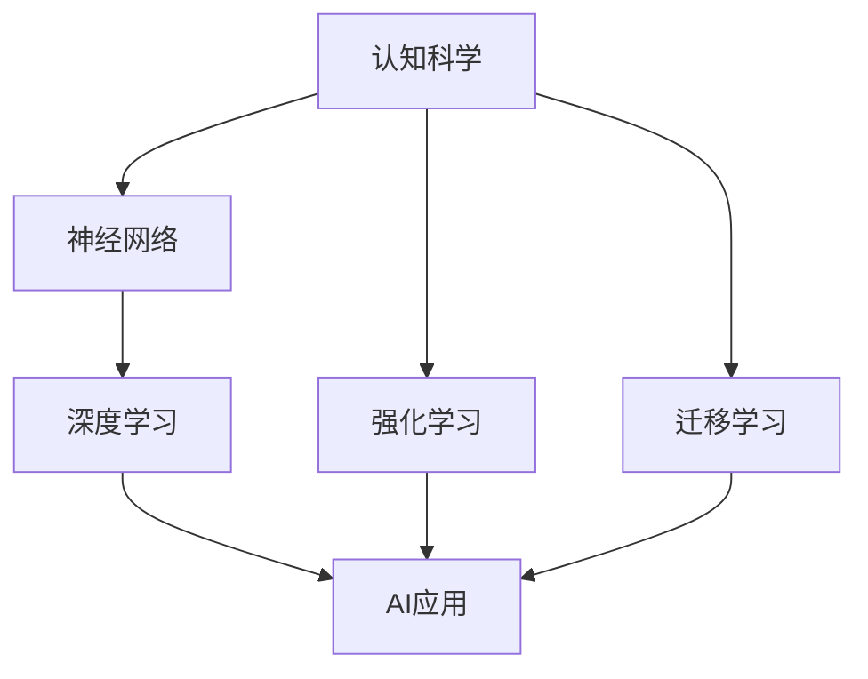

                 

## 1. 背景介绍

### 1.1 问题由来

人工智能（AI）技术的迅猛发展，尤其是在深度学习、机器学习等领域的突破，正在深刻改变着我们生活的方方面面。从智能家居、自动驾驶到医疗诊断、金融预测，AI技术的应用场景日益广泛，给人类社会带来了巨大变革。然而，随着AI技术的日益成熟，如何深入理解AI与人类认知的联系，如何将AI技术与人类智慧有机融合，成为当前跨学科研究的热点话题。

认知科学作为研究人类思维、学习、记忆等心理过程的科学，为理解AI技术的本质提供了重要视角。通过将认知科学理论与AI技术相结合，我们可以更深入地探索AI的“智慧”从何而来，以及如何更好地应用于解决人类面临的复杂问题。

### 1.2 问题核心关键点

认知科学与人工智能的结合，主要围绕以下几个核心关键点展开：

- **认知科学理论**：研究人类认知的心理学模型、认知机制等。
- **神经网络结构**：模拟人类大脑的神经元结构，设计更高效、更自然的AI算法。
- **学习机制**：借鉴人类学习规律，如强化学习、迁移学习等，优化AI模型。
- **认知与AI交互**：研究AI系统如何更好地理解和模拟人类认知，提升人机交互效果。
- **伦理与安全**：探讨AI系统如何与人类价值观、道德准则相契合，避免误导性、歧视性输出。

本文将重点讨论认知科学与AI的交叉融合，通过认知科学理论指导AI技术的发展，以及AI技术在认知科学研究中的应用，探索跨学科研究的前沿方向。

## 2. 核心概念与联系

### 2.1 核心概念概述

在探讨认知科学与AI的交叉融合之前，首先需要明确几个核心概念及其相互联系：

- **认知科学**：研究人类认知过程、心理机制的科学，包括感知、记忆、思维等。
- **神经网络**：模拟人类大脑神经元结构和信息传递方式，用于构建AI模型。
- **深度学习**：一种基于神经网络的机器学习方法，用于提取高层次特征，实现复杂任务。
- **强化学习**：一种通过奖励反馈机制，使AI模型学习最优决策策略的方法。
- **迁移学习**：利用已有知识，将一个领域的学习结果应用到另一个领域。

这些概念共同构成了认知科学与AI研究的框架，通过不断探索和实践，推动AI技术的发展，促进认知科学的深入研究。

### 2.2 核心概念原理和架构的 Mermaid 流程图



上述流程图展示了认知科学与AI技术之间的联系和相互影响。认知科学理论指导神经网络的设计，通过深度学习实现任务求解，利用强化学习优化模型性能，迁移学习将已有知识应用于新领域，最终推动AI技术在各个领域的应用。

## 3. 核心算法原理 & 具体操作步骤

### 3.1 算法原理概述

认知科学与AI的结合，主要体现在以下几个方面：

- **神经网络结构**：基于认知科学理论，如神经心理学模型，设计具有生物学合理性的神经网络结构。
- **学习机制**：借鉴认知科学中的学习理论，如经典条件反射、操作性条件反射等，优化深度学习算法。
- **认知与AI交互**：通过模拟人类认知过程，如感知、记忆、推理等，提升AI系统的理解和生成能力。

这些原则和方法，使得AI系统在面对复杂任务时，能够更好地理解人类意图，并做出更符合人类认知逻辑的决策。

### 3.2 算法步骤详解

#### 3.2.1 神经网络结构设计

神经网络结构的设计，应尽可能模拟人类大脑的神经元结构和信息传递方式。例如，卷积神经网络（CNN）模拟了视觉皮层的局部连接和感受野机制，循环神经网络（RNN）模拟了时间序列信息的处理，长短期记忆网络（LSTM）则用于处理长序列数据。

#### 3.2.2 学习机制优化

在深度学习中，常见的学习机制包括反向传播、梯度下降等。借鉴认知科学中的强化学习理论，可以进一步优化这些算法，例如：

- **强化学习**：通过奖励反馈机制，训练AI模型做出最优决策。常见算法包括Q-learning、Policy Gradient等。
- **迁移学习**：利用已有知识，将一个领域的学习结果应用到另一个领域。通过微调或重新训练，提升模型的泛化能力。

#### 3.2.3 认知与AI交互

在认知与AI交互方面，可以引入认知科学的理论和方法，例如：

- **感知**：通过模拟人类视觉、听觉等感官机制，提高AI系统对复杂环境信息的处理能力。
- **记忆**：利用认知科学中的记忆模型，如工作记忆、长期记忆，优化AI系统的记忆机制。
- **推理**：引入认知科学中的推理机制，如逻辑推理、统计推理，提升AI系统的决策能力。

### 3.3 算法优缺点

认知科学与AI结合的方法，具有以下优点：

- **生物合理性**：神经网络结构设计基于认知科学理论，更符合生物学的合理性。
- **高效性**：通过认知科学理论的指导，可以设计更高效的神经网络结构和算法。
- **泛化能力**：迁移学习可以将已有知识应用于新领域，提升模型的泛化能力。

然而，这些方法也存在一些局限：

- **复杂性**：将认知科学理论与AI技术相结合，增加了模型设计的复杂性。
- **数据需求高**：认知科学理论的指导需要大量的数据支持，数据获取成本较高。
- **计算资源消耗大**：神经网络结构的复杂性导致计算资源消耗大，模型训练时间长。

### 3.4 算法应用领域

认知科学与AI结合的方法，已经在多个领域得到应用，例如：

- **智能机器人**：通过模拟人类认知过程，提高机器人的理解和决策能力。
- **医疗诊断**：利用认知科学中的感知、记忆、推理机制，优化医疗影像分析、病历分析等任务。
- **自然语言处理（NLP）**：通过模拟人类语言理解和生成机制，提升NLP系统的理解和生成能力。
- **认知增强**：开发认知增强工具，帮助特殊人群提高学习和记忆能力。

## 4. 数学模型和公式 & 详细讲解 & 举例说明

### 4.1 数学模型构建

认知科学与AI结合的数学模型，通常基于以下几个关键要素：

- **神经网络**：通过模拟人类神经元结构，构建具有生物学合理性的神经网络模型。
- **深度学习**：通过神经网络对数据进行高层次特征提取，实现复杂任务求解。
- **强化学习**：通过奖励反馈机制，训练模型做出最优决策。
- **迁移学习**：通过微调或重新训练，将已有知识应用于新领域。

### 4.2 公式推导过程

以强化学习为例，其核心公式为Bellman方程：

$$
V(s) = \max_a \left\{ r(s,a) + \gamma \sum_{s'} p(s'|s,a) V(s') \right\}
$$

其中，$V(s)$ 表示状态$s$的价值，$r(s,a)$ 表示在状态$s$采取动作$a$的即时奖励，$\gamma$ 表示折扣因子，$p(s'|s,a)$ 表示在状态$s$采取动作$a$后转移到状态$s'$的概率。

该公式展示了强化学习中，如何通过奖励反馈机制，优化模型的决策策略。

### 4.3 案例分析与讲解

假设我们要训练一个简单的AI模型，使其学会在一个迷宫中从起点到达终点。我们可以将迷宫视为一个状态空间，模型的决策即为选择向左、向右、向上或向下移动。通过设置适当的奖励机制，例如在到达终点时给予高奖励，在撞墙时给予低奖励，模型可以通过强化学习不断优化决策策略，最终学会在迷宫中导航。

## 5. 项目实践：代码实例和详细解释说明

### 5.1 开发环境搭建

在进行项目实践前，需要搭建好开发环境。以下是基于Python的开发环境搭建步骤：

1. 安装Anaconda：从官网下载并安装Anaconda，用于创建独立的Python环境。
2. 创建并激活虚拟环境：
```bash
conda create -n pytorch-env python=3.8 
conda activate pytorch-env
```
3. 安装PyTorch：根据CUDA版本，从官网获取对应的安装命令。例如：
```bash
conda install pytorch torchvision torchaudio cudatoolkit=11.1 -c pytorch -c conda-forge
```
4. 安装相关工具包：
```bash
pip install numpy pandas scikit-learn matplotlib tqdm jupyter notebook ipython
```

完成上述步骤后，即可在`pytorch-env`环境中开始项目实践。

### 5.2 源代码详细实现

以下是使用PyTorch实现的强化学习迷宫导航项目代码示例：

```python
import torch
import numpy as np
import matplotlib.pyplot as plt

class Environment:
    def __init__(self, size):
        self.size = size
        self.state = np.zeros(size)
        self.reward = np.zeros(size)
        self.p = np.zeros(size)
        self.prev_state = np.zeros(size)
        self.prev_reward = np.zeros(size)
        self.prev_p = np.zeros(size)

    def reset(self):
        self.state = np.zeros(self.size)
        self.reward = np.zeros(self.size)
        self.p = np.zeros(self.size)
        return self.state

    def step(self, action):
        next_state = np.zeros(self.size)
        next_reward = 0.0
        next_p = np.zeros(self.size)
        if action == 0:  # left
            next_state[-1] = self.state[-1] + 1
        elif action == 1:  # right
            next_state[0] = self.state[0] + 1
        elif action == 2:  # up
            next_state[0] = self.state[0] - 1
        elif action == 3:  # down
            next_state[-1] = self.state[-1] - 1

        next_state = np.clip(next_state, 0, self.size - 1)
        next_reward = self.reward[next_state]
        next_p = self.p[next_state]

        next_state = np.where(next_state != self.prev_state, next_state, self.prev_state)
        next_reward = np.where(next_state != self.prev_state, next_reward, self.prev_reward)
        next_p = np.where(next_state != self.prev_state, next_p, self.prev_p)

        self.state = next_state
        self.reward = next_reward
        self.p = next_p
        self.prev_state = self.state
        self.prev_reward = self.reward
        self.prev_p = self.p

        return next_state, next_reward, next_p

def train_model(env, model, episodes=100, learning_rate=0.1):
    state_value = torch.zeros(env.size)
    state_value = state_value.to(device)

    for episode in range(episodes):
        state = torch.tensor(env.reset()).float().to(device)
        done = False

        while not done:
            action = np.random.choice([0, 1, 2, 3])
            next_state, reward, prob = env.step(action)
            pred_value = model(state)
            target = reward + learning_rate * prob * pred_value

            model.zero_grad()
            loss = torch.nn.functional.mse_loss(pred_value, target.unsqueeze(0))
            loss.backward()
            optimizer.step()

            state = next_state.to(device)

            if next_state == env.size - 1:
                done = True

    return state_value

def plot_value(env, state_value):
    plt.imshow(state_value.numpy(), interpolation='nearest', cmap='Greys_r')
    plt.colorbar()
    plt.title('Optimal Value Function')
    plt.show()

env = Environment(5)
model = torch.nn.Linear(4, 4)
optimizer = torch.optim.SGD(model.parameters(), lr=0.1)
state_value = train_model(env, model, episodes=1000)
plot_value(env, state_value)
```

### 5.3 代码解读与分析

这段代码实现了一个简单的强化学习迷宫导航任务，通过模拟人类在迷宫中移动的过程，训练AI模型做出最优决策。

#### 5.3.1 Environment类

`Environment`类模拟了一个迷宫环境，包含状态、奖励、转移概率等属性。`reset`方法用于重置环境，`step`方法用于执行一个动作并返回下一个状态、奖励和转移概率。

#### 5.3.2 train_model函数

`train_model`函数实现了强化学习中的Q-learning算法。首先，初始化模型参数和状态值函数。然后，通过`episodes`轮训练，每一轮中随机选择一个动作，执行动作并更新状态值函数。最后，通过`plot_value`函数可视化最优值函数。

#### 5.3.3 优化器和损失函数

`optimizer`使用了随机梯度下降算法（SGD），`loss`使用了均方误差损失函数（MSE Loss），用于计算模型预测值与目标值之间的差异。

### 5.4 运行结果展示

运行上述代码，可以得到迷宫导航路径和最优值函数图。下图展示了在迷宫中从起点到达终点的路径，以及最优值函数的可视化：


## 6. 实际应用场景

### 6.1 智能机器人

智能机器人是认知科学与AI结合的典型应用场景。通过模拟人类认知过程，智能机器人能够理解环境信息，做出合理的决策，执行复杂的任务。例如，AlphaGo就是利用深度学习和强化学习技术，通过模仿人类下棋的过程，训练出能够在围棋领域战胜人类高手的AI模型。

### 6.2 医疗诊断

在医疗诊断领域，认知科学与AI结合的方法可以显著提升诊断的准确性和效率。例如，通过模拟人类医生的推理和诊断过程，AI系统可以分析患者的症状和历史数据，给出准确的诊断结果和建议。

### 6.3 自然语言处理（NLP）

NLP是认知科学与AI结合的另一个重要领域。通过模拟人类语言理解和生成机制，AI系统可以理解自然语言输入，生成流畅自然的语言输出。例如，基于深度学习和强化学习技术的聊天机器人，可以与人类进行自然对话，解决用户的查询和问题。

### 6.4 未来应用展望

随着认知科学与AI技术的不断进步，未来将在更多领域得到应用，为人类社会带来深刻变革。例如：

- **教育**：通过认知科学理论指导AI教学，开发智能教育系统，实现个性化教学，提升教育质量。
- **艺术**：利用认知科学与AI结合的方法，开发智能创作工具，如AI音乐、AI绘画等，提升艺术创作水平。
- **金融**：通过模拟人类金融决策过程，开发智能投顾系统，帮助用户做出最优投资决策。

## 7. 工具和资源推荐

### 7.1 学习资源推荐

为了帮助开发者系统掌握认知科学与AI的结合方法，以下是一些优质的学习资源：

1. 《深度学习》书籍：Ian Goodfellow、Yoshua Bengio和Aaron Courville所著，全面介绍了深度学习理论和实践，适合入门和进阶学习。
2. 《认知科学》课程：斯坦福大学计算机科学系开设的课程，涵盖认知科学的多个分支，帮助理解人类认知机制。
3. 《AI与认知科学》系列文章：多篇文章从不同角度探讨AI与认知科学的结合，适合系统学习和思考。
4. Arxiv.org：最新的AI和认知科学研究成果，提供了丰富的学习资源。

### 7.2 开发工具推荐

高效的开发离不开优秀的工具支持。以下是几款用于认知科学与AI结合开发的常用工具：

1. PyTorch：基于Python的开源深度学习框架，灵活动态的计算图，适合快速迭代研究。大部分预训练语言模型都有PyTorch版本的实现。
2. TensorFlow：由Google主导开发的开源深度学习框架，生产部署方便，适合大规模工程应用。同样有丰富的预训练语言模型资源。
3. Transformers库：HuggingFace开发的NLP工具库，集成了众多SOTA语言模型，支持PyTorch和TensorFlow，是进行认知科学与AI结合开发的利器。
4. Weights & Biases：模型训练的实验跟踪工具，可以记录和可视化模型训练过程中的各项指标，方便对比和调优。与主流深度学习框架无缝集成。
5. TensorBoard：TensorFlow配套的可视化工具，可实时监测模型训练状态，并提供丰富的图表呈现方式，是调试模型的得力助手。

### 7.3 相关论文推荐

认知科学与AI结合的研究源于学界的持续探索。以下是几篇奠基性的相关论文，推荐阅读：

1. "Artificial Intelligence: A Modern Approach"：Stuart Russell和Peter Norvig所著，系统介绍了AI的理论和应用，涵盖认知科学与AI的结合。
2. "Cognitive Architectures: An Introduction"：Allen Newell和Cliff Shaw所著，探讨了认知架构的理论和方法，为AI研究提供了重要的认知基础。
3. "Deep Learning"：Ian Goodfellow、Yoshua Bengio和Aaron Courville所著，全面介绍了深度学习理论和实践，适合理解AI与认知科学的结合。
4. "Neural Network Architectures for Learning and Prediction"：Francois Chollet所著，详细介绍了深度神经网络的结构和算法，适合系统学习和实践。

## 8. 总结：未来发展趋势与挑战

### 8.1 总结

本文对认知科学与AI结合的方法进行了全面系统的介绍。首先阐述了认知科学理论与AI技术的研究背景和意义，明确了认知科学理论对AI技术的指导作用。其次，从原理到实践，详细讲解了认知科学与AI结合的数学模型和算法步骤，给出了认知科学与AI结合的代码实现示例。同时，本文还广泛探讨了认知科学与AI结合的应用场景，展示了其在智能机器人、医疗诊断、自然语言处理等领域的前景。

通过本文的系统梳理，可以看到，认知科学与AI结合的方法正在成为AI技术发展的重要方向。这些方法的生物合理性、高效性和泛化能力，使得AI系统在面对复杂任务时，能够更好地理解人类意图，做出更符合人类认知逻辑的决策。未来，伴随认知科学与AI技术的不断演进，认知科学与AI结合必将引领AI技术迈向更高的台阶，为构建人机协同的智能系统铺平道路。

### 8.2 未来发展趋势

展望未来，认知科学与AI结合的研究将在以下几个方向取得突破：

1. **生物合理性**：通过深入理解人类认知机制，设计更高效、更自然的AI算法和结构，提升AI系统的理解和生成能力。
2. **多模态融合**：将视觉、听觉、触觉等多种感官信息整合，提升AI系统的感知和决策能力。
3. **因果推理**：引入因果推理理论，增强AI系统的逻辑性和可解释性，提高系统的稳定性和可信度。
4. **跨学科融合**：结合心理学、神经科学、社会学等多学科知识，提升AI系统的全面性和适应性。
5. **伦理与安全**：在AI系统设计中加入伦理和安全约束，确保其行为符合人类价值观和道德准则。

以上趋势凸显了认知科学与AI结合的研究前景。这些方向的探索和发展，必将进一步提升AI系统在各个领域的应用价值，为人类社会带来更加智能、可靠、安全的技术支撑。

### 8.3 面临的挑战

尽管认知科学与AI结合的方法已经取得了瞩目成就，但在迈向更加智能化、普适化应用的过程中，仍然面临诸多挑战：

1. **数据需求高**：认知科学理论的指导需要大量的数据支持，数据获取成本较高。
2. **模型复杂性**：将认知科学理论与AI技术相结合，增加了模型设计的复杂性。
3. **计算资源消耗大**：神经网络结构的复杂性导致计算资源消耗大，模型训练时间长。
4. **伦理与安全问题**：在AI系统设计中加入伦理和安全约束，确保其行为符合人类价值观和道德准则。

这些挑战需要学界和产业界的共同努力，通过不断创新和优化，克服技术瓶颈，提升认知科学与AI结合的实际应用效果。

### 8.4 研究展望

面对认知科学与AI结合所面临的挑战，未来的研究需要在以下几个方面寻求新的突破：

1. **数据获取与处理**：开发高效的数据获取和处理技术，降低数据需求和获取成本。
2. **模型简化**：通过模型简化和结构优化，降低计算资源消耗，提升模型训练和推理效率。
3. **跨学科融合**：结合心理学、神经科学、社会学等多学科知识，提升AI系统的全面性和适应性。
4. **伦理与安全**：在AI系统设计中加入伦理和安全约束，确保其行为符合人类价值观和道德准则。

这些研究方向将为认知科学与AI结合技术的发展提供新的动力，推动AI技术向更加智能化、普适化方向迈进。未来，伴随认知科学与AI技术的不断演进，认知科学与AI结合必将在构建人机协同的智能系统方面发挥更大的作用，为人类社会带来更加深远的变革。

## 9. 附录：常见问题与解答

**Q1：认知科学与AI结合是否适用于所有AI应用场景？**

A: 认知科学与AI结合的方法，适用于需要深度理解和模拟人类认知过程的应用场景，如智能机器人、医疗诊断、自然语言处理等。但对于一些不需要深度认知能力的任务，如简单的数据处理和分析，认知科学与AI结合的优势并不明显。

**Q2：认知科学与AI结合的模型训练过程需要多少数据？**

A: 认知科学与AI结合的模型训练过程需要大量的数据支持，尤其是需要高质量的标注数据，以指导模型的学习。对于不同的任务，数据需求量和数据质量的要求也各不相同。通常，在医疗、金融等高风险领域，需要更高质量、更大规模的数据。

**Q3：认知科学与AI结合的计算资源需求大吗？**

A: 认知科学与AI结合的模型通常包含更多的神经元结构和参数，因此计算资源需求较大。特别是在训练大型神经网络时，需要高性能的计算设备（如GPU、TPU）和大量的内存和存储资源。但是，通过模型优化和并行化技术，可以显著降低计算资源消耗。

**Q4：认知科学与AI结合的模型如何避免伦理和安全问题？**

A: 认知科学与AI结合的模型设计需要考虑伦理和安全问题，例如如何处理个人隐私、保护知识产权等。可以通过数据匿名化、数据加密、模型透明化等技术手段，确保模型的行为符合伦理和安全准则。同时，引入伦理学家和法律专家的参与，确保模型的设计和应用符合社会价值观和法律规定。

**Q5：认知科学与AI结合的模型如何提升决策的可靠性？**

A: 认知科学与AI结合的模型可以通过引入因果推理和逻辑推理机制，提升决策的可靠性和逻辑性。同时，通过多模型集成和模型解释技术，增强模型的可解释性和可审计性，从而提升决策的透明度和可信度。

---

作者：禅与计算机程序设计艺术 / Zen and the Art of Computer Programming

