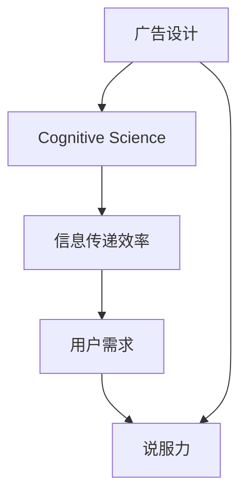

                 

# 认知科学在广告设计中的应用

## 1. 背景介绍

### 1.1 问题由来
广告设计在过去数十年中经历了飞速的发展。从简单的印刷到今天的多媒体内容，广告已逐渐演变为一门科学，结合了心理学、设计学、社会学等多学科的知识。然而，传统的广告设计仍然存在一些局限性，如对用户需求的忽视、信息传递效率低下等问题。

### 1.2 问题核心关键点
为了解决这些问题，认知科学开始被广泛应用于广告设计中。认知科学通过研究人类认知过程的规律，帮助广告设计师更好地理解受众，设计出更加吸引人、具有说服力的广告内容。

### 1.3 问题研究意义
认知科学在广告设计中的应用，可以显著提升广告的吸引力和说服力，进而提高广告的转化率。同时，利用认知科学的理论和方法，可以帮助广告设计师更加科学地设计广告内容，从而降低设计成本，提高广告效果。

## 2. 核心概念与联系

### 2.1 核心概念概述
- **认知科学**：研究人类认知过程的学科，包括感知、记忆、思维等过程。
- **广告设计**：结合心理学、设计学等多学科知识，设计出具有吸引力和说服力的广告内容。
- **信息传递效率**：广告传递信息的速度和效果，直接影响用户对广告的感知和记忆。
- **用户需求**：用户对广告内容的真实需求，是广告设计的重要参考。
- **说服力**：广告内容说服用户采取行动的能力。

### 2.2 核心概念原理和架构的 Mermaid 流程图



## 3. 核心算法原理 & 具体操作步骤

### 3.1 算法原理概述

基于认知科学的广告设计，旨在通过理解人类认知规律，设计出更具有吸引力和说服力的广告内容。其主要原理包括以下几个方面：

1. **认知心理学**：研究人类感知、记忆、思维等过程，指导广告设计师在设计中考虑用户对信息接收、处理和存储的方式。
2. **视觉感知**：利用人类视觉感知的规律，设计出更加引人注目的广告元素。
3. **情感设计**：通过设计符合用户情感反应的广告元素，提高广告的说服力和记忆度。
4. **行为理论**：应用行为理论，设计出能够激发用户采取行动的广告内容。

### 3.2 算法步骤详解

#### 3.2.1 数据收集与分析

首先，广告设计师需要收集并分析用户的相关数据，包括用户的年龄、性别、兴趣爱好等。这些数据将帮助设计师更好地理解目标用户，从而设计出更加符合用户需求的广告内容。

#### 3.2.2 设计原型

在理解目标用户的基础上，设计师可以根据认知科学的原则，设计出多个广告原型。例如，可以利用色彩心理学设计广告色彩方案，利用布局心理学设计广告结构，利用情感心理学设计广告元素。

#### 3.2.3 用户测试与反馈

设计完成后，广告设计师需要邀请目标用户进行测试，并收集用户对广告的反馈。这些反馈将帮助设计师进一步优化广告内容，提升广告效果。

#### 3.2.4 迭代优化

根据用户测试和反馈结果，广告设计师可以对广告内容进行迭代优化，不断调整和改进，最终设计出具有高度吸引力和说服力的广告。

### 3.3 算法优缺点

#### 3.3.1 优点

1. **提高广告效果**：通过理解用户认知规律，设计出更具有吸引力和说服力的广告内容，从而提高广告的转化率。
2. **降低设计成本**：利用认知科学的理论和方法，可以更加科学地设计广告内容，减少设计成本。
3. **适应性广**：认知科学的理论和方法可以应用于不同类型的广告设计，具有广泛的应用前景。

#### 3.3.2 缺点

1. **数据需求高**：收集和分析用户数据需要大量的时间和成本。
2. **设计复杂度增加**：需要考虑更多的因素和细节，设计过程可能更加复杂。
3. **理解难度大**：认知科学涉及多个学科，理论较为复杂，理解难度较大。

### 3.4 算法应用领域

基于认知科学的广告设计，可以应用于多种广告形式，包括电视广告、平面广告、网络广告等。通过结合认知科学的理论和方法，广告设计师可以更加科学地设计出具有高度吸引力和说服力的广告内容。

## 4. 数学模型和公式 & 详细讲解 & 举例说明

### 4.1 数学模型构建

在广告设计中，认知科学的应用主要涉及以下几个方面：

1. **感知模型**：研究人类感知过程的模型，如Gibson's Ecological Model。
2. **记忆模型**：研究人类记忆过程的模型，如Atkinson-Rodi Model。
3. **决策模型**：研究人类决策过程的模型，如Prospect Theory。

### 4.2 公式推导过程

以Atkinson-Rodi Model为例，其公式为：

$$
M = \alpha E + \beta I + \gamma T
$$

其中，$M$ 表示记忆，$E$ 表示外界刺激，$I$ 表示自身内在状态，$T$ 表示时间因素。这个模型表明，记忆的形成不仅受到外界刺激的影响，还受到自身内在状态和时间因素的影响。

### 4.3 案例分析与讲解

以一个平面广告的设计为例，设计师首先通过调研了解目标用户的兴趣和需求。然后，根据Atkinson-Rodi Model，设计出符合用户感知和记忆的广告内容。例如，广告的背景颜色、字体大小、图片位置等都需要考虑用户的视觉感知规律。最终，通过测试和反馈不断优化，设计出高度吸引力和说服力的广告。

## 5. 项目实践：代码实例和详细解释说明

### 5.1 开发环境搭建

在广告设计中，通常使用Python进行数据分析和可视化。以下是在Python中进行广告设计的基本环境搭建步骤：

1. 安装Python及其相关库，如Pandas、NumPy、Matplotlib等。
2. 收集和分析用户数据，使用Pandas进行数据处理。
3. 设计广告原型，使用Matplotlib进行可视化。

### 5.2 源代码详细实现

以下是一个简单的广告设计示例代码：

```python
import pandas as pd
import numpy as np
import matplotlib.pyplot as plt

# 数据读取
data = pd.read_csv('user_data.csv')

# 数据分析
age_group = data.groupby('age')['gender'].value_counts()

# 可视化
plt.bar(age_group.index, age_group.values)
plt.xlabel('Age Group')
plt.ylabel('Gender Count')
plt.title('Gender Distribution by Age Group')
plt.show()
```

### 5.3 代码解读与分析

以上代码实现了对用户数据的分析，并通过Matplotlib进行可视化。首先，使用Pandas读取用户数据，然后按照年龄分组统计性别分布。最后，使用Matplotlib绘制柱状图，展示不同年龄段的性别分布情况。

## 6. 实际应用场景

### 6.1 广告创意设计

在广告创意设计中，认知科学可以帮助设计师更好地理解目标用户，设计出符合用户认知规律的广告内容。例如，通过调研了解用户的兴趣和需求，设计出具有高度吸引力和说服力的广告。

### 6.2 广告效果评估

认知科学还可以用于广告效果评估，通过分析用户对广告的反应，优化广告内容。例如，通过A/B测试等方法，评估不同广告元素对用户行为的影响，从而优化广告设计。

### 6.3 广告内容优化

广告设计师可以通过认知科学的理论和方法，不断优化广告内容。例如，通过设计符合用户情感反应的广告元素，提高广告的说服力和记忆度。

### 6.4 未来应用展望

随着人工智能技术的发展，认知科学在广告设计中的应用也将更加广泛。例如，通过机器学习算法，自动生成符合用户认知规律的广告内容，进一步提升广告效果。

## 7. 工具和资源推荐

### 7.1 学习资源推荐

1. **《认知心理学》**：Ernest J. Jannis等著，介绍了认知心理学的基本理论和应用。
2. **《广告心理学》**：Michael Solomon等著，介绍了广告心理学的基础知识和实践方法。
3. **《数据科学与广告设计》**：Andrew Ng等著，介绍了数据科学与广告设计的结合方法。

### 7.2 开发工具推荐

1. **Python**：Python是最常用的编程语言之一，具有强大的数据处理和可视化能力。
2. **Pandas**：Pandas是Python中常用的数据处理库，可以方便地进行数据读取和分析。
3. **Matplotlib**：Matplotlib是Python中常用的数据可视化库，可以生成高质量的图表和图形。

### 7.3 相关论文推荐

1. **《基于认知科学的设计》**：Lior Schachter等著，介绍了认知科学在广告设计中的应用。
2. **《广告设计的心理学基础》**：Richard A. Jordens等著，介绍了广告心理学的基础知识和实践方法。
3. **《认知科学与人工智能》**：Thierry Gueudenaey等著，介绍了认知科学与人工智能的结合方法。

## 8. 总结：未来发展趋势与挑战

### 8.1 研究成果总结

认知科学在广告设计中的应用，可以显著提升广告的吸引力和说服力，从而提高广告的转化率。未来，随着认知科学和人工智能技术的不断发展，广告设计将更加科学、高效。

### 8.2 未来发展趋势

1. **自动化设计**：利用机器学习和人工智能技术，自动生成符合用户认知规律的广告内容。
2. **个性化设计**：根据用户数据，个性化设计广告内容，提高广告的针对性和有效性。
3. **多渠道整合**：将不同渠道的广告设计进行整合，形成更加连贯和一致的广告体验。

### 8.3 面临的挑战

1. **数据隐私**：收集和分析用户数据需要考虑隐私保护问题，确保用户数据的安全。
2. **算法复杂度**：认知科学和人工智能算法较为复杂，需要进一步研究和优化。
3. **用户体验**：在追求广告效果的同时，需要关注用户体验，避免过度广告的干扰。

### 8.4 研究展望

未来，认知科学在广告设计中的应用将更加广泛和深入。例如，通过结合更多学科的知识，进一步提升广告设计的效果和质量。同时，需要加强对数据隐私和用户体验的保护，确保广告设计的可持续发展。

## 9. 附录：常见问题与解答

**Q1: 什么是认知科学？**

A: 认知科学是研究人类认知过程的学科，包括感知、记忆、思维等过程。

**Q2: 认知科学在广告设计中有什么应用？**

A: 认知科学可以帮助广告设计师更好地理解受众，设计出更加吸引人、具有说服力的广告内容。

**Q3: 如何设计符合用户认知规律的广告内容？**

A: 设计师需要收集和分析用户数据，了解用户的兴趣和需求。然后，根据认知科学的理论和方法，设计出符合用户认知规律的广告内容。

**Q4: 认知科学在广告设计中的未来发展趋势是什么？**

A: 未来，随着认知科学和人工智能技术的不断发展，广告设计将更加科学、高效，自动生成和个性化设计将成为主要趋势。

**Q5: 认知科学在广告设计中面临的挑战是什么？**

A: 数据隐私、算法复杂度和用户体验保护是认知科学在广告设计中面临的主要挑战。

