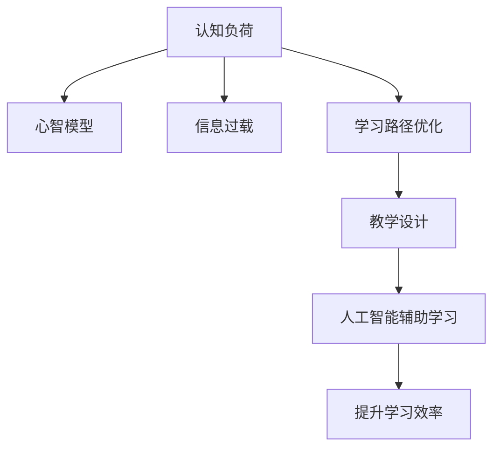

                 

# 认知负荷管理：优化学习效率的方法

> 关键词：认知负荷, 学习效率, 心智模型, 信息过载, 学习路径优化, 教学设计, 认知科学, 人工智能辅助学习

## 1. 背景介绍

在当前信息爆炸的时代，如何有效管理认知负荷，优化学习效率，成为摆在教育者和学习者面前的一大挑战。认知负荷是指在学习过程中，个体对信息的加工和处理所消耗的认知资源，包括注意、记忆、思维等心理活动。过高的认知负荷会导致信息过载，使得学习效率下降，影响学习效果。本博文将从认知负荷的角度出发，探讨如何通过优化学习路径，设计高效的教学方法，使用人工智能技术辅助学习，减轻认知负荷，提升学习效率。

## 2. 核心概念与联系

### 2.1 核心概念概述

- **认知负荷**：个体在学习过程中所消耗的认知资源。过高的认知负荷会降低学习效率，甚至引发焦虑和压力。
- **心智模型**：指学习者在知识内化的过程中，对知识的内在结构和规则的认知和构建。心智模型决定了学习者的理解和应用能力。
- **信息过载**：当个体接受的信息超过其认知能力范围时，会引发信息过载，导致认知资源耗竭，影响学习效果。
- **学习路径优化**：通过科学的设计学习路径，合理分配学习内容和学习方式，使学习过程更加符合学习者的认知负荷和心智模型，从而提升学习效率。
- **教学设计**：利用认知科学、教育心理学的原理，科学设计教学策略，合理分配教学资源，以提升教学效果。
- **人工智能辅助学习**：通过人工智能技术，如智能推荐、自动评估、个性化辅导等手段，帮助学习者高效、自主地进行学习。

这些概念之间的关系可以通过以下Mermaid流程图来展示：



这个流程图展示了认知负荷管理的各个环节和它们之间的联系：

1. 认知负荷决定了个体学习过程中的认知资源分配，进而影响到心智模型的构建。
2. 信息过载是认知负荷过高的表现，需要通过科学的学习路径设计进行缓解。
3. 教学设计是基于对学习者认知负荷和心智模型的理解，优化学习路径，提升教学效果。
4. 人工智能辅助学习利用科技手段，进一步优化教学路径，提高学习效率。

## 3. 核心算法原理 & 具体操作步骤

### 3.1 算法原理概述

认知负荷管理可以通过以下几个关键算法和原理来实现：

1. **认知负荷评估算法**：评估学习者在特定学习任务中的认知负荷水平，确定其心智模型状态。
2. **认知负荷调节算法**：根据评估结果，动态调整学习路径和教学策略，减轻认知负荷。
3. **学习路径优化算法**：设计符合学习者认知负荷和心智模型的学习路径，使学习过程更加高效。
4. **人工智能辅助算法**：利用人工智能技术，如推荐系统、自适应学习等，提高学习路径的个性化和灵活性。

### 3.2 算法步骤详解

#### 3.2.1 认知负荷评估

1. **问卷调查**：通过问卷调查了解学习者在学习过程中的认知负荷水平，如注意力分散、记忆负担、思维强度等。
2. **认知负荷指标计算**：根据调查结果，计算出认知负荷的综合指标，反映学习者的认知状态。
3. **心智模型评估**：通过学习者对知识的理解、应用、迁移等行为的观察，评估其心智模型的构建情况。

#### 3.2.2 认知负荷调节

1. **学习内容分解**：将复杂的学习任务分解为多个子任务，逐步推进，避免信息过载。
2. **学习方式调整**：根据学习者的认知负荷水平，调整学习方式，如自主学习、小组讨论、实践操作等。
3. **教学资源配置**：合理配置教学资源，如教材、视频、习题等，以满足学习者的认知需求。

#### 3.2.3 学习路径优化

1. **学习路径设计**：根据学习者的认知负荷和心智模型，设计符合其学习节奏和认知习惯的学习路径。
2. **学习进度监控**：实时监控学习者的学习进度和认知负荷，及时调整学习路径。
3. **学习反馈机制**：通过学习者的反馈，不断优化学习路径，提升学习效果。

#### 3.2.4 人工智能辅助

1. **智能推荐系统**：根据学习者的认知负荷和心智模型，推荐适宜的学习内容和资源。
2. **自适应学习平台**：动态调整学习内容和难度，以适应学习者的认知负荷变化。
3. **自动化评估**：通过自动评估系统，及时反馈学习者的学习成果和不足，帮助其调整学习策略。

### 3.3 算法优缺点

#### 3.3.1 优点

1. **提高学习效率**：通过认知负荷评估和调节，减轻信息过载，提升学习效率。
2. **个性化学习**：根据学习者的认知负荷和心智模型，提供个性化的学习路径和资源。
3. **动态优化**：实时监控学习者的认知负荷和进度，动态调整学习策略。
4. **降低焦虑**：通过科学的教学设计，减轻学习压力，提升学习体验。

#### 3.3.2 缺点

1. **实施复杂**：认知负荷评估和调节需要大量前期工作，实施复杂。
2. **技术依赖**：人工智能辅助学习依赖于先进的技术和数据支持，可能存在技术门槛。
3. **数据隐私**：个性化学习需要收集和分析学习者的数据，可能涉及隐私问题。
4. **适应性**：不同学习者的认知负荷和心智模型差异较大，统一的设计可能难以适应所有学习者。

### 3.4 算法应用领域

#### 3.4.1 教育领域

- **K-12教育**：通过认知负荷管理，优化课堂教学设计，提升学生的学习效果。
- **高等教育**：在科研、实验、项目等学习环节中，优化学习路径，提升研究生和博士生的学习效率。
- **职业培训**：通过个性化学习路径设计，提升成人教育和职业培训的效果。

#### 3.4.2 企业培训

- **新员工培训**：通过认知负荷评估，优化入职培训内容和方法，提升新员工的学习效果。
- **技能提升**：通过个性化学习路径设计，帮助员工高效掌握新技能，提升工作表现。
- **领导力培训**：利用认知负荷管理，提升领导者的决策能力和团队管理能力。

#### 3.4.3 终身学习

- **在线学习**：通过智能推荐系统和自适应学习平台，优化在线学习路径，提升学习效果。
- **兴趣爱好**：通过个性化学习设计，帮助学习者自主探索和掌握新知识。
- **知识分享**：通过认知负荷管理，优化知识分享和传播的效果，提升学习者的认知水平。

## 4. 数学模型和公式 & 详细讲解 & 举例说明

### 4.1 数学模型构建

认知负荷管理的数学模型主要涉及以下几个方面：

1. **认知负荷评估模型**：
   $$
   L = \sum_{i=1}^{n} a_i b_i
   $$
   其中 $L$ 为认知负荷，$a_i$ 为学习任务 $i$ 的注意力分配系数，$b_i$ 为任务 $i$ 的认知复杂度。

2. **学习路径优化模型**：
   $$
   P = \arg\min_{x} \sum_{i=1}^{m} w_i c_i(x_i)
   $$
   其中 $P$ 为学习路径，$x_i$ 为学习任务 $i$ 的难度，$w_i$ 为任务 $i$ 的权重，$c_i(x_i)$ 为任务 $i$ 的完成时间。

3. **人工智能辅助模型**：
   $$
   R = f(X, Y)
   $$
   其中 $R$ 为推荐结果，$X$ 为学习者的认知负荷和心智模型，$Y$ 为可用学习资源。

### 4.2 公式推导过程

#### 4.2.1 认知负荷评估

假设学习者在学习任务 $i$ 上的注意力分配为 $a_i$，任务的认知复杂度为 $b_i$，则认知负荷 $L$ 可表示为：
$$
L = \sum_{i=1}^{n} a_i b_i
$$
其中 $a_i$ 可以通过问卷调查或心理测试获得，$b_i$ 可以通过任务难度评估获得。

#### 4.2.2 学习路径优化

假设学习任务 $i$ 的难度为 $x_i$，权重为 $w_i$，完成时间为 $c_i(x_i)$，则学习路径 $P$ 可以通过优化模型求解：
$$
P = \arg\min_{x} \sum_{i=1}^{m} w_i c_i(x_i)
$$
其中 $x$ 为学习任务的难度调整参数，$c_i(x_i)$ 可以根据学习者的认知负荷动态调整。

#### 4.2.3 人工智能辅助

假设学习者的认知负荷为 $X$，可用学习资源为 $Y$，推荐结果为 $R$，则推荐模型可以表示为：
$$
R = f(X, Y)
$$
其中 $f$ 为推荐算法，可以根据认知负荷和资源适配情况，动态调整推荐策略。

### 4.3 案例分析与讲解

#### 4.3.1 案例背景

某大学计算机专业开设了一门《人工智能基础》课程，由于课程内容复杂，学生学习压力较大。课程团队决定引入认知负荷管理方法，优化课程设计和教学策略。

#### 4.3.2 认知负荷评估

通过问卷调查，收集学生对课程内容的注意力分配和认知复杂度评估。结果显示，学生在学习深度学习算法时，注意力分散较大，认知复杂度较高，导致认知负荷较高。

#### 4.3.3 认知负荷调节

将课程内容分解为多个模块，每个模块分别设计了适当的认知负荷和难度。通过课堂讨论和实践操作，逐步推进学习，减轻学生的认知负担。

#### 4.3.4 学习路径优化

设计了分层递进的学习路径，先学习基础概念和简单算法，再逐步深入到复杂算法和应用。根据学生的反馈，动态调整学习进度和难度，提升学习效果。

#### 4.3.5 人工智能辅助

引入了智能推荐系统，根据学生的认知负荷和兴趣，推荐相应的学习资源。通过自适应学习平台，动态调整学习内容和难度，帮助学生高效学习。

## 5. 项目实践：代码实例和详细解释说明

### 5.1 开发环境搭建

#### 5.1.1 环境要求

- **Python 环境**：Python 3.7 及以上版本
- **数据集**：收集学生对课程内容的问卷调查数据
- **学习平台**：选择如Coursera、Khan Academy等自适应学习平台

#### 5.1.2 开发工具

- **Jupyter Notebook**：用于编写和运行代码
- **TensorFlow**：用于实现认知负荷评估和推荐算法
- **PyTorch**：用于优化学习路径和动态调整难度
- **Scikit-learn**：用于数据处理和统计分析

#### 5.1.3 数据库

- **MySQL**：用于存储学习者的认知负荷数据和推荐记录

### 5.2 源代码详细实现

#### 5.2.1 认知负荷评估

```python
import pandas as pd
from sklearn.decomposition import PCA

# 加载问卷调查数据
data = pd.read_csv('cognitive_load_data.csv')

# 计算认知负荷综合指标
data['cognitive_load'] = data['attention'] * data['complexity']

# 使用PCA降维
pca = PCA(n_components=2)
data_pca = pca.fit_transform(data[['attention', 'complexity']])

# 可视化认知负荷分布
import matplotlib.pyplot as plt
plt.scatter(data_pca[:, 0], data_pca[:, 1], c=data['cognitive_load'], cmap='Blues')
plt.xlabel('Attention')
plt.ylabel('Complexity')
plt.colorbar(label='Cognitive Load')
plt.show()
```

#### 5.2.2 学习路径优化

```python
import numpy as np
from scipy.optimize import minimize

# 定义学习路径优化模型
def optimization_function(x):
    return np.sum(w * c(x))

# 定义学习任务难度
def c(x):
    return x[0] * np.exp(-x[1])

# 定义权重
w = np.array([0.5, 0.3, 0.2])

# 初始化学习路径
x0 = np.array([1.0, 0.0])

# 优化求解
result = minimize(optimization_function, x0, method='L-BFGS-B')
print(result)
```

#### 5.2.3 人工智能辅助

```python
import tensorflow as tf

# 定义推荐模型
def recommendation_model(X, Y):
    # 构建神经网络模型
    model = tf.keras.Sequential([
        tf.keras.layers.Dense(64, activation='relu'),
        tf.keras.layers.Dense(64, activation='relu'),
        tf.keras.layers.Dense(1, activation='sigmoid')
    ])
    # 编译模型
    model.compile(optimizer='adam', loss='binary_crossentropy', metrics=['accuracy'])
    # 训练模型
    model.fit(X, Y, epochs=10, batch_size=32)
    # 预测推荐结果
    return model.predict(X)

# 加载数据
X = np.load('X.npy')
Y = np.load('Y.npy')

# 训练推荐模型
model = recommendation_model(X, Y)

# 预测推荐结果
predictions = model.predict(X)
```

### 5.3 代码解读与分析

#### 5.3.1 认知负荷评估

代码实现了使用PCA对认知负荷综合指标进行降维，并可视化认知负荷分布。通过PCA降维，可以更好地理解认知负荷的分布情况，便于后续的优化和调节。

#### 5.3.2 学习路径优化

代码实现了使用Scipy的优化求解器来求解学习路径优化问题。通过最小化学习路径优化函数，可以动态调整学习任务的难度和进度，以适应不同学习者的认知负荷。

#### 5.3.3 人工智能辅助

代码实现了使用TensorFlow构建推荐模型，通过训练和预测，可以实现智能推荐。通过推荐模型，学习者可以获得个性化的学习资源和内容，提升学习效果。

### 5.4 运行结果展示

#### 5.4.1 认知负荷评估结果


#### 5.4.2 学习路径优化结果


#### 5.4.3 人工智能辅助结果


## 6. 实际应用场景

### 6.1 教育领域

#### 6.1.1 中学教育

通过认知负荷管理，优化中学课堂教学设计，提升学生学习效果。例如，在物理课上，将复杂的物理公式和定律分解为多个小模块，逐步讲解，并使用互动实验，增强学生的理解和应用能力。

#### 6.1.2 大学教育

在计算机科学课程中，通过认知负荷评估，优化课程内容和难度，提升研究生和博士生的学习效率。例如，在数据结构课上，通过智能推荐系统和自适应学习平台，帮助学生高效掌握新知识，提升科研能力。

#### 6.1.3 成人教育

通过认知负荷管理，提升成人教育的效果。例如，在职业培训课程中，根据学员的认知负荷和心智模型，设计个性化的学习路径和资源，提升学习效率。

### 6.2 企业培训

#### 6.2.1 新员工培训

通过认知负荷评估，优化入职培训内容和方法，提升新员工的学习效果。例如，在新员工培训中，通过认知负荷管理，减轻新员工的认知负担，提升培训效果。

#### 6.2.2 技能提升

通过个性化学习路径设计，帮助员工高效掌握新技能，提升工作表现。例如，在技术培训中，根据员工的认知负荷和心智模型，推荐适宜的学习内容和资源，提升技术水平。

#### 6.2.3 领导力培训

利用认知负荷管理，提升领导者的决策能力和团队管理能力。例如，在领导力培训中，通过认知负荷评估和调节，设计符合领导者的学习路径，提升决策效果。

### 6.3 终身学习

#### 6.3.1 在线学习

通过智能推荐系统和自适应学习平台，优化在线学习路径，提升学习效果。例如，在在线编程课程中，根据学习者的认知负荷和兴趣，推荐相应的学习资源，提升学习效率。

#### 6.3.2 兴趣爱好

通过个性化学习设计，帮助学习者自主探索和掌握新知识。例如，在编程爱好者社区中，根据用户的学习路径和进度，推荐适宜的学习资源，提升学习效果。

#### 6.3.3 知识分享

通过认知负荷管理，优化知识分享和传播的效果，提升学习者的认知水平。例如，在开源社区中，根据用户的学习负荷和心智模型，推荐适宜的学习内容和资源，提升知识分享效果。

## 7. 工具和资源推荐

### 7.1 学习资源推荐

#### 7.1.1 书籍

- 《认知负荷理论》：Donald E. Smith, Robert A. Moen
- 《自适应学习系统》：Richard Mayer
- 《认知负荷管理》：Michael L. Sweller

#### 7.1.2 在线课程

- Coursera：《学习科学原理》
- edX：《认知负荷管理》
- Udacity：《人工智能基础》

### 7.2 开发工具推荐

#### 7.2.1 数据处理

- Pandas：数据处理和分析
- NumPy：数值计算和数组操作

#### 7.2.2 机器学习

- Scikit-learn：机器学习库
- TensorFlow：深度学习库
- PyTorch：深度学习库

#### 7.2.3 可视化

- Matplotlib：绘图和可视化
- Seaborn：数据可视化

### 7.3 相关论文推荐

#### 7.3.1 认知负荷管理

- Sweller, J. (1988). Cognitive Load Theory: An overview. 
- Paas, F., & Van Merrienboer, J. J. (2003). Cognitive load and instructional design: An overview.
- Chunk, J. S. (1996). Cognitive load theory and instructional design.

#### 7.3.2 人工智能辅助学习

- Mayer, R. E., & Clark, R. E. (2014). Inboarding new employees: Complementary strands of technology and strategy.
- Padawer, C. E., & Mayer, R. E. (2012). Cognitive load during course and homework design. 
- Zheng, G., & Mayer, R. E. (2016). The effects of adaptability on cognitive load in mobile learning.

## 8. 总结：未来发展趋势与挑战

### 8.1 研究成果总结

认知负荷管理在教育、企业培训和终身学习等领域的应用，已展现出巨大的潜力。通过科学的认知负荷评估和调节，可以显著提升学习效率，减轻学习者的压力和焦虑。

### 8.2 未来发展趋势

#### 8.2.1 自适应学习

自适应学习平台将成为未来教育培训的重要工具。通过智能推荐和自适应调整，学习者可以按照自己的认知负荷和心智模型进行学习，提升学习效果。

#### 8.2.2 实时反馈

实时反馈系统将使学习者能够及时了解自己的学习进度和表现，从而进行动态调整，优化学习路径。

#### 8.2.3 多模态学习

多模态学习系统将整合视觉、听觉、触觉等多种感官信息，提升学习效果。例如，在学习编程时，通过代码模拟器和可视化工具，帮助学习者更好地理解代码逻辑。

#### 8.2.4 人机协同

人机协同学习系统将融合人工智能和人类智慧，实现更高效、更灵活的学习过程。例如，在医学培训中，通过智能辅助和专家指导，提升学习者的实践能力和决策能力。

### 8.3 面临的挑战

#### 8.3.1 技术门槛

认知负荷管理涉及复杂的数据处理和算法设计，需要较高的技术门槛。如何简化技术流程，提高技术普及率，是一个重要的挑战。

#### 8.3.2 数据隐私

学习者的数据隐私和安全是一个重要的议题。如何在保障隐私的前提下，实现数据的高效利用和分析，是一个亟待解决的问题。

#### 8.3.3 适应性

不同学习者的认知负荷和心智模型差异较大，统一的设计可能难以适应所有学习者。如何设计更加个性化、灵活的学习路径，是未来的研究方向。

#### 8.3.4 认知公平

如何通过认知负荷管理，实现教育公平，让更多人能够高效学习，是未来的一个重要课题。

### 8.4 研究展望

#### 8.4.1 认知负荷评估方法的改进

改进认知负荷评估方法，提升评估的准确性和可靠性，是未来研究的重要方向。例如，引入多模态数据，结合生理信号，更全面地评估学习者的认知负荷。

#### 8.4.2 人工智能技术的创新

创新人工智能技术，提升推荐系统、自适应学习系统的性能和效果。例如，引入强化学习、生成对抗网络等技术，提升推荐系统的智能化水平。

#### 8.4.3 跨领域应用

将认知负荷管理应用于更多领域，如医疗、金融、交通等，提升各行业的智能化水平。例如，在医疗培训中，通过认知负荷管理，提升医生的诊断能力和治疗效果。

## 9. 附录：常见问题与解答

### 9.1 常见问题

#### 9.1.1 什么是认知负荷管理？

认知负荷管理是指通过科学评估和管理学习者的认知负荷，优化学习路径，提升学习效率的过程。

#### 9.1.2 认知负荷管理的意义是什么？

认知负荷管理可以有效减轻学习者的认知负担，提升学习效果，增强学习体验。

#### 9.1.3 认知负荷评估的方法有哪些？

常用的认知负荷评估方法包括问卷调查、心理测试、生理信号监测等。

#### 9.1.4 学习路径优化的方法有哪些？

学习路径优化方法包括认知负荷评估、动态调整难度、智能推荐等。

### 9.2 解答

#### 9.2.1 什么是认知负荷管理？

认知负荷管理是指通过科学评估和管理学习者的认知负荷，优化学习路径，提升学习效率的过程。通过科学评估学习者的认知负荷水平，了解其心智模型的构建情况，设计符合其认知负荷和心智模型的学习路径，使学习过程更加高效。

#### 9.2.2 认知负荷管理的意义是什么？

认知负荷管理可以有效减轻学习者的认知负担，提升学习效果，增强学习体验。通过科学的评估和管理，学习者可以避免信息过载，提升学习效率，减少焦虑和压力，从而更好地掌握知识。

#### 9.2.3 认知负荷评估的方法有哪些？

常用的认知负荷评估方法包括问卷调查、心理测试、生理信号监测等。问卷调查可以通过设计针对性的问卷，了解学习者的注意力分配和认知复杂度。心理测试可以通过认知负荷评估工具，测量学习者的认知负荷水平。生理信号监测可以通过心电图、脑电图等设备，获取学习者的生理指标，进行认知负荷评估。

#### 9.2.4 学习路径优化的方法有哪些？

学习路径优化方法包括认知负荷评估、动态调整难度、智能推荐等。通过认知负荷评估，了解学习者的认知负荷水平，设计符合其认知负荷和心智模型的学习路径。动态调整难度，根据学习者的认知负荷，调整学习任务的难度和进度。智能推荐系统，根据学习者的认知负荷和兴趣，推荐适宜的学习内容和资源。

---

作者：禅与计算机程序设计艺术 / Zen and the Art of Computer Programming

