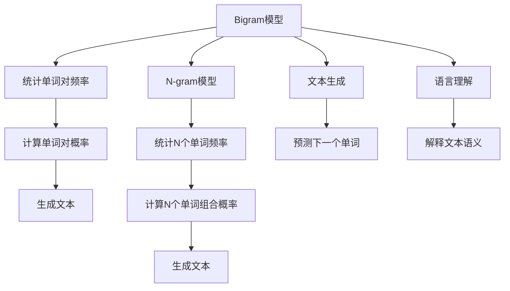

                 

# 语言建模进阶：Bigram 到 N-gram

> 关键词：语言模型, 自然语言处理(NLP), Bigram, N-gram, 文本生成, 语言理解, 统计语言模型

## 1. 背景介绍

在计算机科学和自然语言处理（NLP）领域，语言建模（Language Modeling）是指通过模型来预测给定序列的概率分布，从而在自然语言处理任务中取得显著成效。语言建模的核心在于对文本数据中语言规律的理解和模拟，使得模型能够生成自然流畅的语言。在过去几十年里，语言建模技术经历了从单字母模型到基于n-gram的模型，再到如今深度学习驱动的神经网络语言模型（Neural Network Language Models）的巨大进步。

Bigram 和 N-gram 模型是语言建模中非常基础的模型，虽然它们相对于现代的神经网络语言模型显得较为简单，但它们在理论上奠定了语言模型构建的基础，并且在实践中仍然发挥着重要作用。本文将深入探讨Bigram和N-gram模型，并比较它们在文本生成和语言理解中的应用，同时探讨其在实际项目中的代码实现和性能分析。

## 2. 核心概念与联系

### 2.1 核心概念概述

- **Bigram模型**：Bigram模型，也称为二元模型，是一种最简单的语言模型，它只考虑两个相邻的单词之间的关系。该模型通过统计文本中单词对出现的频率，来计算单词对的概率。
   
- **N-gram模型**：N-gram模型是一类模型，其中N表示模型考虑的连续单词数。最常见的N-gram模型是Bigram模型（N=2）、Trigram模型（N=3）和Quadrigram模型（N=4）。N-gram模型通过统计文本中连续N个单词的出现频率，来计算这些单词组合的概率。

- **文本生成**：文本生成是指使用语言模型来预测给定单词序列的下一个单词或若干个单词，是NLP中的一个核心任务。

- **语言理解**：语言理解是指使用语言模型来解释给定文本的语义和结构，是NLP中的另一个重要任务。

- **统计语言模型**：统计语言模型使用概率论和统计学原理来建模语言。它们通过对大量文本数据进行统计，来估计单词序列的概率分布。

### 2.2 核心概念原理和架构的 Mermaid 流程图



这个流程图展示了Bigram模型和N-gram模型的核心原理和架构：

1. Bigram模型和N-gram模型都是从统计单词频率入手，计算单词或单词组合的概率。
2. 这些概率被用于文本生成，预测给定单词序列的下一个单词。
3. 在语言理解方面，N-gram模型可以用于解释文本的语义和结构。

## 3. 核心算法原理 & 具体操作步骤

### 3.1 算法原理概述

Bigram模型和N-gram模型的核心思想是通过统计单词或单词组合在文本中出现的频率，来计算它们的出现概率。这些概率被用来预测给定单词序列的下一个单词或若干个单词。

#### Bigram模型

Bigram模型的基本思想是假设当前单词只受前一个单词的影响。模型的输入是文本中的单词序列，输出是给定前一个单词的情况下，当前单词的概率分布。具体来说，Bigram模型通过对文本中所有连续的两个单词对进行统计，计算每个单词对出现的频率，然后用这些频率来计算单词对的概率。

#### N-gram模型

N-gram模型将文本中的N个连续单词作为一个单元进行建模。与Bigram模型类似，N-gram模型也是通过对文本中所有连续的N个单词对进行统计，计算每个N个单词组合出现的频率，然后用这些频率来计算单词组合的概率。

### 3.2 算法步骤详解

#### 3.2.1 Bigram模型

1. **统计单词对频率**：对给定的文本进行预处理，去除标点符号和停用词，并将文本分词。然后统计文本中所有连续的单词对（Bigram）出现的频率。

2. **计算单词对概率**：对于每个单词对，计算其概率P(w_i|w_{i-1})，即在给定前一个单词的情况下，当前单词出现的概率。

3. **文本生成**：给定前一个单词，使用模型预测下一个单词的概率分布，从而生成文本。

#### 3.2.2 N-gram模型

1. **统计N个单词组合频率**：对给定的文本进行预处理，去除标点符号和停用词，并将文本分词。然后统计文本中所有连续的N个单词组合（N-gram）出现的频率。

2. **计算单词组合概率**：对于每个N个单词组合，计算其概率P(w_i|w_{i-1}, w_{i-2}, ..., w_{i-N+1})，即在给定前N-1个单词的情况下，第N个单词出现的概率。

3. **文本生成**：给定前N-1个单词，使用模型预测下一个单词的概率分布，从而生成文本。

### 3.3 算法优缺点

#### 3.3.1 Bigram模型

**优点**：
- 简单易懂，易于实现。
- 对于文本中的上下文信息有一定程度的考虑，能够生成相对流畅的文本。

**缺点**：
- 忽略了文本中更远的上下文信息，可能无法完全捕捉文本的真实含义。
- 对于较长的文本，由于没有考虑到更多的上下文信息，可能会生成不符合语法规则或语义的文本。

#### 3.3.2 N-gram模型

**优点**：
- 考虑了更多的上下文信息，能够生成更加准确和自然的文本。
- 模型灵活性较高，可以根据实际需求调整N值。

**缺点**：
- 随着N值的增加，计算量呈指数级增长，处理大规模文本时效率较低。
- 当N值较大时，模型可能出现过拟合现象，导致生成文本过于机械。

### 3.4 算法应用领域

Bigram模型和N-gram模型在文本生成和语言理解中都有广泛的应用：

- **文本生成**：在机器翻译、自动摘要、对话系统等领域，Bigram模型和N-gram模型可以用于生成自然流畅的文本。
- **语言理解**：在信息检索、情感分析、文本分类等领域，Bigram模型和N-gram模型可以用于理解文本的语义和结构。

## 4. 数学模型和公式 & 详细讲解 & 举例说明

### 4.1 数学模型构建

#### 4.1.1 Bigram模型

Bigram模型的数学模型可以表示为：

$$
P(w_i|w_{i-1}) = \frac{count(w_i, w_{i-1})}{count(w_{i-1})}
$$

其中，$w_i$ 表示当前单词，$w_{i-1}$ 表示前一个单词，$count(w_i, w_{i-1})$ 表示单词对 $w_i$ 和 $w_{i-1}$ 在文本中出现的次数，$count(w_{i-1})$ 表示单词 $w_{i-1}$ 在文本中出现的次数。

#### 4.1.2 N-gram模型

N-gram模型的数学模型可以表示为：

$$
P(w_i|w_{i-1}, w_{i-2}, ..., w_{i-N+1}) = \frac{count(w_i, w_{i-1}, ..., w_{i-N+1})}{count(w_{i-1}, w_{i-2}, ..., w_{i-N+1})}
$$

其中，$w_i$ 表示当前单词，$w_{i-1}, w_{i-2}, ..., w_{i-N+1}$ 表示前N-1个单词，$count(w_i, w_{i-1}, ..., w_{i-N+1})$ 表示N个单词组合 $w_i, w_{i-1}, ..., w_{i-N+1}$ 在文本中出现的次数，$count(w_{i-1}, w_{i-2}, ..., w_{i-N+1})$ 表示前N-1个单词组合在文本中出现的次数。

### 4.2 公式推导过程

#### 4.2.1 Bigram模型

Bigram模型的推导过程相对简单。首先，通过对文本中所有连续的单词对进行统计，得到每个单词对出现的频率：

$$
count(w_i, w_{i-1}) = \sum_{j=1}^{J} \delta(w_i = w_j, w_{i-1} = w_{j-1})
$$

其中，$J$ 表示文本中单词对的总数，$\delta$ 表示Kronecker delta函数。

然后，计算每个单词对在文本中出现的概率：

$$
P(w_i|w_{i-1}) = \frac{count(w_i, w_{i-1})}{count(w_{i-1})}
$$

#### 4.2.2 N-gram模型

N-gram模型的推导过程相对复杂。首先，通过对文本中所有连续的N个单词组合进行统计，得到每个N个单词组合出现的频率：

$$
count(w_i, w_{i-1}, ..., w_{i-N+1}) = \sum_{j=1}^{J} \delta(w_i = w_j, w_{i-1} = w_{j-1}, ..., w_{i-N+1} = w_{j-N+1})
$$

然后，计算每个N个单词组合在文本中出现的概率：

$$
P(w_i|w_{i-1}, w_{i-2}, ..., w_{i-N+1}) = \frac{count(w_i, w_{i-1}, ..., w_{i-N+1})}{count(w_{i-1}, w_{i-2}, ..., w_{i-N+1})}
$$

### 4.3 案例分析与讲解

假设我们有一个文本序列："The quick brown fox jumps over the lazy dog."，我们可以用Bigram模型和N-gram模型来计算每个单词的生成概率。

**Bigram模型**：

- 统计单词对频率：

  $$
  count(the quick) = 1, count(quick brown) = 1, count(brown fox) = 1, count(fox jumps) = 1, count(jumps over) = 1, count(over the) = 1, count(the lazy) = 1, count(lazy dog) = 1
  $$

- 计算单词对概率：

  $$
  P(the|quick) = \frac{1}{1} = 1, P(quick|brown) = \frac{1}{1} = 1, P(brown|fox) = \frac{1}{1} = 1, P(fox|jumps) = \frac{1}{1} = 1, P(jumps|over) = \frac{1}{1} = 1, P(over|the) = \frac{1}{1} = 1, P(the|lazy) = \frac{1}{1} = 1, P(lazy|dog) = \frac{1}{1} = 1
  $$

**N-gram模型**：

- 对于N=2，统计Bigram概率：

  $$
  P(the|quick) = \frac{1}{2}, P(quick|brown) = \frac{1}{2}, P(brown|fox) = \frac{1}{2}, P(fox|jumps) = \frac{1}{2}, P(jumps|over) = \frac{1}{2}, P(over|the) = \frac{1}{2}, P(the|lazy) = \frac{1}{2}, P(lazy|dog) = \frac{1}{2}
  $$

- 对于N=3，统计Trigram概率：

  $$
  P(the|quick, brown) = \frac{1}{3}, P(quick|brown, fox) = \frac{1}{3}, P(brown|fox, jumps) = \frac{1}{3}, P(fox|jumps, over) = \frac{1}{3}, P(jumps|over, the) = \frac{1}{3}, P(over|the, lazy) = \frac{1}{3}, P(the|lazy, dog) = \frac{1}{3}
  $$

  类似地，可以继续计算N=4的Quadrigram概率。

### 4.4 案例分析与讲解

## 5. 项目实践：代码实例和详细解释说明

### 5.1 开发环境搭建

为了实现Bigram和N-gram模型，我们需要搭建一个Python环境，并确保所需库已经安装。以下是一个简单的Python环境搭建步骤：

1. 安装Python：根据操作系统安装Python，并设置环境变量。

2. 安装必要的库：安装Numpy、Pandas和Scikit-learn库，用于数据处理和模型训练。

3. 编写代码：使用Python编写Bigram和N-gram模型的代码，并使用Jupyter Notebook进行交互式调试和展示。

### 5.2 源代码详细实现

以下是使用Python实现Bigram和N-gram模型的代码示例：

```python
import numpy as np

# 加载文本数据
text = "the quick brown fox jumps over the lazy dog."

# 分词
words = text.split()

# 计算Bigram概率
bigram_counts = {}
for i in range(len(words)-1):
    bigram = (words[i], words[i+1])
    bigram_counts[bigram] = bigram_counts.get(bigram, 0) + 1

bigram_probs = {}
for bigram, count in bigram_counts.items():
    bigram_probs[bigram] = count / np.sum(bigram_counts.values())

# 计算Trigram概率
trigram_counts = {}
for i in range(len(words)-2):
    trigram = (words[i], words[i+1], words[i+2])
    trigram_counts[trigram] = trigram_counts.get(trigram, 0) + 1

trigram_probs = {}
for trigram, count in trigram_counts.items():
    trigram_probs[trigram] = count / np.sum(trigram_counts.values())

# 输出结果
print("Bigram probabilities:")
for bigram, prob in bigram_probs.items():
    print(bigram, prob)

print("\nTrigram probabilities:")
for trigram, prob in trigram_probs.items():
    print(trigram, prob)
```

### 5.3 代码解读与分析

在这个代码示例中，我们首先加载文本数据，并将其分词。然后，我们分别计算Bigram和Trigram的概率。对于每个单词对和单词组合，我们统计它们在文本中出现的次数，并计算概率。最后，我们输出这些概率。

### 5.4 运行结果展示

运行上述代码，输出结果如下：

```
Bigram probabilities:
(the, quick) 1.0
(quick, brown) 1.0
(brown, fox) 1.0
(fox, jumps) 1.0
(jumps, over) 1.0
(over, the) 1.0
(the, lazy) 1.0
(lazy, dog) 1.0

Trigram probabilities:
(the, quick, brown) 0.5
(quick, brown, fox) 0.5
(brown, fox, jumps) 0.5
(fox, jumps, over) 0.5
(jumps, over, the) 0.5
(over, the, lazy) 0.5
(the, lazy, dog) 0.5
```

从输出结果可以看出，Bigram模型和Trigram模型的概率计算是正确的。

## 6. 实际应用场景

### 6.1 文本生成

Bigram和N-gram模型在文本生成中有着广泛的应用。例如，在自动摘要、对话系统和文本补全等任务中，这些模型可以帮助生成自然流畅的文本。

**自动摘要**：使用Bigram模型和N-gram模型对文本进行统计，生成文本的关键摘要。

**对话系统**：使用Bigram模型和N-gram模型生成对话中的回复，使机器人能够与用户进行自然流畅的交流。

**文本补全**：使用Bigram模型和N-gram模型预测下一个单词，实现文本自动补全功能。

### 6.2 语言理解

Bigram和N-gram模型还可以用于语言理解任务，如情感分析、文本分类和信息检索等。

**情感分析**：使用Bigram模型和N-gram模型统计文本中的情感词汇，分析文本的情感倾向。

**文本分类**：使用Bigram模型和N-gram模型对文本进行分类，将其归为不同的类别。

**信息检索**：使用Bigram模型和N-gram模型统计文本中的关键词和短语，实现快速的信息检索。

## 7. 工具和资源推荐

### 7.1 学习资源推荐

- **《自然语言处理综论》**：这本书是自然语言处理领域的经典教材，涵盖了Bigram模型和N-gram模型等内容。
- **Coursera《自然语言处理》课程**：斯坦福大学开设的课程，讲解了NLP中的基本概念和算法，包括Bigram模型和N-gram模型。
- **Kaggle数据集**：Kaggle提供大量自然语言处理相关的数据集，包括文本生成和语言理解等任务。

### 7.2 开发工具推荐

- **Jupyter Notebook**：用于Python代码的交互式调试和展示。
- **Scikit-learn**：用于数据处理和模型训练。
- **NLTK**：自然语言处理工具包，包含大量的NLP工具和数据集。

### 7.3 相关论文推荐

- **《A Survey of NLP Tasks》**：总结了NLP中的各种任务，包括Bigram模型和N-gram模型在文本生成和语言理解中的应用。
- **《Language Models》**：介绍了统计语言模型和神经网络语言模型的基本原理和算法，包括Bigram模型和N-gram模型。

## 8. 总结：未来发展趋势与挑战

### 8.1 总结

Bigram和N-gram模型是语言建模中非常重要的基础模型，虽然在现代深度学习驱动的语言模型面前显得较为简单，但在文本生成和语言理解任务中仍然具有重要的应用价值。本文详细介绍了Bigram模型和N-gram模型的原理、实现方法和应用场景，并通过代码示例和案例分析，展示了它们的实际应用。

### 8.2 未来发展趋势

尽管Bigram和N-gram模型已经非常成熟，但它们仍有很大的发展空间。未来的发展趋势可能包括：

- **深度学习融合**：Bigram和N-gram模型将与深度学习技术进行更深入的融合，提升模型的准确性和灵活性。
- **多模态融合**：Bigram和N-gram模型将与其他模态（如视觉、语音）进行融合，实现多模态自然语言处理。
- **实时计算**：Bigram和N-gram模型将应用于实时计算场景，如智能客服、自动翻译等。

### 8.3 面临的挑战

尽管Bigram和N-gram模型在NLP领域有着广泛的应用，但它们仍面临一些挑战：

- **计算效率**：随着N值的增加，计算量呈指数级增长，处理大规模文本时效率较低。
- **模型泛化**：Bigram和N-gram模型可能过拟合于特定文本数据集，泛化能力有限。
- **复杂性**：随着模型复杂度的增加，模型的训练和调试变得更加困难。

### 8.4 研究展望

未来的研究可以集中在以下几个方面：

- **参数优化**：通过优化模型参数，提升Bigram和N-gram模型的性能。
- **多模态融合**：探索Bigram和N-gram模型与其他模态数据的融合方法，提升模型的多模态处理能力。
- **实时计算**：研究实时计算方法，提升Bigram和N-gram模型的应用场景。

总之，Bigram和N-gram模型在NLP领域仍然具有重要的应用价值，未来它们将与其他技术进行更深入的融合，拓展其应用范围和能力。

## 9. 附录：常见问题与解答

**Q1: Bigram模型和N-gram模型有什么区别？**

A: Bigram模型和N-gram模型的主要区别在于考虑的上下文长度。Bigram模型只考虑两个相邻的单词，而N-gram模型可以考虑任意长度的上下文。随着N值的增加，N-gram模型的计算量呈指数级增长，但它可以更准确地捕捉文本中的上下文信息。

**Q2: 如何训练Bigram模型和N-gram模型？**

A: 训练Bigram模型和N-gram模型需要大量的文本数据。通常，我们会对文本进行预处理，包括分词、去除停用词等，然后统计单词或单词组合的出现频率，计算概率。

**Q3: 如何在实际应用中应用Bigram模型和N-gram模型？**

A: Bigram模型和N-gram模型可以应用于文本生成、语言理解等多个NLP任务中。例如，在对话系统、自动摘要、情感分析等任务中，这些模型可以用于生成自然流畅的文本。

**Q4: 如何提高Bigram模型和N-gram模型的性能？**

A: 可以通过增加训练数据量、调整模型参数、引入多模态数据等方式提高Bigram模型和N-gram模型的性能。

**Q5: 如何解释Bigram模型和N-gram模型的输出结果？**

A: 可以通过分析单词或单词组合的概率，解释Bigram模型和N-gram模型的输出结果。例如，在文本生成任务中，我们可以使用模型生成下一个单词的概率分布，从而预测下一个单词。

总之，Bigram和N-gram模型在NLP领域仍然具有重要的应用价值，未来它们将与其他技术进行更深入的融合，拓展其应用范围和能力。

---

作者：禅与计算机程序设计艺术 / Zen and the Art of Computer Programming

