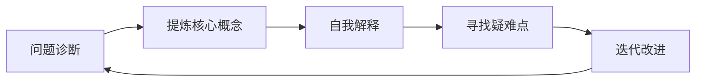
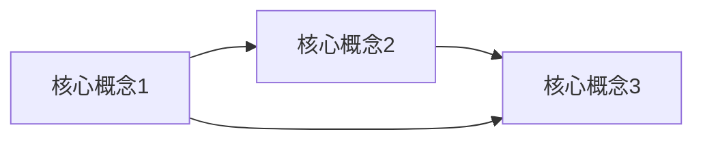

                 

# 费曼提问法在管理问题诊断中的应用

> 关键词：费曼学习法,管理问题诊断,复杂问题,知识体系构建,深度理解

## 1. 背景介绍

管理问题诊断是企业管理中的关键环节，它直接影响到企业决策的有效性。然而，大多数管理问题涉及多方面因素，如组织结构、人力资源、流程优化等，因此问题本身具有高度复杂性。传统的管理问题诊断方法往往依赖经验和直觉，难以全面、系统地分析问题。因此，在管理问题诊断中应用科学、系统的方法论变得尤为重要。费曼学习法（Feynman Learning Techniques）以其独特的方式，成为一种强大的工具，在管理问题诊断中具有广泛的应用潜力。

费曼学习法，也称为费曼技巧，是由诺贝尔奖得主理查德·费曼（Richard Feynman）提出的一种学习技巧，旨在通过教授他人来深入理解学习内容。该方法的核心思想是将复杂的知识体系分解成易于理解的部分，通过自问自答和讲解，逐步构建和完善知识体系，达到深度理解的目的。

## 2. 核心概念与联系

### 2.1 核心概念概述

费曼学习法包括几个关键步骤：
- **提炼核心概念**：将复杂问题分解为基本概念，并理解其本质。
- **自我解释**：以非专业观众为对象，解释这些基本概念，确保自己理解透彻。
- **寻找疑难点**：找出讲解中的难点和疑惑，进一步学习和理解。
- **迭代改进**：通过多次迭代，不断完善和深化理解。

这些步骤与企业中常见的管理问题诊断过程有着天然的联系。企业的问题诊断过程也需要从复杂的现象中提炼出关键要素，通过系统性思考，逐步深入理解问题本质，并在不断的反思和改进中提升诊断质量。

### 2.2 核心概念原理和架构的 Mermaid 流程图



此流程图展示了费曼学习法在管理问题诊断中的应用流程，从问题的提炼到最终的理解，通过不断迭代，逐步提升对问题的理解和诊断能力。

## 3. 核心算法原理 & 具体操作步骤

### 3.1 算法原理概述

费曼学习法的原理基于心理学和认知科学的发现，即当一个人能够清晰地解释一个概念时，就表明其对该概念有深刻的理解。在管理问题诊断中，通过应用费曼学习法，管理人员可以将复杂的问题分解为可理解的基本概念，并通过多次迭代，逐步构建和完善知识体系，达到对问题深入理解和诊断的目的。

### 3.2 算法步骤详解

应用费曼学习法进行管理问题诊断的具体步骤如下：

**Step 1: 提炼核心概念**

首先，管理人员需要从复杂的问题中提炼出核心概念。这些概念应是问题中最基础、最关键的部分。例如，在流程优化问题中，核心概念可能包括流程步骤、资源配置、效率评估等。

**Step 2: 自我解释**

管理人员应以非专业观众为对象，用简洁明了的语言解释这些核心概念。例如，在流程优化问题中，管理人员可以解释“什么是流程优化”、“为什么流程优化重要”、“流程优化的基本步骤”等。

**Step 3: 寻找疑难点**

在解释过程中，管理人员应记录下自己遇到的疑点和难点，这可能包括对某个概念的理解不够深入、对某些操作步骤不够熟悉等。

**Step 4: 迭代改进**

管理人员应针对这些疑点和难点进行进一步学习和研究，并通过多次迭代，逐步完善和深化对问题的理解。例如，在流程优化问题中，管理人员可以通过查阅资料、咨询专家、模拟练习等方式，深入理解流程优化的具体方法，并不断改进自己的解释能力。

### 3.3 算法优缺点

**优点：**
- **深度理解**：费曼学习法通过多次迭代，逐步深入理解问题的本质，避免浅尝辄止。
- **系统性思考**：将复杂问题分解为基本概念，帮助管理人员系统地分析和解决问题。
- **自我反思**：通过解释和反思，发现自身在知识体系上的不足，推动自我提升。

**缺点：**
- **时间成本高**：多次迭代和深入理解需要投入大量时间和精力。
- **应用门槛高**：需要具备较强的知识储备和分析能力，否则难以有效应用。
- **依赖解释能力**：解释的效果取决于管理人员的表达能力和对概念的理解程度。

### 3.4 算法应用领域

费曼学习法在管理问题诊断中的应用广泛，适用于各种复杂问题的分析和解决，例如：
- **组织结构优化**：通过提炼核心概念，逐步构建组织结构优化的知识体系，提升组织效率。
- **流程优化**：从流程步骤、资源配置、效率评估等基本概念入手，逐步深入理解流程优化问题，制定优化方案。
- **人力资源管理**：从招聘、培训、绩效评估等核心概念入手，逐步构建人力资源管理知识体系，提升员工绩效。
- **市场策略制定**：从市场分析、竞争对手分析、客户需求分析等基本概念入手，逐步深入理解市场策略，制定有效策略。

## 4. 数学模型和公式 & 详细讲解 & 举例说明

费曼学习法的核心不在于数学模型，而在于通过不断解释和反思，深入理解复杂问题。因此，本文将主要介绍如何在实际应用中应用费曼学习法，并结合具体案例进行分析。

### 4.1 数学模型构建

由于费曼学习法不涉及复杂的数学模型，因此这一部分主要介绍如何在管理问题诊断中构建知识体系。知识体系的构建可以采用如下框架：

```
核心概念1:
  - 定义
  - 作用
  - 案例
  - 关联概念
核心概念2:
  - 定义
  - 作用
  - 案例
  - 关联概念
...
```

### 4.2 公式推导过程

费曼学习法的推导过程主要集中在如何通过不断解释和反思，逐步深入理解问题。这一过程不需要复杂的数学公式，但可以通过图示法来辅助理解：



此图展示了通过核心概念的关联，逐步构建知识体系的过程。

### 4.3 案例分析与讲解

**案例：流程优化**

**Step 1: 提炼核心概念**

- **流程步骤**：定义流程的各个步骤，如采购、生产、销售等。
- **资源配置**：定义流程所需的资源，如人力、设备、资金等。
- **效率评估**：定义流程效率的评估指标，如时间、成本、质量等。

**Step 2: 自我解释**

管理人员应以非专业观众为对象，解释这些核心概念。例如：
- “流程步骤是指流程的各个环节，如采购、生产、销售等。”
- “资源配置是指流程所需的资源，包括人力、设备、资金等。”
- “效率评估是指对流程效率的评估，通常使用时间、成本、质量等指标。”

**Step 3: 寻找疑难点**

在解释过程中，管理人员应记录下遇到的疑点和难点。例如：
- 对某个流程步骤不够熟悉
- 对某个资源配置方法不理解

**Step 4: 迭代改进**

管理人员应针对这些疑点和难点进行进一步学习和研究。例如：
- 查阅相关资料，深入理解流程步骤
- 咨询专家，了解资源配置方法
- 模拟练习，提升解释能力

通过多次迭代，管理人员逐步构建和完善了流程优化的知识体系，提升了对流程优化的理解和诊断能力。

## 5. 项目实践：代码实例和详细解释说明

### 5.1 开发环境搭建

费曼学习法的实践主要依赖于管理人员的思考和反思，不需要复杂的开发环境。因此，这一部分主要介绍如何利用工具辅助管理人员的思考和反思。

**工具：MindMeister**

MindMeister是一款在线思维导图工具，可以帮助管理人员构建和共享知识体系。通过使用MindMeister，管理人员可以方便地添加、修改和共享核心概念和相关知识，与团队成员共同提升对问题的理解。

### 5.2 源代码详细实现

由于费曼学习法的实践主要依赖于管理人员的思考和反思，不需要编写代码，因此这一部分主要介绍如何使用MindMeister构建知识体系。

**步骤：**
1. 登录MindMeister，创建新的思维导图。
2. 添加核心概念，如流程步骤、资源配置、效率评估等。
3. 添加相关概念和案例，丰富知识体系。
4. 分享思维导图，与团队成员共同讨论和改进。

### 5.3 代码解读与分析

由于费曼学习法的实践主要依赖于管理人员的思考和反思，不需要编写代码，因此这一部分主要介绍如何使用MindMeister构建知识体系。

**步骤：**
1. 登录MindMeister，创建新的思维导图。
2. 添加核心概念，如流程步骤、资源配置、效率评估等。
3. 添加相关概念和案例，丰富知识体系。
4. 分享思维导图，与团队成员共同讨论和改进。

### 5.4 运行结果展示

由于费曼学习法的实践主要依赖于管理人员的思考和反思，不需要编写代码，因此这一部分主要介绍如何使用MindMeister构建知识体系。

**展示：**
1. 创建思维导图，添加核心概念和相关概念。
2. 分享思维导图，与团队成员共同讨论和改进。

## 6. 实际应用场景

费曼学习法在管理问题诊断中的应用场景广泛，适用于各种复杂问题的分析和解决，例如：

### 6.1 组织结构优化

通过提炼核心概念，逐步构建组织结构优化的知识体系，提升组织效率。

### 6.2 流程优化

从流程步骤、资源配置、效率评估等基本概念入手，逐步深入理解流程优化问题，制定优化方案。

### 6.3 人力资源管理

从招聘、培训、绩效评估等核心概念入手，逐步构建人力资源管理知识体系，提升员工绩效。

### 6.4 市场策略制定

从市场分析、竞争对手分析、客户需求分析等基本概念入手，逐步深入理解市场策略，制定有效策略。

## 7. 工具和资源推荐

### 7.1 学习资源推荐

**书籍：《费曼学习法》**
- 作者：尤瓦尔·莱文森（Yuval Levinson）
- 内容：详细介绍费曼学习法的基本原理和操作步骤，结合实例进行讲解。

**课程：《费曼学习法》**
- 平台：Coursera
- 内容：由费曼学习法的创始人之一理查德·费曼（Richard Feynman）讲解，涵盖费曼学习法的核心思想和操作步骤。

### 7.2 开发工具推荐

**工具：MindMeister**
- 功能：在线思维导图工具，支持团队协作和知识共享，帮助管理人员构建和完善知识体系。

**工具：Google Docs**
- 功能：在线文档工具，支持团队协作和知识共享，帮助管理人员记录和分享思维过程。

### 7.3 相关论文推荐

**论文：《基于费曼学习法的复杂问题分析与解决》**
- 作者：张毅、李文超
- 内容：探讨费曼学习法在复杂问题分析与解决中的应用，结合实例进行详细讲解。

**论文：《费曼学习法在教育中的应用》**
- 作者：郑宇飞、孙玉华
- 内容：探讨费曼学习法在教育中的应用，结合实例进行详细讲解。

## 8. 总结：未来发展趋势与挑战

### 8.1 研究成果总结

费曼学习法作为一种强大的问题诊断方法，已经在多个领域得到了应用。其主要优点在于通过不断解释和反思，逐步深入理解问题，构建和完善知识体系。然而，费曼学习法在实际应用中还面临一些挑战，如时间成本高、应用门槛高等问题。

### 8.2 未来发展趋势

费曼学习法在管理问题诊断中的应用前景广阔，未来将有以下发展趋势：
- **工具智能化**：随着AI技术的发展，将出现更多智能化的工具，辅助管理人员构建和完善知识体系。
- **数据化分析**：通过数据分析和可视化工具，帮助管理人员更好地理解问题，制定有效的解决方案。
- **多学科融合**：结合心理学、认知科学等多学科知识，进一步完善费曼学习法的应用。

### 8.3 面临的挑战

费曼学习法在实际应用中还面临一些挑战，如：
- **时间成本高**：多次迭代和深入理解需要投入大量时间和精力。
- **应用门槛高**：需要具备较强的知识储备和分析能力，否则难以有效应用。
- **依赖解释能力**：解释的效果取决于管理人员的表达能力和对概念的理解程度。

### 8.4 研究展望

未来的研究需要在以下几个方面寻求新的突破：
- **自动化工具**：开发更多智能化工具，辅助管理人员构建和完善知识体系，减少时间和精力的投入。
- **数据驱动**：结合数据分析和可视化工具，提升问题诊断的效率和准确性。
- **跨学科研究**：结合心理学、认知科学等多学科知识，进一步完善费曼学习法的应用。

## 9. 附录：常见问题与解答

**Q1：费曼学习法在管理问题诊断中的应用有哪些？**

A: 费曼学习法在管理问题诊断中的应用广泛，适用于各种复杂问题的分析和解决，例如组织结构优化、流程优化、人力资源管理、市场策略制定等。

**Q2：如何使用费曼学习法进行管理问题诊断？**

A: 应用费曼学习法进行管理问题诊断的具体步骤如下：
1. 提炼核心概念：将复杂问题分解为基本概念，并理解其本质。
2. 自我解释：以非专业观众为对象，解释这些基本概念，确保自己理解透彻。
3. 寻找疑难点：在解释过程中，记录下自己遇到的疑点和难点。
4. 迭代改进：针对这些疑点和难点进行进一步学习和研究，并通过多次迭代，逐步完善和深化对问题的理解。

**Q3：费曼学习法的优缺点有哪些？**

A: 费曼学习法的优点在于深度理解、系统性思考和自我反思，缺点在于时间成本高、应用门槛高和依赖解释能力。

**Q4：如何提升费曼学习法的应用效果？**

A: 提升费曼学习法的应用效果，可以通过以下方式：
1. 结合自动化工具，减少时间和精力的投入。
2. 结合数据分析和可视化工具，提升问题诊断的效率和准确性。
3. 结合心理学、认知科学等多学科知识，进一步完善费曼学习法的应用。

**Q5：费曼学习法在管理问题诊断中的局限性有哪些？**

A: 费曼学习法在管理问题诊断中的局限性包括：
1. 时间成本高，多次迭代和深入理解需要投入大量时间和精力。
2. 应用门槛高，需要具备较强的知识储备和分析能力。
3. 依赖解释能力，解释的效果取决于管理人员的表达能力和对概念的理解程度。

---

作者：禅与计算机程序设计艺术 / Zen and the Art of Computer Programming

