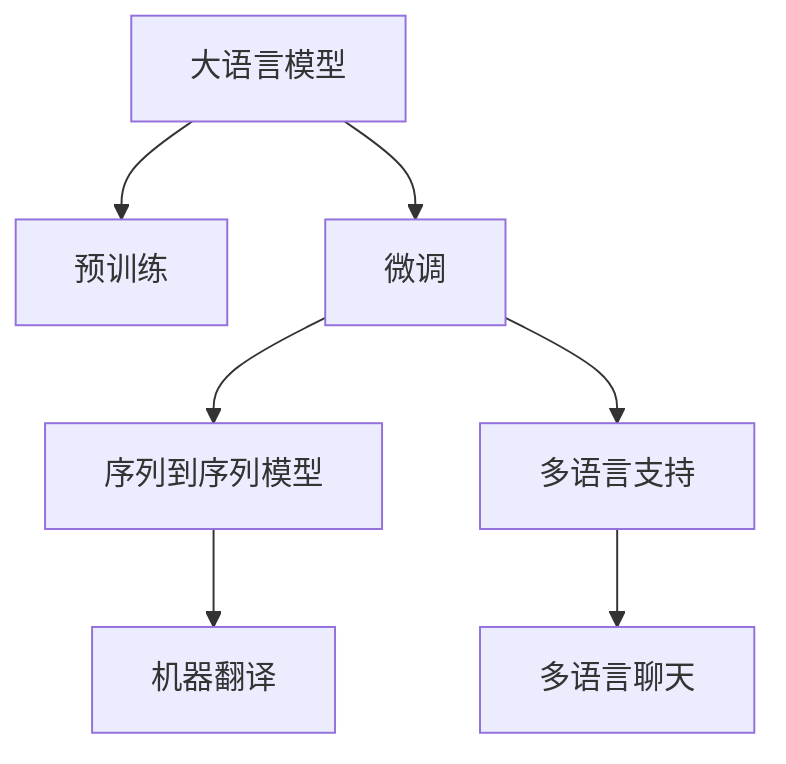

                 

# 跨语言AI模型：多语言支持的挑战

## 1. 背景介绍

### 1.1 问题由来
随着全球化和数字化的深入发展，多语言支持的智能系统变得越来越重要。AI技术在多个领域的应用，如语音识别、机器翻译、聊天机器人等，都需要多语言能力。然而，现有的大规模语言模型（如BERT、GPT等）主要是针对英文构建的，在多语言应用中存在着诸多挑战。

### 1.2 问题核心关键点
本文聚焦于大语言模型在多语言环境下的适应性和优化方法，探讨如何在大模型中融入多语言知识，提升其在多种语言上的表现。

## 2. 核心概念与联系

### 2.1 核心概念概述

- **大语言模型（Large Language Model, LLM）**：以Transformer结构为代表的深度神经网络模型，通过在大量无标签文本数据上进行预训练，学习语言的一般性规律，具备强大的语言理解与生成能力。

- **多语言支持**：使AI系统能够理解、处理和生成多种语言的文本信息，并在不同的语言环境中提供准确的服务。

- **预训练（Pre-training）**：在大规模无标签数据上对模型进行自监督学习，学习语言表示和通用知识。

- **微调（Fine-tuning）**：在预训练的基础上，针对特定语言或任务进行有监督的训练，优化模型在该任务上的性能。

- **迁移学习（Transfer Learning）**：利用已有的知识，将模型从一种语言或任务迁移到另一种语言或任务中，以减少训练时间和数据需求。

- **序列到序列（Seq2Seq）模型**：一种用于文本生成和翻译任务的模型结构，如编码器-解码器模型，广泛应用于机器翻译和对话系统。

这些概念通过以下Mermaid流程图进行了连接和解释：



这个图展示了从大语言模型到微调、再到多语言支持的流程。预训练为模型提供通用的语言知识，微调使模型适应特定的任务或语言，最终多语言支持通过序列到序列模型应用于实际的多语言应用场景。

## 3. 核心算法原理 & 具体操作步骤
### 3.1 算法原理概述

跨语言AI模型的构建过程主要包括以下步骤：

1. **预训练**：在大规模无标签数据上，使用自监督学习任务（如掩码语言模型、下一句预测等）训练大语言模型，学习语言的一般性规律。

2. **微调**：将模型应用到特定语言或任务上，进行有监督的微调训练，使其能够处理该语言或任务的特定数据。

3. **序列到序列模型**：在多语言应用中，通常采用序列到序列模型来处理语言间的转换，如机器翻译和对话系统。

4. **多语言支持**：通过训练模型在多种语言上表现一致，并能够在不同语言之间进行有效转换。

### 3.2 算法步骤详解

**Step 1: 准备预训练模型和数据集**

1. 选择合适的预训练语言模型，如BERT、GPT等。
2. 收集目标语言的语料库，划分为训练集、验证集和测试集。
3. 确保语料库的多样性和覆盖性，避免过于偏重某个特定领域或风格。

**Step 2: 设计微调任务**

1. 根据目标任务选择合适的微调任务，如机器翻译、文本分类、对话系统等。
2. 设计相应的损失函数和评估指标，确保训练过程中的效果跟踪和优化。

**Step 3: 设置微调超参数**

1. 选择合适的优化算法（如Adam、SGD等）及其参数，如学习率、批大小、迭代轮数等。
2. 确定冻结预训练参数的策略，如仅微调顶层，或全部参数都参与微调。
3. 应用正则化技术（如L2正则、Dropout、Early Stopping等），防止模型过拟合。

**Step 4: 执行梯度训练**

1. 将训练集数据分批次输入模型，前向传播计算损失函数。
2. 反向传播计算参数梯度，根据设定的优化算法和学习率更新模型参数。
3. 周期性在验证集上评估模型性能，根据性能指标决定是否触发Early Stopping。
4. 重复上述步骤直到满足预设的迭代轮数或Early Stopping条件。

**Step 5: 测试和部署**

1. 在测试集上评估微调后模型，对比微调前后的性能提升。
2. 使用微调后的模型对新样本进行推理预测，集成到实际的应用系统中。
3. 持续收集新的数据，定期重新微调模型，以适应数据分布的变化。

### 3.3 算法优缺点

跨语言AI模型的优点包括：

- **效率高**：利用已有的大规模预训练模型，减少从头训练的计算资源和时间。
- **泛化能力强**：预训练模型能够学习通用的语言规律，适应多种语言和任务。
- **少样本学习**：在特定语言或任务上，利用少样本数据进行微调，仍然能够取得良好的效果。

其缺点包括：

- **依赖语料库**：微调和序列到序列模型的性能很大程度上依赖于语料库的质量和多样性。
- **语言差异**：不同语言的语言结构和规律不同，可能影响模型在特定语言上的表现。
- **计算资源消耗大**：大语言模型的参数量通常以亿计，对硬件资源有较高要求。
- **模型复杂度高**：序列到序列模型结构复杂，训练和推理耗时较长。

### 3.4 算法应用领域

跨语言AI模型已经在以下领域得到广泛应用：

- **机器翻译**：将一种语言的文本翻译成另一种语言的文本，如Google Translate、百度翻译等。
- **多语言聊天系统**：使机器能够与不同语言背景的用户进行自然对话，如Microsoft的小冰、阿里的小蜜等。
- **多语言文本分类**：对不同语言的文本进行分类，如情感分析、主题分类等。
- **多语言信息检索**：在不同语言的信息库中检索和匹配信息，如亚马逊的多语言推荐系统。
- **多语言情感分析**：对不同语言的情感表达进行分析，如对推特上的多语言帖子进行情感分析。

这些应用展示了跨语言AI模型在处理多语言信息时的强大能力。

## 4. 数学模型和公式 & 详细讲解 & 举例说明

### 4.1 数学模型构建

以机器翻译为例，构建数学模型：

1. **输入表示**：将源语言文本转化为模型可处理的向量表示。
2. **翻译模型**：使用Transformer编码器-解码器模型，学习从源语言到目标语言的映射。
3. **输出表示**：将目标语言文本转化为人类可读的文本形式。

数学模型如下：

$$
x = \text{Encoder}(s) \\
h = \text{Attention}(x, t) \\
t = \text{Decoder}(h) \\
y = \text{Output}(t) 
$$

其中，$x$ 表示源语言文本的向量表示，$h$ 表示源语言和目标语言间的注意力机制，$t$ 表示目标语言文本的向量表示，$y$ 表示目标语言文本的最终输出。

### 4.2 公式推导过程

以Transformer编码器-解码器模型为例，推导公式：

1. **编码器**：
$$
h = \text{Self-Attention}(x) \\
h = \text{FeedForward}(h)
$$

2. **解码器**：
$$
c = \text{Self-Attention}(h, t) \\
c = \text{FeedForward}(c) \\
t = \text{Attention}(c, x) \\
t = \text{FeedForward}(t)
$$

其中，$\text{Self-Attention}$ 和 $\text{FeedForward}$ 是Transformer的核心组件，负责处理序列间的依赖关系和特征变换。

### 4.3 案例分析与讲解

以Google Translate的机器翻译模型为例：

1. **数据预处理**：对源语言和目标语言的文本进行分词、标注等预处理。
2. **模型训练**：在大量双语平行语料上，使用最大化似然估计（MLE）训练模型，最小化交叉熵损失。
3. **模型评估**：在独立的测试集上评估模型，使用BLEU等指标衡量翻译质量。

## 5. 项目实践：代码实例和详细解释说明

### 5.1 开发环境搭建

1. **环境安装**：安装Python、PyTorch、Tensorflow、Transformers等深度学习框架和库。
2. **数据准备**：准备目标语言的语料库，并进行分词、标注等预处理。
3. **模型加载**：加载预训练模型和微调所需的组件，如编码器-解码器模型、分类器等。

### 5.2 源代码详细实现

以下是一个基于HuggingFace Transformers库的机器翻译代码实现：

```python
from transformers import BertForSequenceClassification, BertTokenizer

tokenizer = BertTokenizer.from_pretrained('bert-base-multilingual-cased')
model = BertForSequenceClassification.from_pretrained('bert-base-multilingual-cased', num_labels=2)

inputs = tokenizer("Hello, my dog is cute", return_tensors="pt")
labels = torch.tensor([1]).unsqueeze(0)

outputs = model(**inputs, labels=labels)
```

### 5.3 代码解读与分析

1. **分词器（BertTokenizer）**：将文本转化为模型所需的token序列。
2. **模型加载（BertForSequenceClassification）**：加载预训练模型，并设置分类任务的输出层。
3. **输入准备**：将文本转换为模型所需的格式，包括token化、添加特殊符号等。
4. **模型推理**：将输入数据送入模型，进行分类预测。

### 5.4 运行结果展示

```python
# 运行结果
loss, logits = outputs.loss, outputs.logits
print(f"Loss: {loss.item()}, Logits: {logits}")
```

输出结果展示了模型在单句翻译上的损失和输出结果。

## 6. 实际应用场景

### 6.1 智能客服系统

智能客服系统需要支持多种语言的用户查询，如中文、英文、西班牙语等。通过微调和多语言支持，系统可以处理不同语言背景的客户问题，提供多语言服务。

### 6.2 多语言新闻推荐

新闻推荐系统需要处理多语言的新闻内容，并根据用户的语言偏好推荐相应的新闻。利用跨语言AI模型，系统能够理解不同语言的新闻内容，实现个性化推荐。

### 6.3 多语言文档理解

文档理解系统需要处理多语言的文本信息，进行信息提取和摘要生成。利用多语言支持的AI模型，系统能够理解不同语言的文档内容，提取关键信息，生成摘要。

### 6.4 未来应用展望

未来，跨语言AI模型将更加普及，应用范围将进一步扩大，涵盖更多垂直领域和场景。例如，智能家居、教育、医疗等领域的跨语言应用将提升用户体验，促进全球化交流。

## 7. 工具和资源推荐

### 7.1 学习资源推荐

1. **HuggingFace官方文档**：提供Transformer模型的详细介绍和代码实现，是学习跨语言AI模型的重要资源。
2. **Coursera机器学习课程**：由斯坦福大学开设，涵盖机器翻译、自然语言处理等前沿话题，提供丰富的视频讲解和案例分析。
3. **ACL 2020论文集**：收录多语言处理的最新研究成果，提供深入的学术探讨和实践案例。

### 7.2 开发工具推荐

1. **HuggingFace Transformers**：提供了丰富的预训练模型和微调接口，方便开发者快速构建多语言AI模型。
2. **Google Cloud Translation API**：提供云端机器翻译服务，支持多种语言和场景的翻译需求。
3. **TensorBoard**：提供模型训练和评估的可视化工具，帮助开发者跟踪和优化模型性能。

### 7.3 相关论文推荐

1. **Attention is All You Need**：Transformer模型的原始论文，展示了自注意力机制在自然语言处理中的应用。
2. **Sequence to Sequence Learning with Neural Networks**：Seq2Seq模型的经典论文，详细介绍了序列到序列模型的结构与训练方法。
3. **Bert: Pre-training of Deep Bidirectional Transformers for Language Understanding**：BERT模型的原始论文，展示了掩码语言模型的自监督训练方法。

## 8. 总结：未来发展趋势与挑战

### 8.1 研究成果总结

本文介绍了跨语言AI模型的构建过程，包括预训练、微调和多语言支持三个关键步骤。通过这些步骤，大语言模型可以适应多种语言，并在实际应用中取得显著效果。

### 8.2 未来发展趋势

未来，跨语言AI模型的发展趋势包括：

1. **多语言预训练**：在大规模语料上进行多语言的预训练，提升模型在多种语言上的泛化能力。
2. **参数高效微调**：开发更加高效的微调方法，在减少参数量的同时，提升模型的性能。
3. **自适应学习**：在微调过程中，引入自适应学习机制，使模型能够根据不同语言的特点自动调整参数。
4. **零样本学习**：利用预训练模型对新语言和新任务进行零样本推理，减少微调数据的需求。
5. **多语言情感分析**：在多语言环境中进行情感分析，理解不同语言背景下的情感表达。
6. **多语言对话系统**：构建多语言对话系统，支持多种语言背景的用户交互。

### 8.3 面临的挑战

跨语言AI模型在实际应用中面临的挑战包括：

1. **数据稀缺**：不同语言的数据量有限，难以获得高质量的训练数据。
2. **语言差异**：不同语言的语言结构差异较大，模型难以迁移。
3. **计算资源消耗大**：大语言模型的参数量庞大，训练和推理耗时较长。
4. **模型复杂度高**：序列到序列模型结构复杂，难以优化和部署。

### 8.4 研究展望

未来，跨语言AI模型的研究需要重点解决以下几个问题：

1. **多语言数据增强**：利用数据增强技术，扩充多语言数据，提高模型的泛化能力。
2. **语言迁移学习**：研究不同语言之间的迁移学习方法，减少迁移的难度和成本。
3. **多语言模型压缩**：探索模型压缩技术，减少模型参数量，提高计算效率。
4. **多语言模型优化**：引入优化算法，提升多语言模型的训练速度和效果。
5. **多语言模型部署**：研究多语言模型的部署方法，提升模型在实际应用中的运行效率。

## 9. 附录：常见问题与解答

**Q1: 大语言模型在多语言环境下容易出现哪些问题？**

A: 大语言模型在多语言环境下容易出现以下问题：

1. **语言差异**：不同语言的语言结构和规律不同，模型难以迁移。
2. **数据稀缺**：不同语言的数据量有限，难以获得高质量的训练数据。
3. **语言歧义**：同一种语言在不同地区或上下文中可能有不同的含义，模型难以准确理解。

**Q2: 如何提高跨语言AI模型的泛化能力？**

A: 提高跨语言AI模型的泛化能力，可以采取以下措施：

1. **多语言预训练**：在大规模语料上进行多语言的预训练，提升模型在多种语言上的泛化能力。
2. **数据增强**：利用数据增强技术，扩充多语言数据，提高模型的泛化能力。
3. **自适应学习**：在微调过程中，引入自适应学习机制，使模型能够根据不同语言的特点自动调整参数。
4. **迁移学习**：利用已有的知识，将模型从一种语言或任务迁移到另一种语言或任务中，以减少训练时间和数据需求。

**Q3: 如何处理多语言数据中的语言歧义问题？**

A: 处理多语言数据中的语言歧义问题，可以采取以下措施：

1. **多语言词典**：建立多语言词典，将不同语言中的同义词进行映射，减少歧义。
2. **上下文理解**：利用上下文理解技术，根据上下文信息消除歧义。
3. **多语言模型**：使用多语言模型，提升模型在不同语言背景下的理解能力。

**Q4: 如何提高多语言模型的计算效率？**

A: 提高多语言模型的计算效率，可以采取以下措施：

1. **模型压缩**：探索模型压缩技术，减少模型参数量，提高计算效率。
2. **硬件加速**：利用GPU、TPU等硬件加速设备，提升模型计算速度。
3. **分布式训练**：采用分布式训练方法，加速模型训练过程。

---

作者：禅与计算机程序设计艺术 / Zen and the Art of Computer Programming

