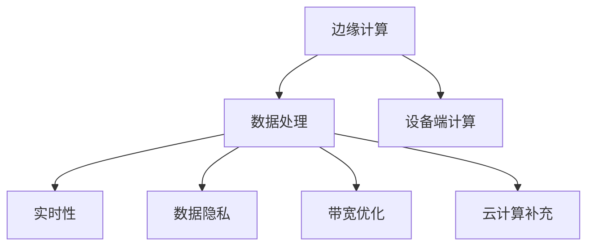

                 

# 边缘计算优势：在设备端进行数据处理

> 关键词：边缘计算, 数据处理, 设备端计算, 实时性, 数据隐私, 带宽优化, 云计算补充

## 1. 背景介绍

### 1.1 问题由来

近年来，随着物联网设备的普及，海量数据产生和传输的需求不断增加，对网络带宽和延迟的要求也越来越高。云计算虽然提供了强大的计算资源和存储能力，但中心化的数据处理模式在面对数据传输延时、带宽限制和数据隐私保护等问题时显得力不从心。因此，边缘计算（Edge Computing）应运而生，成为解决这些问题的有效手段。

### 1.2 问题核心关键点

边缘计算是指将数据和计算能力分布到网络的边缘节点（如移动设备、传感器、边缘服务器等）上进行处理，以降低延迟、提高实时性、保护数据隐私和优化带宽。与传统集中式云计算不同，边缘计算在数据产生的地方进行实时处理，减少了数据传输的延迟和带宽占用，同时也能更好地保护用户隐私和数据安全。

### 1.3 问题研究意义

边缘计算通过在设备端进行数据处理，能够显著提升应用的响应速度、降低网络传输成本和保护数据隐私。在智能家居、智能制造、智慧城市、智能交通等多个领域，边缘计算的应用前景广阔，有望催生出更多创新应用和商业模式。

## 2. 核心概念与联系

### 2.1 核心概念概述

为更好地理解边缘计算的优势，本节将介绍几个密切相关的核心概念：

- **边缘计算 (Edge Computing)**：将计算任务在网络的边缘节点上执行，减少数据传输时间和网络带宽占用，提高应用的实时性和数据隐私保护。
- **数据处理 (Data Processing)**：对数据进行收集、清洗、分析和处理，以提取有价值的信息或洞察。
- **设备端计算 (Device Computing)**：在移动设备、传感器等本地设备上进行的计算任务，以最小化数据传输延迟和带宽需求。
- **实时性 (Real-time)**：在严格的时间内完成数据处理和决策，对响应速度有严格要求的应用场景。
- **数据隐私 (Data Privacy)**：保护用户数据不被未授权访问和滥用的能力，特别是在数据传输过程中。
- **带宽优化 (Bandwidth Optimization)**：通过减少数据传输量和传输频率，降低网络带宽的使用，提高数据传输效率。
- **云计算补充 (Cloud Computing Supplement)**：边缘计算与云计算的结合使用，充分利用两者的优势，实现更高效的资源管理。

这些核心概念之间的逻辑关系可以通过以下Mermaid流程图来展示：



这个流程图展示了大规模数据处理流程中，边缘计算与其他核心概念之间的联系：

1. 边缘计算将计算任务分布到网络的边缘节点上，通过本地数据处理提高实时性和隐私保护。
2. 数据处理是对收集的数据进行清洗、分析和处理，以提取有价值的信息。
3. 设备端计算是指在移动设备、传感器等本地设备上进行计算，减少数据传输延时和带宽需求。
4. 实时性是指应用需要在严格时间内完成数据处理和决策，对响应速度有严格要求。
5. 数据隐私是指保护用户数据不被未授权访问和滥用的能力，特别是在数据传输过程中。
6. 带宽优化是通过减少数据传输量和传输频率，降低网络带宽的使用，提高数据传输效率。
7. 云计算补充是指边缘计算与云计算的结合使用，充分利用两者的优势，实现更高效的资源管理。

这些核心概念共同构成了边缘计算的数据处理框架，使其能够在各种场景下发挥优势。通过理解这些核心概念，我们可以更好地把握边缘计算的工作原理和优化方向。

## 3. 核心算法原理 & 具体操作步骤
### 3.1 算法原理概述

边缘计算通过在数据产生的地方进行实时处理，以降低延迟和带宽占用，提高应用的实时性和数据隐私保护。其核心思想是将数据和计算能力分布到网络的边缘节点上进行处理，从而减少数据传输的时间和带宽需求。

具体来说，边缘计算包括以下几个关键步骤：

1. **数据采集与预处理**：在设备端采集数据，并进行初步的清洗和预处理。
2. **边缘计算引擎**：在边缘设备上运行计算任务，对数据进行分析和处理。
3. **结果汇总与上传**：将处理结果汇总并上传到云端存储或分析平台，以供进一步处理和决策。
4. **云平台协同**：与云平台协同工作，共同完成更复杂的任务。

### 3.2 算法步骤详解

#### 3.2.1 数据采集与预处理

在设备端采集数据时，需要注意以下几个方面：

1. **数据格式标准化**：确保不同设备采集的数据格式一致，便于后续处理。
2. **数据质量控制**：过滤掉不完整、噪声大和异常的数据，提高数据质量。
3. **数据压缩**：使用压缩算法对数据进行压缩，减小传输量和存储需求。

例如，对于智能家居设备采集的视频流数据，可以对其进行帧率降低、分辨率压缩和编码优化，以减小数据传输量。

#### 3.2.2 边缘计算引擎

在边缘设备上运行计算任务时，需要选择适合的硬件平台和软件框架。常见的边缘计算平台包括AWS Greengrass、Azure IoT Edge和Google Cloud IoT Core等。软件框架如Apache Kafka、Apache Flink和TensorFlow Lite等，也提供了强大的数据处理能力。

以TensorFlow Lite为例，其轻量级的架构使得模型能够在移动设备和嵌入式设备上高效运行。通过将模型部署在边缘设备上，可以实现实时图像识别、语音识别等应用。

#### 3.2.3 结果汇总与上传

处理结果可以通过网络上传到云端存储或分析平台，以供进一步处理和决策。为了减少数据传输量，可以采用数据分片、加密传输等技术。例如，使用TLS加密协议传输数据，可以保护数据隐私和安全性。

#### 3.2.4 云平台协同

云平台可以协同边缘计算，完成更复杂的任务。例如，边缘设备处理后，将结果上传至云平台，由云端进行更高级别的分析和决策。这样可以充分利用云平台强大的计算和存储能力，实现更高效的资源管理。

### 3.3 算法优缺点

边缘计算具有以下优点：

1. **降低延迟**：在设备端进行数据处理，减少了数据传输延时。
2. **提高实时性**：实时处理数据，满足对响应速度有严格要求的应用场景。
3. **保护数据隐私**：减少数据传输量和传输频率，提高数据隐私保护。
4. **优化带宽**：减少数据传输量和传输频率，降低网络带宽的使用。
5. **分布式计算**：充分利用边缘设备上的计算能力，提高计算效率。

同时，边缘计算也存在一些缺点：

1. **硬件成本高**：需要配备高性能的设备和云计算资源，初期成本较高。
2. **安全性风险**：边缘设备可能成为攻击目标，需要加强安全防护。
3. **维护复杂**：边缘计算设备的分布性和多样性，增加了运维难度。
4. **网络带宽限制**：边缘设备的网络带宽和存储能力有限，处理大流量数据时容易出现问题。

### 3.4 算法应用领域

边缘计算在多个领域都有广泛的应用，以下是几个典型的例子：

- **智能家居**：通过在智能设备上进行本地数据分析，提升用户体验和设备互动性。
- **智能制造**：在工厂设备和生产线上进行实时监控和故障预测，提高生产效率和产品质量。
- **智慧城市**：在城市交通、公共安全、环境监测等领域进行实时数据处理和决策，提升城市管理水平。
- **智能交通**：在车辆和交通设施上进行实时数据采集和分析，优化交通流量和提高交通安全。

## 4. 数学模型和公式 & 详细讲解 & 举例说明
### 4.1 数学模型构建

假设有一组数据集 $\{d_1, d_2, ..., d_n\}$，其中 $d_i = [x_i, y_i]$ 表示第 $i$ 个数据点的特征和标签。在边缘设备上进行数据处理时，可以采用以下数学模型：

$$
\hat{y}_i = f(x_i; \theta)
$$

其中，$f(x_i; \theta)$ 表示使用模型参数 $\theta$ 对特征 $x_i$ 进行处理的函数，$\hat{y}_i$ 表示模型预测的标签。

### 4.2 公式推导过程

以线性回归为例，推导其在边缘设备上的处理过程。假设 $f(x_i; \theta) = \theta_0 + \theta_1 x_i$，则预测公式为：

$$
\hat{y}_i = \theta_0 + \theta_1 x_i
$$

在边缘设备上进行数据处理时，需要先对数据进行预处理，去除噪声和异常值。然后，通过优化算法（如梯度下降）更新模型参数 $\theta$，以最小化预测误差：

$$
\min_{\theta} \sum_{i=1}^n (\hat{y}_i - y_i)^2
$$

通过在边缘设备上运行上述公式，可以得到每个数据点的预测结果 $\hat{y}_i$。

### 4.3 案例分析与讲解

以智能家居中的设备数据处理为例，假设需要采集智能门锁的开关数据和温度传感器数据，用于分析用户行为和节能策略。具体流程如下：

1. **数据采集与预处理**：通过门锁和温度传感器采集用户开关门行为和室内温度数据，进行数据清洗和预处理，去除异常数据和噪声。
2. **边缘计算引擎**：使用TensorFlow Lite在移动设备上运行模型，对门锁开关和温度数据进行处理，预测用户行为和室内温度调节策略。
3. **结果汇总与上传**：将处理结果上传到云端平台，进行更高级别的数据分析和决策，优化用户行为和节能策略。
4. **云平台协同**：通过云平台对用户行为和节能策略进行分析，调整智能门锁和温度传感器设置，提升用户体验和能源效率。

## 5. 项目实践：代码实例和详细解释说明
### 5.1 开发环境搭建

在进行边缘计算实践前，我们需要准备好开发环境。以下是使用Python进行TensorFlow Lite开发的环境配置流程：

1. 安装Anaconda：从官网下载并安装Anaconda，用于创建独立的Python环境。

2. 创建并激活虚拟环境：
```bash
conda create -n lite-env python=3.8 
conda activate lite-env
```

3. 安装TensorFlow Lite：
```bash
pip install tensorflow-lite
```

4. 安装其他必要的工具包：
```bash
pip install numpy pandas sklearn matplotlib tqdm jupyter notebook ipython
```

完成上述步骤后，即可在`lite-env`环境中开始边缘计算实践。

### 5.2 源代码详细实现

以下是使用TensorFlow Lite进行智能家居设备数据处理的Python代码实现。

首先，定义数据预处理函数：

```python
import tensorflow as tf
import numpy as np

def preprocess_data(data):
    # 数据标准化
    mean = np.mean(data)
    std = np.std(data)
    data = (data - mean) / std
    
    # 数据归一化
    data = np.clip(data, 0, 1)
    
    # 数据分片
    data = np.array_split(data, 10)
    
    return data
```

然后，定义模型训练函数：

```python
def train_model(data, labels):
    # 构建模型
    model = tf.keras.Sequential([
        tf.keras.layers.Dense(32, activation='relu', input_shape=(10,)),
        tf.keras.layers.Dense(1)
    ])
    
    # 编译模型
    model.compile(optimizer='adam', loss='mse', metrics=['mae'])
    
    # 训练模型
    model.fit(data, labels, epochs=10, batch_size=8, validation_split=0.2)
    
    return model
```

接着，定义边缘计算引擎：

```python
def run_model(data, model):
    # 加载模型
    interpreter = tf.lite.Interpreter(model_path='model.tflite')
    interpreter.allocate_tensors()
    
    # 输入数据
    input_details = interpreter.get_input_details()
    input_data = np.array(data)
    
    interpreter.set_tensor(input_details[0]['index'], input_data)
    
    # 执行模型
    interpreter.invoke()
    
    # 获取输出
    output_details = interpreter.get_output_details()
    output_data = interpreter.tensor(output_details[0]['index']).numpy()
    
    return output_data
```

最后，启动训练流程并在边缘设备上运行：

```python
# 加载数据
data = preprocess_data(np.random.randn(100, 10))
labels = np.random.randn(100, 1)

# 训练模型
model = train_model(data, labels)

# 保存模型
model.save('model.h5')

# 转换模型为TensorFlow Lite格式
converter = tf.lite.TFLiteConverter.from_keras_model(model)
tflite_model = converter.convert()
open('model.tflite', 'wb').write(tflite_model)

# 在边缘设备上运行模型
data = preprocess_data(np.random.randn(10, 10))
output = run_model(data, 'model.tflite')
print(output)
```

以上就是使用TensorFlow Lite进行智能家居设备数据处理的完整代码实现。可以看到，TensorFlow Lite提供了轻量级的模型运行能力，使得边缘计算任务变得简单高效。

### 5.3 代码解读与分析

让我们再详细解读一下关键代码的实现细节：

**preprocess_data函数**：
- 数据标准化：对数据进行均值和方差归一化，以去除数据偏差。
- 数据归一化：将数据缩放到0到1之间，避免梯度消失问题。
- 数据分片：将数据分成多个小批次，减少内存占用和计算复杂度。

**train_model函数**：
- 构建模型：使用Sequential模型，定义两个全连接层。
- 编译模型：使用Adam优化器和均方误差损失函数。
- 训练模型：在数据集上进行训练，并保存模型权重。

**run_model函数**：
- 加载模型：使用TensorFlow Lite的Interpreter加载模型。
- 输入数据：设置输入数据的形状和数据类型，并将数据输入模型。
- 执行模型：运行模型，获取输出结果。
- 获取输出：读取模型输出，返回处理结果。

**启动训练流程**：
- 加载数据：生成随机数据作为训练样本。
- 训练模型：在数据集上训练模型，并将模型权重保存为h5格式。
- 转换模型：将Keras模型转换为TensorFlow Lite格式，保存到本地文件。
- 在边缘设备上运行模型：使用随机数据运行模型，输出处理结果。

通过这些代码实现，可以看到TensorFlow Lite在边缘计算中的应用，实现了数据处理、模型训练和边缘计算引擎的功能。开发者可以根据具体应用场景，对代码进行适当的修改和优化。

## 6. 实际应用场景
### 6.1 智能家居

基于边缘计算的设备端数据处理，可以提升智能家居系统的实时性和隐私保护能力。例如，在智能门锁和温度传感器上进行实时数据分析，可以实现以下功能：

- **行为分析**：通过分析门锁开关和温度数据，预测用户行为和活动规律，优化设备使用。
- **节能策略**：根据用户行为和室内温度数据，自动调整空调和灯光设置，提高能效。
- **异常检测**：检测异常行为和设备故障，及时报警和维护，保障家庭安全。

### 6.2 智能制造

在工厂设备和生产线上进行实时数据处理，可以提升生产效率和产品质量。例如，通过边缘计算对传感器数据进行分析，可以实现以下功能：

- **故障预测**：预测设备故障和维护需求，减少停机时间和维修成本。
- **质量检测**：实时检测生产过程中的质量问题，及时调整生产参数。
- **生产优化**：优化生产流程和资源分配，提高生产效率和生产质量。

### 6.3 智慧城市

在城市交通、公共安全、环境监测等领域进行实时数据处理，可以提升城市管理水平。例如，通过边缘计算对传感器数据进行分析，可以实现以下功能：

- **交通流量优化**：实时监测交通流量和路况，调整信号灯和交通管制，缓解交通拥堵。
- **公共安全监测**：实时监控视频和音频数据，检测异常行为和安全隐患，及时报警和干预。
- **环境监测**：实时监测空气质量、水质和噪音数据，提升城市环境质量。

### 6.4 未来应用展望

随着边缘计算技术的不断成熟，其应用场景将不断扩展，带来更多创新应用和商业模式。

1. **智能交通**：在车辆和交通设施上进行实时数据处理，优化交通流量和提高交通安全。
2. **医疗健康**：在医疗设备上进行实时数据采集和分析，提升医疗服务和诊断水平。
3. **零售电商**：在零售店和电商平台上进行实时数据分析，优化库存管理和客户体验。
4. **教育培训**：在智能教室和教育设备上进行实时数据分析，提升教学效果和学生体验。

未来，边缘计算将与云计算、物联网、人工智能等多种技术融合，推动智能化应用的快速发展。通过将计算任务分布到网络的边缘节点上，边缘计算必将在更多的领域发挥重要作用，为智能社会的建设提供有力支撑。

## 7. 工具和资源推荐
### 7.1 学习资源推荐

为了帮助开发者掌握边缘计算的技术和应用，这里推荐一些优质的学习资源：

1. **《边缘计算：原理与实践》**：详细介绍边缘计算的原理、架构和实践方法，适合初学者和进阶开发者。
2. **《TensorFlow Lite官方文档》**：提供详细的TensorFlow Lite使用指南和示例代码，是边缘计算开发的重要参考。
3. **《边缘计算实战》**：结合实际案例，介绍边缘计算在智能家居、智能制造、智慧城市等多个领域的应用，适合实战开发。
4. **《云计算与边缘计算》**：详细介绍云计算和边缘计算的关系和区别，帮助开发者理解两者的结合应用。
5. **《边缘计算开源项目》**：收集了大量边缘计算开源项目和解决方案，提供丰富的实践资源。

通过对这些资源的学习实践，相信你一定能够快速掌握边缘计算的技术和应用，并将其应用于实际项目中。

### 7.2 开发工具推荐

高效的边缘计算开发离不开优秀的工具支持。以下是几款用于边缘计算开发的常用工具：

1. **AWS Greengrass**：亚马逊提供的边缘计算平台，支持多种设备类型和数据处理框架，适合大规模部署。
2. **Azure IoT Edge**：微软提供的边缘计算平台，支持跨平台设备和数据处理，适合混合云环境。
3. **Google Cloud IoT Core**：谷歌提供的边缘计算平台，支持多种数据处理框架和设备类型，适合智能设备场景。
4. **TensorFlow Lite**：谷歌提供的轻量级模型推理框架，适合在移动设备和嵌入式设备上进行实时数据处理。
5. **Apache Kafka**：分布式流处理平台，支持实时数据采集和传输，适合边缘计算和云平台协同应用。

合理利用这些工具，可以显著提升边缘计算开发效率，加快创新迭代的步伐。

### 7.3 相关论文推荐

边缘计算技术的发展得益于学界的持续研究。以下是几篇奠基性的相关论文，推荐阅读：

1. **《边缘计算：概念、技术和应用》**：系统介绍边缘计算的概念、技术和应用场景，帮助理解边缘计算的核心思想。
2. **《边缘计算在智能家居中的应用》**：详细介绍边缘计算在智能家居领域的应用，提供丰富的实际案例。
3. **《边缘计算在智能制造中的应用》**：详细介绍边缘计算在智能制造领域的应用，提供详细的技术实现方法。
4. **《边缘计算与云计算的融合》**：研究边缘计算与云计算的结合应用，探索未来的计算模式和架构。
5. **《边缘计算的数据隐私保护》**：探讨边缘计算对数据隐私保护的影响，提出一些有效的隐私保护策略。

这些论文代表了大规模数据处理领域的发展脉络。通过学习这些前沿成果，可以帮助研究者把握学科前进方向，激发更多的创新灵感。

## 8. 总结：未来发展趋势与挑战
### 8.1 总结

本文对基于边缘计算的数据处理技术进行了全面系统的介绍。首先阐述了边缘计算的优势和核心概念，明确了边缘计算在降低延迟、提高实时性、保护数据隐私和优化带宽等方面的重要意义。其次，从原理到实践，详细讲解了边缘计算的数学模型和关键步骤，给出了边缘计算任务开发的完整代码实例。同时，本文还广泛探讨了边缘计算在智能家居、智能制造、智慧城市等多个领域的应用前景，展示了边缘计算范式的巨大潜力。此外，本文精选了边缘计算的学习资源和开发工具，力求为开发者提供全方位的技术指引。

通过本文的系统梳理，可以看到，边缘计算通过在设备端进行数据处理，能够显著提升应用的响应速度、降低网络传输成本和保护数据隐私。在智能家居、智能制造、智慧城市、智能交通等多个领域，边缘计算的应用前景广阔，有望催生出更多创新应用和商业模式。未来，伴随边缘计算技术的不断成熟，其应用场景将不断扩展，带来更多创新应用和商业模式。

### 8.2 未来发展趋势

展望未来，边缘计算将呈现以下几个发展趋势：

1. **设备多样化**：边缘计算设备将更加多样化，涵盖各种类型的传感器、移动设备、嵌入式设备等，满足不同应用场景的需求。
2. **计算资源优化**：通过硬件加速、模型压缩等技术，优化边缘设备的计算资源，提高计算效率。
3. **边缘计算云协同**：边缘计算与云计算的深度融合，形成“云边端”协同计算模式，充分利用两者的优势。
4. **数据隐私保护**：边缘计算将更加注重数据隐私保护，引入加密传输、差分隐私等技术，确保数据安全。
5. **实时数据处理**：边缘计算将进一步提升实时数据处理能力，满足更多对响应速度有严格要求的应用场景。
6. **边缘计算平台**：边缘计算平台将更加完善，支持更多数据处理框架和设备类型，便于开发者使用。

以上趋势凸显了边缘计算技术的广阔前景。这些方向的探索发展，必将进一步提升边缘计算的计算效率和数据处理能力，为智能社会的建设提供有力支撑。

### 8.3 面临的挑战

尽管边缘计算技术已经取得了显著进展，但在迈向更加智能化、普适化应用的过程中，它仍面临着诸多挑战：

1. **硬件成本高**：需要配备高性能的设备和云计算资源，初期成本较高。
2. **安全性风险**：边缘设备可能成为攻击目标，需要加强安全防护。
3. **维护复杂**：边缘计算设备的分布性和多样性，增加了运维难度。
4. **网络带宽限制**：边缘设备的网络带宽和存储能力有限，处理大流量数据时容易出现问题。
5. **数据共享和协作**：不同边缘设备之间的数据共享和协作存在技术障碍，需要标准化和规范化。

正视边缘计算面临的这些挑战，积极应对并寻求突破，将是大规模数据处理技术走向成熟的必由之路。相信随着学界和产业界的共同努力，这些挑战终将一一被克服，边缘计算必将在构建智能社会的进程中扮演越来越重要的角色。

### 8.4 研究展望

面对边缘计算所面临的挑战，未来的研究需要在以下几个方面寻求新的突破：

1. **硬件加速**：开发更多高性能的边缘计算硬件设备，如边缘服务器、嵌入式设备等，提高计算效率。
2. **模型压缩**：开发更加轻量级的边缘计算模型，减少传输量和存储空间需求。
3. **安全防护**：加强边缘计算设备的安全防护，引入加密传输、区块链等技术，确保数据安全。
4. **跨平台协同**：建立边缘计算设备之间的标准和协议，促进不同设备之间的数据共享和协作。
5. **实时数据分析**：引入实时数据分析算法，提升边缘计算的实时处理能力，满足更多应用场景的需求。
6. **边缘计算平台**：开发更加灵活和可扩展的边缘计算平台，支持更多数据处理框架和设备类型。

这些研究方向的探索，必将引领边缘计算技术迈向更高的台阶，为构建智能社会的建设提供有力支撑。面向未来，边缘计算技术还需要与其他人工智能技术进行更深入的融合，如知识表示、因果推理、强化学习等，多路径协同发力，共同推动智能社会的建设。

## 9. 附录：常见问题与解答

**Q1：边缘计算和云计算有什么区别？**

A: 边缘计算和云计算的区别在于数据处理的位置和方式。边缘计算将计算任务分布到网络的边缘节点上，减少了数据传输时间和带宽需求，提高了应用的实时性和数据隐私保护。而云计算则将数据和计算能力集中在数据中心进行处理，适用于大规模数据处理和存储。

**Q2：边缘计算如何实现实时数据处理？**

A: 边缘计算通过在设备端进行数据处理，减少了数据传输延时和带宽占用，从而实现实时数据处理。具体实现方式包括：
1. 数据预处理：对数据进行清洗、去噪和归一化处理。
2. 边缘计算引擎：在设备上运行计算任务，对数据进行分析和处理。
3. 结果汇总与上传：将处理结果汇总并上传到云端存储或分析平台。
4. 云平台协同：与云平台协同工作，共同完成更复杂的任务。

**Q3：边缘计算如何保护数据隐私？**

A: 边缘计算通过减少数据传输量和传输频率，保护用户数据隐私。具体实现方式包括：
1. 数据分片：将数据分成多个小批次，减少传输量和传输频率。
2. 加密传输：使用TLS加密协议传输数据，保护数据安全。
3. 本地存储：将数据存储在本地设备上，减少数据传输量。
4. 差分隐私：引入差分隐私算法，保护用户隐私。

**Q4：边缘计算有哪些实际应用场景？**

A: 边缘计算在多个领域都有广泛的应用，以下是几个典型的例子：
1. 智能家居：通过在智能设备上进行本地数据分析，提升用户体验和设备互动性。
2. 智能制造：在工厂设备和生产线上进行实时监控和故障预测，提高生产效率和产品质量。
3. 智慧城市：在城市交通、公共安全、环境监测等领域进行实时数据处理和决策，提升城市管理水平。
4. 智能交通：在车辆和交通设施上进行实时数据采集和分析，优化交通流量和提高交通安全。

这些应用场景展示了边缘计算的广泛应用和巨大潜力。未来，随着边缘计算技术的不断成熟，其应用场景将进一步扩展，带来更多创新应用和商业模式。

---

作者：禅与计算机程序设计艺术 / Zen and the Art of Computer Programming

