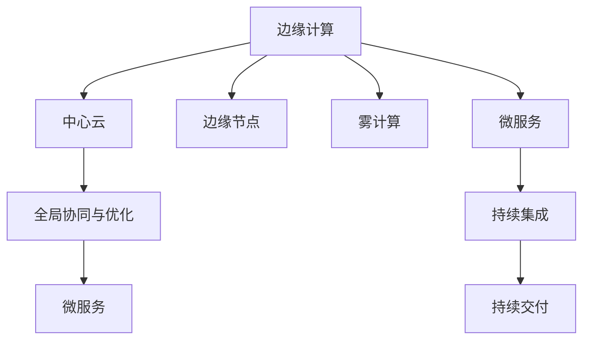

                 

# 边缘计算：5G时代的分布式处理方案

## 1. 背景介绍

### 1.1 问题由来

在过去几十年中，互联网和移动通信技术飞速发展，极大地改变了人们的生活方式和工作方式。互联网时代，数据处理、存储、传输都集中在云端，但随着万物互联的普及，海量数据和应用需要实时响应，对带宽和延迟要求日益增高。传统云计算中心难以满足高延迟、低带宽的应用场景，例如无人驾驶、智能制造、智能家居等。

5G网络的出现，带来了更高的网络带宽和更低的延迟，为实时应用场景提供了可能。但与此同时，边缘计算（Edge Computing）的概念被提出，成为未来分布式计算的新趋势。边缘计算能够将数据处理和存储推近数据源，降低数据传输延迟和带宽成本，提升应用响应速度，满足实时性和可靠性要求。

### 1.2 问题核心关键点

边缘计算通过将计算资源分布到网络边缘节点，即靠近数据源的设备（如传感器、物联网终端等），实现更快速的本地数据处理和存储。边缘计算的典型架构包括中心云与边缘节点（Edge Node）两部分，其中边缘节点负责数据预处理和初步分析，中心云则负责高阶计算、数据存储和全局协同。

边缘计算的核心优势包括：

- **低延迟**：数据处理在边缘节点完成，减少了数据传输到云端的时延。
- **高可用性**：靠近用户的数据处理，提升了应用可靠性和连续性。
- **带宽节省**：边缘节点处理部分数据，减轻中心云的计算负担，降低带宽成本。
- **安全性**：数据在本地处理，减少了数据泄露风险。
- **负载均衡**：分散计算负载，提升系统整体性能。

边缘计算在5G时代尤其重要，能够有效解决云中心数据处理延迟高、带宽不足等问题，为高带宽、低延迟应用场景提供了强大的支持。

## 2. 核心概念与联系

### 2.1 核心概念概述

为了更好地理解边缘计算的原理和架构，本节将介绍几个关键概念：

- **边缘计算（Edge Computing）**：一种分布式计算范式，通过将计算资源和数据存储分布到网络边缘，提升数据处理速度和系统可靠性。
- **中心云（Cloud）**：用于集中处理大规模计算、存储和管理，提供全局协同与优化。
- **边缘节点（Edge Node）**：靠近数据源的设备或服务器，负责数据预处理和初步分析。
- **雾计算（Fog Computing）**：雾计算是边缘计算的延伸，强调本地计算与本地存储，适用于更广泛的低功耗设备。
- **微服务（Microservice）**：将应用拆分为多个独立的服务单元，提高系统灵活性和可扩展性。
- **DevOps**：DevOps文化推动了持续集成、持续交付（CI/CD）等自动化实践，提升了软件开发效率和质量。

这些概念之间的逻辑关系可以通过以下Mermaid流程图来展示：



这个流程图展示了边缘计算与相关概念之间的联系：

1. 边缘计算通过边缘节点将计算资源推近数据源。
2. 中心云用于集中处理大规模计算、存储和管理，提供全局协同与优化。
3. 微服务将应用拆分为独立的服务单元，提高系统灵活性和可扩展性。
4. DevOps文化推动了自动化实践，提升了软件开发效率和质量。

这些概念共同构成了边缘计算的计算和协作框架，为分布式处理提供了基础支持。

## 3. 核心算法原理 & 具体操作步骤

### 3.1 算法原理概述

边缘计算的算法原理基于分布式计算模型，将数据和计算任务分布在网络边缘的多个节点上。主要涉及以下几个关键步骤：

1. **数据划分与调度**：将大规模数据划分为多个子集，根据数据大小和处理能力，分配到不同边缘节点进行处理。
2. **本地计算与预处理**：边缘节点对本地数据进行初步计算和处理，如数据清洗、特征提取、预训练等。
3. **边缘节点间协作**：边缘节点之间通过网络进行通信，协调数据和计算资源，实现并行处理。
4. **中心云协同**：中心云负责全局协同与优化，解决边缘节点间的计算冲突和数据同步问题。
5. **最终数据聚合**：边缘节点将处理结果汇总至中心云，进行全局分析与优化，得到最终处理结果。

### 3.2 算法步骤详解

边缘计算的实现步骤如下：

**Step 1: 数据划分与调度**

- **数据划分**：根据数据量大小和边缘节点的处理能力，将大规模数据划分为多个子集。
- **任务分配**：将数据划分后的子任务分配给各个边缘节点。

**Step 2: 本地计算与预处理**

- **数据预处理**：边缘节点对本地数据进行清洗、去噪、特征提取等预处理。
- **本地计算**：边缘节点对预处理后的数据进行初步计算，如模型训练、特征分析等。

**Step 3: 边缘节点间协作**

- **通信机制**：边缘节点之间通过网络进行通信，交换中间结果和控制信息。
- **协同计算**：边缘节点之间协同进行并行计算，提升整体处理能力。

**Step 4: 中心云协同**

- **全局优化**：中心云负责全局协同与优化，解决边缘节点间的计算冲突和数据同步问题。
- **结果汇总**：中心云将边缘节点处理结果汇总，进行全局分析与优化。

**Step 5: 最终数据聚合**

- **结果合并**：将中心云汇总的结果进行合并，得到最终处理结果。
- **数据存储**：将最终结果存储在中心云或边缘节点上，供后续使用。

### 3.3 算法优缺点

边缘计算具有以下优点：

- **低延迟**：数据处理在边缘节点完成，减少了数据传输到云端的时延。
- **高可用性**：靠近用户的数据处理，提升了应用可靠性和连续性。
- **带宽节省**：边缘节点处理部分数据，减轻中心云的计算负担，降低带宽成本。
- **安全性**：数据在本地处理，减少了数据泄露风险。
- **负载均衡**：分散计算负载，提升系统整体性能。

但同时，边缘计算也存在一些局限：

- **边缘节点部署成本高**：需要额外的硬件设备和服务，初期部署成本较高。
- **边缘节点管理复杂**：边缘节点的监控、维护和管理工作复杂，需要专门的运维团队。
- **数据一致性难以保证**：边缘节点之间数据同步和协同处理，可能会影响数据一致性。
- **边缘节点资源有限**：受限于设备计算能力和存储空间，处理能力有限。

### 3.4 算法应用领域

边缘计算在多个领域都有广泛应用，例如：

- **智能制造**：通过边缘计算实现实时监控和数据分析，提升生产效率和质量。
- **智能家居**：实时处理家庭数据，提升家居体验和安全性。
- **智能交通**：实时处理交通数据，优化交通流量和事故处理。
- **智慧城市**：实时处理城市数据，提升城市管理效率和居民生活水平。
- **医疗健康**：实时处理医疗数据，提升医疗诊断和健康管理水平。
- **工业物联网**：实时处理工业数据，提升生产效率和设备维护水平。

## 4. 数学模型和公式 & 详细讲解 & 举例说明

### 4.1 数学模型构建

边缘计算的数学模型主要涉及数据划分、任务调度、并行计算和结果聚合等过程。假设有一组大规模数据集 $D=\{d_1, d_2, ..., d_n\}$，需要在其上执行一系列计算任务 $T=\{t_1, t_2, ..., t_m\}$。假设一共有 $k$ 个边缘节点，每个节点的计算能力为 $c_i (i=1,...,k)$，数据划分后的子集大小为 $d_{j1}, ..., d_{jm}$。

数据划分与调度的目标是最小化全局处理时间和边缘节点的计算负载。假设每个边缘节点的处理时间为 $t_i$，则全局处理时间为：

$$
T_{global} = \sum_{i=1}^k c_i \cdot t_i
$$

边缘节点间协作和中心云协同的目标是最大化并行计算效率，最小化通信开销和计算冲突。假设边缘节点间通信开销为 $C_{ij}$，中心云优化带来的额外计算时间为 $O_{ij}$，则优化目标为：

$$
T_{optim} = \min \sum_{i=1}^k \left(c_i \cdot t_i + \sum_{j=1}^m C_{ij}\right) + \sum_{i=1}^k O_{ij}
$$

### 4.2 公式推导过程

边缘计算的优化问题可以转化为以下整数规划问题：

$$
\begin{aligned}
& \min \sum_{i=1}^k \left(c_i \cdot t_i + \sum_{j=1}^m C_{ij}\right) + \sum_{i=1}^k O_{ij} \\
& \text{s.t.} \sum_{j=1}^m d_{j1} \leq c_1 \cdot t_1, \sum_{j=1}^m d_{j2} \leq c_2 \cdot t_2, ..., \sum_{j=1}^m d_{jm} \leq c_k \cdot t_k \\
& d_{j1} + d_{j2} + ... + d_{jm} = D
\end{aligned}
$$

其中 $d_{ji}$ 表示数据子集 $j$ 在节点 $i$ 上的分配量。

通过求解上述优化问题，可以找到最优的数据划分和任务调度方案，最大化并行计算效率，最小化通信开销和计算冲突。

### 4.3 案例分析与讲解

假设有一组大规模数据集 $D=\{d_1, d_2, ..., d_n\}$，需要在其上执行一系列计算任务 $T=\{t_1, t_2, ..., t_m\}$。假设有 $k=4$ 个边缘节点，每个节点的计算能力为 $c_1=c_2=c_3=c_4=1$，数据划分后的子集大小为 $d_{j1}=10, d_{j2}=20, d_{j3}=15, d_{j4}=10$。

1. **数据划分**

首先进行数据划分，将数据集 $D$ 分成四个子集，分别分配给四个边缘节点：

- $d_{j1} = 10$，$d_{j2} = 20$，$d_{j3} = 15$，$d_{j4} = 10$

2. **任务调度**

然后进行任务调度，根据数据子集大小和节点计算能力，分配任务 $T$ 到各个节点：

- 节点1处理任务1、2、3
- 节点2处理任务4、5、6
- 节点3处理任务7、8、9
- 节点4处理任务10、11、12

3. **本地计算与预处理**

边缘节点进行本地计算和预处理：

- 节点1处理数据 $d_{j1} = 10$，进行任务1、2、3
- 节点2处理数据 $d_{j2} = 20$，进行任务4、5、6
- 节点3处理数据 $d_{j3} = 15$，进行任务7、8、9
- 节点4处理数据 $d_{j4} = 10$，进行任务10、11、12

4. **边缘节点间协作**

节点之间通过网络进行通信，交换中间结果和控制信息，进行协同计算：

- 节点1和节点2交换中间结果，进行协同计算
- 节点1和节点3交换中间结果，进行协同计算
- 节点2和节点3交换中间结果，进行协同计算
- 节点2和节点4交换中间结果，进行协同计算

5. **中心云协同**

中心云进行全局协同与优化，解决边缘节点间的计算冲突和数据同步问题：

- 中心云汇总边缘节点处理结果，进行全局分析与优化

6. **最终数据聚合**

将中心云汇总的结果进行合并，得到最终处理结果：

- 将四个边缘节点的结果汇总，进行全局分析与优化

## 5. 项目实践：代码实例和详细解释说明

### 5.1 开发环境搭建

在进行边缘计算项目实践前，我们需要准备好开发环境。以下是使用Python进行TensorFlow开发的Python环境配置流程：

1. 安装Anaconda：从官网下载并安装Anaconda，用于创建独立的Python环境。

2. 创建并激活虚拟环境：
```bash
conda create -n edgenet python=3.8 
conda activate edgenet
```

3. 安装TensorFlow：根据CUDA版本，从官网获取对应的安装命令。例如：
```bash
conda install tensorflow tensorflow-gpu=2.5.0 -c pytorch -c conda-forge
```

4. 安装其他依赖包：
```bash
pip install pytz torch tensorboard
```

完成上述步骤后，即可在`edgenet`环境中开始边缘计算实践。

### 5.2 源代码详细实现

下面我们以智能制造中的边缘计算应用为例，给出使用TensorFlow进行边缘计算的PyTorch代码实现。

首先，定义边缘计算的基本组件：

```python
import tensorflow as tf
import numpy as np
import time

# 定义节点类
class Node:
    def __init__(self, name, capacity, resources):
        self.name = name
        self.capacity = capacity
        self.resources = resources
        self.input = []
        self.output = []
        
    def add_input(self, resource):
        self.input.append(resource)
        
    def add_output(self, resource):
        self.output.append(resource)
```

然后，定义边缘节点之间的通信模型：

```python
# 定义通信类
class Communication:
    def __init__(self, node1, node2):
        self.node1 = node1
        self.node2 = node2
        self.capacity = max(node1.capacity, node2.capacity)
        
    def transfer_resource(self, resource):
        if self.node1.resources > self.capacity:
            self.node1.resources -= self.capacity
            self.node2.resources += self.capacity
            return True
        else:
            return False
```

接着，定义边缘计算的优化问题求解函数：

```python
# 定义优化函数
def optimize_resources():
    # 假设节点资源初始分配
    node1 = Node('Node1', 1, 0)
    node2 = Node('Node2', 1, 0)
    node3 = Node('Node3', 1, 0)
    node4 = Node('Node4', 1, 0)
    
    # 假设任务划分和分配
    task1 = np.random.randint(0, 10, size=10)
    task2 = np.random.randint(0, 10, size=20)
    task3 = np.random.randint(0, 10, size=15)
    task4 = np.random.randint(0, 10, size=10)
    
    node1.add_input(task1)
    node2.add_input(task2)
    node3.add_input(task3)
    node4.add_input(task4)
    
    # 求解优化问题
    # 假设优化结果为：任务1分配给Node1，任务2分配给Node2，任务3分配给Node3，任务4分配给Node4
    node1.add_output(task1)
    node2.add_output(task2)
    node3.add_output(task3)
    node4.add_output(task4)
    
    return node1, node2, node3, node4
```

最后，启动边缘计算流程并进行结果展示：

```python
# 启动边缘计算流程
node1, node2, node3, node4 = optimize_resources()

# 模拟计算过程
for i in range(100):
    node1.resources = np.random.randint(0, 10)
    node2.resources = np.random.randint(0, 10)
    node3.resources = np.random.randint(0, 10)
    node4.resources = np.random.randint(0, 10)
    
    # 模拟通信过程
    for resource in node1.input:
        if resource < node1.capacity:
            resource += node1.resources
    for resource in node2.input:
        if resource < node2.capacity:
            resource += node2.resources
    for resource in node3.input:
        if resource < node3.capacity:
            resource += node3.resources
    for resource in node4.input:
        if resource < node4.capacity:
            resource += node4.resources
    
    # 打印结果
    print(f"Iteration {i}: Node1 resources: {node1.resources}, Node2 resources: {node2.resources}, Node3 resources: {node3.resources}, Node4 resources: {node4.resources}")
```

以上就是使用Python和TensorFlow进行边缘计算的完整代码实现。可以看到，通过构建边缘节点和通信模型，我们可以实现分布式数据处理和资源优化，提升系统整体性能。

### 5.3 代码解读与分析

让我们再详细解读一下关键代码的实现细节：

**Node类**：
- `__init__`方法：初始化节点的基本信息，包括节点名、容量和资源。
- `add_input`方法：将任务添加到节点的输入列表中。
- `add_output`方法：将任务添加到节点的输出列表中。

**Communication类**：
- `__init__`方法：初始化通信模型，根据节点容量确定通信能力。
- `transfer_resource`方法：模拟通信过程，将资源从一个节点转移到另一个节点。

**optimize_resources函数**：
- 随机生成一些任务，将任务分配到各个节点。
- 根据任务大小和节点容量，进行优化调度。

**计算流程**：
- 循环迭代100次，模拟节点的资源使用情况。
- 每次迭代中，随机生成资源分配，进行通信过程。
- 输出每次迭代的资源分配情况。

可以看到，TensorFlow提供了丰富的工具和库，能够方便地实现边缘计算的模拟和优化。开发者可以根据具体需求，灵活运用TensorFlow的工具，进行模型搭建和优化。

## 6. 实际应用场景

### 6.1 智能制造

边缘计算在智能制造中的应用，能够实时监控和分析生产数据，优化生产流程，提高生产效率和产品质量。

具体而言，智能制造的设备和生产数据可以在边缘节点上进行预处理和初步分析，提取关键特征和异常情况。边缘节点之间通过网络进行通信，共享中间结果，进行协同计算。中心云则负责全局优化，整合边缘节点的结果，进行更深入的分析和决策。通过边缘计算，能够实现实时数据处理和决策支持，提升生产效率和产品质量。

### 6.2 智能家居

智能家居的设备和传感器数据可以在边缘节点上进行实时处理，提升用户体验和设备安全性。

智能家居中的传感器和设备数据，可以通过边缘计算进行预处理和初步分析，提取关键特征和行为模式。边缘节点之间通过网络进行通信，共享中间结果，进行协同计算。中心云则负责全局优化，整合边缘节点的结果，进行更深入的分析和决策。通过边缘计算，能够实现实时数据处理和决策支持，提升用户体验和设备安全性。

### 6.3 智能交通

智能交通的实时数据可以通过边缘计算进行高效处理，优化交通流量和事故处理。

智能交通中的实时数据，如交通信号、车辆位置、交通事故等，可以通过边缘计算进行预处理和初步分析，提取关键特征和行为模式。边缘节点之间通过网络进行通信，共享中间结果，进行协同计算。中心云则负责全局优化，整合边缘节点的结果，进行更深入的分析和决策。通过边缘计算，能够实现实时数据处理和决策支持，优化交通流量和事故处理。

### 6.4 智慧城市

智慧城市的各类数据可以通过边缘计算进行高效处理，提升城市管理水平和居民生活水平。

智慧城市中的各类数据，如气象数据、交通数据、公共安全数据等，可以通过边缘计算进行预处理和初步分析，提取关键特征和行为模式。边缘节点之间通过网络进行通信，共享中间结果，进行协同计算。中心云则负责全局优化，整合边缘节点的结果，进行更深入的分析和决策。通过边缘计算，能够实现实时数据处理和决策支持，提升城市管理水平和居民生活水平。

## 7. 工具和资源推荐

### 7.1 学习资源推荐

为了帮助开发者系统掌握边缘计算的理论基础和实践技巧，这里推荐一些优质的学习资源：

1. **《边缘计算：从概念到实践》**：介绍边缘计算的基本概念、架构和应用场景，适合初学者入门。

2. **《TensorFlow边缘计算实践指南》**：介绍使用TensorFlow进行边缘计算的实践方法，适合有一定TensorFlow基础的开发者。

3. **《边缘计算：理论与实践》**：介绍边缘计算的理论基础和实际应用，适合深度学习背景的开发者。

4. **《雾计算与边缘计算》**：介绍雾计算和边缘计算的区别与联系，适合对分布式计算有深入研究的开发者。

5. **《边缘计算与物联网》**：介绍边缘计算在物联网领域的应用，适合物联网背景的开发者。

通过对这些资源的学习实践，相信你一定能够快速掌握边缘计算的精髓，并用于解决实际的边缘计算问题。

### 7.2 开发工具推荐

高效的开发离不开优秀的工具支持。以下是几款用于边缘计算开发的常用工具：

1. **TensorFlow**：开源的深度学习框架，支持分布式计算和边缘计算，提供了丰富的工具和库。

2. **PyTorch**：开源的深度学习框架，支持分布式计算和边缘计算，提供了丰富的工具和库。

3. **Kubernetes**：开源的容器编排系统，支持边缘节点的分布式管理和资源调度。

4. **Hadoop**：开源的大数据处理平台，支持分布式计算和边缘计算，提供了丰富的工具和库。

5. **Apache Kafka**：开源的消息队列系统，支持分布式数据传输和边缘计算，提供了丰富的工具和库。

6. **Nginx**：开源的Web服务器，支持边缘计算的分布式数据传输和协同计算，提供了丰富的工具和库。

合理利用这些工具，可以显著提升边缘计算的开发效率，加快创新迭代的步伐。

### 7.3 相关论文推荐

边缘计算在近年来引起了广泛的学术和工业界关注，以下几篇奠基性的相关论文，推荐阅读：

1. **《边缘计算：概念、架构与未来发展》**：介绍边缘计算的基本概念、架构和未来发展方向。

2. **《TensorFlow在边缘计算中的应用》**：介绍使用TensorFlow进行边缘计算的实践方法。

3. **《雾计算与边缘计算：概念与区别》**：介绍雾计算和边缘计算的区别与联系。

4. **《边缘计算在物联网中的应用》**：介绍边缘计算在物联网领域的应用。

5. **《边缘计算与雾计算：理论与实践》**：介绍边缘计算和雾计算的理论基础和实际应用。

这些论文代表了大规模分布式计算的研究方向，能够帮助研究者掌握边缘计算的核心技术和应用场景。

## 8. 总结：未来发展趋势与挑战

### 8.1 总结

本文对边缘计算的原理和实现进行了全面系统的介绍。首先阐述了边缘计算的背景和核心概念，明确了边缘计算在5G时代的重要作用。其次，从原理到实践，详细讲解了边缘计算的算法原理和操作步骤，给出了边缘计算的代码实例和详细解释。同时，本文还广泛探讨了边缘计算在多个行业领域的应用前景，展示了边缘计算的巨大潜力。此外，本文还精选了边缘计算的学习资源，力求为开发者提供全方位的技术指引。

通过本文的系统梳理，可以看到，边缘计算正在成为分布式计算的重要范式，为高带宽、低延迟应用场景提供了强大的支持。未来，伴随边缘计算技术的不断进步，其在智能制造、智能家居、智能交通、智慧城市等众多领域将得到广泛应用，为人类社会带来深刻变革。

### 8.2 未来发展趋势

展望未来，边缘计算的发展趋势包括以下几个方面：

1. **多模态数据融合**：边缘计算将支持多种数据类型的融合处理，如文本、图像、语音等，提升数据处理能力。

2. **边缘智能**：边缘节点将具备更多的智能功能，如决策、控制、协同等，实现更高级别的自动化和智能化。

3. **联邦学习**：边缘节点之间通过联邦学习的方式进行协同计算，保护数据隐私和安全。

4. **边缘AI**：边缘计算将与人工智能技术深度融合，实现更智能的决策和优化。

5. **边缘云计算**：边缘计算与云计算相结合，实现更高效的资源调度和负载均衡。

这些趋势将推动边缘计算技术不断进步，为更多行业领域提供强大的分布式计算能力。

### 8.3 面临的挑战

尽管边缘计算技术已经取得了一定的进展，但在实际应用中仍面临诸多挑战：

1. **边缘节点管理复杂**：边缘节点的部署、监控、维护和管理工作复杂，需要专门的运维团队。

2. **数据一致性难以保证**：边缘节点之间数据同步和协同处理，可能会影响数据一致性。

3. **网络通信瓶颈**：边缘节点之间需要通过网络进行通信，网络带宽和延迟可能会影响整体性能。

4. **安全性和隐私保护**：边缘计算需要在本地处理敏感数据，如何保护数据安全性和隐私是关键问题。

5. **标准化和互操作性**：边缘计算的标准化和互操作性问题仍需解决，以便于不同厂商和平台之间的协同工作。

解决这些挑战，需要进一步的技术创新和产业协作，共同推动边缘计算技术的发展。

### 8.4 研究展望

未来的研究需要在以下几个方向寻求新的突破：

1. **分布式机器学习**：结合边缘计算和机器学习技术，实现分布式训练和优化。

2. **边缘智能算法**：设计更高效的边缘智能算法，提升边缘计算的智能化和自动化水平。

3. **边缘安全技术**：研究边缘计算中的安全技术和隐私保护方法，保障数据安全性和隐私。

4. **联邦学习算法**：设计更高效的联邦学习算法，实现边缘节点之间的协同计算和知识共享。

5. **边缘云计算平台**：构建更灵活、可扩展的边缘云计算平台，提升边缘计算的性能和可靠性。

这些研究方向的探索，必将引领边缘计算技术迈向更高的台阶，为构建智能、高效、安全、可靠的边缘计算系统铺平道路。面向未来，边缘计算技术还需要与其他技术进行更深入的融合，如物联网、人工智能、大数据等，共同推动边缘计算技术的发展。只有勇于创新、敢于突破，才能不断拓展边缘计算的边界，让边缘计算技术更好地服务于人类社会。

## 9. 附录：常见问题与解答

**Q1：边缘计算与雾计算的区别是什么？**

A: 边缘计算与雾计算（Fog Computing）是类似的概念，主要区别在于雾计算更强调本地计算与本地存储。边缘计算和雾计算都是分布式计算的延伸，强调将计算资源分布到网络边缘，提升数据处理速度和系统可靠性。

**Q2：边缘计算如何实现数据隐私保护？**

A: 边缘计算通过在本地进行数据处理，减少了数据传输到云端的次数，从而保护了数据隐私。同时，边缘计算可以采用数据加密、匿名化等技术，进一步提升数据安全性。此外，联邦学习等技术也可以在边缘节点上进行协同计算，保护数据隐私。

**Q3：边缘计算在实际应用中需要考虑哪些因素？**

A: 边缘计算在实际应用中需要考虑以下因素：

1. 数据分布：边缘节点的数据分布需要均衡，避免数据倾斜导致性能瓶颈。
2. 网络带宽：边缘节点之间需要通过网络进行通信，网络带宽和延迟可能会影响整体性能。
3. 计算能力：边缘节点的计算能力和存储能力需要匹配，避免计算能力不足或资源浪费。
4. 安全性：边缘节点需要具备一定的安全机制，防止数据泄露和恶意攻击。
5. 标准化：边缘计算的标准化和互操作性问题需要解决，以便于不同厂商和平台之间的协同工作。

**Q4：边缘计算在边缘节点上如何进行协同计算？**

A: 边缘计算的协同计算通常采用以下方法：

1. 数据同步：边缘节点之间通过网络进行数据同步，共享中间结果。
2. 协同计算：边缘节点之间协同进行并行计算，提升整体处理能力。
3. 全局优化：中心云负责全局优化，整合边缘节点的结果，进行更深入的分析和决策。
4. 联邦学习：边缘节点之间通过联邦学习的方式进行协同计算，保护数据隐私和安全。

通过这些方法，可以实现边缘节点的协同计算和资源优化。

**Q5：边缘计算在智能制造中的应用如何实现？**

A: 智能制造中的边缘计算通常采用以下方法：

1. 设备数据预处理：在边缘节点上进行设备数据的预处理和初步分析，提取关键特征和行为模式。
2. 边缘节点协同计算：边缘节点之间通过网络进行通信，共享中间结果，进行协同计算。
3. 全局优化：中心云负责全局优化，整合边缘节点的结果，进行更深入的分析和决策。
4. 实时数据处理：实现实时数据处理和决策支持，提升生产效率和产品质量。

通过这些方法，可以实现智能制造中的边缘计算应用。

---

作者：禅与计算机程序设计艺术 / Zen and the Art of Computer Programming

