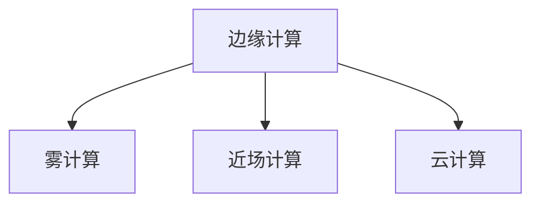

                 

# 边缘计算：在设备端处理数据

## 1. 背景介绍

### 1.1 问题由来

随着物联网（IoT）、5G等新兴技术的兴起，设备端产生了海量的数据。如何在边缘设备上高效地处理这些数据，使其发挥出更大的价值，成为了当下的一大挑战。边缘计算（Edge Computing）技术正是为了解决这一问题而生的。

### 1.2 问题核心关键点

边缘计算通过在设备端或网络边缘节点上处理数据，减少了对中心服务器的依赖，提高了数据处理的实时性和效率。其核心思想是将计算任务和数据存储放在靠近数据源的位置，以降低网络延迟，优化资源利用，确保数据的安全性和隐私性。

## 2. 核心概念与联系

### 2.1 核心概念概述

为了更好地理解边缘计算，本节将介绍几个密切相关的核心概念：

- **边缘计算**：指在靠近数据源（如手机、智能家居设备、边缘服务器等）的设备或网络边缘节点上，进行数据处理和计算的一种分布式计算范式。
- **雾计算**：与边缘计算类似，但雾计算更强调将计算任务分布在网络边缘的多个节点上，而不是仅限于设备端。
- **近场计算**：指将计算任务部署在用户设备上，如手机、可穿戴设备等，以提供更快速、更个性化的计算服务。
- **云计算**：指将数据处理和计算任务全部或部分部署在远程数据中心，通过网络提供给用户。

这些概念之间的逻辑关系可以通过以下Mermaid流程图来展示：



这个流程图展示了一些相关概念的基本关系：

1. **边缘计算**：是雾计算和近场计算的基础，强调将计算任务在设备端进行处理。
2. **雾计算**：扩展了边缘计算的概念，强调在网络边缘的多个节点上进行数据处理。
3. **近场计算**：将计算任务部署在用户设备上，强调个性化和实时性。
4. **云计算**：强调将数据处理和计算任务全部或部分部署在远程数据中心，通过网络提供给用户。

这些概念共同构成了分布式计算技术的整体框架，使得数据处理更加灵活和高效。

## 3. 核心算法原理 & 具体操作步骤
### 3.1 算法原理概述

边缘计算的原理是将数据处理任务在靠近数据源的位置进行，从而减少网络延迟，提高数据处理的速度和效率。其核心算法可以概括为以下几个步骤：

1. **数据采集**：从设备或传感器中获取实时数据。
2. **边缘推理**：在边缘设备上对数据进行初步处理和计算，减少对中心服务器的依赖。
3. **数据传输**：将边缘计算结果传输至中心服务器，进行进一步处理或存储。
4. **响应反馈**：根据中心服务器的指令，将处理结果反馈给设备或用户。

### 3.2 算法步骤详解

以下是对边缘计算的详细操作步骤：

**Step 1: 数据采集**
- 从设备或传感器中获取实时数据，格式可以是结构化数据或非结构化数据，如文本、图像、音频等。
- 确保数据采集的质量和实时性，避免数据丢失或延迟。

**Step 2: 边缘推理**
- 将数据发送到边缘设备或服务器上，使用预训练模型或定制算法进行计算和推理。
- 对于复杂任务，可以使用分布式算法，将计算任务分解到多个边缘节点上并行处理。

**Step 3: 数据传输**
- 将边缘计算结果通过网络传输至中心服务器或云平台。
- 使用压缩算法和数据加密技术，提高传输效率和数据安全性。

**Step 4: 响应反馈**
- 根据中心服务器的指令，将处理结果反馈给设备或用户。
- 使用快速的API接口或消息队列技术，确保响应的实时性。

### 3.3 算法优缺点

边缘计算的优点包括：
- **实时性**：减少了数据传输的时延，提高了响应速度。
- **隐私性**：数据处理在本地进行，减少了数据泄露的风险。
- **带宽节省**：减少了中心服务器需要处理的数据量，优化了带宽利用。
- **可扩展性**：通过在多个边缘节点上进行并行计算，提高了系统的可扩展性。

缺点包括：
- **设备成本**：需要额外的硬件设备来支持边缘计算。
- **维护复杂**：设备分布在多个位置，维护和管理难度较大。
- **计算资源限制**：设备计算资源有限，处理复杂任务时可能需要本地缓存或备份。

### 3.4 算法应用领域

边缘计算在多个领域中都有广泛应用，包括：

- **智能家居**：通过边缘计算，实现家庭设备之间的智能互联和自动化控制。
- **工业物联网（IIoT）**：在工厂设备上实时处理和分析传感器数据，提高生产效率和安全性。
- **智慧城市**：通过边缘计算，优化城市交通、环境监测、公共安全等系统。
- **医疗健康**：在移动设备上处理和分析健康数据，提供实时健康监测和诊断服务。
- **自动驾驶**：在车辆上实时处理传感器数据，实现智能驾驶和自动驾驶技术。

## 4. 数学模型和公式 & 详细讲解 & 举例说明

### 4.1 数学模型构建

边缘计算的数学模型可以基于分布式系统架构，将数据处理任务分解为多个子任务，分别在不同的边缘节点上进行处理。假设一个分布式系统包含 $n$ 个边缘节点，每个节点上的数据处理时间为 $t_i$，处理结果需要传输到中心服务器，传输时间为 $d_i$，则系统的总处理时间 $T$ 可以表示为：

$$ T = \sum_{i=1}^n (t_i + d_i) $$

### 4.2 公式推导过程

为了最小化总处理时间 $T$，我们可以对 $t_i$ 和 $d_i$ 进行优化。假设每个节点的处理能力和传输速率相同，则总处理时间 $T$ 可以简化为：

$$ T = n \cdot (t_i + d_i) $$

为了最小化 $T$，需要最小化每个节点的处理时间 $t_i$ 和传输时间 $d_i$。可以采用多任务调度算法，如SPF（Shortest Processing First）、HPSF（Hybrid Processing and Scheduling Framework）等，优化任务的执行顺序和资源分配。

### 4.3 案例分析与讲解

假设在一个智慧城市中，有多个边缘节点分布在不同的区域，每个节点上的数据处理时间为 $t_i$，数据传输时间为 $d_i$。通过多任务调度算法，可以将数据处理任务分配到不同的节点上，使得总处理时间 $T$ 最小化。例如，可以使用SPF算法，将数据处理时间最短的节点优先执行，以减少总处理时间。

## 5. 项目实践：代码实例和详细解释说明

### 5.1 开发环境搭建

在进行边缘计算项目开发前，需要先搭建好开发环境。以下是使用Python进行PyTorch开发的环境配置流程：

1. 安装Anaconda：从官网下载并安装Anaconda，用于创建独立的Python环境。

2. 创建并激活虚拟环境：
```bash
conda create -n edge-env python=3.8 
conda activate edge-env
```

3. 安装PyTorch：根据CUDA版本，从官网获取对应的安装命令。例如：
```bash
conda install pytorch torchvision torchaudio cudatoolkit=11.1 -c pytorch -c conda-forge
```

4. 安装Flask：
```bash
pip install flask
```

5. 安装TensorBoard：
```bash
pip install tensorboard
```

6. 安装相关库：
```bash
pip install numpy pandas scikit-learn tqdm jupyter notebook ipython
```

完成上述步骤后，即可在`edge-env`环境中开始边缘计算实践。

### 5.2 源代码详细实现

下面是一个使用PyTorch和Flask进行边缘计算的简单示例。在这个例子中，我们将数据处理任务放在本地设备上，使用Python Flask API将处理结果返回给客户端。

首先，定义一个简单的数据处理函数：

```python
import torch
from torch import nn, optim

def process_data(data):
    # 将数据处理成Tensor格式
    x = torch.tensor(data, dtype=torch.float32)
    
    # 使用预训练模型进行计算
    model = nn.Linear(1, 1)
    optimizer = optim.SGD(model.parameters(), lr=0.01)
    loss_fn = nn.MSELoss()
    
    for _ in range(10):
        optimizer.zero_grad()
        y_pred = model(x)
        loss = loss_fn(y_pred, x)
        loss.backward()
        optimizer.step()
    
    return y_pred.item()
```

然后，使用Flask定义一个简单的API接口，用于接收数据并返回处理结果：

```python
from flask import Flask, request, jsonify

app = Flask(__name__)

@app.route('/process', methods=['POST'])
def process():
    data = request.json['data']
    result = process_data(data)
    return jsonify({'result': result})

if __name__ == '__main__':
    app.run(host='0.0.0.0', port=5000)
```

最后，启动Flask服务，监听本地的5000端口：

```bash
python app.py
```

这样，一个简单的边缘计算服务就搭建好了。客户端可以通过POST请求，将数据发送到本地设备进行处理，并将结果返回。

### 5.3 代码解读与分析

让我们再详细解读一下关键代码的实现细节：

**process_data函数**：
- 定义了一个简单的数据处理函数，将输入数据转换成Tensor格式，使用预训练的线性模型进行计算。
- 使用SGD优化器进行梯度下降，损失函数为均方误差。
- 迭代10次后返回预测结果。

**Flask代码**：
- 使用Flask框架定义一个API接口，接收POST请求，提取数据并调用数据处理函数。
- 将处理结果返回给客户端，使用JSON格式输出。

**启动Flask服务**：
- 使用`app.run`函数启动Flask服务，监听本地的5000端口。

可以看到，PyTorch和Flask的结合，使得边缘计算服务变得简单易用，开发者可以快速搭建并测试边缘计算的应用。

## 6. 实际应用场景

### 6.1 智能家居

在智能家居中，边缘计算可以实现设备之间的实时通信和控制。例如，智能音箱可以通过边缘计算处理语音识别和指令，直接与智能灯光、窗帘等设备进行通信，实现智能场景的自动控制。

### 6.2 工业物联网（IIoT）

在工业物联网中，边缘计算可以提高设备间的数据交互效率。例如，在工厂车间中，传感器设备可以将实时数据上传到边缘计算节点，进行处理和分析，并将结果反馈到设备上，实现自动化生产线的优化和控制。

### 6.3 智慧城市

在智慧城市中，边缘计算可以提高城市管理系统的实时性和效率。例如，在交通管理中，边缘计算节点可以实时处理交通摄像头数据，检测交通违规行为，并快速响应。

### 6.4 医疗健康

在医疗健康中，边缘计算可以提高健康监测设备的实时性和安全性。例如，可穿戴设备可以将实时健康数据上传到边缘计算节点，进行处理和分析，及时发现健康异常，并通知用户或医生。

### 6.5 自动驾驶

在自动驾驶中，边缘计算可以提高车辆的实时处理能力。例如，车辆可以通过边缘计算节点实时处理传感器数据，进行障碍物检测和路径规划，实现自动驾驶。

## 7. 工具和资源推荐

### 7.1 学习资源推荐

为了帮助开发者系统掌握边缘计算的理论基础和实践技巧，这里推荐一些优质的学习资源：

1. **《Edge Computing: Principles, Techniques, and Applications》**：该书系统介绍了边缘计算的基本原理、关键技术和应用场景。
2. **Kaggle Edge Computing Kernels**：Kaggle提供的边缘计算教程，涵盖数据采集、边缘推理、数据传输等关键技术。
3. **IBM Edge Computing Academy**：IBM提供的免费在线课程，涵盖边缘计算的基础知识和实践技巧。
4. **Arduino IDE for Edge Computing**：Arduino提供的边缘计算教程，结合硬件设备进行实际操作。

通过这些资源的学习实践，相信你一定能够快速掌握边缘计算的精髓，并用于解决实际的NLP问题。

### 7.2 开发工具推荐

高效的开发离不开优秀的工具支持。以下是几款用于边缘计算开发的常用工具：

1. **TensorFlow**：由Google主导开发的开源深度学习框架，支持分布式计算和模型部署。
2. **PyTorch**：由Facebook主导开发的开源深度学习框架，支持动态计算图和模型优化。
3. **Flask**：轻量级的Python Web框架，支持API接口的快速开发。
4. **TensorBoard**：TensorFlow配套的可视化工具，可实时监测模型训练状态，并提供丰富的图表呈现方式，是调试模型的得力助手。
5. **Arduino**：支持硬件编程的开发平台，适用于嵌入式设备的边缘计算开发。

合理利用这些工具，可以显著提升边缘计算任务的开发效率，加快创新迭代的步伐。

### 7.3 相关论文推荐

边缘计算的发展源于学界的持续研究。以下是几篇奠基性的相关论文，推荐阅读：

1. **"Edge Computing Architecture and Systems: A Survey"**：总结了边缘计算的基本架构和系统设计，适合入门学习。
2. **"Edge Computing: A Survey"**：综述了边缘计算的应用场景和关键技术，提供了丰富的案例分析。
3. **"Edge Computing: A Revolutionary Concept for IoT and Beyond"**：介绍了边缘计算对物联网等领域的深远影响。

这些论文代表了大语言模型微调技术的发展脉络。通过学习这些前沿成果，可以帮助研究者把握学科前进方向，激发更多的创新灵感。

## 8. 总结：未来发展趋势与挑战

### 8.1 总结

本文对边缘计算进行了全面系统的介绍。首先阐述了边缘计算的基本概念和核心思想，明确了边缘计算在减少网络延迟、提高数据处理效率方面的独特价值。其次，从原理到实践，详细讲解了边缘计算的基本流程和操作步骤，给出了边缘计算任务开发的完整代码实例。同时，本文还广泛探讨了边缘计算在智能家居、工业物联网、智慧城市、医疗健康、自动驾驶等多个行业领域的应用前景，展示了边缘计算的广阔前景。

通过本文的系统梳理，可以看到，边缘计算通过将计算任务和数据存储放在靠近数据源的位置，提高了数据处理的实时性和效率，具有广阔的应用前景。未来，伴随技术的不断发展，边缘计算必将在更多领域得到应用，推动智能化技术的进一步发展。

### 8.2 未来发展趋势

展望未来，边缘计算将呈现以下几个发展趋势：

1. **技术普及**：随着技术的不断成熟，边缘计算将更加普及，广泛应用于各个行业领域。
2. **设备多样化**：从传统的工业设备和传感器，到智能家居和移动设备，边缘计算将覆盖更多设备类型。
3. **应用深化**：边缘计算将在更多场景中得到应用，如智能交通、智慧城市、医疗健康等。
4. **5G支持**：5G网络的高带宽、低延迟特性将为边缘计算提供更强大的网络支持，提高数据处理效率。
5. **云计算融合**：边缘计算将与云计算深度融合，形成边缘-云协同的分布式计算架构。
6. **边缘AI兴起**：边缘计算将支持边缘AI技术，使得AI模型在本地进行训练和推理，提高AI系统的实时性和安全性。

以上趋势凸显了边缘计算技术的广阔前景。这些方向的探索发展，必将进一步提升边缘计算的性能和应用范围，为各行各业带来新的变革。

### 8.3 面临的挑战

尽管边缘计算技术已经取得了一定的进展，但在迈向更加智能化、普适化应用的过程中，它仍面临着诸多挑战：

1. **计算资源限制**：边缘设备计算资源有限，处理复杂任务时可能需要本地缓存或备份。
2. **数据隐私和安全**：边缘计算需要在本地进行数据处理，可能存在数据泄露和隐私问题。
3. **设备异构性**：不同设备之间的计算资源和网络带宽存在差异，需要进行资源调度和优化。
4. **系统复杂性**：边缘计算系统涉及多层次、多节点的复杂架构，管理维护难度较大。
5. **标准化问题**：边缘计算涉及多种技术标准，如网络协议、数据格式等，需要进行统一标准化。

这些挑战需要学界和产业界共同努力，积极应对并寻求突破，才能真正实现边缘计算的广泛应用。

### 8.4 未来突破

面对边缘计算所面临的种种挑战，未来的研究需要在以下几个方面寻求新的突破：

1. **边缘计算平台优化**：开发更加灵活、高效、易于管理的边缘计算平台，支持多种设备类型和应用场景。
2. **数据隐私和安全保护**：采用数据加密、访问控制等技术，保护数据隐私和安全。
3. **边缘计算和云计算融合**：探索边缘计算与云计算的深度融合，形成边缘-云协同的计算架构。
4. **边缘AI技术突破**：支持边缘AI技术，使得AI模型在本地进行训练和推理，提高AI系统的实时性和安全性。
5. **标准化推进**：推动边缘计算技术标准的制定和推广，促进跨厂商、跨平台的应用。

这些研究方向的发展，必将引领边缘计算技术迈向更高的台阶，为构建安全、可靠、高效的边缘计算系统铺平道路。面向未来，边缘计算技术还需要与其他人工智能技术进行更深入的融合，如知识表示、因果推理、强化学习等，多路径协同发力，共同推动边缘计算技术的发展。只有勇于创新、敢于突破，才能不断拓展边缘计算的边界，让智能技术更好地造福人类社会。

## 9. 附录：常见问题与解答

**Q1：边缘计算是否适用于所有数据处理场景？**

A: 边缘计算适用于需要低延迟、高实时性的数据处理场景，如智能家居、工业物联网、智慧城市等。对于需要高精度、大模型训练等场景，可能需要将计算任务放在中心服务器上进行。

**Q2：边缘计算设备如何进行安装和部署？**

A: 边缘计算设备的安装和部署需要根据具体的场景和需求进行。一般来说，需要考虑设备的计算资源、存储能力、网络带宽等因素，并根据设备的特点进行合理配置。可以使用云平台提供的边缘计算服务，简化部署过程。

**Q3：边缘计算在安全性方面有何保障措施？**

A: 边缘计算需要在本地进行数据处理，可能存在数据泄露和隐私问题。为保障数据安全，可以采用数据加密、访问控制等技术，确保数据在传输和存储过程中的安全性。

**Q4：边缘计算在边缘节点上的资源管理如何进行？**

A: 边缘计算需要在边缘节点上进行资源管理和优化，以最大化资源利用效率。可以使用多任务调度算法、资源预留策略等方法，合理分配和调度资源。

**Q5：边缘计算的扩展性如何实现？**

A: 边缘计算可以通过扩展边缘节点的数量和计算能力，提高系统的可扩展性。同时，边缘计算平台也需要支持灵活的扩展和升级，以便适应不断增长的数据处理需求。

总之，边缘计算通过将计算任务和数据存储放在靠近数据源的位置，提高了数据处理的实时性和效率，具有广阔的应用前景。未来，伴随技术的不断发展，边缘计算必将在更多领域得到应用，推动智能化技术的进一步发展。只有勇于创新、敢于突破，才能不断拓展边缘计算的边界，让智能技术更好地造福人类社会。

---

作者：禅与计算机程序设计艺术 / Zen and the Art of Computer Programming

