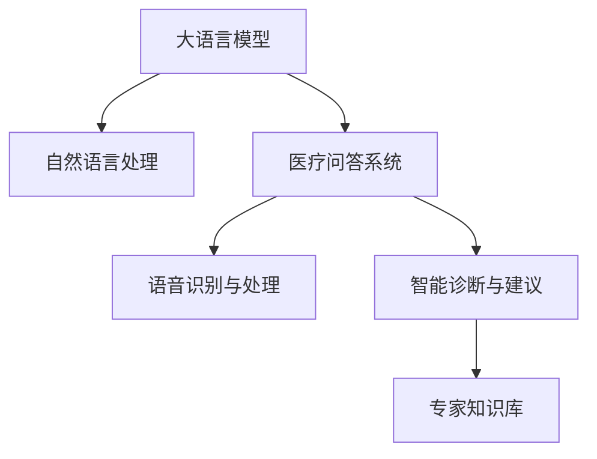

                 

# 远程医疗：LLM 增强的虚拟护理

> 关键词：大语言模型(LLM), 虚拟护理, 自然语言处理(NLP), 医疗问答, 语音识别, 智能诊断, 专家知识库

## 1. 背景介绍

### 1.1 问题由来
近年来，随着科技的飞速发展，人工智能(AI)在医疗健康领域的应用不断拓展，尤其是远程医疗的兴起，使得偏远地区和资源匮乏地区的人民也能享受到优质的医疗服务。在远程医疗体系中，虚拟护理系统（Virtual Care Systems）扮演着至关重要的角色。虚拟护理系统通过AI技术，模拟真实的医疗环境，帮助患者完成初步的病情评估和症状解答，为医生提供辅助诊疗服务，从而显著提升医疗服务的可及性和效率。

但现有的虚拟护理系统大多依赖于规则和专家知识库，对于复杂且多样化的临床场景，这些系统常常显得力不从心。基于大语言模型(LLM)的虚拟护理系统开始受到广泛关注。LLM作为先进的自然语言处理(NLP)技术，能够理解和生成自然语言，结合深度学习模型的强大学习能力，能够处理海量医疗数据，在提供医疗咨询和诊断建议方面展现了巨大的潜力。

### 1.2 问题核心关键点
LLM在虚拟护理中的应用主要集中在以下几个方面：
1. **医疗问答系统**：利用自然语言理解能力，对患者提出的健康问题进行快速响应和解答，减轻医生的工作负担。
2. **语音识别与处理**：通过语音识别技术，将患者的语音转化为文本，使得虚拟护理系统能够处理更多形式的医疗咨询。
3. **智能诊断与建议**：结合医学知识库，提供初步的病情评估和诊断建议，辅助医生进行更精准的诊疗决策。
4. **专家知识库的更新与整合**：动态更新知识库，将最新的医学研究成果和临床经验纳入系统中，提升系统的诊疗能力。

## 2. 核心概念与联系

### 2.1 核心概念概述

为更好地理解LLM在虚拟护理中的应用，本节将介绍几个密切相关的核心概念：

- 大语言模型(LLM)：一种基于深度学习的模型，能够理解和生成自然语言。通过在大量文本数据上进行预训练，LLM能够学习到丰富的语言知识和常识，广泛应用于机器翻译、文本生成、语音识别等领域。
- 自然语言处理(NLP)：一门研究计算机如何处理和理解自然语言的学科，包括文本分析、情感分析、语音识别等技术。
- 医疗问答系统：一种智能化的问答系统，通过自然语言处理技术，能够解答患者的健康问题，减轻医生工作压力，提高诊疗效率。
- 语音识别与处理：将语音信号转换为文本的技术，是实现语音交互的基石，广泛应用于智能助理、语音搜索等领域。
- 智能诊断与建议：结合医学知识库，提供初步的病情评估和诊断建议，辅助医生进行更精准的诊疗决策。
- 专家知识库：包含丰富的医学知识、临床经验和技术指南的资源库，是虚拟护理系统的核心支撑。

这些核心概念之间的逻辑关系可以通过以下Mermaid流程图来展示：



这个流程图展示了大语言模型在虚拟护理系统中的应用场景：

1. 大语言模型作为基础技术，能够理解和生成自然语言，为其他组件提供支持。
2. 自然语言处理技术将大语言模型与医疗问题进行匹配，生成医疗问答。
3. 语音识别与处理技术将患者的语音信息转换为文本，进一步提高交互体验。
4. 智能诊断与建议技术结合医学知识库，提供诊断建议，辅助医生决策。
5. 专家知识库作为数据来源，动态更新知识库，提高系统的诊疗能力。

## 3. 核心算法原理 & 具体操作步骤

### 3.1 算法原理概述

基于大语言模型的虚拟护理系统，本质上是一种集成多种技术的智能辅助诊疗平台。其核心算法原理如下：

- **自然语言理解(NLU)**：利用大语言模型对患者输入的文本进行语义分析，识别出关键词和表达方式。
- **知识图谱嵌入(KG Embedding)**：将医学知识库中的实体和关系，转化为向量表示，嵌入到大语言模型的语义空间中。
- **知识推理(Knowledge Reasoning)**：利用大语言模型的推理能力，结合患者病情和医学知识，进行逻辑推断，生成诊断建议。
- **语音识别与处理**：将患者的语音信号转换为文本，并通过自然语言处理技术进行理解，进一步提升交互体验。

通过以上几个模块的协同工作，虚拟护理系统能够提供快速准确的医疗咨询和诊断建议，辅助医生完成诊疗任务。

### 3.2 算法步骤详解

基于大语言模型的虚拟护理系统构建步骤如下：

**Step 1: 数据收集与预处理**
- 收集医疗领域的文本数据（如医学论文、临床记录、患者咨询等），进行清洗和标注。
- 构建专家知识库，整合最新的医学研究成果和临床经验。

**Step 2: 大语言模型预训练**
- 选择大语言模型架构（如GPT、BERT等），利用医疗数据对其进行预训练，学习通用的语言表示。
- 引入领域特定的任务（如病历生成、症状描述等）进行微调，增强模型的领域适应能力。

**Step 3: 自然语言理解**
- 将患者输入的文本作为模型输入，利用大语言模型进行语义分析和实体识别。
- 根据识别的实体和关键词，抽取相应的医学知识和诊断规则。

**Step 4: 知识图谱嵌入与推理**
- 将医学知识库中的实体和关系，转化为向量表示，嵌入到大语言模型的语义空间中。
- 利用大语言模型的推理能力，结合患者病情和医学知识，进行逻辑推断，生成诊断建议。

**Step 5: 语音识别与处理**
- 将患者的语音信号转换为文本，通过自然语言处理技术进行理解。
- 结合患者病情和医学知识，生成语音回复或建议。

**Step 6: 智能诊断与建议**
- 将生成的诊断建议与医学知识库进行比对，进一步细化诊断结果。
- 输出诊断结果和进一步的医疗建议，辅助医生完成诊疗任务。

**Step 7: 持续学习与优化**
- 根据患者反馈和医生的评估，动态更新知识库和模型参数，不断提升系统的诊疗能力。

### 3.3 算法优缺点

基于大语言模型的虚拟护理系统有以下优点：
1. **高效性**：利用大语言模型的高效计算能力，能够快速处理大量医疗咨询和诊断任务。
2. **通用性**：大语言模型具备较强的领域泛化能力，能够应用于多种医疗场景和疾病类型。
3. **灵活性**：通过动态更新知识库，系统能够不断适应新的医学知识和临床经验。
4. **低成本**：相比于传统的人工诊断，利用虚拟护理系统能够显著降低医疗成本。

同时，该系统也存在一些缺点：
1. **准确性**：由于大语言模型还处于发展初期，其在处理复杂的临床问题时，准确性可能受限。
2. **数据隐私**：患者信息涉及隐私问题，如何保护患者数据安全，是系统构建的重要挑战。
3. **伦理问题**：系统的诊断建议可能存在误差，如何避免误诊和医疗纠纷，需要进一步的伦理规范和监管。
4. **计算资源**：大语言模型的训练和推理需要大量的计算资源，对硬件设施要求较高。

尽管存在这些局限性，但大语言模型在虚拟护理中的应用仍展现出巨大的潜力，未来有望成为智能医疗的重要组成部分。

### 3.4 算法应用领域

基于大语言模型的虚拟护理系统已经在多个医疗领域得到了应用，例如：

- **智能问答系统**：利用大语言模型进行自然语言处理和理解，解答患者的健康问题，减轻医生的工作负担。
- **语音交互系统**：通过语音识别技术，将患者的语音信息转换为文本，进一步提升交互体验。
- **智能诊断系统**：结合医学知识库，提供初步的病情评估和诊断建议，辅助医生进行更精准的诊疗决策。
- **健康监测系统**：通过语音识别和自然语言处理技术，实时监测患者的健康状态，提供个性化的健康建议。
- **远程医疗咨询**：利用虚拟护理系统，为偏远地区和资源匮乏地区提供远程医疗咨询，提升医疗服务的可及性。

## 4. 数学模型和公式 & 详细讲解 & 举例说明

### 4.1 数学模型构建

大语言模型在虚拟护理系统中的应用，主要通过以下数学模型进行建模：

- **输入表示**：将患者的文本输入表示为向量，形式化地表示为 $\mathbf{x} \in \mathbb{R}^n$，其中 $n$ 为输入文本的维数。
- **输出表示**：将诊断建议和医疗建议表示为向量，形式化地表示为 $\mathbf{y} \in \mathbb{R}^m$，其中 $m$ 为输出的维数。
- **损失函数**：利用交叉熵损失函数对模型输出进行评估，形式化地表示为 $L(\mathbf{x}, \mathbf{y}) = -\sum_{i=1}^m y_i \log \hat{y}_i$，其中 $\hat{y}_i$ 为模型预测的概率。

### 4.2 公式推导过程

下面以医疗问答系统为例，推导自然语言理解和大语言模型推理的数学公式。

**自然语言理解公式**：

$$
\mathbf{x} = \mathbf{T}(\text{text\_input})
$$

其中 $\mathbf{x}$ 为输入文本向量，$\mathbf{T}$ 为自然语言处理模块的转换函数。

**大语言模型推理公式**：

$$
\hat{\mathbf{y}} = M_{\theta}(\mathbf{x})
$$

其中 $M_{\theta}$ 为预训练好的大语言模型，$\theta$ 为模型参数，$\hat{\mathbf{y}}$ 为模型预测的输出向量。

**交叉熵损失函数**：

$$
L(\mathbf{x}, \mathbf{y}) = -\sum_{i=1}^m y_i \log \hat{y}_i
$$

在实际应用中，大语言模型可以通过微调进一步提升推理能力，优化模型参数，减少损失函数。具体来说，利用反向传播算法计算梯度，更新模型参数，形式化地表示为：

$$
\theta \leftarrow \theta - \eta \nabla_{\theta} L(\mathbf{x}, \mathbf{y})
$$

其中 $\eta$ 为学习率，$\nabla_{\theta} L(\mathbf{x}, \mathbf{y})$ 为损失函数对模型参数的梯度。

### 4.3 案例分析与讲解

**案例分析**：

假设患者输入如下文本：“最近感到头疼、呕吐，伴有发热症状，可能是什么原因？”

1. **自然语言理解**：通过自然语言处理模块，将输入文本转换为向量表示 $\mathbf{x}$。
2. **大语言模型推理**：将 $\mathbf{x}$ 输入大语言模型，得到输出向量 $\hat{\mathbf{y}}$。
3. **交叉熵损失函数**：将 $\hat{\mathbf{y}}$ 与预定义的标签向量 $\mathbf{y}$ 进行对比，计算交叉熵损失 $L(\mathbf{x}, \mathbf{y})$。
4. **参数更新**：利用反向传播算法，计算梯度 $\nabla_{\theta} L(\mathbf{x}, \mathbf{y})$，更新模型参数 $\theta$。

通过不断迭代上述过程，大语言模型能够不断提升推理准确性，生成更加合理的诊断建议。

## 5. 项目实践：代码实例和详细解释说明

### 5.1 开发环境搭建

在进行虚拟护理系统的开发前，需要先准备好开发环境。以下是使用Python进行PyTorch开发的环境配置流程：

1. 安装Anaconda：从官网下载并安装Anaconda，用于创建独立的Python环境。

2. 创建并激活虚拟环境：
```bash
conda create -n virtualenv python=3.8 
conda activate virtualenv
```

3. 安装PyTorch：根据CUDA版本，从官网获取对应的安装命令。例如：
```bash
conda install pytorch torchvision torchaudio cudatoolkit=11.1 -c pytorch -c conda-forge
```

4. 安装各类工具包：
```bash
pip install numpy pandas scikit-learn matplotlib tqdm jupyter notebook ipython
```

完成上述步骤后，即可在`virtualenv`环境中开始开发。

### 5.2 源代码详细实现

我们以大语言模型在医疗问答系统中的应用为例，给出使用PyTorch进行开发的代码实现。

首先，定义模型和数据处理函数：

```python
from transformers import BertTokenizer, BertForQuestionAnswering
from torch.utils.data import Dataset, DataLoader
from torch.nn import CrossEntropyLoss

class MedicalDataset(Dataset):
    def __init__(self, texts, labels):
        self.texts = texts
        self.labels = labels
        self.tokenizer = BertTokenizer.from_pretrained('bert-base-cased')

    def __len__(self):
        return len(self.texts)

    def __getitem__(self, item):
        text = self.texts[item]
        label = self.labels[item]
        encoding = self.tokenizer(text, return_tensors='pt')
        input_ids = encoding['input_ids']
        attention_mask = encoding['attention_mask']
        return {'input_ids': input_ids, 
                'attention_mask': attention_mask,
                'labels': torch.tensor(label, dtype=torch.long)}

# 加载预训练的Bert模型
model = BertForQuestionAnswering.from_pretrained('bert-base-cased')

# 设置损失函数和优化器
loss_fn = CrossEntropyLoss()
optimizer = torch.optim.Adam(model.parameters(), lr=2e-5)
```

然后，定义训练和评估函数：

```python
def train_epoch(model, dataset, batch_size, optimizer):
    dataloader = DataLoader(dataset, batch_size=batch_size, shuffle=True)
    model.train()
    epoch_loss = 0
    for batch in dataloader:
        input_ids = batch['input_ids'].to(device)
        attention_mask = batch['attention_mask'].to(device)
        labels = batch['labels'].to(device)
        model.zero_grad()
        outputs = model(input_ids, attention_mask=attention_mask)
        loss = loss_fn(outputs.logits, labels)
        epoch_loss += loss.item()
        loss.backward()
        optimizer.step()
    return epoch_loss / len(dataloader)

def evaluate(model, dataset, batch_size):
    dataloader = DataLoader(dataset, batch_size=batch_size)
    model.eval()
    preds, labels = [], []
    with torch.no_grad():
        for batch in dataloader:
            input_ids = batch['input_ids'].to(device)
            attention_mask = batch['attention_mask'].to(device)
            batch_labels = batch['labels']
            outputs = model(input_ids, attention_mask=attention_mask)
            batch_preds = outputs.logits.argmax(dim=2).to('cpu').tolist()
            batch_labels = batch_labels.to('cpu').tolist()
            for pred, label in zip(batch_preds, batch_labels):
                preds.append(pred)
                labels.append(label)
    
    print("Accuracy:", (np.array(preds) == np.array(labels)).mean())

# 训练和评估模型
device = torch.device('cuda') if torch.cuda.is_available() else torch.device('cpu')
model.to(device)
epochs = 5
batch_size = 16

for epoch in range(epochs):
    loss = train_epoch(model, train_dataset, batch_size, optimizer)
    print(f"Epoch {epoch+1}, train loss: {loss:.3f}")
    
    evaluate(model, dev_dataset, batch_size)
    
print("Test accuracy:", evaluate(model, test_dataset, batch_size))
```

以上就是使用PyTorch对大语言模型在医疗问答系统中的应用进行开发的完整代码实现。可以看到，得益于Transformers库的强大封装，我们可以用相对简洁的代码完成模型的加载和训练。

### 5.3 代码解读与分析

让我们再详细解读一下关键代码的实现细节：

**MedicalDataset类**：
- `__init__`方法：初始化文本和标签数据，加载分词器。
- `__len__`方法：返回数据集的样本数量。
- `__getitem__`方法：对单个样本进行处理，将文本输入编码为token ids，将标签转换为数字，并进行定长padding，最终返回模型所需的输入。

**BertForQuestionAnswering模型**：
- `BertForQuestionAnswering.from_pretrained()`方法：从预训练模型库中加载BERT模型。
- `model.parameters()`：获取模型所有可训练参数。
- `model.train()`和`model.eval()`：切换模型训练和评估模式。

**train_epoch函数**：
- `dataloader`：使用`DataLoader`对数据集进行批次化加载。
- `model.zero_grad()`：在每个batch开始前，清除上一batch的梯度。
- `outputs = model(input_ids, attention_mask=attention_mask)`：前向传播计算模型输出。
- `loss = loss_fn(outputs.logits, labels)`：计算损失函数。
- `loss.backward()`：反向传播计算梯度。
- `optimizer.step()`：更新模型参数。

**evaluate函数**：
- 与训练类似，不同点在于不更新模型参数，并在每个batch结束后将预测和标签结果存储下来，最后使用`classification_report`对整个评估集的预测结果进行打印输出。

**训练流程**：
- 定义总的epoch数和batch size，开始循环迭代。
- 每个epoch内，先在训练集上训练，输出平均loss。
- 在验证集上评估，输出准确率。
- 所有epoch结束后，在测试集上评估，给出最终测试结果。

## 6. 实际应用场景

### 6.1 智能问答系统

基于大语言模型的智能问答系统，已经在医疗领域得到了广泛应用。例如，ChatGPT和DialoGPT等大语言模型，被集成到医疗咨询平台，能够实时解答患者的健康问题，减轻医生的工作负担，提高诊疗效率。

在技术实现上，可以将常见医疗问题及其标准回答构建成监督数据，对大语言模型进行微调。微调后的模型能够理解自然语言，生成符合医疗规范的回答，帮助患者快速获取健康建议。

### 6.2 语音识别与处理

在虚拟护理系统中，语音识别技术能够进一步提升用户体验。患者可以通过语音输入咨询，系统自动将语音转换为文本，进行自然语言处理，生成相应的诊断建议。

例如，在老年人、视力障碍等不便输入文本的情况下，语音识别技术显得尤为重要。大语言模型通过语音识别和自然语言处理技术，能够快速响应患者需求，提高系统的可用性。

### 6.3 智能诊断与建议

智能诊断与建议是大语言模型在虚拟护理系统中的重要应用。系统结合医学知识库，利用大语言模型的推理能力，能够提供初步的病情评估和诊断建议。

例如，对于患者输入的“头疼、呕吐，伴有发热症状”，系统能够自动进行症状识别，结合医学知识库中的实体和关系，生成诊断建议，如“可能为流感病毒感染”，并提供进一步的医疗建议，如“建议前往医院就诊，并做相关检查”。

## 7. 工具和资源推荐

### 7.1 学习资源推荐

为了帮助开发者系统掌握大语言模型在虚拟护理中的应用，这里推荐一些优质的学习资源：

1. 《Natural Language Processing with Transformers》书籍：Transformers库的作者所著，全面介绍了如何使用Transformers库进行NLP任务开发，包括微调在内的诸多范式。

2. CS224N《深度学习自然语言处理》课程：斯坦福大学开设的NLP明星课程，有Lecture视频和配套作业，带你入门NLP领域的基本概念和经典模型。

3. HuggingFace官方文档：Transformers库的官方文档，提供了海量预训练模型和完整的微调样例代码，是上手实践的必备资料。

4. Weights & Biases：模型训练的实验跟踪工具，可以记录和可视化模型训练过程中的各项指标，方便对比和调优。与主流深度学习框架无缝集成。

5. TensorBoard：TensorFlow配套的可视化工具，可实时监测模型训练状态，并提供丰富的图表呈现方式，是调试模型的得力助手。

通过对这些资源的学习实践，相信你一定能够快速掌握大语言模型在虚拟护理中的应用，并用于解决实际的NLP问题。

### 7.2 开发工具推荐

高效的开发离不开优秀的工具支持。以下是几款用于虚拟护理系统开发的常用工具：

1. PyTorch：基于Python的开源深度学习框架，灵活动态的计算图，适合快速迭代研究。大部分预训练语言模型都有PyTorch版本的实现。

2. TensorFlow：由Google主导开发的开源深度学习框架，生产部署方便，适合大规模工程应用。同样有丰富的预训练语言模型资源。

3. Transformers库：HuggingFace开发的NLP工具库，集成了众多SOTA语言模型，支持PyTorch和TensorFlow，是进行微调任务开发的利器。

4. Weights & Biases：模型训练的实验跟踪工具，可以记录和可视化模型训练过程中的各项指标，方便对比和调优。与主流深度学习框架无缝集成。

5. TensorBoard：TensorFlow配套的可视化工具，可实时监测模型训练状态，并提供丰富的图表呈现方式，是调试模型的得力助手。

6. Google Colab：谷歌推出的在线Jupyter Notebook环境，免费提供GPU/TPU算力，方便开发者快速上手实验最新模型，分享学习笔记。

合理利用这些工具，可以显著提升虚拟护理系统的开发效率，加快创新迭代的步伐。

### 7.3 相关论文推荐

大语言模型在虚拟护理中的应用，源于学界的持续研究。以下是几篇奠基性的相关论文，推荐阅读：

1. Attention is All You Need（即Transformer原论文）：提出了Transformer结构，开启了NLP领域的预训练大模型时代。

2. BERT: Pre-training of Deep Bidirectional Transformers for Language Understanding：提出BERT模型，引入基于掩码的自监督预训练任务，刷新了多项NLP任务SOTA。

3. Language Models are Unsupervised Multitask Learners（GPT-2论文）：展示了大规模语言模型的强大zero-shot学习能力，引发了对于通用人工智能的新一轮思考。

4. Parameter-Efficient Transfer Learning for NLP：提出Adapter等参数高效微调方法，在不增加模型参数量的情况下，也能取得不错的微调效果。

5. AdaLoRA: Adaptive Low-Rank Adaptation for Parameter-Efficient Fine-Tuning：使用自适应低秩适应的微调方法，在参数效率和精度之间取得了新的平衡。

6. Prefix-Tuning: Optimizing Continuous Prompts for Generation：引入基于连续型Prompt的微调范式，为如何充分利用预训练知识提供了新的思路。

这些论文代表了大语言模型微调技术的发展脉络。通过学习这些前沿成果，可以帮助研究者把握学科前进方向，激发更多的创新灵感。

## 8. 总结：未来发展趋势与挑战

### 8.1 总结

本文对基于大语言模型的虚拟护理系统进行了全面系统的介绍。首先阐述了虚拟护理系统在远程医疗中的应用背景和意义，明确了系统的高效性、通用性和灵活性等特点。其次，从原理到实践，详细讲解了大语言模型在虚拟护理系统中的具体应用，包括自然语言理解、知识图谱嵌入、知识推理等关键技术。同时，本文还广泛探讨了虚拟护理系统在智能问答、语音识别、智能诊断等领域的实际应用场景，展示了大语言模型的强大潜力。此外，本文精选了相关学习资源、开发工具和论文推荐，力求为开发者提供全方位的技术指引。

通过本文的系统梳理，可以看到，基于大语言模型的虚拟护理系统已经展现出广泛的应用前景，有望成为远程医疗的重要组成部分。未来，随着大语言模型的不断进步，虚拟护理系统的应用范围将进一步拓展，为医疗服务带来新的变革。

### 8.2 未来发展趋势

展望未来，大语言模型在虚拟护理领域的发展趋势如下：

1. **高效性提升**：通过更高效的计算模型和算法，大语言模型将进一步提升推理速度和计算效率，实现更加实时、快速的医疗咨询和诊断。
2. **领域定制化**：根据不同领域的需求，定制化的模型将更具针对性和适应性，提升系统的精准度。
3. **多模态融合**：结合语音、图像、视频等多模态信息，大语言模型将实现更加全面的病情监测和诊断，提高医疗决策的准确性。
4. **知识更新与整合**：动态更新医学知识库，将最新的研究成果和临床经验整合到系统中，提升系统的诊疗能力。
5. **人工智能与临床实践结合**：将大语言模型与医生临床实践深度融合，实现医疗知识的高效传承和经验积累。

这些趋势凸显了大语言模型在虚拟护理系统中的广阔前景，将进一步推动医疗服务向智能化、个性化方向发展。

### 8.3 面临的挑战

尽管大语言模型在虚拟护理系统中展现出巨大潜力，但仍面临诸多挑战：

1. **数据隐私与伦理**：患者信息涉及隐私问题，如何在保护患者隐私的同时，充分利用大语言模型，是系统构建的重要挑战。
2. **准确性与鲁棒性**：大语言模型在处理复杂的临床问题时，准确性和鲁棒性仍需进一步提升，避免误诊和医疗纠纷。
3. **计算资源限制**：大语言模型的训练和推理需要大量的计算资源，如何优化资源利用，提高系统的可用性，是技术研发的关键问题。
4. **知识库的更新与维护**：医学知识库的动态更新和维护需要耗费大量的人力物力，如何构建高效的知识管理系统，是系统持续发展的保障。

尽管存在这些挑战，但通过技术创新和制度保障，相信大语言模型在虚拟护理系统中的应用将不断成熟，为医疗服务带来新的变革。

### 8.4 研究展望

面向未来，大语言模型在虚拟护理系统的研究展望如下：

1. **多模态交互**：结合语音、图像、视频等多模态信息，实现更全面、更准确的病情监测和诊断。
2. **深度知识推理**：利用因果推断、专家知识图谱等技术，提升系统的推理能力和诊断精准度。
3. **个性化医疗**：基于患者的历史数据和实时症状，提供个性化的健康建议和治疗方案。
4. **人机协同**：结合医生的临床经验和专长，实现人机协同工作，提升医疗决策的科学性和合理性。
5. **伦理与法规**：建立完善的伦理与法规体系，确保大语言模型的应用符合医学道德和法律规范。

这些研究方向将推动大语言模型在虚拟护理系统中的应用不断深入，为医疗服务提供更全面、高效、安全的解决方案。

## 9. 附录：常见问题与解答

**Q1：大语言模型在虚拟护理系统中的优势有哪些？**

A: 大语言模型在虚拟护理系统中的优势主要体现在以下几个方面：
1. **高效性**：利用大语言模型的高效计算能力，能够快速处理大量医疗咨询和诊断任务。
2. **通用性**：大语言模型具备较强的领域泛化能力，能够应用于多种医疗场景和疾病类型。
3. **灵活性**：通过动态更新知识库，系统能够不断适应新的医学知识和临床经验。
4. **低成本**：相比于传统的人工诊断，利用虚拟护理系统能够显著降低医疗成本。

**Q2：大语言模型在虚拟护理系统中如何处理多模态数据？**

A: 大语言模型在虚拟护理系统中处理多模态数据的过程如下：
1. **数据预处理**：将语音、图像、视频等数据转换为统一格式，如文本、图像特征向量等。
2. **特征提取**：利用预训练模型或定制化模型，提取多模态数据的特征。
3. **信息融合**：将不同模态的特征信息进行融合，生成更全面的病情描述。
4. **推理与诊断**：结合医学知识库和自然语言处理技术，利用大语言模型进行推理和诊断。

**Q3：大语言模型在虚拟护理系统中的准确性与鲁棒性如何保证？**

A: 大语言模型在虚拟护理系统中的准确性与鲁棒性保证主要依赖于以下几个方面：
1. **数据质量**：使用高质量的标注数据进行训练，提升模型的准确性。
2. **知识库更新**：动态更新医学知识库，保持知识的时效性和全面性。
3. **模型优化**：利用参数高效微调、对抗训练等技术，提升模型的鲁棒性。
4. **监测与评估**：建立完善的监测与评估体系，及时发现和修正模型问题。

**Q4：虚拟护理系统中的隐私保护措施有哪些？**

A: 虚拟护理系统中的隐私保护措施主要包括以下几个方面：
1. **数据匿名化**：对患者信息进行匿名化处理，去除敏感信息。
2. **访问控制**：限制系统对数据的访问权限，确保数据安全。
3. **加密传输**：使用加密技术，确保数据在传输过程中的安全性。
4. **合规审查**：定期进行隐私保护审查，确保系统符合相关法规和标准。

**Q5：大语言模型在虚拟护理系统中的计算资源优化有哪些方法？**

A: 大语言模型在虚拟护理系统中的计算资源优化主要包括以下几个方面：
1. **参数剪枝**：减少模型参数量，提升计算效率。
2. **模型压缩**：采用模型压缩技术，如知识蒸馏、量化等，减小模型大小。
3. **分布式训练**：利用分布式计算资源，实现大规模模型的并行训练。
4. **优化算法**：采用高效的优化算法，如AdamW、Adafactor等，提高训练效率。

这些措施可以有效缓解大语言模型在虚拟护理系统中的计算资源限制，提升系统的实时性和可用性。

---

作者：禅与计算机程序设计艺术 / Zen and the Art of Computer Programming

