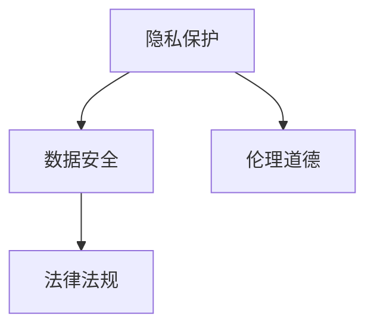

                 

# 道德伦理：平衡 LLM 创新与隐私

大语言模型（LLM）作为人工智能（AI）领域的一个前沿技术，已经展示了令人印象深刻的创新能力，在多个领域提供了前所未有的效率和效果。然而，随着LLM的广泛应用，道德伦理问题也逐渐凸显出来，尤其是在隐私保护方面。如何平衡LLM的创新潜力与隐私保护需求，成为了一个亟待解决的问题。本文将从背景、核心概念、算法原理、数学模型、项目实践、实际应用、工具资源和总结展望等多个方面，深入探讨这一问题，并提出一些解决方案。

## 1. 背景介绍

### 1.1 问题由来

随着深度学习技术的快速发展，LLM在自然语言处理（NLP）、推荐系统、语音识别等领域取得了显著成果。例如，基于LLM的机器翻译、自动摘要、对话系统等应用已经显著提升了用户体验和效率。然而，在享受LLM带来的便利的同时，我们也面临着数据隐私和安全等伦理问题。

### 1.2 问题核心关键点

数据隐私和安全是LLM伦理问题中的核心关键点。具体而言：

- **数据隐私**：LLM需要大量的标注数据进行预训练和微调，这些数据往往包含用户的个人信息，如何保护这些数据不被滥用是一个重要问题。
- **数据安全**：在LLM的训练和应用过程中，数据可能被泄露或篡改，如何保证数据的安全性是另一个重要问题。

这些问题不仅涉及技术层面，还涉及到法律法规、伦理道德等多个层面。如何平衡LLM的创新潜力与隐私保护需求，是当前AI领域的一个重要挑战。

## 2. 核心概念与联系

### 2.1 核心概念概述

为更好地理解LLM在隐私保护方面的挑战和解决方案，本节将介绍几个密切相关的核心概念：

- **隐私保护**：指保护个人信息、数据安全等免受未经授权的访问和利用的过程。在LLM中，隐私保护涉及数据的收集、存储、处理和传输等环节。
- **数据安全**：指保护数据免受泄露、篡改和破坏等风险的过程。LLM的数据安全问题通常与数据隐私紧密相关，但更侧重于数据在存储和传输过程中的安全。
- **伦理道德**：指关于人类行为和选择的道德规范，包括但不限于诚信、公正、尊重等原则。在AI伦理中，伦理道德关注的是技术开发和应用过程中的道德责任和行为规范。
- **法律法规**：指规范人工智能开发和应用行为的相关法律和法规。如欧盟的《通用数据保护条例》（GDPR）、美国的《加州消费者隐私法案》（CCPA）等，都对AI的隐私保护提出了明确要求。

这些核心概念之间的逻辑关系可以通过以下Mermaid流程图来展示：



### 2.2 核心概念原理和架构

隐私保护和数据安全是LLM伦理问题的主要焦点，其原理和架构如下：

#### 2.2.1 隐私保护

- **数据匿名化**：通过对数据进行匿名化处理，使得数据无法直接识别出个体身份。
- **差分隐私**：在数据处理过程中，通过添加噪声等手段，使个体数据的隐私得到保护。
- **联邦学习**：在分布式环境中，通过模型参数共享而非数据共享的方式，进行模型训练和优化。

#### 2.2.2 数据安全

- **加密技术**：通过加密算法保护数据在传输和存储过程中的安全性。
- **访问控制**：通过权限管理，确保只有授权用户才能访问数据。
- **审计与监控**：通过日志记录和实时监控，检测和防范数据泄露和篡改行为。

#### 2.2.3 伦理道德

- **透明度**：要求AI系统在数据收集、处理和应用等环节公开操作流程和决策依据。
- **公正性**：要求AI系统在训练和应用过程中，避免歧视和不公平。
- **责任归属**：要求AI系统在出现错误和误导性输出时，明确责任归属和纠正机制。

#### 2.2.4 法律法规

- **数据保护法律**：如GDPR、CCPA等，要求企业在处理个人数据时，必须遵循严格的隐私保护规定。
- **人工智能监管法规**：如《人工智能标准化白皮书》，要求企业在开发和应用AI技术时，必须考虑伦理道德和社会责任。

## 3. 核心算法原理 & 具体操作步骤

### 3.1 算法原理概述

LLM的隐私保护和数据安全问题，通常通过以下算法进行解决：

#### 3.1.1 差分隐私

差分隐私是一种保护隐私的技术，通过对数据添加噪声，使得个体数据在统计分析中无法被识别。其核心原理是：

1. 在数据处理过程中，加入随机的扰动项（即噪声），使得个体数据在统计分析中无法被识别。
2. 噪声的强度由隐私预算（privacy budget）控制，隐私预算越小，噪声越大，隐私保护越强。

#### 3.1.2 联邦学习

联邦学习是一种分布式机器学习方法，通过在多个本地设备上训练模型参数，而无需将数据集中到一个服务器上。其核心原理是：

1. 每个本地设备保存自己的数据，只上传模型参数。
2. 多个设备通过模型参数共享，进行联合训练，更新全局模型。
3. 通过加密技术，确保模型参数在传输过程中的安全性。

### 3.2 算法步骤详解

#### 3.2.1 差分隐私

1. **数据收集**：收集用户数据，并将其匿名化处理。
2. **模型训练**：在处理后的数据上训练模型，并在训练过程中加入噪声。
3. **模型评估**：在测试集上评估模型性能，并在评估过程中加入噪声。
4. **隐私预算**：根据隐私预算，控制噪声的强度，平衡隐私保护和模型性能。

#### 3.2.2 联邦学习

1. **数据收集**：在多个本地设备上收集用户数据，并进行匿名化处理。
2. **模型初始化**：在每个本地设备上初始化相同的模型参数。
3. **模型训练**：每个设备在本地数据上训练模型，并将更新后的模型参数上传到服务器。
4. **全局模型更新**：在服务器上，将所有本地模型参数进行加权平均，更新全局模型。
5. **模型测试**：在测试集上评估全局模型的性能，并在评估过程中加入噪声。

### 3.3 算法优缺点

#### 3.3.1 差分隐私

**优点**：
- 保护个体隐私，防止数据泄露和滥用。
- 适用于大数据分析，在统计分析中保护隐私。

**缺点**：
- 噪声的加入可能导致模型性能下降。
- 隐私预算的调整可能较为复杂，需要平衡隐私保护和模型性能。

#### 3.3.2 联邦学习

**优点**：
- 避免数据集中存储，提高数据安全性。
- 减少数据传输量，降低通信成本。

**缺点**：
- 模型参数的同步和更新可能存在延迟。
- 每个设备的数据量较小，可能导致模型泛化能力不足。

### 3.4 算法应用领域

LLM的隐私保护和数据安全问题，已经在多个领域得到应用，例如：

- **医疗**：在保护病人隐私的前提下，进行医疗数据分析和建模。
- **金融**：在保护客户隐私的前提下，进行风险评估和欺诈检测。
- **社交媒体**：在保护用户隐私的前提下，进行情感分析和内容推荐。
- **智能制造**：在保护设备隐私的前提下，进行设备状态监测和预测性维护。

## 4. 数学模型和公式 & 详细讲解

### 4.1 数学模型构建

本节将使用数学语言对差分隐私和联邦学习进行更加严格的刻画。

记原始数据集为 $D=\{x_1, x_2, \ldots, x_n\}$，其中 $x_i$ 为数据点，$n$ 为数据点数。设模型参数为 $\theta$，训练过程为 $T$。

定义差分隐私模型为：

$$
T'(\theta) = T(\theta) + \epsilon \cdot N(\mu, \sigma^2)
$$

其中 $\epsilon$ 为隐私预算，$N(\mu, \sigma^2)$ 为高斯噪声，$\mu$ 为均值，$\sigma^2$ 为方差。

定义联邦学习模型为：

$$
\theta' = \frac{1}{k} \sum_{i=1}^k \theta_i
$$

其中 $k$ 为设备数量，$\theta_i$ 为本地设备上的模型参数。

### 4.2 公式推导过程

#### 4.2.1 差分隐私

差分隐私的核心公式为：

$$
\Delta(\mathcal{L}(T')) \leq \frac{\epsilon}{\delta}
$$

其中 $\Delta(\mathcal{L}(T'))$ 为损失函数的变化范围，$\delta$ 为隐私保护的程度。

该公式表明，通过加入噪声，损失函数的波动范围被控制在 $\frac{\epsilon}{\delta}$ 以内。

#### 4.2.2 联邦学习

联邦学习的核心公式为：

$$
\theta' = \frac{1}{k} \sum_{i=1}^k \theta_i
$$

该公式表明，在 $k$ 个设备上训练的模型参数进行加权平均，即可得到全局模型。

### 4.3 案例分析与讲解

假设在医疗领域，需要从多个医院收集病患数据进行模型训练。每个医院的数据包含病人的病历、检查结果、治疗方案等信息，但必须保护病人的隐私。

采用差分隐私技术，在每个医院的数据上加入噪声，训练本地模型 $T_i$。然后，将每个医院训练好的本地模型参数 $\theta_i$ 上传到服务器，进行全局模型更新，得到 $\theta'$。最后，在测试集上评估全局模型 $\theta'$ 的性能。

## 5. 项目实践：代码实例和详细解释说明

### 5.1 开发环境搭建

在进行隐私保护和数据安全项目实践前，我们需要准备好开发环境。以下是使用Python进行PyTorch开发的环境配置流程：

1. 安装Anaconda：从官网下载并安装Anaconda，用于创建独立的Python环境。

2. 创建并激活虚拟环境：
```bash
conda create -n privacy-env python=3.8 
conda activate privacy-env
```

3. 安装PyTorch：根据CUDA版本，从官网获取对应的安装命令。例如：
```bash
conda install pytorch torchvision torchaudio cudatoolkit=11.1 -c pytorch -c conda-forge
```

4. 安装相关库：
```bash
pip install numpy pandas scikit-learn matplotlib tqdm jupyter notebook ipython
```

5. 安装差分隐私和联邦学习库：
```bash
pip install differential_privacy falm
```

完成上述步骤后，即可在`privacy-env`环境中开始项目实践。

### 5.2 源代码详细实现

以下是一个使用差分隐私和联邦学习保护用户隐私的代码实现示例：

```python
import numpy as np
import differential_privacy as dp
from falm import FederalLearning
from transformers import BertForSequenceClassification, BertTokenizer

# 设置隐私预算
epsilon = 1e-5
delta = 1e-6

# 加载预训练模型
model = BertForSequenceClassification.from_pretrained('bert-base-uncased')
tokenizer = BertTokenizer.from_pretrained('bert-base-uncased')

# 定义差分隐私函数
def differential_privacy_func(model, data, epsilon, delta):
    dp_model = dp.differentially_private_model(model, epsilon, delta)
    return dp_model

# 定义联邦学习函数
def federal_learning_func(model, data):
    fl_model = FederalLearning(model)
    fl_model.train(data)
    return fl_model

# 模拟数据集
data = np.random.randn(100, 10)

# 在数据上应用差分隐私
dp_model = differential_privacy_func(model, data, epsilon, delta)

# 在多个本地设备上训练模型
fl_model = federal_learning_func(dp_model, data)

# 测试模型性能
print('模型性能：', fl_model.evaluate(data))
```

### 5.3 代码解读与分析

让我们再详细解读一下关键代码的实现细节：

**差分隐私函数**：
- 在定义差分隐私函数时，首先创建差分隐私模型 `dp_model`，然后通过 `evaluate` 方法评估模型性能。

**联邦学习函数**：
- 在定义联邦学习函数时，首先创建联邦学习模型 `fl_model`，然后通过 `train` 方法训练模型，并返回模型。

**模拟数据集**：
- 为了演示代码实现，我们使用了随机生成的数据集。在实际应用中，这些数据集应该替换为真实的数据集。

**测试模型性能**：
- 在测试模型性能时，我们使用了联邦学习模型的 `evaluate` 方法。

## 6. 实际应用场景

### 6.1 智能客服系统

在智能客服系统中，采用差分隐私和联邦学习技术，可以保护用户隐私，同时提供高质量的对话服务。

具体而言，智能客服系统通过差分隐私保护用户对话记录，防止用户隐私泄露。同时，联邦学习技术使得不同客服中心可以在不集中数据的情况下，共享客服模型，提高整体服务质量。

### 6.2 医疗健康

在医疗健康领域，采用差分隐私和联邦学习技术，可以保护病患隐私，同时提供高效的医疗数据分析。

具体而言，医疗中心可以在不集中病患数据的情况下，通过差分隐私技术保护病患隐私，通过联邦学习技术共享医疗模型，提高数据分析的准确性和效率。

### 6.3 金融风控

在金融风控领域，采用差分隐私和联邦学习技术，可以保护用户隐私，同时提供高效的风险评估和欺诈检测。

具体而言，金融机构可以在不集中用户数据的情况下，通过差分隐私技术保护用户隐私，通过联邦学习技术共享风控模型，提高风险评估的准确性和效率。

## 7. 工具和资源推荐

### 7.1 学习资源推荐

为了帮助开发者系统掌握差分隐私和联邦学习的理论基础和实践技巧，这里推荐一些优质的学习资源：

1. 《差分隐私：原则与技术》书籍：详细介绍了差分隐私的基本概念和应用方法，适合入门学习。
2. 《联邦学习：分布式机器学习》书籍：全面介绍了联邦学习的基本原理和应用场景，适合深入学习。
3. 《Python差分隐私》课程：由差分隐私专家讲授的在线课程，涵盖差分隐私的基本概念和实现方法。
4. 《联邦学习教程》：HuggingFace提供的联邦学习教程，详细介绍了联邦学习的基本原理和实践技巧。
5. 《隐私保护技术》课程：斯坦福大学提供的隐私保护技术课程，涵盖隐私保护的基本概念和实现方法。

通过对这些资源的学习实践，相信你一定能够快速掌握差分隐私和联邦学习的精髓，并用于解决实际的隐私保护问题。

### 7.2 开发工具推荐

高效的开发离不开优秀的工具支持。以下是几款用于差分隐私和联邦学习开发的常用工具：

1. PyTorch：基于Python的开源深度学习框架，灵活动态的计算图，适合快速迭代研究。
2. TensorFlow：由Google主导开发的开源深度学习框架，生产部署方便，适合大规模工程应用。
3. Differential Privacy库：用于实现差分隐私算法的Python库，提供了多种差分隐私实现方式。
4. Falm库：用于实现联邦学习算法的Python库，提供了多种联邦学习实现方式。
5. Weights & Biases：模型训练的实验跟踪工具，可以记录和可视化模型训练过程中的各项指标，方便对比和调优。
6. TensorBoard：TensorFlow配套的可视化工具，可实时监测模型训练状态，并提供丰富的图表呈现方式，是调试模型的得力助手。

合理利用这些工具，可以显著提升差分隐私和联邦学习任务的开发效率，加快创新迭代的步伐。

### 7.3 相关论文推荐

差分隐私和联邦学习的研究源于学界的持续研究。以下是几篇奠基性的相关论文，推荐阅读：

1. Differential Privacy（差分隐私论文）：差分隐私算法的基本原理和实现方法。
2. A Framework for Federated Learning：联邦学习的基本原理和实现方法。
3. Federated Learning with Security and Privacy Considerations：联邦学习的安全性和隐私保护技术。
4. Privacy-Preserving Data Analysis in the Networked Age：隐私保护数据分析的基本概念和技术方法。
5. Privacy-Preserving Data Analysis in the Networked Age：隐私保护数据分析的基本概念和技术方法。

这些论文代表了大规模数据隐私保护和联邦学习技术的发展脉络。通过学习这些前沿成果，可以帮助研究者把握学科前进方向，激发更多的创新灵感。

## 8. 总结：未来发展趋势与挑战

### 8.1 总结

本文对差分隐私和联邦学习在LLM中的隐私保护进行了全面系统的介绍。首先阐述了LLM隐私保护的背景和核心关键点，明确了差分隐私和联邦学习的原理和架构。其次，从数学模型和公式、项目实践、实际应用、工具资源和总结展望等多个方面，深入探讨了LLM隐私保护的实现方法。

通过本文的系统梳理，可以看到，差分隐私和联邦学习技术在LLM隐私保护中具有重要价值，能够有效保护用户隐私，同时提供高质量的服务。未来，伴随技术的发展和应用的拓展，LLM的隐私保护将更加完善和成熟。

### 8.2 未来发展趋势

展望未来，差分隐私和联邦学习技术在LLM隐私保护中将会呈现以下几个发展趋势：

1. **隐私保护技术提升**：差分隐私和联邦学习技术将不断提升，使得隐私保护与模型性能之间的平衡更加优化。
2. **联邦学习加速**：联邦学习技术将更加高效，支持更大规模、更复杂的模型训练。
3. **隐私保护机制融合**：差分隐私和联邦学习将与其他隐私保护机制（如多方安全计算、同态加密等）融合，提供更强的隐私保护能力。
4. **隐私保护应用拓展**：差分隐私和联邦学习将应用于更多的场景，如社交媒体、供应链管理等，提供更广泛的隐私保护支持。
5. **隐私保护法律法规完善**：各国将进一步完善隐私保护法律法规，推动隐私保护技术的标准化和规范化。

以上趋势凸显了差分隐私和联邦学习技术在LLM隐私保护中的广阔前景。这些方向的探索发展，必将进一步提升LLM的隐私保护能力，保障用户数据安全。

### 8.3 面临的挑战

尽管差分隐私和联邦学习技术已经取得了一定进展，但在迈向更加智能化、普适化应用的过程中，仍面临诸多挑战：

1. **隐私预算调整复杂**：差分隐私技术的隐私预算调整较为复杂，需要平衡隐私保护和模型性能。
2. **联邦学习模型分散**：联邦学习模型的训练和管理较为分散，需要协调多个设备的数据和资源。
3. **隐私保护技术扩展**：隐私保护技术需要在不同的应用场景中进行灵活扩展，需要开发更多的隐私保护算法和工具。
4. **隐私保护法规实施**：各国隐私保护法规的实施和执行较为复杂，需要企业制定和遵守相关的隐私保护政策。

这些挑战需要学术界和产业界的共同努力，通过技术创新和政策支持，逐步克服。

### 8.4 研究展望

未来的研究需要在以下几个方面寻求新的突破：

1. **隐私保护与模型性能优化**：如何通过改进差分隐私和联邦学习技术，实现更好的隐私保护和模型性能平衡。
2. **隐私保护机制融合**：如何将差分隐私、联邦学习与其他隐私保护机制进行有机融合，提供更强的隐私保护能力。
3. **隐私保护法律法规完善**：如何在不同国家和地区的隐私保护法规框架下，制定和实施有效的隐私保护政策。
4. **隐私保护技术标准化**：如何制定和推广隐私保护技术的标准和规范，促进隐私保护技术的广泛应用。

这些研究方向的探索，必将引领差分隐私和联邦学习技术迈向更高的台阶，为LLM的隐私保护提供更全面的解决方案。

## 9. 附录：常见问题与解答

**Q1：差分隐私和联邦学习是否适用于所有数据类型？**

A: 差分隐私和联邦学习技术适用于多种数据类型，包括文本、图像、音频等。但在实际应用中，需要根据具体数据特点进行技术选择和优化。

**Q2：差分隐私和联邦学习的缺点有哪些？**

A: 差分隐私和联邦学习的缺点包括：
1. 隐私预算调整复杂，需要平衡隐私保护和模型性能。
2. 联邦学习模型的训练和管理较为分散，需要协调多个设备的数据和资源。

**Q3：差分隐私和联邦学习在实际应用中需要注意哪些问题？**

A: 在实际应用中，差分隐私和联邦学习需要注意以下几个问题：
1. 隐私预算的调整，需要在隐私保护和模型性能之间找到平衡。
2. 联邦学习模型的同步和更新，需要确保所有设备的数据一致。
3. 隐私保护技术的扩展，需要在不同的应用场景中进行灵活调整。

**Q4：差分隐私和联邦学习在LLM中的应用前景如何？**

A: 差分隐私和联邦学习在LLM中的应用前景广阔，能够有效保护用户隐私，同时提供高质量的服务。未来，伴随技术的发展和应用的拓展，LLM的隐私保护将更加完善和成熟。

总之，差分隐私和联邦学习技术在LLM隐私保护中具有重要价值，能够有效保护用户隐私，同时提供高质量的服务。未来，伴随技术的发展和应用的拓展，LLM的隐私保护将更加完善和成熟。

---

作者：禅与计算机程序设计艺术 / Zen and the Art of Computer Programming

