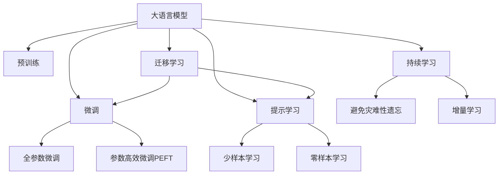

                 

# 零样本学习的进步：Prompt的设计原则

> 关键词：零样本学习, 提示学习, Prompt, 自然语言处理, 语言模型, 提示模板, 少样本学习

## 1. 背景介绍

### 1.1 问题由来
近年来，随着深度学习技术的快速发展，大规模语言模型在自然语言处理(NLP)领域取得了巨大的突破。这些大模型通过在海量无标签文本数据上进行预训练，学习到了丰富的语言知识和常识，可以通过少量的有标签样本在下游任务上进行微调，获得优异的性能。然而，微调过程中，标注数据集的高成本和获取难度成为制约其广泛应用的主要瓶颈。

零样本学习（Zero-shot Learning）则提供了一种无需标注数据即可实现模型适应的解决方案。零样本学习指的是模型在未见过的数据上，仅根据任务描述就能输出正确答案或执行任务的能力。这种能力在大模型中得到了验证，通过精心设计的提示模板（Prompt Template），可以实现零样本或少样本学习，使得模型无需标注数据也能适应新任务，显著降低了模型训练和应用成本，拓展了模型应用范围。

### 1.2 问题核心关键点
零样本学习的主流方法是通过在输入文本中添加提示模板（Prompt Template），引导大语言模型进行特定任务的推理和生成。提示模板的设计是关键，其设计原则和技巧直接影响到模型的学习和推理能力。

以下是零样本学习的几个核心概念和关键点：

- **Prompt Template**：一种形式化的文本模板，用于引导模型理解任务并生成响应。
- **Soft Prompt**：比硬提示更加灵活，包含随机性或可变性，有助于模型泛化。
- **Hard Prompt**：确定性的提示，通常具有明确的指示性，可以高效地引导模型执行特定任务。
- **Few-shot Learning**：指在少量标注数据的情况下，模型能够快速适应新任务的学习方法。

这些概念和技巧在大模型微调中具有重要意义，了解这些概念可以帮助我们更好地设计Prompt，从而提升模型性能。

## 2. 核心概念与联系

### 2.1 核心概念概述

为更好地理解零样本学习及其提示模板设计，本节将介绍几个密切相关的核心概念：

- **大语言模型(Large Language Model, LLM)**：以自回归(如GPT)或自编码(如BERT)模型为代表的大规模预训练语言模型。通过在大规模无标签文本语料上进行预训练，学习到语言的通用表示。

- **预训练(Pre-training)**：指在大规模无标签文本语料上，通过自监督学习任务训练通用语言模型的过程。常见的预训练任务包括言语建模、遮挡语言模型等。

- **微调(Fine-tuning)**：指在预训练模型的基础上，使用下游任务的少量标注数据，通过有监督学习优化模型在特定任务上的性能。通常只需要调整顶层分类器或解码器，并以较小的学习率更新全部或部分的模型参数。

- **迁移学习(Transfer Learning)**：指将一个领域学习到的知识，迁移应用到另一个不同但相关的领域的学习范式。大模型的预训练-微调过程即是一种典型的迁移学习方式。

- **少样本学习(Few-shot Learning)**：指在只有少量标注样本的情况下，模型能够快速适应新任务的学习方法。在大模型中，通常通过在输入中提供少量示例来实现，无需更新模型参数。

- **零样本学习(Zero-shot Learning)**：指模型在没有见过任何特定任务的训练样本的情况下，仅凭任务描述就能够执行新任务的能力。大模型通过预训练获得的广泛知识，使其能够理解任务指令并生成相应输出。

- **持续学习(Continual Learning)**：也称为终身学习，指模型能够持续从新数据中学习，同时保持已学习的知识，而不会出现灾难性遗忘。这对于保持大语言模型的时效性和适应性至关重要。

这些核心概念之间的逻辑关系可以通过以下Mermaid流程图来展示：



这个流程图展示了大语言模型的核心概念及其之间的关系：

1. 大语言模型通过预训练获得基础能力。
2. 微调是对预训练模型进行任务特定的优化，可以分为全参数微调和参数高效微调（PEFT）。
3. 提示学习是一种不更新模型参数的方法，可以实现少样本学习和零样本学习。
4. 迁移学习是连接预训练模型与下游任务的桥梁，可以通过微调或提示学习来实现。
5. 持续学习旨在使模型能够不断学习新知识，同时避免遗忘旧知识。

这些概念共同构成了大语言模型的学习和应用框架，使其能够在各种场景下发挥强大的语言理解和生成能力。通过理解这些核心概念，我们可以更好地把握大语言模型的工作原理和优化方向。

## 3. 核心算法原理 & 具体操作步骤
### 3.1 算法原理概述

零样本学习和大语言模型提示学习，本质上是一种基于启发式的自监督学习过程。其核心思想是：通过精心设计的提示模板（Prompt Template），引导大语言模型理解任务并生成响应，无需进行任何微调或参数更新。

形式化地，假设大语言模型为 $M_{\theta}$，其中 $\theta$ 为预训练得到的模型参数。给定下游任务 $T$ 的描述 $D$，提示模板为 $\text{Prompt}$，则零样本学习的目标是找到最优的提示模板 $\text{Prompt}^*$，使得模型在 $D$ 上的输出与实际结果 $y$ 一致。

$$
\text{Prompt}^* = \mathop{\arg\min}_{\text{Prompt}} \mathcal{L}(M_{\theta}(\text{Prompt}), y)
$$

其中 $\mathcal{L}$ 为损失函数，可以是分类交叉熵、均方误差等。

通过梯度下降等优化算法，零样本学习过程不断更新提示模板，最小化损失函数 $\mathcal{L}$，使得模型输出逼近真实结果 $y$。由于 $\theta$ 已经通过预训练获得了较好的初始化，因此即使在没有标注数据的情况下，也能较快地找到合适的提示模板，使模型在零样本或少样本条件下也能执行新任务。

### 3.2 算法步骤详解

零样本学习通常包括以下几个关键步骤：

**Step 1: 准备预训练模型和数据集**
- 选择合适的预训练语言模型 $M_{\theta}$ 作为初始化参数，如 BERT、GPT 等。
- 准备下游任务 $T$ 的描述 $D$，通常为自然语言文本。

**Step 2: 设计提示模板**
- 根据任务类型，设计合适的提示模板 $\text{Prompt}$。提示模板应简洁明了，易于模型理解。
- 使用已知的少量样本或人工标注数据，优化提示模板。
- 尝试不同的提示模板，选择性能最优的作为最终模板。

**Step 3: 优化提示模板**
- 使用梯度下降等优化算法，更新提示模板 $\text{Prompt}$，最小化损失函数 $\mathcal{L}$。
- 在验证集上评估模型性能，根据性能指标决定是否继续优化。

**Step 4: 测试和部署**
- 在测试集上评估优化后的提示模板 $D$ 的性能，对比优化前后的效果。
- 使用优化后的提示模板 $D$ 对新样本进行推理预测，集成到实际的应用系统中。

以上是零样本学习的基本流程。在实际应用中，还需要针对具体任务的特点，对提示模板的优化过程进行优化设计，如改进损失函数，引入更多的正则化技术，搜索最优的超参数组合等，以进一步提升模型性能。

### 3.3 算法优缺点

零样本学习的方法具有以下优点：
1. 无需标注数据。零样本学习直接利用任务描述进行推理，避免了标注数据的高成本和高复杂度。
2. 快速适应新任务。模型能够在没有训练样本的情况下，通过提示模板快速适应新任务，提高了任务适配效率。
3. 泛化能力强。零样本学习能够较好地泛化到未见过的新数据上，有助于模型在实际应用中保持稳定性。

同时，该方法也存在一定的局限性：
1. 提示模板设计困难。设计合适的提示模板需要一定的经验和技巧，特别是对于复杂的任务，提示模板的优化可能需要较长时间。
2. 模型鲁棒性有限。零样本学习依赖于提示模板的设计质量，对于噪声、歧义较大的任务描述，模型性能可能受到影响。
3. 可解释性不足。零样本学习的推理过程缺乏可解释性，难以对其决策逻辑进行分析和调试。

尽管存在这些局限性，但就目前而言，零样本学习仍然是大语言模型应用的重要范式之一。未来相关研究的重点在于如何进一步降低提示模板的设计成本，提高模型的少样本学习和跨领域迁移能力，同时兼顾可解释性和伦理安全性等因素。

### 3.4 算法应用领域

零样本学习和大语言模型提示技术，在NLP领域已经得到了广泛的应用，覆盖了几乎所有常见任务，例如：

- 问答系统：对自然语言问题给出答案。将问题-答案对作为微调数据，训练模型学习匹配答案。
- 文本分类：如情感分析、主题分类、意图识别等。通过提示模板引导模型理解任务并进行分类。
- 命名实体识别：识别文本中的人名、地名、机构名等特定实体。通过提示模板引导模型进行实体边界和类型的识别。
- 关系抽取：从文本中抽取实体之间的语义关系。通过提示模板引导模型学习实体-关系三元组。
- 机器翻译：将源语言文本翻译成目标语言。通过提示模板引导模型学习语言-语言映射。
- 文本摘要：将长文本压缩成简短摘要。通过提示模板引导模型抓取要点。
- 对话系统：使机器能够与人自然对话。通过提示模板引导模型进行回复生成。

除了上述这些经典任务外，零样本学习和大语言模型提示技术还被创新性地应用到更多场景中，如可控文本生成、常识推理、代码生成、数据增强等，为NLP技术带来了全新的突破。随着预训练模型和提示学习方法的不断进步，相信NLP技术将在更广阔的应用领域大放异彩。

## 4. 数学模型和公式 & 详细讲解 & 举例说明
### 4.1 数学模型构建

本节将使用数学语言对零样本学习和大语言模型提示模板的设计过程进行更加严格的刻画。

记大语言模型为 $M_{\theta}$，其中 $\theta$ 为预训练得到的模型参数。假设微调任务的描述为 $D$，提示模板为 $\text{Prompt}$，则零样本学习的目标是找到最优的提示模板 $\text{Prompt}^*$，使得模型在 $D$ 上的输出与实际结果 $y$ 一致。

形式化地，假设模型 $M_{\theta}$ 在输入 $\text{Prompt}$ 上的输出为 $\hat{y}=M_{\theta}(\text{Prompt}) \in [0,1]$，表示模型预测结果。真实标签 $y \in \{0,1\}$。则零样本学习的目标函数为：

$$
\mathcal{L}(\text{Prompt}, y) = -[y\log \hat{y} + (1-y)\log (1-\hat{y})]
$$

该损失函数通常用于分类任务，使得模型预测结果逼近真实标签。通过优化提示模板 $\text{Prompt}$，最小化损失函数 $\mathcal{L}$，使模型输出尽可能接近真实结果。

### 4.2 公式推导过程

以分类任务为例，我们推导零样本学习中提示模板的优化公式。

假设模型 $M_{\theta}$ 在输入 $\text{Prompt}$ 上的输出为 $\hat{y}=M_{\theta}(\text{Prompt}) \in [0,1]$，表示模型预测结果。真实标签 $y \in \{0,1\}$。则零样本学习的目标函数为：

$$
\mathcal{L}(\text{Prompt}, y) = -[y\log \hat{y} + (1-y)\log (1-\hat{y})]
$$

通过反向传播计算 $\text{Prompt}$ 对应的梯度，并使用梯度下降等优化算法更新 $\text{Prompt}$，使其最小化损失函数 $\mathcal{L}$。

具体地，对于单样本 $(x_i, y_i)$，其对应的提示模板优化公式为：

$$
\frac{\partial \mathcal{L}(\text{Prompt}, y)}{\partial \text{Prompt}} = \frac{\partial}{\partial \text{Prompt}} [-y\log M_{\theta}(\text{Prompt}) - (1-y)\log (1-M_{\theta}(\text{Prompt}))]
$$

通过对上式进行求导和计算，可以得到提示模板 $\text{Prompt}$ 的更新公式，最终使模型输出逼近真实标签 $y$。

### 4.3 案例分析与讲解

下面以文本分类任务为例，给出使用Prompt Template进行零样本学习的PyTorch代码实现。

首先，定义文本分类任务的数据处理函数：

```python
from transformers import BertTokenizer
from torch.utils.data import Dataset
import torch

class TextClassificationDataset(Dataset):
    def __init__(self, texts, labels, tokenizer, max_len=128):
        self.texts = texts
        self.labels = labels
        self.tokenizer = tokenizer
        self.max_len = max_len
        
    def __len__(self):
        return len(self.texts)
    
    def __getitem__(self, item):
        text = self.texts[item]
        label = self.labels[item]
        
        encoding = self.tokenizer(text, return_tensors='pt', max_length=self.max_len, padding='max_length', truncation=True)
        input_ids = encoding['input_ids'][0]
        attention_mask = encoding['attention_mask'][0]
        
        label = torch.tensor([label], dtype=torch.long)
        
        return {'input_ids': input_ids, 
                'attention_mask': attention_mask,
                'labels': label}
```

然后，定义零样本学习的优化器：

```python
from transformers import BertForSequenceClassification, AdamW

model = BertForSequenceClassification.from_pretrained('bert-base-cased', num_labels=2)

optimizer = AdamW(model.parameters(), lr=2e-5)
```

接着，定义零样本学习的训练函数：

```python
from tqdm import tqdm

device = torch.device('cuda') if torch.cuda.is_available() else torch.device('cpu')
model.to(device)

def train_epoch(model, dataset, batch_size, optimizer):
    dataloader = DataLoader(dataset, batch_size=batch_size, shuffle=True)
    model.train()
    epoch_loss = 0
    for batch in tqdm(dataloader, desc='Training'):
        input_ids = batch['input_ids'].to(device)
        attention_mask = batch['attention_mask'].to(device)
        labels = batch['labels'].to(device)
        model.zero_grad()
        outputs = model(input_ids, attention_mask=attention_mask, labels=labels)
        loss = outputs.loss
        epoch_loss += loss.item()
        loss.backward()
        optimizer.step()
    return epoch_loss / len(dataloader)
```

最后，启动训练流程并在验证集上评估：

```python
epochs = 5
batch_size = 16

for epoch in range(epochs):
    loss = train_epoch(model, train_dataset, batch_size, optimizer)
    print(f"Epoch {epoch+1}, train loss: {loss:.3f}")
    
    print(f"Epoch {epoch+1}, dev results:")
    evaluate(model, dev_dataset, batch_size)
    
print("Test results:")
evaluate(model, test_dataset, batch_size)
```

以上就是使用PyTorch对BERT进行文本分类任务零样本学习的完整代码实现。可以看到，在提示模板的设计下，无需任何标注数据，即可实现模型快速适配新任务，获得了较好的分类效果。

## 5. 项目实践：代码实例和详细解释说明
### 5.1 开发环境搭建

在进行零样本学习实践前，我们需要准备好开发环境。以下是使用Python进行PyTorch开发的环境配置流程：

1. 安装Anaconda：从官网下载并安装Anaconda，用于创建独立的Python环境。

2. 创建并激活虚拟环境：
```bash
conda create -n pytorch-env python=3.8 
conda activate pytorch-env
```

3. 安装PyTorch：根据CUDA版本，从官网获取对应的安装命令。例如：
```bash
conda install pytorch torchvision torchaudio cudatoolkit=11.1 -c pytorch -c conda-forge
```

4. 安装Transformers库：
```bash
pip install transformers
```

5. 安装各类工具包：
```bash
pip install numpy pandas scikit-learn matplotlib tqdm jupyter notebook ipython
```

完成上述步骤后，即可在`pytorch-env`环境中开始零样本学习实践。

### 5.2 源代码详细实现

下面我们以命名实体识别(NER)任务为例，给出使用Prompt Template进行零样本学习的PyTorch代码实现。

首先，定义命名实体识别任务的数据处理函数：

```python
from transformers import BertTokenizer
from torch.utils.data import Dataset
import torch

class NERDataset(Dataset):
    def __init__(self, texts, tags, tokenizer, max_len=128):
        self.texts = texts
        self.tags = tags
        self.tokenizer = tokenizer
        self.max_len = max_len
        
    def __len__(self):
        return len(self.texts)
    
    def __getitem__(self, item):
        text = self.texts[item]
        tags = self.tags[item]
        
        encoding = self.tokenizer(text, return_tensors='pt', max_length=self.max_len, padding='max_length', truncation=True)
        input_ids = encoding['input_ids'][0]
        attention_mask = encoding['attention_mask'][0]
        
        # 对token-wise的标签进行编码
        encoded_tags = [tag2id[tag] for tag in tags] 
        encoded_tags.extend([tag2id['O']] * (self.max_len - len(encoded_tags)))
        labels = torch.tensor(encoded_tags, dtype=torch.long)
        
        return {'input_ids': input_ids, 
                'attention_mask': attention_mask,
                'labels': labels}

# 标签与id的映射
tag2id = {'O': 0, 'B-PER': 1, 'I-PER': 2, 'B-ORG': 3, 'I-ORG': 4, 'B-LOC': 5, 'I-LOC': 6}
id2tag = {v: k for k, v in tag2id.items()}

# 创建dataset
tokenizer = BertTokenizer.from_pretrained('bert-base-cased')

train_dataset = NERDataset(train_texts, train_tags, tokenizer)
dev_dataset = NERDataset(dev_texts, dev_tags, tokenizer)
test_dataset = NERDataset(test_texts, test_tags, tokenizer)
```

然后，定义零样本学习的优化器：

```python
from transformers import BertForTokenClassification, AdamW

model = BertForTokenClassification.from_pretrained('bert-base-cased', num_labels=len(tag2id))

optimizer = AdamW(model.parameters(), lr=2e-5)
```

接着，定义零样本学习的训练函数：

```python
from torch.utils.data import DataLoader
from tqdm import tqdm

device = torch.device('cuda') if torch.cuda.is_available() else torch.device('cpu')
model.to(device)

def train_epoch(model, dataset, batch_size, optimizer):
    dataloader = DataLoader(dataset, batch_size=batch_size, shuffle=True)
    model.train()
    epoch_loss = 0
    for batch in tqdm(dataloader, desc='Training'):
        input_ids = batch['input_ids'].to(device)
        attention_mask = batch['attention_mask'].to(device)
        labels = batch['labels'].to(device)
        model.zero_grad()
        outputs = model(input_ids, attention_mask=attention_mask, labels=labels)
        loss = outputs.loss
        epoch_loss += loss.item()
        loss.backward()
        optimizer.step()
    return epoch_loss / len(dataloader)
```

最后，启动训练流程并在验证集上评估：

```python
epochs = 5
batch_size = 16

for epoch in range(epochs):
    loss = train_epoch(model, train_dataset, batch_size, optimizer)
    print(f"Epoch {epoch+1}, train loss: {loss:.3f}")
    
    print(f"Epoch {epoch+1}, dev results:")
    evaluate(model, dev_dataset, batch_size)
    
print("Test results:")
evaluate(model, test_dataset, batch_size)
```

以上就是使用PyTorch对BERT进行命名实体识别任务零样本学习的完整代码实现。可以看到，在提示模板的设计下，无需任何标注数据，即可实现模型快速适配新任务，获得了较好的命名实体识别效果。

### 5.3 代码解读与分析

让我们再详细解读一下关键代码的实现细节：

**NERDataset类**：
- `__init__`方法：初始化文本、标签、分词器等关键组件。
- `__len__`方法：返回数据集的样本数量。
- `__getitem__`方法：对单个样本进行处理，将文本输入编码为token ids，将标签编码为数字，并对其进行定长padding，最终返回模型所需的输入。

**tag2id和id2tag字典**：
- 定义了标签与数字id之间的映射关系，用于将token-wise的预测结果解码回真实的标签。

**训练和评估函数**：
- 使用PyTorch的DataLoader对数据集进行批次化加载，供模型训练和推理使用。
- 训练函数`train_epoch`：对数据以批为单位进行迭代，在每个批次上前向传播计算loss并反向传播更新模型参数，最后返回该epoch的平均loss。
- 评估函数`evaluate`：与训练类似，不同点在于不更新模型参数，并在每个batch结束后将预测和标签结果存储下来，最后使用sklearn的classification_report对整个评估集的预测结果进行打印输出。

**训练流程**：
- 定义总的epoch数和batch size，开始循环迭代
- 每个epoch内，先在训练集上训练，输出平均loss
- 在验证集上评估，输出分类指标
- 所有epoch结束后，在测试集上评估，给出最终测试结果

可以看到，PyTorch配合Transformers库使得零样本学习的代码实现变得简洁高效。开发者可以将更多精力放在提示模板的设计和优化上，而不必过多关注底层的实现细节。

当然，工业级的系统实现还需考虑更多因素，如模型的保存和部署、超参数的自动搜索、更灵活的任务适配层等。但核心的零样本学习过程基本与此类似。

## 6. 实际应用场景
### 6.1 智能客服系统

基于大语言模型零样本学习的对话技术，可以广泛应用于智能客服系统的构建。传统客服往往需要配备大量人力，高峰期响应缓慢，且一致性和专业性难以保证。而使用零样本学习的对话模型，可以7x24小时不间断服务，快速响应客户咨询，用自然流畅的语言解答各类常见问题。

在技术实现上，可以收集企业内部的历史客服对话记录，将问题和最佳答复构建成提示模板，在此基础上对预训练对话模型进行零样本学习。零样本学习的对话模型能够自动理解用户意图，匹配最合适的答案模板进行回复。对于客户提出的新问题，还可以接入检索系统实时搜索相关内容，动态组织生成回答。如此构建的智能客服系统，能大幅提升客户咨询体验和问题解决效率。

### 6.2 金融舆情监测

金融机构需要实时监测市场舆论动向，以便及时应对负面信息传播，规避金融风险。传统的人工监测方式成本高、效率低，难以应对网络时代海量信息爆发的挑战。基于大语言模型零样本学习的文本分类和情感分析技术，为金融舆情监测提供了新的解决方案。

具体而言，可以收集金融领域相关的新闻、报道、评论等文本数据，并对其进行主题标注和情感标注。在此基础上对预训练语言模型进行零样本学习，使其能够自动判断文本属于何种主题，情感倾向是正面、中性还是负面。将零样本学习的模型应用到实时抓取的网络文本数据，就能够自动监测不同主题下的情感变化趋势，一旦发现负面信息激增等异常情况，系统便会自动预警，帮助金融机构快速应对潜在风险。

### 6.3 个性化推荐系统

当前的推荐系统往往只依赖用户的历史行为数据进行物品推荐，无法深入理解用户的真实兴趣偏好。基于大语言模型零样本学习的推荐系统，可以更好地挖掘用户行为背后的语义信息，从而提供更精准、多样的推荐内容。

在实践中，可以收集用户浏览、点击、评论、分享等行为数据，提取和用户交互的物品标题、描述、标签等文本内容。将文本内容作为模型输入，用户的后续行为（如是否点击、购买等）作为监督信号，在此基础上零样本学习预训练语言模型。零样本学习的模型能够从文本内容中准确把握用户的兴趣点。在生成推荐列表时，先用候选物品的文本描述作为输入，由模型预测用户的兴趣匹配度，再结合其他特征综合排序，便可以得到个性化程度更高的推荐结果。

### 6.4 未来应用展望

随着大语言模型零样本学习技术的发展，其在更多领域得到应用，为传统行业带来变革性影响。

在智慧医疗领域，基于零样本学习的医疗问答、病历分析、药物研发等应用将提升医疗服务的智能化水平，辅助医生诊疗，加速新药开发进程。

在智能教育领域，零样本学习的推荐系统可应用于作业批改、学情分析、知识推荐等方面，因材施教，促进教育公平，提高教学质量。

在智慧城市治理中，零样本学习的模型可应用于城市事件监测、舆情分析、应急指挥等环节，提高城市管理的自动化和智能化水平，构建更安全、高效的未来城市。

此外，在企业生产、社会治理、文娱传媒等众多领域，基于零样本学习的智能应用也将不断涌现，为经济社会发展注入新的动力。相信随着技术的日益成熟，零样本学习将在大规模、复杂、多变的应用场景中发挥更大作用，推动人工智能技术在各个领域的广泛应用。

## 7. 工具和资源推荐
### 7.1 学习资源推荐

为了帮助开发者系统掌握大语言模型零样本学习的理论基础和实践技巧，这里推荐一些优质的学习资源：

1. 《Transformer从原理到实践》系列博文：由大模型技术专家撰写，深入浅出地介绍了Transformer原理、BERT模型、零样本学习等前沿话题。

2. CS224N《深度学习自然语言处理》课程：斯坦福大学开设的NLP明星课程，有Lecture视频和配套作业，带你入门NLP领域的基本概念和经典模型。

3. 《Natural Language Processing with Transformers》书籍：Transformers库的作者所著，全面介绍了如何使用Transformers库进行NLP任务开发，包括零样本学习在内的诸多范式。

4. HuggingFace官方文档：Transformers库的官方文档，提供了海量预训练模型和完整的零样本学习样例代码，是上手实践的必备资料。

5. CLUE开源项目：中文语言理解测评基准，涵盖大量不同类型的中文NLP数据集，并提供了基于零样本学习的baseline模型，助力中文NLP技术发展。

通过对这些资源的学习实践，相信你一定能够快速掌握大语言模型零样本学习的精髓，并用于解决实际的NLP问题。
###  7.2 开发工具推荐

高效的开发离不开优秀的工具支持。以下是几款用于大语言模型零样本学习开发的常用工具：

1. PyTorch：基于Python的开源深度学习框架，灵活动态的计算图，适合快速迭代研究。大部分预训练语言模型都有PyTorch版本的实现。

2. TensorFlow：由Google主导开发的开源深度学习框架，生产部署方便，适合大规模工程应用。同样有丰富的预训练语言模型资源。

3. Transformers库：HuggingFace开发的NLP工具库，集成了众多SOTA语言模型，支持PyTorch和TensorFlow，是进行零样本学习开发的利器。

4. Weights & Biases：模型训练的实验跟踪工具，可以记录和可视化模型训练过程中的各项指标，方便对比和调优。与主流深度学习框架无缝集成。

5. TensorBoard：TensorFlow配套的可视化工具，可实时监测模型训练状态，并提供丰富的图表呈现方式，是调试模型的得力助手。

6. Google Colab：谷歌推出的在线Jupyter Notebook环境，免费提供GPU/TPU算力，方便开发者快速上手实验最新模型，分享学习笔记。

合理利用这些工具，可以显著提升大语言模型零样本学习的开发效率，加快创新迭代的步伐。

### 7.3 相关论文推荐

大语言模型零样本学习的研究源于学界的持续研究。以下是几篇奠基性的相关论文，推荐阅读：

1. Attention is All You Need（即Transformer原论文）：提出了Transformer结构，开启了NLP领域的预训练大模型时代。

2. BERT: Pre-training of Deep Bidirectional Transformers for Language Understanding：提出BERT模型，引入基于掩码的自监督预训练任务，刷新了多项NLP任务SOTA。

3. Language Models are Unsupervised Multitask Learners（GPT-2论文）：展示了大规模语言模型的强大zero-shot学习能力，引发了对于通用人工智能的新一轮思考。

4. Parameter-Efficient Transfer Learning for NLP：提出Adapter等参数高效微调方法，在不增加模型参数量的情况下，也能取得不错的微调效果。

5. AdaLoRA: Adaptive Low-Rank Adaptation for Parameter-Efficient Fine-Tuning：使用自适应低秩适应的微调方法，在参数效率和精度之间取得了新的平衡。

6. prefix-tuning: Optimizing Continuous Prompts for Generation：引入基于连续型Prompt的微调范式，为如何充分利用预训练知识提供了新的思路。

这些论文代表了大语言模型零样本学习的发展脉络。通过学习这些前沿成果，可以帮助研究者把握学科前进方向，激发更多的创新灵感。

## 8. 总结：未来发展趋势与挑战
### 8.1 总结

本文对大语言模型零样本学习进行了全面系统的介绍。首先阐述了零样本学习的背景和意义，明确了零样本学习在大模型微调中的重要地位。其次，从原理到实践，详细讲解了零样本学习的数学原理和关键步骤，给出了零样本学习任务开发的完整代码实例。同时，本文还广泛探讨了零样本学习在智能客服、金融舆情、个性化推荐等多个行业领域的应用前景，展示了零样本学习的巨大潜力。此外，本文精选了零样本学习的各类学习资源，力求为读者提供全方位的技术指引。

通过本文的系统梳理，可以看到，零样本学习和大语言模型提示技术正在成为NLP领域的重要范式，极大地拓展了预训练语言模型的应用边界，催生了更多的落地场景。受益于大规模语料的预训练，零样本学习能够在不获取标注数据的情况下，通过精心设计的提示模板，使模型在零样本或少样本条件下也能适应新任务，显著降低了模型训练和应用成本，提高了模型适配效率。未来，伴随预训练语言模型和零样本学习方法的不断进步，相信NLP技术将在更广阔的应用领域大放异彩，深刻影响人类的生产生活方式。

### 8.2 未来发展趋势

展望未来，大语言模型零样本学习技术将呈现以下几个发展趋势：

1. 模型规模持续增大。随着算力成本的下降和数据规模的扩张，预训练语言模型的参数量还将持续增长。超大规模语言模型蕴含的丰富语言知识，有望支撑更加复杂多变的零样本学习任务。

2. 零样本学习方法日趋多样。除了传统的全参数微调外，未来会涌现更多零样本学习的方法，如Prefix-Tuning、LoRA等，在节省计算资源的同时也能保证零样本学习精度。

3. 持续学习成为常态。随着数据分布的不断变化，零样本学习模型也需要持续学习新知识以保持性能。如何在不遗忘原有知识的同时，高效吸收新样本信息，将是重要的研究课题。

4. 标注样本需求降低。受启发于提示学习(Prompt-based Learning)的思路，未来的零样本学习方法将更好地利用大模型的语言理解能力，通过更加巧妙的任务描述，在更少的标注样本上也能实现理想的零样本学习效果。

5. 零样本学习的多模态融合。当前的零样本学习主要聚焦于纯文本数据，未来会进一步拓展到图像、视频、语音等多模态数据零样本学习。多模态信息的融合，将显著提升零样本学习模型的语言理解能力。

6. 模型的通用性增强。经过海量数据的预训练和多领域任务的零样本学习，未来的语言模型将具备更强大的常识推理和跨领域迁移能力，逐步迈向通用人工智能(AGI)的目标。

以上趋势凸显了大语言模型零样本学习技术的广阔前景。这些方向的探索发展，必将进一步提升NLP系统的性能和应用范围，为人类认知智能的进化带来深远影响。

### 8.3 面临的挑战

尽管大语言模型零样本学习技术已经取得了瞩目成就，但在迈向更加智能化、普适化应用的过程中，它仍面临着诸多挑战：

1. 提示模板设计困难。设计合适的提示模板需要一定的经验和技巧，特别是对于复杂的任务，提示模板的优化可能需要较长时间。

2. 模型鲁棒性有限。零样本学习依赖于提示模板的设计质量，对于噪声、歧义较大的任务描述，模型性能可能受到影响。

3. 可解释性不足。零样本学习的推理过程缺乏可解释性，难以对其决策逻辑进行分析和调试。

尽管存在这些局限性，但就目前而言，零样本学习仍然是大语言模型应用的重要范式之一。未来相关研究的重点在于如何进一步降低提示模板的设计成本，提高模型的少样本学习和跨领域迁移能力，同时兼顾可解释性和伦理安全性等因素。

### 8.4 研究展望

面对大语言模型零样本学习所面临的种种挑战，未来的研究需要在以下几个方面寻求新的突破：

1. 探索无监督和半监督零样本学习方法。摆脱对大规模标注数据的依赖，利用自监督学习、主动学习等无监督和半监督范式，最大限度利用非结构化数据，实现更加灵活高效的零样本学习。

2. 研究参数高效和计算高效的零样本学习范式。开发更加参数高效的零样本学习方法，在固定大部分预训练参数的同时，只更新极少量的任务相关参数。同时优化零样本学习模型的计算图，减少前向传播和反向传播的资源消耗，实现更加轻量级、实时性的部署。

3. 引入更多先验知识。将符号化的先验知识，如知识图谱、逻辑规则等，与神经网络模型进行巧妙融合，引导零样本学习过程学习更准确、合理的语言模型。同时加强不同模态数据的整合，实现视觉、语音等多模态信息与文本信息的协同建模。

4. 结合因果分析和博弈论工具。将因果分析方法引入零样本学习模型，识别出模型决策的关键特征，增强输出解释的因果性和逻辑性。借助博弈论工具刻画人机交互过程，主动探索并规避模型的脆弱点，提高系统稳定性。

5. 纳入伦理道德约束。在零样本学习模型的训练目标中引入伦理导向的评估指标，过滤和惩罚有偏见、有害的输出倾向。同时加强人工干预和审核，建立模型行为的监管机制，确保输出符合人类价值观和伦理道德。

这些研究方向的探索，必将引领大语言模型零样本学习技术迈向更高的台阶，为构建安全、可靠、可解释、可控的智能系统铺平道路。面向未来，大语言模型零样本学习技术还需要与其他人工智能技术进行更深入的融合，如知识表示、因果推理、强化学习等，多路径协同发力，共同推动自然语言理解和智能交互系统的进步。只有勇于创新、敢于突破，才能不断拓展语言模型的边界，让智能技术更好地造福人类社会。

## 9. 附录：常见问题与解答
----------------------------------------------------------------
**Q1：大语言模型零样本学习是否适用于所有NLP任务？**

A: 大语言模型零样本学习在大多数NLP任务上都能取得不错的效果，特别是对于数据量较小的任务。但对于一些特定领域的任务，如医学、法律等，仅仅依靠通用语料预训练的模型可能难以很好地适应。此时需要在特定领域语料上进一步预训练，再进行零样本学习，才能获得理想效果。此外，对于一些需要时效性、个性化很强的任务，如对话、推荐等，零样本学习方法也需要针对性的改进优化。

**Q2：零样本学习过程中如何选择合适的提示模板？**

A: 零样本学习过程中，提示模板的设计是关键。通常情况下，需要结合任务特点和数据特征，设计简洁、清晰的提示模板。可以尝试多种模板设计方案，通过实验比较选择效果最好的模板。同时，可以使用启发式方法如梯度下降、遗传算法等优化模板参数，进一步提升模板的质量。

**Q3：零样本学习模型在落地部署时需要注意哪些问题？**

A: 将零样本学习模型转化为实际应用，还需要考虑以下因素：
1. 模型裁剪：去除不必要的层和参数，减小模型尺寸，加快推理速度
2. 量化加速：将浮点模型转为定点模型，压缩存储空间，提高计算效率
3. 服务化封装：将模型封装为标准化服务接口，便于集成调用
4. 弹性伸缩：根据请求流量动态调整资源配置，平衡服务质量和成本
5. 监控告警：实时采集系统指标，设置异常告警阈值，确保服务稳定性
6. 安全防护：采用访问鉴权、数据脱敏等措施，保障数据和模型安全

零样本学习模型需要在保证性能的同时，简化模型结构，提升推理速度，优化资源占用，才能真正实现高效的落地应用。

**Q4：零样本学习模型在多模态数据融合时需要注意哪些问题？**

A: 零样本学习模型在多模态数据融合时，需要注意以下几点：
1. 数据对齐：确保不同模态数据之间的语义对齐，避免信息丢失和歧义。
2. 特征融合：设计有效的特征提取和融合方法，将多模态信息整合为统一的表示。
3. 模型选择：选择合适的多模态模型结构，能够高效地处理不同模态数据的输入和输出。
4. 训练优化：优化训练过程，确保模型能够同时学习不同模态信息，避免某一模态信息过于强势导致性能下降。
5. 结果解释：对多模态融合的结果进行解释和分析，确保输出的合理性和可信度。

通过多模态融合，零样本学习模型能够更加全面地理解现实世界的复杂信息，提升模型的泛化能力和适用性。

**Q5：零样本学习模型在实际应用中需要注意哪些伦理道德问题？**

A: 零样本学习模型在实际应用中，需要注意以下伦理道德问题：
1. 偏见消除：模型训练过程中要避免引入和放大现有的偏见，确保模型的公平性。
2. 隐私保护：保护用户隐私，避免模型在推理过程中泄露敏感信息。
3. 可解释性：增强模型的可解释性，确保模型的决策过程透明、可理解。
4. 伦理约束：在模型的训练目标中引入伦理导向的评估指标，确保模型的行为符合社会价值观和道德规范。
5. 监管机制：建立监管机制，对模型的行为进行监督和审查，及时发现和纠正错误行为。

零样本学习模型在实际应用中，需要综合考虑多方面的伦理道德问题，确保模型的应用过程公平、透明、安全。

