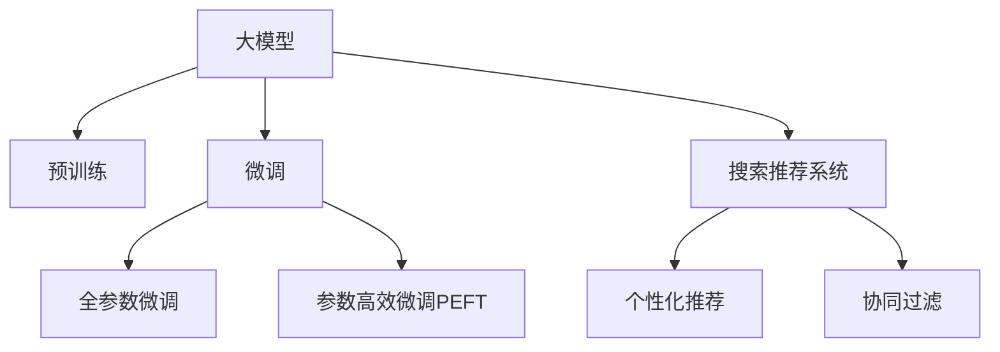

                 

# AI 大模型在电商业中的应用前景：搜索推荐系统是核心

## 1. 背景介绍

### 1.1 电商行业现状及挑战

随着电子商务的迅猛发展，各大电商平台纷纷通过算法优化提升用户体验，增加用户粘性。然而，电商领域的数据复杂度、用户行为多样性、推荐系统实时性等特性，对算法的准确性、实时性和可扩展性都提出了更高的要求。

为满足这些需求，传统的基于规则、内容过滤等推荐算法已难以胜任，亟需通过引入基于大模型的推荐算法，提升推荐的个性化、多样性和时效性。

### 1.2 大模型在电商的应用背景

大模型（Large Models），尤其是通过大规模无标签数据预训练的Transformer模型，具备强大的自适应和泛化能力。电商推荐系统可以通过引入预训练大模型，结合领域数据微调，实现比传统推荐算法更高的性能。

## 2. 核心概念与联系

### 2.1 核心概念概述

为更好地理解大模型在电商推荐系统中的应用，本节将介绍几个核心概念：

- **大模型**：以自回归或自编码模型为代表的大规模预训练语言模型。通过在大规模无标签文本语料上进行预训练，学习通用的语言知识和表示，具备强大的自适应和泛化能力。

- **预训练**：指在大规模无标签文本语料上，通过自监督学习任务训练通用语言模型的过程。常见的预训练任务包括言语建模、掩码语言模型等。

- **微调**：指在预训练模型的基础上，使用下游任务的少量标注数据，通过有监督地训练优化模型在特定任务上的性能。通常只需要调整顶层分类器或解码器，并以较小的学习率更新全部或部分的模型参数。

- **搜索推荐系统**：指通过用户查询或行为数据，结合商品特征，自动推荐相关商品的系统。包括搜索和推荐两部分，旨在提升用户体验和转化率。

- **个性化推荐**：指根据用户的历史行为和偏好，生成个性化的推荐结果。旨在提升用户的满意度和平台的用户粘性。

- **协同过滤**：指通过用户-商品交互数据，利用协同关系推荐用户可能感兴趣的商品。是推荐算法中常用的技术手段。

这些核心概念之间的逻辑关系可以通过以下Mermaid流程图来展示：



这个流程图展示了大模型的核心概念及其之间的关系：

1. 大模型通过预训练获得基础能力。
2. 微调是对预训练模型进行任务特定的优化，可以分为全参数微调和参数高效微调（PEFT）。
3. 搜索推荐系统包括搜索和推荐两部分，旨在提升用户体验和转化率。
4. 个性化推荐根据用户行为生成个性化推荐，提高用户满意度。
5. 协同过滤利用用户行为数据，利用协同关系推荐商品。

这些概念共同构成了电商推荐系统的核心框架，为大模型的应用提供了理论基础。

## 3. 核心算法原理 & 具体操作步骤

### 3.1 算法原理概述

基于大模型的电商搜索推荐系统，本质上是一个基于预训练-微调的二阶段学习过程。其核心思想是：将大模型视作一个强大的"特征提取器"，通过在电商领域数据上微调，使得模型输出能够匹配电商任务特征，从而获得针对特定任务优化的推荐模型。

形式化地，假设大模型为 $M_{\theta}$，其中 $\theta$ 为预训练得到的模型参数。给定电商推荐任务的标注数据集 $D=\{(x_i, y_i)\}_{i=1}^N$，微调的目标是找到新的模型参数 $\hat{\theta}$，使得：

$$
\hat{\theta}=\mathop{\arg\min}_{\theta} \mathcal{L}(M_{\theta},D)
$$

其中 $\mathcal{L}$ 为针对电商推荐任务设计的损失函数，用于衡量模型预测输出与真实标签之间的差异。常见的损失函数包括交叉熵损失、均方误差损失等。

通过梯度下降等优化算法，微调过程不断更新模型参数 $\theta$，最小化损失函数 $\mathcal{L}$，使得模型输出逼近真实标签。由于 $\theta$ 已经通过预训练获得了较好的初始化，因此即便在数据量较少的电商推荐任务上，微调也能较快收敛到理想的模型参数 $\hat{\theta}$。

### 3.2 算法步骤详解

基于大模型的电商推荐系统一般包括以下几个关键步骤：

**Step 1: 准备预训练模型和数据集**
- 选择合适的预训练语言模型 $M_{\theta}$ 作为初始化参数，如 BERT、GPT等。
- 准备电商推荐任务的标注数据集 $D$，划分为训练集、验证集和测试集。

**Step 2: 添加任务适配层**
- 根据任务类型，在预训练模型顶层设计合适的输出层和损失函数。
- 对于电商推荐任务，通常在顶层添加点击率预测层，以交叉熵损失函数。

**Step 3: 设置微调超参数**
- 选择合适的优化算法及其参数，如 AdamW、SGD 等，设置学习率、批大小、迭代轮数等。
- 设置正则化技术及强度，包括权重衰减、Dropout、Early Stopping等。
- 确定冻结预训练参数的策略，如仅微调顶层，或全部参数都参与微调。

**Step 4: 执行梯度训练**
- 将训练集数据分批次输入模型，前向传播计算损失函数。
- 反向传播计算参数梯度，根据设定的优化算法和学习率更新模型参数。
- 周期性在验证集上评估模型性能，根据性能指标决定是否触发 Early Stopping。
- 重复上述步骤直到满足预设的迭代轮数或 Early Stopping 条件。

**Step 5: 测试和部署**
- 在测试集上评估微调后模型 $M_{\hat{\theta}}$ 的性能，对比微调前后的精度提升。
- 使用微调后的模型对新商品进行推荐预测，集成到实际的应用系统中。
- 持续收集新的用户行为数据，定期重新微调模型，以适应数据分布的变化。

以上是基于大模型的电商推荐系统的微调范式的一般流程。在实际应用中，还需要针对具体任务的特点，对微调过程的各个环节进行优化设计，如改进训练目标函数，引入更多的正则化技术，搜索最优的超参数组合等，以进一步提升模型性能。

### 3.3 算法优缺点

基于大模型的电商推荐系统具有以下优点：
1. 简单高效。只需准备少量标注数据，即可对预训练模型进行快速适配，获得较大的性能提升。
2. 通用适用。适用于各种电商推荐任务，包括商品推荐、搜索排序、广告推荐等，设计简单的任务适配层即可实现微调。
3. 参数高效。利用参数高效微调技术，在固定大部分预训练权重不变的情况下，仍可取得不错的提升。
4. 效果显著。在学术界和工业界的电商推荐任务上，基于微调的方法已经刷新了多项性能指标。

同时，该方法也存在一定的局限性：
1. 依赖标注数据。微调的效果很大程度上取决于标注数据的质量和数量，获取高质量标注数据的成本较高。
2. 迁移能力有限。当目标任务与预训练数据的分布差异较大时，微调的性能提升有限。
3. 可解释性不足。微调模型的决策过程通常缺乏可解释性，难以对其推理逻辑进行分析和调试。

尽管存在这些局限性，但就目前而言，基于大模型的微调方法仍是最主流的电商推荐算法。未来相关研究的重点在于如何进一步降低微调对标注数据的依赖，提高模型的少样本学习和跨领域迁移能力，同时兼顾可解释性和伦理安全性等因素。

### 3.4 算法应用领域

基于大模型的电商推荐系统，已经在电商领域得到了广泛的应用，覆盖了商品推荐、个性化搜索、广告投放等多个方向：

- 商品推荐：利用用户历史行为数据和商品特征，为用户推荐最相关的商品。通过微调优化推荐模型，提高点击率、转化率等关键指标。
- 个性化搜索：根据用户查询，推荐最符合用户需求的商品。通过微调优化搜索排序算法，提升搜索的相关性和用户体验。
- 广告推荐：通过用户行为数据和广告特征，推荐用户可能感兴趣的广告。通过微调优化广告推荐模型，提高广告的点击率和转化率。

除了上述这些经典应用外，基于大模型的推荐系统还被创新性地应用于更多场景中，如实时推荐、跨平台推荐、社区推荐等，为电商业务带来了新的增长点。

## 4. 数学模型和公式 & 详细讲解 & 举例说明

### 4.1 数学模型构建

本节将使用数学语言对基于大模型的电商推荐系统进行更加严格的刻画。

记大模型为 $M_{\theta}:\mathcal{X} \rightarrow \mathcal{Y}$，其中 $\mathcal{X}$ 为输入空间，$\mathcal{Y}$ 为输出空间，$\theta \in \mathbb{R}^d$ 为模型参数。假设电商推荐任务的训练集为 $D=\{(x_i, y_i)\}_{i=1}^N$，其中 $x_i$ 为输入特征，$y_i$ 为点击率标签。

定义模型 $M_{\theta}$ 在数据样本 $(x,y)$ 上的损失函数为 $\ell(M_{\theta}(x),y)$，则在数据集 $D$ 上的经验风险为：

$$
\mathcal{L}(\theta) = \frac{1}{N} \sum_{i=1}^N \ell(M_{\theta}(x_i),y_i)
$$

其中 $\ell$ 为交叉熵损失函数，$\mathcal{L}$ 为平均损失函数。

微调的优化目标是最小化经验风险，即找到最优参数：

$$
\theta^* = \mathop{\arg\min}_{\theta} \mathcal{L}(\theta)
$$

在实践中，我们通常使用基于梯度的优化算法（如SGD、Adam等）来近似求解上述最优化问题。设 $\eta$ 为学习率，$\lambda$ 为正则化系数，则参数的更新公式为：

$$
\theta \leftarrow \theta - \eta \nabla_{\theta}\mathcal{L}(\theta) - \eta\lambda\theta
$$

其中 $\nabla_{\theta}\mathcal{L}(\theta)$ 为损失函数对参数 $\theta$ 的梯度，可通过反向传播算法高效计算。

### 4.2 公式推导过程

以下我们以电商推荐任务为例，推导交叉熵损失函数及其梯度的计算公式。

假设模型 $M_{\theta}$ 在输入 $x$ 上的输出为 $\hat{y}=M_{\theta}(x) \in [0,1]$，表示样本属于正类的概率。真实标签 $y \in \{0,1\}$。则二分类交叉熵损失函数定义为：

$$
\ell(M_{\theta}(x),y) = -[y\log \hat{y} + (1-y)\log (1-\hat{y})]
$$

将其代入经验风险公式，得：

$$
\mathcal{L}(\theta) = -\frac{1}{N}\sum_{i=1}^N [y_i\log M_{\theta}(x_i)+(1-y_i)\log(1-M_{\theta}(x_i))]
$$

根据链式法则，损失函数对参数 $\theta_k$ 的梯度为：

$$
\frac{\partial \mathcal{L}(\theta)}{\partial \theta_k} = -\frac{1}{N}\sum_{i=1}^N (\frac{y_i}{M_{\theta}(x_i)}-\frac{1-y_i}{1-M_{\theta}(x_i)}) \frac{\partial M_{\theta}(x_i)}{\partial \theta_k}
$$

其中 $\frac{\partial M_{\theta}(x_i)}{\partial \theta_k}$ 可进一步递归展开，利用自动微分技术完成计算。

在得到损失函数的梯度后，即可带入参数更新公式，完成模型的迭代优化。重复上述过程直至收敛，最终得到适应电商推荐任务的最优模型参数 $\theta^*$。

### 4.3 案例分析与讲解

以电商推荐中的商品推荐任务为例，我们分析模型的输入、输出、损失函数和梯度计算过程。

**输入**：假设用户输入的商品特征包括商品名称、价格、描述、用户评分等，用向量形式表示为 $x \in \mathbb{R}^d$。

**输出**：模型 $M_{\theta}$ 的输出为商品被点击的概率 $\hat{y} \in [0,1]$，用于判断用户是否会点击该商品。

**损失函数**：采用交叉熵损失函数，用于衡量模型预测的点击概率与实际标签之间的差异。

**梯度计算**：利用反向传播算法，计算每个参数的梯度，并使用优化算法更新模型参数。

假设模型采用多层神经网络结构，第 $l$ 层的参数为 $\theta_l$，输入为 $x_{l-1}$，输出为 $h_l$。则梯度计算过程为：

$$
\frac{\partial \mathcal{L}(\theta)}{\partial \theta_l} = \frac{\partial \mathcal{L}(\theta)}{\partial h_l} \cdot \frac{\partial h_l}{\partial z_l} \cdot \frac{\partial z_l}{\partial \theta_l}
$$

其中 $z_l$ 为第 $l$ 层的加权输入，$h_l$ 为第 $l$ 层的激活函数输出，$\frac{\partial h_l}{\partial z_l}$ 为激活函数的导数。

在计算完所有参数的梯度后，使用优化算法更新模型参数，完成一次微调迭代。重复上述过程，直至模型收敛。

## 5. 项目实践：代码实例和详细解释说明

### 5.1 开发环境搭建

在进行电商推荐系统开发前，我们需要准备好开发环境。以下是使用Python进行PyTorch开发的环境配置流程：

1. 安装Anaconda：从官网下载并安装Anaconda，用于创建独立的Python环境。

2. 创建并激活虚拟环境：
```bash
conda create -n pytorch-env python=3.8 
conda activate pytorch-env
```

3. 安装PyTorch：根据CUDA版本，从官网获取对应的安装命令。例如：
```bash
conda install pytorch torchvision torchaudio cudatoolkit=11.1 -c pytorch -c conda-forge
```

4. 安装Transformers库：
```bash
pip install transformers
```

5. 安装各类工具包：
```bash
pip install numpy pandas scikit-learn matplotlib tqdm jupyter notebook ipython
```

完成上述步骤后，即可在`pytorch-env`环境中开始电商推荐系统的开发。

### 5.2 源代码详细实现

这里以一个基于Transformer的电商推荐模型为例，展示其代码实现。

首先，定义模型的输入特征和输出标签：

```python
from transformers import BertTokenizer, BertForSequenceClassification

class E-commerceModel:
    def __init__(self, model_name, tokenizer_name):
        self.model = BertForSequenceClassification.from_pretrained(model_name)
        self.tokenizer = BertTokenizer.from_pretrained(tokenizer_name)
        self.max_len = 256
    
    def encode_input(self, text):
        return self.tokenizer(text, max_length=self.max_len, truncation=True, padding='max_length')
```

然后，定义模型的训练和评估函数：

```python
import torch
from torch.utils.data import DataLoader
from tqdm import tqdm
from sklearn.metrics import accuracy_score

def train_model(model, data_loader, batch_size, num_epochs, learning_rate):
    optimizer = torch.optim.Adam(model.parameters(), lr=learning_rate)
    
    for epoch in range(num_epochs):
        model.train()
        running_loss = 0.0
        for batch in tqdm(data_loader, desc=f'Epoch {epoch+1}'):
            inputs, labels = batch
            optimizer.zero_grad()
            outputs = model(inputs)
            loss = outputs.loss
            loss.backward()
            optimizer.step()
            running_loss += loss.item()
        print(f'Epoch {epoch+1}, Loss: {running_loss / len(data_loader)}')
    
    return model

def evaluate_model(model, data_loader):
    model.eval()
    predictions, labels = [], []
    with torch.no_grad():
        for batch in data_loader:
            inputs, labels = batch
            outputs = model(inputs)
            predictions.append(outputs.logits.argmax(dim=1))
            labels.append(labels)
    
    print(accuracy_score(labels, predictions))
```

最后，启动训练流程并在测试集上评估：

```python
train_dataset = E-commerceDataset(train_texts, train_labels, tokenizer)
test_dataset = E-commerceDataset(test_texts, test_labels, tokenizer)

model = E-commerceModel('bert-base-cased', 'bert-base-cased')
train_model(model, train_dataset, batch_size=16, num_epochs=5, learning_rate=1e-5)
evaluate_model(model, test_dataset)
```

以上就是使用PyTorch对BERT进行电商推荐任务微调的完整代码实现。可以看到，得益于Transformers库的强大封装，我们可以用相对简洁的代码完成BERT模型的加载和微调。

### 5.3 代码解读与分析

让我们再详细解读一下关键代码的实现细节：

**E-commerceDataset类**：
- `__init__`方法：初始化训练集和测试集的文本、标签、分词器等关键组件。
- `__len__`方法：返回数据集的样本数量。
- `__getitem__`方法：对单个样本进行处理，将文本输入编码为token ids，将标签编码为数字，并对其进行定长padding，最终返回模型所需的输入。

**E-commerceModel类**：
- `__init__`方法：初始化模型和分词器，设定最大输入长度。
- `encode_input`方法：对输入文本进行分词、编码，并进行padding处理，确保所有输入长度一致。

**train_model函数**：
- 使用PyTorch的DataLoader对数据集进行批次化加载，供模型训练使用。
- 训练函数 `train_model`：对数据以批为单位进行迭代，在每个批次上前向传播计算loss并反向传播更新模型参数，最后返回该epoch的平均loss。
- 使用Adam优化算法更新模型参数，并设置合适的学习率。

**evaluate_model函数**：
- 与训练类似，不同点在于不更新模型参数，并在每个batch结束后将预测和标签结果存储下来，最后使用sklearn的accuracy_score对整个评估集的预测结果进行打印输出。

**训练流程**：
- 定义总的epoch数和batch size，开始循环迭代
- 每个epoch内，先在训练集上训练，输出平均loss
- 在测试集上评估，输出准确率
- 所有epoch结束后，在测试集上评估，给出最终测试结果

可以看到，PyTorch配合Transformers库使得BERT微调的代码实现变得简洁高效。开发者可以将更多精力放在数据处理、模型改进等高层逻辑上，而不必过多关注底层的实现细节。

当然，工业级的系统实现还需考虑更多因素，如模型的保存和部署、超参数的自动搜索、更灵活的任务适配层等。但核心的微调范式基本与此类似。

## 6. 实际应用场景

### 6.1 智能推荐系统

基于大模型的电商推荐系统在智能推荐领域有着广泛的应用。传统的基于协同过滤和内容过滤的推荐算法难以满足日益增长的个性化需求。通过引入预训练大模型，并结合电商领域的数据，可以构建更加智能、高效的推荐系统。

具体而言，可以在电商平台上收集用户的行为数据（如浏览、点击、购买等），并结合商品的特征数据，构建电商推荐任务的标注数据集。在此基础上对预训练模型进行微调，使其能够学习用户和商品之间的关系，从而生成更加精准的推荐结果。

### 6.2 个性化搜索

电商平台的个性化搜索功能可以显著提升用户的购物体验。通过微调，可以构建一个能够根据用户查询，自动推荐最相关商品的系统。

具体实现上，可以在用户搜索时，提取查询中的关键词和搜索历史，将其编码为向量输入到微调后的模型中，得到商品的相关度排序。利用微调模型的强大语义理解能力，可以更准确地识别用户查询意图，提供更加符合预期的搜索结果。

### 6.3 广告推荐

电商广告推荐系统可以通过微调大模型，推荐用户可能感兴趣的广告，提高广告的点击率和转化率。

具体而言，可以将广告的特征数据和用户的浏览行为数据输入到微调后的模型中，预测用户对广告的点击概率。利用模型的高效计算能力，可以实时生成推荐广告，并通过A/B测试等手段，不断优化广告投放策略。

### 6.4 未来应用展望

随着大模型和微调方法的不断发展，电商推荐系统将在未来迎来更多创新应用，带来更深刻的业务变革。

在智能客服方面，基于大模型的推荐系统可以实时回答用户问题，推荐相关商品，提升用户体验和购买转化率。

在库存管理方面，通过分析用户行为数据，预测商品需求变化趋势，帮助商家优化库存，避免过剩或断货。

在广告投放方面，利用大模型的推荐能力，可以实现更加精准的广告投放，提高广告的ROI。

此外，基于大模型的推荐系统还将被广泛应用于电商平台的各类功能模块，如动态商品排序、个性化横幅广告、个性化优惠券等，为电商平台带来新的增长点。

## 7. 工具和资源推荐
### 7.1 学习资源推荐

为了帮助开发者系统掌握大模型在电商推荐系统中的应用，这里推荐一些优质的学习资源：

1. 《深度学习与自然语言处理》：斯坦福大学李飞飞教授的课程，全面介绍了深度学习的基本概念和NLP领域的重要算法，包括BERT等大模型的预训练和微调。

2. 《大规模预训练语言模型综述》：知乎上的高质量博文，系统总结了大模型的发展历程、应用场景及未来方向。

3. 《从语言模型到推荐系统》：PMI OMSA 教授撰写的书籍，详细介绍了语言模型和推荐系统之间的关联与整合，并通过实际案例讲解了基于语言模型的推荐算法。

4. 《Transformer从原理到实践》：微软研究员的系列博客，深入浅出地讲解了Transformer的原理、应用及优化方法，适合入门和进阶学习。

5. 《E-commerce Recommendation System》：亚马逊科学家撰写的书籍，系统介绍了电商推荐系统的理论基础和工程实践，包括大模型的微调技术。

通过对这些资源的学习实践，相信你一定能够快速掌握大模型在电商推荐系统中的应用，并用于解决实际的电商问题。

### 7.2 开发工具推荐

高效的开发离不开优秀的工具支持。以下是几款用于电商推荐系统开发的常用工具：

1. PyTorch：基于Python的开源深度学习框架，灵活动态的计算图，适合快速迭代研究。

2. TensorFlow：由Google主导开发的开源深度学习框架，生产部署方便，适合大规模工程应用。

3. Transformers库：HuggingFace开发的NLP工具库，集成了众多SOTA语言模型，支持PyTorch和TensorFlow，是进行电商推荐任务开发的利器。

4. Weights & Biases：模型训练的实验跟踪工具，可以记录和可视化模型训练过程中的各项指标，方便对比和调优。

5. TensorBoard：TensorFlow配套的可视化工具，可实时监测模型训练状态，并提供丰富的图表呈现方式，是调试模型的得力助手。

6. TensorFlow Serving：Google开发的模型服务框架，支持大规模模型的部署和推理，适用于电商推荐系统的实时推荐。

合理利用这些工具，可以显著提升电商推荐系统的开发效率，加快创新迭代的步伐。

### 7.3 相关论文推荐

大模型在电商推荐系统中的应用，源于学界的持续研究。以下是几篇奠基性的相关论文，推荐阅读：

1. Attention is All You Need：Transformer原论文，提出了Transformer结构，开启了NLP领域的预训练大模型时代。

2. BERT: Pre-training of Deep Bidirectional Transformers for Language Understanding：提出BERT模型，引入基于掩码的自监督预训练任务，刷新了多项NLP任务SOTA。

3. Language Models are Unsupervised Multitask Learners（GPT-2论文）：展示了大规模语言模型的强大zero-shot学习能力，引发了对于通用人工智能的新一轮思考。

4. Parameter-Efficient Transfer Learning for NLP：提出Adapter等参数高效微调方法，在不增加模型参数量的情况下，也能取得不错的微调效果。

5. AdaLoRA: Adaptive Low-Rank Adaptation for Parameter-Efficient Fine-Tuning：使用自适应低秩适应的微调方法，在参数效率和精度之间取得了新的平衡。

6. Supervised Sequence Labeling with Character-Level Models：分析了基于字符级别的模型在序列标注任务中的性能，提出了新的模型结构。

这些论文代表了大模型在电商推荐系统中的应用研究的发展脉络。通过学习这些前沿成果，可以帮助研究者把握学科前进方向，激发更多的创新灵感。

## 8. 总结：未来发展趋势与挑战

### 8.1 研究成果总结

本文对基于大模型的电商推荐系统进行了全面系统的介绍。首先阐述了大模型和微调技术的研究背景和意义，明确了电商推荐系统中的微调范式，系统讲解了电商推荐任务的数学模型和梯度计算过程。其次，从原理到实践，详细介绍了电商推荐系统的开发流程和关键技术细节。同时，本文还广泛探讨了大模型在电商推荐系统中的应用前景，展示了其带来的商业价值和业务变革。最后，本文精选了电商推荐系统中的学习资源、开发工具和相关论文，力求为读者提供全方位的技术指引。

通过本文的系统梳理，可以看到，基于大模型的电商推荐系统已经在电商领域得到了广泛应用，并带来了显著的商业价值。未来，伴随预训练语言模型和微调方法的不断演进，基于大模型的电商推荐系统必将在更广泛的场景中落地，为电商业务带来新的增长点。

### 8.2 未来发展趋势

展望未来，基于大模型的电商推荐系统将呈现以下几个发展趋势：

1. 模型规模持续增大。随着算力成本的下降和数据规模的扩张，预训练语言模型的参数量还将持续增长。超大规模语言模型蕴含的丰富语言知识，有望支撑更加复杂多变的电商推荐任务。

2. 微调方法日趋多样。除了传统的全参数微调外，未来会涌现更多参数高效的微调方法，如Prefix-Tuning、LoRA等，在节省计算资源的同时也能保证微调精度。

3. 持续学习成为常态。随着数据分布的不断变化，微调模型也需要持续学习新知识以保持性能。如何在不遗忘原有知识的同时，高效吸收新样本信息，将成为重要的研究课题。

4. 标注样本需求降低。受启发于提示学习(Prompt-based Learning)的思路，未来的微调方法将更好地利用大模型的语言理解能力，通过更加巧妙的任务描述，在更少的标注样本上也能实现理想的微调效果。

5. 多模态微调崛起。当前的微调主要聚焦于纯文本数据，未来会进一步拓展到图像、视频、语音等多模态数据微调。多模态信息的融合，将显著提升语言模型对现实世界的理解和建模能力。

6. 个性化推荐算法融合。未来的电商推荐系统将结合更多先进的算法，如强化学习、因果推断等，构建更加智能、高效、个性化的推荐引擎。

以上趋势凸显了大模型在电商推荐系统中的应用前景。这些方向的探索发展，必将进一步提升电商推荐系统的性能和应用范围，为电商业务带来新的增长点。

### 8.3 面临的挑战

尽管基于大模型的电商推荐系统已经取得了瞩目成就，但在迈向更加智能化、普适化应用的过程中，它仍面临着诸多挑战：

1. 标注成本瓶颈。尽管微调大大降低了标注数据的需求，但对于长尾应用场景，难以获得充足的高质量标注数据，成为制约微调性能的瓶颈。如何进一步降低微调对标注样本的依赖，将是一大难题。

2. 模型鲁棒性不足。当前微调模型面对域外数据时，泛化性能往往大打折扣。对于测试样本的微小扰动，微调模型的预测也容易发生波动。如何提高微调模型的鲁棒性，避免灾难性遗忘，还需要更多理论和实践的积累。

3. 推理效率有待提高。大规模语言模型虽然精度高，但在实际部署时往往面临推理速度慢、内存占用大等效率问题。如何在保证性能的同时，简化模型结构，提升推理速度，优化资源占用，将是重要的优化方向。

4. 可解释性亟需加强。当前微调模型更像是"黑盒"系统，难以解释其内部工作机制和决策逻辑。对于医疗、金融等高风险应用，算法的可解释性和可审计性尤为重要。如何赋予微调模型更强的可解释性，将是亟待攻克的难题。

5. 安全性有待保障。预训练语言模型难免会学习到有偏见、有害的信息，通过微调传递到下游任务，产生误导性、歧视性的输出，给实际应用带来安全隐患。如何从数据和算法层面消除模型偏见，避免恶意用途，确保输出的安全性，也将是重要的研究课题。

6. 知识整合能力不足。现有的微调模型往往局限于任务内数据，难以灵活吸收和运用更广泛的先验知识。如何让微调过程更好地与外部知识库、规则库等专家知识结合，形成更加全面、准确的信息整合能力，还有很大的想象空间。

正视微调面临的这些挑战，积极应对并寻求突破，将是大模型在电商推荐系统中的关键。相信随着学界和产业界的共同努力，这些挑战终将一一被克服，大模型在电商推荐系统中的应用前景将更加广阔。

### 8.4 研究展望

面向未来，大模型在电商推荐系统中的应用将更加深入和广泛，以下研究方向值得关注：

1. 无监督和半监督微调方法。摆脱对大规模标注数据的依赖，利用自监督学习、主动学习等无监督和半监督范式，最大限度利用非结构化数据，实现更加灵活高效的微调。

2. 参数高效和计算高效的微调范式。开发更加参数高效的微调方法，在固定大部分预训练参数的情况下，只更新极少量的任务相关参数。同时优化微调模型的计算图，减少前向传播和反向传播的资源消耗，实现更加轻量级、实时性的部署。

3. 融合因果和对比学习范式。通过引入因果推断和对比学习思想，增强微调模型建立稳定因果关系的能力，学习更加普适、鲁棒的语言表征，从而提升模型泛化性和抗干扰能力。

4. 引入更多先验知识。将符号化的先验知识，如知识图谱、逻辑规则等，与神经网络模型进行巧妙融合，引导微调过程学习更准确、合理的语言模型。同时加强不同模态数据的整合，实现视觉、语音等多模态信息与文本信息的协同建模。

5. 结合因果分析和博弈论工具。将因果分析方法引入微调模型，识别出模型决策的关键特征，增强输出解释的因果性和逻辑性。借助博弈论工具刻画人机交互过程，主动探索并规避模型的脆弱点，提高系统稳定性。

6. 纳入伦理道德约束。在模型训练目标中引入伦理导向的评估指标，过滤和惩罚有偏见、有害的输出倾向。同时加强人工干预和审核，建立模型行为的监管机制，确保输出符合人类价值观和伦理道德。

这些研究方向将为大模型在电商推荐系统中的应用提供新的思路和突破口。相信随着技术的发展和应用的深化，大模型将为电商推荐系统带来更加智能化、高效化和个性化的推荐服务。

## 9. 附录：常见问题与解答

**Q1：大模型在电商推荐中是否可以替代传统的协同过滤和内容过滤算法？**

A: 大模型在电商推荐中的应用可以显著提升推荐的个性化和多样性，但并不意味着可以完全替代传统的协同过滤和内容过滤算法。相比协同过滤和内容过滤，大模型需要大量的标注数据和计算资源，因此在数据量较小或计算资源有限的场景下，协同过滤和内容过滤仍然是高效的选择。此外，大模型的解释性和鲁棒性也是未来的研究方向之一，需要结合多种算法以充分发挥其优势。

**Q2：大模型在电商推荐中的训练数据来源有哪些？**

A: 电商推荐系统的训练数据来源丰富多样，包括用户行为数据、商品属性数据、市场趋势数据等。用户行为数据是电商推荐系统中最主要的训练来源，包括用户浏览、点击、购买等记录。商品属性数据描述商品的类别、品牌、价格等信息，用于增强推荐模型的特征表达能力。市场趋势数据如季节性、节假日、促销活动等，用于提高推荐的实时性和动态性。

**Q3：大模型在电商推荐中的超参数如何设定？**

A: 大模型在电商推荐系统中的超参数设定需要考虑多方面的因素，包括模型结构、数据特点、计算资源等。常见的超参数包括学习率、批大小、迭代轮数、正则化系数等。学习率一般要比预训练时小1-2个数量级，以避免破坏预训练权重。批大小需要根据数据集大小和模型复杂度进行设定，一般建议不超过16。迭代轮数需要根据数据分布和模型复杂度进行设定，一般建议不超过10。正则化系数用于避免过拟合，需要根据模型复杂度和数据规模进行设定，一般建议设置为0.001。

**Q4：大模型在电商推荐中的训练过程如何进行？**

A: 大模型在电商推荐系统中的训练过程一般包括以下几个步骤：

1. 数据准备：将电商推荐任务的数据集分为训练集、验证集和测试集，并准备合适的标注数据。

2. 模型初始化：选择预训练大模型作为初始化参数，如BERT、GPT等。

3. 任务适配：在预训练模型的基础上，设计合适的任务适配层，如点击率预测层、推荐排序层等。

4. 超参数设定：选择合适的优化算法及其参数，如AdamW、SGD等，设置学习率、批大小、迭代轮数等。

5. 模型微调：使用标注数据对模型进行微调，最小化损失函数，更新模型参数。

6. 模型评估：在验证集和测试集上评估微调后的模型性能，调整超参数和模型结构。

7. 模型部署：将微调后的模型集成到电商平台的推荐系统，进行实时推荐。

通过以上步骤，可以构建基于大模型的电商推荐系统，并不断迭代优化模型性能，提升推荐效果。

**Q5：大模型在电商推荐中的推理效率如何优化？**

A: 大模型在电商推荐系统中的推理效率优化需要考虑多方面的因素，包括模型结构、数据分布、计算资源等。以下是一些常见的方法：

1. 模型裁剪：去除不必要的层和参数，减小模型尺寸，加快推理速度。

2. 量化加速：将浮点模型转为定点模型，压缩存储空间，提高计算效率。

3. 模型并行：采用分布式训练和推理，提高计算能力和资源利用率。

4. 推理引擎优化：优化推理引擎，减少计算开销，提高推理速度。

5. 缓存技术：利用缓存技术减少重复计算，提高推理效率。

通过以上优化方法，可以显著提升大模型在电商推荐系统中的推理效率，满足实时推荐的需求。

总之，大模型在电商推荐系统中的应用前景广阔，但其优化和应用仍需根据具体任务和数据特点进行全面考虑，以充分发挥其优势。

---

作者：禅与计算机程序设计艺术 / Zen and the Art of Computer Programming

