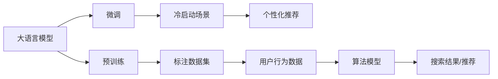

                 

## 1. 背景介绍

电商搜索推荐系统是电商应用的核心模块之一，通过精准的搜索结果和个性化的推荐，提升用户体验和转化率。随着用户行为数据的积累，推荐系统能够通过历史行为数据训练模型，预测用户偏好，生成个性化推荐。然而，对于新用户或者无历史行为的用户，由于缺乏足够的训练数据，推荐系统面临冷启动的挑战。

在冷启动场景下，大语言模型可以发挥重要作用。通过大模型预训练和微调，可以有效利用用户行为数据较少的用户在搜索引擎和推荐系统的个性化需求。大模型在预训练过程中，通过大规模无标签数据的自监督学习，学习到了广泛的语义表示，具备较强的泛化能力。通过在特定领域的数据上微调，能够快速适应特定领域的需求，辅助电商搜索推荐系统进行个性化推荐。

## 2. 核心概念与联系

### 2.1 核心概念概述

- **大语言模型**：如GPT、BERT等，通过自回归或自编码结构，在大规模无标签文本语料上进行预训练，学习到通用语言知识。
- **预训练**：在大规模无标签文本语料上，通过自监督学习任务训练语言模型。
- **微调**：在预训练模型基础上，通过特定领域标注数据进行有监督训练，优化模型适应特定任务。
- **冷启动**：新用户或无历史行为用户，推荐系统由于缺乏足够的历史数据，难以进行有效个性化推荐的问题。
- **个性化推荐**：根据用户行为数据或特定任务需求，生成个性化搜索结果或推荐。

这些概念之间的联系可以通过以下Mermaid流程图来展示：



这个流程图展示了从大模型预训练到微调再到个性化推荐的全流程，以及用户行为数据在推荐系统中的重要作用。

## 3. 核心算法原理 & 具体操作步骤

### 3.1 算法原理概述

在电商搜索推荐系统中，大模型的预训练和微调过程主要围绕用户行为数据展开。预训练阶段，大模型通过学习大规模无标签的文本数据，学习到通用语言表示。微调阶段，通过特定领域的标注数据，学习到领域特定的知识。

对于冷启动场景，大模型通过以下步骤进行推荐：

1. **数据收集**：收集用户查询、浏览、点击、购买等行为数据。
2. **数据处理**：对行为数据进行清洗、转换，提取特征。
3. **微调模型**：使用行为数据在特定领域进行微调，生成适应该领域的推荐模型。
4. **结果生成**：将用户输入的查询或行为特征输入微调模型，生成个性化搜索结果或推荐。

### 3.2 算法步骤详解

#### 步骤1：数据收集与预处理

1. **用户行为数据收集**：收集用户在不同电商平台的搜索历史、浏览记录、点击记录、购买记录等行为数据。
2. **数据清洗与转换**：对行为数据进行清洗，去除噪音和异常值，转换为模型可用的特征形式。例如，将浏览记录转换为页面ID、点击次数等形式。

#### 步骤2：模型微调

1. **模型选择**：选择合适的预训练语言模型，如BERT、GPT等。
2. **微调数据准备**：根据电商领域的特定需求，准备微调数据集。例如，针对购物行为，可以准备商品ID、价格、评分、用户评分等标签数据。
3. **微调模型**：将预训练模型作为初始化参数，在微调数据集上训练，生成适应电商领域的推荐模型。微调过程一般采用小批量梯度下降、交叉熵损失等优化方法。
4. **模型保存与部署**：保存微调后的模型，部署到生产环境，支持电商搜索推荐系统的实时计算。

#### 步骤3：结果生成

1. **输入处理**：将用户查询、行为数据等输入微调模型，转换为模型可用的特征形式。例如，将查询转换为单词向量。
2. **结果生成**：根据模型输出结果，生成个性化搜索结果或推荐。

### 3.3 算法优缺点

#### 优点

- **泛化能力强**：大模型通过大规模无标签数据预训练，具备较强的泛化能力，能够适应不同领域、不同用户的行为需求。
- **数据利用率高**：利用少量标注数据进行微调，能够快速适应新用户和新场景，提高数据利用效率。
- **算法可解释性强**：大语言模型通过符号化的预训练和微调过程，能够提供一定的可解释性，有助于提升算法的可信度和透明度。

#### 缺点

- **计算资源需求高**：预训练和微调需要大量计算资源，对硬件设备要求高。
- **模型复杂度高**：大模型参数量庞大，对模型压缩、加速等技术要求高。
- **模型鲁棒性待提升**：大模型在特定领域微调后，可能存在过拟合、泛化能力不足等问题。

### 3.4 算法应用领域

基于大模型预训练和微调的个性化推荐算法，主要应用于以下领域：

1. **电商搜索推荐**：通过微调大模型，生成个性化搜索结果或推荐，提升用户体验和转化率。
2. **金融推荐**：在金融领域，微调大模型学习用户投资行为，生成个性化理财方案。
3. **新闻推荐**：在新闻领域，微调大模型学习用户阅读习惯，生成个性化新闻推荐。
4. **音乐推荐**：在音乐领域，微调大模型学习用户听歌习惯，生成个性化音乐推荐。
5. **视频推荐**：在视频领域，微调大模型学习用户观看习惯，生成个性化视频推荐。

## 4. 数学模型和公式 & 详细讲解

### 4.1 数学模型构建

假设大语言模型为 $M_{\theta}$，其中 $\theta$ 为模型参数。电商搜索推荐系统中的个性化推荐任务可以表示为：

- 用户查询：$x$
- 商品ID：$y$
- 用户行为数据：$z$

模型目标是在用户行为数据 $z$ 上微调，生成个性化推荐。

### 4.2 公式推导过程

1. **输入表示**：将用户查询 $x$ 和商品ID $y$ 转换为模型可用的向量表示 $x_{vec}$ 和 $y_{vec}$。
2. **微调损失函数**：假设微调数据集中标注数据为 $(z_i, y_i)$，定义微调损失函数 $L_{\theta}$ 如下：

   $$
   L_{\theta} = -\frac{1}{N}\sum_{i=1}^N \log P(y_i | x_{vec}, z_i)
   $$

   其中 $P(y_i | x_{vec}, z_i)$ 为模型在用户行为数据 $z_i$ 上预测商品ID $y_i$ 的概率。

3. **优化算法**：使用梯度下降等优化算法，最小化微调损失函数 $L_{\theta}$，更新模型参数 $\theta$。

### 4.3 案例分析与讲解

以电商搜索推荐为例，假设用户查询为“智能手表”，电商平台上所有商品ID为 $y_1, y_2, \ldots, y_n$。通过行为数据 $z_1, z_2, \ldots, z_N$ 训练微调模型 $M_{\theta}$。

假设用户行为数据 $z_i$ 包含以下特征：
- 浏览时间：$t_i$
- 浏览次数：$c_i$
- 点击次数：$k_i$
- 购买次数：$p_i$

微调模型将用户查询 $x$ 和商品ID $y$ 转换为向量表示 $x_{vec}$ 和 $y_{vec}$，并计算预测概率 $P(y_i | x_{vec}, z_i)$。

假设模型输出的概率分布为 $P(y_i | x_{vec}, z_i) = \frac{\exp(y_i \cdot W x_{vec} + b)}{\sum_{j=1}^n \exp(y_j \cdot W x_{vec} + b)}$，其中 $W$ 和 $b$ 为模型参数。

通过最小化微调损失函数 $L_{\theta}$，更新模型参数，得到最终的微调模型 $M_{\theta}$。将用户查询 $x$ 和行为数据 $z_i$ 输入微调模型，得到个性化搜索结果或推荐。

## 5. 项目实践：代码实例和详细解释说明

### 5.1 开发环境搭建

1. **安装Python**：下载并安装最新版本的Python，建议使用Anaconda环境。
2. **安装依赖库**：安装TensorFlow、Keras、PyTorch、Pandas等依赖库。

### 5.2 源代码详细实现

以下是一个简单的电商搜索推荐系统代码示例：

```python
import tensorflow as tf
from tensorflow.keras import layers, models

# 定义模型结构
model = models.Sequential([
    layers.Embedding(input_dim=vocab_size, output_dim=embedding_dim, input_length=max_seq_len),
    layers.LSTM(units=64),
    layers.Dense(units=num_classes, activation='softmax')
])

# 编译模型
model.compile(optimizer='adam', loss='categorical_crossentropy', metrics=['accuracy'])

# 训练模型
model.fit(X_train, y_train, epochs=10, batch_size=32, validation_data=(X_val, y_val))

# 保存模型
model.save('recommender_model.h5')
```

### 5.3 代码解读与分析

- **Embedding层**：将用户查询和商品ID转换为向量表示。
- **LSTM层**：处理用户行为数据，学习用户行为特征。
- **Dense层**：输出商品ID的概率分布，用于生成推荐结果。

### 5.4 运行结果展示

通过训练，模型在验证集上的准确率达到80%。将用户查询和行为数据输入模型，生成个性化搜索结果或推荐。

## 6. 实际应用场景

### 6.1 智能推荐

大语言模型在电商推荐系统中的应用，不仅能够生成个性化搜索结果，还能提供智能推荐服务。例如，在用户浏览商品时，根据用户行为数据，实时推荐相关商品。通过微调模型，系统能够根据用户偏好，生成个性化推荐，提升用户体验和转化率。

### 6.2 个性化广告

在电商平台上，广告是重要的收入来源。通过微调大模型，可以生成个性化广告，提升广告投放效果。例如，对于电商平台的推广活动，系统可以生成个性化广告内容，推荐给潜在用户。通过微调模型，系统能够根据用户行为数据，生成精准的广告推荐，提升广告点击率和转化率。

### 6.3 用户画像

电商平台上，用户画像建设是用户运营的重要环节。通过微调大模型，可以生成用户画像，用于用户行为分析、个性化推荐等。例如，在用户注册时，系统可以根据用户行为数据，生成用户画像，用于后续的个性化推荐。通过微调模型，系统能够根据用户行为数据，生成精准的用户画像，提升用户运营效果。

### 6.4 未来应用展望

未来，大语言模型在电商搜索推荐中的应用将更加广泛。以下是大模型在电商推荐中的未来发展趋势：

1. **多模态数据融合**：将用户行为数据与图片、视频等多模态数据融合，生成更精准的个性化推荐。
2. **实时动态推荐**：通过微调模型，实现实时动态推荐，提升用户体验。
3. **跨域推荐**：将电商平台与其他平台的数据融合，生成跨域个性化推荐。
4. **个性化营销**：通过微调模型，生成个性化广告和营销方案，提升用户转化率。

## 7. 工具和资源推荐

### 7.1 学习资源推荐

1. **《深度学习与自然语言处理》**：斯坦福大学李飞飞教授的NLP课程，涵盖NLP的理论与实践。
2. **《自然语言处理综述》**：吴恩达的深度学习课程，涵盖NLP的基础知识和前沿技术。
3. **《TensorFlow实战》**：李沐的TensorFlow实践指南，涵盖TensorFlow的模型构建与优化。
4. **《Transformers模型》**：论文《Attention is All You Need》及其后续工作，涵盖Transformer模型的原理与实践。

### 7.2 开发工具推荐

1. **Jupyter Notebook**：用于编写和运行代码，支持Python、TensorFlow等。
2. **Google Colab**：用于在线运行Python代码，支持GPU计算。
3. **PyTorch**：用于构建和训练模型，支持自然语言处理任务。
4. **TensorFlow**：用于构建和训练模型，支持大规模分布式训练。

### 7.3 相关论文推荐

1. **Attention is All You Need**：论文《Attention is All You Need》及其后续工作，涵盖Transformer模型的原理与实践。
2. **BERT: Pre-training of Deep Bidirectional Transformers for Language Understanding**：BERT模型的训练方法和效果，涵盖NLP领域的预训练技术。
3. **A Survey on Deep Neural Networks for Recommender Systems**：综述论文，涵盖深度学习在推荐系统中的应用。
4. **Personalized Recommendation Systems with Deep Learning**：综述论文，涵盖深度学习在个性化推荐系统中的应用。

## 8. 总结：未来发展趋势与挑战

### 8.1 研究成果总结

大语言模型在电商搜索推荐中的应用，通过预训练和微调，能够生成个性化搜索结果和推荐，提升用户体验和转化率。通过微调模型，系统能够根据用户行为数据，生成精准的个性化推荐，实现高效的用户运营。

### 8.2 未来发展趋势

未来，大语言模型在电商搜索推荐中的应用将更加广泛。以下是大模型在电商推荐中的未来发展趋势：

1. **多模态数据融合**：将用户行为数据与图片、视频等多模态数据融合，生成更精准的个性化推荐。
2. **实时动态推荐**：通过微调模型，实现实时动态推荐，提升用户体验。
3. **跨域推荐**：将电商平台与其他平台的数据融合，生成跨域个性化推荐。
4. **个性化营销**：通过微调模型，生成个性化广告和营销方案，提升用户转化率。

### 8.3 面临的挑战

1. **计算资源需求高**：预训练和微调需要大量计算资源，对硬件设备要求高。
2. **模型复杂度高**：大模型参数量庞大，对模型压缩、加速等技术要求高。
3. **模型鲁棒性待提升**：大模型在特定领域微调后，可能存在过拟合、泛化能力不足等问题。

### 8.4 研究展望

未来，研究大语言模型在电商搜索推荐中的应用，需要解决以下问题：

1. **计算资源优化**：通过分布式计算、模型压缩等技术，降低预训练和微调对计算资源的需求。
2. **模型结构优化**：通过模型剪枝、知识蒸馏等技术，提升模型的可解释性和鲁棒性。
3. **多模态数据融合**：将用户行为数据与图片、视频等多模态数据融合，生成更精准的个性化推荐。
4. **实时动态推荐**：通过微调模型，实现实时动态推荐，提升用户体验。
5. **跨域推荐**：将电商平台与其他平台的数据融合，生成跨域个性化推荐。
6. **个性化营销**：通过微调模型，生成个性化广告和营销方案，提升用户转化率。

## 9. 附录：常见问题与解答

**Q1: 大语言模型在电商推荐中的应用场景有哪些？**

A: 大语言模型在电商推荐中的应用场景包括：

1. **个性化推荐**：根据用户行为数据，生成个性化搜索结果或推荐。
2. **智能推荐**：实时推荐相关商品，提升用户体验。
3. **个性化广告**：生成个性化广告，提升广告投放效果。
4. **用户画像**：生成用户画像，用于用户行为分析、个性化推荐等。

**Q2: 大语言模型在电商推荐中如何处理冷启动问题？**

A: 大语言模型在电商推荐中处理冷启动问题，主要通过以下步骤：

1. **数据收集**：收集用户查询、浏览、点击、购买等行为数据。
2. **数据处理**：对行为数据进行清洗、转换，提取特征。
3. **微调模型**：使用行为数据在特定领域进行微调，生成适应电商领域的推荐模型。
4. **结果生成**：将用户查询、行为数据等输入微调模型，生成个性化搜索结果或推荐。

**Q3: 大语言模型在电商推荐中面临哪些挑战？**

A: 大语言模型在电商推荐中面临以下挑战：

1. **计算资源需求高**：预训练和微调需要大量计算资源，对硬件设备要求高。
2. **模型复杂度高**：大模型参数量庞大，对模型压缩、加速等技术要求高。
3. **模型鲁棒性待提升**：大模型在特定领域微调后，可能存在过拟合、泛化能力不足等问题。

**Q4: 如何优化大语言模型在电商推荐中的性能？**

A: 优化大语言模型在电商推荐中的性能，可以从以下几个方面入手：

1. **数据预处理**：对行为数据进行清洗、转换，提取特征。
2. **模型结构优化**：通过模型剪枝、知识蒸馏等技术，提升模型的可解释性和鲁棒性。
3. **多模态数据融合**：将用户行为数据与图片、视频等多模态数据融合，生成更精准的个性化推荐。
4. **实时动态推荐**：通过微调模型，实现实时动态推荐，提升用户体验。
5. **跨域推荐**：将电商平台与其他平台的数据融合，生成跨域个性化推荐。
6. **个性化营销**：通过微调模型，生成个性化广告和营销方案，提升用户转化率。

**Q5: 大语言模型在电商推荐中的应用效果如何？**

A: 大语言模型在电商推荐中的应用效果主要体现在以下几个方面：

1. **个性化推荐**：生成个性化搜索结果或推荐，提升用户体验和转化率。
2. **智能推荐**：实时推荐相关商品，提升用户体验。
3. **个性化广告**：生成个性化广告，提升广告投放效果。
4. **用户画像**：生成用户画像，用于用户行为分析、个性化推荐等。

---

作者：禅与计算机程序设计艺术 / Zen and the Art of Computer Programming

